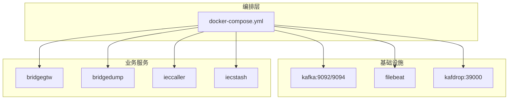
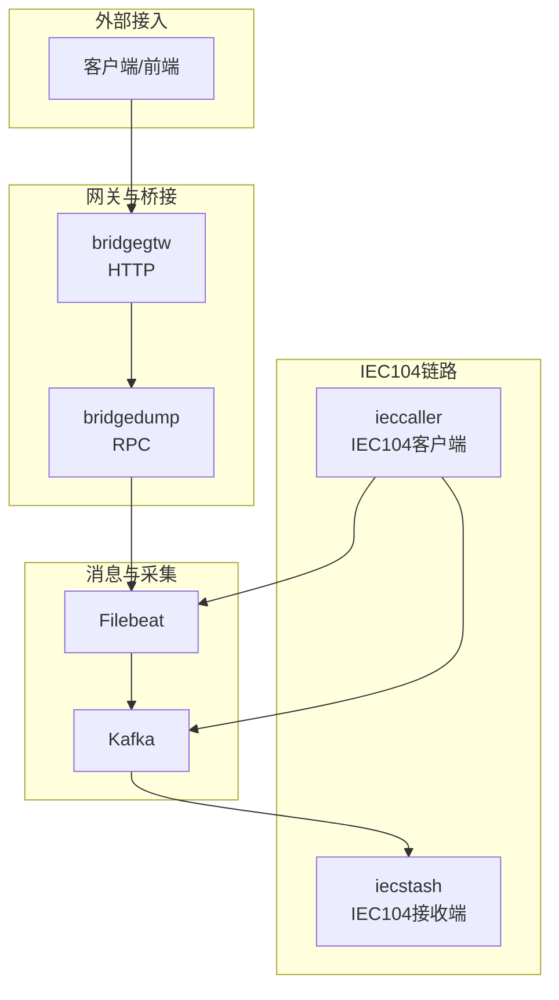
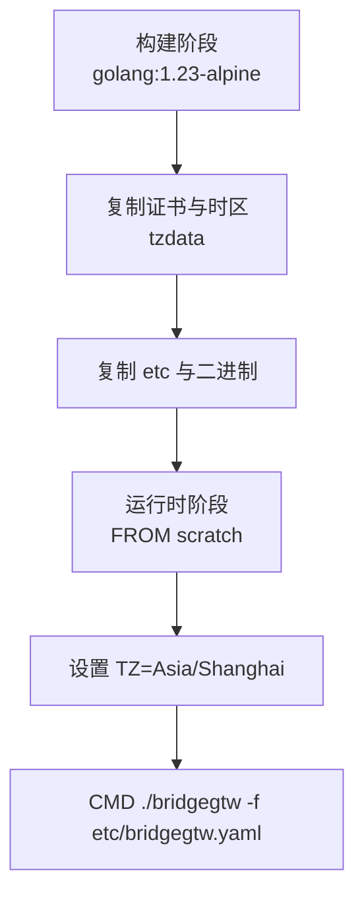
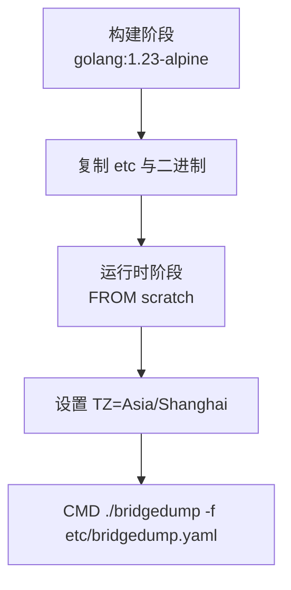
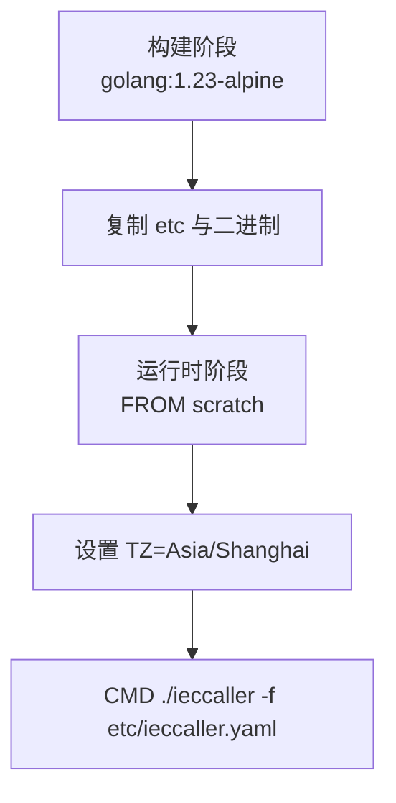
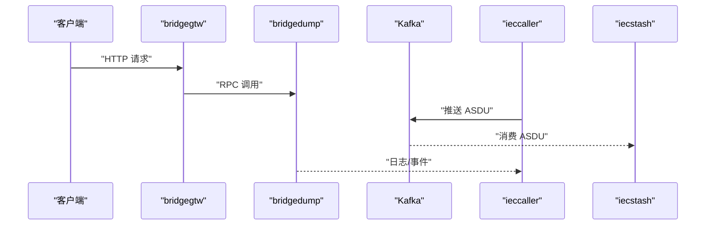

# 容器化部署

<cite>
**本文引用的文件**
- [docker-compose.yml](file://deploy/docker-compose.yml)
- [bridgegtw/Dockerfile](file://app/bridgegtw/Dockerfile)
- [bridgedump/Dockerfile](file://app/bridgedump/Dockerfile)
- [ieccaller/Dockerfile](file://app/ieccaller/Dockerfile)
- [iecstash/Dockerfile](file://app/iecstash/Dockerfile)
- [bridgegtw.yaml](file://app/bridgegtw/etc/bridgegtw.yaml)
- [bridgedump.yaml](file://app/bridgedump/etc/bridgedump.yaml)
- [ieccaller.yaml](file://app/ieccaller/etc/ieccaller.yaml)
- [iecstash.yaml](file://app/iecstash/etc/iecstash.yaml)
- [deploy.sh（ieccaller）](file://app/ieccaller/deploy.sh)
- [deploy.sh（iecstash）](file://app/iecstash/deploy.sh)
- [Taskfile-docker.yml](file://util/Taskfile-docker.yml)
- [main.go（容器管理工具）](file://util/dockeru/main.go)
</cite>

## 目录
1. [简介](#简介)
2. [项目结构](#项目结构)
3. [核心组件](#核心组件)
4. [架构总览](#架构总览)
5. [详细组件分析](#详细组件分析)
6. [依赖关系分析](#依赖关系分析)
7. [性能与资源限制](#性能与资源限制)
8. [健康检查与可观测性](#健康检查与可观测性)
9. [部署最佳实践](#部署最佳实践)
10. [故障排查指南](#故障排查指南)
11. [结论](#结论)

## 简介
本文件面向 Zero-Service 项目的容器化部署，系统性阐述基于 Docker Compose 的编排策略、镜像构建流程、网络与存储配置、资源限制、环境变量与健康检查机制，并给出核心服务（bridgegtw、bridgedump、ieccaller、iecstash）的容器配置要点与启动顺序建议。同时提供运维自动化脚本与常见问题解决方案，帮助团队在生产环境中稳定、可重复地交付与维护服务。

## 项目结构
围绕容器化部署的关键文件与目录如下：
- 编排与基础设施
  - deploy/docker-compose.yml：统一编排 Kafka、Filebeat、bridgegtw、bridgedump、ieccaller、iecstash、Kafdrop
- 服务镜像构建
  - app/*/Dockerfile：各服务独立的多阶段构建与精简运行时镜像
- 服务配置
  - app/*/etc/*.yaml：各服务的运行参数、日志、上游映射、Kafka/MQTT 等集成配置
- 部署与运维
  - app/*/deploy.sh：本地构建镜像、打包、远程上传与 docker-compose 更新
  - util/Taskfile-docker.yml：远程 docker compose 控制任务模板
  - util/dockeru/main.go：容器/镜像管理与日志查看的交互式工具

图表来源
- [docker-compose.yml:1-110](file://deploy/docker-compose.yml#L1-L110)

章节来源
- [docker-compose.yml:1-110](file://deploy/docker-compose.yml#L1-L110)

## 核心组件
- 消息队列与采集
  - Kafka：提供高吞吐、持久化的消息通道；Filebeat 采集日志并写入 Kafka；Kafdrop 提供 Web UI
- 网关与桥接
  - bridgegtw：对外提供 HTTP 接口，内部转发至 bridgedump RPC
  - bridgedump：RPC 服务，负责数据落盘与转发
- IEC104 数据链路
  - ieccaller：IEC104 客户端，定时总/累召唤，向 Kafka 推送 ASDU
  - iecstash：IEC104 数据接收端，订阅 Kafka 并写入下游事件系统
- 配置与部署
  - 各服务均通过 etc/*.yaml 配置端口、日志、上游/下游连接参数
  - 采用多阶段构建，运行时镜像基于 scratch，减少攻击面

章节来源
- [docker-compose.yml:4-110](file://deploy/docker-compose.yml#L4-L110)
- [bridgegtw.yaml:1-40](file://app/bridgegtw/etc/bridgegtw.yaml#L1-L40)
- [bridgedump.yaml:1-10](file://app/bridgedump/etc/bridgedump.yaml#L1-L10)
- [ieccaller.yaml:1-79](file://app/ieccaller/etc/ieccaller.yaml#L1-L79)
- [iecstash.yaml:1-46](file://app/iecstash/etc/iecstash.yaml#L1-L46)

## 架构总览
下图展示容器间的数据流与依赖关系：bridgegtw 通过 HTTP 接收请求，内部转发至 bridgedump RPC；ieccaller 从 IEC104 从站读取数据并通过 Kafka 推送；iecstash 订阅 Kafka 并写入事件系统；Filebeat 将 bridgedump 与 ieccaller 的日志采集到 Kafka。

图表来源
- [docker-compose.yml:54-109](file://deploy/docker-compose.yml#L54-L109)
- [bridgegtw.yaml:25-40](file://app/bridgegtw/etc/bridgegtw.yaml#L25-L40)
- [bridgedump.yaml:1-10](file://app/bridgedump/etc/bridgedump.yaml#L1-L10)
- [ieccaller.yaml:35-57](file://app/ieccaller/etc/ieccaller.yaml#L35-L57)
- [iecstash.yaml:18-35](file://app/iecstash/etc/iecstash.yaml#L18-L35)

## 详细组件分析

### bridgegtw 容器配置
- 镜像与运行
  - 多阶段构建：builder 阶段准备证书与时区，最终运行时镜像基于 scratch，仅包含二进制与配置
  - CMD 指定配置文件路径，确保服务按 etc/bridgegtw.yaml 启动
- 网络与存储
  - 使用 host 网络模式，便于直接暴露端口与访问宿主机资源
  - 挂载 /home/root/app/etc 至 /app/etc，保证配置热更新能力
- 环境与资源
  - 设置时区为 Asia/Shanghai，内存限制 1G
  - privileged: true 以满足特定硬件访问需求

图表来源
- [bridgegtw/Dockerfile:1-43](file://app/bridgegtw/Dockerfile#L1-L43)

章节来源
- [bridgegtw/Dockerfile:1-43](file://app/bridgegtw/Dockerfile#L1-L43)
- [bridgegtw.yaml:1-40](file://app/bridgegtw/etc/bridgegtw.yaml#L1-L40)
- [docker-compose.yml:54-63](file://deploy/docker-compose.yml#L54-L63)

### bridgedump 容器配置
- 镜像与运行
  - 多阶段构建，运行时镜像基于 scratch，包含 etc 与二进制
  - CMD 指向 etc/bridgedump.yaml
- 网络与存储
  - host 网络模式，挂载 etc 与 /opt/bridgedump 用于数据落盘
- 环境与资源
  - 时区设置为 Asia/Shanghai，内存限制 1G，privileged: true

图表来源
- [bridgedump/Dockerfile:1-42](file://app/bridgedump/Dockerfile#L1-L42)

章节来源
- [bridgedump/Dockerfile:1-42](file://app/bridgedump/Dockerfile#L1-L42)
- [bridgedump.yaml:1-10](file://app/bridgedump/etc/bridgedump.yaml#L1-L10)
- [docker-compose.yml:65-75](file://deploy/docker-compose.yml#L65-L75)

### ieccaller 容器配置
- 镜像与运行
  - 多阶段构建，运行时镜像基于 scratch，CMD 指向 etc/ieccaller.yaml
- 网络与存储
  - host 网络模式，挂载 etc 与 /opt/logs 用于日志输出
- 环境与资源
  - 时区 Asia/Shanghai，内存限制 1G，privileged: true
- 关键配置
  - Kafka 主题与消费者组：asdu、iec-broadcast；消费者并发由配置项控制
  - MQTT 主题：支持多级通配符，按站点/类型/设备维度发布
  - IEC 从站地址、定时任务、并发度等在配置文件中定义

图表来源
- [ieccaller/Dockerfile:1-42](file://app/ieccaller/Dockerfile#L1-L42)

章节来源
- [ieccaller/Dockerfile:1-42](file://app/ieccaller/Dockerfile#L1-L42)
- [ieccaller.yaml:1-79](file://app/ieccaller/etc/ieccaller.yaml#L1-L79)
- [docker-compose.yml:77-87](file://deploy/docker-compose.yml#L77-L87)

### iecstash 容器配置
- 镜像与运行
  - 多阶段构建，运行时镜像基于 scratch，CMD 指向 etc/iecstash.yaml
- 网络与存储
  - host 网络模式，挂载 etc 与 /opt/logs
- 环境与资源
  - 时区 Asia/Shanghai，内存限制 1G，privileged: true
- 关键配置
  - Kafka 消费者组与并发：Conns、Consumers、Processors
  - 消费偏移策略、批次大小、提交策略等

图表来源
- [iecstash/Dockerfile:1-42](file://app/iecstash/Dockerfile#L1-L42)

章节来源
- [iecstash/Dockerfile:1-42](file://app/iecstash/Dockerfile#L1-L42)
- [iecstash.yaml:1-46](file://app/iecstash/etc/iecstash.yaml#L1-L46)
- [docker-compose.yml:89-99](file://deploy/docker-compose.yml#L89-L99)

### Kafka 与 Filebeat
- Kafka
  - 单节点控制器/代理组合，监听 9094（容器内），外部映射 9092
  - 持久化目录映射至 ./data/kafka/data
- Filebeat
  - 采集宿主 Docker 日志与 bridgedump 输出目录，写入 Kafka
  - 通过环境变量设置时区，entrypoint 以非特权用户运行但具备 root 权限

章节来源
- [docker-compose.yml:5-30](file://deploy/docker-compose.yml#L5-L30)
- [docker-compose.yml:32-53](file://deploy/docker-compose.yml#L32-L53)

### Kafdrop
- 提供 Web UI 访问 Kafka，端口映射 39000:9000，Broker 连接指向宿主 IP:9092

章节来源
- [docker-compose.yml:101-109](file://deploy/docker-compose.yml#L101-L109)

## 依赖关系分析
- 启动顺序建议
  1) 基础设施：kafka → filebeat
  2) 业务服务：bridgegtw → bridgedump（bridgegtw 依赖 bridgedump RPC）
  3) IEC104：ieccaller → Kafka → iecstash
- 依赖约束
  - bridgegtw 通过 etc 中的 Upstreams 映射调用 bridgedump RPC
  - ieccaller 与 iecstash 均依赖 Kafka 可用性
  - Filebeat 依赖 Kafka 与宿主日志目录

图表来源
- [bridgegtw.yaml:25-40](file://app/bridgegtw/etc/bridgegtw.yaml#L25-L40)
- [ieccaller.yaml:35-57](file://app/ieccaller/etc/ieccaller.yaml#L35-L57)
- [iecstash.yaml:18-35](file://app/iecstash/etc/iecstash.yaml#L18-L35)

## 性能与资源限制
- 资源限制
  - 四个核心服务均设置 mem_limit: 1G，可根据实际负载调整
- 网络模式
  - host 网络模式降低网络开销，便于端口直通与低延迟通信
- 运行时镜像
  - 基于 scratch，最小化镜像体积与攻击面，提升安全性与启动速度
- IEC104 并发
  - ieccaller 与 iecstash 的并发参数（如 Conns、Consumers、Processors）直接影响吞吐与 CPU 利用率，建议结合 CPU 核数与网络带宽进行调优

章节来源
- [docker-compose.yml:56-99](file://deploy/docker-compose.yml#L56-L99)
- [ieccaller.yaml:35-57](file://app/ieccaller/etc/ieccaller.yaml#L35-L57)
- [iecstash.yaml:24-29](file://app/iecstash/etc/iecstash.yaml#L24-L29)

## 健康检查与可观测性
- 健康检查
  - 当前编排未显式配置 healthcheck，建议在各服务的启动参数中增加健康检查端点或探针
- 日志与采集
  - Filebeat 已配置采集 bridgedump 与容器日志目录，写入 Kafka，便于集中检索与告警
- 可视化
  - Kafdrop 提供 Kafka 仪表盘，便于监控主题与消费者组状态

章节来源
- [docker-compose.yml:32-53](file://deploy/docker-compose.yml#L32-L53)
- [docker-compose.yml:101-109](file://deploy/docker-compose.yml#L101-L109)

## 部署最佳实践
- 镜像构建与分发
  - 使用 app/*/deploy.sh 脚本完成本地构建、镜像打包、远程上传与 docker-compose 更新
  - 远程部署通过 util/Taskfile-docker.yml 的任务模板实现，支持 restart/start/stop/up 等动作
- 环境隔离
  - 通过 .env 文件注入 REMOTE_*、IMAGE_NAME、SERVICE_NAME 等变量，区分 dev/prod 环境
- 配置热更新
  - bridgegtw/bridgedump/ieccaller/iecstash 的 etc 目录映射到 /app/etc，修改配置后可平滑重启
- 日志与审计
  - 通过 util/dockeru/main.go 快速查看容器日志、状态与镜像列表，便于快速定位问题

章节来源
- [deploy.sh（ieccaller）:1-175](file://app/ieccaller/deploy.sh#L1-L175)
- [deploy.sh（iecstash）:1-175](file://app/iecstash/deploy.sh#L1-L175)
- [Taskfile-docker.yml:1-37](file://util/Taskfile-docker.yml#L1-L37)
- [main.go（容器管理工具）:1-448](file://util/dockeru/main.go#L1-L448)

## 故障排查指南
- 容器无法启动
  - 检查 etc/*.yaml 配置是否正确（端口、Kafka 地址、MQTT 地址等）
  - 使用 util/dockeru/main.go 查看容器状态与日志
- Kafka 连接失败
  - 确认 Kafka 监听与 advertised listeners 配置一致，Kafdrop 可验证连通性
- bridgegtw 无法调用 bridgedump
  - 检查 bridgegtw.yaml 中 Upstreams 的 RPC 地址与端口是否与 bridgedump.yaml ListenOn 一致
- IEC104 数据异常
  - 检查 ieccaller.yaml 的 IecServerConfig、Kafka 主题与 iecstash.yaml 的消费者组与并发参数
- 日志缺失
  - 确认 Filebeat 配置与宿主日志目录映射正确，Kafka 主题存在

章节来源
- [bridgegtw.yaml:1-40](file://app/bridgegtw/etc/bridgegtw.yaml#L1-L40)
- [bridgedump.yaml:1-10](file://app/bridgedump/etc/bridgedump.yaml#L1-L10)
- [ieccaller.yaml:1-79](file://app/ieccaller/etc/ieccaller.yaml#L1-L79)
- [iecstash.yaml:1-46](file://app/iecstash/etc/iecstash.yaml#L1-L46)
- [docker-compose.yml:5-30](file://deploy/docker-compose.yml#L5-L30)
- [docker-compose.yml:32-53](file://deploy/docker-compose.yml#L32-L53)

## 结论
通过 docker-compose 统一编排、多阶段精简镜像与 host 网络模式，Zero-Service 的核心服务实现了高性能、低延迟与易维护的容器化部署。结合 Kafka 与 Filebeat 的消息与日志体系，以及部署脚本与运维工具，团队可在不同环境稳定交付与迭代。建议后续补充健康检查与资源动态扩缩容策略，进一步增强生产可用性。