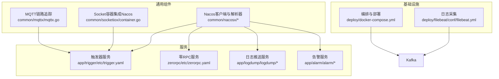
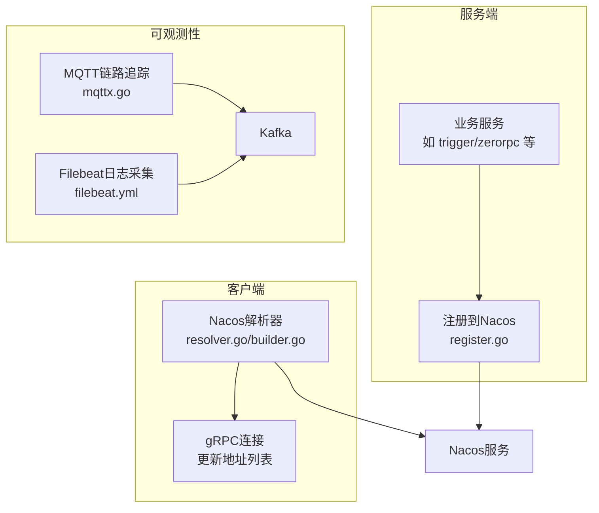
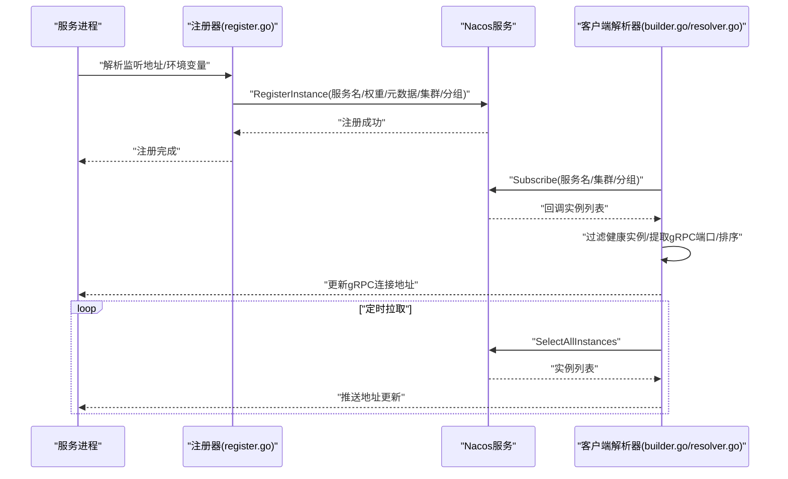
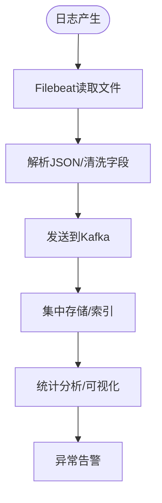
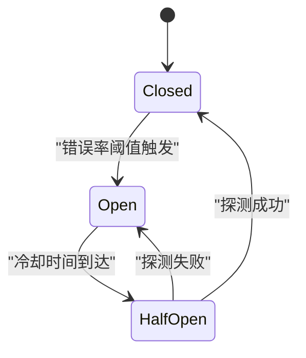
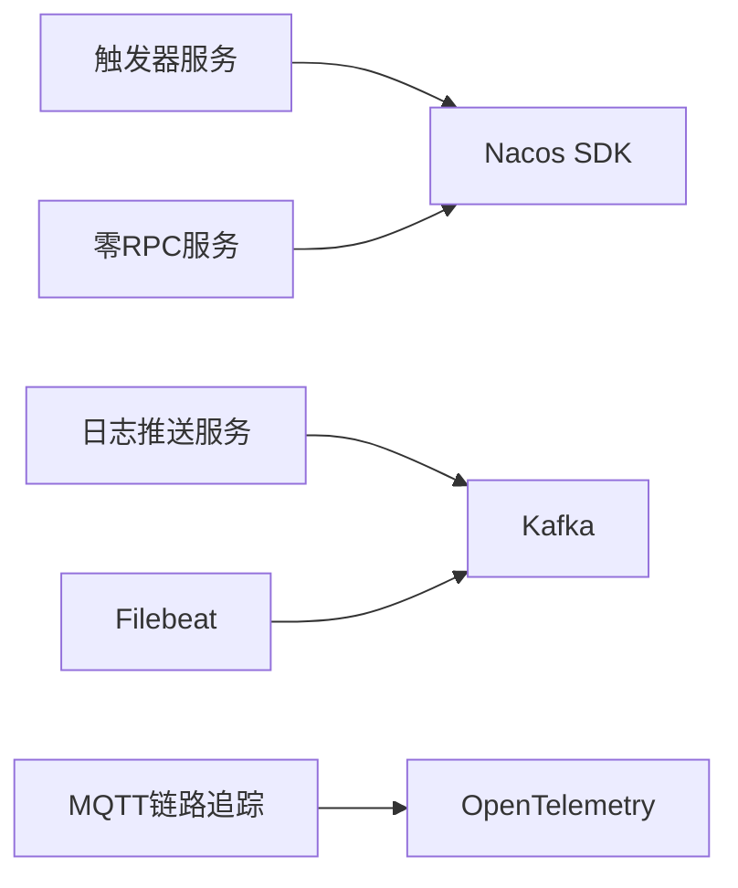

# 服务治理

<cite>
**本文引用的文件**
- [common/nacosx/register.go](file://common/nacosx/register.go)
- [common/nacosx/resolver.go](file://common/nacosx/resolver.go)
- [common/nacosx/builder.go](file://common/nacosx/builder.go)
- [common/nacosx/options.go](file://common/nacosx/options.go)
- [common/nacosx/config.go](file://common/nacosx/config.go)
- [common/socketiox/container.go](file://common/socketiox/container.go)
- [app/trigger/etc/trigger.yaml](file://app/trigger/etc/trigger.yaml)
- [zerorpc/etc/zerorpc.yaml](file://zerorpc/etc/zerorpc.yaml)
- [deploy/docker-compose.yml](file://deploy/docker-compose.yml)
- [deploy/filebeat/conf/filebeat.yml](file://deploy/filebeat/conf/filebeat.yml)
- [.trae/skills/zero-skills/references/resilience-patterns.md](file://.trae/skills/zero-skills/references/resilience-patterns.md)
- [common/mqttx/mqttx.go](file://common/mqttx/mqttx.go)
- [app/logdump/logdump/logdump.pb.go](file://app/logdump/logdump/logdump.pb.go)
- [app/alarm/alarm/alarm.pb.go](file://app/alarm/alarm/alarm.pb.go)
- [app/alarm/alarm/alarm_grpc.pb.go](file://app/alarm/alarm/alarm_grpc.pb.go)
</cite>

## 目录
1. [引言](#引言)
2. [项目结构](#项目结构)
3. [核心组件](#核心组件)
4. [架构总览](#架构总览)
5. [详细组件分析](#详细组件分析)
6. [依赖分析](#依赖分析)
7. [性能考虑](#性能考虑)
8. [故障排查指南](#故障排查指南)
9. [结论](#结论)
10. [附录](#附录)

## 引言
本文件面向Zero-Service项目的“服务治理”主题，围绕基于Nacos的服务注册与发现、配置中心能力、监控与链路追踪、服务降级与熔断、以及运维管理与最佳实践展开。文档以代码为依据，结合项目中的Nacos集成、日志采集与推送、MQTT链路追踪、以及go-zero内置的弹性保护机制，帮助读者快速理解并落地服务治理方案。

## 项目结构
本项目采用多模块微服务架构，每个服务独立包含配置、逻辑、服务端、类型定义与gRPC接口生成产物。与服务治理密切相关的模块包括：
- Nacos客户端封装与gRPC解析器：common/nacosx
- 各服务配置示例：app/*/etc/*.yaml
- 日志采集与输出：deploy/filebeat、app/logdump
- 链路追踪：common/mqttx
- 弹性保护：.trae/skills/zero-skills/references/resilience-patterns.md

**图表来源**
- [common/nacosx/register.go:21-76](file://common/nacosx/register.go#L21-L76)
- [common/nacosx/builder.go:29-112](file://common/nacosx/builder.go#L29-L112)
- [common/socketiox/container.go:172-216](file://common/socketiox/container.go#L172-L216)
- [common/mqttx/mqttx.go:361-388](file://common/mqttx/mqttx.go#L361-L388)
- [app/trigger/etc/trigger.yaml:11-37](file://app/trigger/etc/trigger.yaml#L11-L37)
- [zerorpc/etc/zerorpc.yaml:1-39](file://zerorpc/etc/zerorpc.yaml#L1-L39)
- [deploy/docker-compose.yml:1-110](file://deploy/docker-compose.yml#L1-L110)
- [deploy/filebeat/conf/filebeat.yml:1-122](file://deploy/filebeat/conf/filebeat.yml#L1-L122)

**章节来源**
- [common/nacosx/register.go:21-76](file://common/nacosx/register.go#L21-L76)
- [common/nacosx/builder.go:29-112](file://common/nacosx/builder.go#L29-L112)
- [app/trigger/etc/trigger.yaml:11-37](file://app/trigger/etc/trigger.yaml#L11-L37)
- [zerorpc/etc/zerorpc.yaml:1-39](file://zerorpc/etc/zerorpc.yaml#L1-L39)
- [deploy/docker-compose.yml:1-110](file://deploy/docker-compose.yml#L1-L110)
- [deploy/filebeat/conf/filebeat.yml:1-122](file://deploy/filebeat/conf/filebeat.yml#L1-L122)

## 核心组件
- Nacos注册与发现
  - 服务注册：通过注册参数设置服务名、权重、集群、分组、元数据，并在进程退出时自动反注册。
  - 服务发现：基于gRPC解析器，订阅Nacos服务列表，过滤健康且启用的实例，提取gRPC端口，排序后更新连接状态。
  - 构建器：支持从URL解析Nacos目标，初始化客户端配置，定时拉取实例列表，持续推送至解析器管道。
  - 选项与配置：提供可选前缀、权重、集群、分组、元数据；支持自定义日志级别与日志目录。
- 配置中心
  - 服务侧配置：各服务的etc配置文件中包含Nacos配置项，用于控制是否注册及注册参数。
  - 日志与链路：配置文件示例展示了链路追踪开关注释，便于按需启用。
- 监控与链路追踪
  - 日志采集：Filebeat从业务目录读取JSON文件，解析后推送到Kafka。
  - 链路追踪：MQTT客户端在消费/发布消息时创建span，记录消息ID、主题、QoS等属性。
- 服务降级与熔断
  - go-zero内置弹性保护：默认开启熔断、限流、超时、负载削峰等保护层，生产模式下自动生效。
  - 可观测性：提供关键指标与日志建议，便于监控熔断状态、CPU使用率、超时与限流事件。

**章节来源**
- [common/nacosx/register.go:21-76](file://common/nacosx/register.go#L21-L76)
- [common/nacosx/resolver.go:38-66](file://common/nacosx/resolver.go#L38-L66)
- [common/nacosx/builder.go:78-109](file://common/nacosx/builder.go#L78-L109)
- [common/nacosx/options.go:26-71](file://common/nacosx/options.go#L26-L71)
- [common/nacosx/config.go:23-37](file://common/nacosx/config.go#L23-L37)
- [app/trigger/etc/trigger.yaml:11-37](file://app/trigger/etc/trigger.yaml#L11-L37)
- [zerorpc/etc/zerorpc.yaml:22-27](file://zerorpc/etc/zerorpc.yaml#L22-L27)
- [deploy/filebeat/conf/filebeat.yml:1-122](file://deploy/filebeat/conf/filebeat.yml#L1-L122)
- [common/mqttx/mqttx.go:361-388](file://common/mqttx/mqttx.go#L361-L388)
- [.trae/skills/zero-skills/references/resilience-patterns.md:1-696](file://.trae/skills/zero-skills/references/resilience-patterns.md#L1-L696)

## 架构总览
下图展示服务治理的关键交互：服务启动时向Nacos注册，客户端通过gRPC解析器订阅服务列表，MQTT链路产生span，日志由Filebeat采集并发送到Kafka，供下游分析与可视化。

**图表来源**
- [common/nacosx/register.go:21-76](file://common/nacosx/register.go#L21-L76)
- [common/nacosx/resolver.go:38-66](file://common/nacosx/resolver.go#L38-L66)
- [common/nacosx/builder.go:78-109](file://common/nacosx/builder.go#L78-L109)
- [deploy/filebeat/conf/filebeat.yml:110-119](file://deploy/filebeat/conf/filebeat.yml#L110-L119)
- [common/mqttx/mqttx.go:361-388](file://common/mqttx/mqttx.go#L361-L388)

## 详细组件分析

### Nacos服务注册与发现
- 注册流程
  - 读取监听地址，解析主机与端口，根据环境变量或内网IP修正对外地址。
  - 使用客户端配置创建命名客户端，注册实例（权重、健康、启用、元数据、集群、分组）。
  - 注册成功后，注册退出回调，在进程退出时反注册实例。
- 服务发现策略
  - 解析器构建时解析URL，初始化客户端配置，订阅服务变更。
  - 订阅回调中提取健康且启用的实例，校验元数据包含gRPC端口，排序后推送至连接。
  - 定时器周期性拉取全量实例，确保在订阅失效时仍能恢复。
- 负载均衡
  - 解析器对地址列表进行排序，避免在负载均衡器重复替换相同地址列表。
  - 具体客户端侧负载均衡策略由gRPC生态实现，此处保证地址集合的正确性与稳定性。

**图表来源**
- [common/nacosx/register.go:21-76](file://common/nacosx/register.go#L21-L76)
- [common/nacosx/builder.go:78-109](file://common/nacosx/builder.go#L78-L109)
- [common/nacosx/resolver.go:38-66](file://common/nacosx/resolver.go#L38-L66)

**章节来源**
- [common/nacosx/register.go:21-76](file://common/nacosx/register.go#L21-L76)
- [common/nacosx/resolver.go:38-66](file://common/nacosx/resolver.go#L38-L66)
- [common/nacosx/builder.go:78-109](file://common/nacosx/builder.go#L78-L109)

### 配置中心与动态配置
- 服务配置
  - 各服务的etc配置文件包含Nacos配置项（是否注册、地址、用户名、密码、命名空间、服务名），用于控制注册行为。
  - 链路追踪示例在配置文件中有注释开关，便于按需启用。
- 动态配置更新
  - 项目当前未直接展示Nacos配置中心的动态拉取与热更新逻辑，但可通过以下方式扩展：
    - 在服务启动时读取etc配置，若启用Nacos注册，则按配置连接Nacos并订阅服务。
    - 对于配置中心场景，可在应用层引入Nacos Config SDK，监听配置变更事件，结合go-zero的配置加载机制实现热更新。
- 配置版本管理与加密
  - 版本管理：建议在Nacos中为配置项添加版本标签与变更记录，配合灰度发布策略。
  - 配置加密：敏感信息（如数据库密码、密钥）建议使用密文存储，应用启动时解密或通过环境变量注入。

**章节来源**
- [app/trigger/etc/trigger.yaml:11-37](file://app/trigger/etc/trigger.yaml#L11-L37)
- [zerorpc/etc/zerorpc.yaml:22-27](file://zerorpc/etc/zerorpc.yaml#L22-L27)

### 监控与链路追踪
- 指标收集
  - 项目提供了可观测性参考内容，建议关注熔断请求总数、状态切换次数、CPU使用率、限流超额次数、超时次数与请求耗时等指标。
- 日志聚合
  - Filebeat从桥接服务的日志目录读取JSON文件，解析后推送到Kafka，便于集中化存储与分析。
- 性能监控
  - 结合go-zero内置的弹性保护与日志采集，可形成完整的性能监控闭环。

**图表来源**
- [deploy/filebeat/conf/filebeat.yml:1-122](file://deploy/filebeat/conf/filebeat.yml#L1-L122)

**章节来源**
- [.trae/skills/zero-skills/references/resilience-patterns.md:621-696](file://.trae/skills/zero-skills/references/resilience-patterns.md#L621-L696)
- [deploy/filebeat/conf/filebeat.yml:1-122](file://deploy/filebeat/conf/filebeat.yml#L1-L122)

### 服务降级与熔断机制
- 故障检测与快速失败
  - go-zero内置熔断器自动保护RPC调用、数据库与Redis操作等，无需额外配置即可生效。
- 优雅降级
  - 在熔断打开时，快速返回错误，避免雪崩效应；在半开状态下允许有限流量探测恢复。
- 超时与限流
  - 配合超时与限流策略，进一步降低后端压力，必要时进行负载削峰。

**图表来源**
- [.trae/skills/zero-skills/references/resilience-patterns.md:64-94](file://.trae/skills/zero-skills/references/resilience-patterns.md#L64-L94)

**章节来源**
- [.trae/skills/zero-skills/references/resilience-patterns.md:1-696](file://.trae/skills/zero-skills/references/resilience-patterns.md#L1-L696)

### 运维管理与最佳实践
- 部署与编排
  - docker-compose定义了Kafka、Filebeat等基础设施，便于本地联调与演示。
- 配置管理
  - 建议将敏感配置放入环境变量或密钥管理，避免硬编码在配置文件中。
- 观测性
  - 启用链路追踪与日志采集，建立统一的指标与日志标准，定期复盘熔断与超时事件。
- 弹性保护
  - 生产模式下默认开启弹性保护，建议结合业务特性调整阈值与策略。

**章节来源**
- [deploy/docker-compose.yml:1-110](file://deploy/docker-compose.yml#L1-L110)

## 依赖分析
- 组件耦合
  - 服务与Nacos：通过注册器与解析器解耦，服务仅关心配置项与gRPC端口元数据。
  - 客户端与Nacos：解析器负责订阅与地址更新，客户端无需感知Nacos细节。
- 外部依赖
  - Nacos SDK：用于注册、发现与订阅。
  - gRPC：用于服务间通信与地址更新。
  - Filebeat/Kafka：用于日志采集与传输。
  - OpenTelemetry：用于链路追踪（MQTT示例）。

**图表来源**
- [common/nacosx/register.go:21-76](file://common/nacosx/register.go#L21-L76)
- [common/nacosx/builder.go:67-73](file://common/nacosx/builder.go#L67-L73)
- [deploy/filebeat/conf/filebeat.yml:110-119](file://deploy/filebeat/conf/filebeat.yml#L110-L119)
- [common/mqttx/mqttx.go:361-388](file://common/mqttx/mqttx.go#L361-L388)

**章节来源**
- [common/nacosx/register.go:21-76](file://common/nacosx/register.go#L21-L76)
- [common/nacosx/builder.go:67-73](file://common/nacosx/builder.go#L67-L73)
- [deploy/filebeat/conf/filebeat.yml:110-119](file://deploy/filebeat/conf/filebeat.yml#L110-L119)
- [common/mqttx/mqttx.go:361-388](file://common/mqttx/mqttx.go#L361-L388)

## 性能考虑
- 注册与发现
  - 使用健康与启用过滤，减少无效连接尝试。
  - 定时拉取作为订阅失效的兜底，避免长时间无更新。
- 日志与链路
  - Filebeat合理设置扫描频率与关闭策略，避免频繁I/O。
  - 链路追踪仅在需要时启用，避免过多span影响性能。
- 弹性保护
  - 利用go-zero内置的熔断与限流，降低后端压力峰值。

## 故障排查指南
- 服务无法注册到Nacos
  - 检查监听地址解析与环境变量，确认最终对外地址正确。
  - 校验Nacos连接参数（地址、用户名、密码、命名空间）。
- 客户端无法获取服务列表
  - 查看订阅回调日志，确认实例健康与启用状态，检查gRPC端口元数据。
  - 关注定时拉取是否正常工作。
- 日志未被采集
  - 检查Filebeat输入路径与字段映射，确认Kafka输出配置正确。
- 链路追踪缺失
  - 确认MQTT客户端已正确创建span并设置属性。
- 熔断频繁打开
  - 分析指标与日志，评估阈值与业务流量，必要时调整弹性保护策略。

**章节来源**
- [common/nacosx/register.go:78-98](file://common/nacosx/register.go#L78-L98)
- [common/nacosx/resolver.go:38-66](file://common/nacosx/resolver.go#L38-L66)
- [deploy/filebeat/conf/filebeat.yml:1-122](file://deploy/filebeat/conf/filebeat.yml#L1-L122)
- [common/mqttx/mqttx.go:361-388](file://common/mqttx/mqttx.go#L361-L388)
- [.trae/skills/zero-skills/references/resilience-patterns.md:621-696](file://.trae/skills/zero-skills/references/resilience-patterns.md#L621-L696)

## 结论
本项目通过Nacos实现了服务注册与发现，结合go-zero的弹性保护、Filebeat的日志采集与MQTT链路追踪，形成了较为完善的服务治理体系。建议在现有基础上扩展配置中心的动态更新能力，并完善监控与告警体系，以支撑生产环境的稳定运行。

## 附录
- 接口与数据模型参考
  - 日志推送服务的LogEntry结构与服务方法定义。
  - 告警服务的Ping/Alarm接口定义。

**章节来源**
- [app/logdump/logdump/logdump.pb.go:83-210](file://app/logdump/logdump/logdump.pb.go#L83-L210)
- [app/alarm/alarm/alarm.pb.go:24-110](file://app/alarm/alarm/alarm.pb.go#L24-L110)
- [app/alarm/alarm/alarm_grpc.pb.go:34-76](file://app/alarm/alarm/alarm_grpc.pb.go#L34-L76)