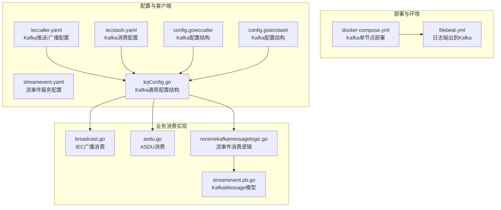
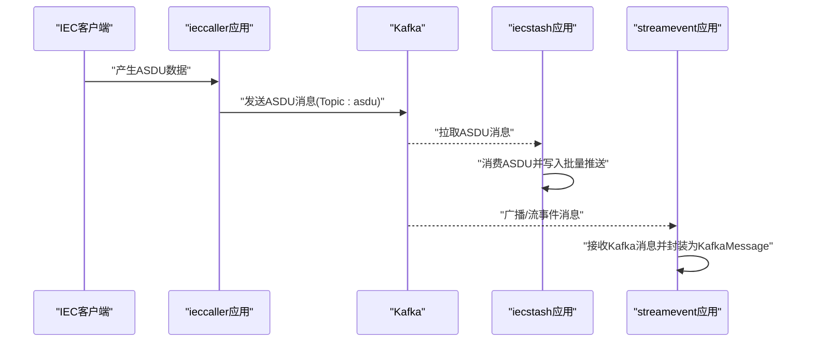
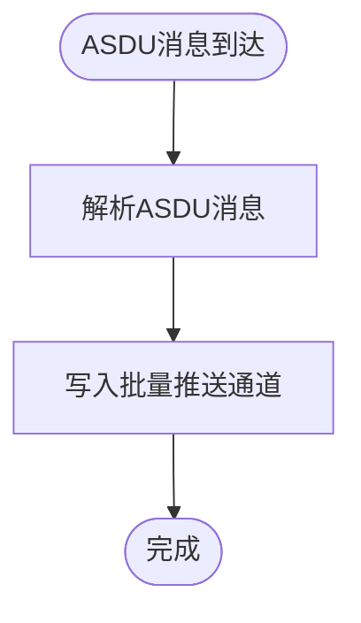
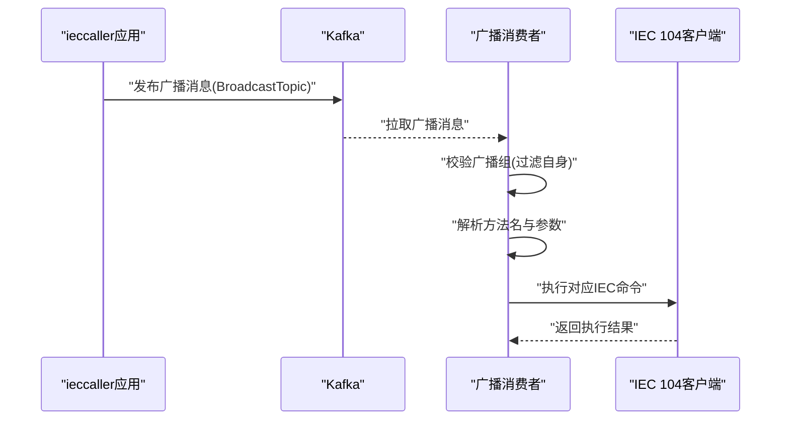
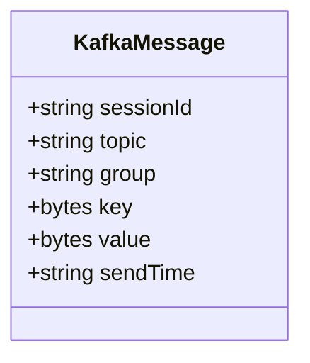
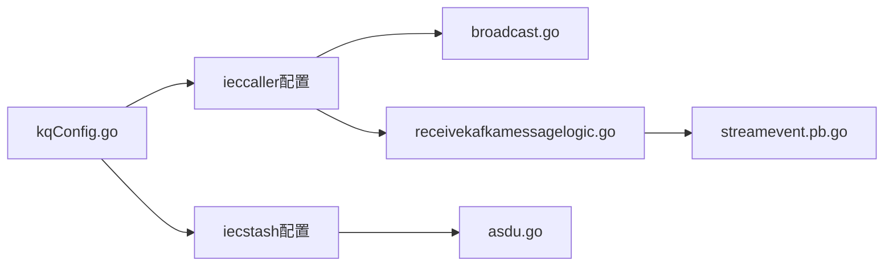

# 消息队列基础设施

<cite>
**本文引用的文件**
- [docker-compose.yml](file://deploy/docker-compose.yml)
- [kqConfig.go](file://common/configx/kqConfig.go)
- [config.go（ieccaller）](file://app/ieccaller/internal/config/config.go)
- [config.go（iecstash）](file://app/iecstash/internal/config/config.go)
- [ieccaller.yaml](file://app/ieccaller/etc/ieccaller.yaml)
- [iecstash.yaml](file://app/iecstash/etc/iecstash.yaml)
- [streamevent.yaml](file://facade/streamevent/etc/streamevent.yaml)
- [broadcast.go](file://app/ieccaller/kafka/broadcast.go)
- [asdu.go](file://app/iecstash/kafka/asdu.go)
- [receivekafkamessagelogic.go](file://facade/streamevent/internal/logic/receivekafkamessagelogic.go)
- [streamevent.pb.go](file://facade/streamevent/streamevent/streamevent.pb.go)
- [streamevent.pb.validate.go](file://facade/streamevent/streamevent/streamevent.pb.validate.go)
- [filebeat.yml](file://deploy/filebeat/conf/filebeat.yml)
- [kafkamodel.go](file://model/kafkamodel.go)
- [ieccaller.go](file://app/ieccaller/ieccaller.go)
- [iec104-protocol.md](file://docs/iec104-protocol.md)
- [iec104.md](file://docs/iec104.md)
</cite>

## 目录
1. [简介](#简介)
2. [项目结构](#项目结构)
3. [核心组件](#核心组件)
4. [架构总览](#架构总览)
5. [详细组件分析](#详细组件分析)
6. [依赖关系分析](#依赖关系分析)
7. [性能考量](#性能考量)
8. [故障排查指南](#故障排查指南)
9. [结论](#结论)
10. [附录](#附录)

## 简介
本文件面向Zero-Service的消息队列基础设施，聚焦Kafka在系统中的部署、配置与使用。内容涵盖：
- Kafka单节点部署与关键参数
- 分区与副本策略
- 在系统中的典型应用场景：IEC 60870-5-104数据传输、ASDU消息处理、跨实例广播机制
- Kafka客户端使用要点：生产者配置、消费者组管理、偏移量管理
- 监控与运维：集群状态、性能调优、故障排查
- 工业物联网场景下的最佳实践

## 项目结构
与Kafka相关的关键位置与职责如下：
- 部署与环境
  - 使用Docker Compose编排Kafka单节点服务，并通过环境变量设置监听、控制器、分区数、副本因子等
- 配置与客户端
  - 各应用通过配置文件声明Kafka连接、Topic、消费者组、偏移策略等
  - 通用Kafka配置结构体用于统一客户端参数
- 业务消费实现
  - IEC广播消费：接收跨实例命令并转发至IEC 104客户端
  - ASDU消费：将ASDU消息写入批量推送通道
  - 流事件消费：接收Kafka消息并通过gRPC协议封装

图表来源
- [docker-compose.yml:1-36](file://deploy/docker-compose.yml#L1-L36)
- [filebeat.yml:110-119](file://deploy/filebeat/conf/filebeat.yml#L110-L119)
- [kqConfig.go:1-7](file://common/configx/kqConfig.go#L1-L7)
- [config.go（ieccaller）:36-42](file://app/ieccaller/internal/config/config.go#L36-L42)
- [config.go（iecstash）:10-12](file://app/iecstash/internal/config/config.go#L10-L12)
- [ieccaller.yaml:35-41](file://app/ieccaller/etc/ieccaller.yaml#L35-L41)
- [iecstash.yaml:18-35](file://app/iecstash/etc/iecstash.yaml#L18-L35)
- [broadcast.go:1-149](file://app/ieccaller/kafka/broadcast.go#L1-L149)
- [asdu.go:1-25](file://app/iecstash/kafka/asdu.go#L1-L25)
- [receivekafkamessagelogic.go:1-32](file://facade/streamevent/internal/logic/receivekafkamessagelogic.go#L1-L32)
- [streamevent.pb.go:435-470](file://facade/streamevent/streamevent/streamevent.pb.go#L435-L470)

章节来源
- [docker-compose.yml:1-36](file://deploy/docker-compose.yml#L1-L36)
- [kqConfig.go:1-7](file://common/configx/kqConfig.go#L1-L7)
- [config.go（ieccaller）:36-42](file://app/ieccaller/internal/config/config.go#L36-L42)
- [config.go（iecstash）:10-12](file://app/iecstash/internal/config/config.go#L10-L12)
- [ieccaller.yaml:35-41](file://app/ieccaller/etc/ieccaller.yaml#L35-L41)
- [iecstash.yaml:18-35](file://app/iecstash/etc/iecstash.yaml#L18-L35)
- [broadcast.go:1-149](file://app/ieccaller/kafka/broadcast.go#L1-L149)
- [asdu.go:1-25](file://app/iecstash/kafka/asdu.go#L1-L25)
- [receivekafkamessagelogic.go:1-32](file://facade/streamevent/internal/logic/receivekafkamessagelogic.go#L1-L32)
- [streamevent.pb.go:435-470](file://facade/streamevent/streamevent/streamevent.pb.go#L435-L470)

## 核心组件
- Kafka单节点部署
  - 使用Docker Compose启动Kafka镜像，开放容器内外监听端口，设置控制器监听与投票配置，初始化分区数与副本因子
- Kafka客户端配置
  - 通用Kafka配置结构体用于统一Brokers、Topic等参数
  - 应用侧分别在配置文件与代码中声明Kafka推送/消费参数
- 业务消费实现
  - IEC广播消费：根据广播组过滤自身消息，解析方法名并调用IEC 104客户端执行相应命令或清理缓存
  - ASDU消费：将ASDU消息写入批量推送通道
  - 流事件消费：接收Kafka消息并通过gRPC协议封装为KafkaMessage模型

章节来源
- [docker-compose.yml:5-29](file://deploy/docker-compose.yml#L5-L29)
- [kqConfig.go:3-6](file://common/configx/kqConfig.go#L3-L6)
- [config.go（ieccaller）:36-42](file://app/ieccaller/internal/config/config.go#L36-L42)
- [config.go（iecstash）](file://app/iecstash/internal/config/config.go#L12)
- [broadcast.go:24-149](file://app/ieccaller/kafka/broadcast.go#L24-L149)
- [asdu.go:20-24](file://app/iecstash/kafka/asdu.go#L20-L24)
- [receivekafkamessagelogic.go:26-31](file://facade/streamevent/internal/logic/receivekafkamessagelogic.go#L26-L31)
- [streamevent.pb.go:435-445](file://facade/streamevent/streamevent/streamevent.pb.go#L435-L445)

## 架构总览
下图展示Kafka在Zero-Service中的整体交互：IEC数据经由IEC客户端产生ASDU消息，写入Kafka；下游消费者（ASDU消费、IEC广播、流事件）按需订阅。

图表来源
- [ieccaller.yaml:38-41](file://app/ieccaller/etc/ieccaller.yaml#L38-L41)
- [iecstash.yaml:18-28](file://app/iecstash/etc/iecstash.yaml#L18-L28)
- [streamevent.yaml:1-28](file://facade/streamevent/etc/streamevent.yaml#L1-L28)
- [broadcast.go:1-149](file://app/ieccaller/kafka/broadcast.go#L1-L149)
- [asdu.go:1-25](file://app/iecstash/kafka/asdu.go#L1-L25)
- [receivekafkamessagelogic.go:26-31](file://facade/streamevent/internal/logic/receivekafkamessagelogic.go#L26-L31)
- [streamevent.pb.go:435-445](file://facade/streamevent/streamevent/streamevent.pb.go#L435-L445)

## 详细组件分析

### Kafka集群部署与配置
- 单节点部署要点
  - 监听与对外地址分离：容器内监听端口与外部访问端口不同，便于容器间通信与外部接入
  - 控制器角色与投票：启用controller角色，设置控制器监听名称与投票者
  - 分区与副本：设置分区数与偏移主题副本因子，满足单节点最小化部署需求
- 关键环境变量说明
  - 监听与广告监听：区分容器内外访问路径
  - 控制器监听与协议映射：确保控制器与PLAINTEXT通信正常
  - 副本与ISR：偏移主题与事务状态日志的副本因子与最小ISR
  - 初始再均衡延迟：降低消费者组首次加入延迟
  - 分区数：初始化Topic分区数量
- 存储与持久化
  - 数据目录挂载到宿主机，保障重启后数据不丢失

章节来源
- [docker-compose.yml:13-29](file://deploy/docker-compose.yml#L13-L29)

### 分区策略与副本机制
- 分区策略
  - 初始化分区数：用于后续Topic的分区分配
  - 生产者分区策略：可结合Key进行哈希分区（取决于生产者配置）
- 副本机制
  - 副本因子与最小ISR：保证在单节点环境下仍具备基本的可靠性与可用性
  - 偏移主题副本：独立控制偏移提交的可靠性
- 最佳实践
  - 在单节点场景下，副本因子与ISR通常设为1
  - 随着规模扩展，逐步提升分区数与副本因子，平衡吞吐与容灾

章节来源
- [docker-compose.yml:22-26](file://deploy/docker-compose.yml#L22-L26)

### IEC 104数据传输与ASDU消息处理
- 消息格式与Topic
  - IEC 104消息通过ieccaller推送至Kafka Topic（默认asdu）
  - 消息体包含ASDU类型、公共地址、信息体、时间戳及点位映射等字段
- 消费者组与处理
  - iecstash应用以消费者组方式订阅asdu Topic，按配置的并发参数并行处理
  - 消费实现将ASDU消息写入批量推送通道，供后续处理

图表来源
- [ieccaller.yaml:38-41](file://app/ieccaller/etc/ieccaller.yaml#L38-L41)
- [iecstash.yaml:18-35](file://app/iecstash/etc/iecstash.yaml#L18-L35)
- [asdu.go:20-24](file://app/iecstash/kafka/asdu.go#L20-L24)

章节来源
- [ieccaller.yaml:38-41](file://app/ieccaller/etc/ieccaller.yaml#L38-L41)
- [iecstash.yaml:18-35](file://app/iecstash/etc/iecstash.yaml#L18-L35)
- [asdu.go:20-24](file://app/iecstash/kafka/asdu.go#L20-L24)
- [iec104-protocol.md:18-66](file://docs/iec104-protocol.md#L18-L66)

### 广播机制与跨实例协调
- 广播Topic与组
  - ieccaller配置了广播Topic与广播组ID，用于跨实例命令分发
- 消费与执行
  - 广播消费根据方法名解析请求体，调用IEC 104客户端执行相应命令
  - 支持的命令包括总召唤、累计量召唤、读命令、测试命令以及下发命令等
  - 支持清理点位映射缓存，按Key或KeyInfo维度批量清理
- 自身广播过滤
  - 消费端会过滤掉与自身广播组相同的广播消息，避免循环执行

图表来源
- [ieccaller.yaml:40-41](file://app/ieccaller/etc/ieccaller.yaml#L40-L41)
- [broadcast.go:24-149](file://app/ieccaller/kafka/broadcast.go#L24-L149)
- [ieccaller.go:98-117](file://app/ieccaller/ieccaller.go#L98-L117)

章节来源
- [ieccaller.yaml:35-41](file://app/ieccaller/etc/ieccaller.yaml#L35-L41)
- [broadcast.go:24-149](file://app/ieccaller/kafka/broadcast.go#L24-L149)
- [ieccaller.go:98-117](file://app/ieccaller/ieccaller.go#L98-L117)

### 流事件与Kafka消息封装
- KafkaMessage模型
  - streamevent服务通过gRPC接收Kafka消息，消息体封装为KafkaMessage，包含Topic、Group、Key、Value、发送时间等字段
- 消费逻辑
  - receivekafkamessagelogic负责接收请求并进行处理，验证逻辑基于消息模型的校验器

图表来源
- [streamevent.pb.go:435-445](file://facade/streamevent/streamevent/streamevent.pb.go#L435-L445)

章节来源
- [receivekafkamessagelogic.go:26-31](file://facade/streamevent/internal/logic/receivekafkamessagelogic.go#L26-L31)
- [streamevent.pb.validate.go:844-876](file://facade/streamevent/streamevent/streamevent.pb.validate.go#L844-L876)
- [streamevent.pb.go:435-445](file://facade/streamevent/streamevent/streamevent.pb.go#L435-L445)

### Kafka客户端使用要点
- 生产者配置
  - Broker地址、Topic、压缩方式、消息大小限制等
  - Filebeat作为示例生产者，将日志输出到Kafka，支持按字段动态选择Topic
- 消费者组管理
  - 通过配置文件声明消费者组、连接数、消费者数、处理协程数、最小/最大字节数、偏移策略等
  - 并发参数建议与分区数匹配，避免过度并发导致资源争用
- 偏移量管理
  - 支持从头或从尾读取（first/last），可按需调整初始偏移策略
  - 提交顺序与强制提交选项影响一致性与性能权衡

章节来源
- [filebeat.yml:110-119](file://deploy/filebeat/conf/filebeat.yml#L110-L119)
- [iecstash.yaml:24-35](file://app/iecstash/etc/iecstash.yaml#L24-L35)
- [ieccaller.yaml:77-79](file://app/ieccaller/etc/ieccaller.yaml#L77-L79)

## 依赖关系分析
- 组件耦合
  - 应用配置与通用Kafka配置结构体解耦，便于统一管理
  - 消费实现与应用配置解耦，通过注入上下文与配置对象进行协作
- 外部依赖
  - Kafka作为消息中间件，依赖Zookeeper（控制器模式下）或KRaft（Kafka 3.x内置）
  - 生产者与消费者均依赖Kafka Broker提供的分区与副本能力

图表来源
- [kqConfig.go:3-6](file://common/configx/kqConfig.go#L3-L6)
- [config.go（ieccaller）:36-42](file://app/ieccaller/internal/config/config.go#L36-L42)
- [config.go（iecstash）](file://app/iecstash/internal/config/config.go#L12)
- [broadcast.go:1-149](file://app/ieccaller/kafka/broadcast.go#L1-L149)
- [asdu.go:1-25](file://app/iecstash/kafka/asdu.go#L1-L25)
- [receivekafkamessagelogic.go:1-32](file://facade/streamevent/internal/logic/receivekafkamessagelogic.go#L1-L32)
- [streamevent.pb.go:435-445](file://facade/streamevent/streamevent/streamevent.pb.go#L435-L445)

章节来源
- [kqConfig.go:1-7](file://common/configx/kqConfig.go#L1-L7)
- [config.go（ieccaller）:36-42](file://app/ieccaller/internal/config/config.go#L36-L42)
- [config.go（iecstash）:10-12](file://app/iecstash/internal/config/config.go#L10-L12)
- [broadcast.go:1-149](file://app/ieccaller/kafka/broadcast.go#L1-L149)
- [asdu.go:1-25](file://app/iecstash/kafka/asdu.go#L1-L25)
- [receivekafkamessagelogic.go:1-32](file://facade/streamevent/internal/logic/receivekafkamessagelogic.go#L1-L32)
- [streamevent.pb.go:435-445](file://facade/streamevent/streamevent/streamevent.pb.go#L435-L445)

## 性能考量
- 分区与副本
  - 单节点场景下副本因子与ISR设为1，分区数适中，避免过多分区带来的调度开销
- 并发与批处理
  - 消费者并发参数应与分区数匹配，避免空转或争用
  - 批处理大小（MinBytes/MaxBytes）可根据网络与IO状况调整，提高吞吐
- 压缩与消息大小
  - 启用压缩可降低带宽占用，但会增加CPU开销
  - 合理设置最大消息大小，避免超大消息影响传输稳定性
- 偏移策略
  - 在保证一致性的前提下，尽量减少强制提交频率，提升吞吐

## 故障排查指南
- 连接问题
  - 确认Broker地址与端口正确，容器内外监听端口是否映射一致
  - 检查Kafka控制器监听与协议映射配置
- 消费异常
  - 检查消费者组是否正确创建，分区与消费者数量是否匹配
  - 查看偏移策略配置，确认是否需要从头读取
- 广播循环
  - 确认广播组ID配置一致且未被自身过滤
- 模型校验
  - streamevent的KafkaMessage模型提供校验器，若出现校验错误，检查消息字段完整性

章节来源
- [docker-compose.yml:13-21](file://deploy/docker-compose.yml#L13-L21)
- [ieccaller.yaml:35-41](file://app/ieccaller/etc/ieccaller.yaml#L35-L41)
- [iecstash.yaml:24-35](file://app/iecstash/etc/iecstash.yaml#L24-L35)
- [broadcast.go:24-38](file://app/ieccaller/kafka/broadcast.go#L24-L38)
- [streamevent.pb.validate.go:844-876](file://facade/streamevent/streamevent/streamevent.pb.validate.go#L844-L876)

## 结论
本项目采用Kafka作为IEC 104数据的中枢消息通道，结合广播机制实现跨实例命令分发，配合ASDU消费与流事件封装，形成完整的数据链路。通过合理的分区与副本策略、消费者并发与批处理配置，可在单节点环境下稳定运行，并为后续扩展提供清晰的演进路径。

## 附录
- 工业物联网场景最佳实践
  - 分区与副本：根据吞吐与容灾需求逐步提升分区数与副本因子
  - 并发与批处理：与分区数匹配的并发参数，合理设置批处理大小
  - 压缩与限流：在带宽与CPU之间取得平衡，必要时启用限流
  - 监控与告警：关注分区水位、消费者滞后、ISR状态与Broker负载
  - 备份与恢复：定期备份数据目录，制定恢复流程