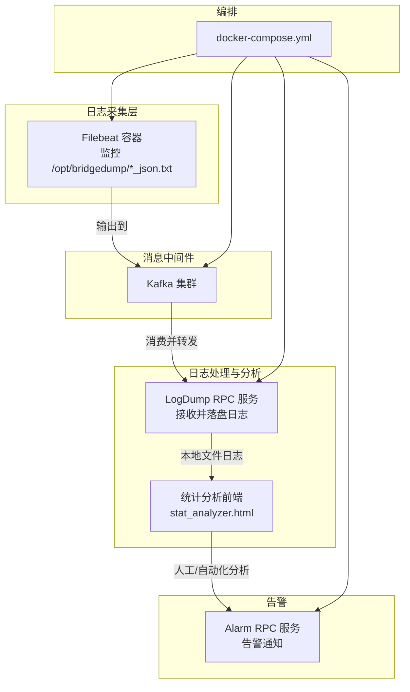
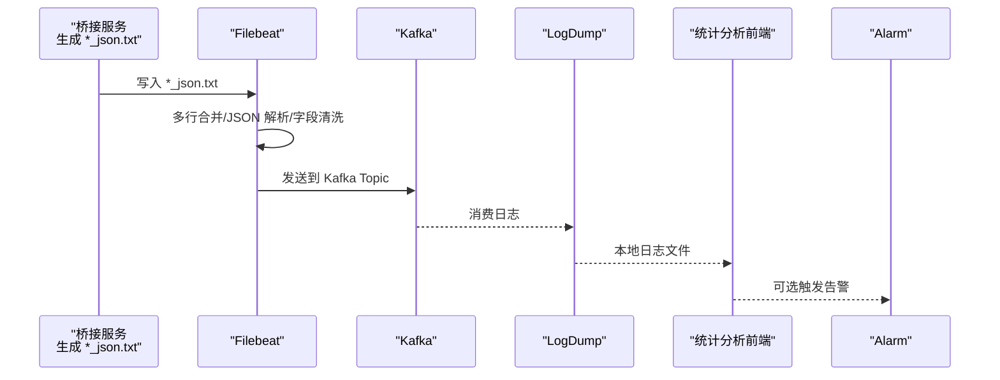
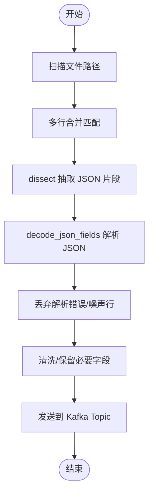
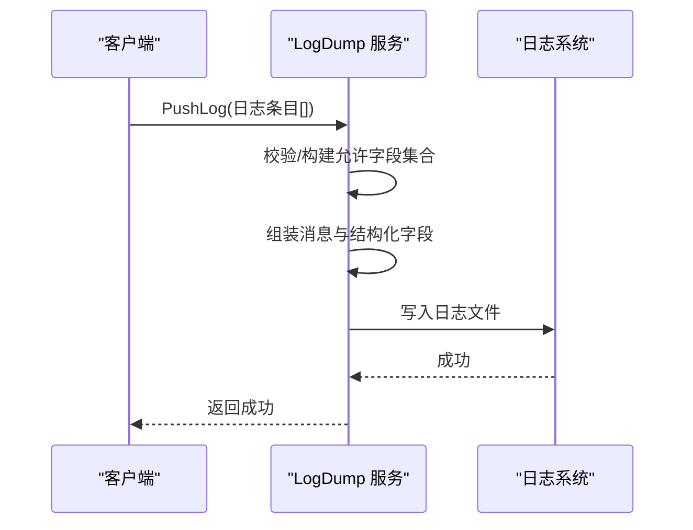
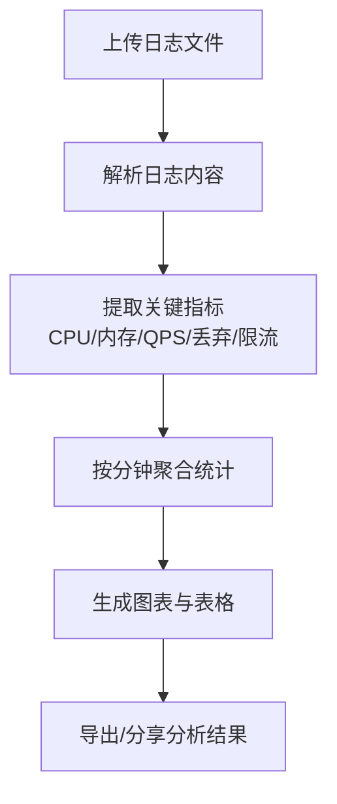
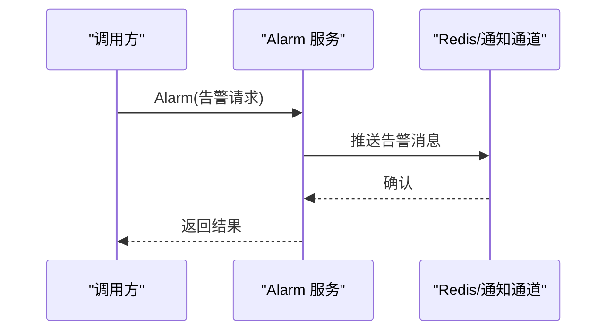
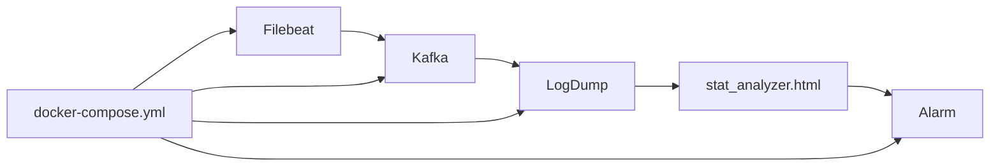

# 监控与日志

<cite>
**本文引用的文件**
- [deploy/filebeat/conf/filebeat.yml](file://deploy/filebeat/conf/filebeat.yml)
- [deploy/docker-compose.yml](file://deploy/docker-compose.yml)
- [deploy/stat_analyzer.html](file://deploy/stat_analyzer.html)
- [app/logdump/etc/logdump.yaml](file://app/logdump/etc/logdump.yaml)
- [app/logdump/internal/logic/pushloglogic.go](file://app/logdump/internal/logic/pushloglogic.go)
- [app/logdump/logdump/logdump_grpc.pb.go](file://app/logdump/logdump/logdump_grpc.pb.go)
- [app/alarm/etc/alarm.yaml](file://app/alarm/etc/alarm.yaml)
- [app/alarm/alarm/alarm_grpc.pb.go](file://app/alarm/alarm/alarm_grpc.pb.go)
- [.trae/skills/zero-skills/references/resilience-patterns.md](file://.trae/skills/zero-skills/references/resilience-patterns.md)
- [util/main.go](file://util/main.go)
</cite>

## 目录
1. [简介](#简介)
2. [项目结构](#项目结构)
3. [核心组件](#核心组件)
4. [架构总览](#架构总览)
5. [详细组件分析](#详细组件分析)
6. [依赖关系分析](#依赖关系分析)
7. [性能考量](#性能考量)
8. [故障排查指南](#故障排查指南)
9. [结论](#结论)
10. [附录](#附录)

## 简介
本文件面向 Zero-Service 项目的监控与日志基础设施，围绕以下目标展开：
- Filebeat 日志采集配置：日志文件监控、日志格式解析、日志转发至 Kafka。
- 系统监控指标设计与采集：服务健康检查、性能指标（CPU、内存、QPS、丢弃、GC）、业务指标（如负载均衡与限流状态）。
- 日志分析与统计：日志聚合、异常检测、趋势分析与可视化。
- 监控告警机制：告警规则配置、通知方式、告警升级。
- 运维管理与性能优化：部署与编排、日志与指标的可观测性实践。

## 项目结构
与监控和日志相关的关键目录与文件：
- 日志采集与转发
  - Filebeat 配置：deploy/filebeat/conf/filebeat.yml
  - Docker Compose 编排：deploy/docker-compose.yml
- 日志汇聚与分析
  - 日志推送服务：app/logdump
  - 统计分析前端：deploy/stat_analyzer.html
- 告警服务
  - 告警服务配置：app/alarm/etc/alarm.yaml
  - 告警服务接口：app/alarm/alarm/alarm_grpc.pb.go
- 抗压与韧性指标参考
  - 抗压模式指标与日志最佳实践：.trae/skills/zero-skills/references/resilience-patterns.md
- 运维辅助
  - 远程服务状态与日志查看：util/main.go

**图表来源**
- [deploy/docker-compose.yml:1-110](file://deploy/docker-compose.yml#L1-L110)
- [deploy/filebeat/conf/filebeat.yml:1-122](file://deploy/filebeat/conf/filebeat.yml#L1-L122)
- [app/logdump/etc/logdump.yaml:1-26](file://app/logdump/etc/logdump.yaml#L1-L26)
- [deploy/stat_analyzer.html:1-800](file://deploy/stat_analyzer.html#L1-L800)
- [app/alarm/etc/alarm.yaml:1-26](file://app/alarm/etc/alarm.yaml#L1-L26)

**章节来源**
- [deploy/docker-compose.yml:1-110](file://deploy/docker-compose.yml#L1-L110)
- [deploy/filebeat/conf/filebeat.yml:1-122](file://deploy/filebeat/conf/filebeat.yml#L1-L122)

## 核心组件
- Filebeat：负责从桥接 dump 产生的 JSON 文本文件中采集日志，进行多行合并、JSON 解析、字段清洗，并发送到 Kafka。
- Kafka：作为日志缓冲与分发中心，供下游服务订阅消费。
- LogDump：接收来自客户端的日志推送，按配置允许的额外字段进行结构化输出，并写入本地日志目录。
- 统计分析前端：解析 Go-Zero 微服务的 stat 日志，提取 CPU、内存、QPS、丢弃、GC、限流等指标，提供可视化图表与趋势分析。
- Alarm：提供告警服务接口，支持通过 RPC 触发告警通知（结合配置中的通知通道与密钥）。

**章节来源**
- [deploy/filebeat/conf/filebeat.yml:4-72](file://deploy/filebeat/conf/filebeat.yml#L4-L72)
- [app/logdump/etc/logdump.yaml:1-26](file://app/logdump/etc/logdump.yaml#L1-L26)
- [deploy/stat_analyzer.html:248-888](file://deploy/stat_analyzer.html#L248-L888)
- [app/alarm/etc/alarm.yaml:1-26](file://app/alarm/etc/alarm.yaml#L1-L26)

## 架构总览
下图展示了从日志产生到分析与告警的整体流程：

**图表来源**
- [deploy/filebeat/conf/filebeat.yml:4-122](file://deploy/filebeat/conf/filebeat.yml#L4-L122)
- [deploy/docker-compose.yml:32-53](file://deploy/docker-compose.yml#L32-L53)
- [app/logdump/etc/logdump.yaml:1-26](file://app/logdump/etc/logdump.yaml#L1-L26)
- [deploy/stat_analyzer.html:278-888](file://deploy/stat_analyzer.html#L278-L888)
- [app/alarm/etc/alarm.yaml:1-26](file://app/alarm/etc/alarm.yaml#L1-L26)

## 详细组件分析

### Filebeat 日志采集配置
- 输入监控
  - 监控路径：/opt/bridgedump/cable_work_list/*_json.txt、/opt/bridgedump/cable_fault/*_json.txt、/opt/bridgedump/cable_fault_wave/*_json.txt。
  - 多行合并：基于固定前缀匹配，确保跨行的完整记录被聚合成一条日志。
  - 扫描与关闭策略：调整扫描频率、关闭不活跃文件的时间、忽略过期文件、清理非活动状态。
- 日志解析
  - 使用 dissect 从 message 中抽取 JSON 片段，再用 decode_json_fields 解析为结构化字段。
  - 丢弃解析失败或特定噪声行（如包含特定前缀的首行）。
- 输出转发
  - 输出到 Kafka，topic 名称由输入字段动态决定；开启压缩、设置 ack 数与最大消息大小。

**图表来源**
- [deploy/filebeat/conf/filebeat.yml:4-122](file://deploy/filebeat/conf/filebeat.yml#L4-L122)

**章节来源**
- [deploy/filebeat/conf/filebeat.yml:4-122](file://deploy/filebeat/conf/filebeat.yml#L4-L122)

### 日志推送与落盘（LogDump）
- 配置要点
  - 日志级别、输出路径、保留天数。
  - 中间件统计忽略特定方法，降低噪音。
  - 允许的额外字段白名单，控制结构化字段规模。
- 处理逻辑
  - 将传入日志组装为统一消息格式，按级别输出到日志文件。
  - 仅对白名单内的额外字段进行结构化记录，其余拼接到文本尾部。

**图表来源**
- [app/logdump/etc/logdump.yaml:1-26](file://app/logdump/etc/logdump.yaml#L1-L26)
- [app/logdump/internal/logic/pushloglogic.go:28-67](file://app/logdump/internal/logic/pushloglogic.go#L28-L67)
- [app/logdump/logdump/logdump_grpc.pb.go:53-61](file://app/logdump/logdump/logdump_grpc.pb.go#L53-L61)

**章节来源**
- [app/logdump/etc/logdump.yaml:1-26](file://app/logdump/etc/logdump.yaml#L1-L26)
- [app/logdump/internal/logic/pushloglogic.go:28-67](file://app/logdump/internal/logic/pushloglogic.go#L28-L67)

### 统计分析与可视化（stat_analyzer.html）
- 支持的日志类型
  - 内存使用统计（CPU、Alloc、Sys 等）。
  - 限流状态统计（shedding_stat）。
  - 性能指标（QPS、丢弃、响应时间 Pxx）。
- 可视化能力
  - 系统 QPS 趋势、内存使用趋势、CPU/系统指标综合图、服务分布、限流状态分析、缓存命中率趋势。
  - 支持图表缩放、区域选择、全屏查看、表格分页与排序。
- 数据处理
  - 自动提取服务名、聚合分钟级指标、计算各类响应时间分位数、汇总丢弃与限流统计。

**图表来源**
- [deploy/stat_analyzer.html:774-888](file://deploy/stat_analyzer.html#L774-L888)
- [deploy/stat_analyzer.html:1145-1300](file://deploy/stat_analyzer.html#L1145-L1300)
- [deploy/stat_analyzer.html:1863-2360](file://deploy/stat_analyzer.html#L1863-L2360)

**章节来源**
- [deploy/stat_analyzer.html:248-888](file://deploy/stat_analyzer.html#L248-L888)

### 告警服务（Alarm）
- 配置要点
  - RPC 监听端口、日志编码、Redis 通知通道、第三方告警平台参数（AppId、AppSecret、EncryptKey、VerificationToken、用户 ID 列表）。
- 接口能力
  - 提供 Ping 与 Alarm RPC 方法，可用于健康检查与触发告警。
- 告警示例
  - 可携带标题、项目、时间、告警 ID、内容、错误信息、用户 ID、IP 等上下文字段。

**图表来源**
- [app/alarm/etc/alarm.yaml:1-26](file://app/alarm/etc/alarm.yaml#L1-L26)
- [app/alarm/alarm/alarm_grpc.pb.go:52-60](file://app/alarm/alarm/alarm_grpc.pb.go#L52-L60)

**章节来源**
- [app/alarm/etc/alarm.yaml:1-26](file://app/alarm/etc/alarm.yaml#L1-L26)
- [app/alarm/alarm/alarm_grpc.pb.go:52-60](file://app/alarm/alarm/alarm_grpc.pb.go#L52-L60)

### 抗压与韧性指标参考
- 关键指标建议
  - 断路器：breaker_requests_total、breaker_state_changes。
  - 负载均衡：shed_requests_total、cpu_usage_percent。
  - 速率限制：rate_limit_exceeded_total、rate_limit_allowed_total。
  - 超时：request_timeout_total、request_duration_seconds。
- 日志建议
  - 记录断路器状态变化、速率限制触发、负载均衡丢弃、超时事件，便于回溯与审计。

**章节来源**
- [.trae/skills/zero-skills/references/resilience-patterns.md:621-690](file://.trae/skills/zero-skills/references/resilience-patterns.md#L621-L690)

## 依赖关系分析
- Filebeat 依赖 Kafka 作为下游消费者；LogDump 依赖本地磁盘与日志系统；统计分析前端依赖 LogDump 输出的日志文件；Alarm 依赖 Redis/通知通道。
- docker-compose 将上述组件编排在同一网络中，便于发现与通信。

**图表来源**
- [deploy/docker-compose.yml:1-110](file://deploy/docker-compose.yml#L1-L110)
- [deploy/filebeat/conf/filebeat.yml:1-122](file://deploy/filebeat/conf/filebeat.yml#L1-L122)
- [app/logdump/etc/logdump.yaml:1-26](file://app/logdump/etc/logdump.yaml#L1-L26)
- [deploy/stat_analyzer.html:1-800](file://deploy/stat_analyzer.html#L1-L800)
- [app/alarm/etc/alarm.yaml:1-26](file://app/alarm/etc/alarm.yaml#L1-L26)

**章节来源**
- [deploy/docker-compose.yml:1-110](file://deploy/docker-compose.yml#L1-L110)

## 性能考量
- Filebeat
  - 合理设置扫描频率、关闭不活跃文件时间，避免频繁 IO；根据 JSON 文件大小与写入节奏调整 max_message_bytes 与压缩策略。
  - 多行合并正则需与实际日志格式匹配，减少误拆分。
- LogDump
  - 控制额外字段白名单长度，避免过度结构化导致日志膨胀；合理设置日志保留天数。
  - 对高频写入场景，建议评估磁盘吞吐与日志轮转策略。
- 统计分析
  - 大文件解析时注意内存占用与分页加载；图表缩放与全屏查看需考虑浏览器渲染性能。
- 告警
  - 告警通道（如 Redis/第三方平台）需具备高可用与限流保护，避免风暴传播。

[本节为通用指导，无需具体文件引用]

## 故障排查指南
- Filebeat 无法读取文件
  - 检查挂载路径与权限，确认容器已正确挂载 /opt/bridgedump/。
  - 核对 paths 与多行正则是否匹配实际日志格式。
- Kafka 连接失败
  - 检查 advertised.listeners 与外部访问端口映射；确认容器网络与防火墙。
- LogDump 日志未落盘
  - 检查日志输出路径与权限；确认服务日志级别与中间件统计忽略配置。
- 统计分析前端无数据
  - 确认上传文件格式与内容；检查浏览器控制台与网络请求。
- Alarm 通知未送达
  - 校验 Redis/第三方平台配置与密钥；检查告警接口调用参数。

**章节来源**
- [deploy/docker-compose.yml:32-53](file://deploy/docker-compose.yml#L32-L53)
- [deploy/filebeat/conf/filebeat.yml:4-122](file://deploy/filebeat/conf/filebeat.yml#L4-L122)
- [app/logdump/etc/logdump.yaml:1-26](file://app/logdump/etc/logdump.yaml#L1-L26)
- [app/alarm/etc/alarm.yaml:1-26](file://app/alarm/etc/alarm.yaml#L1-L26)
- [util/main.go:243-433](file://util/main.go#L243-L433)

## 结论
通过 Filebeat + Kafka + LogDump + 统计分析前端 + Alarm 的组合，Zero-Service 实现了从日志采集、解析、落盘、可视化到告警的闭环。建议在生产环境中持续优化日志格式与解析规则、控制字段规模、完善告警阈值与升级策略，并结合抗压指标与日志最佳实践提升系统的可观测性与韧性。

[本节为总结，无需具体文件引用]

## 附录
- 运维辅助脚本
  - 远程查看服务状态与日志：util/main.go 中的远程命令执行与日志查看功能，便于快速定位问题。

**章节来源**
- [util/main.go:243-433](file://util/main.go#L243-L433)