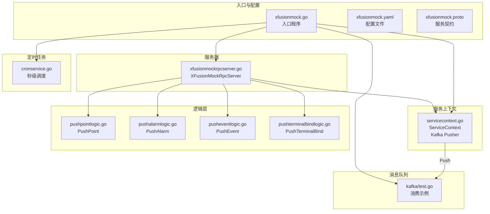
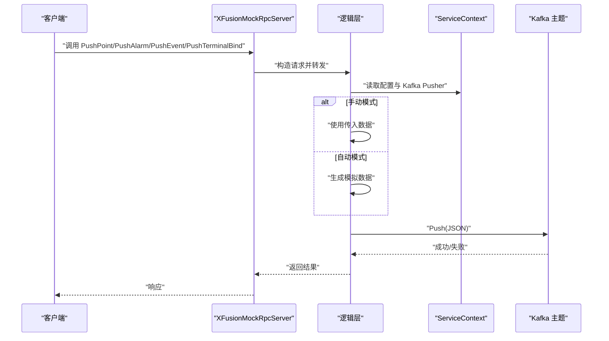
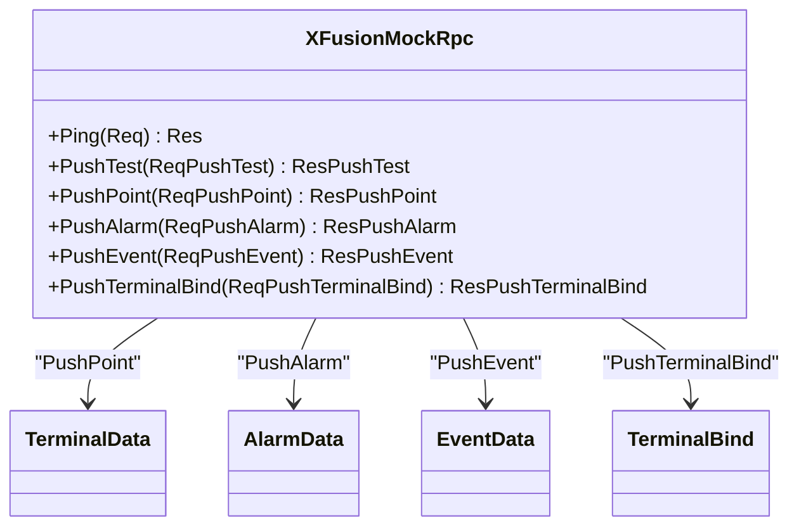
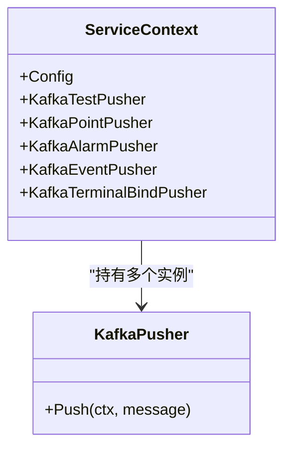
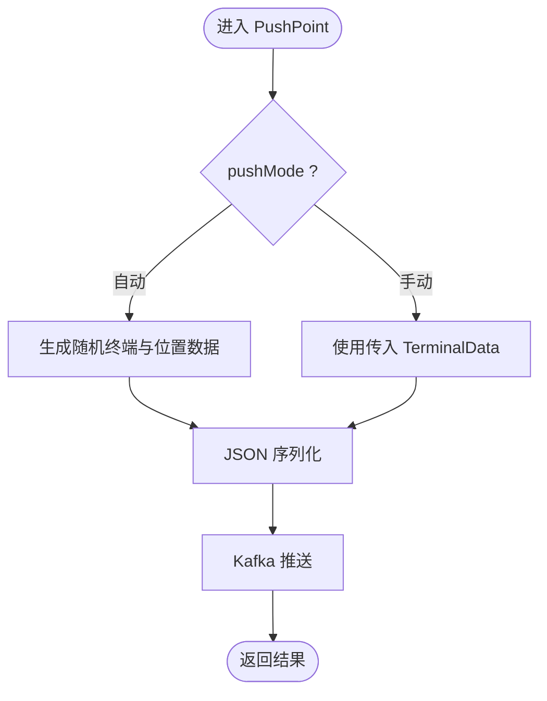
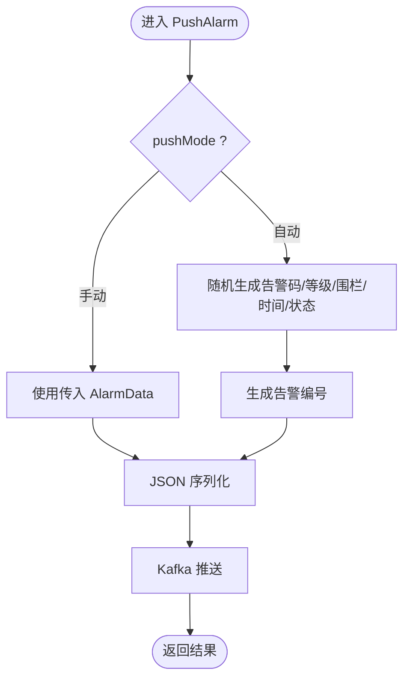
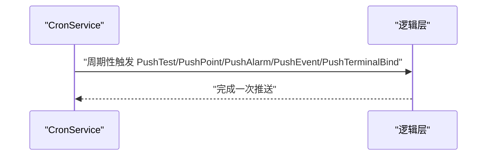
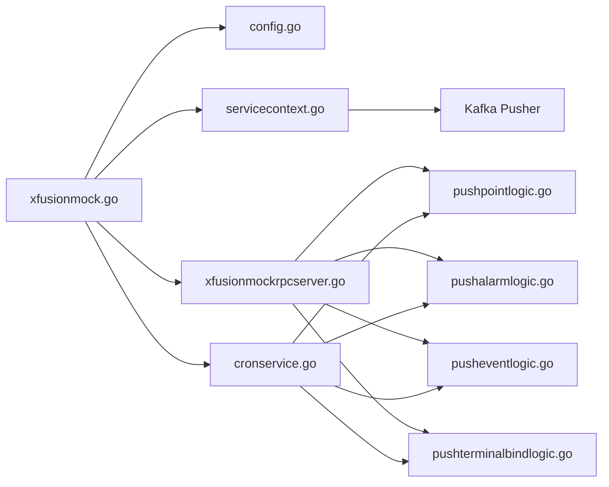

# XFusion模拟服务

<cite>
**本文引用的文件**
- [app/xfusionmock/xfusionmock.go](file://app/xfusionmock/xfusionmock.go)
- [app/xfusionmock/etc/xfusionmock.yaml](file://app/xfusionmock/etc/xfusionmock.yaml)
- [app/xfusionmock/xfusionmock.proto](file://app/xfusionmock/xfusionmock.proto)
- [app/xfusionmock/internal/config/config.go](file://app/xfusionmock/internal/config/config.go)
- [app/xfusionmock/internal/svc/servicecontext.go](file://app/xfusionmock/internal/svc/servicecontext.go)
- [app/xfusionmock/internal/server/xfusionmockrpcserver.go](file://app/xfusionmock/internal/server/xfusionmockrpcserver.go)
- [app/xfusionmock/internal/logic/pushpointlogic.go](file://app/xfusionmock/internal/logic/pushpointlogic.go)
- [app/xfusionmock/internal/logic/pushalarmlogic.go](file://app/xfusionmock/internal/logic/pushalarmlogic.go)
- [app/xfusionmock/internal/logic/pusheventlogic.go](file://app/xfusionmock/internal/logic/pusheventlogic.go)
- [app/xfusionmock/internal/logic/pushterminalbindlogic.go](file://app/xfusionmock/internal/logic/pushterminalbindlogic.go)
- [app/xfusionmock/cron/cronservice.go](file://app/xfusionmock/cron/cronservice.go)
- [app/xfusionmock/kafka/test.go](file://app/xfusionmock/kafka/test.go)
- [common/configx/mockconfig.go](file://common/configx/mockconfig.go)
</cite>

## 目录
1. [简介](#简介)
2. [项目结构](#项目结构)
3. [核心组件](#核心组件)
4. [架构总览](#架构总览)
5. [组件详解](#组件详解)
6. [依赖关系分析](#依赖关系分析)
7. [性能与扩展性](#性能与扩展性)
8. [故障排查指南](#故障排查指南)
9. [结论](#结论)
10. [附录](#附录)

## 简介
本文件为 XFusion 模拟服务的技术文档，聚焦于以下能力：
- 模拟数据生成：终端位置、事件、告警、终端绑定等
- 事件推送：通过 gRPC 提供统一入口，支持手动推送与自动推送两种模式
- 告警模拟：随机生成多种告警类型、等级与围栏信息
- 终端绑定：模拟绑定/解绑动作并推送到 Kafka
- 数据模型设计：基于 proto 的消息模型与服务契约
- 消息队列集成：Kafka 生产者封装与多主题推送
- 定时任务配置：基于 cron 的秒级调度，周期性触发各类推送
- 开发与测试：配置项说明、性能测试建议、调试工具使用

## 项目结构
XFusion 模拟服务采用 go-zero 微服务框架，按功能模块组织，核心目录如下：
- 入口与配置：入口程序、配置文件、proto 定义
- 服务上下文：封装 Kafka 生产者实例
- 服务端：gRPC 服务实现，路由到各逻辑层
- 逻辑层：各推送类型的业务逻辑与数据生成
- 定时任务：基于 cron 的周期性任务
- Kafka 消费示例：消费侧示例（用于验证）

**图表来源**
- [app/xfusionmock/xfusionmock.go:28-58](file://app/xfusionmock/xfusionmock.go#L28-L58)
- [app/xfusionmock/etc/xfusionmock.yaml:1-39](file://app/xfusionmock/etc/xfusionmock.yaml#L1-L39)
- [app/xfusionmock/xfusionmock.proto:274-303](file://app/xfusionmock/xfusionmock.proto#L274-L303)
- [app/xfusionmock/internal/svc/servicecontext.go:8-26](file://app/xfusionmock/internal/svc/servicecontext.go#L8-L26)
- [app/xfusionmock/internal/server/xfusionmockrpcserver.go:15-55](file://app/xfusionmock/internal/server/xfusionmockrpcserver.go#L15-L55)
- [app/xfusionmock/internal/logic/pushpointlogic.go:29-88](file://app/xfusionmock/internal/logic/pushpointlogic.go#L29-L88)
- [app/xfusionmock/internal/logic/pushalarmlogic.go:69-120](file://app/xfusionmock/internal/logic/pushalarmlogic.go#L69-L120)
- [app/xfusionmock/internal/logic/pusheventlogic.go:30-69](file://app/xfusionmock/internal/logic/pusheventlogic.go#L30-L69)
- [app/xfusionmock/internal/logic/pushterminalbindlogic.go:29-62](file://app/xfusionmock/internal/logic/pushterminalbindlogic.go#L29-L62)
- [app/xfusionmock/cron/cronservice.go:24-49](file://app/xfusionmock/cron/cronservice.go#L24-L49)
- [app/xfusionmock/kafka/test.go:19-22](file://app/xfusionmock/kafka/test.go#L19-L22)

**章节来源**
- [app/xfusionmock/xfusionmock.go:1-59](file://app/xfusionmock/xfusionmock.go#L1-L59)
- [app/xfusionmock/etc/xfusionmock.yaml:1-39](file://app/xfusionmock/etc/xfusionmock.yaml#L1-L39)

## 核心组件
- 入口程序：加载配置、初始化服务上下文、注册 gRPC 服务、启动 Kafka 队列与定时任务
- 服务上下文：封装 Kafka 生产者实例，分别对应测试、点位、告警、事件、终端绑定主题
- gRPC 服务：提供 Ping、PushTest、PushPoint、PushAlarm、PushEvent、PushTerminalBind 接口
- 逻辑层：根据 PushMode 决定使用传入数据或自动生成模拟数据，并写入对应 Kafka 主题
- 定时任务：基于 cron 的秒级调度，周期性触发各类推送
- 配置文件：包含 Kafka 连接、消费者组、主题、定时任务表达式、终端映射等

**章节来源**
- [app/xfusionmock/internal/config/config.go:10-21](file://app/xfusionmock/internal/config/config.go#L10-L21)
- [app/xfusionmock/internal/svc/servicecontext.go:8-26](file://app/xfusionmock/internal/svc/servicecontext.go#L8-L26)
- [app/xfusionmock/internal/server/xfusionmockrpcserver.go:26-54](file://app/xfusionmock/internal/server/xfusionmockrpcserver.go#L26-L54)
- [app/xfusionmock/cron/cronservice.go:24-49](file://app/xfusionmock/cron/cronservice.go#L24-L49)

## 架构总览
下图展示从客户端调用到数据生成与 Kafka 推送的整体流程。

**图表来源**
- [app/xfusionmock/internal/server/xfusionmockrpcserver.go:26-54](file://app/xfusionmock/internal/server/xfusionmockrpcserver.go#L26-L54)
- [app/xfusionmock/internal/logic/pushpointlogic.go:29-88](file://app/xfusionmock/internal/logic/pushpointlogic.go#L29-L88)
- [app/xfusionmock/internal/logic/pushalarmlogic.go:69-120](file://app/xfusionmock/internal/logic/pushalarmlogic.go#L69-L120)
- [app/xfusionmock/internal/logic/pusheventlogic.go:30-69](file://app/xfusionmock/internal/logic/pusheventlogic.go#L30-L69)
- [app/xfusionmock/internal/logic/pushterminalbindlogic.go:29-62](file://app/xfusionmock/internal/logic/pushterminalbindlogic.go#L29-L62)
- [app/xfusionmock/internal/svc/servicecontext.go:8-26](file://app/xfusionmock/internal/svc/servicecontext.go#L8-L26)

## 组件详解

### gRPC 接口与数据模型
- 服务契约：XFusionMockRpc 包含 Ping、PushTest、PushPoint、PushAlarm、PushEvent、PushTerminalBind
- 请求/响应模型：每个推送接口均提供 Req/Res 对应的消息体，支持手动模式（pushMode=true）与自动模式
- 数据模型：终端、位置、建筑、状态、告警、事件、围栏、绑定等字段在 proto 中定义

**图表来源**
- [app/xfusionmock/xfusionmock.proto:274-303](file://app/xfusionmock/xfusionmock.proto#L274-L303)
- [app/xfusionmock/xfusionmock.proto:137-151](file://app/xfusionmock/xfusionmock.proto#L137-L151)
- [app/xfusionmock/xfusionmock.proto:153-187](file://app/xfusionmock/xfusionmock.proto#L153-L187)
- [app/xfusionmock/xfusionmock.proto:117-135](file://app/xfusionmock/xfusionmock.proto#L117-L135)
- [app/xfusionmock/xfusionmock.proto:93-115](file://app/xfusionmock/xfusionmock.proto#L93-L115)

**章节来源**
- [app/xfusionmock/xfusionmock.proto:26-303](file://app/xfusionmock/xfusionmock.proto#L26-L303)

### 服务上下文与 Kafka 集成
- ServiceContext 在初始化时创建多个 Kafka Pusher，分别对应测试、点位、告警、事件、终端绑定主题
- 逻辑层通过 ServiceContext 获取对应 Pusher 并执行 Push 操作

**图表来源**
- [app/xfusionmock/internal/svc/servicecontext.go:8-26](file://app/xfusionmock/internal/svc/servicecontext.go#L8-L26)

**章节来源**
- [app/xfusionmock/internal/svc/servicecontext.go:8-26](file://app/xfusionmock/internal/svc/servicecontext.go#L8-L26)

### 推送逻辑与数据生成

#### PushPoint（点位推送）
- 手动模式：直接使用传入的 TerminalData
- 自动模式：随机选择终端号与用户编号，生成完整的 TerminalData（含位置、速度、方向、卫星数、楼层、状态等），然后序列化为 JSON 并推送到 Kafka 点位主题

**图表来源**
- [app/xfusionmock/internal/logic/pushpointlogic.go:29-88](file://app/xfusionmock/internal/logic/pushpointlogic.go#L29-L88)

**章节来源**
- [app/xfusionmock/internal/logic/pushpointlogic.go:29-88](file://app/xfusionmock/internal/logic/pushpointlogic.go#L29-L88)

#### PushAlarm（告警推送）
- 手动模式：直接使用传入的 AlarmData
- 自动模式：随机生成告警码、名称、等级、围栏、起止时间、持续时长与状态；生成唯一告警编号；序列化后推送到 Kafka 告警主题

**图表来源**
- [app/xfusionmock/internal/logic/pushalarmlogic.go:69-120](file://app/xfusionmock/internal/logic/pushalarmlogic.go#L69-L120)

**章节来源**
- [app/xfusionmock/internal/logic/pushalarmlogic.go:69-120](file://app/xfusionmock/internal/logic/pushalarmlogic.go#L69-L120)

#### PushEvent（事件推送）
- 手动模式：直接使用传入的 EventData
- 自动模式：生成事件 ID、标题、编码、服务端与终端时间、终端信息与位置，序列化后推送到 Kafka 事件主题

**章节来源**
- [app/xfusionmock/internal/logic/pusheventlogic.go:30-69](file://app/xfusionmock/internal/logic/pusheventlogic.go#L30-L69)

#### PushTerminalBind（终端绑定推送）
- 手动模式：直接使用传入的 TerminalBind
- 自动模式：随机选择终端号与用户编号，生成绑定动作（BIND）、时间等，序列化后推送到 Kafka 终端绑定主题

**章节来源**
- [app/xfusionmock/internal/logic/pushterminalbindlogic.go:29-62](file://app/xfusionmock/internal/logic/pushterminalbindlogic.go#L29-L62)

### 定时任务与调度
- 使用 cron（秒级）按配置的表达式周期性触发各类推送
- 各推送接口均以 Req* 空请求触发逻辑层的自动生成

**图表来源**
- [app/xfusionmock/cron/cronservice.go:24-49](file://app/xfusionmock/cron/cronservice.go#L24-L49)

**章节来源**
- [app/xfusionmock/cron/cronservice.go:24-49](file://app/xfusionmock/cron/cronservice.go#L24-L49)

### 配置文件与参数说明
- 基础配置：服务名、监听地址、日志编码、运行模式
- Kafka 配置：测试、点位、告警、事件、终端绑定主题的连接参数与消费者组
- 定时任务：PushCron、PushCronPoint 的 cron 表达式
- 终端映射：TerminalList 与 TerminalBind 映射（终端号 -> 用户编号）

**章节来源**
- [app/xfusionmock/etc/xfusionmock.yaml:1-39](file://app/xfusionmock/etc/xfusionmock.yaml#L1-L39)
- [app/xfusionmock/internal/config/config.go:10-21](file://app/xfusionmock/internal/config/config.go#L10-L21)

## 依赖关系分析
- 入口程序依赖配置、服务上下文、gRPC 注册、定时任务与 Kafka 队列
- gRPC 服务依赖逻辑层
- 逻辑层依赖服务上下文中的 Kafka Pusher
- 定时任务依赖逻辑层的空请求触发
- 配置文件驱动所有组件的行为

**图表来源**
- [app/xfusionmock/xfusionmock.go:28-58](file://app/xfusionmock/xfusionmock.go#L28-L58)
- [app/xfusionmock/internal/server/xfusionmockrpcserver.go:26-54](file://app/xfusionmock/internal/server/xfusionmockrpcserver.go#L26-L54)
- [app/xfusionmock/internal/logic/pushpointlogic.go:29-88](file://app/xfusionmock/internal/logic/pushpointlogic.go#L29-L88)
- [app/xfusionmock/internal/logic/pushalarmlogic.go:69-120](file://app/xfusionmock/internal/logic/pushalarmlogic.go#L69-L120)
- [app/xfusionmock/internal/logic/pusheventlogic.go:30-69](file://app/xfusionmock/internal/logic/pusheventlogic.go#L30-L69)
- [app/xfusionmock/internal/logic/pushterminalbindlogic.go:29-62](file://app/xfusionmock/internal/logic/pushterminalbindlogic.go#L29-L62)
- [app/xfusionmock/internal/svc/servicecontext.go:8-26](file://app/xfusionmock/internal/svc/servicecontext.go#L8-L26)
- [app/xfusionmock/cron/cronservice.go:24-49](file://app/xfusionmock/cron/cronservice.go#L24-L49)

**章节来源**
- [app/xfusionmock/xfusionmock.go:28-58](file://app/xfusionmock/xfusionmock.go#L28-L58)

## 性能与扩展性
- Kafka 生产者：每个主题独立 Pusher，便于隔离与扩展
- 定时任务：秒级调度，可根据负载调整表达式与并发
- 数据生成：随机算法与原子计数器保证并发安全
- 建议
  - 在高并发场景下，可增加 Kafka 分区与消费者组副本
  - 为不同主题设置独立的分区键策略，提升吞吐
  - 对生成的数据进行采样与限流，避免对下游造成压力
  - 使用压测工具（如 ab、wrk 或自研压测脚本）验证接口与 Kafka 吞吐

[本节为通用建议，无需具体文件引用]

## 故障排查指南
- gRPC 无法启动
  - 检查配置文件中的监听地址与模式
  - 确认反射仅在开发/测试模式启用
- Kafka 推送失败
  - 核对 Kafka 地址、主题与消费者组配置
  - 查看服务日志确认 Push 返回值
- 定时任务未触发
  - 检查 cron 表达式是否正确
  - 确认服务已启动且无异常退出
- 数据不完整或异常
  - 手动模式下检查传入数据结构
  - 自动模式下检查终端映射与随机种子

**章节来源**
- [app/xfusionmock/xfusionmock.go:39-45](file://app/xfusionmock/xfusionmock.go#L39-L45)
- [app/xfusionmock/etc/xfusionmock.yaml:6-31](file://app/xfusionmock/etc/xfusionmock.yaml#L6-L31)
- [app/xfusionmock/cron/cronservice.go:24-49](file://app/xfusionmock/cron/cronservice.go#L24-L49)

## 结论
XFusion 模拟服务通过清晰的分层设计与配置驱动，实现了对点位、事件、告警、终端绑定的灵活模拟与推送。结合 Kafka 与定时任务，可在本地快速搭建完整的数据链路验证环境。建议在生产前完善压测与监控，并根据实际业务扩展更多模拟场景。

[本节为总结，无需具体文件引用]

## 附录

### 配置项说明（摘录）
- 基础
  - Name：服务名
  - ListenOn：监听地址
  - Mode：运行模式（dev/test/prod）
  - Log.Encoding：日志编码
- KafkaTestConfig：测试主题配置（Brokers、Group、Topic、Offset、Consumer、Processors）
- KafkaPointConfig：点位主题配置（Brokers、Topic）
- KafkaAlarmConfig：告警主题配置（Brokers、Topic）
- KafkaEventConfig：事件主题配置（Brokers、Topic）
- KafkaTerminalBind：终端绑定主题配置（Brokers、Topic）
- PushCron：通用推送周期（秒级）
- PushCronPoint：点位推送周期（秒级）
- TerminalList：可用终端号列表
- TerminalBind：终端号到用户编号的映射

**章节来源**
- [app/xfusionmock/etc/xfusionmock.yaml:1-39](file://app/xfusionmock/etc/xfusionmock.yaml#L1-L39)

### 接口清单与行为
- Ping：连通性测试
- PushTest：测试推送（通常用于验证链路）
- PushPoint：点位推送（支持手动/自动）
- PushAlarm：告警推送（支持手动/自动）
- PushEvent：事件推送（支持手动/自动）
- PushTerminalBind：终端绑定推送（支持手动/自动）

**章节来源**
- [app/xfusionmock/xfusionmock.proto:274-303](file://app/xfusionmock/xfusionmock.proto#L274-L303)

### 开发与测试建议
- 开发阶段
  - 使用 dev 模式开启 gRPC 反射，便于本地联调
  - 通过手动模式快速验证自定义数据
- 测试阶段
  - 使用定时任务进行自动化回归
  - 通过 Kafka 消费端验证消息完整性与时序
- 性能测试
  - 使用压测工具对 gRPC 接口与 Kafka 吞吐进行评估
  - 逐步提高并发与数据量，观察延迟与丢包情况

**章节来源**
- [app/xfusionmock/xfusionmock.go:42-44](file://app/xfusionmock/xfusionmock.go#L42-L44)
- [app/xfusionmock/etc/xfusionmock.yaml:31-38](file://app/xfusionmock/etc/xfusionmock.yaml#L31-L38)

### 调试工具与技巧
- 日志：利用全局日志字段与服务上下文日志输出关键路径
- 反射：开发模式下启用 gRPC 反射，便于使用 grpcurl 或浏览器调试
- Kafka：通过消费示例验证消息是否正确到达指定主题

**章节来源**
- [app/xfusionmock/xfusionmock.go:42-44](file://app/xfusionmock/xfusionmock.go#L42-L44)
- [app/xfusionmock/kafka/test.go:19-22](file://app/xfusionmock/kafka/test.go#L19-L22)