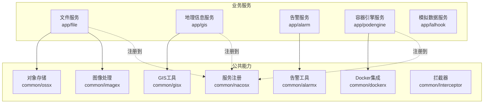
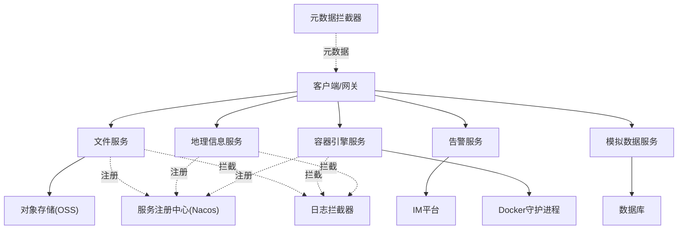
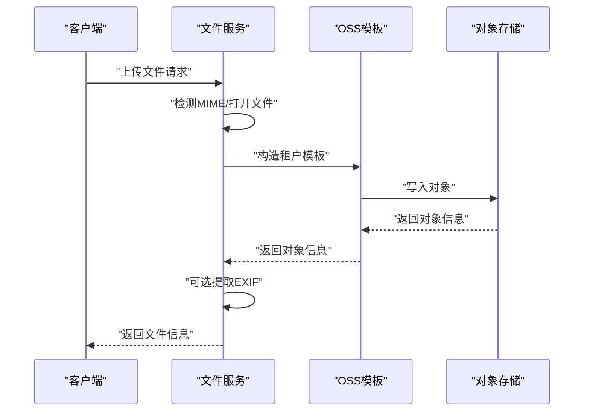
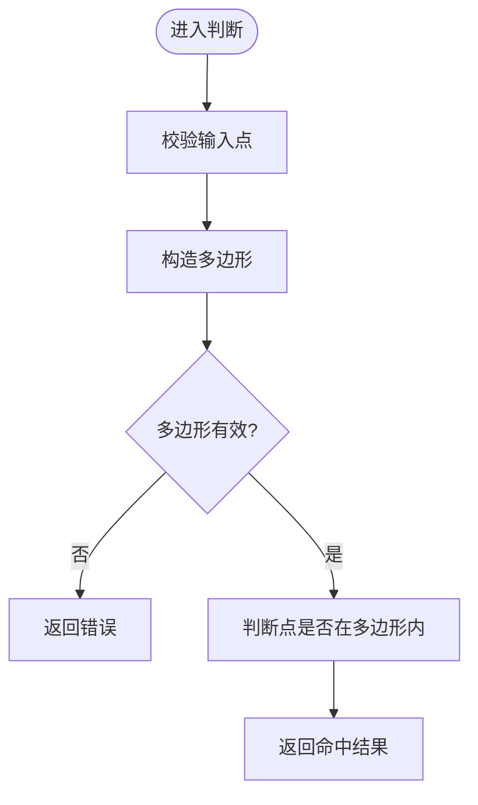
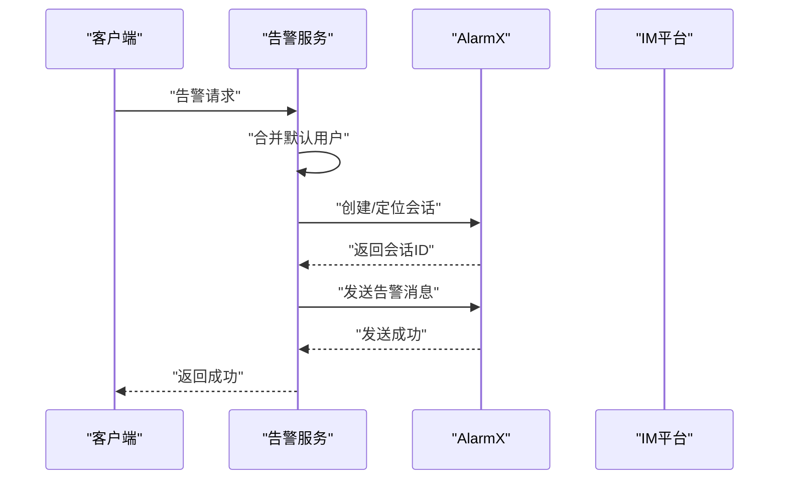
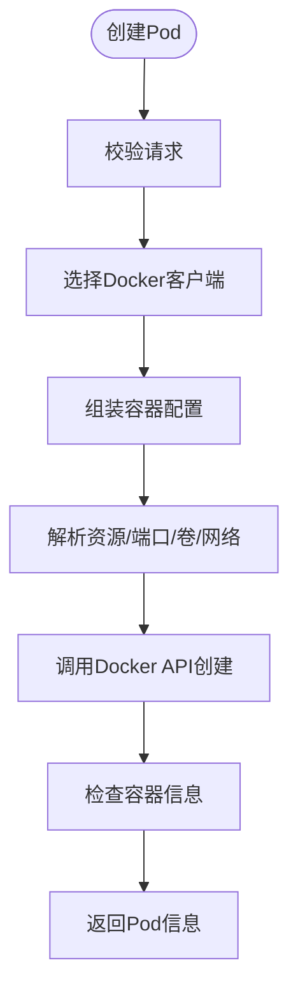
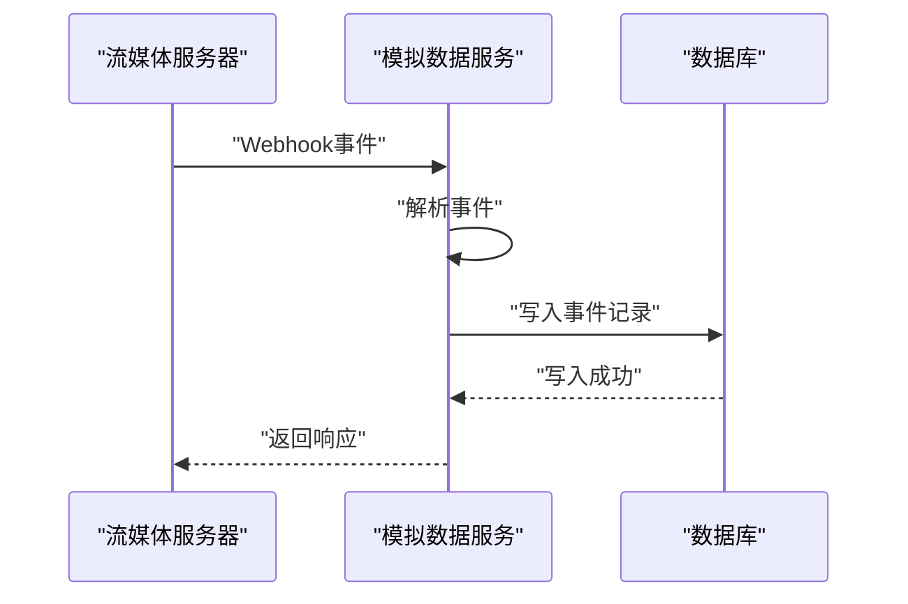
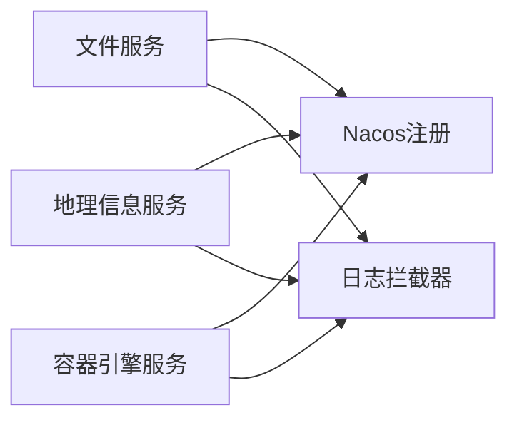

# 业务域服务

<cite>
**本文引用的文件**
- [app/file/file.go](file://app/file/file.go)
- [app/file/internal/config/config.go](file://app/file/internal/config/config.go)
- [app/file/internal/logic/putfilelogic.go](file://app/file/internal/logic/putfilelogic.go)
- [app/gis/gis.go](file://app/gis/gis.go)
- [app/gis/internal/config/config.go](file://app/gis/internal/config/config.go)
- [app/gis/internal/logic/pointinfencelogic.go](file://app/gis/internal/logic/pointinfencelogic.go)
- [app/alarm/alarm.go](file://app/alarm/alarm.go)
- [app/alarm/internal/config/config.go](file://app/alarm/internal/config/config.go)
- [app/alarm/internal/logic/alarmlogic.go](file://app/alarm/internal/logic/alarmlogic.go)
- [app/podengine/podengine.go](file://app/podengine/podengine.go)
- [app/podengine/internal/config/config.go](file://app/podengine/internal/config/config.go)
- [app/podengine/internal/logic/createpodlogic.go](file://app/podengine/internal/logic/createpodlogic.go)
- [app/lalhook/lalhook.go](file://app/lalhook/lalhook.go)
- [app/lalhook/etc/lalhook.yaml](file://app/lalhook/etc/lalhook.yaml)
- [common/ossx/ossx.go](file://common/ossx/ossx.go)
- [common/ossx/minio_oss.go](file://common/ossx/minio_oss.go)
- [common/ossx/osssconfig/ossconfig.go](file://common/ossx/osssconfig/ossconfig.go)
- [common/imagex/exifx.go](file://common/imagex/exifx.go)
- [common/imagex/imaging.go](file://common/imagex/imaging.go)
- [common/dockerx/dockerx.go](file://common/dockerx/dockerx.go)
- [common/gisx/gisx.go](file://common/gisx/gisx.go)
- [common/alarmx/alarmx.go](file://common/alarmx/alarmx.go)
- [common/nacosx/register.go](file://common/nacosx/register.go)
- [common/nacosx/options.go](file://common/nacosx/options.go)
- [common/nacosx/resolver.go](file://common/nacosx/resolver.go)
- [common/nacosx/target.go](file://common/nacosx/target.go)
- [common/nacosx/builder.go](file://common/nacosx/builder.go)
- [common/Interceptor/rpcserver/loggerInterceptor.go](file://common/Interceptor/rpcserver/loggerInterceptor.go)
- [common/Interceptor/rpcserver/metadataInterceptor.go](file://common/Interceptor/rpcserver/metadataInterceptor.go)
- [zerorpc/zerorpc.go](file://zerorpc/zerorpc.go)
- [zerorpc/internal/config/config.go](file://zerorpc/internal/config/config.go)
- [zerorpc/internal/logic/loginlogic.go](file://zerorpc/internal/logic/loginlogic.go)
- [zerorpc/internal/logic/getuserinfologic.go](file://zerorpc/internal/logic/getuserinfologic.go)
- [zerorpc/internal/logic/edituserinfologic.go](file://zerorpc/internal/logic/edituserinfologic.go)
- [zerorpc/internal/logic/senddelaytasklogic.go](file://zerorpc/internal/logic/senddelaytasklogic.go)
- [zerorpc/internal/logic/forwardtasklogic.go](file://zerorpc/internal/logic/forwardtasklogic.go)
- [zerorpc/internal/logic/generatetokenlogic.go](file://zerorpc/internal/logic/generatetokenlogic.go)
- [zerorpc/internal/logic/sendsmsverifycodelogic.go](file://zerorpc/internal/logic/sendsmsverifycodelogic.go)
- [zerorpc/internal/logic/wxpayjsapilogic.go](file://zerorpc/internal/logic/wxpayjsapilogic.go)
- [zerorpc/internal/logic/getregionlistlogic.go](file://zerorpc/internal/logic/getregionlistlogic.go)
- [zerorpc/internal/logic/miniprogramloginlogic.go](file://zerorpc/internal/logic/miniprogramloginlogic.go)
- [zerorpc/internal/logic/pinglogic.go](file://zerorpc/internal/logic/pinglogic.go)
- [zerorpc/internal/task/routes.go](file://zerorpc/internal/task/routes.go)
- [zerorpc/internal/task/scheduler/cron_scheduler.go](file://zerorpc/internal/task/scheduler/cron_scheduler.go)
- [zerorpc/internal/task/deferdelaytask.go](file://zerorpc/internal/task/deferdelaytask.go)
- [zerorpc/internal/task/deferforwardtask.go](file://zerorpc/internal/task/deferforwardtask.go)
- [zerorpc/internal/svc/servicecontext.go](file://zerorpc/internal/svc/servicecontext.go)
- [zerorpc/internal/server/zerorpcserver.go](file://zerorpc/internal/server/zerorpcserver.go)
- [zerorpc/internal/handler/routes.go](file://zerorpc/internal/handler/routes.go)
- [zerorpc/internal/handler/common/commonlogic.go](file://zerorpc/internal/handler/common/commonlogic.go)
- [zerorpc/internal/handler/user/userlogic.go](file://zerorpc/internal/handler/user/userlogic.go)
- [zerorpc/internal/handler/file/filelogic.go](file://zerorpc/internal/handler/file/filelogic.go)
- [zerorpc/internal/handler/pay/paylogic.go](file://zerorpc/internal/handler/pay/paylogic.go)
- [zerorpc/internal/handler/gtw/gtwlogic.go](file://zerorpc/internal/handler/gtw/gtwlogic.go)
- [zerorpc/internal/handler/common/routes.go](file://zerorpc/internal/handler/common/routes.go)
- [zerorpc/internal/handler/user/routes.go](file://zerorpc/internal/handler/user/routes.go)
- [zerorpc/internal/handler/file/routes.go](file://zerorpc/internal/handler/file/routes.go)
- [zerorpc/internal/handler/pay/routes.go](file://zerorpc/internal/handler/pay/routes.go)
- [zerorpc/internal/handler/gtw/routes.go](file://zerorpc/internal/handler/gtw/routes.go)
- [zerorpc/internal/handler/routes.go](file://zerorpc/internal/handler/routes.go)
- [zerorpc/internal/logic/pinglogic.go](file://zerorpc/internal/logic/pinglogic.go)
- [zerorpc/internal/logic/pinglogic.go](file://zerorpc/internal/logic/pinglogic.go)
- [zerorpc/internal/logic/pinglogic.go](file://zerorpc/internal/logic/pinglogic.go)
- [zerorpc/internal/logic/pinglogic.go](file://zerorpc/internal/logic/pinglogic.go)
- [zerorpc/internal/logic/pinglogic.go](file://zerorpc/internal/logic/pinglogic.go)
- [zerorpc/internal/logic/pinglogic.go](file://zerorpc/internal/logic/pinglogic.go)
- [zerorpc/internal/logic/pinglogic.go](file://zerorpc/internal/logic/pinglogic.go)
- [zerorpc/internal/logic/pinglogic.go](file://zerorpc/internal/logic/pinglogic.go)
- [zerorpc/internal/logic/pinglogic.go](file://zerorpc/internal/logic/pinglogic.go)
- [zerorpc/internal/logic/pinglogic.go](file://zerorpc/internal/logic/pinglogic.go)
- [zerorpc/internal/logic/pinglogic.go](file://zerorpc/internal/logic/pinglogic.go)
- [zerorpc/internal/logic/pinglogic.go](file://zerorpc/internal/logic/pinglogic.go)
- [zerorpc/internal/logic/pinglogic.go](file://zerorpc/internal/logic/pinglogic.go)
- [zerorpc/internal/logic/pinglogic.go](file://zerorpc/internal/logic/pinglogic.go)
- [zerorpc/internal/logic/pinglogic.go](file://zerorpc/internal/logic/pinglogic.go)
- [zerorpc/internal/logic/pinglogic.go](file://zerorpc/internal/logic/pinglogic.go)
- [zerorpc/internal/logic/pinglogic.go](file://zerorpc/internal/logic/pinglogic.go)
- [zerorpc/internal/logic/pinglogic.go](file://zerorpc/internal/logic/pinglogic.go)
- [zerorpc/internal/logic/pinglogic.go](file://zerorpc/internal/logic/pinglogic.go)
- [zerorpc/internal/logic/pinglogic.go](file://zerorpc/internal/logic/pinglogic.go)
- [zerorpc/internal/logic......](file://zerorpc/internal/logic/pinglogic.go)
</cite>

## 目录
1. [简介](#简介)
2. [项目结构](#项目结构)
3. [核心组件](#核心组件)
4. [架构总览](#架构总览)
5. [详细组件分析](#详细组件分析)
6. [依赖分析](#依赖分析)
7. [性能考虑](#性能考虑)
8. [故障排查指南](#故障排查指南)
9. [结论](#结论)
10. [附录](#附录)

## 简介
本文件面向 Zero-Service 的业务域服务，系统性梳理并阐述以下核心能力：
- 文件管理服务：支持对象存储接入、分片与直传、缩略图生成、媒体元数据提取等。
- 地理信息系统服务：提供电子围栏判断、坐标转换、距离计算、地理编码/解码等 GIS 能力。
- 告警管理服务：对接 IM 平台，统一告警下发、会话管理与交互卡片处理。
- 容器引擎服务：基于 Docker API 提供 Pod 生命周期管理与资源编排。
- 模拟数据服务：通过 Webhook 接收流媒体服务器事件，进行数据落盘与转发。

同时，文档覆盖各服务的领域模型、业务流程、数据结构设计、服务间协作与数据流转，并给出扩展接口与自定义配置建议，以及最佳实践与性能调优要点。

## 项目结构
业务域服务采用“按服务分目录”的组织方式，每个服务包含入口程序、配置、逻辑层、服务上下文与 gRPC/HTTP 服务注册。公共能力集中在 common 子目录，提供 OSS、图像处理、Docker、GIS、告警等通用模块。

图表来源
- [app/file/file.go:1-72](file://app/file/file.go#L1-L72)
- [app/gis/gis.go:1-71](file://app/gis/gis.go#L1-L71)
- [app/podengine/podengine.go:1-69](file://app/podengine/podengine.go#L1-L69)
- [common/ossx/ossx.go](file://common/ossx/ossx.go)
- [common/imagex/exifx.go](file://common/imagex/exifx.go)
- [common/dockerx/dockerx.go](file://common/dockerx/dockerx.go)
- [common/gisx/gisx.go](file://common/gisx/gisx.go)
- [common/alarmx/alarmx.go](file://common/alarmx/alarmx.go)
- [common/nacosx/register.go](file://common/nacosx/register.go)
- [common/Interceptor/rpcserver/loggerInterceptor.go](file://common/Interceptor/rpcserver/loggerInterceptor.go)

章节来源
- [app/file/file.go:1-72](file://app/file/file.go#L1-L72)
- [app/gis/gis.go:1-71](file://app/gis/gis.go#L1-L71)
- [app/podengine/podengine.go:1-69](file://app/podengine/podengine.go#L1-L69)
- [app/lalhook/lalhook.go:1-49](file://app/lalhook/lalhook.go#L1-L49)

## 核心组件
本节对四大业务域服务进行概览式说明，包括职责边界、关键配置项与典型用法。

- 文件管理服务
  - 职责：封装对象存储操作、文件直传/分片、缩略图生成、图像 EXIF 元数据提取。
  - 关键配置：OSS 连接参数、租户模式、缓存、缩略图并发度。
  - 典型流程：客户端上传文件 → 服务端检测 MIME → 写入 OSS → 可选提取 EXIF → 返回文件元信息。

- 地理信息系统服务
  - 职责：点是否命中电子围栏、坐标转换、距离计算、地理编码/解码、路径点生成。
  - 关键配置：gRPC 服务端配置、可选服务注册。
  - 典型流程：输入经纬度与围栏多边形 → 构建几何对象 → 判断包含关系 → 返回命中结果。

- 告警管理服务
  - 职责：统一告警发送、IM 会话管理、交互卡片回调处理。
  - 关键配置：应用凭据、加密密钥、校验令牌、用户列表、通知路径。
  - 典型流程：接收告警请求 → 合并默认用户 → 创建/定位会话 → 发送消息 → 可选注册事件/卡片回调。

- 容器引擎服务
  - 职责：基于 Docker API 的 Pod 创建、网络/端口映射、资源限制、卷挂载、重启策略。
  - 关键配置：Docker 客户端配置、节点选择、服务注册。
  - 典型流程：解析 Pod 规约 → 组装容器配置 → 调用 Docker API 创建 → 返回 Pod 信息。

- 模拟数据服务
  - 职责：接收流媒体服务器 Webhook 事件，进行数据持久化与转发。
  - 关键配置：HTTP 服务地址、日志、超时、数据库连接。
  - 典型流程：Webhook 请求到达 → 解析事件 → 写入数据库/转发 → 返回响应。

章节来源
- [app/file/internal/config/config.go:1-31](file://app/file/internal/config/config.go#L1-L31)
- [app/gis/internal/config/config.go:1-17](file://app/gis/internal/config/config.go#L1-L17)
- [app/alarm/internal/config/config.go:1-16](file://app/alarm/internal/config/config.go#L1-L16)
- [app/podengine/internal/config/config.go:1-18](file://app/podengine/internal/config/config.go#L1-L18)
- [app/lalhook/etc/lalhook.yaml:1-10](file://app/lalhook/etc/lalhook.yaml#L1-L10)

## 架构总览
下图展示业务域服务的整体架构与交互关系，突出服务注册、拦截器、公共能力模块与外部系统对接。

图表来源
- [app/file/file.go:1-72](file://app/file/file.go#L1-L72)
- [app/gis/gis.go:1-71](file://app/gis/gis.go#L1-L71)
- [app/podengine/podengine.go:1-69](file://app/podengine/podengine.go#L1-L69)
- [common/Interceptor/rpcserver/loggerInterceptor.go](file://common/Interceptor/rpcserver/loggerInterceptor.go)
- [common/Interceptor/rpcserver/metadataInterceptor.go](file://common/Interceptor/rpcserver/metadataInterceptor.go)
- [common/nacosx/register.go](file://common/nacosx/register.go)

## 详细组件分析

### 文件管理服务
- 领域模型
  - 文件实体：包含存储桶、文件名、大小、MIME 类型、元数据（如 EXIF）等。
  - 租户维度：支持按租户与代码隔离存储空间。
  - 缩略图并发：控制缩略图生成并发度以平衡吞吐与资源占用。

- 业务流程
  - 上传文件：检测 MIME → 写入 OSS → 可选提取 EXIF → 返回文件信息。
  - 分片/直传：通过模板化 OSS 配置与租户策略，支持多种存储后端。
  - 缩略图：结合图像处理模块，按需生成缩略图并写回存储。

- 数据结构设计
  - 请求/响应：PutFileReq/PutFileRes，包含租户标识、桶名、文件名、路径等。
  - OSS 配置：OssConf，支持租户模式与多后端适配。
  - 图像元数据：ImageMeta，封装 EXIF 信息。

- 扩展接口与配置
  - 自定义 OSS 后端：通过 OSS 模板工厂扩展新存储实现。
  - 并发控制：调整缩略图并发度以适配不同硬件条件。
  - 插件化：新增媒体类型检测与处理逻辑。

图表来源
- [app/file/internal/logic/putfilelogic.go:33-77](file://app/file/internal/logic/putfilelogic.go#L33-L77)
- [common/ossx/ossx.go](file://common/ossx/ossx.go)
- [common/imagex/exifx.go](file://common/imagex/exifx.go)

章节来源
- [app/file/file.go:1-72](file://app/file/file.go#L1-L72)
- [app/file/internal/config/config.go:1-31](file://app/file/internal/config/config.go#L1-L31)
- [app/file/internal/logic/putfilelogic.go:1-78](file://app/file/internal/logic/putfilelogic.go#L1-L78)
- [common/ossx/osssconfig/ossconfig.go](file://common/ossx/osssconfig/ossconfig.go)
- [common/imagex/imaging.go](file://common/imagex/imaging.go)

### 地理信息系统服务
- 领域模型
  - 围栏：由一组顶点构成的多边形，支持 ID 或顶点两种表达。
  - 点：经纬度坐标，用于判断是否命中围栏。
  - 几何工具：基于 orb 库进行平面几何运算。

- 业务流程
  - 单点围栏判断：校验输入点 → 构造多边形 → 使用平面几何判断包含关系 → 返回命中结果。
  - 扩展：支持从缓存/数据库加载围栏 ID 对应的多边形。

- 数据结构设计
  - 请求/响应：PointInFenceReq/Res，包含点与围栏描述。
  - 多边形：由点序列组成，支持从 PB 点转换为几何对象。

- 扩展接口与配置
  - 新增算法：如距离计算、H3/GeoHash 编解码、路径点生成等。
  - 缓存策略：对围栏几何进行缓存以提升查询性能。

图表来源
- [app/gis/internal/logic/pointinfencelogic.go:29-58](file://app/gis/internal/logic/pointinfencelogic.go#L29-L58)

章节来源
- [app/gis/gis.go:1-71](file://app/gis/gis.go#L1-L71)
- [app/gis/internal/config/config.go:1-17](file://app/gis/internal/config/config.go#L1-L17)
- [app/gis/internal/logic/pointinfencelogic.go:1-59](file://app/gis/internal/logic/pointinfencelogic.go#L1-L59)
- [common/gisx/gisx.go](file://common/gisx/gisx.go)

### 告警管理服务
- 领域模型
  - 告警信息：描述、用户列表、聊天名称等。
  - 会话管理：创建/更新 IM 会话，支持动态命名规则。
  - 交互卡片：支持卡片动作回调，便于自动化处理。

- 业务流程
  - 统一告警：合并用户列表去重 → 创建/定位会话 → 发送消息。
  - 事件/卡片回调：可选注册，处理外部事件与交互动作。

- 数据结构设计
  - 请求/响应：AlarmReq/Res，包含描述、用户ID、聊天名称等。
  - 配置：AppId/AppSecret/EncryptKey/VerificationToken/UserId/Path。

- 扩展接口与配置
  - 多平台支持：通过 AlarmX 抽象对接不同 IM 平台。
  - 自定义路由：扩展事件/卡片处理逻辑。

图表来源
- [app/alarm/internal/logic/alarmlogic.go:31-63](file://app/alarm/internal/logic/alarmlogic.go#L31-L63)

章节来源
- [app/alarm/alarm.go:1-44](file://app/alarm/alarm.go#L1-L44)
- [app/alarm/internal/config/config.go:1-16](file://app/alarm/internal/config/config.go#L1-L16)
- [app/alarm/internal/logic/alarmlogic.go:1-184](file://app/alarm/internal/logic/alarmlogic.go#L1-L184)
- [common/alarmx/alarmx.go](file://common/alarmx/alarmx.go)

### 容器引擎服务
- 领域模型
  - Pod：包含名称、阶段、容器列表、标签注解、创建时间等。
  - 容器：镜像、环境变量、命令、资源、卷挂载、端口映射等。
  - 资源限制：CPU/Memory 的限额与预留、重启策略、网络模式。

- 业务流程
  - 创建 Pod：校验请求 → 选择节点/Docker 客户端 → 组装容器配置 → 调用 Docker API → 返回 Pod 信息。

- 数据结构设计
  - 请求/响应：CreatePodReq/Res，包含 Pod 名称、规格、容器规范等。
  - 资源解析：CPU/内存限额与请求解析、端口映射、卷挂载、重启策略。

- 扩展接口与配置
  - 多节点支持：通过 Docker 客户端映射实现跨节点调度。
  - 网络策略：支持 host/bridge/none 等网络模式与自定义网络名。

图表来源
- [app/podengine/internal/logic/createpodlogic.go:34-152](file://app/podengine/internal/logic/createpodlogic.go#L34-L152)

章节来源
- [app/podengine/podengine.go:1-69](file://app/podengine/podengine.go#L1-L69)
- [app/podengine/internal/config/config.go:1-18](file://app/podengine/internal/config/config.go#L1-L18)
- [app/podengine/internal/logic/createpodlogic.go:1-288](file://app/podengine/internal/logic/createpodlogic.go#L1-L288)
- [common/dockerx/dockerx.go](file://common/dockerx/dockerx.go)

### 模拟数据服务
- 领域模型
  - Webhook 事件：来自流媒体服务器的事件数据，用于记录与转发。
  - 数据持久化：通过数据库模型写入事件记录。

- 业务流程
  - Webhook 接收：解析请求 → 写入数据库/转发 → 返回响应。

- 数据结构设计
  - 配置：HTTP 服务地址、日志、超时、数据库连接字符串。

- 扩展接口与配置
  - CORS 策略：支持动态 Origin 与自定义头部。
  - 事件路由：扩展更多事件类型与处理逻辑。

图表来源
- [app/lalhook/lalhook.go:28-47](file://app/lalhook/lalhook.go#L28-L47)
- [app/lalhook/etc/lalhook.yaml:1-10](file://app/lalhook/etc/lalhook.yaml#L1-L10)

章节来源
- [app/lalhook/lalhook.go:1-49](file://app/lalhook/lalhook.go#L1-L49)
- [app/lalhook/etc/lalhook.yaml:1-10](file://app/lalhook/etc/lalhook.yaml#L1-L10)

## 依赖分析
- 服务注册与发现
  - 文件、地理信息、容器引擎服务均支持将自身注册至 Nacos，便于服务治理与发现。
- 拦截器链路
  - gRPC 服务统一添加日志拦截器，便于链路追踪与问题定位。
- 外部依赖
  - 文件服务依赖 OSS 与图像处理模块；容器引擎服务依赖 Docker 守护进程；告警服务依赖 IM 平台；模拟数据服务依赖数据库。

图表来源
- [common/nacosx/register.go](file://common/nacosx/register.go)
- [common/Interceptor/rpcserver/loggerInterceptor.go](file://common/Interceptor/rpcserver/loggerInterceptor.go)
- [app/file/file.go:46-64](file://app/file/file.go#L46-L64)
- [app/gis/gis.go:45-63](file://app/gis/gis.go#L45-L63)
- [app/podengine/podengine.go:44-62](file://app/podengine/podengine.go#L44-L62)

章节来源
- [app/file/file.go:1-72](file://app/file/file.go#L1-L72)
- [app/gis/gis.go:1-71](file://app/gis/gis.go#L1-L71)
- [app/podengine/podengine.go:1-69](file://app/podengine/podengine.go#L1-L69)
- [common/nacosx/register.go](file://common/nacosx/register.go)
- [common/Interceptor/rpcserver/loggerInterceptor.go](file://common/Interceptor/rpcserver/loggerInterceptor.go)

## 性能考虑
- 文件服务
  - 并发控制：通过缩略图并发度参数平衡吞吐与资源占用。
  - 存储优化：合理设置租户隔离与桶策略，避免热点与碎片。
- 地理信息
  - 几何缓存：对常用围栏几何进行缓存，减少重复构建成本。
  - 批量处理：对批量判断场景进行批量化优化。
- 告警服务
  - 用户去重：在发送前进行去重，避免重复消息。
  - 异步处理：对非关键路径使用异步队列降低延迟。
- 容器引擎
  - 资源规划：合理设置 CPU/Memory 的限额与请求，避免过度竞争。
  - 端口映射：仅在需要时暴露端口，减少网络开销。
- 模拟数据
  - 数据库索引：为事件表建立合适索引，提升写入与查询性能。
  - 流控：对高并发 Webhook 进行限流与背压处理。

## 故障排查指南
- 服务启动与注册
  - 检查 Nacos 配置与连通性，确认服务注册成功。
  - 查看日志拦截器输出，定位请求/响应异常。
- 文件上传
  - 确认 OSS 配置正确，租户模式与桶名匹配。
  - 检查文件权限与磁盘空间，关注 MIME 检测与 EXIF 提取失败。
- 地理围栏
  - 校验输入点与围栏多边形有效性，确保坐标顺序正确。
- 告警发送
  - 校验 IM 平台凭据与令牌，确认会话创建与消息发送成功。
- 容器创建
  - 检查节点选择与 Docker 客户端可用性，核对资源与网络配置。
- Webhook
  - 校验 CORS 配置与数据库连接，关注事件解析与写入异常。

章节来源
- [common/nacosx/register.go](file://common/nacosx/register.go)
- [common/Interceptor/rpcserver/loggerInterceptor.go](file://common/Interceptor/rpcserver/loggerInterceptor.go)
- [app/file/internal/logic/putfilelogic.go:33-77](file://app/file/internal/logic/putfilelogic.go#L33-L77)
- [app/gis/internal/logic/pointinfencelogic.go:29-58](file://app/gis/internal/logic/pointinfencelogic.go#L29-L58)
- [app/alarm/internal/logic/alarmlogic.go:31-63](file://app/alarm/internal/logic/alarmlogic.go#L31-L63)
- [app/podengine/internal/logic/createpodlogic.go:34-152](file://app/podengine/internal/logic/createpodlogic.go#L34-L152)
- [app/lalhook/lalhook.go:28-47](file://app/lalhook/lalhook.go#L28-L47)

## 结论
本文档系统梳理了 Zero-Service 的四大业务域服务，明确了领域模型、业务流程、数据结构与服务协作关系，并提供了扩展接口与配置建议。通过合理的性能调优与故障排查策略，可在生产环境中稳定运行并持续演进。

## 附录
- 配置参考
  - 文件服务：OSS、租户模式、缓存、缩略图并发度。
  - 地理信息服务：gRPC 服务端配置、可选服务注册。
  - 告警服务：IM 凭据、加密密钥、校验令牌、用户列表、通知路径。
  - 容器引擎服务：Docker 客户端配置、节点选择、服务注册。
  - 模拟数据服务：HTTP 服务地址、日志、超时、数据库连接。
- 最佳实践
  - 服务注册：启用 Nacos 注册，便于统一治理。
  - 日志可观测：统一添加日志拦截器，保留全局字段。
  - 资源规划：为容器设置合理的 CPU/Memory 限额与请求。
  - 存储策略：按租户隔离与桶策略优化对象存储访问。
  - 数据库索引：为高频查询字段建立索引，提升性能。