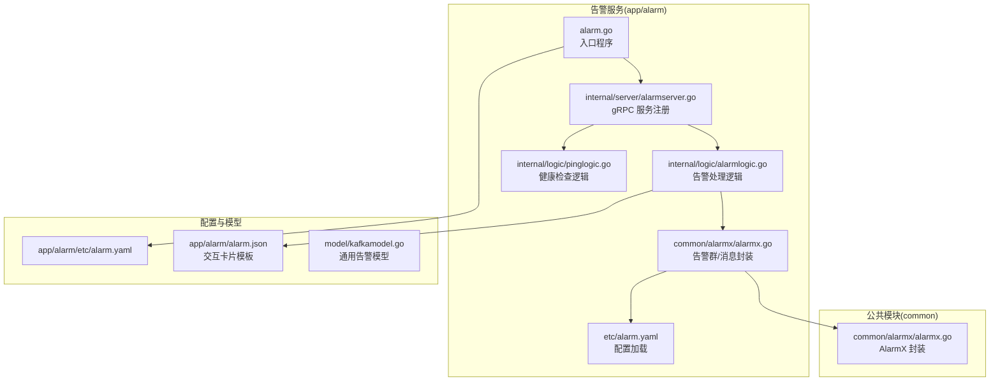
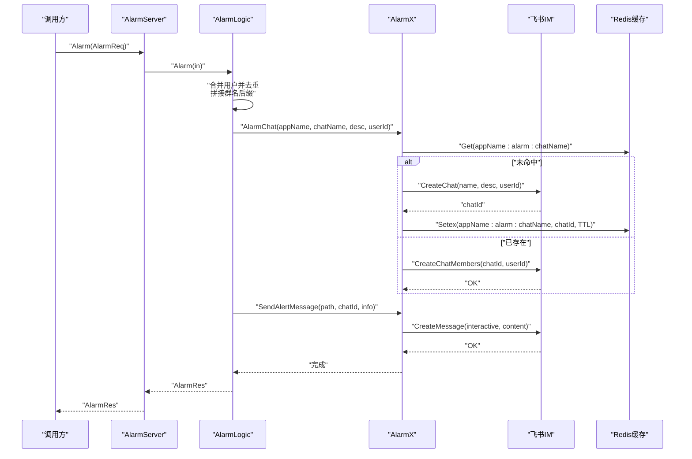
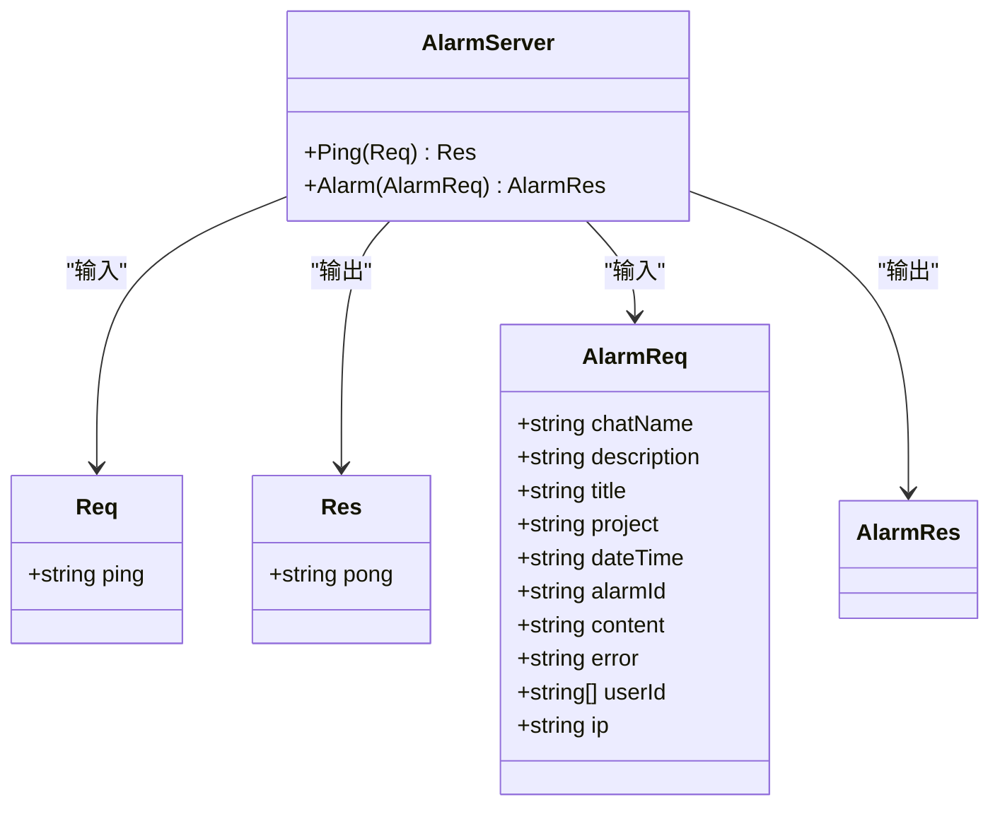
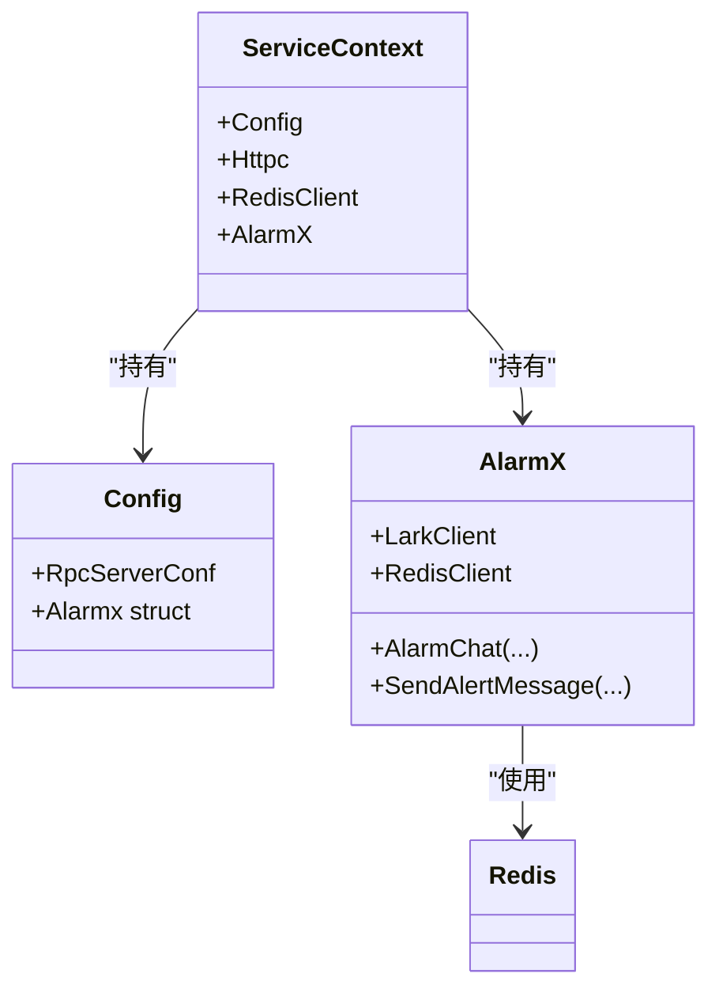
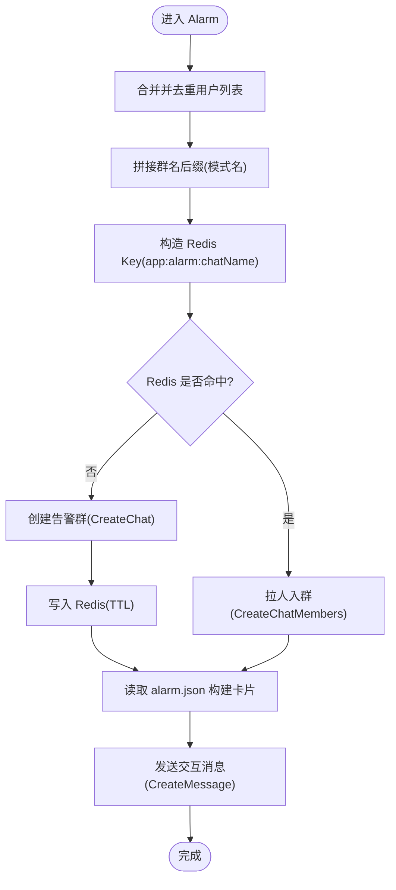
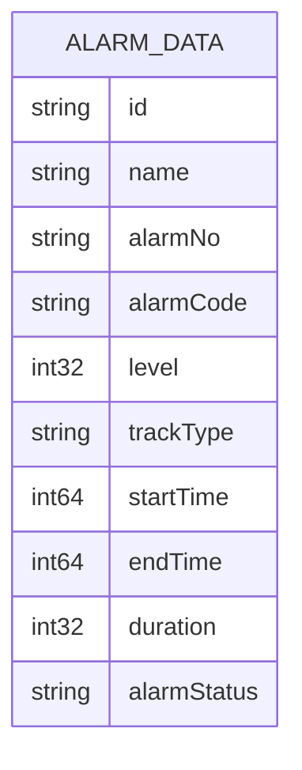
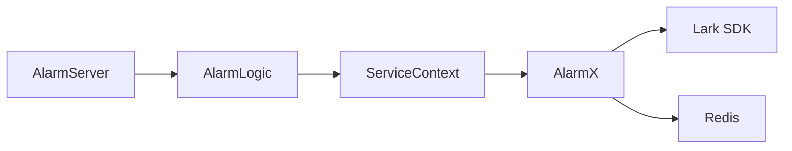

# 告警管理服务

<cite>
**本文引用的文件**
- [alarm.proto](file://app/alarm/alarm.proto)
- [alarm_grpc.pb.go](file://app/alarm/alarm/alarm_grpc.pb.go)
- [alarm.pb.go](file://app/alarm/alarm/alarm.pb.go)
- [alarm.go](file://app/alarm/alarm.go)
- [alarm.yaml](file://app/alarm/etc/alarm.yaml)
- [config.go](file://app/alarm/internal/config/config.go)
- [servicecontext.go](file://app/alarm/internal/svc/servicecontext.go)
- [alarmserver.go](file://app/alarm/internal/server/alarmserver.go)
- [alarmlogic.go](file://app/alarm/internal/logic/alarmlogic.go)
- [pinglogic.go](file://app/alarm/internal/logic/pinglogic.go)
- [alarmx.go](file://common/alarmx/alarmx.go)
- [alarm.json](file://app/alarm/alarm.json)
- [tool.go](file://common/tool/tool.go)
- [kafkamodel.go](file://model/kafkamodel.go)
- [xfusionmock.proto](file://app/xfusionmock/xfusionmock.proto)
</cite>

## 目录
1. [简介](#简介)
2. [项目结构](#项目结构)
3. [核心组件](#核心组件)
4. [架构总览](#架构总览)
5. [详细组件分析](#详细组件分析)
6. [依赖分析](#依赖分析)
7. [性能考虑](#性能考虑)
8. [故障排查指南](#故障排查指南)
9. [结论](#结论)
10. [附录](#附录)

## 简介
本文件为告警管理服务的技术文档，围绕告警规则配置、多渠道通知、告警处理流程、统计分析等能力展开，重点说明告警级别的分类标准、通知方式的配置、告警历史的存储策略；阐述告警服务的 gRPC 接口设计、告警事件的处理机制、告警状态的管理流程；并提供可靠性保障、性能优化方案与扩展配置选项，以及典型场景的配置示例与最佳实践。

## 项目结构
告警管理服务位于 app/alarm 目录，采用 go-zero 的 RPC 服务模板，结合 common/alarmx 提供的飞书 IM 能力完成告警群聊与交互卡片的发送。配置文件位于 etc/alarm.yaml，服务上下文在 internal/svc 中初始化 Redis 与 Lark 客户端，并通过 internal/server 暴露 gRPC 接口。

**图表来源**
- [alarm.go:21-43](file://app/alarm/alarm.go#L21-L43)
- [alarmserver.go:31-34](file://app/alarm/internal/server/alarmserver.go#L31-L34)
- [alarmlogic.go:31-63](file://app/alarm/internal/logic/alarmlogic.go#L31-L63)
- [alarmx.go:46-51](file://common/alarmx/alarmx.go#L46-L51)
- [alarm.yaml:1-26](file://app/alarm/etc/alarm.yaml#L1-L26)
- [alarm.json:1-75](file://app/alarm/alarm.json#L1-L75)
- [kafkamodel.go:60-93](file://model/kafkamodel.go#L60-L93)

**章节来源**
- [alarm.go:19-43](file://app/alarm/alarm.go#L19-L43)
- [alarmserver.go:15-35](file://app/alarm/internal/server/alarmserver.go#L15-L35)
- [alarmlogic.go:17-63](file://app/alarm/internal/logic/alarmlogic.go#L17-L63)
- [alarmx.go:29-51](file://common/alarmx/alarmx.go#L29-L51)
- [alarm.yaml:1-26](file://app/alarm/etc/alarm.yaml#L1-L26)
- [alarm.json:1-75](file://app/alarm/alarm.json#L1-L75)
- [kafkamodel.go:60-93](file://model/kafkamodel.go#L60-L93)

## 核心组件
- gRPC 接口与消息定义
  - 服务定义：Ping、Alarm
  - 请求消息：Req、AlarmReq
  - 响应消息：Res、AlarmRes
- 服务上下文
  - 包含 Redis 客户端、HTTP 客户端、AlarmX 实例
- 告警处理逻辑
  - 合并用户列表去重
  - 动态拼接群名后缀
  - 创建/更新告警群聊
  - 发送交互式卡片消息
- 飞书交互封装
  - 群聊创建/成员拉取/消息发送
  - 交互卡片构建与变量替换
- 配置项
  - 监听地址、日志编码、Redis 连接、链路追踪开关、Alarmx 凭据与模板路径

**章节来源**
- [alarm.proto:30-34](file://app/alarm/alarm.proto#L30-L34)
- [alarm_grpc.pb.go:29-60](file://app/alarm/alarm/alarm_grpc.pb.go#L29-L60)
- [servicecontext.go:13-32](file://app/alarm/internal/svc/servicecontext.go#L13-L32)
- [alarmlogic.go:31-63](file://app/alarm/internal/logic/alarmlogic.go#L31-L63)
- [alarmx.go:53-140](file://common/alarmx/alarmx.go#L53-L140)
- [alarm.yaml:8-25](file://app/alarm/etc/alarm.yaml#L8-L25)

## 架构总览
告警服务基于 go-zero 的 zrpc 服务器，使用 Lark OpenAPI 完成 IM 能力调用，使用 Redis 缓存告警群聊 ID，使用本地 JSON 模板渲染交互卡片。整体流程如下：

**图表来源**
- [alarmserver.go:31-34](file://app/alarm/internal/server/alarmserver.go#L31-L34)
- [alarmlogic.go:31-63](file://app/alarm/internal/logic/alarmlogic.go#L31-L63)
- [alarmx.go:53-140](file://common/alarmx/alarmx.go#L53-L140)

## 详细组件分析

### gRPC 接口与消息模型
- 服务方法
  - Ping：返回固定响应，用于健康检查
  - Alarm：接收告警请求并执行群聊与消息发送
- 请求字段
  - AlarmReq 包含标题、描述、项目、时间、ID、内容、错误、用户列表、IP 等
- 响应字段
  - Res、AlarmRes 当前为空，便于后续扩展

**图表来源**
- [alarm.proto:6-28](file://app/alarm/alarm.proto#L6-L28)
- [alarm_grpc.pb.go:29-60](file://app/alarm/alarm/alarm_grpc.pb.go#L29-L60)

**章节来源**
- [alarm.proto:6-28](file://app/alarm/alarm.proto#L6-L28)
- [alarm_grpc.pb.go:105-139](file://app/alarm/alarm/alarm_grpc.pb.go#L105-L139)
- [alarm.pb.go:24-264](file://app/alarm/alarm/alarm.pb.go#L24-L264)

### 服务上下文与配置
- 配置结构
  - 继承 zrpc.RpcServerConf，新增 Alarmx 凭据与模板路径
- 上下文初始化
  - 创建 Redis 客户端
  - 构造 httpc.Service 与 Lark 客户端
  - 初始化 AlarmX 并注入 Redis

**图表来源**
- [config.go:5-14](file://app/alarm/internal/config/config.go#L5-L14)
- [servicecontext.go:13-32](file://app/alarm/internal/svc/servicecontext.go#L13-L32)
- [alarmx.go:29-51](file://common/alarmx/alarmx.go#L29-L51)

**章节来源**
- [config.go:5-14](file://app/alarm/internal/config/config.go#L5-L14)
- [servicecontext.go:20-32](file://app/alarm/internal/svc/servicecontext.go#L20-L32)
- [alarmx.go:46-51](file://common/alarmx/alarmx.go#L46-L51)

### 告警处理流程与交互卡片
- 处理步骤
  - 合并配置中的默认用户与请求用户，去重
  - 在模式名后追加环境后缀形成群名
  - 通过 AlarmX 创建或更新告警群聊
  - 使用 alarm.json 渲染交互卡片并发送
- 交互卡片
  - 模板字段包括标题、项目、时间、事件 ID、IP、内容、错误等
  - 支持按钮文案替换（如“跟进处理”）

**图表来源**
- [alarmlogic.go:31-63](file://app/alarm/internal/logic/alarmlogic.go#L31-L63)
- [alarmx.go:53-140](file://common/alarmx/alarmx.go#L53-L140)
- [alarm.json:1-75](file://app/alarm/alarm.json#L1-L75)

**章节来源**
- [alarmlogic.go:31-63](file://app/alarm/internal/logic/alarmlogic.go#L31-L63)
- [alarmx.go:119-140](file://common/alarmx/alarmx.go#L119-L140)
- [alarm.json:163-185](file://app/alarm/alarm.json#L163-L185)

### 告警级别与状态管理
- 告警级别
  - 在通用模型中定义了 Level 字段（1-紧急、2-严重、3-警告）
- 告警状态
  - 在通用模型中定义了 AlarmStatus（ON-进行中、OFF-已结束）
- 告警编号
  - 通用模型中定义了 AlarmNo（格式：ALARM-日期-序号）

**图表来源**
- [kafkamodel.go:60-93](file://model/kafkamodel.go#L60-L93)
- [xfusionmock.proto:154-187](file://app/xfusionmock/xfusionmock.proto#L154-L187)

**章节来源**
- [kafkamodel.go:60-93](file://model/kafkamodel.go#L60-L93)
- [xfusionmock.proto:154-187](file://app/xfusionmock/xfusionmock.proto#L154-L187)

### 历史与统计分析
- 历史存储策略
  - 告警群聊 ID 通过 Redis 缓存，键名包含应用名与群名，设置合理 TTL
  - 交互卡片内容来自本地 JSON 模板，便于审计与复现
- 统计分析
  - 可基于 AlarmNo、Level、StartTime/EndTime、AlarmStatus 等字段进行聚合统计
  - 建议在上游系统（如 Kafka）侧进行指标采集与可视化

**章节来源**
- [alarmx.go:54-67](file://common/alarmx/alarmx.go#L54-L67)
- [alarm.json:1-75](file://app/alarm/alarm.json#L1-L75)
- [kafkamodel.go:60-93](file://model/kafkamodel.go#L60-L93)

### 通知方式与多渠道扩展
- 当前实现
  - 通过飞书 IM 发送交互卡片消息
  - 用户列表自动去重，支持默认用户与请求用户合并
- 扩展建议
  - 可在 AlarmX 中增加对其他 IM 平台（如企业微信、钉钉）的适配
  - 可引入消息队列异步发送，提升吞吐与稳定性

**章节来源**
- [alarmlogic.go:32-46](file://app/alarm/internal/logic/alarmlogic.go#L32-L46)
- [alarmx.go:119-140](file://common/alarmx/alarmx.go#L119-L140)

## 依赖分析
- 组件耦合
  - AlarmServer 仅负责路由到 Logic 层
  - Logic 依赖 ServiceContext，后者封装 AlarmX 与 Redis
  - AlarmX 依赖 Lark SDK 与 Redis
- 外部依赖
  - Lark OpenAPI（IM 能力）
  - Redis（群聊 ID 缓存）
  - go-zero（RPC、日志、配置）

**图表来源**
- [alarmserver.go:15-35](file://app/alarm/internal/server/alarmserver.go#L15-L35)
- [alarmlogic.go:17-29](file://app/alarm/internal/logic/alarmlogic.go#L17-L29)
- [servicecontext.go:13-32](file://app/alarm/internal/svc/servicecontext.go#L13-L32)
- [alarmx.go:29-51](file://common/alarmx/alarmx.go#L29-L51)

**章节来源**
- [alarmserver.go:15-35](file://app/alarm/internal/server/alarmserver.go#L15-L35)
- [alarmlogic.go:17-29](file://app/alarm/internal/logic/alarmlogic.go#L17-L29)
- [servicecontext.go:13-32](file://app/alarm/internal/svc/servicecontext.go#L13-L32)
- [alarmx.go:29-51](file://common/alarmx/alarmx.go#L29-L51)

## 性能考虑
- 异步化与批量化
  - 将消息发送放入后台任务队列，降低请求延迟
- 缓存与去重
  - Redis 缓存群聊 ID，减少重复创建
  - 用户列表去重，避免重复拉人
- 超时与重试
  - Lark 客户端设置合理超时与重试策略
- 日志与监控
  - 开启链路追踪与日志采样，定位慢调用

[本节为通用性能建议，无需特定文件引用]

## 故障排查指南
- 常见问题
  - 群聊创建失败：检查 Lark 凭据与网络连通性
  - 成员拉取失败：确认用户 ID 有效性
  - 交互卡片发送失败：检查 alarm.json 模板完整性
  - Redis 写入失败：检查连接与权限
- 排查步骤
  - 使用 Ping 接口验证服务可用性
  - 查看服务启动日志与错误码
  - 核对配置文件中的 Alarmx 凭据与模板路径

**章节来源**
- [alarm_grpc.pb.go:78-85](file://app/alarm/alarm/alarm_grpc.pb.go#L78-L85)
- [alarmx.go:89-96](file://common/alarmx/alarmx.go#L89-L96)
- [alarmx.go:109-116](file://common/alarmx/alarmx.go#L109-L116)
- [alarmx.go:163-185](file://common/alarmx/alarmx.go#L163-L185)
- [alarmx.go:64-67](file://common/alarmx/alarmx.go#L64-L67)

## 结论
告警管理服务通过清晰的分层设计与稳定的外部依赖集成，实现了从告警请求到飞书群聊与交互卡片的完整闭环。结合 Redis 缓存与模板化卡片，具备良好的可维护性与可扩展性。建议在生产环境中完善异步化、重试与可观测性配置，并根据业务需要扩展多渠道通知与告警统计分析能力。

[本节为总结性内容，无需特定文件引用]

## 附录

### 配置示例与最佳实践
- 配置要点
  - 监听地址与模式：dev/test/prd
  - Redis：主机、类型、键前缀
  - Alarmx：AppId、AppSecret、EncryptKey、VerificationToken、默认用户列表、模板路径
- 最佳实践
  - 为不同环境设置独立的群名后缀，避免混淆
  - 对用户列表进行去重，确保成员唯一
  - 为 Redis 设置合理的 TTL，避免长期占用
  - 保持 alarm.json 模板简洁且字段齐全，便于审计

**章节来源**
- [alarm.yaml:1-26](file://app/alarm/etc/alarm.yaml#L1-L26)
- [alarmx.go:163-185](file://common/alarmx/alarmx.go#L163-L185)
- [alarmlogic.go:32-34](file://app/alarm/internal/logic/alarmlogic.go#L32-L34)

### 接口调用示例（路径参考）
- 启动服务
  - [alarm.go:21-43](file://app/alarm/alarm.go#L21-L43)
- 注册服务
  - [alarmserver.go:30-34](file://app/alarm/internal/server/alarmserver.go#L30-L34)
- 健康检查
  - [pinglogic.go:26-30](file://app/alarm/internal/logic/pinglogic.go#L26-L30)
- 告警发送
  - [alarmlogic.go:31-63](file://app/alarm/internal/logic/alarmlogic.go#L31-L63)
- 交互卡片构建
  - [alarmx.go:119-140](file://common/alarmx/alarmx.go#L119-L140)
  - [alarm.json:163-185](file://app/alarm/alarm.json#L163-L185)