# 地理信息系统服务

<cite>
**本文引用的文件**
- [app/gis/gis.proto](file://app/gis/gis.proto)
- [common/gisx/gisx.go](file://common/gisx/gisx.go)
- [app/gis/internal/logic/encodeh3logic.go](file://app/gis/internal/logic/encodeh3logic.go)
- [app/gis/internal/logic/decodeh3logic.go](file://app/gis/internal/logic/decodeh3logic.go)
- [app/gis/internal/logic/transformcoordlogic.go](file://app/gis/internal/logic/transformcoordlogic.go)
- [app/gis/internal/logic/batchtransformcoordlogic.go](file://app/gis/internal/logic/batchtransformcoordlogic.go)
- [app/gis/internal/logic/distancelogic.go](file://app/gis/internal/logic/distancelogic.go)
- [app/gis/internal/logic/batchdistancelogic.go](file://app/gis/internal/logic/batchdistancelogic.go)
- [app/gis/internal/logic/generatefencecellslogic.go](file://app/gis/internal/logic/generatefencecellslogic.go)
- [app/gis/internal/logic/generatefenceh3cellslogic.go](file://app/gis/internal/logic/generatefenceh3cellslogic.go)
- [app/gis/internal/logic/pointinfencelogic.go](file://app/gis/internal/logic/pointinfencelogic.go)
- [app/gis/internal/logic/pointinfenceslogic.go](file://app/gis/internal/logic/pointinfenceslogic.go)
- [app/gis/internal/logic/pointswithinradiuslogic.go](file://app/gis/internal/logic/pointswithinradiuslogic.go)
- [app/gis/internal/logic/nearbyfenceslogic.go](file://app/gis/internal/logic/nearbyfenceslogic.go)
- [app/gis/internal/logic/routepointslogic.go](file://app/gis/internal/logic/routepointslogic.go)
</cite>

## 目录
1. [简介](#简介)
2. [项目结构](#项目结构)
3. [核心组件](#核心组件)
4. [架构总览](#架构总览)
5. [详细组件分析](#详细组件分析)
6. [依赖分析](#依赖分析)
7. [性能考量](#性能考量)
8. [故障排查指南](#故障排查指南)
9. [结论](#结论)
10. [附录](#附录)

## 简介
本技术文档面向地理信息系统服务，系统性梳理坐标转换、距离计算、围栏计算、H3 编解码等核心能力，阐明算法原理、精度控制与性能优化策略，并给出 gRPC 接口设计、参数规范、返回值格式及并发控制与缓存策略建议。文档同时提供典型应用场景的最佳实践与调优建议，帮助读者快速理解并高效使用该服务。

## 项目结构
- 服务定义位于 app/gis/gis.proto，采用 Protocol Buffers 定义 gRPC 接口与消息体。
- 业务逻辑集中在 app/gis/internal/logic 下，按功能模块拆分，职责清晰。
- 地理空间算法与工具封装于 common/gisx/gisx.go，便于复用与测试。
- 服务上下文与配置位于 app/gis/internal/svc，承载依赖注入与运行期资源。

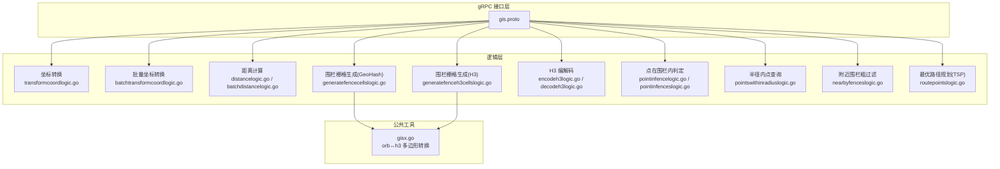

图表来源
- [app/gis/gis.proto:1-219](file://app/gis/gis.proto#L1-L219)
- [app/gis/internal/logic/transformcoordlogic.go:1-102](file://app/gis/internal/logic/transformcoordlogic.go#L1-L102)
- [app/gis/internal/logic/batchtransformcoordlogic.go:1-66](file://app/gis/internal/logic/batchtransformcoordlogic.go#L1-L66)
- [app/gis/internal/logic/distancelogic.go:1-67](file://app/gis/internal/logic/distancelogic.go#L1-L67)
- [app/gis/internal/logic/batchdistancelogic.go:1-50](file://app/gis/internal/logic/batchdistancelogic.go#L1-L50)
- [app/gis/internal/logic/generatefencecellslogic.go:1-294](file://app/gis/internal/logic/generatefencecellslogic.go#L1-L294)
- [app/gis/internal/logic/generatefenceh3cellslogic.go:1-78](file://app/gis/internal/logic/generatefenceh3cellslogic.go#L1-L78)
- [app/gis/internal/logic/encodeh3logic.go:1-46](file://app/gis/internal/logic/encodeh3logic.go#L1-L46)
- [app/gis/internal/logic/decodeh3logic.go:1-57](file://app/gis/internal/logic/decodeh3logic.go#L1-L57)
- [app/gis/internal/logic/pointinfencelogic.go:1-59](file://app/gis/internal/logic/pointinfencelogic.go#L1-L59)
- [app/gis/internal/logic/pointinfenceslogic.go:1-67](file://app/gis/internal/logic/pointinfenceslogic.go#L1-L67)
- [app/gis/internal/logic/pointswithinradiuslogic.go:1-75](file://app/gis/internal/logic/pointswithinradiuslogic.go#L1-L75)
- [app/gis/internal/logic/nearbyfenceslogic.go:1-32](file://app/gis/internal/logic/nearbyfenceslogic.go#L1-L32)
- [app/gis/internal/logic/routepointslogic.go:1-113](file://app/gis/internal/logic/routepointslogic.go#L1-L113)
- [common/gisx/gisx.go:1-60](file://common/gisx/gisx.go#L1-L60)

章节来源
- [app/gis/gis.proto:1-219](file://app/gis/gis.proto#L1-L219)

## 核心组件
- gRPC 接口与消息模型：统一定义坐标系类型、点、围栏、请求与响应消息，覆盖 GeoHash/H3 编解码、坐标转换、距离计算、围栏栅格生成、点在围栏内判定、半径内点查询、附近围栏粗过滤、最优路径规划等。
- 地理算法库：
  - H3：提供六边形单元编码/解码、多边形到单元集的覆盖。
  - orb/planar：提供平面几何、多边形包含、距离计算等。
  - geohash：提供 GeoHash 编码与邻域查询。
  - coordtransform：提供 WGS84、GCJ02、BD09 三坐标系互转。
- 服务逻辑：以 GoZero 逻辑层组织，职责单一、易于扩展与测试。

章节来源
- [app/gis/gis.proto:9-50](file://app/gis/gis.proto#L9-L50)
- [common/gisx/gisx.go:11-60](file://common/gisx/gisx.go#L11-L60)

## 架构总览
服务采用典型的三层架构：gRPC 接口层负责协议与序列化；逻辑层封装业务规则与算法；公共工具层提供跨模块复用的能力。接口通过 proto 文件集中管理，逻辑层通过 ServiceContext 注入依赖，日志与监控由框架提供。

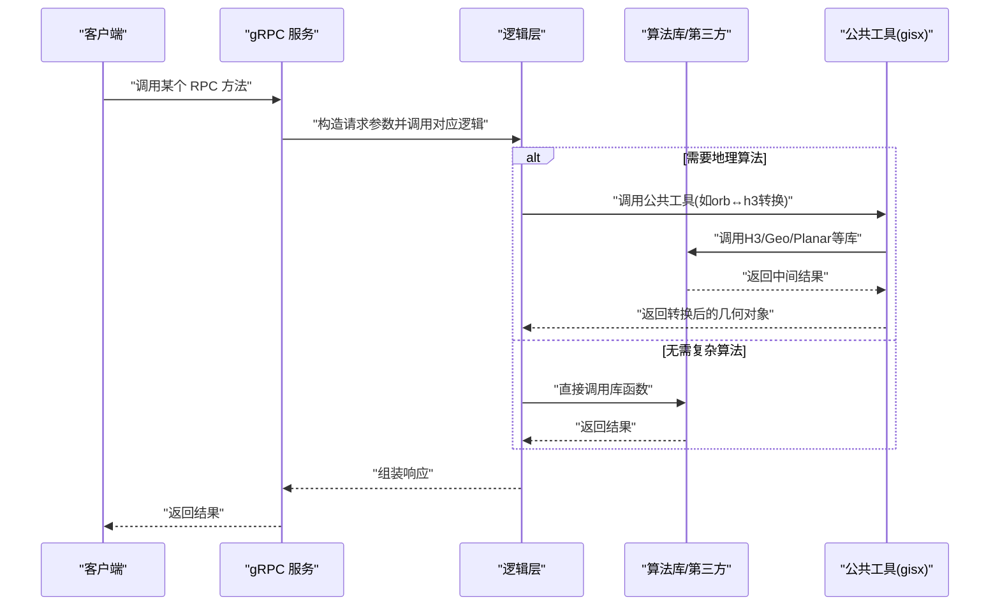

图表来源
- [app/gis/gis.proto:18-50](file://app/gis/gis.proto#L18-L50)
- [app/gis/internal/logic/encodeh3logic.go:28-45](file://app/gis/internal/logic/encodeh3logic.go#L28-L45)
- [app/gis/internal/logic/generatefenceh3cellslogic.go:57-67](file://app/gis/internal/logic/generatefenceh3cellslogic.go#L57-L67)
- [common/gisx/gisx.go:11-41](file://common/gisx/gisx.go#L11-L41)

## 详细组件分析

### gRPC 接口与消息模型
- 接口概览：Ping、GeoHash/H3 编解码、围栏栅格生成、点在围栏内判定、半径内点查询、距离计算、坐标转换、最优路径规划等。
- 关键消息：
  - Point/PointPair/Fence：基础几何对象。
  - CoordType：WGS84、GCJ02、BD09。
  - 各请求/响应消息均明确字段含义与取值范围，便于客户端正确构造与解析。
- 设计要点：
  - 参数校验前置，错误信息明确。
  - 返回值格式统一，便于上层聚合与展示。

章节来源
- [app/gis/gis.proto:18-219](file://app/gis/gis.proto#L18-L219)

### 坐标转换（WGS84/GCJ02/BD09）
- 实现原理：
  - 当源/目标类型相同时，直接返回原点。
  - 通过第三方库提供的映射函数进行坐标转换；支持双向转换与中转（WGS84↔BD09 通过 GCJ02）。
- 精度控制：
  - 输入经纬度范围校验（-90~90、-180~180），避免非法值进入算法层。
- 并发与性能：
  - 批量转换通过循环串行调用单点转换逻辑，简单可靠；若需更高吞吐，可在保持语义一致的前提下引入并发与批处理池。

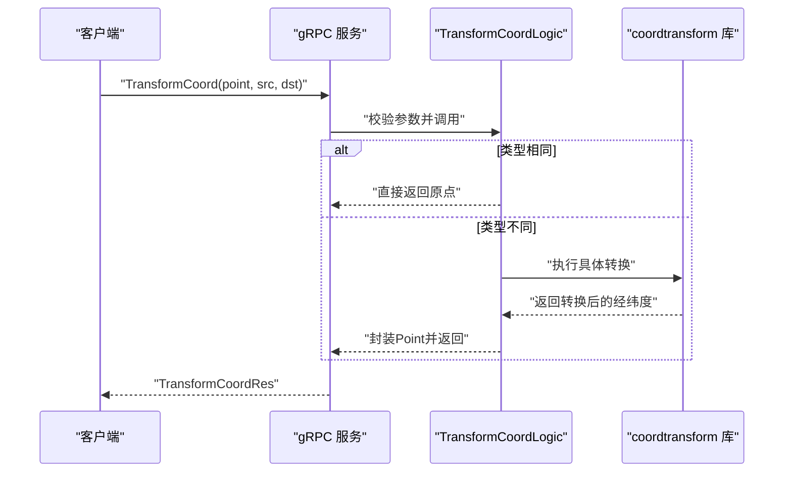

图表来源
- [app/gis/internal/logic/transformcoordlogic.go:28-50](file://app/gis/internal/logic/transformcoordlogic.go#L28-L50)
- [app/gis/internal/logic/batchtransformcoordlogic.go:28-65](file://app/gis/internal/logic/batchtransformcoordlogic.go#L28-L65)

章节来源
- [app/gis/internal/logic/transformcoordlogic.go:28-102](file://app/gis/internal/logic/transformcoordlogic.go#L28-L102)
- [app/gis/internal/logic/batchtransformcoordlogic.go:28-66](file://app/gis/internal/logic/batchtransformcoordlogic.go#L28-L66)

### 距离计算（米级）
- 实现原理：
  - 使用 orb/geo 库计算两点间球面距离（米）。
  - 批量距离计算对每一对点重复上述步骤，输出对应距离数组。
- 精度控制：
  - 对输入点进行范围校验，避免异常值导致计算异常。
- 性能优化：
  - 批量接口适合一次传输多对点，减少网络往返。
  - 若点对规模巨大，可考虑分批处理与并行化（注意内存与 GC 压力）。

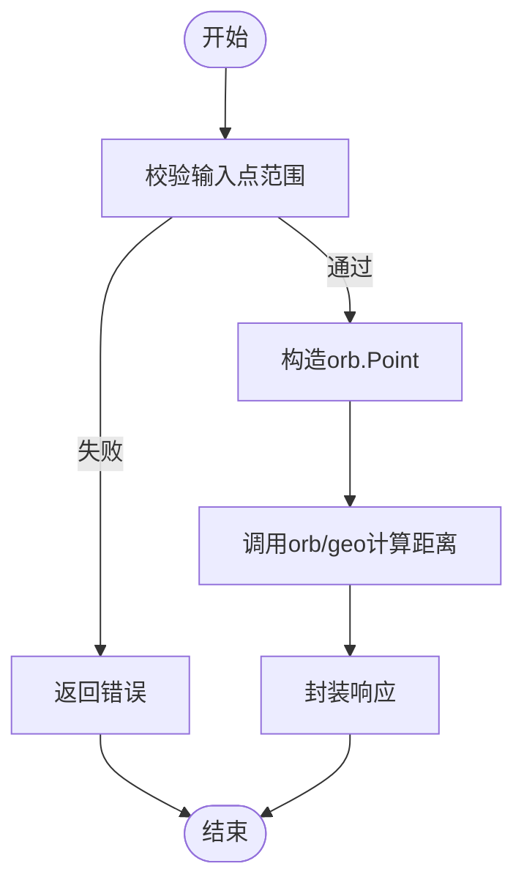

图表来源
- [app/gis/internal/logic/distancelogic.go:30-41](file://app/gis/internal/logic/distancelogic.go#L30-L41)
- [app/gis/internal/logic/batchdistancelogic.go:30-49](file://app/gis/internal/logic/batchdistancelogic.go#L30-L49)

章节来源
- [app/gis/internal/logic/distancelogic.go:30-67](file://app/gis/internal/logic/distancelogic.go#L30-L67)
- [app/gis/internal/logic/batchdistancelogic.go:30-50](file://app/gis/internal/logic/batchdistancelogic.go#L30-L50)

### 围栏栅格生成（GeoHash）
- 实现原理：
  - 依据多边形边界框与 GeoHash 精度，计算格子尺寸（纬度/经度方向随纬度变化）。
  - 在网格范围内遍历生成候选 GeoHash，以“格子中心在多边形内”或“格子与多边形相交”作为精过滤条件。
  - 可选扩展邻居格子，提升召回。
- 精度控制：
  - 默认精度 9；步长减半避免漏筛；边界框最小/最大经纬度用于确定遍历范围。
  - 提供 GeoHash 邻域查询，支持邻居扩展。
- 性能优化：
  - 使用哈希集合去重，预估容量降低扩容成本。
  - 相交判断采用快速排斥+叉积，减少不必要的复杂运算。
  - 可根据业务需求调整精度与邻居策略，平衡召回与性能。

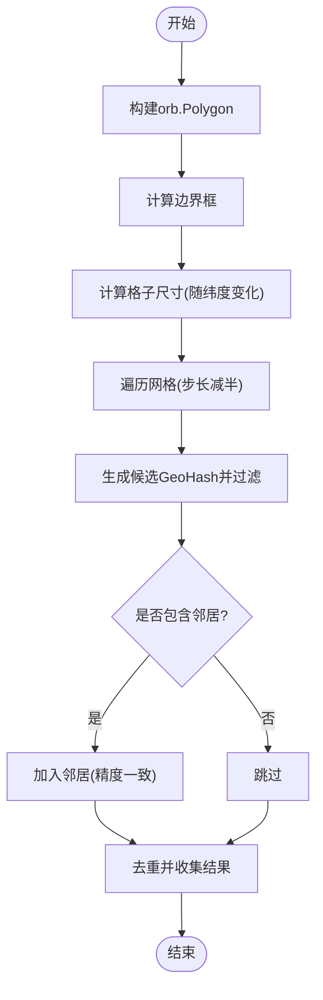

图表来源
- [app/gis/internal/logic/generatefencecellslogic.go:32-126](file://app/gis/internal/logic/generatefencecellslogic.go#L32-L126)

章节来源
- [app/gis/internal/logic/generatefencecellslogic.go:32-294](file://app/gis/internal/logic/generatefencecellslogic.go#L32-L294)

### 围栏栅格生成（H3）
- 实现原理：
  - 将 orb.Polygon 转换为 H3 所需的 GeoPolygon（外环+洞）。
  - 调用 H3 多边形到单元集的覆盖算法，返回去重后的 H3 Index 列表。
- 精度控制：
  - H3 分辨率 0-15，默认 9；分辨率越高，单元越细密，覆盖更精确但数量更多。
- 性能优化：
  - 复用公共工具完成 orb 与 H3 几何格式转换，避免重复实现。
  - 合理设置分辨率与容差参数，平衡召回与性能。

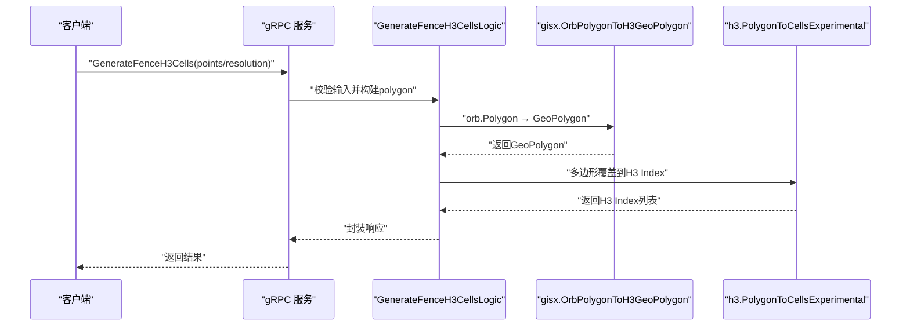

图表来源
- [app/gis/internal/logic/generatefenceh3cellslogic.go:29-77](file://app/gis/internal/logic/generatefenceh3cellslogic.go#L29-L77)
- [common/gisx/gisx.go:11-41](file://common/gisx/gisx.go#L11-L41)

章节来源
- [app/gis/internal/logic/generatefenceh3cellslogic.go:29-78](file://app/gis/internal/logic/generatefenceh3cellslogic.go#L29-L78)
- [common/gisx/gisx.go:11-60](file://common/gisx/gisx.go#L11-L60)

### H3 编解码
- 编码：将经纬度点映射到指定分辨率的 H3 单元字符串。
- 解码：将 H3 单元还原为中心点与边界顶点序列。
- 精度控制：分辨率上限 15；解码时获取边界顶点用于可视化或进一步几何分析。

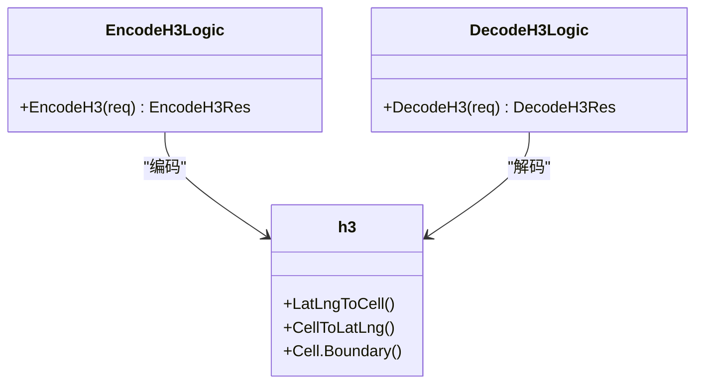

图表来源
- [app/gis/internal/logic/encodeh3logic.go:28-45](file://app/gis/internal/logic/encodeh3logic.go#L28-L45)
- [app/gis/internal/logic/decodeh3logic.go:28-56](file://app/gis/internal/logic/decodeh3logic.go#L28-L56)

章节来源
- [app/gis/internal/logic/encodeh3logic.go:28-46](file://app/gis/internal/logic/encodeh3logic.go#L28-L46)
- [app/gis/internal/logic/decodeh3logic.go:28-57](file://app/gis/internal/logic/decodeh3logic.go#L28-L57)

### 点在围栏内判定
- 单围栏：将围栏多边形与点进行平面几何包含判断。
- 多围栏：遍历多个围栏，返回命中的围栏 ID 列表。
- 精度控制：输入点与多边形点均进行范围校验；多边形闭合处理考虑浮点误差。

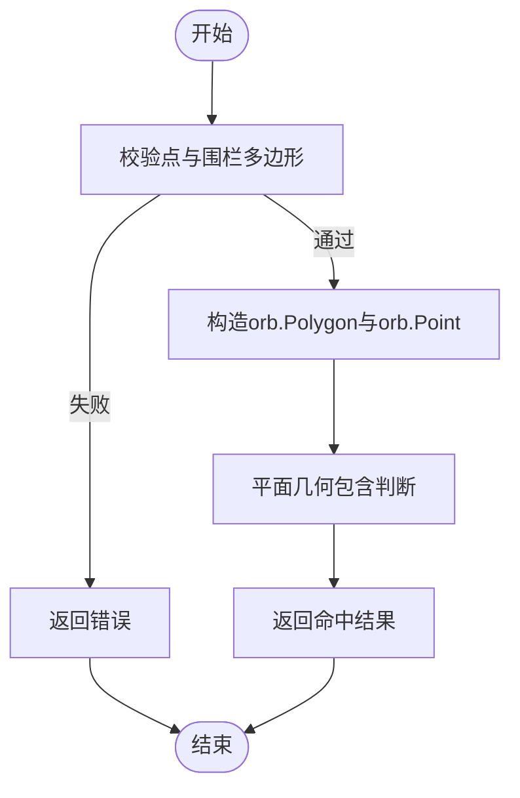

图表来源
- [app/gis/internal/logic/pointinfencelogic.go:29-58](file://app/gis/internal/logic/pointinfencelogic.go#L29-L58)
- [app/gis/internal/logic/pointinfenceslogic.go:28-67](file://app/gis/internal/logic/pointinfenceslogic.go#L28-L67)

章节来源
- [app/gis/internal/logic/pointinfencelogic.go:29-59](file://app/gis/internal/logic/pointinfencelogic.go#L29-L59)
- [app/gis/internal/logic/pointinfenceslogic.go:28-67](file://app/gis/internal/logic/pointinfenceslogic.go#L28-L67)

### 半径内点查询
- 实现原理：以中心点为基准，遍历点列表，计算球面距离并与半径比较，记录命中点的原始索引。
- 性能优化：当前实现为顺序扫描；对于大规模点集，可考虑空间索引（如四叉树/KD-Tree）或分块并行化。

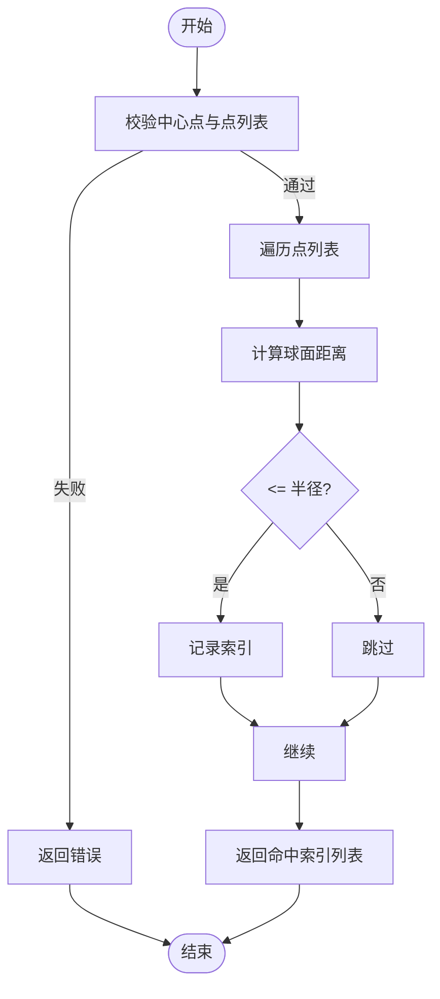

图表来源
- [app/gis/internal/logic/pointswithinradiuslogic.go:28-75](file://app/gis/internal/logic/pointswithinradiuslogic.go#L28-L75)

章节来源
- [app/gis/internal/logic/pointswithinradiuslogic.go:28-75](file://app/gis/internal/logic/pointswithinradiuslogic.go#L28-L75)

### 附近围栏粗过滤
- 当前实现为占位，尚未接入围栏索引或空间索引，建议后续基于 GeoHash/H3 栅格或空间索引实现快速候选围栏检索。

章节来源
- [app/gis/internal/logic/nearbyfenceslogic.go:26-31](file://app/gis/internal/logic/nearbyfenceslogic.go#L26-L31)

### 最优路径规划（贪心+2-opt）
- 实现原理：
  - 贪心策略：从起点出发，每次选择最近的未访问点，生成初始访问顺序。
  - 2-opt 局部优化：对路径进行翻转尝试，若能降低总距离则更新，直至无法再改进。
- 精度控制：使用球面距离计算，保证地理准确性。
- 性能优化：时间复杂度约为 O(n^3)，适合中小规模点集；大规模场景可考虑更高效的启发式算法或近似方法。

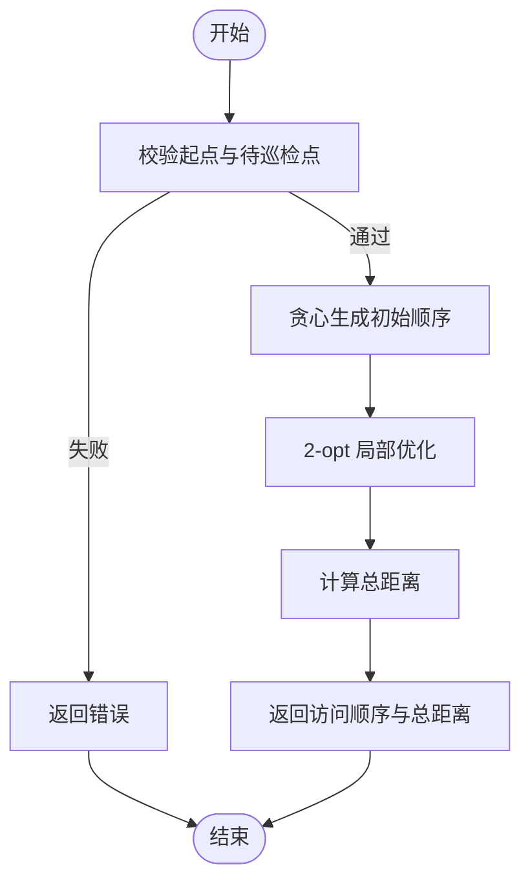

图表来源
- [app/gis/internal/logic/routepointslogic.go:29-113](file://app/gis/internal/logic/routepointslogic.go#L29-L113)

章节来源
- [app/gis/internal/logic/routepointslogic.go:29-113](file://app/gis/internal/logic/routepointslogic.go#L29-L113)

## 依赖分析
- 第三方库依赖：
  - H3：提供六边形单元与多边形覆盖能力。
  - orb/planar/geo：提供几何对象与距离计算。
  - geohash：提供 GeoHash 编码与邻域查询。
  - coordtransform：提供三坐标系互转。
- 内部依赖：
  - common/gisx/gisx.go：封装 orb 与 H3 的几何格式转换，降低逻辑层耦合。
- 耦合与内聚：
  - 逻辑层与算法库解耦，公共工具承担格式转换职责，提升内聚与复用。

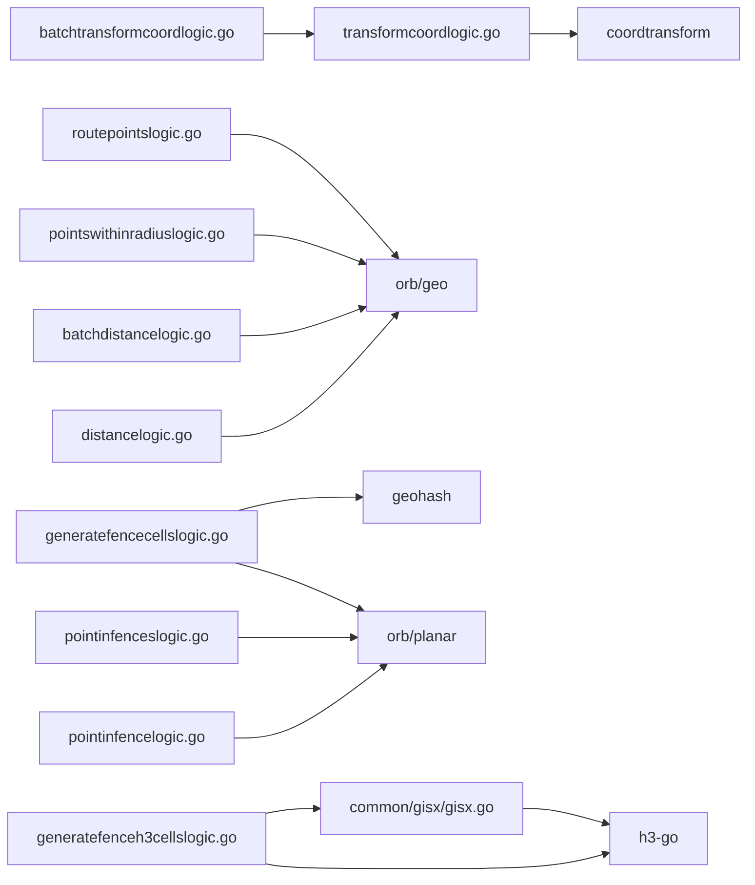

图表来源
- [app/gis/internal/logic/transformcoordlogic.go:10-11](file://app/gis/internal/logic/transformcoordlogic.go#L10-L11)
- [app/gis/internal/logic/batchtransformcoordlogic.go:1-66](file://app/gis/internal/logic/batchtransformcoordlogic.go#L1-L66)
- [app/gis/internal/logic/distancelogic.go:11-13](file://app/gis/internal/logic/distancelogic.go#L11-L13)
- [app/gis/internal/logic/batchdistancelogic.go:11-13](file://app/gis/internal/logic/batchdistancelogic.go#L11-L13)
- [app/gis/internal/logic/generatefencecellslogic.go:11-16](file://app/gis/internal/logic/generatefencecellslogic.go#L11-L16)
- [app/gis/internal/logic/generatefenceh3cellslogic.go:10-13](file://app/gis/internal/logic/generatefenceh3cellslogic.go#L10-L13)
- [app/gis/internal/logic/pointinfencelogic.go:10-12](file://app/gis/internal/logic/pointinfencelogic.go#L10-L12)
- [app/gis/internal/logic/pointinfenceslogic.go:9-12](file://app/gis/internal/logic/pointinfenceslogic.go#L9-L12)
- [app/gis/internal/logic/pointswithinradiuslogic.go:9-12](file://app/gis/internal/logic/pointswithinradiuslogic.go#L9-L12)
- [app/gis/internal/logic/routepointslogic.go:10-12](file://app/gis/internal/logic/routepointslogic.go#L10-L12)
- [common/gisx/gisx.go:7-8](file://common/gisx/gisx.go#L7-L8)

章节来源
- [app/gis/internal/logic/generatefencecellslogic.go:11-16](file://app/gis/internal/logic/generatefencecellslogic.go#L11-L16)
- [app/gis/internal/logic/generatefenceh3cellslogic.go:10-13](file://app/gis/internal/logic/generatefenceh3cellslogic.go#L10-L13)
- [common/gisx/gisx.go:7-8](file://common/gisx/gisx.go#L7-L8)

## 性能考量
- 算法复杂度与适用场景：
  - GeoHash 栅格生成：网格遍历 O(N)，相交判断与去重整体受多边形复杂度影响；适合中小规模围栏与中低精度需求。
  - H3 覆盖：多边形到单元集的覆盖，复杂度取决于分辨率与多边形面积；分辨率越高，单元越多，计算量越大。
  - 距离计算：单次 O(1)，批量 O(n)；注意网络开销与序列化成本。
  - 最优路径：贪心 O(n^2)，2-opt O(n^3)，适合中小规模；大规模可考虑遗传/模拟退火等近似算法。
- 精度控制：
  - 输入范围校验与浮点误差处理（多边形闭合、相交判断的 epsilon）。
  - GeoHash 步长随纬度变化，中心纬度估算提高步长精度。
- 并发与缓存：
  - 批量接口优先：减少网络往返与序列化开销。
  - 缓存策略：热点围栏栅格（GeoHash/H3）与常用坐标转换结果可缓存；注意坐标系与精度组合的键设计。
  - 并发控制：批量转换与路径规划可适度并发，但需避免过度竞争与内存峰值。
- I/O 与序列化：
  - 大批量点对或点列表建议分批传输，避免单次请求过大。
  - 响应中仅返回必要字段，减少序列化与带宽占用。

## 故障排查指南
- 常见错误与定位：
  - 参数校验失败：检查经纬度范围、坐标系枚举值、点数量等。
  - 多边形无效：确保至少三个点、首尾闭合、外环与洞的有效性。
  - H3 分辨率越界：确保 0-15。
  - GeoHash 精度过高或邻居精度不匹配：检查精度与邻居扩展逻辑。
- 日志与可观测性：
  - 逻辑层广泛使用日志记录关键路径与中间结果，便于定位问题。
  - 建议在 gRPC 层增加请求追踪 ID，串联链路日志。
- 修复建议：
  - 对于“FenceId 加载逻辑未实现”的占位错误，补充缓存/数据库加载逻辑，并完善错误处理与降级策略。

章节来源
- [app/gis/internal/logic/transformcoordlogic.go:52-76](file://app/gis/internal/logic/transformcoordlogic.go#L52-L76)
- [app/gis/internal/logic/generatefencecellslogic.go:48-57](file://app/gis/internal/logic/generatefencecellslogic.go#L48-L57)
- [app/gis/internal/logic/generatefenceh3cellslogic.go:52-55](file://app/gis/internal/logic/generatefenceh3cellslogic.go#L52-L55)
- [app/gis/internal/logic/pointinfencelogic.go:43-52](file://app/gis/internal/logic/pointinfencelogic.go#L43-L52)
- [app/gis/internal/logic/nearbyfenceslogic.go:27-31](file://app/gis/internal/logic/nearbyfenceslogic.go#L27-L31)

## 结论
该地理信息系统服务以清晰的接口设计与模块化逻辑实现了坐标转换、距离计算、围栏栅格生成、H3 编解码、点在围栏内判定、半径内点查询与最优路径规划等核心能力。通过公共工具层抽象几何格式转换，降低了模块间的耦合；配合严格的参数校验与日志体系，提升了稳定性与可维护性。建议在后续版本中完善“附近围栏粗过滤”与缓存/并发策略，以支撑更大规模与更高性能的应用场景。

## 附录
- gRPC 接口清单与参数规范（节选）
  - 编码/解码：GeoHash/H3，分别支持精度与分辨率参数。
  - 围栏栅格：支持 GeoHash 精度与邻居扩展，以及 H3 分辨率。
  - 坐标转换：支持批量与单点，枚举坐标系类型。
  - 距离计算：支持批量点对。
  - 点在围栏内：支持单围栏与多围栏。
  - 半径内点查询：返回命中点的原始索引。
  - 最优路径规划：返回访问顺序与总距离。
- 返回值格式约定
  - 统一使用米制单位（距离、半径）。
  - 索引类返回使用 32 位整型，避免溢出风险。
  - 布尔命中类返回明确标识，便于前端渲染。