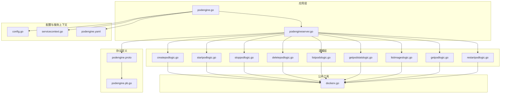
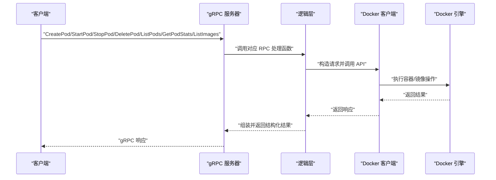
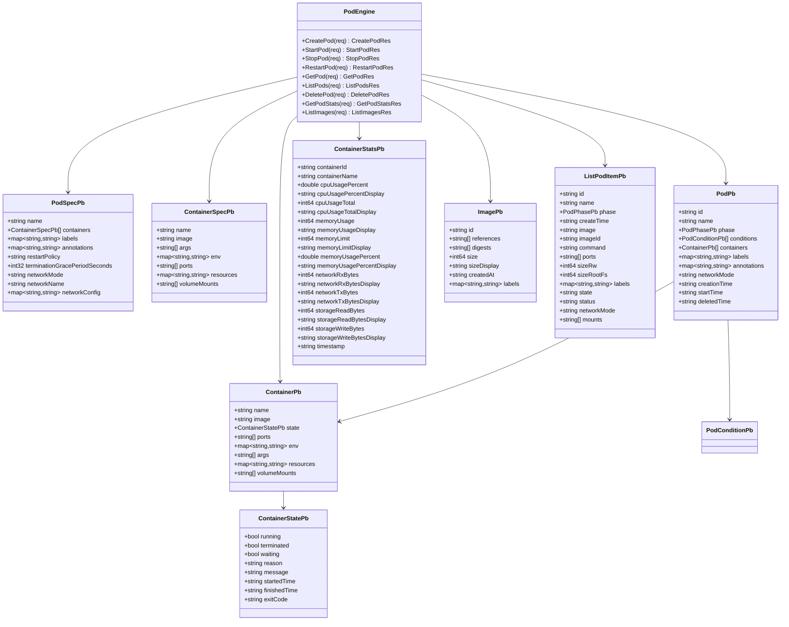
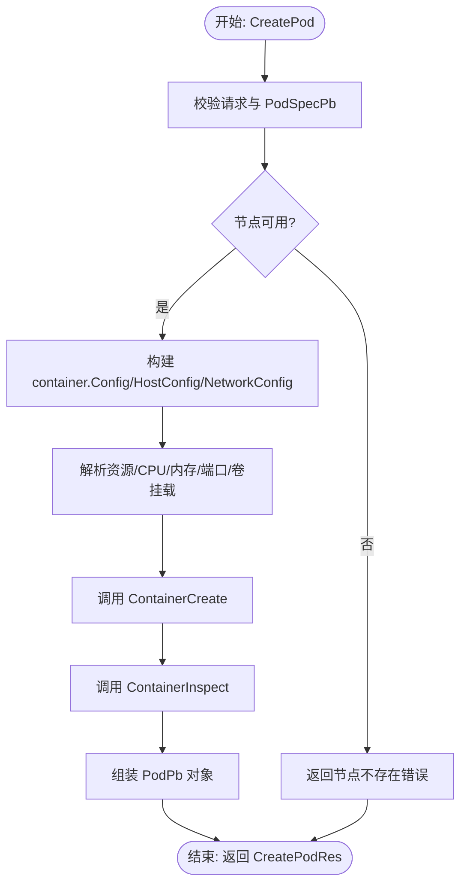
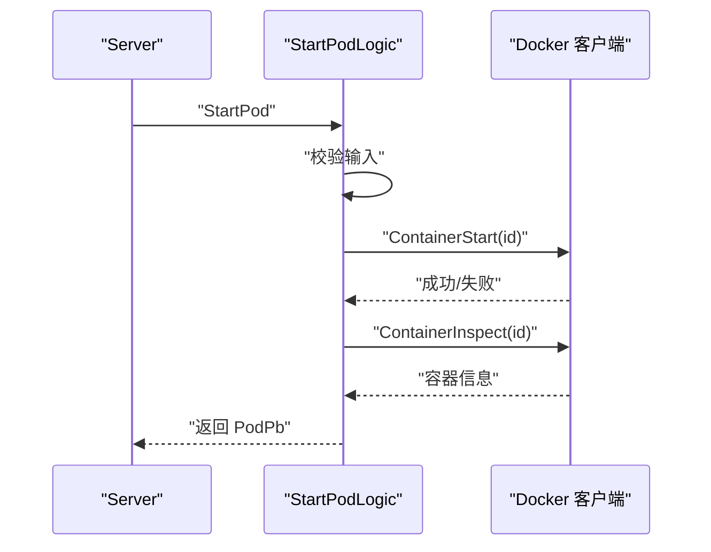
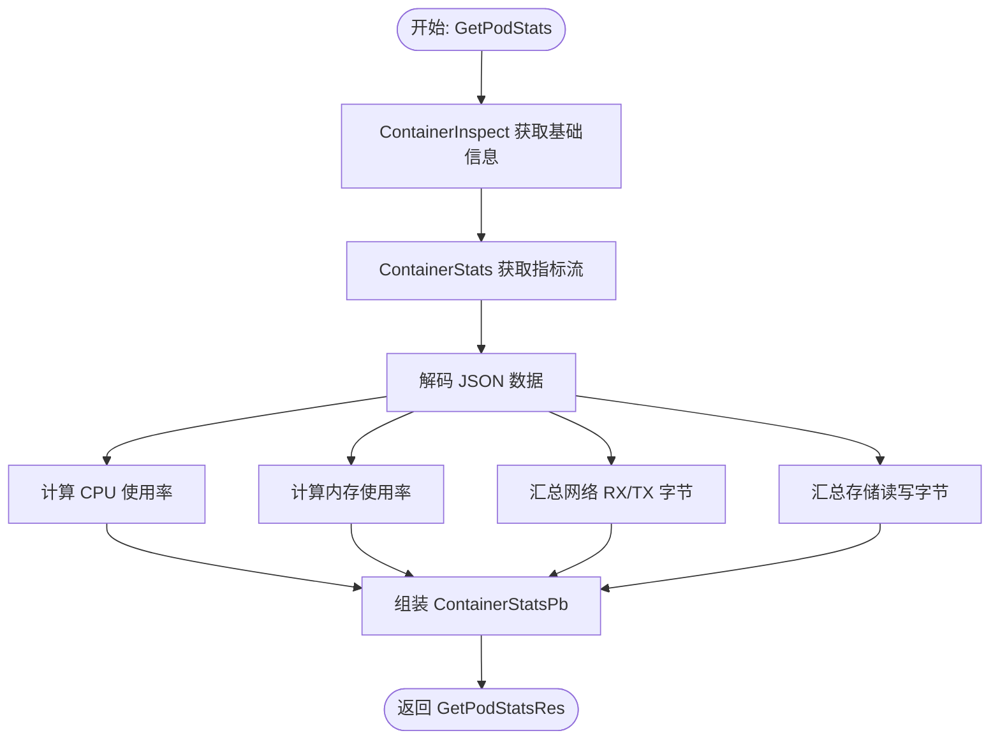
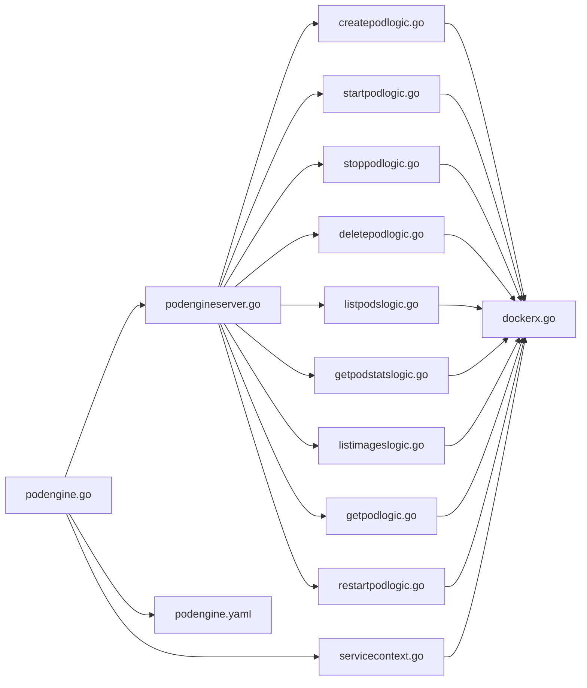

# 容器引擎服务

<cite>
**本文档引用的文件**
- [podengine.proto](file://app/podengine/podengine.proto)
- [createpodlogic.go](file://app/podengine/internal/logic/createpodlogic.go)
- [startpodlogic.go](file://app/podengine/internal/logic/startpodlogic.go)
- [stoppodlogic.go](file://app/podengine/internal/logic/stoppodlogic.go)
- [deletepodlogic.go](file://app/podengine/internal/logic/deletepodlogic.go)
- [listpodslogic.go](file://app/podengine/internal/logic/listpodslogic.go)
- [getpodstatslogic.go](file://app/podengine/internal/logic/getpodstatslogic.go)
- [listimageslogic.go](file://app/podengine/internal/logic/listimageslogic.go)
- [getpodlogic.go](file://app/podengine/internal/logic/getpodlogic.go)
- [restartpodlogic.go](file://app/podengine/internal/logic/restartpodlogic.go)
- [dockerx.go](file://common/dockerx/dockerx.go)
- [servicecontext.go](file://app/podengine/internal/svc/servicecontext.go)
- [podengine.yaml](file://app/podengine/etc/podengine.yaml)
- [config.go](file://app/podengine/internal/config/config.go)
- [podengine.go](file://app/podengine/podengine.go)
- [podengineserver.go](file://app/podengine/internal/server/podengineserver.go)
- [podengine.pb.go](file://app/podengine/podengine/podengine.pb.go)
</cite>

## 更新摘要
**所做更改**
- 更新了protobuf消息类型标准化部分，反映PodCondition、ContainerState等消息类型添加Pb后缀的变更
- 更新了ListPodItem、ContainerStats等消息类型的描述和使用说明
- 更新了消息模型图表以反映最新的类型命名规范
- 更新了相关逻辑层代码示例以体现新的消息类型使用方式

## 目录
1. [简介](#简介)
2. [项目结构](#项目结构)
3. [核心组件](#核心组件)
4. [架构总览](#架构总览)
5. [详细组件分析](#详细组件分析)
6. [依赖分析](#依赖分析)
7. [性能考虑](#性能考虑)
8. [故障排查指南](#故障排查指南)
9. [结论](#结论)
10. [附录](#附录)

## 简介
本项目实现了一个基于 gRPC 的容器引擎服务，抽象出 Pod/Container 的运行模型，适配 Docker 运行时，提供容器生命周期管理、镜像操作与资源监控等核心能力。通过统一的 gRPC 接口，客户端可以完成容器的创建、启动、停止、重启、删除、查询、列表以及资源统计与镜像列表等操作。服务支持多节点 Docker 运行时（本地与远程），并内置日志拦截器与可选的服务注册能力。

**更新** 服务现已采用标准化的protobuf消息类型命名规范，所有消息类型均添加Pb后缀以区分枚举类型和消息类型，提升代码可读性和类型安全性。

## 项目结构
容器引擎服务位于 app/podengine 目录，采用 go-zero 框架组织代码，遵循"配置-服务上下文-服务器-逻辑层"的分层结构；公共 Docker 客户端工具位于 common/dockerx。

**图表来源**
- [podengine.go:1-69](file://app/podengine/podengine.go#L1-L69)
- [podengineserver.go:1-70](file://app/podengine/internal/server/podengineserver.go#L1-L70)
- [config.go:1-18](file://app/podengine/internal/config/config.go#L1-L18)
- [servicecontext.go:1-51](file://app/podengine/internal/svc/servicecontext.go#L1-L51)
- [createpodlogic.go:1-288](file://app/podengine/internal/logic/createpodlogic.go#L1-L288)
- [startpodlogic.go:1-88](file://app/podengine/internal/logic/startpodlogic.go#L1-L88)
- [stoppodlogic.go:1-49](file://app/podengine/internal/logic/stoppodlogic.go#L1-L49)
- [deletepodlogic.go:1-50](file://app/podengine/internal/logic/deletepodlogic.go#L1-L50)
- [listpodslogic.go:1-140](file://app/podengine/internal/logic/listpodslogic.go#L1-L140)
- [getpodstatslogic.go:1-134](file://app/podengine/internal/logic/getpodstatslogic.go#L1-L134)
- [listimageslogic.go:1-111](file://app/podengine/internal/logic/listimageslogic.go#L1-L111)
- [getpodlogic.go:1-117](file://app/podengine/internal/logic/getpodlogic.go#L1-L117)
- [restartpodlogic.go:1-84](file://app/podengine/internal/logic/restartpodlogic.go#L1-L84)
- [dockerx.go:1-95](file://common/dockerx/dockerx.go#L1-L95)
- [podengine.proto:1-338](file://app/podengine/podengine.proto#L1-L338)
- [podengine.pb.go:1-2555](file://app/podengine/podengine/podengine.pb.go#L1-L2555)

**章节来源**
- [podengine.go:1-69](file://app/podengine/podengine.go#L1-L69)
- [podengine.yaml:1-20](file://app/podengine/etc/podengine.yaml#L1-L20)
- [config.go:1-18](file://app/podengine/internal/config/config.go#L1-L18)

## 核心组件
- gRPC 服务定义：在 podengine.proto 中定义了 PodEngine 服务及消息类型，涵盖 Pod 生命周期、容器状态、资源统计、镜像列表等。所有消息类型均采用标准化命名，添加Pb后缀以区分枚举类型和消息类型。
- 服务端入口：podengine.go 负责加载配置、构建 ServiceContext、初始化 gRPC 服务器、注册 PodEngine 服务与反射。
- 服务器实现：podengineserver.go 将 gRPC 方法映射到对应的逻辑层。
- 逻辑层：每个 RPC 方法对应一个逻辑文件，负责参数校验、Docker 客户端调用、结果组装与错误处理。
- Docker 工具：dockerx.go 提供环境变量客户端创建、容器环境变量解析、端口与卷挂载提取、资源反解析等通用能力。
- 服务上下文：servicecontext.go 管理多节点 Docker 客户端（local 与远程），提供按节点名获取客户端的能力。

**更新** 所有消息类型现在都遵循统一的命名规范，例如 PodConditionPb、ContainerStatePb、ContainerStatsPb 等，确保类型安全性和代码一致性。

**章节来源**
- [podengine.proto:14-26](file://app/podengine/podengine.proto#L14-L26)
- [podengine.go:27-68](file://app/podengine/podengine.go#L27-L68)
- [podengineserver.go:15-70](file://app/podengine/internal/server/podengineserver.go#L15-L70)
- [dockerx.go:11-95](file://common/dockerx/dockerx.go#L11-L95)
- [servicecontext.go:11-51](file://app/podengine/internal/svc/servicecontext.go#L11-L51)

## 架构总览
容器引擎服务采用"gRPC 服务 + 逻辑层 + Docker 客户端"的三层架构。客户端通过 gRPC 调用 PodEngine 服务，服务端根据请求路由到具体逻辑层，逻辑层使用 Docker 客户端执行容器与镜像操作，并返回结构化结果。

**图表来源**
- [podengineserver.go:26-69](file://app/podengine/internal/server/podengineserver.go#L26-L69)
- [createpodlogic.go:34-152](file://app/podengine/internal/logic/createpodlogic.go#L34-L152)
- [startpodlogic.go:29-87](file://app/podengine/internal/logic/startpodlogic.go#L29-L87)
- [stoppodlogic.go:28-48](file://app/podengine/internal/logic/stoppodlogic.go#L28-L48)
- [deletepodlogic.go:28-49](file://app/podengine/internal/logic/deletepodlogic.go#L28-L49)
- [listpodslogic.go:31-124](file://app/podengine/internal/logic/listpodslogic.go#L31-L124)
- [getpodstatslogic.go:32-133](file://app/podengine/internal/logic/getpodstatslogic.go#L32-L133)
- [listimageslogic.go:30-110](file://app/podengine/internal/logic/listimageslogic.go#L30-L110)

## 详细组件分析

### gRPC 接口设计与消息模型
- 服务定义：PodEngine 提供 CreatePod、StartPod、StopPod、RestartPod、GetPod、ListPods、DeletePod、GetPodStats、ListImages 等方法。
- Pod/Container 模型：包含标准化的消息类型，如 PodPhasePb、PodConditionPb、ContainerStatePb、ContainerPb、ContainerSpecPb、PodSpecPb、PodPb、ContainerStatsPb、ImagePb 等，覆盖生命周期、状态、资源统计与镜像信息。
- 参数校验：使用 validate 规则对关键字段进行约束，如 PodSpecPb.containers 非空、restartPolicy 限定值、ListPodsReq/ListImagesReq 的 limit/offset 上限等。

**更新** 所有消息类型现在都采用标准化命名，添加Pb后缀以明确区分消息类型和枚举类型，提升代码可读性和类型安全性。

**图表来源**
- [podengine.proto:16-338](file://app/podengine/podengine.proto#L16-L338)
- [podengine.pb.go:25-3555](file://app/podengine/podengine/podengine.pb.go#L25-L3555)

**章节来源**
- [podengine.proto:14-338](file://app/podengine/podengine.proto#L14-L338)

### 容器生命周期管理流程

#### 创建容器（CreatePod）
- 输入校验：验证请求体与 PodSpecPb，确保至少包含一个容器。
- Docker 客户端选择：根据 node 获取对应 Docker 客户端（默认 local）。
- 配置构建：将 ContainerSpecPb 映射为 container.Config，设置镜像、环境变量、命令、标签等；HostConfig 设置端口绑定、重启策略、网络模式、资源限制、卷挂载等；NetworkConfig 为空。
- 资源解析：解析 CPU/内存限额与请求，转换为 Docker 资源对象；解析端口映射与卷挂载格式。
- 创建与检查：调用 ContainerCreate 创建容器，随后 ContainerInspect 获取创建后的容器信息，组装 PodPb 返回。

**图表来源**
- [createpodlogic.go:34-152](file://app/podengine/internal/logic/createpodlogic.go#L34-L152)
- [dockerx.go:88-94](file://common/dockerx/dockerx.go#L88-L94)

**章节来源**
- [createpodlogic.go:34-152](file://app/podengine/internal/logic/createpodlogic.go#L34-L152)

#### 启动容器（StartPod）
- 输入校验：校验 node 与 id。
- Docker 客户端选择：获取对应 Docker 客户端。
- 启动容器：调用 ContainerStart。
- 检查与组装：ContainerInspect 获取最新状态，组装 PodPb 返回。

**图表来源**
- [startpodlogic.go:29-87](file://app/podengine/internal/logic/startpodlogic.go#L29-L87)

**章节来源**
- [startpodlogic.go:29-87](file://app/podengine/internal/logic/startpodlogic.go#L29-L87)

#### 停止容器（StopPod）
- 输入校验：校验 node 与 id。
- Docker 客户端选择：获取对应 Docker 客户端。
- 停止容器：调用 ContainerStop。
- 检查：ContainerInspect 确认状态。

**章节来源**
- [stoppodlogic.go:28-48](file://app/podengine/internal/logic/stoppodlogic.go#L28-L48)

#### 删除容器（DeletePod）
- 输入校验：校验 node 与 id。
- Docker 客户端选择：获取对应 Docker 客户端。
- 删除容器：ContainerRemove，支持强制删除与移除卷。

**章节来源**
- [deletepodlogic.go:28-49](file://app/podengine/internal/logic/deletepodlogic.go#L28-L49)

#### 列表与查询（ListPods / GetPod）
- 列表：支持按 id/name/labels 过滤，分页返回容器列表项，包含状态、端口、挂载、大小等信息。使用 ListPodItemPb 格式化输出。
- 查询：按 id 获取单个 Pod 详情。

**更新** ListPods 现在使用标准化的 ListPodItemPb 消息类型，提供更一致的数据结构和更好的类型安全性。

**章节来源**
- [listpodslogic.go:31-124](file://app/podengine/internal/logic/listpodslogic.go#L31-L124)

### 资源监控与统计（GetPodStats）
- 基础信息：ContainerInspect 获取容器基本信息。
- 统计数据：ContainerStats 获取 CPU、内存、网络、存储等指标。
- 计算逻辑：CPU 使用率基于两次采样差值计算；内存使用率基于使用量与限制；网络与存储读写字节累加。
- 展示格式：提供带单位的显示字符串，便于前端展示。
- 消息类型：使用标准化的 ContainerStatsPb 消息类型封装统计数据。

**更新** 统计数据现在使用 ContainerStatsPb 消息类型，提供更丰富的指标字段和标准化的数据格式。

**图表来源**
- [getpodstatslogic.go:32-133](file://app/podengine/internal/logic/getpodstatslogic.go#L32-L133)

**章节来源**
- [getpodstatslogic.go:32-133](file://app/podengine/internal/logic/getpodstatslogic.go#L32-L133)

### 镜像操作（ListImages）
- 支持按镜像引用过滤、分页、可选包含摘要信息。
- 通过 ImageList 与可选的 ImageInspect 获取标签、摘要、大小、创建时间与标签。
- 使用标准化的 ImagePb 消息类型封装镜像信息。

**更新** 镜像信息现在使用 ImagePb 消息类型，提供更一致的结构和更好的类型安全性。

**章节来源**
- [listimageslogic.go:30-110](file://app/podengine/internal/logic/listimageslogic.go#L30-L110)

### Docker API 封装与错误处理
- Docker 客户端封装：dockerx.go 提供 MustNewClient，自动注入 OpenTelemetry TraceProvider；提供环境变量客户端创建。
- 错误处理：各逻辑层在关键步骤失败时返回带上下文的错误，避免泄露内部细节；节点不存在、Docker API 调用失败均进行明确提示。
- 参数解析：统一解析资源、端口、卷挂载、环境变量等，保证与 Docker API 兼容。

**章节来源**
- [dockerx.go:11-18](file://common/dockerx/dockerx.go#L11-L18)
- [dockerx.go:20-94](file://common/dockerx/dockerx.go#L20-L94)
- [createpodlogic.go:34-45](file://app/podengine/internal/logic/createpodlogic.go#L34-L45)
- [startpodlogic.go:30-37](file://app/podengine/internal/logic/startpodlogic.go#L30-L37)
- [stoppodlogic.go:29-36](file://app/podengine/internal/logic/stoppodlogic.go#L29-L36)
- [deletepodlogic.go:29-36](file://app/podengine/internal/logic/deletepodlogic.go#L29-L36)
- [listpodslogic.go:32-39](file://app/podengine/internal/logic/listpodslogic.go#L32-L39)
- [getpodstatslogic.go:33-40](file://app/podengine/internal/logic/getpodstatslogic.go#L33-L40)
- [listimageslogic.go:31-39](file://app/podengine/internal/logic/listimageslogic.go#L31-L39)

## 依赖分析
- 服务端到逻辑层：podengineserver.go 将 gRPC 方法委托给对应逻辑层。
- 逻辑层到 Docker 工具：所有逻辑层均依赖 dockerx.go 提供的工具函数。
- 服务上下文到 Docker 客户端：servicecontext.go 管理多节点 Docker 客户端，逻辑层通过 ServiceContext 获取。
- 配置到服务端：podengine.go 从 podengine.yaml 加载配置，初始化服务上下文与 gRPC 服务器。

**图表来源**
- [podengineserver.go:26-69](file://app/podengine/internal/server/podengineserver.go#L26-L69)
- [createpodlogic.go:1-18](file://app/podengine/internal/logic/createpodlogic.go#L1-L18)
- [startpodlogic.go:1-13](file://app/podengine/internal/logic/startpodlogic.go#L1-L13)
- [stoppodlogic.go:1-12](file://app/podengine/internal/logic/stoppodlogic.go#L1-L12)
- [deletepodlogic.go:1-12](file://app/podengine/internal/logic/deletepodlogic.go#L1-L12)
- [listpodslogic.go:1-15](file://app/podengine/internal/logic/listpodslogic.go#L1-L15)
- [getpodstatslogic.go:1-16](file://app/podengine/internal/logic/getpodstatslogic.go#L1-L16)
- [listimageslogic.go:1-14](file://app/podengine/internal/logic/listimageslogic.go#L1-L14)
- [getpodlogic.go:1-117](file://app/podengine/internal/logic/getpodlogic.go#L1-L117)
- [restartpodlogic.go:1-84](file://app/podengine/internal/logic/restartpodlogic.go#L1-L84)
- [dockerx.go:1-95](file://common/dockerx/dockerx.go#L1-L95)
- [servicecontext.go:11-51](file://app/podengine/internal/svc/servicecontext.go#L11-L51)
- [podengine.go:27-68](file://app/podengine/podengine.go#L27-L68)
- [podengine.yaml:1-20](file://app/podengine/etc/podengine.yaml#L1-L20)

**章节来源**
- [servicecontext.go:18-50](file://app/podengine/internal/svc/servicecontext.go#L18-L50)
- [podengine.go:30-43](file://app/podengine/podengine.go#L30-L43)

## 性能考虑
- 资源限制与请求：通过解析资源 map 设置 CPUQuota、CPUPeriod、Memory、MemoryReservation，合理控制容器资源占用。
- 端口绑定：仅在非 host/non 网络模式下解析端口映射，避免不必要的 NAT 开销。
- 统计采样：GetPodStats 使用一次非流式统计接口，减少持续监听带来的开销；若需实时监控可扩展为流式统计。
- 分页与过滤：ListPods/ListImages 支持 limit/offset 与过滤条件，避免一次性返回大量数据。
- 并发访问：ServiceContext 使用读写锁保护 Docker 客户端映射，支持多 goroutine 安全访问。
- 类型安全：标准化的消息类型命名提升编译时类型检查，减少运行时类型错误。

**更新** 标准化的消息类型命名提升了编译时类型安全性，有助于在开发阶段发现潜在的类型不匹配问题。

## 故障排查指南
- 节点不可用：当 node 不在配置中或未正确初始化时，会返回"节点不存在"错误。检查 podengine.yaml 中 DockerConfig 与节点名。
- Docker API 失败：创建/启动/停止/删除/统计等任一步骤失败都会返回带上下文的错误。查看服务日志定位具体失败环节。
- 端口冲突：创建容器时若端口映射冲突，Docker 会报错。检查 ContainerSpecPb.ports 格式与宿主机端口占用情况。
- 资源解析失败：CPU/内存字符串格式不合法时解析为 0，可能导致未生效。确认资源字符串单位与数值格式。
- 统计数据缺失：首次统计可能因采样间隔导致数据不足，建议重试或延长采样周期。
- 类型不匹配：新版本中消息类型名称已标准化，如 PodConditionPb、ContainerStatePb 等，确保客户端和服务端使用相同版本的 protobuf 定义。

**更新** 新版本中消息类型名称已标准化，如 PodConditionPb、ContainerStatePb、ContainerStatsPb 等，确保客户端和服务端使用相同版本的 protobuf 定义，避免类型不匹配问题。

**章节来源**
- [servicecontext.go:42-50](file://app/podengine/internal/svc/servicecontext.go#L42-L50)
- [createpodlogic.go:107-117](file://app/podengine/internal/logic/createpodlogic.go#L107-L117)
- [startpodlogic.go:40-51](file://app/podengine/internal/logic/startpodlogic.go#L40-L51)
- [stoppodlogic.go:38-46](file://app/podengine/internal/logic/stoppodlogic.go#L38-L46)
- [deletepodlogic.go:43-46](file://app/podengine/internal/logic/deletepodlogic.go#L43-L46)
- [getpodstatslogic.go:49-59](file://app/podengine/internal/logic/getpodstatslogic.go#L49-L59)

## 结论
该容器引擎服务以清晰的分层架构实现了对 Docker 的 gRPC 封装，覆盖容器生命周期管理、镜像操作与资源监控的核心场景。通过统一的消息模型与严格的参数校验，提升了系统的可维护性与可扩展性。结合多节点 Docker 客户端管理与日志拦截器，满足生产环境的可观测性与稳定性需求。

**更新** 通过引入标准化的 protobuf 消息类型命名规范，进一步提升了代码质量和类型安全性，为后续的功能扩展和维护奠定了坚实基础。

## 附录

### 配置说明
- podengine.yaml：包含服务监听地址、日志路径与级别、Nacos 注册开关与参数、DockerConfig（节点名到 Docker 主机地址映射）。
- config.go：定义配置结构，承载 RpcServerConf、NacosConfig、DockerConfig。

**章节来源**
- [podengine.yaml:1-20](file://app/podengine/etc/podengine.yaml#L1-L20)
- [config.go:5-17](file://app/podengine/internal/config/config.go#L5-L17)

### 最佳实践
- 资源规划：为容器设置合理的 CPU/内存限额与请求，避免资源争抢。
- 网络策略：优先使用 bridge 模式，必要时指定自定义网络名称；避免 host 模式带来的安全风险。
- 端口管理：统一规范端口映射格式，避免冲突；仅暴露必要端口。
- 日志与追踪：开启日志拦截器与可选 Nacos 注册，便于问题定位与服务治理。
- 安全加固：限制特权模式使用，谨慎挂载卷；定期清理无用镜像与容器。
- 类型安全：确保客户端和服务端使用相同版本的 protobuf 定义，避免类型不匹配问题。

**更新** 新版本强调了类型安全的重要性，建议确保客户端和服务端使用相同版本的 protobuf 定义，特别是标准化的消息类型命名。