# 文件管理服务

<cite>
**本文引用的文件**
- [file.proto](file://app/file/file.proto)
- [file.yaml](file://app/file/etc/file.yaml)
- [config.go](file://app/file/internal/config/config.go)
- [ossx.go](file://common/ossx/ossx.go)
- [minio_oss.go](file://common/ossx/minio_oss.go)
- [putfilelogic.go](file://app/file/internal/logic/putfilelogic.go)
- [putchunkfilelogic.go](file://app/file/internal/logic/putchunkfilelogic.go)
- [putstreamfilelogic.go](file://app/file/internal/logic/putstreamfilelogic.go)
- [removefilelogic.go](file://app/file/internal/logic/removefilelogic.go)
- [signurllogic.go](file://app/file/internal/logic/signurllogic.go)
- [statfilelogic.go](file://app/file/internal/logic/statfilelogic.go)
- [capturevideostreamlogic.go](file://app/file/internal/logic/capturevideostreamlogic.go)
- [servicecontext.go](file://app/file/internal/svc/servicecontext.go)
- [ossmodel.go](file://model/ossmodel.go)
- [imaging.go](file://common/imagex/imaging.go)
</cite>

## 目录
1. [简介](#简介)
2. [项目结构](#项目结构)
3. [核心组件](#核心组件)
4. [架构总览](#架构总览)
5. [详细组件分析](#详细组件分析)
6. [依赖关系分析](#依赖关系分析)
7. [性能考量](#性能考量)
8. [故障排查指南](#故障排查指南)
9. [结论](#结论)
10. [附录](#附录)

## 简介
本文件管理服务基于 gRPC 提供统一的对象存储能力，支持文件上传（普通、分片、流式）、下载、删除、批量删除、文件信息查询与签名 URL 生成，并内置对视频流截图并上传的能力。系统通过可插拔的 OSS 模板抽象，当前实现适配 MinIO；同时支持按租户隔离的存储桶命名规则与缩略图异步生成。

## 项目结构
- 服务定义与接口：位于 app/file/file.proto，定义了 gRPC 服务 FileRpc 及其请求/响应消息体。
- 配置：位于 app/file/etc/file.yaml，包含服务监听、日志、注册中心、租户模式、缩略图并发等配置项。
- 业务逻辑：位于 app/file/internal/logic/*，封装了上传、删除、签名、统计、视频截图等具体流程。
- 服务上下文：位于 app/file/internal/svc/servicecontext.go，负责注入配置、校验器、数据库模型与任务执行器。
- 对象存储抽象：位于 common/ossx/*，提供 OSS 模板接口与 MinIO 实现，以及通用的文件名规则、桶命名规则等。
- 图片处理：位于 common/imagex/imaging.go，提供缩略图生成等图像处理能力。
- 数据模型：位于 model/ossmodel.go，提供 OSS 配置的数据库访问接口。

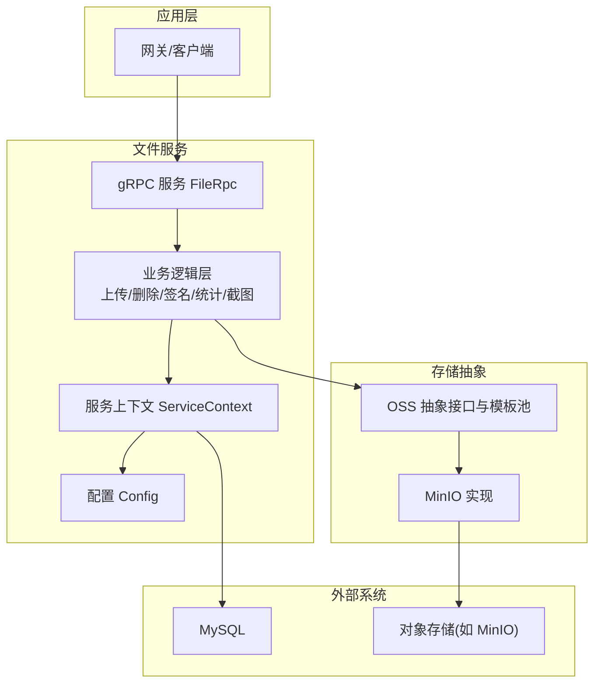

图表来源
- [file.proto:270-287](file://app/file/file.proto#L270-L287)
- [config.go:10-30](file://app/file/internal/config/config.go#L10-L30)
- [servicecontext.go:12-26](file://app/file/internal/svc/servicecontext.go#L12-L26)
- [ossx.go:28-39](file://common/ossx/ossx.go#L28-L39)
- [minio_oss.go:20-24](file://common/ossx/minio_oss.go#L20-L24)

章节来源
- [file.proto:1-287](file://app/file/file.proto#L1-L287)
- [file.yaml:1-23](file://app/file/etc/file.yaml#L1-L23)
- [config.go:1-31](file://app/file/internal/config/config.go#L1-L31)
- [servicecontext.go:1-27](file://app/file/internal/svc/servicecontext.go#L1-L27)

## 核心组件
- gRPC 服务接口：FileRpc，覆盖 OSS 配置管理、桶操作、文件上传（含分片/流式）、下载、删除、批量删除、文件信息与签名 URL、视频流截图等。
- OSS 抽象：OssTemplate 接口定义了创建/删除桶、统计、上传、签名、删除等能力；MinioTemplate 提供具体实现。
- 业务逻辑：各 *.go 文件封装了对应接口的处理流程，包括参数校验、OSS 模板选择、文件内容类型探测、缩略图生成与异步任务调度。
- 服务上下文：注入配置、校验器、OSS 配置模型、缩略图任务执行器。
- 图像处理：提供缩略图生成、EXIF 元数据提取等能力。

章节来源
- [file.proto:270-287](file://app/file/file.proto#L270-L287)
- [ossx.go:28-39](file://common/ossx/ossx.go#L28-L39)
- [minio_oss.go:20-243](file://common/ossx/minio_oss.go#L20-L243)
- [servicecontext.go:12-26](file://app/file/internal/svc/servicecontext.go#L12-L26)

## 架构总览
文件服务采用“gRPC 接口 + 业务逻辑 + 存储抽象 + 外部存储”的分层架构。业务逻辑根据租户 ID 与资源编号动态选择对应的 OSS 配置，通过模板池缓存避免重复初始化；上传过程支持分片与流式，结合管道与临时文件实现边收边写；缩略图生成通过任务执行器异步完成。

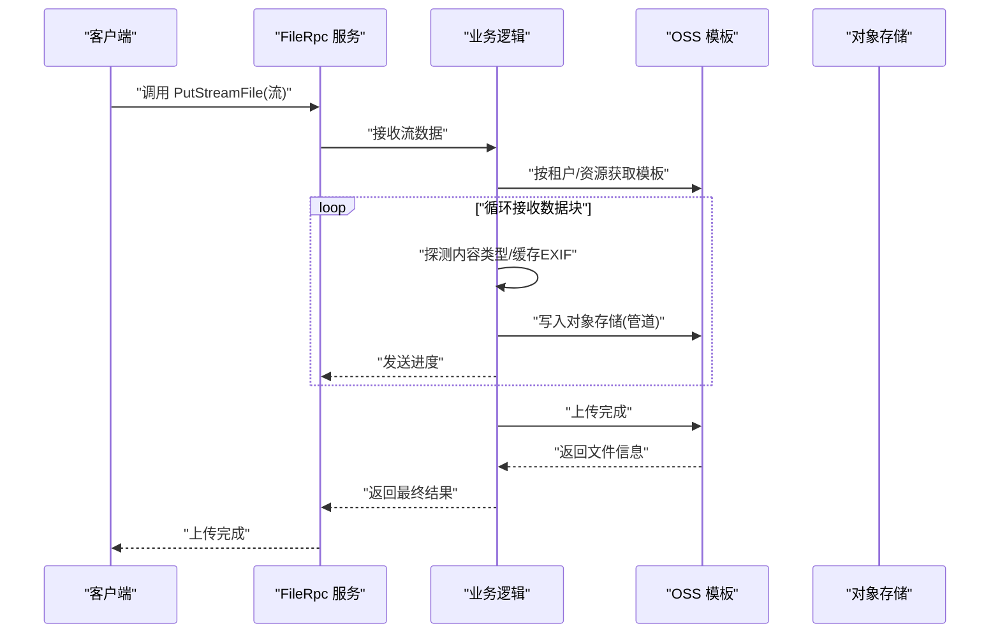

图表来源
- [file.proto:209-225](file://app/file/file.proto#L209-L225)
- [putstreamfilelogic.go:43-287](file://app/file/internal/logic/putstreamfilelogic.go#L43-L287)
- [ossx.go:109-151](file://common/ossx/ossx.go#L109-L151)
- [minio_oss.go:124-148](file://common/ossx/minio_oss.go#L124-L148)

## 详细组件分析

### 上传文件（普通）
- 功能要点
  - 从本地路径读取文件，探测内容类型，调用 OSS 模板 PutObject 完成上传。
  - 若为图片，尝试提取 EXIF 元数据并填充到响应。
- 关键流程

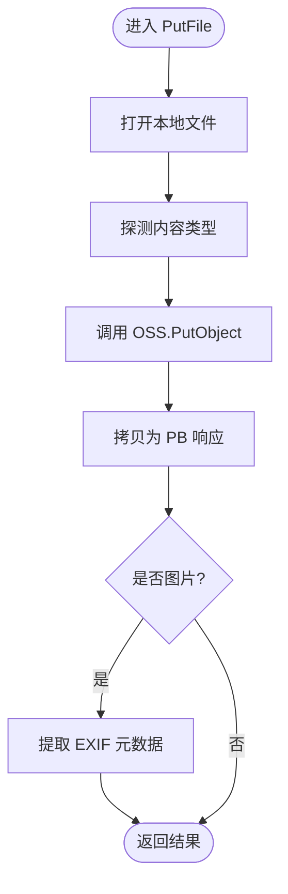

图表来源
- [putfilelogic.go:33-78](file://app/file/internal/logic/putfilelogic.go#L33-L78)
- [ossx.go:33-35](file://common/ossx/ossx.go#L33-L35)
- [minio_oss.go:124-148](file://common/ossx/minio_oss.go#L124-L148)

章节来源
- [putfilelogic.go:1-78](file://app/file/internal/logic/putfilelogic.go#L1-L78)

### 分片上传（双向流）
- 功能要点
  - 使用 io.Pipe 建立管道，一边接收流数据，一边写入 OSS；同时写入临时文件与 MD5。
  - 在收到首块数据时探测内容类型与缓存 EXIF；支持缩略图异步生成。
  - 循环发送进度，完成后返回最终结果。
- 关键流程

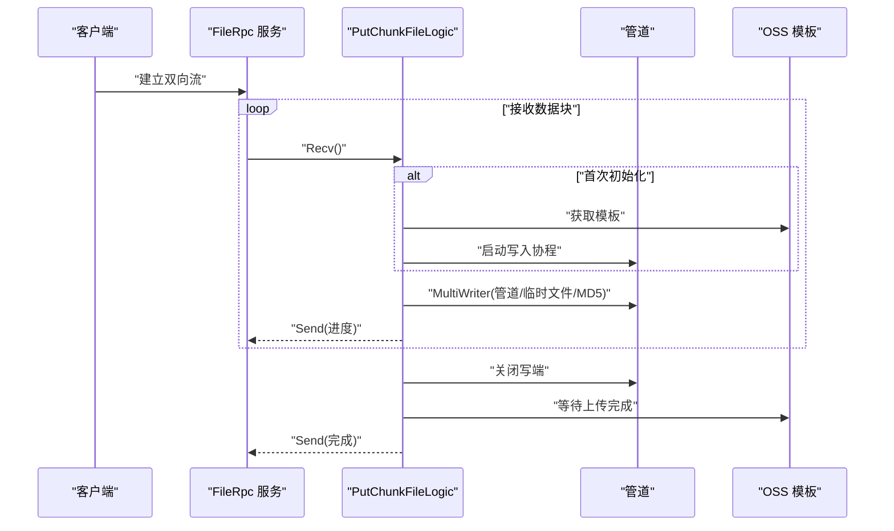

图表来源
- [file.proto:191-207](file://app/file/file.proto#L191-L207)
- [putchunkfilelogic.go:38-270](file://app/file/internal/logic/putchunkfilelogic.go#L38-L270)
- [ossx.go:109-151](file://common/ossx/ossx.go#L109-L151)
- [minio_oss.go:124-148](file://common/ossx/minio_oss.go#L124-L148)

章节来源
- [putchunkfilelogic.go:1-270](file://app/file/internal/logic/putchunkfilelogic.go#L1-L270)

### 流式上传（单向流）
- 功能要点
  - 与分片类似，但使用单向流接口；在接收完成后关闭流并返回结果。
  - 支持进度日志阈值控制，便于大文件传输监控。
- 关键流程

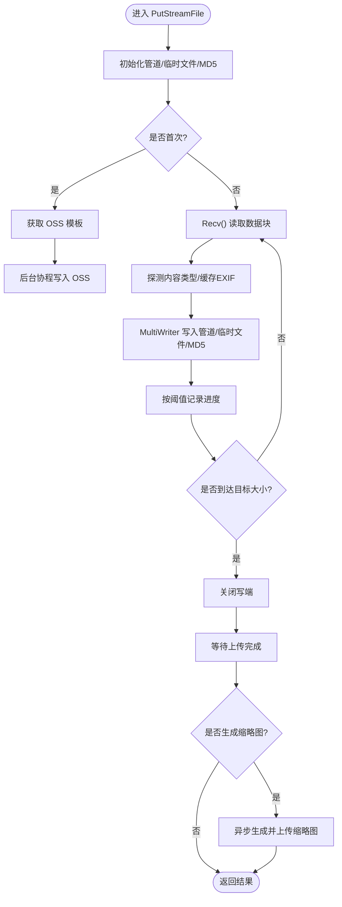

图表来源
- [file.proto:209-225](file://app/file/file.proto#L209-L225)
- [putstreamfilelogic.go:43-287](file://app/file/internal/logic/putstreamfilelogic.go#L43-L287)
- [ossx.go:109-151](file://common/ossx/ossx.go#L109-L151)
- [minio_oss.go:124-148](file://common/ossx/minio_oss.go#L124-L148)

章节来源
- [putstreamfilelogic.go:1-287](file://app/file/internal/logic/putstreamfilelogic.go#L1-L287)

### 删除文件
- 功能要点
  - 根据租户与资源编号获取 OSS 配置，调用模板删除指定文件。
- 关键流程

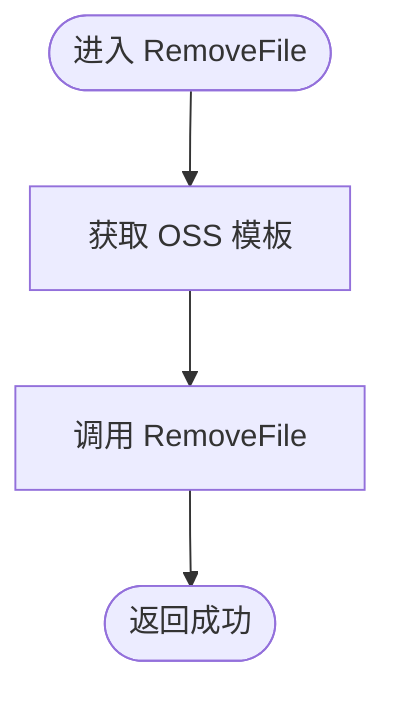

图表来源
- [removefilelogic.go:26-39](file://app/file/internal/logic/removefilelogic.go#L26-L39)
- [ossx.go:109-151](file://common/ossx/ossx.go#L109-L151)
- [minio_oss.go:164-172](file://common/ossx/minio_oss.go#L164-L172)

章节来源
- [removefilelogic.go:1-39](file://app/file/internal/logic/removefilelogic.go#L1-L39)

### 批量删除文件
- 功能要点
  - 通过模板 RemoveFiles 并发删除多个文件，收集失败项。
- 关键流程

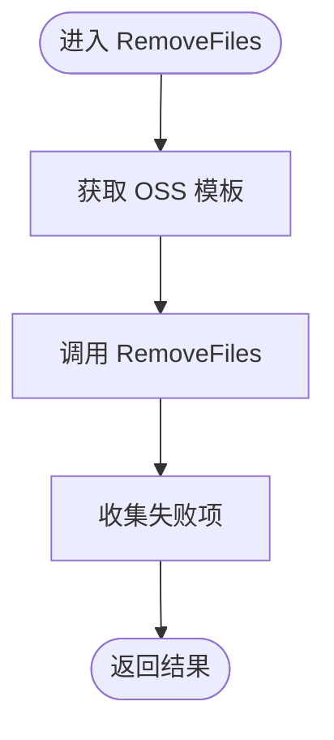

图表来源
- [file.proto:250-256](file://app/file/file.proto#L250-L256)
- [minio_oss.go:174-204](file://common/ossx/minio_oss.go#L174-L204)

章节来源
- [file.proto:250-256](file://app/file/file.proto#L250-L256)
- [minio_oss.go:174-204](file://common/ossx/minio_oss.go#L174-L204)

### 文件信息与签名 URL
- 功能要点
  - StatFile 支持查询文件信息，可选生成签名 URL；SignUrl 直接生成签名链接。
  - 默认过期时间为 1 小时，可通过请求参数覆盖。
- 关键流程

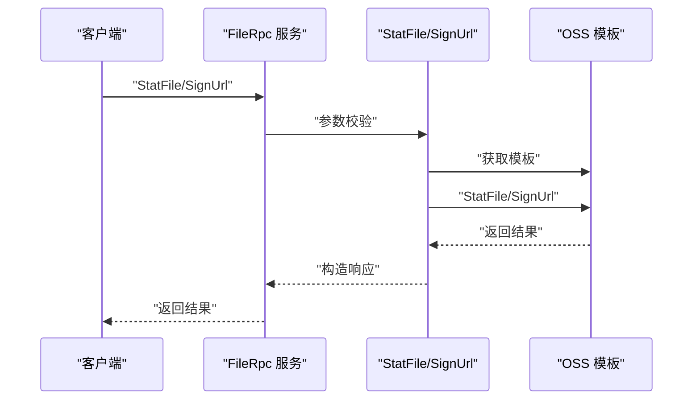

图表来源
- [statfilelogic.go:29-58](file://app/file/internal/logic/statfilelogic.go#L29-L58)
- [signurllogic.go:29-60](file://app/file/internal/logic/signurllogic.go#L29-L60)
- [ossx.go:109-151](file://common/ossx/ossx.go#L109-L151)
- [minio_oss.go:40-56](file://common/ossx/minio_oss.go#L40-L56)
- [minio_oss.go:150-162](file://common/ossx/minio_oss.go#L150-L162)

章节来源
- [statfilelogic.go:1-59](file://app/file/internal/logic/statfilelogic.go#L1-L59)
- [signurllogic.go:1-61](file://app/file/internal/logic/signurllogic.go#L1-L61)

### 视频流截图并上传
- 功能要点
  - 使用媒体工具从视频流抓取帧，生成临时文件后上传至对象存储，计算并回填 MD5。
- 关键流程

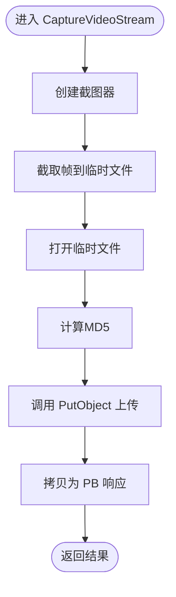

图表来源
- [capturevideostreamlogic.go:35-93](file://app/file/internal/logic/capturevideostreamlogic.go#L35-L93)
- [minio_oss.go:124-148](file://common/ossx/minio_oss.go#L124-L148)

章节来源
- [capturevideostreamlogic.go:1-93](file://app/file/internal/logic/capturevideostreamlogic.go#L1-L93)

### OSS 抽象与 MinIO 实现
- 抽象接口
  - 定义了创建/删除桶、统计、上传、签名、删除等方法，统一不同厂商对象存储差异。
- MinIO 实现
  - 基于 MinIO SDK 客户端实现上述接口；支持桶存在性检查、对象统计、签名 URL、批量删除等。
- 模板池与租户规则
  - 通过模板池缓存租户维度的模板实例，避免重复初始化；支持租户前缀的桶命名规则。

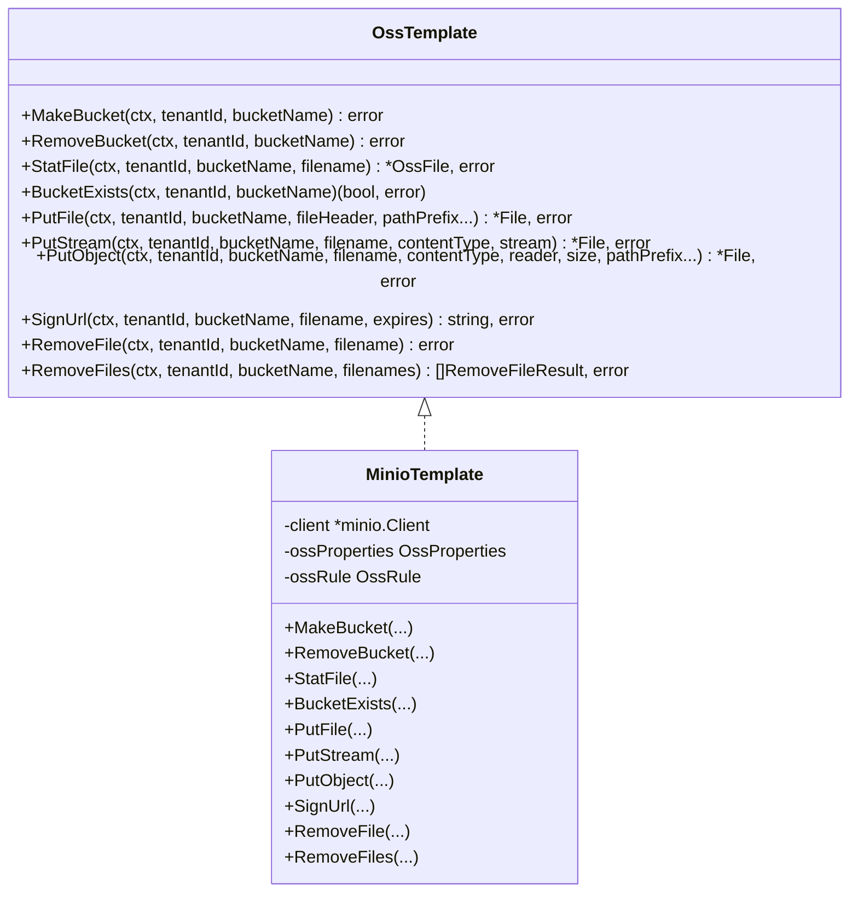

图表来源
- [ossx.go:28-39](file://common/ossx/ossx.go#L28-L39)
- [minio_oss.go:20-243](file://common/ossx/minio_oss.go#L20-L243)

章节来源
- [ossx.go:1-152](file://common/ossx/ossx.go#L1-L152)
- [minio_oss.go:1-243](file://common/ossx/minio_oss.go#L1-L243)

## 依赖关系分析
- 服务接口依赖业务逻辑层，业务逻辑层依赖服务上下文与 OSS 抽象；OSS 抽象依赖具体厂商实现（当前为 MinIO）。
- 服务上下文依赖配置、校验器、数据库模型与任务执行器。
- 业务逻辑依赖图像处理库以生成缩略图与提取 EXIF。

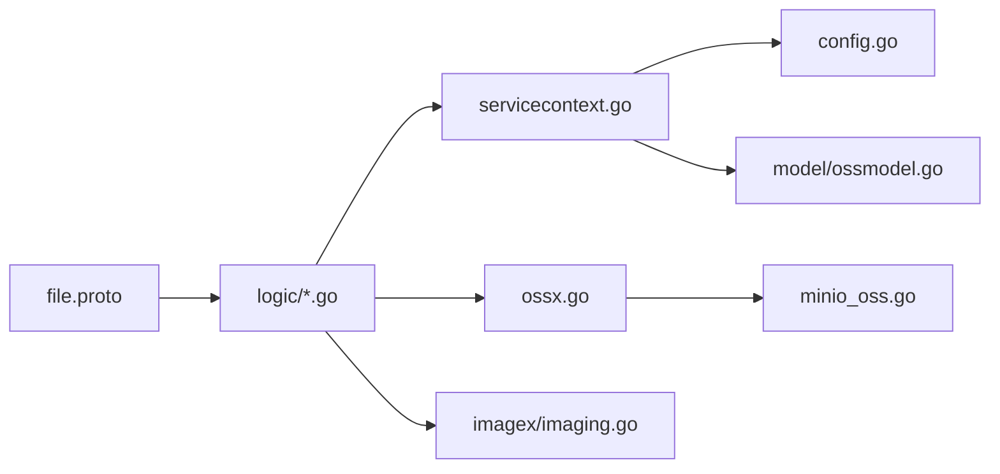

图表来源
- [file.proto:1-287](file://app/file/file.proto#L1-L287)
- [servicecontext.go:12-26](file://app/file/internal/svc/servicecontext.go#L12-L26)
- [ossx.go:109-151](file://common/ossx/ossx.go#L109-L151)
- [minio_oss.go:214-235](file://common/ossx/minio_oss.go#L214-L235)
- [ossmodel.go:1-32](file://model/ossmodel.go#L1-L32)
- [imaging.go:1-69](file://common/imagex/imaging.go#L1-L69)

章节来源
- [file.proto:1-287](file://app/file/file.proto#L1-L287)
- [servicecontext.go:1-27](file://app/file/internal/svc/servicecontext.go#L1-L27)
- [ossx.go:1-152](file://common/ossx/ossx.go#L1-L152)
- [minio_oss.go:1-243](file://common/ossx/minio_oss.go#L1-L243)
- [ossmodel.go:1-32](file://model/ossmodel.go#L1-L32)
- [imaging.go:1-69](file://common/imagex/imaging.go#L1-L69)

## 性能考量
- 分片与流式上传
  - 使用 io.Pipe 与后台协程实现边收边写，降低内存峰值；建议合理设置分片大小与并发度。
- 临时文件与磁盘 IO
  - 临时文件写入与缩略图生成涉及磁盘 IO，建议部署在高性能磁盘并确保 /opt/data/temp 可用空间充足。
- 缩略图异步处理
  - 通过任务执行器并发处理缩略图生成，避免阻塞主上传流程；可根据 CPU 与 IO 能力调整并发数。
- 进度日志与阈值
  - 流式上传支持按阈值记录进度日志，便于大文件监控；建议在生产环境合理设置阈值以平衡日志量与可观测性。
- 桶命名与租户隔离
  - 启用租户模式可避免命名冲突；模板池缓存减少重复初始化开销。

章节来源
- [putchunkfilelogic.go:1-270](file://app/file/internal/logic/putchunkfilelogic.go#L1-L270)
- [putstreamfilelogic.go:1-287](file://app/file/internal/logic/putstreamfilelogic.go#L1-L287)
- [servicecontext.go:29-30](file://app/file/internal/svc/servicecontext.go#L29-L30)

## 故障排查指南
- 无法连接对象存储
  - 检查 Endpoint、AccessKey、SecretKey 是否正确；确认网络可达与安全组放行。
- 上传失败或中断
  - 查看流式上传的日志，定位是接收阶段还是写入阶段失败；关注管道写入与 OSS PutObject 的错误。
- 缩略图未生成
  - 确认 isThumb 参数与图片类型；检查缩略图任务执行器是否正常运行与磁盘空间。
- 签名 URL 无效
  - 校验过期时间参数；确认桶与对象存在且权限允许；检查签名 URL 生成逻辑。
- 删除失败
  - 确认文件名与桶名一致；查看批量删除返回的失败项集合。

章节来源
- [minio_oss.go:237-242](file://common/ossx/minio_oss.go#L237-L242)
- [putstreamfilelogic.go:139-155](file://app/file/internal/logic/putstreamfilelogic.go#L139-L155)
- [signurllogic.go:49-56](file://app/file/internal/logic/signurllogic.go#L49-L56)
- [minio_oss.go:164-172](file://common/ossx/minio_oss.go#L164-L172)

## 结论
文件管理服务通过清晰的分层与抽象，提供了稳定可靠的文件上传、删除、签名与视频截图能力。结合分片/流式上传与异步缩略图处理，满足大文件与高并发场景需求。建议在生产环境中合理配置租户模式、并发与日志策略，并持续监控对象存储可用性与磁盘 IO 性能。

## 附录

### gRPC 接口与消息体概览
- 服务：FileRpc
  - 方法：Ping、OssDetail、OssList、CreateOss、UpdateOss、DeleteOss、MakeBucket、RemoveBucket、StatFile、SignUrl、PutFile、PutChunkFile、PutStreamFile、RemoveFile、RemoveFiles、CaptureVideoStream
- 请求/响应消息体
  - 详见 [file.proto:9-287](file://app/file/file.proto#L9-L287)

章节来源
- [file.proto:1-287](file://app/file/file.proto#L1-L287)

### 配置项说明
- file.yaml
  - Name、ListenOn、Timeout、Mode、Log、NacosConfig、Oss.TenantMode、ThumbTaskConcurrency、DB.DataSource
- config.go
  - Config 结构体字段与默认值

章节来源
- [file.yaml:1-23](file://app/file/etc/file.yaml#L1-L23)
- [config.go:10-30](file://app/file/internal/config/config.go#L10-L30)

### 最佳实践
- 上传
  - 大文件优先使用流式/分片上传；设置合理的分片大小与并发度。
  - 开启租户模式以隔离桶命名；必要时预创建桶。
- 下载与签名
  - 对外暴露签名 URL 时控制过期时间；对私有桶建议短时效签名。
- 删除
  - 批量删除时收集失败项并重试；注意对象名与桶名一致性。
- 缩略图
  - 仅对图片开启缩略图生成；合理设置并发与磁盘空间。
- 安全
  - 严格管理 AccessKey/SecretKey；限制最小权限；定期轮换密钥。

章节来源
- [ossx.go:109-151](file://common/ossx/ossx.go#L109-L151)
- [minio_oss.go:214-235](file://common/ossx/minio_oss.go#L214-L235)
- [servicecontext.go:29-30](file://app/file/internal/svc/servicecontext.go#L29-L30)