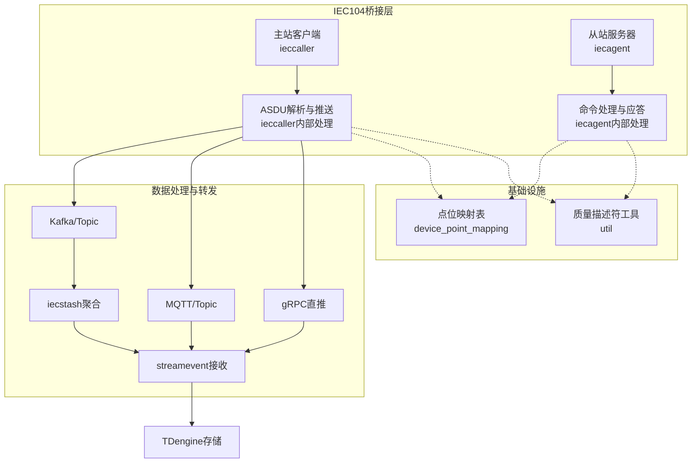
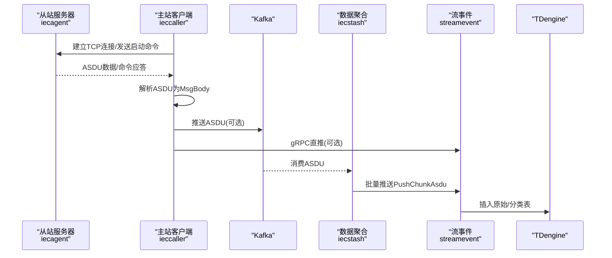
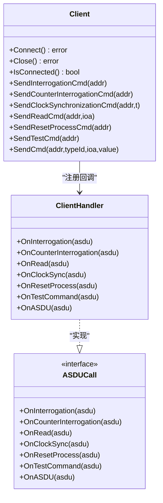
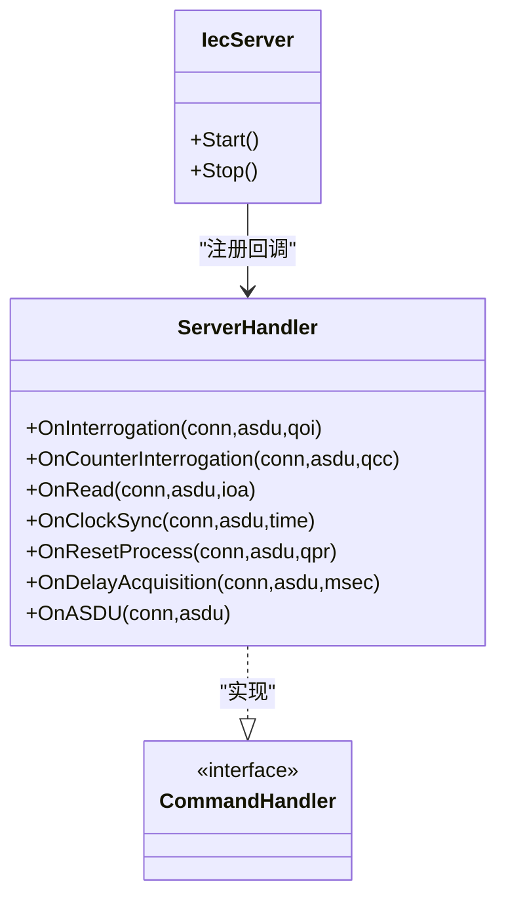
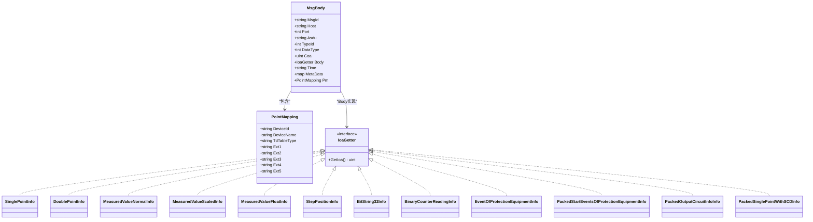
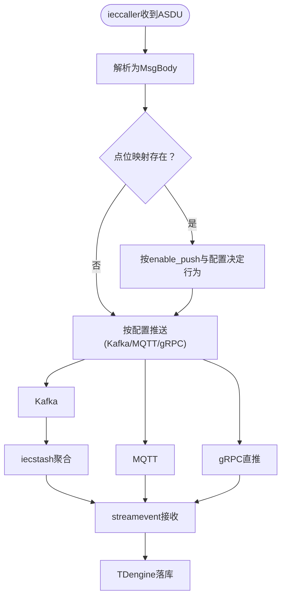
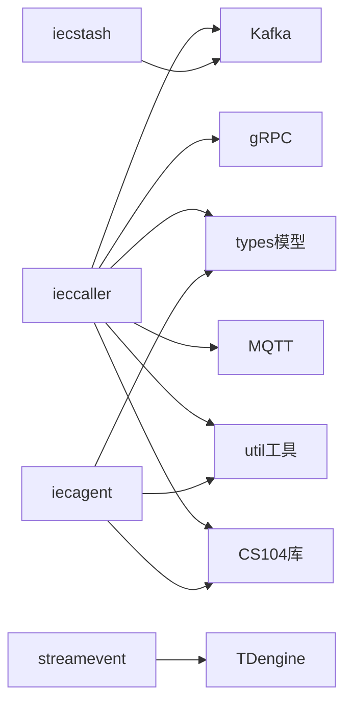

# IEC104桥接服务

<cite>
**本文引用的文件**
- [common/iec104/types/types.go](file://common/iec104/types/types.go)
- [common/iec104/client/core.go](file://common/iec104/client/core.go)
- [common/iec104/client/handle.go](file://common/iec104/client/handle.go)
- [common/iec104/client/interface.go](file://common/iec104/client/interface.go)
- [common/iec104/client/errors.go](file://common/iec104/client/errors.go)
- [common/iec104/server/iecServer.go](file://common/iec104/server/iecServer.go)
- [common/iec104/server/handler.go](file://common/iec104/server/handler.go)
- [common/iec104/util/util.go](file://common/iec104/util/util.go)
- [app/ieccaller/internal/iec/clienthandler.go](file://app/ieccaller/internal/iec/clienthandler.go)
- [app/iecagent/internal/iec/iechandler.go](file://app/iecagent/internal/iec/iechandler.go)
- [app/iecstash/kafka/asdu.go](file://app/iecstash/kafka/asdu.go)
- [docs/iec104.md](file://docs/iec104.md)
- [docs/iec104-protocol.md](file://docs/iec104-protocol.md)
- [app/ieccaller/ieccaller/ieccaller.pb.go](file://app/ieccaller/ieccaller/ieccaller.pb.go)
</cite>

## 目录
1. [简介](#简介)
2. [项目结构](#项目结构)
3. [核心组件](#核心组件)
4. [架构总览](#架构总览)
5. [详细组件分析](#详细组件分析)
6. [依赖分析](#依赖分析)
7. [性能考虑](#性能考虑)
8. [故障排查指南](#故障排查指南)
9. [结论](#结论)
10. [附录](#附录)

## 简介
本文件面向Zero-Service的IEC104桥接服务，系统化阐述IEC60870-5-104规约的桥接实现原理与架构设计，涵盖ASDU解析、控制命令、数据传输、点位映射、遥测处理、事件记录、协议兼容与异常恢复等关键主题，并提供典型应用场景的使用示例与最佳实践。

## 项目结构
IEC104桥接服务由“主站客户端”“从站服务器”“数据处理与转发”三层组成，配合点位映射与质量描述符工具，形成完整的数据采集、解析、转发与存储链路。

**图表来源**
- [docs/iec104.md:14-328](file://docs/iec104.md#L14-L328)
- [app/ieccaller/internal/iec/clienthandler.go:1-541](file://app/ieccaller/internal/iec/clienthandler.go#L1-L541)
- [app/iecagent/internal/iec/iechandler.go:1-124](file://app/iecagent/internal/iec/iechandler.go#L1-L124)
- [app/iecstash/kafka/asdu.go:1-25](file://app/iecstash/kafka/asdu.go#L1-L25)

**章节来源**
- [docs/iec104.md:1-328](file://docs/iec104.md#L1-L328)

## 核心组件
- IEC104类型与消息体模型：定义MsgBody、PointMapping及各类ASDU信息体结构，统一数据载体与点位映射。
- 主站客户端：封装CS104客户端，负责连接、自动重连、命令下发、ASDU回调与指标统计。
- 从站服务器：封装CS104服务器，提供命令请求回调接口，支持日志与参数配置。
- 工具函数：质量描述符解析、Topic模板生成、归一化与浮点互转等。
- 应用处理层：ieccaller将ASDU解析为统一MsgBody并按配置推送；iecagent模拟从站响应主站请求。

**章节来源**
- [common/iec104/types/types.go:1-323](file://common/iec104/types/types.go#L1-L323)
- [common/iec104/client/core.go:1-446](file://common/iec104/client/core.go#L1-L446)
- [common/iec104/server/iecServer.go:1-38](file://common/iec104/server/iecServer.go#L1-L38)
- [common/iec104/util/util.go:1-242](file://common/iec104/util/util.go#L1-L242)
- [app/ieccaller/internal/iec/clienthandler.go:1-541](file://app/ieccaller/internal/iec/clienthandler.go#L1-L541)
- [app/iecagent/internal/iec/iechandler.go:1-124](file://app/iecagent/internal/iec/iechandler.go#L1-L124)

## 架构总览
IEC104桥接服务采用“主站-从站-聚合-存储”的分层架构，ieccaller作为主站与多个从站通信，解析ASDU并按Kafka/MQTT/gRPC三种通道推送；iecstash对Kafka消息进行字节级聚合后批量转发；streamevent接收并落库TDengine。

**图表来源**
- [docs/iec104.md:14-328](file://docs/iec104.md#L14-L328)
- [app/iecstash/kafka/asdu.go:1-25](file://app/iecstash/kafka/asdu.go#L1-L25)

**章节来源**
- [docs/iec104.md:1-328](file://docs/iec104.md#L1-L328)

## 详细组件分析

### 主站客户端（ieccaller）
- 连接与生命周期：支持自动重连、连接事件回调、START/STOP DT帧管理。
- 命令下发：总召唤、计数器召唤、时钟同步、读定值、复位进程、测试命令、各类控制命令（单点/双点/步调/设定值/位串）。
- 回调处理：ASDUHandler统一入口，按TypeID分派到具体类型处理，异步调度与并发控制。
- 数据推送：将解析后的MsgBody按配置推送到Kafka/MQTT/gRPC。

**图表来源**
- [common/iec104/client/core.go:1-446](file://common/iec104/client/core.go#L1-L446)
- [common/iec104/client/handle.go:1-155](file://common/iec104/client/handle.go#L1-L155)
- [common/iec104/client/interface.go:1-71](file://common/iec104/client/interface.go#L1-L71)

**章节来源**
- [common/iec104/client/core.go:1-446](file://common/iec104/client/core.go#L1-L446)
- [common/iec104/client/handle.go:1-155](file://common/iec104/client/handle.go#L1-L155)
- [common/iec104/client/interface.go:1-71](file://common/iec104/client/interface.go#L1-L71)
- [app/ieccaller/internal/iec/clienthandler.go:1-541](file://app/ieccaller/internal/iec/clienthandler.go#L1-L541)

### 从站服务器（iecagent）
- 提供命令请求回调：总召唤、计数器召唤、读定值、时钟同步、复位进程、延迟获取、通用ASDU。
- 模拟响应：随机状态、规一化遥测、事件类信息等，便于联调与测试。

**图表来源**
- [common/iec104/server/iecServer.go:1-38](file://common/iec104/server/iecServer.go#L1-L38)
- [common/iec104/server/handler.go:1-60](file://common/iec104/server/handler.go#L1-L60)
- [app/iecagent/internal/iec/iechandler.go:1-124](file://app/iecagent/internal/iec/iechandler.go#L1-L124)

**章节来源**
- [common/iec104/server/iecServer.go:1-38](file://common/iec104/server/iecServer.go#L1-L38)
- [common/iec104/server/handler.go:1-60](file://common/iec104/server/handler.go#L1-L60)
- [app/iecagent/internal/iec/iechandler.go:1-124](file://app/iecagent/internal/iec/iechandler.go#L1-L124)

### ASDU解析与数据模型
- 统一消息体MsgBody：包含ASDU类型、公共地址、时间戳、点位映射PM、元数据等。
- 点位映射PointMapping：设备ID/名称、TDengine表类型、扩展字段等，用于下游路由与落库。
- 信息体结构：单点、双点、规一化/标度化/短浮点遥测、步位置、累计量、保护事件、成组信息等。
- 质量描述符：QDS/QDP解析与字符串化，支持溢出/闭锁/取代/非当前/无效等标志判断。

**图表来源**
- [common/iec104/types/types.go:17-323](file://common/iec104/types/types.go#L17-L323)

**章节来源**
- [common/iec104/types/types.go:1-323](file://common/iec104/types/types.go#L1-L323)
- [common/iec104/util/util.go:1-242](file://common/iec104/util/util.go#L1-L242)

### 数据推送与聚合
- Kafka推送：ieccaller将ASDU写入Kafka，iecstash按字节数阈值聚合后批量转发。
- MQTT推送：支持Go模板动态生成Topic，按MsgBody字段与点位映射灵活路由。
- gRPC直推：ieccaller直接调用streamevent PushChunkAsdu，降低中间件延迟。
- streamevent：接收并按点位配置转换，最终落库TDengine。

**图表来源**
- [docs/iec104.md:14-328](file://docs/iec104.md#L14-L328)
- [app/iecstash/kafka/asdu.go:1-25](file://app/iecstash/kafka/asdu.go#L1-L25)

**章节来源**
- [docs/iec104.md:14-328](file://docs/iec104.md#L14-L328)
- [app/iecstash/kafka/asdu.go:1-25](file://app/iecstash/kafka/asdu.go#L1-L25)

### 协议兼容与异常恢复
- 协议兼容：支持宽参数集（ParamsWide）、多种时标格式（CP56Time2a/带/不带时标），覆盖12种监视ASDU与6种控制ASDU。
- 异常恢复：自动重连、连接事件回调、START/STOP DT帧管理、连接丢失事件处理、指标统计与日志。
- 质量描述符：统一解析QDS/QDP，支持溢出/闭锁/取代/非当前/无效等标志，辅助异常识别与告警。

**章节来源**
- [common/iec104/client/core.go:1-446](file://common/iec104/client/core.go#L1-L446)
- [common/iec104/util/util.go:1-242](file://common/iec104/util/util.go#L1-L242)

## 依赖分析
- 组件耦合：主站客户端与应用处理层通过ASDUCall接口解耦；从站服务器与命令处理层通过CommandHandler接口解耦。
- 外部依赖：CS104库（go-iecp5）、Kafka/MQTT/gRPC生态、TDengine存储。
- 数据依赖：MsgBody依赖PointMapping与各类ASDU信息体；推送路径依赖Kafka/Topic模板与gRPC目标。

**图表来源**
- [common/iec104/client/core.go:1-446](file://common/iec104/client/core.go#L1-L446)
- [common/iec104/server/iecServer.go:1-38](file://common/iec104/server/iecServer.go#L1-L38)
- [common/iec104/util/util.go:1-242](file://common/iec104/util/util.go#L1-L242)
- [docs/iec104.md:14-328](file://docs/iec104.md#L14-L328)

**章节来源**
- [common/iec104/client/core.go:1-446](file://common/iec104/client/core.go#L1-L446)
- [common/iec104/server/iecServer.go:1-38](file://common/iec104/server/iecServer.go#L1-L38)
- [common/iec104/util/util.go:1-242](file://common/iec104/util/util.go#L1-L242)
- [docs/iec104.md:14-328](file://docs/iec104.md#L14-L328)

## 性能考虑
- 并发与限速：主站客户端支持任务并发度配置，避免高并发下资源争用。
- 聚合策略：iecstash按字节数阈值聚合，平衡吞吐与延迟。
- 日志与指标：连接事件与ASDU处理均记录耗时指标，便于性能分析与瓶颈定位。
- 网络参数：合理设置重连间隔与参数集，减少抖动对稳定性的影响。

[本节为通用指导，无需特定文件引用]

## 故障排查指南
- 连接问题：检查自动重连开关、重连间隔、START/STOP DT帧是否正确发送；关注连接事件回调日志。
- 命令失败：确认命令类型与参数转换（布尔/整数/浮点），检查QOC/QOS字段；验证IOA与COA是否匹配点位映射。
- 推送异常：核对Kafka/MQTT/gRPC配置；检查Topic模板是否解析成功、是否存在非法字符；验证enable_push与点位映射。
- 质量异常：利用QDS/QDP解析结果定位溢出/闭锁/无效等问题；结合业务侧告警策略处理。
- 存储问题：确认TDengine表结构与标签字段，检查原始表与分类表的插入逻辑。

**章节来源**
- [common/iec104/client/errors.go:1-8](file://common/iec104/client/errors.go#L1-L8)
- [common/iec104/util/util.go:1-242](file://common/iec104/util/util.go#L1-L242)
- [docs/iec104.md:195-328](file://docs/iec104.md#L195-L328)

## 结论
IEC104桥接服务以清晰的分层架构与强健的协议适配能力，实现了从站数据采集、ASDU解析、多通道推送与存储入库的完整闭环。通过点位映射与质量描述符工具，平台在灵活性与可靠性之间取得平衡，适用于大规模工业数据采集与监控场景。

[本节为总结性内容，无需特定文件引用]

## 附录

### 使用示例与典型场景
- 遥测读取：通过SendReadCmd向指定COA/IOA发起读定值请求，ieccaller解析后按配置推送。
- 遥控操作：构造控制命令（单点/双点/步调/设定值/位串），设置QOC/QOS与时间戳，下发后等待从站应答。
- 事件上报：从站触发事件（如保护动作、成组启动事件），iecagent模拟应答，ieccaller解析并推送。
- 总召唤/计数器召唤：定时或手动触发，批量获取遥信/遥测与累计量，支持分组冻结与读取。

**章节来源**
- [app/ieccaller/internal/iec/clienthandler.go:1-541](file://app/ieccaller/internal/iec/clienthandler.go#L1-L541)
- [app/iecagent/internal/iec/iechandler.go:1-124](file://app/iecagent/internal/iec/iechandler.go#L1-L124)
- [docs/iec104-protocol.md:1-884](file://docs/iec104-protocol.md#L1-L884)

### 协议兼容与消息格式
- 支持的ASDU类型与信息体结构详见IEC104消息对接文档；质量描述符解析与Topic模板生成由util模块提供。
- 点位映射表device_point_mapping用于控制推送与落库策略，支持扩展字段与多维度路由。

**章节来源**
- [docs/iec104-protocol.md:1-884](file://docs/iec104-protocol.md#L1-L884)
- [docs/iec104.md:207-328](file://docs/iec104.md#L207-L328)