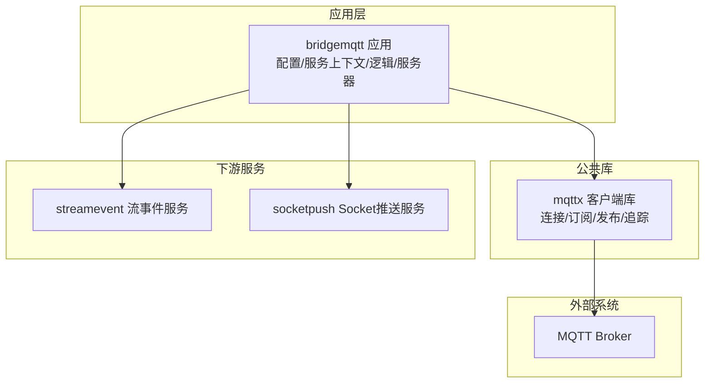
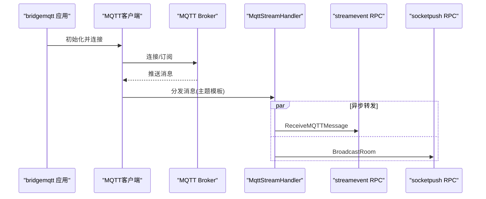
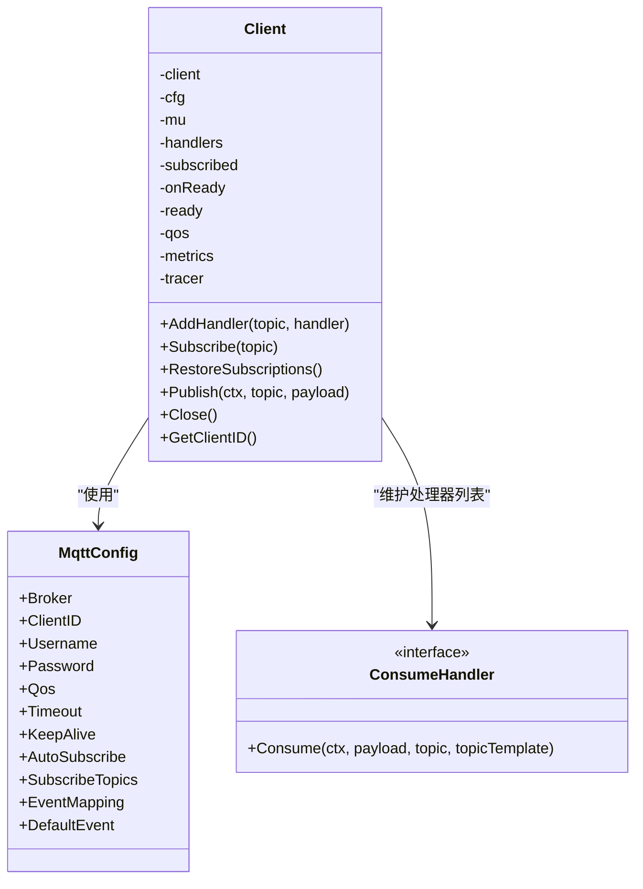
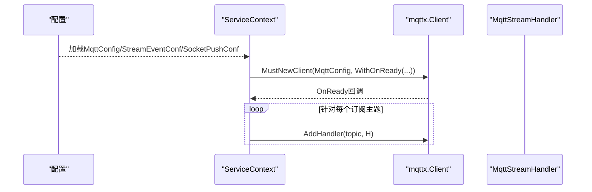
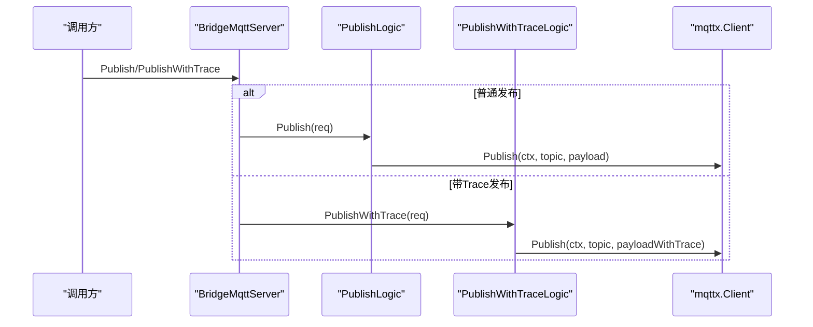
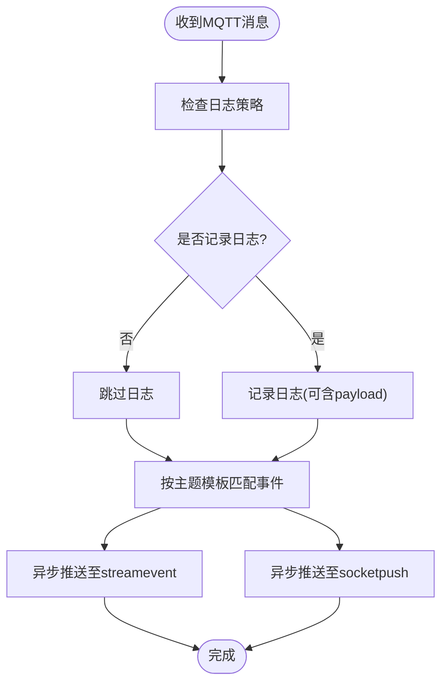
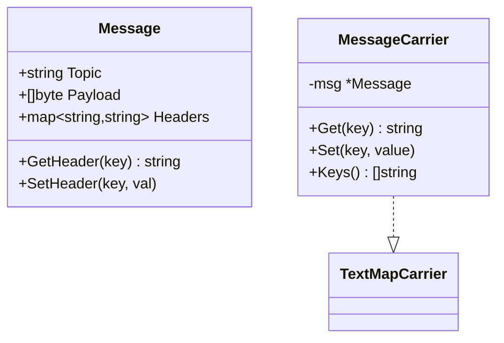
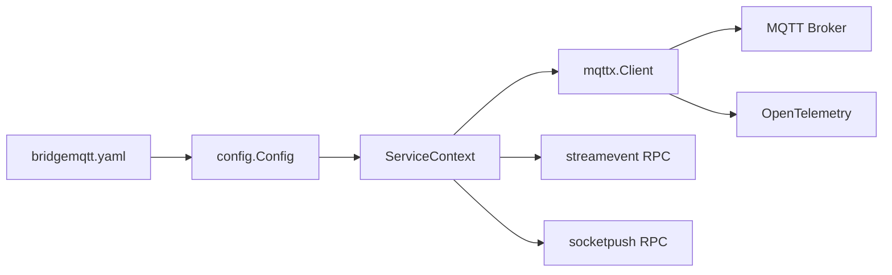

# MQTT桥接服务

<cite>
**本文引用的文件**
- [bridgemqtt.yaml](file://app/bridgemqtt/etc/bridgemqtt.yaml)
- [config.go](file://app/bridgemqtt/internal/config/config.go)
- [servicecontext.go](file://app/bridgemqtt/internal/svc/servicecontext.go)
- [bridgemqttserver.go](file://app/bridgemqtt/internal/server/bridgemqttserver.go)
- [publishlogic.go](file://app/bridgemqtt/internal/logic/publishlogic.go)
- [publishwithtracelogic.go](file://app/bridgemqtt/internal/logic/publishwithtracelogic.go)
- [mqttstreamhandler.go](file://app/bridgemqtt/internal/handler/mqttstreamhandler.go)
- [mqttx.go](file://common/mqttx/mqttx.go)
- [message.go](file://common/mqttx/message.go)
- [trace.go](file://common/mqttx/trace.go)
- [bridgemqtt.proto](file://app/bridgemqtt/bridgemqtt.proto)
- [receivemqttmessagelogic.go](file://facade/streamevent/internal/logic/receivemqttmessagelogic.go)
- [broadcastroomlogic.go](file://socketapp/socketpush/internal/logic/broadcastroomlogic.go)
</cite>

## 目录
1. [简介](#简介)
2. [项目结构](#项目结构)
3. [核心组件](#核心组件)
4. [架构总览](#架构总览)
5. [详细组件分析](#详细组件分析)
6. [依赖分析](#依赖分析)
7. [性能考量](#性能考量)
8. [故障排查指南](#故障排查指南)
9. [结论](#结论)
10. [附录：使用示例与最佳实践](#附录使用示例与最佳实践)

## 简介
本文件系统性阐述Zero-Service中的MQTT桥接服务，围绕以下目标展开：
- 深入解释MQTT协议的桥接实现原理，包括连接建立、主题订阅、消息发布等核心技术。
- 详细说明MQTT客户端的封装设计，包括连接池管理、消息路由、QoS处理等关键功能。
- 阐述MQTT桥接服务的架构设计，包括主题映射、消息转换、会话管理等机制。
- 提供MQTT协议的使用示例，覆盖发布订阅、消息过滤、连接重试等常见场景。
- 给出性能调优建议与网络异常处理策略。

## 项目结构
MQTT桥接服务位于应用层的bridgemqtt模块，并通过公共库common/mqttx封装MQTT客户端能力；同时集成流式事件推送与Socket推送能力，形成“MQTT接收—RPC转发—前端推送”的完整链路。

**图表来源**
- [servicecontext.go:47-55](file://app/bridgemqtt/internal/svc/servicecontext.go#L47-L55)
- [mqttx.go:98-178](file://common/mqttx/mqttx.go#L98-L178)
- [bridgemqtt.yaml:19-48](file://app/bridgemqtt/etc/bridgemqtt.yaml#L19-L48)

**章节来源**
- [bridgemqtt.yaml:1-48](file://app/bridgemqtt/etc/bridgemqtt.yaml#L1-L48)
- [config.go:9-23](file://app/bridgemqtt/internal/config/config.go#L9-L23)
- [servicecontext.go:21-60](file://app/bridgemqtt/internal/svc/servicecontext.go#L21-L60)

## 核心组件
- MQTT客户端封装：统一连接、订阅、发布、追踪与指标统计。
- 服务上下文：负责初始化MQTT客户端、注册订阅处理器、构建下游RPC客户端。
- RPC服务：对外暴露发布接口，支持普通发布与带TraceId的发布。
- 消息处理器：将MQTT消息转发至流事件与Socket推送服务，并支持事件映射与日志控制。
- 配置中心：集中管理MQTT Broker地址、认证信息、订阅主题、事件映射、下游RPC目标等。

**章节来源**
- [mqttx.go:76-87](file://common/mqttx/mqttx.go#L76-L87)
- [servicecontext.go:16-19](file://app/bridgemqtt/internal/svc/servicecontext.go#L16-L19)
- [bridgemqttserver.go:15-42](file://app/bridgemqtt/internal/server/bridgemqttserver.go#L15-L42)
- [mqttstreamhandler.go:99-119](file://app/bridgemqtt/internal/handler/mqttstreamhandler.go#L99-L119)
- [bridgemqtt.yaml:19-48](file://app/bridgemqtt/etc/bridgemqtt.yaml#L19-L48)

## 架构总览
MQTT桥接服务采用“事件驱动+异步转发”的架构：
- 启动阶段：读取配置，创建MQTT客户端并自动订阅配置中声明的主题。
- 运行阶段：当收到MQTT消息时，按主题模板匹配事件名，异步并发地向流事件服务与Socket推送服务转发消息。
- RPC入口：提供zrpc接口用于外部主动发布MQTT消息，支持普通发布与带TraceId的发布。

**图表来源**
- [servicecontext.go:47-55](file://app/bridgemqtt/internal/svc/servicecontext.go#L47-L55)
- [mqttstreamhandler.go:130-188](file://app/bridgemqtt/internal/handler/mqttstreamhandler.go#L130-L188)
- [mqttx.go:258-307](file://common/mqttx/mqttx.go#L258-L307)

## 详细组件分析

### MQTT客户端封装（mqttx.Client）
- 连接建立与生命周期
  - 支持多Broker地址、自动重连、连接超时、心跳设置。
  - 首次连接成功触发onReady回调，用于恢复订阅。
  - 断线时清空已订阅集合，待重连后自动恢复订阅。
- 订阅与消息路由
  - 支持手动订阅与自动订阅两种模式。
  - 按主题模板注册多个处理器，消息到达时逐一调用。
  - 若无处理器，触发默认处理器记录错误日志。
- 发布与QoS
  - 发布时进行超时校验与错误上报，支持OpenTelemetry埋点。
  - QoS范围校验与默认值处理。
- 追踪与指标
  - 为消费与发布分别创建Span，记录客户端ID、主题、QoS等属性。
  - 统计任务耗时，便于性能观测。

**图表来源**
- [mqttx.go:76-87](file://common/mqttx/mqttx.go#L76-L87)
- [mqttx.go:51-64](file://common/mqttx/mqttx.go#L51-L64)
- [mqttx.go:33-43](file://common/mqttx/mqttx.go#L33-L43)

**章节来源**
- [mqttx.go:98-178](file://common/mqttx/mqttx.go#L98-L178)
- [mqttx.go:180-202](file://common/mqttx/mqttx.go#L180-L202)
- [mqttx.go:204-255](file://common/mqttx/mqttx.go#L204-L255)
- [mqttx.go:258-307](file://common/mqttx/mqttx.go#L258-L307)
- [mqttx.go:310-333](file://common/mqttx/mqttx.go#L310-L333)
- [mqttx.go:361-389](file://common/mqttx/mqttx.go#L361-L389)

### 服务上下文与启动流程（ServiceContext）
- 初始化日志、下游RPC客户端（可选启用）。
- 创建MQTT客户端，注册onReady回调，在连接成功后为每个订阅主题注册MqttStreamHandler。
- 将MqttClient注入到ServiceContext，供RPC服务使用。

**图表来源**
- [servicecontext.go:21-60](file://app/bridgemqtt/internal/svc/servicecontext.go#L21-L60)
- [mqttx.go:89-96](file://common/mqttx/mqttx.go#L89-L96)

**章节来源**
- [servicecontext.go:21-60](file://app/bridgemqtt/internal/svc/servicecontext.go#L21-L60)

### RPC服务与业务逻辑（BridgeMqttServer）
- 对外提供Ping、Publish、PublishWithTrace三个RPC方法。
- Publish直接委托给mqttx.Client.Publish。
- PublishWithTrace将当前TraceId注入消息载体并通过MQTT发布，便于内部链路追踪。

**图表来源**
- [bridgemqttserver.go:26-41](file://app/bridgemqtt/internal/server/bridgemqttserver.go#L26-L41)
- [publishlogic.go:27-33](file://app/bridgemqtt/internal/logic/publishlogic.go#L27-L33)
- [publishwithtracelogic.go:31-47](file://app/bridgemqtt/internal/logic/publishwithtracelogic.go#L31-L47)
- [mqttx.go:310-333](file://common/mqttx/mqttx.go#L310-L333)

**章节来源**
- [bridgemqttserver.go:15-42](file://app/bridgemqtt/internal/server/bridgemqttserver.go#L15-L42)
- [publishlogic.go:12-34](file://app/bridgemqtt/internal/logic/publishlogic.go#L12-L34)
- [publishwithtracelogic.go:16-48](file://app/bridgemqtt/internal/logic/publishwithtracelogic.go#L16-L48)

### 消息处理器与事件映射（MqttStreamHandler）
- 主题到事件的映射：根据配置中的EventMapping或默认事件名决定推送事件名。
- 并发转发：使用TaskRunner并发调度，分别向streamevent与socketpush发送消息。
- 日志控制：支持按主题粒度控制日志频率与是否打印payload，避免高频日志风暴。
- 消息格式：支持从MQTT消息体解析嵌套Message结构，提取payload并注入Trace上下文。

**图表来源**
- [mqttstreamhandler.go:130-188](file://app/bridgemqtt/internal/handler/mqttstreamhandler.go#L130-L188)
- [mqttstreamhandler.go:19-97](file://app/bridgemqtt/internal/handler/mqttstreamhandler.go#L19-L97)

**章节来源**
- [mqttstreamhandler.go:99-119](file://app/bridgemqtt/internal/handler/mqttstreamhandler.go#L99-L119)
- [mqttstreamhandler.go:121-128](file://app/bridgemqtt/internal/handler/mqttstreamhandler.go#L121-L128)
- [mqttstreamhandler.go:130-188](file://app/bridgemqtt/internal/handler/mqttstreamhandler.go#L130-L188)

### 消息结构与追踪（Message/MessageCarrier）
- Message：封装topic、payload与headers，支持读写header。
- MessageCarrier：实现OpenTelemetry TextMapCarrier接口，用于在消息中传播Trace上下文。
- PublishWithTrace：将当前TraceID注入Message并序列化后发布，下游可提取上下文继续追踪。

**图表来源**
- [message.go:3-30](file://common/mqttx/message.go#L3-L30)
- [trace.go:8-31](file://common/mqttx/trace.go#L8-L31)

**章节来源**
- [message.go:3-30](file://common/mqttx/message.go#L3-L30)
- [trace.go:1-31](file://common/mqttx/trace.go#L1-L31)
- [publishwithtracelogic.go:31-47](file://app/bridgemqtt/internal/logic/publishwithtracelogic.go#L31-L47)

## 依赖分析
- 配置依赖：bridgemqtt.yaml提供Broker、认证、订阅主题、事件映射、下游RPC目标等配置。
- 运行时依赖：ServiceContext在启动时依赖配置创建MQTT客户端与下游RPC客户端；MQTT客户端依赖paho.mqtt.golang库。
- 事件依赖：MqttStreamHandler依赖streamevent与socketpush的RPC接口，实现消息转发。
- 追踪依赖：mqttx.Client与MessageCarrier依赖OpenTelemetry进行上下文传播。

**图表来源**
- [bridgemqtt.yaml:19-48](file://app/bridgemqtt/etc/bridgemqtt.yaml#L19-L48)
- [config.go:9-23](file://app/bridgemqtt/internal/config/config.go#L9-L23)
- [servicecontext.go:21-60](file://app/bridgemqtt/internal/svc/servicecontext.go#L21-L60)
- [mqttx.go:98-178](file://common/mqttx/mqttx.go#L98-L178)

**章节来源**
- [bridgemqtt.yaml:19-48](file://app/bridgemqtt/etc/bridgemqtt.yaml#L19-L48)
- [config.go:9-23](file://app/bridgemqtt/internal/config/config.go#L9-L23)
- [servicecontext.go:21-60](file://app/bridgemqtt/internal/svc/servicecontext.go#L21-L60)

## 性能考量
- 并发转发：MqttStreamHandler使用TaskRunner并发调度，减少单点阻塞，提升吞吐。
- 日志节流：TopicLogManager按主题维度控制日志频率与payload打印，降低高频日志开销。
- RPC限流：下游RPC客户端设置了最大消息大小限制，避免大包导致内存压力。
- 指标与追踪：客户端内置统计与Span埋点，便于定位慢路径与异常。
- 连接与订阅：自动重连与断线重订阅，保障高可用；订阅合并去重，避免重复订阅。

**章节来源**
- [mqttstreamhandler.go:114-118](file://app/bridgemqtt/internal/handler/mqttstreamhandler.go#L114-L118)
- [mqttstreamhandler.go:19-97](file://app/bridgemqtt/internal/handler/mqttstreamhandler.go#L19-L97)
- [servicecontext.go:26-46](file://app/bridgemqtt/internal/svc/servicecontext.go#L26-L46)
- [mqttx.go:124-126](file://common/mqttx/mqttx.go#L124-L126)
- [mqttx.go:144-146](file://common/mqttx/mqttx.go#L144-L146)
- [mqttx.go:236-255](file://common/mqttx/mqttx.go#L236-L255)

## 故障排查指南
- 连接失败
  - 检查Broker地址、认证信息与网络连通性。
  - 查看连接超时与自动重连日志，确认是否在OnConnect回调中触发订阅恢复。
- 订阅失败
  - 确认主题是否正确、QoS是否被Broker支持。
  - 观察订阅超时与错误日志，必要时调整超时参数。
- 发布失败
  - 检查客户端是否已连接、payload是否为空、超时与错误日志。
  - 对于带Trace的发布，确认MessageCarrier是否正确注入Trace上下文。
- 下游转发失败
  - streamevent与socketpush的RPC调用失败会在日志中标记，检查下游服务健康状态与网络。
- 无处理器告警
  - 当消息主题未注册处理器时，会触发默认处理器记录错误日志，需补充AddHandler或调整订阅主题。

**章节来源**
- [mqttx.go:148-166](file://common/mqttx/mqttx.go#L148-L166)
- [mqttx.go:216-233](file://common/mqttx/mqttx.go#L216-L233)
- [mqttx.go:320-333](file://common/mqttx/mqttx.go#L320-L333)
- [mqttx.go:293-299](file://common/mqttx/mqttx.go#L293-L299)
- [mqttstreamhandler.go:140-186](file://app/bridgemqtt/internal/handler/mqttstreamhandler.go#L140-L186)

## 结论
该MQTT桥接服务以mqttx.Client为核心，结合事件映射与异步转发机制，实现了从MQTT到RPC再到Socket的全链路消息桥接。通过自动重连、订阅恢复、日志节流与并发转发等设计，兼顾了可靠性与性能。配合OpenTelemetry追踪与指标统计，便于运维与问题定位。

## 附录：使用示例与最佳实践
- 发布消息（普通）
  - 使用BridgeMqtt.Publish接口，传入topic与payload即可。
  - 适用于主动触发MQTT消息发布的场景。
- 发布消息（带Trace）
  - 使用BridgeMqtt.PublishWithTrace接口，内部自动注入当前TraceID，便于跨服务追踪。
- 订阅与事件映射
  - 在配置中声明SubscribeTopics与EventMapping，启动后自动订阅并按模板映射事件名。
  - 可通过AddHandler动态注册新主题处理器。
- 消息过滤与日志控制
  - 使用TopicLogManager按主题开启/关闭payload日志与日志频率，避免高频日志影响性能。
- 连接重试与高可用
  - 客户端具备自动重连与断线重订阅能力，Broker切换与网络抖动下仍可保持稳定。
- 性能调优建议
  - 合理设置KeepAlive与Timeout，平衡延迟与资源占用。
  - 控制订阅主题数量与并发转发任务数，避免下游RPC成为瓶颈。
  - 对大包消息注意RPC最大消息大小限制，必要时拆包或压缩。

**章节来源**
- [bridgemqtt.proto:10-49](file://app/bridgemqtt/bridgemqtt.proto#L10-L49)
- [bridgemqtt.yaml:26-34](file://app/bridgemqtt/etc/bridgemqtt.yaml#L26-L34)
- [mqttstreamhandler.go:19-97](file://app/bridgemqtt/internal/handler/mqttstreamhandler.go#L19-L97)
- [servicecontext.go:47-55](file://app/bridgemqtt/internal/svc/servicecontext.go#L47-L55)
- [publishlogic.go:27-33](file://app/bridgemqtt/internal/logic/publishlogic.go#L27-L33)
- [publishwithtracelogic.go:31-47](file://app/bridgemqtt/internal/logic/publishwithtracelogic.go#L31-L47)