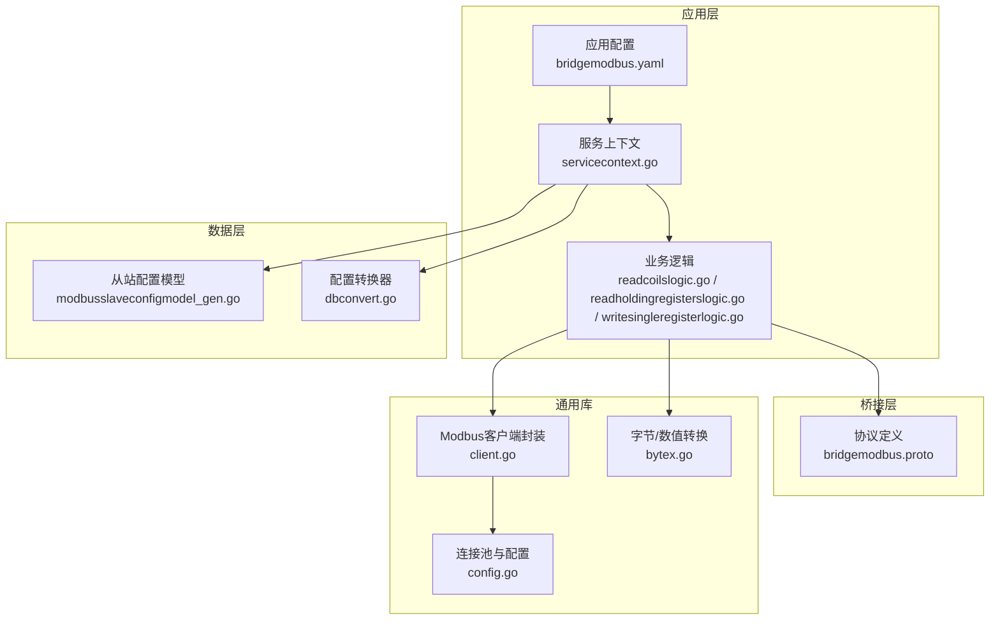
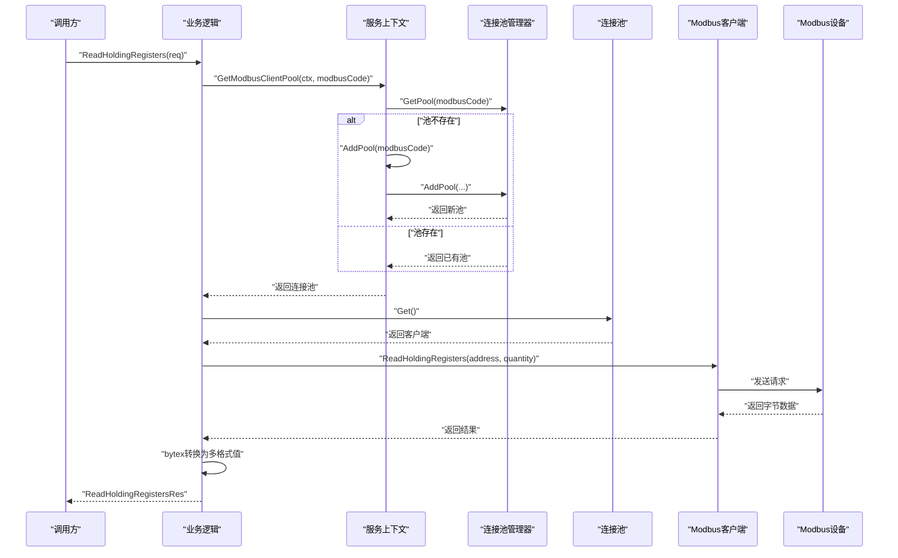
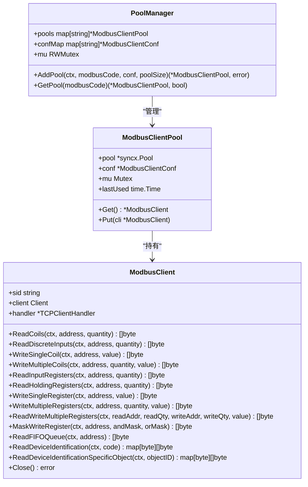
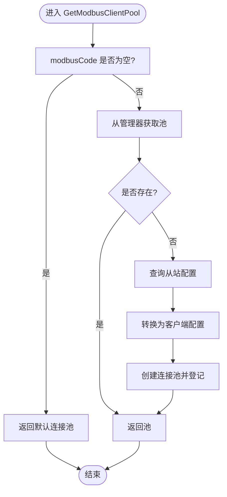
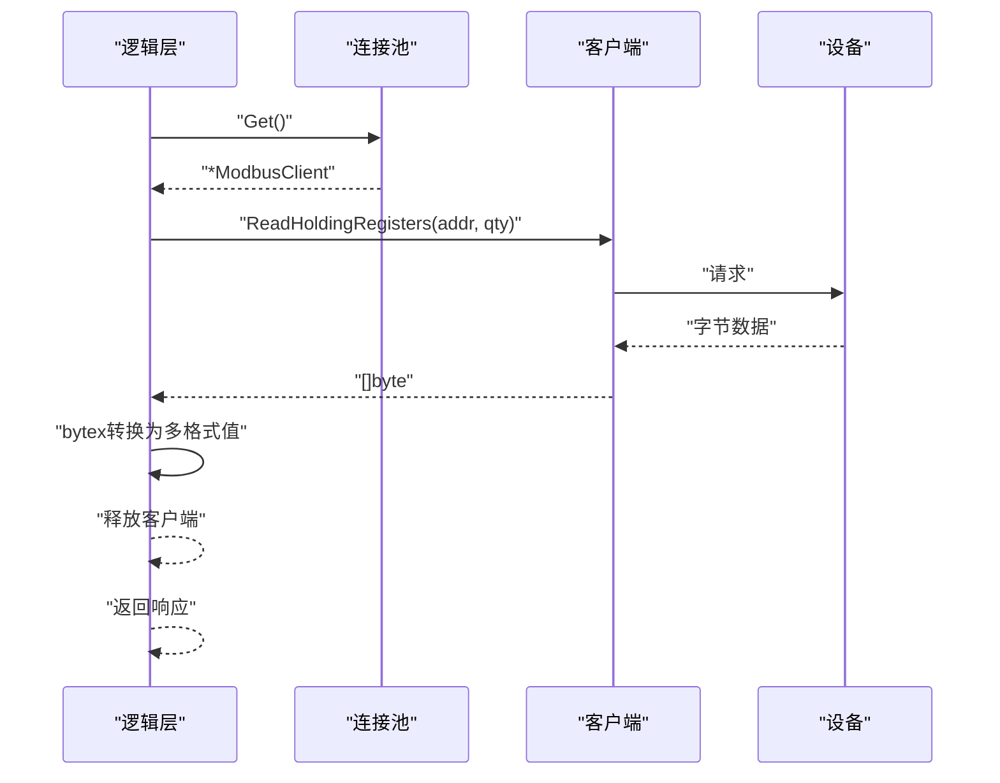
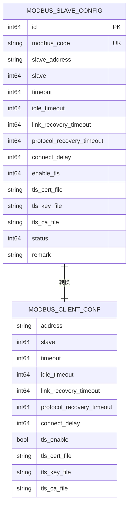
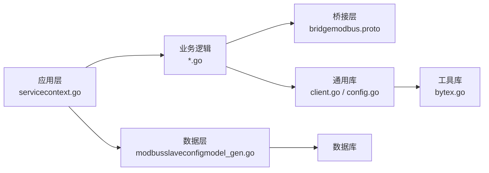

# Modbus桥接服务

<cite>
**本文引用的文件**
- [bridgemodbus.proto](file://app/bridgemodbus/bridgemodbus.proto)
- [client.go](file://common/modbusx/client.go)
- [config.go](file://common/modbusx/config.go)
- [bytex.go](file://common/bytex/bytex.go)
- [bridgemodbus.yaml](file://app/bridgemodbus/etc/bridgemodbus.yaml)
- [config.go](file://app/bridgemodbus/internal/config/config.go)
- [servicecontext.go](file://app/bridgemodbus/internal/svc/servicecontext.go)
- [readcoilslogic.go](file://app/bridgemodbus/internal/logic/readcoilslogic.go)
- [readholdingregisterslogic.go](file://app/bridgemodbus/internal/logic/readholdingregisterslogic.go)
- [writesingleregisterlogic.go](file://app/bridgemodbus/internal/logic/writesingleregisterlogic.go)
- [saveconfiglogic.go](file://app/bridgemodbus/internal/logic/saveconfiglogic.go)
- [modbusslaveconfigmodel_gen.go](file://model/modbusslaveconfigmodel_gen.go)
- [dbconvert.go](file://model/dbconvert.go)
</cite>

## 目录
1. [简介](#简介)
2. [项目结构](#项目结构)
3. [核心组件](#核心组件)
4. [架构总览](#架构总览)
5. [详细组件分析](#详细组件分析)
6. [依赖关系分析](#依赖关系分析)
7. [性能考量](#性能考量)
8. [故障排查指南](#故障排查指南)
9. [结论](#结论)
10. [附录](#附录)

## 简介
本文件面向Zero-Service中的Modbus桥接服务，系统性阐述其基于Modbus TCP/RTU协议的桥接实现原理，覆盖协议解析、数据转换、设备通信等核心技术；深入解析Modbus客户端封装的设计模式（连接管理、命令执行、错误处理）；阐明桥接服务的架构设计（配置管理、设备映射、连接池与缓存策略）；并提供线圈/寄存器读写、批量数据处理等典型使用场景的操作指引与最佳实践。

## 项目结构
围绕Modbus桥接服务的关键目录与文件如下：
- 协议与接口定义：app/bridgemodbus/bridgemodbus.proto
- 通用Modbus客户端与连接池：common/modbusx/client.go、common/modbusx/config.go
- 数据转换工具：common/bytex/bytex.go
- 应用配置：app/bridgemodbus/etc/bridgemodbus.yaml
- 应用配置结构：app/bridgemodbus/internal/config/config.go
- 服务上下文与连接池管理：app/bridgemodbus/internal/svc/servicecontext.go
- 业务逻辑（示例）：app/bridgemodbus/internal/logic/*.go
- 数据模型与转换：model/modbusslaveconfigmodel_gen.go、model/dbconvert.go

图表来源
- [bridgemodbus.yaml:1-26](file://app/bridgemodbus/etc/bridgemodbus.yaml#L1-L26)
- [servicecontext.go:1-81](file://app/bridgemodbus/internal/svc/servicecontext.go#L1-L81)
- [bridgemodbus.proto:1-83](file://app/bridgemodbus/bridgemodbus.proto#L1-L83)
- [client.go:1-218](file://common/modbusx/client.go#L1-L218)
- [config.go:1-125](file://common/modbusx/config.go#L1-L125)
- [bytex.go:1-239](file://common/bytex/bytex.go#L1-L239)
- [modbusslaveconfigmodel_gen.go:1-200](file://model/modbusslaveconfigmodel_gen.go#L1-L200)
- [dbconvert.go:1-55](file://model/dbconvert.go#L1-L55)

章节来源
- [bridgemodbus.yaml:1-26](file://app/bridgemodbus/etc/bridgemodbus.yaml#L1-L26)
- [config.go:1-26](file://app/bridgemodbus/internal/config/config.go#L1-L26)
- [servicecontext.go:1-81](file://app/bridgemodbus/internal/svc/servicecontext.go#L1-L81)
- [bridgemodbus.proto:1-355](file://app/bridgemodbus/bridgemodbus.proto#L1-L355)
- [client.go:1-218](file://common/modbusx/client.go#L1-L218)
- [config.go:1-125](file://common/modbusx/config.go#L1-L125)
- [bytex.go:1-239](file://common/bytex/bytex.go#L1-L239)
- [modbusslaveconfigmodel_gen.go:1-200](file://model/modbusslaveconfigmodel_gen.go#L1-L200)
- [dbconvert.go:1-55](file://model/dbconvert.go#L1-L55)

## 核心组件
- 协议与接口定义：通过Protocol Buffers定义完整的Modbus桥接服务接口，覆盖配置管理、线圈/寄存器读写、批量转换等功能，并统一请求/响应结构，便于跨语言与跨系统集成。
- Modbus客户端封装：对第三方Modbus库进行薄封装，暴露统一方法集，内置TLS、超时、空闲、重连、协议恢复、连接延迟等参数化配置，并提供会话级日志。
- 连接池与管理器：基于连接池实现连接复用，支持多条链路（modbusCode）独立连接池，具备并发安全、生命周期管理与自动回收能力。
- 数据转换工具：提供字节与数值之间的双向转换（含十六进制、二进制、有符号/无符号16位整数），支撑上层业务计算与展示。
- 服务上下文与配置管理：负责从数据库加载从站配置，动态构建连接池，按需创建/获取连接池，统一对外提供客户端实例。

章节来源
- [bridgemodbus.proto:1-355](file://app/bridgemodbus/bridgemodbus.proto#L1-L355)
- [client.go:1-218](file://common/modbusx/client.go#L1-L218)
- [config.go:1-125](file://common/modbusx/config.go#L1-L125)
- [bytex.go:1-239](file://common/bytex/bytex.go#L1-L239)
- [servicecontext.go:1-81](file://app/bridgemodbus/internal/svc/servicecontext.go#L1-L81)

## 架构总览
Modbus桥接服务采用“应用层-桥接层-通用库-数据层”的分层架构：
- 应用层：读取配置、注入服务上下文、编排业务逻辑。
- 桥接层：定义gRPC接口，规范请求/响应格式。
- 通用库：封装Modbus客户端、连接池、日志与TLS配置。
- 数据层：持久化从站配置，提供查询与分页能力。

图表来源
- [servicecontext.go:56-81](file://app/bridgemodbus/internal/svc/servicecontext.go#L56-L81)
- [readholdingregisterslogic.go:27-58](file://app/bridgemodbus/internal/logic/readholdingregisterslogic.go#L27-L58)
- [client.go:145-191](file://common/modbusx/client.go#L145-L191)
- [config.go:63-125](file://common/modbusx/config.go#L63-L125)

## 详细组件分析

### Modbus客户端封装与连接池
- 设计要点
  - 适配第三方Modbus库，统一方法签名，屏蔽底层差异。
  - 支持TLS、超时、空闲、重连、协议恢复、连接延迟等参数化配置。
  - 提供会话级日志，包含地址、地址MD5、会话ID等字段，便于追踪。
  - 连接池按modbusCode隔离，支持并发安全与资源回收。
- 关键流程
  - 创建客户端：根据配置构造TCP Handler，设置Slave ID、超时、空闲、重连、协议恢复、连接延迟，以及可选TLS。
  - 获取/归还客户端：从池中借出与归还，确保连接复用与生命周期管理。
  - 日志输出：区分错误与普通信息，统一上下文字段。

图表来源
- [client.go:20-143](file://common/modbusx/client.go#L20-L143)
- [client.go:145-191](file://common/modbusx/client.go#L145-L191)
- [config.go:63-125](file://common/modbusx/config.go#L63-L125)

章节来源
- [client.go:1-218](file://common/modbusx/client.go#L1-L218)
- [config.go:1-125](file://common/modbusx/config.go#L1-L125)

### 服务上下文与配置管理
- 作用
  - 从数据库加载从站配置，转换为客户端配置，按modbusCode创建/获取连接池。
  - 提供统一入口：GetModbusClientPool(ctx, modbusCode)。
- 流程
  - GetModbusClientPool：若modbusCode为空，返回默认池；否则从管理器获取，不存在则按配置创建。
  - AddPool：校验配置有效性，转换为客户端配置，创建连接池并登记。

图表来源
- [servicecontext.go:56-81](file://app/bridgemodbus/internal/svc/servicecontext.go#L56-L81)
- [dbconvert.go:13-41](file://model/dbconvert.go#L13-L41)
- [modbusslaveconfigmodel_gen.go:131-150](file://model/modbusslaveconfigmodel_gen.go#L131-L150)

章节来源
- [servicecontext.go:1-81](file://app/bridgemodbus/internal/svc/servicecontext.go#L1-L81)
- [dbconvert.go:1-55](file://model/dbconvert.go#L1-L55)
- [modbusslaveconfigmodel_gen.go:1-200](file://model/modbusslaveconfigmodel_gen.go#L1-L200)

### 业务逻辑与协议调用
- 读取保持寄存器
  - 步骤：获取连接池 -> 借出客户端 -> 调用ReadHoldingRegisters -> 转换字节为多格式值（十六进制、二进制、有符号/无符号16位）-> 返回结果。
- 写单个保持寄存器
  - 步骤：校验值范围 -> 转换为二进制视图 -> 调用WriteSingleRegister -> 返回回显。
- 读取线圈
  - 步骤：获取连接池 -> 借出客户端 -> 调用ReadCoils -> 转换为布尔数组 -> 返回结果。

图表来源
- [readholdingregisterslogic.go:27-58](file://app/bridgemodbus/internal/logic/readholdingregisterslogic.go#L27-L58)
- [writesingleregisterlogic.go:29-55](file://app/bridgemodbus/internal/logic/writesingleregisterlogic.go#L29-L55)
- [readcoilslogic.go:26-44](file://app/bridgemodbus/internal/logic/readcoilslogic.go#L26-L44)
- [bytex.go:136-161](file://common/bytex/bytex.go#L136-L161)

章节来源
- [readholdingregisterslogic.go:1-58](file://app/bridgemodbus/internal/logic/readholdingregisterslogic.go#L1-L58)
- [writesingleregisterlogic.go:1-55](file://app/bridgemodbus/internal/logic/writesingleregisterlogic.go#L1-L55)
- [readcoilslogic.go:1-44](file://app/bridgemodbus/internal/logic/readcoilslogic.go#L1-L44)
- [bytex.go:1-239](file://common/bytex/bytex.go#L1-L239)

### 配置管理与设备映射
- 配置模型
  - 字段覆盖：地址、从站ID、超时、空闲、重连、协议恢复、连接延迟、TLS开关与证书路径、状态、备注等。
- 配置转换
  - 将数据库模型转换为客户端配置，支持启用/禁用TLS及证书路径填充。
- 服务上下文
  - 通过FindOneByModbusCode查询配置，经转换后创建连接池，仅启用状态的配置可被使用。

图表来源
- [modbusslaveconfigmodel_gen.go:59-80](file://model/modbusslaveconfigmodel_gen.go#L59-L80)
- [dbconvert.go:13-41](file://model/dbconvert.go#L13-L41)

章节来源
- [modbusslaveconfigmodel_gen.go:1-200](file://model/modbusslaveconfigmodel_gen.go#L1-L200)
- [dbconvert.go:1-55](file://model/dbconvert.go#L1-L55)

## 依赖关系分析
- 应用层依赖桥接层接口与通用库，通过服务上下文解耦配置与连接池。
- 通用库依赖第三方Modbus库与日志框架，提供连接池与TLS配置。
- 数据层提供从站配置的持久化与查询能力，被服务上下文消费。

图表来源
- [servicecontext.go:1-81](file://app/bridgemodbus/internal/svc/servicecontext.go#L1-L81)
- [modbusslaveconfigmodel_gen.go:1-200](file://model/modbusslaveconfigmodel_gen.go#L1-L200)
- [bridgemodbus.proto:1-355](file://app/bridgemodbus/bridgemodbus.proto#L1-L355)
- [client.go:1-218](file://common/modbusx/client.go#L1-L218)
- [config.go:1-125](file://common/modbusx/config.go#L1-L125)
- [bytex.go:1-239](file://common/bytex/bytex.go#L1-L239)

章节来源
- [servicecontext.go:1-81](file://app/bridgemodbus/internal/svc/servicecontext.go#L1-L81)
- [bridgemodbus.proto:1-355](file://app/bridgemodbus/bridgemodbus.proto#L1-L355)
- [client.go:1-218](file://common/modbusx/client.go#L1-L218)
- [config.go:1-125](file://common/modbusx/config.go#L1-L125)
- [bytex.go:1-239](file://common/bytex/bytex.go#L1-L239)
- [modbusslaveconfigmodel_gen.go:1-200](file://model/modbusslaveconfigmodel_gen.go#L1-L200)

## 性能考量
- 连接池复用：通过连接池减少频繁建连/断连开销，建议按modbusCode隔离池，避免跨链路干扰。
- 超时与空闲：合理设置超时与空闲关闭时间，平衡资源占用与响应速度。
- 批量读写：优先使用批量读写接口（如读写多个寄存器、写多个寄存器），降低RTT次数。
- 数据转换：在业务侧尽量复用bytex转换结果，避免重复计算。
- TLS：启用TLS会增加握手与加解密成本，建议在可信网络或必要时开启。
- 并发安全：连接池内部已做并发保护，业务侧无需自行加锁。

## 故障排查指南
- 连接失败
  - 检查地址与端口、从站ID、TLS证书路径与权限。
  - 查看日志中的address、addressMd5、session字段定位具体会话。
- 超时/读写异常
  - 调整timeout、idleTimeout、linkRecoveryTimeout、protocolRecoveryTimeout。
  - 确认设备侧是否正确响应，是否存在防火墙阻断。
- 值范围错误
  - 写单个寄存器时确保值不超过16位最大值。
- 配置未启用
  - 仅启用状态的配置可创建连接池，检查状态字段。
- 连接池耗尽
  - 合理设置池大小与使用完毕及时归还客户端。
- 日志定位
  - 使用ModbusLogger输出的上下文字段快速定位问题。

章节来源
- [client.go:193-218](file://common/modbusx/client.go#L193-L218)
- [writesingleregisterlogic.go:38-40](file://app/bridgemodbus/internal/logic/writesingleregisterlogic.go#L38-L40)
- [servicecontext.go:42-44](file://app/bridgemodbus/internal/svc/servicecontext.go#L42-L44)

## 结论
该Modbus桥接服务通过清晰的分层设计与完善的客户端封装，实现了对Modbus TCP/RTU协议的稳定桥接。结合连接池、配置管理与数据转换工具，既保证了性能与可靠性，又提供了良好的扩展性与可观测性。建议在生产环境中结合监控与告警体系，持续优化超时与池大小参数，确保在高并发场景下的稳定性。

## 附录

### 使用示例（操作指引）
- 读取线圈
  - 请求字段：modbusCode、address、quantity（1–2000）。
  - 返回字段：原始字节与布尔数组。
  - 参考路径：[readcoilslogic.go:26-44](file://app/bridgemodbus/internal/logic/readcoilslogic.go#L26-L44)
- 读取保持寄存器
  - 请求字段：modbusCode、address、quantity（1–125）。
  - 返回字段：原始字节与多格式值（十六进制、二进制、有符号/无符号16位）。
  - 参考路径：[readholdingregisterslogic.go:27-58](file://app/bridgemodbus/internal/logic/readholdingregisterslogic.go#L27-L58)
- 写单个保持寄存器
  - 请求字段：modbusCode、address、value（0–65535）。
  - 返回字段：回显字节。
  - 参考路径：[writesingleregisterlogic.go:29-55](file://app/bridgemodbus/internal/logic/writesingleregisterlogic.go#L29-L55)
- 保存配置
  - 请求字段：modbusCode、slaveAddress、slave。
  - 返回字段：主键ID。
  - 参考路径：[saveconfiglogic.go:27-62](file://app/bridgemodbus/internal/logic/saveconfiglogic.go#L27-L62)

### 关键配置项说明
- 应用配置（bridgemodbus.yaml）
  - Name、ListenOn、Timeout、Mode、Log、ModbusPool、NacosConfig、DB、ModbusClientConf。
  - 参考路径：[bridgemodbus.yaml:1-26](file://app/bridgemodbus/etc/bridgemodbus.yaml#L1-L26)
- 应用配置结构（internal/config/config.go）
  - ModbusPool、NacosConfig、DB、ModbusClientConf。
  - 参考路径：[config.go:9-25](file://app/bridgemodbus/internal/config/config.go#L9-L25)
- Modbus客户端配置（common/modbusx/config.go）
  - Address、Slave、Timeout、IdleTimeout、LinkRecoveryTimeout、ProtocolRecoveryTimeout、ConnectDelay、TLS。
  - 参考路径：[config.go:32-61](file://common/modbusx/config.go#L32-L61)