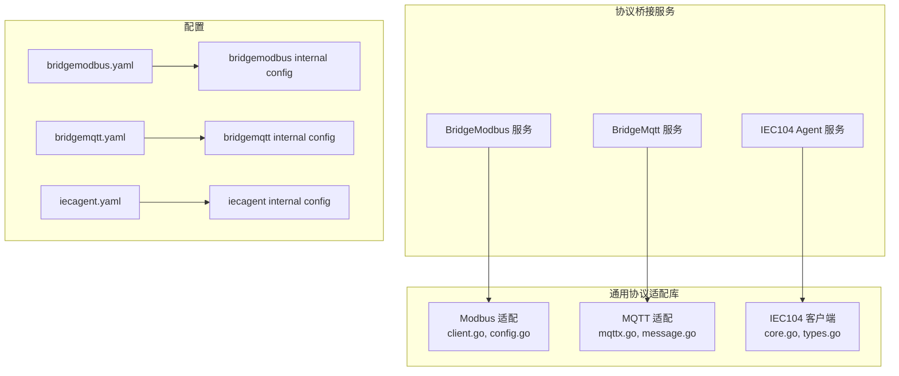
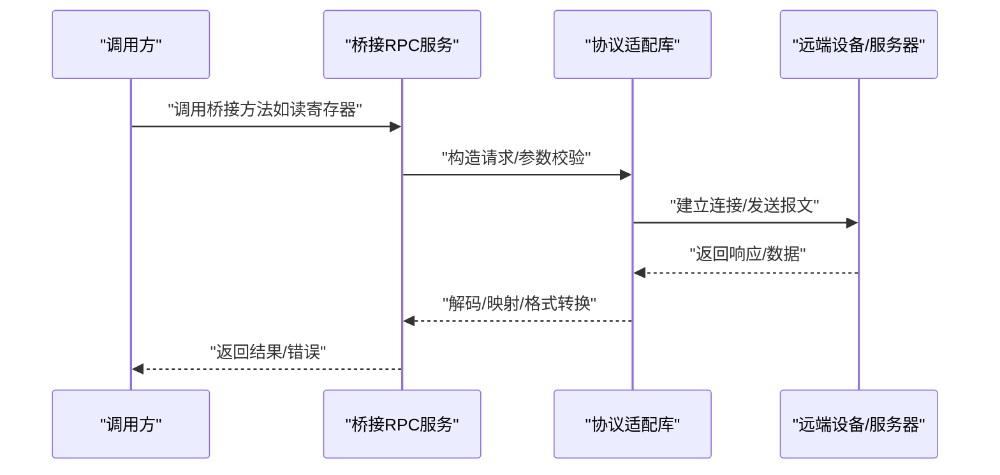
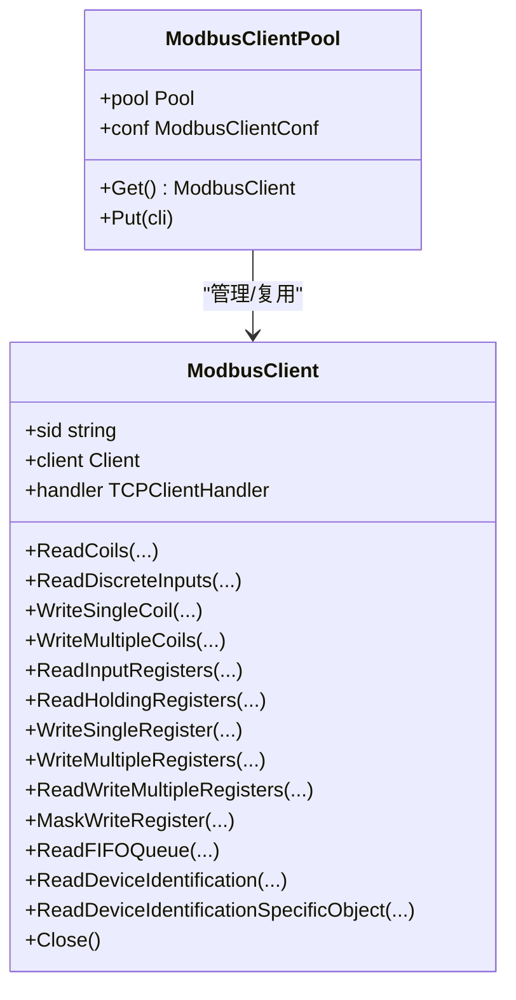
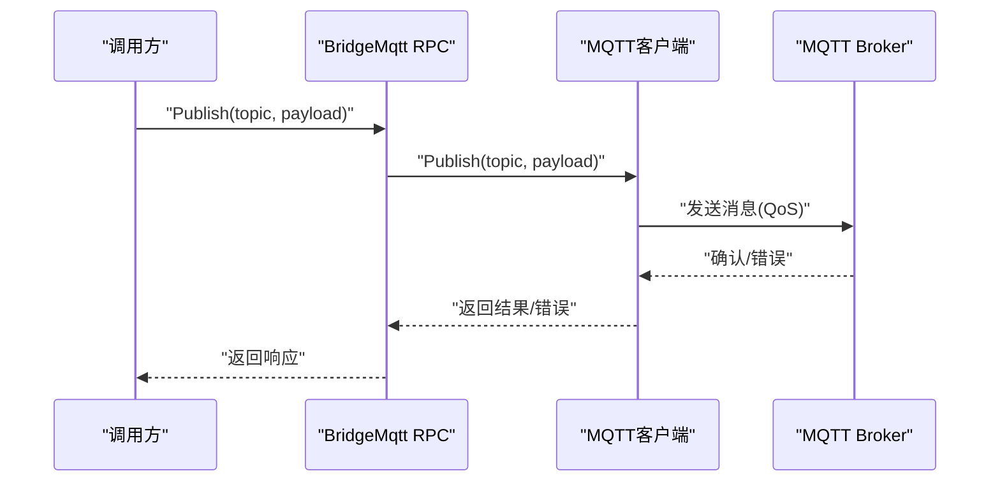
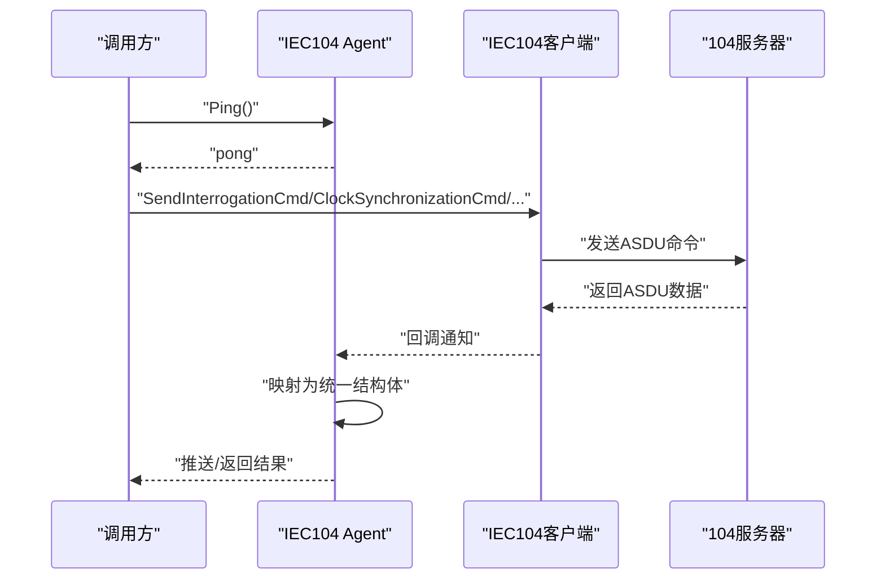
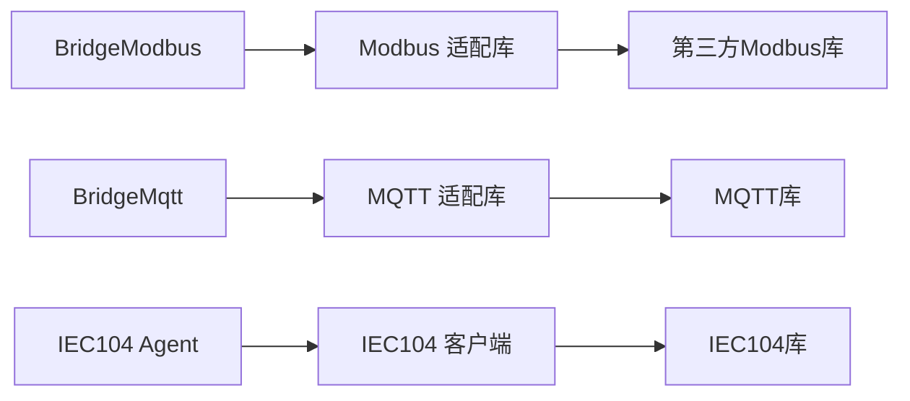

# 协议桥接服务

<cite>
**本文引用的文件**
- [bridgemodbus.proto](file://app/bridgemodbus/bridgemodbus/bridgemodbus.proto)
- [bridgemqtt.proto](file://app/bridgemqtt/bridgemqtt/bridgemqtt.proto)
- [iecagent.proto](file://app/iecagent/iecagent/iecagent.proto)
- [client.go](file://common/modbusx/client.go)
- [config.go](file://common/modbusx/config.go)
- [mqttx.go](file://common/mqttx/mqttx.go)
- [message.go](file://common/mqttx/message.go)
- [core.go](file://common/iec104/client/core.go)
- [types.go](file://common/iec104/types/types.go)
- [bridgemodbus.yaml](file://app/bridgemodbus/etc/bridgemodbus.yaml)
- [bridgemqtt.yaml](file://app/bridgemqtt/etc/bridgemqtt.yaml)
- [iecagent.yaml](file://app/iecagent/etc/iecagent.yaml)
- [config.go](file://app/bridgemodbus/internal/config/config.go)
- [config.go](file://app/bridgemqtt/internal/config/config.go)
- [config.go](file://app/iecagent/internal/config/config.go)
- [clienthandler.go](file://app/ieccaller/internal/iec/clienthandler.go)
</cite>

## 目录
1. [简介](#简介)
2. [项目结构](#项目结构)
3. [核心组件](#核心组件)
4. [架构总览](#架构总览)
5. [详细组件分析](#详细组件分析)
6. [依赖分析](#依赖分析)
7. [性能考量](#性能考量)
8. [故障排查指南](#故障排查指南)
9. [结论](#结论)
10. [附录](#附录)

## 简介
本文件面向Zero-Service中的协议桥接服务，系统性阐述Modbus、MQTT、IEC104三种工业协议的桥接实现原理与技术细节。重点覆盖：
- 架构设计：RPC服务层、协议适配层、连接池与会话管理、数据转换与映射、错误处理与可观测性
- 数据流：请求进入、协议解析、数据映射、格式转换、结果回传
- 最佳实践：性能优化、并发处理、连接池管理、配置与部署要点
- 故障排查：常见问题定位、日志与指标、重连与超时策略

## 项目结构
围绕协议桥接的关键目录与文件：
- 协议定义（proto）：app/*/xxx.proto
- 通用协议适配库：common/modbusx、common/mqttx、common/iec104
- 服务配置：app/*/etc/*.yaml
- 服务配置结构：app/*/internal/config/config.go
- IEC104客户端回调处理：app/ieccaller/internal/iec/clienthandler.go

**图表来源**
- [bridgemodbus.proto:1-83](file://app/bridgemodbus/bridgemodbus/bridgemodbus.proto#L1-L83)
- [bridgemqtt.proto:1-49](file://app/bridgemqtt/bridgemqtt/bridgemqtt.proto#L1-L49)
- [iecagent.proto:1-16](file://app/iecagent/iecagent/iecagent.proto#L1-L16)
- [client.go:1-218](file://common/modbusx/client.go#L1-L218)
- [mqttx.go:1-389](file://common/mqttx/mqttx.go#L1-L389)
- [core.go:1-446](file://common/iec104/client/core.go#L1-L446)
- [bridgemodbus.yaml:1-26](file://app/bridgemodbus/etc/bridgemodbus.yaml#L1-L26)
- [bridgemqtt.yaml:1-48](file://app/bridgemqtt/etc/bridgemqtt.yaml#L1-L48)
- [iecagent.yaml:1-14](file://app/iecagent/etc/iecagent.yaml#L1-L14)

**章节来源**
- [bridgemodbus.yaml:1-26](file://app/bridgemodbus/etc/bridgemodbus.yaml#L1-L26)
- [bridgemqtt.yaml:1-48](file://app/bridgemqtt/etc/bridgemqtt.yaml#L1-L48)
- [iecagent.yaml:1-14](file://app/iecagent/etc/iecagent.yaml#L1-L14)

## 核心组件
- Modbus桥接服务：基于gRPC暴露读写线圈/寄存器、设备标识、批量转换等能力，底层通过Modbus适配库进行TCP/TLS连接与功能码封装。
- MQTT桥接服务：提供发布消息能力，支持带traceId的发布以串联链路追踪，内置自动重连、订阅恢复、QoS与指标统计。
- IEC104代理服务：作为IEC104客户端，负责连接远端104服务器、发送各类命令（总召、读、时钟同步、控制等），并把ASDU数据映射为统一结构体推送。

**章节来源**
- [bridgemodbus.proto:10-83](file://app/bridgemodbus/bridgemodbus/bridgemodbus.proto#L10-L83)
- [bridgemqtt.proto:10-16](file://app/bridgemqtt/bridgemqtt/bridgemqtt.proto#L10-L16)
- [iecagent.proto:14-16](file://app/iecagent/iecagent/iecagent.proto#L14-L16)
- [client.go:20-98](file://common/modbusx/client.go#L20-L98)
- [mqttx.go:76-178](file://common/mqttx/mqttx.go#L76-L178)
- [core.go:48-175](file://common/iec104/client/core.go#L48-L175)

## 架构总览
桥接服务采用“RPC服务 + 通用协议适配库”的分层设计：
- RPC服务层：定义协议方法、参数与响应，负责鉴权、限流、日志与指标上报
- 协议适配层：封装第三方库，提供连接管理、超时控制、TLS、自动重连、QoS、ASDU解析与映射
- 配置与生命周期：通过YAML配置加载，结合Nacos注册/发现（可选），服务启动/停止/重连流程清晰

[此图为概念流程图，无需图表来源]

## 详细组件分析

### Modbus桥接服务
- 服务方法覆盖：配置管理、线圈/离散输入读写、保持寄存器读写、批量写、掩码写、FIFO队列读、设备标识读取、十进制转寄存器格式等
- 适配器特性：ModbusClient封装第三方库，支持TLS、超时、空闲超时、链路/协议恢复、连接延迟；ModbusClientPool提供连接池与资源回收
- 数据转换：提供十进制数值到寄存器格式的批量转换，支持有符号/无符号、十六进制/二进制/字节数组输出
- 错误处理：连接失败、超时、协议异常均有明确返回与日志记录

**图表来源**
- [client.go:20-143](file://common/modbusx/client.go#L20-L143)
- [client.go:145-191](file://common/modbusx/client.go#L145-L191)

**章节来源**
- [bridgemodbus.proto:10-83](file://app/bridgemodbus/bridgemodbus/bridgemodbus.proto#L10-L83)
- [client.go:20-98](file://common/modbusx/client.go#L20-L98)
- [client.go:145-191](file://common/modbusx/client.go#L145-L191)
- [config.go:32-61](file://common/modbusx/config.go#L32-L61)

### MQTT桥接服务
- 服务方法：Ping健康检查、发布消息、带traceId的发布
- 适配器特性：自动重连、订阅恢复、QoS校验与修正、OpenTelemetry链路追踪、指标统计、默认处理器兜底
- 消息封装：支持在消息中嵌套Payload与Headers，便于跨系统传递上下文
- 错误处理：连接断开、订阅/发布超时、无处理器时的默认处理与日志记录

**图表来源**
- [bridgemqtt.proto:10-16](file://app/bridgemqtt/bridgemqtt/bridgemqtt.proto#L10-L16)
- [mqttx.go:309-333](file://common/mqttx/mqttx.go#L309-L333)
- [mqttx.go:180-255](file://common/mqttx/mqttx.go#L180-L255)

**章节来源**
- [bridgemqtt.proto:10-16](file://app/bridgemqtt/bridgemqtt/bridgemqtt.proto#L10-L16)
- [mqttx.go:76-178](file://common/mqttx/mqttx.go#L76-L178)
- [mqttx.go:180-255](file://common/mqttx/mqttx.go#L180-L255)
- [message.go:3-30](file://common/mqttx/message.go#L3-L30)

### IEC104桥接服务
- 服务方法：Ping健康检查（Agent）
- 客户端能力：连接/断开、自动重连、发送总召、计数器召唤、读命令、时钟同步、复位进程、测试命令、各类控制命令
- 数据映射：将ASDU解析为统一结构体（单点、双点、测量值、步位置、位串、累加量、保护事件等），并携带QDS描述与时间戳
- 并发处理：使用任务调度器对不同ASDU类型进行异步处理，保证高吞吐

**图表来源**
- [iecagent.proto:14-16](file://app/iecagent/iecagent/iecagent.proto#L14-L16)
- [core.go:182-231](file://common/iec104/client/core.go#L182-L231)
- [core.go:304-436](file://common/iec104/client/core.go#L304-L436)
- [clienthandler.go:94-140](file://app/ieccaller/internal/iec/clienthandler.go#L94-L140)

**章节来源**
- [iecagent.proto:14-16](file://app/iecagent/iecagent/iecagent.proto#L14-L16)
- [core.go:48-175](file://common/iec104/client/core.go#L48-L175)
- [types.go:17-58](file://common/iec104/types/types.go#L17-L58)
- [clienthandler.go:94-140](file://app/ieccaller/internal/iec/clienthandler.go#L94-L140)

## 依赖分析
- Modbus桥接服务依赖Modbus适配库，后者依赖第三方modbus库与Go-Zero工具集
- MQTT桥接服务依赖MQTT客户端库、OpenTelemetry、Go-Zero统计与追踪
- IEC104桥接服务依赖IEC104客户端库、ASDU解析与Go-Zero统计

**图表来源**
- [client.go:1-18](file://common/modbusx/client.go#L1-L18)
- [mqttx.go:3-23](file://common/mqttx/mqttx.go#L3-L23)
- [core.go:3-17](file://common/iec104/client/core.go#L3-L17)

**章节来源**
- [client.go:1-18](file://common/modbusx/client.go#L1-L18)
- [mqttx.go:3-23](file://common/mqttx/mqttx.go#L3-L23)
- [core.go:3-17](file://common/iec104/client/core.go#L3-L17)

## 性能考量
- 连接池与复用
  - Modbus：通过ModbusClientPool按modbusCode维度管理连接池，支持最大空闲时间回收，降低频繁建连成本
  - MQTT：自动重连与订阅恢复，避免网络抖动导致的数据丢失
- 并发与异步
  - IEC104：使用任务调度器对不同类型ASDU异步处理，提升吞吐
- 超时与重试
  - Modbus：支持超时、空闲超时、链路/协议恢复超时，避免阻塞
  - MQTT：操作超时、心跳保活，确保连接可用性
- 指标与追踪
  - MQTT：内置指标统计与OpenTelemetry链路追踪，便于性能分析与问题定位

**章节来源**
- [client.go:145-191](file://common/modbusx/client.go#L145-L191)
- [config.go:63-125](file://common/modbusx/config.go#L63-L125)
- [mqttx.go:137-178](file://common/mqttx/mqttx.go#L137-L178)
- [core.go:149-180](file://common/iec104/client/core.go#L149-L180)

## 故障排查指南
- Modbus
  - 症状：读写失败、超时
  - 排查：检查配置中的Address/Slave/Timeout/IdleTimeout；查看连接日志与会话ID；确认TLS证书配置正确
  - 参考
    - [bridgemodbus.yaml:23-26](file://app/bridgemodbus/etc/bridgemodbus.yaml#L23-L26)
    - [client.go:107-143](file://common/modbusx/client.go#L107-L143)
    - [client.go:193-217](file://common/modbusx/client.go#L193-L217)
- MQTT
  - 症状：无法连接、订阅失败、发布超时
  - 排查：确认Broker地址、认证信息、QoS设置；查看连接丢失回调与订阅恢复日志；检查消息负载与处理器注册
  - 参考
    - [bridgemqtt.yaml:20-29](file://app/bridgemqtt/etc/bridgemqtt.yaml#L20-L29)
    - [mqttx.go:137-178](file://common/mqttx/mqttx.go#L137-L178)
    - [mqttx.go:215-255](file://common/mqttx/mqttx.go#L215-L255)
- IEC104
  - 症状：连接不上、无数据、命令无响应
  - 排查：核对Host/Port/LogMode；关注连接事件回调；检查ASDU类型映射与任务调度
  - 参考
    - [iecagent.yaml:10-14](file://app/iecagent/etc/iecagent.yaml#L10-L14)
    - [core.go:120-147](file://common/iec104/client/core.go#L120-L147)
    - [clienthandler.go:94-140](file://app/ieccaller/internal/iec/clienthandler.go#L94-L140)

**章节来源**
- [bridgemodbus.yaml:23-26](file://app/bridgemodbus/etc/bridgemodbus.yaml#L23-L26)
- [bridgemqtt.yaml:20-29](file://app/bridgemqtt/etc/bridgemqtt.yaml#L20-L29)
- [iecagent.yaml:10-14](file://app/iecagent/etc/iecagent.yaml#L10-L14)
- [client.go:107-143](file://common/modbusx/client.go#L107-L143)
- [mqttx.go:137-178](file://common/mqttx/mqttx.go#L137-L178)
- [core.go:120-147](file://common/iec104/client/core.go#L120-L147)
- [clienthandler.go:94-140](file://app/ieccaller/internal/iec/clienthandler.go#L94-L140)

## 结论
Zero-Service的协议桥接服务通过清晰的分层设计与通用适配库，实现了Modbus、MQTT、IEC104的稳定桥接。其关键优势在于：
- 明确的协议解析与数据映射机制
- 完善的连接管理与错误处理策略
- 可观测性与性能优化手段齐备
建议在生产环境中结合配置文件与日志指标持续监控，并根据业务规模调整连接池大小与并发策略。

## 附录
- 配置示例路径
  - [bridgemodbus.yaml:1-26](file://app/bridgemodbus/etc/bridgemodbus.yaml#L1-L26)
  - [bridgemqtt.yaml:1-48](file://app/bridgemqtt/etc/bridgemqtt.yaml#L1-L48)
  - [iecagent.yaml:1-14](file://app/iecagent/etc/iecagent.yaml#L1-L14)
- 服务配置结构
  - [bridgemodbus internal config:9-25](file://app/bridgemodbus/internal/config/config.go#L9-L25)
  - [bridgemqtt internal config:9-23](file://app/bridgemqtt/internal/config/config.go#L9-L23)
  - [iecagent internal config:5-13](file://app/iecagent/internal/config/config.go#L5-L13)
- 协议定义
  - [bridgemodbus.proto:1-83](file://app/bridgemodbus/bridgemodbus/bridgemodbus.proto#L1-L83)
  - [bridgemqtt.proto:1-49](file://app/bridgemqtt/bridgemqtt/bridgemqtt.proto#L1-L49)
  - [iecagent.proto:1-16](file://app/iecagent/iecagent/iecagent.proto#L1-L16)
- 类型与映射
  - [IEC104 types:17-323](file://common/iec104/types/types.go#L17-L323)