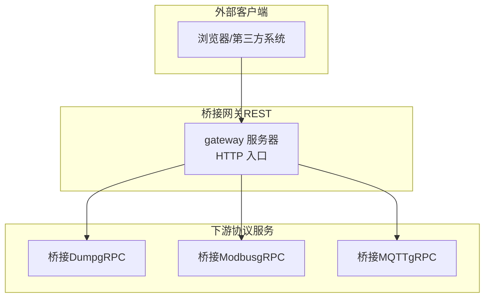
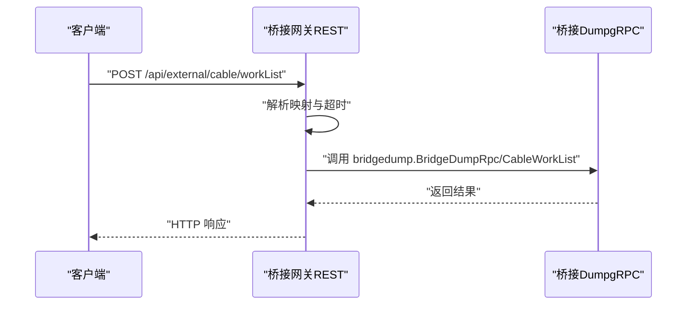
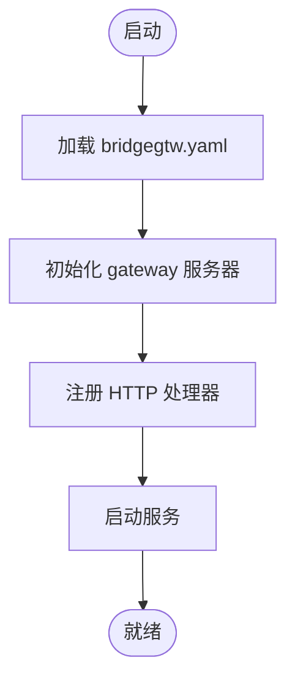
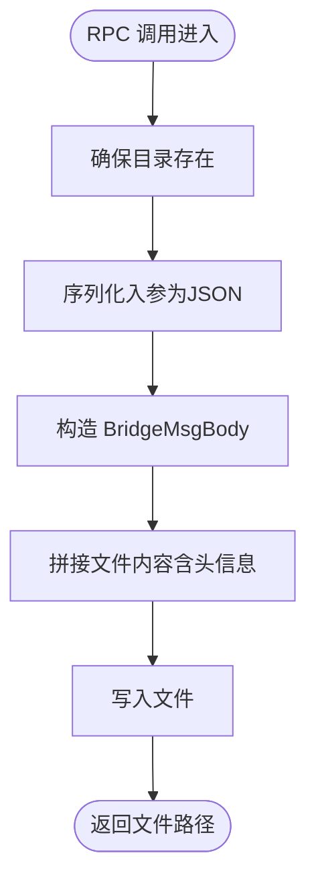
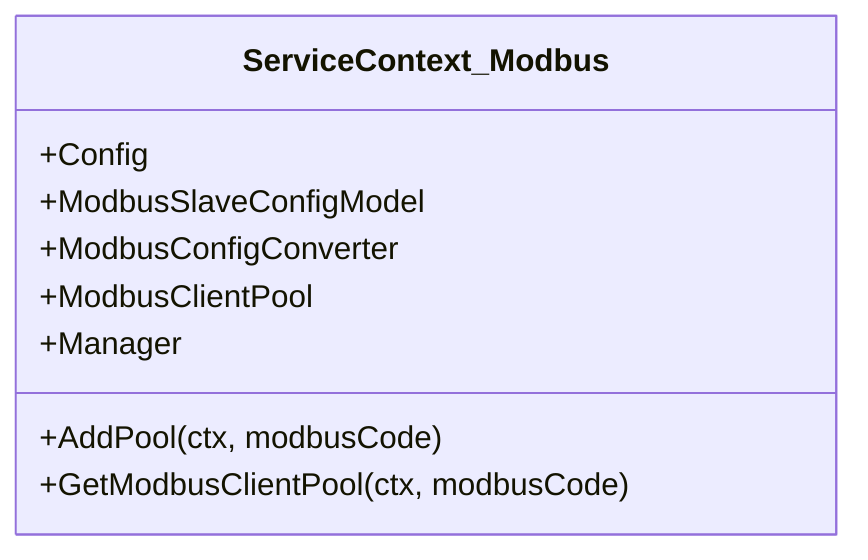
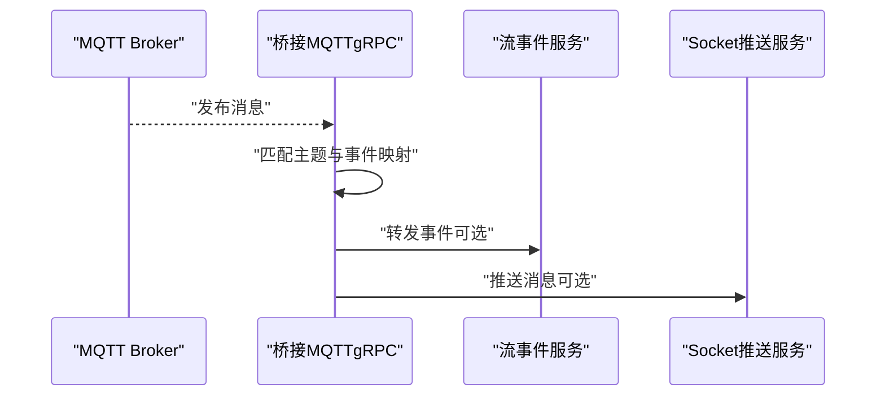
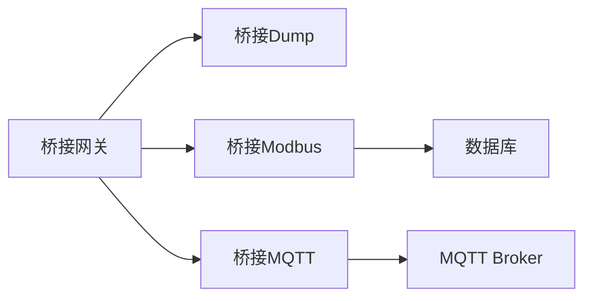

# 桥接网关服务

<cite>
**本文引用的文件**
- [app/bridgegtw/bridgegtw.go](file://app/bridgegtw/bridgegtw.go)
- [app/bridgegtw/etc/bridgegtw.yaml](file://app/bridgegtw/etc/bridgegtw.yaml)
- [app/bridgegtw/internal/config/config.go](file://app/bridgegtw/internal/config/config.go)
- [app/bridgegtw/internal/svc/servicecontext.go](file://app/bridgegtw/internal/svc/servicecontext.go)
- [app/bridgedump/bridgedump.go](file://app/bridgedump/bridgedump.go)
- [app/bridgedump/etc/bridgedump.yaml](file://app/bridgedump/etc/bridgedump.yaml)
- [app/bridgedump/internal/config/config.go](file://app/bridgedump/internal/config/config.go)
- [app/bridgedump/internal/svc/servicecontext.go](file://app/bridgedump/internal/svc/servicecontext.go)
- [app/bridgemodbus/bridgemodbus.go](file://app/bridgemodbus/bridgemodbus.go)
- [app/bridgemodbus/etc/bridgemodbus.yaml](file://app/bridgemodbus/etc/bridgemodbus.yaml)
- [app/bridgemodbus/internal/config/config.go](file://app/bridgemodbus/internal/config/config.go)
- [app/bridgemodbus/internal/svc/servicecontext.go](file://app/bridgemodbus/internal/svc/servicecontext.go)
- [app/bridgemqtt/bridgemqtt.go](file://app/bridgemqtt/bridgemqtt.go)
- [app/bridgemqtt/etc/bridgemqtt.yaml](file://app/bridgemqtt/etc/bridgemqtt.yaml)
- [app/bridgemqtt/internal/config/config.go](file://app/bridgemqtt/internal/config/config.go)
- [app/bridgemqtt/internal/svc/servicecontext.go](file://app/bridgemqtt/internal/svc/servicecontext.go)
</cite>

## 目录
1. [简介](#简介)
2. [项目结构](#项目结构)
3. [核心组件](#核心组件)
4. [架构总览](#架构总览)
5. [详细组件分析](#详细组件分析)
6. [依赖分析](#依赖分析)
7. [性能考虑](#性能考虑)
8. [故障排查指南](#故障排查指南)
9. [结论](#结论)
10. [附录](#附录)

## 简介
本文件面向Zero-Service中的“桥接网关服务”，系统性阐述其架构设计与实现细节，重点覆盖以下方面：
- 协议转换：REST到gRPC的桥接转发与映射
- 数据聚合：多上游协议服务的统一入口与路由
- 流量控制：超时、并发与非阻塞调用策略
- 与协议服务的交互：请求转发、响应处理、错误传播
- 桥接Dump服务的数据采集与存储：原始数据捕获、格式转换、持久化
- 配置示例与部署指南：负载均衡、高可用、监控告警
- 性能优化建议与故障诊断方法

## 项目结构
桥接网关服务由四个主要模块组成：
- 桥接网关（REST）：对外提供HTTP接口，内部通过go-zero gateway桥接到下游gRPC服务
- 桥接Dump（gRPC）：负责桥接数据的采集、格式化与落盘
- 桥接Modbus（gRPC）：提供Modbus协议读写能力，并维护连接池与动态池管理
- 桥接MQTT（gRPC）：订阅MQTT主题并将事件转发至流事件与Socket推送服务

图表来源
- [app/bridgegtw/bridgegtw.go:28-38](file://app/bridgegtw/bridgegtw.go#L28-L38)
- [app/bridgegtw/etc/bridgegtw.yaml:25-40](file://app/bridgegtw/etc/bridgegtw.yaml#L25-L40)
- [app/bridgedump/bridgedump.go:34-35](file://app/bridgedump/bridgedump.go#L34-L35)
- [app/bridgemodbus/bridgemodbus.go:38-39](file://app/bridgemodbus/bridgemodbus.go#L38-L39)
- [app/bridgemqtt/bridgemqtt.go:39-40](file://app/bridgemqtt/bridgemqtt.go#L39-L40)

章节来源
- [app/bridgegtw/bridgegtw.go:19-42](file://app/bridgegtw/bridgegtw.go#L19-L42)
- [app/bridgegtw/etc/bridgegtw.yaml:1-40](file://app/bridgegtw/etc/bridgegtw.yaml#L1-L40)

## 核心组件
- 桥接网关（REST）
  - 基于go-zero gateway，加载HTTP配置并注册路由映射
  - 将HTTP请求桥接至下游gRPC服务，支持非阻塞调用与超时控制
- 桥接Dump（gRPC）
  - 提供CableWorkList、CableFault、CableFaultWave等RPC接口
  - 负责将入参序列化为特定格式并落盘，生成带时间戳与TraceID的文件
- 桥接Modbus（gRPC）
  - 维护Modbus连接池与动态池管理，按设备编码选择对应连接池
  - 提供批量读写、寄存器转换等业务逻辑
- 桥接MQTT（gRPC）
  - 订阅MQTT主题，将消息事件转发给流事件与Socket推送服务
  - 支持Nacos注册与拦截器注入

章节来源
- [app/bridgegtw/internal/config/config.go:5-7](file://app/bridgegtw/internal/config/config.go#L5-L7)
- [app/bridgedump/internal/config/config.go:5-8](file://app/bridgedump/internal/config/config.go#L5-L8)
- [app/bridgemodbus/internal/config/config.go:9-25](file://app/bridgemodbus/internal/config/config.go#L9-L25)
- [app/bridgemqtt/internal/config/config.go:9-23](file://app/bridgemqtt/internal/config/config.go#L9-L23)

## 架构总览
桥接网关作为统一入口，将HTTP请求映射到对应的gRPC服务。每个gRPC服务独立运行，具备自身配置、日志与可选的服务注册能力。

图表来源
- [app/bridgegtw/etc/bridgegtw.yaml:32-34](file://app/bridgegtw/etc/bridgegtw.yaml#L32-L34)
- [app/bridgegtw/bridgegtw.go:28-38](file://app/bridgegtw/bridgegtw.go#L28-L38)
- [app/bridgedump/bridgedump.go:34-35](file://app/bridgedump/bridgedump.go#L34-L35)

## 详细组件分析

### 桥接网关（REST）分析
- 启动流程
  - 解析命令行参数加载配置
  - 初始化gateway服务器并注入中间件
  - 注册HTTP处理器并启动服务
- 关键点
  - Upstreams中配置grpc端点与ProtoSets
  - Mappings定义HTTP方法、路径与RPC方法的映射关系
  - 非阻塞调用（NonBlock）提升吞吐
  - 超时（Timeout）保障稳定性

图表来源
- [app/bridgegtw/bridgegtw.go:22-41](file://app/bridgegtw/bridgegtw.go#L22-L41)
- [app/bridgegtw/etc/bridgegtw.yaml:12-40](file://app/bridgegtw/etc/bridgegtw.yaml#L12-L40)

章节来源
- [app/bridgegtw/bridgegtw.go:19-42](file://app/bridgegtw/bridgegtw.go#L19-L42)
- [app/bridgegtw/etc/bridgegtw.yaml:1-40](file://app/bridgegtw/etc/bridgegtw.yaml#L1-L40)
- [app/bridgegtw/internal/config/config.go:5-7](file://app/bridgegtw/internal/config/config.go#L5-L7)
- [app/bridgegtw/internal/svc/servicecontext.go:7-15](file://app/bridgegtw/internal/svc/servicecontext.go#L7-L15)

### 桥接Dump（gRPC）分析
- 功能职责
  - 接收来自网关的RPC调用
  - 将入参序列化为JSON并包装为BridgeMsgBody
  - 生成带TraceID与时间戳的文件名，写入指定目录
  - 返回写入文件的绝对路径
- 关键点
  - DumpPath在配置中定义
  - 文件内容包含固定头信息与JSON体，便于解析与审计
  - 使用trace上下文保证链路追踪一致性

图表来源
- [app/bridgedump/internal/svc/servicecontext.go:26-64](file://app/bridgedump/internal/svc/servicecontext.go#L26-L64)
- [app/bridgedump/etc/bridgedump.yaml:9](file://app/bridgedump/etc/bridgedump.yaml#L9)

章节来源
- [app/bridgedump/bridgedump.go:23-45](file://app/bridgedump/bridgedump.go#L23-L45)
- [app/bridgedump/etc/bridgedump.yaml:1-10](file://app/bridgedump/etc/bridgedump.yaml#L1-L10)
- [app/bridgedump/internal/config/config.go:5-8](file://app/bridgedump/internal/config/config.go#L5-L8)
- [app/bridgedump/internal/svc/servicecontext.go:16-64](file://app/bridgedump/internal/svc/servicecontext.go#L16-L64)

### 桥接Modbus（gRPC）分析
- 功能职责
  - 维护默认Modbus连接池与动态池管理器
  - 根据设备编码查询配置并创建专用连接池
  - 提供读写、批量操作与寄存器转换等能力
- 关键点
  - ModbusPool控制连接池大小
  - Nacos注册可选开启
  - 错误通过扩展错误码返回，便于上层处理

图表来源
- [app/bridgemodbus/internal/svc/servicecontext.go:14-80](file://app/bridgemodbus/internal/svc/servicecontext.go#L14-L80)

章节来源
- [app/bridgemodbus/bridgemodbus.go:27-70](file://app/bridgemodbus/bridgemodbus.go#L27-L70)
- [app/bridgemodbus/etc/bridgemodbus.yaml:1-26](file://app/bridgemodbus/etc/bridgemodbus.yaml#L1-L26)
- [app/bridgemodbus/internal/config/config.go:9-25](file://app/bridgemodbus/internal/config/config.go#L9-L25)
- [app/bridgemodbus/internal/svc/servicecontext.go:22-80](file://app/bridgemodbus/internal/svc/servicecontext.go#L22-L80)

### 桥接MQTT（gRPC）分析
- 功能职责
  - 订阅MQTT主题，将消息事件转发给流事件与Socket推送服务
  - 支持Nacos注册与元数据拦截器
  - 设置gRPC调用的最大消息尺寸以适配大包
- 关键点
  - StreamEventConf与SocketPushConf可配置下游RPC目标
  - OnReady回调中注册主题处理器
  - 事件映射与默认事件可配置

图表来源
- [app/bridgemqtt/internal/svc/servicecontext.go:23-55](file://app/bridgemqtt/internal/svc/servicecontext.go#L23-L55)
- [app/bridgemqtt/etc/bridgemqtt.yaml:35-47](file://app/bridgemqtt/etc/bridgemqtt.yaml#L35-L47)

章节来源
- [app/bridgemqtt/bridgemqtt.go:28-71](file://app/bridgemqtt/bridgemqtt.go#L28-L71)
- [app/bridgemqtt/etc/bridgemqtt.yaml:1-48](file://app/bridgemqtt/etc/bridgemqtt.yaml#L1-L48)
- [app/bridgemqtt/internal/config/config.go:9-23](file://app/bridgemqtt/internal/config/config.go#L9-L23)
- [app/bridgemqtt/internal/svc/servicecontext.go:16-60](file://app/bridgemqtt/internal/svc/servicecontext.go#L16-L60)

## 依赖分析
- 模块间耦合
  - 桥接网关仅依赖下游gRPC服务的Proto定义与端点
  - 桥接Dump不依赖其他协议服务，专注数据落盘
  - 桥接Modbus与桥接MQTT各自独立，分别依赖数据库与MQTT Broker
- 外部依赖
  - go-zero gateway、zrpc、grpc
  - Nacos（可选）、MQTT Broker、数据库（可选）

图表来源
- [app/bridgegtw/etc/bridgegtw.yaml:25-40](file://app/bridgegtw/etc/bridgegtw.yaml#L25-L40)
- [app/bridgemodbus/etc/bridgemodbus.yaml:20-25](file://app/bridgemodbus/etc/bridgemodbus.yaml#L20-L25)
- [app/bridgemqtt/etc/bridgemqtt.yaml:20-29](file://app/bridgemqtt/etc/bridgemqtt.yaml#L20-L29)

章节来源
- [app/bridgegtw/etc/bridgegtw.yaml:12-40](file://app/bridgegtw/etc/bridgegtw.yaml#L12-L40)
- [app/bridgemodbus/etc/bridgemodbus.yaml:1-26](file://app/bridgemodbus/etc/bridgemodbus.yaml#L1-L26)
- [app/bridgemqtt/etc/bridgemqtt.yaml:1-48](file://app/bridgemqtt/etc/bridgemqtt.yaml#L1-L48)

## 性能考虑
- 超时与并发
  - 网关侧设置合理超时，避免慢请求拖垮整体
  - 使用非阻塞调用（NonBlock）提升并发处理能力
- 连接池与资源复用
  - Modbus连接池大小（ModbusPool）需结合设备数量与并发需求调优
  - gRPC调用最大消息尺寸（MaxCallSendMsgSize）根据实际报文大小调整
- 存储与I/O
  - Dump文件写入采用顺序写与固定头封装，减少解析开销
  - 建议将DumpPath指向高性能磁盘或SSD
- 日志与追踪
  - TraceID贯穿落盘与RPC调用，便于问题定位
  - 日志级别与保留天数按环境配置，平衡可观测性与存储成本

## 故障排查指南
- 网关无法访问下游
  - 检查Upstreams端点是否可达，确认ProtoSets与RPC路径一致
  - 查看网关日志与超时配置
- Dump未落盘
  - 确认DumpPath目录权限与空间
  - 检查入参序列化是否成功，查看返回的文件路径
- Modbus连接异常
  - 核对设备编码与配置状态，确认动态池创建成功
  - 检查Modbus地址与从站号配置
- MQTT事件未转发
  - 确认订阅主题与事件映射配置
  - 检查流事件与Socket推送服务的RPC端点配置

章节来源
- [app/bridgegtw/etc/bridgegtw.yaml:12-40](file://app/bridgegtw/etc/bridgegtw.yaml#L12-L40)
- [app/bridgedump/etc/bridgedump.yaml:9](file://app/bridgedump/etc/bridgedump.yaml#L9)
- [app/bridgemodbus/etc/bridgemodbus.yaml:20-25](file://app/bridgemodbus/etc/bridgemodbus.yaml#L20-L25)
- [app/bridgemqtt/etc/bridgemqtt.yaml:35-47](file://app/bridgemqtt/etc/bridgemqtt.yaml#L35-L47)

## 结论
桥接网关服务通过REST到gRPC的桥接，实现了多协议服务的统一接入与治理。桥接Dump专注于数据采集与落盘，桥接Modbus与桥接MQTT分别承担协议适配与事件分发职责。通过合理的超时、并发与存储策略，以及完善的日志与追踪，可在生产环境中实现稳定、可观测与可扩展的桥接能力。

## 附录

### 配置示例与部署指南
- 桥接网关（bridgegtw）
  - 配置项要点：Host、Port、Upstreams.grpc.Endpoints、Mappings、Timeout、ProtoSets
  - 建议：将ProtoSets指向桥接Dump的pb文件；为不同RPC路径配置清晰的Method与Path映射
- 桥接Dump（bridgedump）
  - 配置项要点：ListenOn、DumpPath、日志配置
  - 建议：DumpPath指向有充足空间的挂载点；定期清理旧文件
- 桥接Modbus（bridgemodbus）
  - 配置项要点：ListenOn、ModbusPool、DB.DataSource、ModbusClientConf.Address/Slave、NacosConfig
  - 建议：根据设备规模调整ModbusPool；启用Nacos注册便于服务发现
- 桥接MQTT（bridgemqtt）
  - 配置项要点：ListenOn、MqttConfig.Broker/Username/Password/SubscribeTopics、StreamEventConf/SocketPushConf
  - 建议：为大包场景设置合适的gRPC最大消息尺寸；按需启用Nacos注册

章节来源
- [app/bridgegtw/etc/bridgegtw.yaml:1-40](file://app/bridgegtw/etc/bridgegtw.yaml#L1-L40)
- [app/bridgedump/etc/bridgedump.yaml:1-10](file://app/bridgedump/etc/bridgedump.yaml#L1-L10)
- [app/bridgemodbus/etc/bridgemodbus.yaml:1-26](file://app/bridgemodbus/etc/bridgemodbus.yaml#L1-L26)
- [app/bridgemqtt/etc/bridgemqtt.yaml:1-48](file://app/bridgemqtt/etc/bridgemqtt.yaml#L1-L48)

### 运维要点
- 负载均衡
  - 网关层可横向扩展，结合反向代理或云负载均衡
  - 下游gRPC服务可多实例部署，配合Nacos进行服务发现
- 高可用
  - 网关与下游服务均配置健康检查与自动重启
  - 关键存储（DumpPath）采用冗余与备份策略
- 监控告警
  - 开启日志采集与指标上报，关注延迟、错误率与队列长度
  - 对MQTT订阅与Modbus连接池使用情况进行周期性巡检