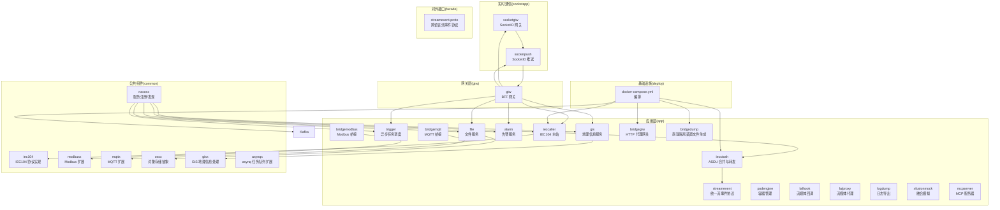
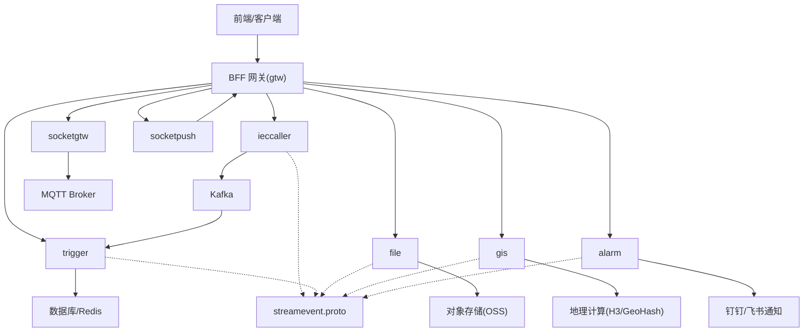
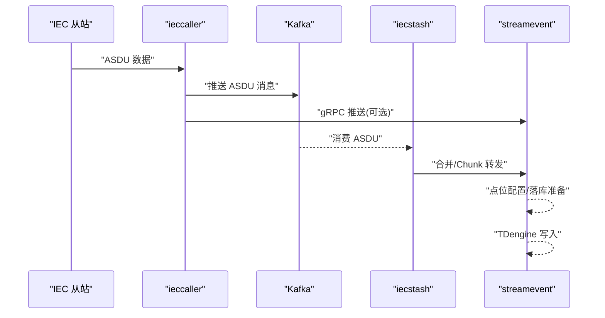
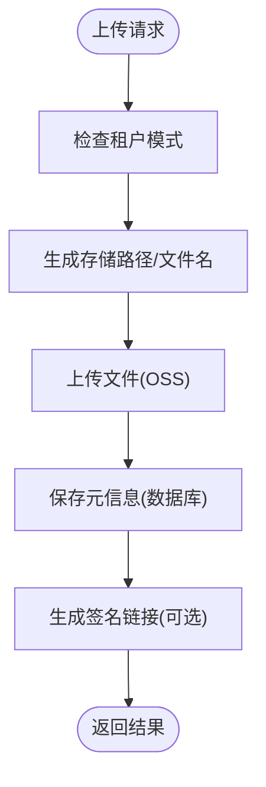
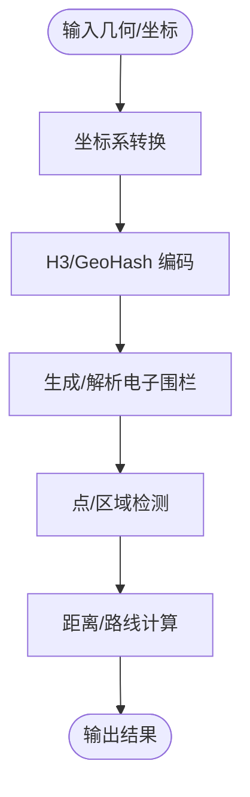
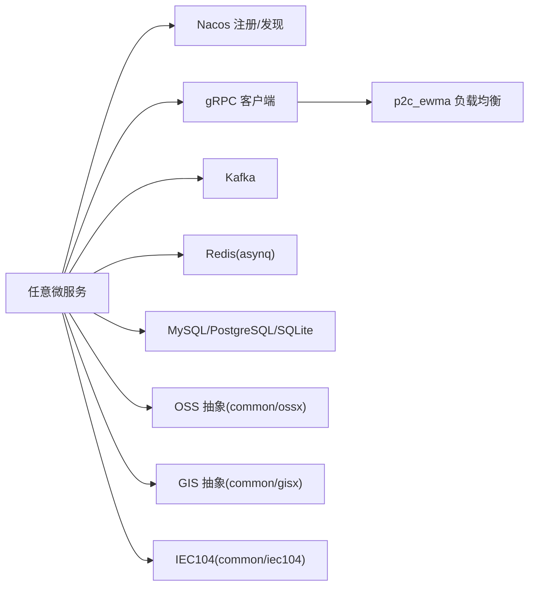

# 微服务拆分设计

<cite>
**本文引用的文件**
- [README.md](file://README.md)
- [go.mod](file://go.mod)
- [app/ieccaller/etc/ieccaller.yaml](file://app/ieccaller/etc/ieccaller.yaml)
- [app/trigger/etc/trigger.yaml](file://app/trigger/etc/trigger.yaml)
- [app/file/etc/file.yaml](file://app/file/etc/file.yaml)
- [app/gis/etc/gis.yaml](file://app/gis/etc/gis.yaml)
- [app/alarm/etc/alarm.yaml](file://app/alarm/etc/alarm.yaml)
- [common/nacosx/config.go](file://common/nacosx/config.go)
- [common/iec104/types/types.go](file://common/iec104/types/types.go)
- [common/gisx/gisx.go](file://common/gisx/gisx.go)
- [common/ossx/ossx.go](file://common/ossx/ossx.go)
- [facade/streamevent/streamevent.go](file://facade/streamevent/streamevent.go)
- [.trae/skills/zero-skills/references/rpc-patterns.md](file://.trae/skills/zero-skills/references/rpc-patterns.md)
- [.trae/skills/zero-skills/references/resilience-patterns.md](file://.trae/skills/zero-skills/references/resilience-patterns.md)
- [deploy/docker-compose.yml](file://deploy/docker-compose.yml)
</cite>

## 目录
1. [引言](#引言)
2. [项目结构](#项目结构)
3. [核心组件](#核心组件)
4. [架构总览](#架构总览)
5. [详细组件分析](#详细组件分析)
6. [依赖分析](#依赖分析)
7. [性能考虑](#性能考虑)
8. [故障排查指南](#故障排查指南)
9. [结论](#结论)
10. [附录](#附录)

## 引言
本设计文档围绕 Zero-Service 的微服务拆分进行系统化梳理，目标是：
- 明确拆分原则与策略：基于业务领域垂直拆分、基于技术栈水平拆分、以及混合拆分模式
- 明确各微服务的职责边界与业务范围：IEC104 数采平台、文件服务、GIS 服务、告警服务等
- 控制服务间依赖与耦合度，平衡服务粒度，避免过度拆分与服务膨胀
- 提供服务治理策略的设计思路：服务发现、负载均衡、熔断降级、限流与超时
- 总结最佳实践与常见陷阱，指导后续演进与运维

## 项目结构
项目采用“按领域分层”的组织方式，核心微服务集中在 app/ 目录，公共能力沉淀在 common/，对外统一入口在 facade/ 与 gtw/，并通过 swagger 提供 API 文档。

图表来源
- [README.md:15-108](file://README.md#L15-L108)
- [deploy/docker-compose.yml:1-110](file://deploy/docker-compose.yml#L1-L110)

章节来源
- [README.md:59-108](file://README.md#L59-L108)
- [deploy/docker-compose.yml:1-110](file://deploy/docker-compose.yml#L1-L110)

## 核心组件
- IEC104 数采平台：由 ieccaller、iecstash、streamevent 三服务协同，完成从站采集、Kafka/MQTT/gRPC 推送、ASDU 合并与落库。
- 异步任务调度：trigger 服务结合 asynq 与数据库实现分布式任务队列与计划任务管理。
- 实时通信：socketgtw + socketpush 提供 SocketIO 网关与推送能力，并支持 MQTT 桥接。
- 文件服务：file 服务提供分片流上传、OSS 集成与视频流捕获。
- 地理信息服务：gis 服务提供 H3/GeoHash/围栏/坐标转换等地理计算能力。
- 告警服务：alarm 服务提供多级告警与第三方通知集成。
- 协议桥接：bridgemodbus、bridgemqtt、bridgegtw、bridgedump 提供多协议接入与文件生成。
- 容器管理：podengine 提供 Docker 容器生命周期管理与资源统计。
- 对外接口：facade/streamevent 提供统一的跨语言流事件协议。

章节来源
- [README.md:112-206](file://README.md#L112-L206)
- [go.mod:5-62](file://go.mod#L5-L62)

## 架构总览
整体架构采用“BFF 网关 + 多 gRPC 微服务 + 外部协议/中间件”的模式。BFF 网关负责统一入口、鉴权与聚合；各微服务通过 gRPC 交互；IEC104 数采平台通过 Kafka/MQTT/gRPC 与 streamevent 协作；实时通信模块通过 SocketIO 与 MQTT 桥接；公共组件提供协议与基础设施能力。

图表来源
- [README.md:15-51](file://README.md#L15-L51)
- [README.md:112-206](file://README.md#L112-L206)
- [facade/streamevent/streamevent.go:28-71](file://facade/streamevent/streamevent.go#L28-L71)

章节来源
- [README.md:15-51](file://README.md#L15-L51)
- [README.md:112-206](file://README.md#L112-L206)
- [facade/streamevent/streamevent.go:28-71](file://facade/streamevent/streamevent.go#L28-L71)

## 详细组件分析

### IEC104 数采平台
- 职责边界
  - ieccaller：IEC 104 主站，负责与从站通信、Kafka/MQTT/gRPC 推送、动态配置与弱校验模式。
  - iecstash：Kafka 消费、ASDU 压缩合并、Chunk 批量处理、下游 RPC 转发。
  - streamevent：统一流事件协议，接收多源消息（MQTT/WebSocket/Kafka），对接 TDengine 等。
- 数据流
  - IEC 从站 → ieccaller → Kafka → iecstash → streamevent → TDengine
  - 同时支持 MQTT/gRPC 三通道推送，便于与不同系统对接。
- 配置要点
  - ieccaller.yaml 中包含 IEC 从站配置、Kafka/MQTT 推送配置、StreamEvent 目标端点、批大小与优雅退出周期等。
  - trigger.yaml 中包含 Redis/DB/StreamEvent 等配置，体现跨服务协作。
- 复杂度与性能
  - ASDU 类型丰富，支持多种信息体类型，需关注序列化/反序列化与批处理优化。
  - Kafka 作为缓冲层，需合理设置分区与副本，保障吞吐与可靠性。

图表来源
- [README.md:112-131](file://README.md#L112-L131)
- [app/ieccaller/etc/ieccaller.yaml:22-79](file://app/ieccaller/etc/ieccaller.yaml#L22-L79)
- [app/trigger/etc/trigger.yaml:29-37](file://app/trigger/etc/trigger.yaml#L29-L37)

章节来源
- [README.md:112-131](file://README.md#L112-L131)
- [app/ieccaller/etc/ieccaller.yaml:22-79](file://app/ieccaller/etc/ieccaller.yaml#L22-L79)
- [app/trigger/etc/trigger.yaml:29-37](file://app/trigger/etc/trigger.yaml#L29-L37)
- [common/iec104/types/types.go:11-323](file://common/iec104/types/types.go#L11-L323)

### 文件服务(file)
- 职责边界：提供 gRPC 分片流上传、OSS 集成（MinIO/阿里OSS/腾讯COS）、视频流捕获与签名链接生成。
- 关键能力：租户模式、并发任务控制、文件元数据与链接管理。
- 配置要点：Nacos 注册、OSS 参数、数据库连接、并发度等。
- 依赖与耦合：通过 common/ossx 抽象对象存储，降低具体厂商耦合；与数据库交互用于记录文件元信息。

图表来源
- [app/file/etc/file.yaml:9-23](file://app/file/etc/file.yaml#L9-L23)
- [common/ossx/ossx.go:109-152](file://common/ossx/ossx.go#L109-L152)

章节来源
- [app/file/etc/file.yaml:9-23](file://app/file/etc/file.yaml#L9-L23)
- [common/ossx/ossx.go:109-152](file://common/ossx/ossx.go#L109-L152)

### 地理信息服务(gis)
- 职责边界：H3 网格编解码、GeoHash、电子围栏生成与检测、坐标系转换（WGS84/GCJ02/BD09）。
- 关键能力：多边形到 H3 的转换、点在围栏内判断、半径内点查询、距离计算与路线点生成。
- 配置要点：日志级别、Nacos 注册开关、中间件统计忽略方法等。
- 依赖与耦合：通过 common/gisx 封装底层算法，保证跨语言与跨平台一致性。

图表来源
- [app/gis/etc/gis.yaml:1-19](file://app/gis/etc/gis.yaml#L1-L19)
- [common/gisx/gisx.go:11-60](file://common/gisx/gisx.go#L11-L60)

章节来源
- [app/gis/etc/gis.yaml:1-19](file://app/gis/etc/gis.yaml#L1-L19)
- [common/gisx/gisx.go:11-60](file://common/gisx/gisx.go#L11-L60)

### 告警服务(alarm)
- 职责边界：多级告警（P0-P3）、钉钉/飞书通知集成、告警规则与用户绑定。
- 配置要点：AppId/AppSecret/EncryptKey/VerificationToken、用户 ID 列表、配置文件路径等。
- 依赖与耦合：通过第三方 SDK 集成通知渠道，保持与业务解耦。

章节来源
- [app/alarm/etc/alarm.yaml:18-26](file://app/alarm/etc/alarm.yaml#L18-L26)

### 异步任务调度(trigger)
- 职责边界：基于 asynq 的分布式任务队列与计划任务管理，支持 HTTP/gRPC 回调。
- 配置要点：Redis/DB/StreamEvent 等，体现与数采平台的联动。
- 依赖与耦合：与 asynqx 扩展配合，实现任务生命周期管理与可视化。

章节来源
- [app/trigger/etc/trigger.yaml:19-37](file://app/trigger/etc/trigger.yaml#L19-L37)
- [.trae/skills/zero-skills/references/resilience-patterns.md:13-94](file://.trae/skills/zero-skills/references/resilience-patterns.md#L13-L94)

### 实时通信(socketapp)
- 职责边界：socketgtw 负责连接管理、房间管理、消息路由与 Token 认证；socketpush 负责 Token 生成/验证与 gRPC 推送接口。
- 能力：房间广播、单播/批量推送、会话剔除、MQTT 桥接、统计信息推送。
- 依赖与耦合：与 MQTT Broker 集成，支持事件映射与寻址。

章节来源
- [README.md:156-173](file://README.md#L156-L173)

### 协议桥接与网关
- bridgemodbus/bridgemqtt/bridgegtw/bridgedump：分别提供 Modbus/TCP RTU、MQTT、HTTP 代理与南瑞隔离装置文件生成能力。
- 依赖与耦合：通过 common/modbusx、common/mqttx 等公共组件降低协议差异带来的复杂度。

章节来源
- [README.md:174-188](file://README.md#L174-L188)

### 对外接口层(facade/streamevent)
- 职责边界：统一跨语言流事件协议，支持 MQTT/WebSocket/Kafka 消息接收与 IEC104 PushChunkAsdu。
- 设计：基于 gRPC 定义，任何语言实现该 proto 即可与平台交互。

章节来源
- [README.md:197-206](file://README.md#L197-L206)
- [facade/streamevent/streamevent.go:28-71](file://facade/streamevent/streamevent.go#L28-L71)

## 依赖分析
- 服务发现与注册
  - 项目提供 Nacos 封装（common/nacosx），可在服务启动时注册 gRPC 端口与元数据，便于客户端发现。
- RPC 与负载均衡
  - go-zero 默认使用 p2c_ewma 负载均衡策略，具备内置熔断、限流与追踪能力。
- 中间件与消息
  - Kafka 作为数采平台缓冲层；Redis 用于 trigger 任务队列；数据库用于持久化与计划任务状态。
- 公共组件
  - common/ 下的 iec104、modbusx、mqttx、ossx、gisx、asynqx 等提供协议与基础设施能力，降低服务间重复实现。

图表来源
- [common/nacosx/config.go:15-37](file://common/nacosx/config.go#L15-L37)
- [.trae/skills/zero-skills/references/rpc-patterns.md:588-672](file://.trae/skills/zero-skills/references/rpc-patterns.md#L588-L672)
- [go.mod:5-62](file://go.mod#L5-L62)

章节来源
- [common/nacosx/config.go:15-37](file://common/nacosx/config.go#L15-L37)
- [.trae/skills/zero-skills/references/rpc-patterns.md:588-672](file://.trae/skills/zero-skills/references/rpc-patterns.md#L588-L672)
- [go.mod:5-62](file://go.mod#L5-L62)

## 性能考虑
- 服务粒度平衡
  - 垂直拆分优先：以业务域为核心划分服务，减少跨域耦合；避免过度拆分导致运维复杂度上升。
  - 水平拆分：同一服务内部通过实例副本与负载均衡提升吞吐与可用性。
- 批处理与缓冲
  - IEC104 平台通过 Kafka 与 Chunk 批处理提升吞吐，需合理设置批大小与分区数。
- 超时与重试
  - 设置合理的 RPC 超时与指数退避重试，避免级联故障。
- 资源隔离
  - 不同服务独立部署与资源限制，防止资源争用。

## 故障排查指南
- 服务发现失败
  - 检查 Nacos 配置（Host/Port/Username/PassWord/NamespaceId/ServiceName），确认服务已注册且端口正确。
- RPC 调用异常
  - 查看 gRPC 状态码与日志，确认负载均衡与熔断策略生效；必要时开启反射调试。
- Kafka 消费堆积
  - 检查分区数、消费者组与消费速率；评估是否需要扩容或优化批处理策略。
- 文件上传失败
  - 核对 OSS 配置（Endpoint/AccessKey/SecretKey/BucketName）与租户模式；检查数据库元信息写入。
- 地理计算异常
  - 校验输入坐标与多边形闭合性，确认坐标系转换参数正确。

章节来源
- [common/nacosx/config.go:15-37](file://common/nacosx/config.go#L15-L37)
- [.trae/skills/zero-skills/references/resilience-patterns.md:13-94](file://.trae/skills/zero-skills/references/resilience-patterns.md#L13-L94)
- [app/file/etc/file.yaml:17-23](file://app/file/etc/file.yaml#L17-L23)
- [common/gisx/gisx.go:11-60](file://common/gisx/gisx.go#L11-L60)

## 结论
本设计文档基于 Zero-Service 的现有架构与代码实现，总结了微服务拆分的原则与策略，并对核心服务的职责边界、数据流与依赖关系进行了系统化梳理。建议在后续演进中坚持“以业务域为中心”的垂直拆分，结合 go-zero 的 RPC 与治理能力，持续优化服务粒度与性能，确保系统的可维护性与可扩展性。

## 附录
- 部署编排参考：使用 docker-compose 启动 Kafka、Filebeat、ieccaller、bridgegtw、bridgedump 等核心服务，便于本地开发与测试。
- API 文档：各服务的 Swagger 文档位于 swagger/ 目录，便于接口调试与集成。

章节来源
- [deploy/docker-compose.yml:1-110](file://deploy/docker-compose.yml#L1-L110)
- [README.md:288-295](file://README.md#L288-L295)