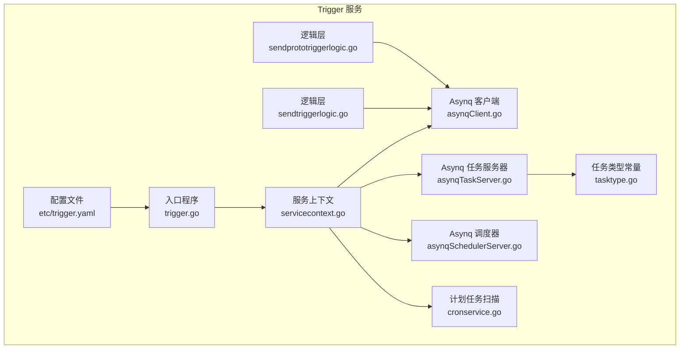
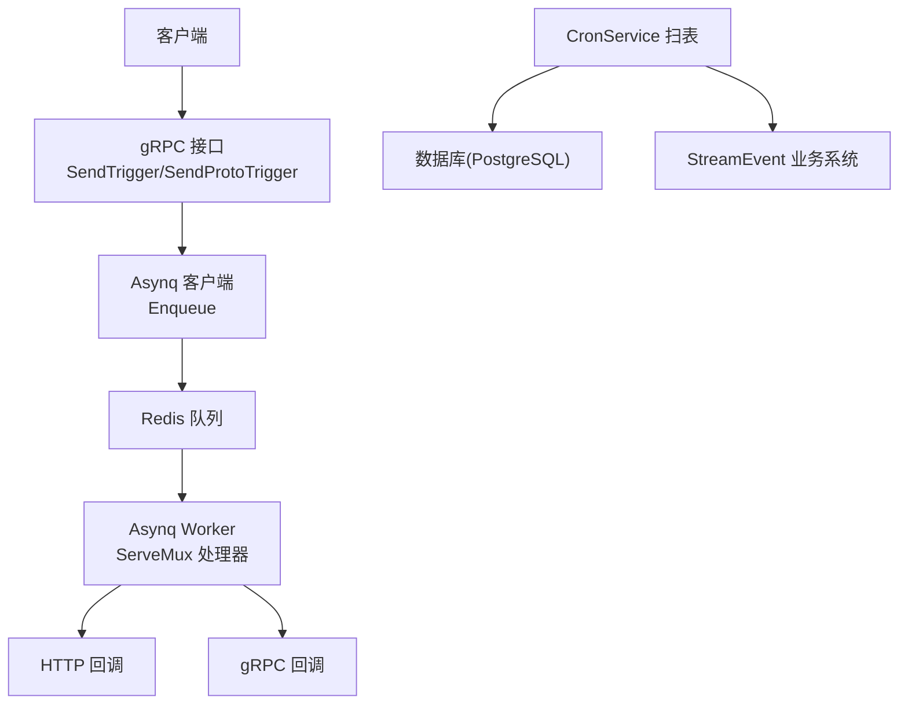
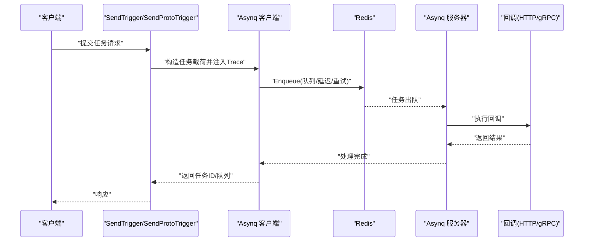
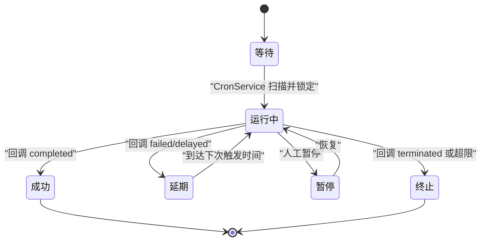
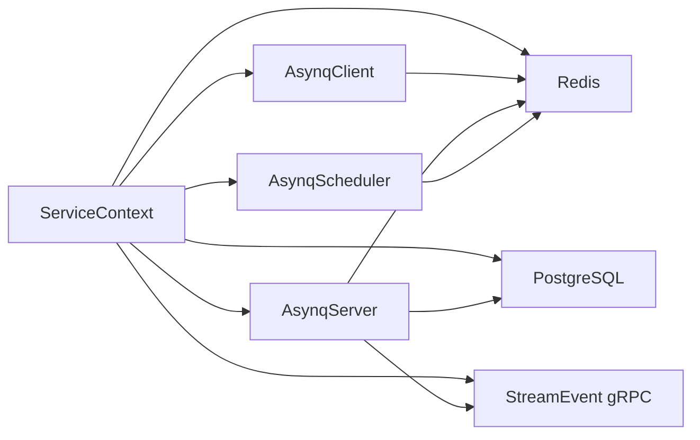

# 任务调度服务

<cite>
**本文引用的文件**
- [docs/trigger.md](file://docs/trigger.md)
- [common/asynqx/tasktype.go](file://common/asynqx/tasktype.go)
- [common/asynqx/asynqClient.go](file://common/asynqx/asynqClient.go)
- [common/asynqx/asynqTaskServer.go](file://common/asynqx/asynqTaskServer.go)
- [common/asynqx/asynqSchedulerServer.go](file://common/asynqx/asynqSchedulerServer.go)
- [app/trigger/etc/trigger.yaml](file://app/trigger/etc/trigger.yaml)
- [app/trigger/internal/config/config.go](file://app/trigger/internal/config/config.go)
- [app/trigger/internal/svc/servicecontext.go](file://app/trigger/internal/svc/servicecontext.go)
- [app/trigger/cron/cronservice.go](file://app/trigger/cron/cronservice.go)
- [app/trigger/internal/logic/sendtriggerlogic.go](file://app/trigger/internal/logic/sendtriggerlogic.go)
- [app/trigger/internal/logic/sendprototriggerlogic.go](file://app/trigger/internal/logic/sendprototriggerlogic.go)
- [app/trigger/trigger.go](file://app/trigger/trigger.go)
</cite>

## 目录
1. [简介](#简介)
2. [项目结构](#项目结构)
3. [核心组件](#核心组件)
4. [架构总览](#架构总览)
5. [详细组件分析](#详细组件分析)
6. [依赖关系分析](#依赖关系分析)
7. [性能考量](#性能考量)
8. [故障排查指南](#故障排查指南)
9. [结论](#结论)
10. [附录](#附录)

## 简介
本文件面向 Zero-Service 的 Trigger 任务调度服务，系统化阐述其两类调度能力与实现机制：
- 异步任务调度：基于 Asynq 的分布式任务队列，支持定时、延迟、一次性任务，并提供 HTTP 或 gRPC 回调。
- 计划任务管理：自研数据库扫描引擎，基于 rrule 规则生成周期性任务，提供完整的生命周期管理与状态机。

同时，文档覆盖任务类型定义、队列与优先级、并发与资源控制、监控与重试、性能调优与故障排查，并给出配置示例与最佳实践。

## 项目结构
Trigger 服务位于 app/trigger 目录，核心由以下部分组成：
- 配置与启动：trigger.go 负责加载配置、初始化服务上下文、注册 gRPC 服务、启动 Asynq 任务服务器与调度器、启动 CronService。
- 配置文件：etc/trigger.yaml 提供 RPC、Redis、数据库、StreamEvent 等关键配置。
- 服务上下文：internal/svc/servicecontext.go 统一注入 Asynq 客户端/服务器/调度器、数据库、Redis、StreamEvent 客户端等。
- 逻辑层：internal/logic 提供 SendTrigger/SendProtoTrigger 等 RPC 逻辑，负责任务入队与参数校验。
- 计划任务扫描：cron/cronservice.go 提供基于数据库的扫描与回调执行，配合状态机推进任务生命周期。
- Asynq 公共封装：common/asynqx 提供任务类型常量、客户端/服务器/调度器封装、中间件与链路追踪。

**图表来源**
- [app/trigger/trigger.go:34-88](file://app/trigger/trigger.go#L34-L88)
- [app/trigger/etc/trigger.yaml:1-37](file://app/trigger/etc/trigger.yaml#L1-L37)
- [app/trigger/internal/svc/servicecontext.go:50-90](file://app/trigger/internal/svc/servicecontext.go#L50-L90)
- [app/trigger/internal/logic/sendtriggerlogic.go:37-104](file://app/trigger/internal/logic/sendtriggerlogic.go#L37-L104)
- [app/trigger/internal/logic/sendprototriggerlogic.go:40-100](file://app/trigger/internal/logic/sendprototriggerlogic.go#L40-L100)
- [app/trigger/cron/cronservice.go:38-79](file://app/trigger/cron/cronservice.go#L38-L79)
- [common/asynqx/asynqClient.go:17-30](file://common/asynqx/asynqClient.go#L17-L30)
- [common/asynqx/asynqTaskServer.go:39-64](file://common/asynqx/asynqTaskServer.go#L39-L64)
- [common/asynqx/asynqSchedulerServer.go:32-51](file://common/asynqx/asynqSchedulerServer.go#L32-L51)
- [common/asynqx/tasktype.go:3-9](file://common/asynqx/tasktype.go#L3-L9)

**章节来源**
- [app/trigger/trigger.go:34-88](file://app/trigger/trigger.go#L34-L88)
- [app/trigger/etc/trigger.yaml:1-37](file://app/trigger/etc/trigger.yaml#L1-L37)
- [app/trigger/internal/svc/servicecontext.go:50-90](file://app/trigger/internal/svc/servicecontext.go#L50-L90)

## 核心组件
- Asynq 异步任务队列
  - 任务类型：延迟 HTTP 触发、延迟 gRPC Proto 触发、定时调度任务。
  - 队列权重：critical:6、default:3、low:1；并发默认 20。
  - 生产者/消费者链路追踪：通过 OpenTelemetry 注入与提取上下文。
- 计划任务引擎
  - 三层模型：Plan/Batch/ExecItem；基于 rrule 生成触发时间，数据库扫描驱动执行。
  - 状态机：WAITING → RUNNING → COMPLETED/DELAYED/PAUSED/TERMINATED。
  - 回调结果处理：completed/failed/delayed/ongoing/terminated。
- 服务上下文
  - 统一注入 Asynq 客户端/服务器/调度器、数据库连接、Redis、StreamEvent gRPC 客户端。
- 配置
  - 支持 Nacos 注册、Redis 集群、PostgreSQL 数据源、StreamEvent gRPC 端点与超时。

**章节来源**
- [docs/trigger.md:14-69](file://docs/trigger.md#L14-L69)
- [docs/trigger.md:70-176](file://docs/trigger.md#L70-L176)
- [common/asynqx/tasktype.go:3-9](file://common/asynqx/tasktype.go#L3-L9)
- [common/asynqx/asynqTaskServer.go:55-63](file://common/asynqx/asynqTaskServer.go#L55-L63)
- [app/trigger/etc/trigger.yaml:19-36](file://app/trigger/etc/trigger.yaml#L19-L36)
- [app/trigger/internal/svc/servicecontext.go:65-89](file://app/trigger/internal/svc/servicecontext.go#L65-L89)

## 架构总览
Trigger 服务采用“RPC + Asynq + 数据库扫描”的混合架构：
- RPC 层：接收客户端请求，将任务入队到 Redis。
- Asynq 层：Worker 消费队列，执行回调（HTTP 或 gRPC）。
- 计划任务层：CronService 周期扫描数据库，触发 ExecItem，回调业务系统并推进状态。
- 监控与可观测：OpenTelemetry TraceID 贯穿生产与消费链路。

**图表来源**
- [docs/trigger.md:18-31](file://docs/trigger.md#L18-L31)
- [app/trigger/internal/logic/sendtriggerlogic.go:37-104](file://app/trigger/internal/logic/sendtriggerlogic.go#L37-L104)
- [app/trigger/internal/logic/sendprototriggerlogic.go:40-100](file://app/trigger/internal/logic/sendprototriggerlogic.go#L40-L100)
- [app/trigger/cron/cronservice.go:81-184](file://app/trigger/cron/cronservice.go#L81-L184)

## 详细组件分析

### Asynq 异步任务队列
- 任务类型
  - 延迟 HTTP 触发：defer:triggerTask
  - 延迟 gRPC Proto 触发：defer:triggerProtoTask
  - 定时调度任务：scheduler:defer:task
- 队列与并发
  - 队列权重：critical/default/low
  - 并发：20
- 生产者/消费者链路
  - 生产者侧：在 RPC 中构造任务载荷，注入 OpenTelemetry 上下文，选择队列与延迟时间后入队。
  - 消费者侧：Asynq 服务器启动 ServeMux，统一处理不同类型任务，记录耗时与错误。
- 调度器
  - Asynq Scheduler 提供基于 Cron 表达式的定时任务注册与执行。

**图表来源**
- [app/trigger/internal/logic/sendtriggerlogic.go:37-104](file://app/trigger/internal/logic/sendtriggerlogic.go#L37-L104)
- [app/trigger/internal/logic/sendprototriggerlogic.go:40-100](file://app/trigger/internal/logic/sendprototriggerlogic.go#L40-L100)
- [common/asynqx/asynqClient.go:17-30](file://common/asynqx/asynqClient.go#L17-L30)
- [common/asynqx/asynqTaskServer.go:28-37](file://common/asynqx/asynqTaskServer.go#L28-L37)

**章节来源**
- [common/asynqx/tasktype.go:3-9](file://common/asynqx/tasktype.go#L3-L9)
- [common/asynqx/asynqTaskServer.go:55-63](file://common/asynqx/asynqTaskServer.go#L55-L63)
- [common/asynqx/asynqSchedulerServer.go:32-51](file://common/asynqx/asynqSchedulerServer.go#L32-L51)
- [app/trigger/internal/logic/sendtriggerlogic.go:37-104](file://app/trigger/internal/logic/sendtriggerlogic.go#L37-L104)
- [app/trigger/internal/logic/sendprototriggerlogic.go:40-100](file://app/trigger/internal/logic/sendprototriggerlogic.go#L40-L100)

### 计划任务管理（自研引擎）
- 数据模型
  - Plan：计划任务定义，含 rrule、时间范围、状态、扩展字段。
  - Batch：执行批次，对应一个具体执行日期。
  - ExecItem：具体任务单元，含 payload、超时、下次触发时间、状态、最近结果。
  - PlanExecLog：每次触发的执行日志。
- 扫描与执行
  - CronService 周期扫描 next_trigger_time ≤ now 且状态可执行的 ExecItem，乐观锁更新为 RUNNING 并后移 5 分钟以避免重复。
  - 通过 StreamEvent gRPC 调用业务系统，回调结果驱动状态迁移。
- 状态机与重试
  - WAITING → RUNNING → COMPLETED/DELAYED/PAUSED/TERMINATED。
  - 失败后指数退避重试，最多 25 次，超限终止；Redis 分布式锁避免并发回调冲突。

**图表来源**
- [docs/trigger.md:108-128](file://docs/trigger.md#L108-L128)

**章节来源**
- [docs/trigger.md:70-176](file://docs/trigger.md#L70-L176)
- [app/trigger/cron/cronservice.go:81-184](file://app/trigger/cron/cronservice.go#L81-L184)

### 任务执行器的并发控制与资源管理
- Asynq 并发
  - Concurrency=20，队列权重 critical/default/low 控制吞吐与优先级。
- 计划任务并发
  - CronService 使用 TaskRunner(16 并发) 执行回调，结合 Redis 分布式锁确保幂等。
- 资源管理
  - Asynq 客户端/服务器/调度器共享同一 Redis 连接池；数据库连接通过 sqlx 初始化。
  - StreamEvent gRPC 客户端设置最大消息大小，避免大负载阻塞。

**章节来源**
- [common/asynqx/asynqTaskServer.go:55-63](file://common/asynqx/asynqTaskServer.go#L55-L63)
- [app/trigger/cron/cronservice.go:31-36](file://app/trigger/cron/cronservice.go#L31-L36)
- [app/trigger/internal/svc/servicecontext.go:79-87](file://app/trigger/internal/svc/servicecontext.go#L79-L87)

### 任务监控、重试与失败处理
- 监控
  - OpenTelemetry TraceID 贯穿生产与消费链路，便于分布式追踪。
  - 提供执行日志与仪表板统计接口，辅助问题定位。
- 重试
  - Asynq 支持 MaxRetry 与指数退避；计划任务失败后按 1s,2s,4s... 最高 30 分钟退避，最多 25 次。
- 失败处理
  - 计划任务回调 failed 时进入 DELAYED 并根据 DelayConfig 重调度；超限进入 TERMINATED。
  - 回调 ongoing 保持 RUNNING 等待后续回调；terminated 直接终止。

**章节来源**
- [docs/trigger.md:153-158](file://docs/trigger.md#L153-L158)
- [app/trigger/cron/cronservice.go:338-433](file://app/trigger/cron/cronservice.go#L338-L433)

## 依赖关系分析
- 组件耦合
  - 服务上下文集中注入 Redis、数据库、Asynq、StreamEvent 客户端，降低模块间耦合。
  - Asynq 服务器通过 ServeMux 注册处理器，任务类型常量集中管理。
- 外部依赖
  - Redis：作为队列与分布式锁存储。
  - PostgreSQL：存储计划任务元数据与日志。
  - StreamEvent：业务系统回调目标。

**图表来源**
- [app/trigger/internal/svc/servicecontext.go:65-89](file://app/trigger/internal/svc/servicecontext.go#L65-L89)
- [common/asynqx/asynqClient.go:17-30](file://common/asynqx/asynqClient.go#L17-L30)
- [common/asynqx/asynqTaskServer.go:39-64](file://common/asynqx/asynqTaskServer.go#L39-L64)
- [common/asynqx/asynqSchedulerServer.go:32-51](file://common/asynqx/asynqSchedulerServer.go#L32-L51)

**章节来源**
- [app/trigger/internal/svc/servicecontext.go:65-89](file://app/trigger/internal/svc/servicecontext.go#L65-L89)

## 性能考量
- 队列与并发
  - 合理分配 critical/default/low 权重，确保高优先级任务及时处理。
  - 根据业务峰值调整 Concurrency，避免过载导致内存与 CPU 峰值。
- 扫表策略
  - CronService 在有待处理项时 10ms 扫描，无数据时 1-2s 随机休眠，降低空跑开销。
- 超时与重试
  - 为计划任务设置合理 RequestTimeout，避免长时间阻塞回调线程。
  - Asynq MaxRetry 与指数退避需结合业务 SLA 调整，避免雪崩。
- 缓存与连接
  - Redis 连接池大小与 Dial/Read/Write 超时需与集群规模匹配。
  - 数据库连接池与事务隔离级别影响扫描性能，建议按压测结果优化。

[本节为通用指导，无需列出章节来源]

## 故障排查指南
- 任务未被消费
  - 检查 Redis 是否连通、队列是否正确入队、Asynq Worker 是否启动。
  - 查看日志中的任务类型与队列权重，确认是否被低优先级队列淹没。
- 回调失败
  - 检查 StreamEvent gRPC 端点可达性与超时设置；查看回调返回结果与日志。
  - 对于计划任务，确认 DELAYED 状态下的下次触发时间是否合理。
- 并发冲突
  - 计划任务回调使用 Redis 分布式锁，若出现锁竞争，适当增大并发或优化回调耗时。
- 重试风暴
  - 若大量任务快速失败，检查指数退避参数与 MaxRetry，必要时临时降低并发或增加退避上限。

**章节来源**
- [app/trigger/cron/cronservice.go:264-280](file://app/trigger/cron/cronservice.go#L264-L280)
- [common/asynqx/asynqTaskServer.go:73-86](file://common/asynqx/asynqTaskServer.go#L73-L86)

## 结论
Trigger 服务通过 Asynq 与自研计划任务引擎，提供了高可靠、可观测的任务调度能力。Asynq 负责异步与定时任务的高效执行，计划任务引擎负责周期性任务的全生命周期管理。通过合理的队列权重、并发与重试策略，以及完善的监控与日志体系，可在复杂业务场景中稳定运行。

[本节为总结性内容，无需列出章节来源]

## 附录

### 任务类型与队列配置
- 任务类型
  - 延迟 HTTP 触发：defer:triggerTask
  - 延迟 gRPC Proto 触发：defer:triggerProtoTask
  - 定时调度任务：scheduler:defer:task
- 队列权重
  - critical:6、default:3、low:1
- 并发
  - Asynq 并发：20

**章节来源**
- [common/asynqx/tasktype.go:3-9](file://common/asynqx/tasktype.go#L3-L9)
- [common/asynqx/asynqTaskServer.go:55-63](file://common/asynqx/asynqTaskServer.go#L55-L63)

### 配置示例与最佳实践
- 配置要点
  - Redis：主机、密码、DB、连接池大小与超时。
  - 数据库：PostgreSQL 连接串，建议开启只读副本用于扫描。
  - StreamEvent：端点列表、非阻塞、超时、优雅退出周期。
- 最佳实践
  - 将高优先级任务放入 critical 队列，避免被 default/low 抢占。
  - 为计划任务设置合理的 RequestTimeout，避免长时间阻塞。
  - 使用 OpenTelemetry TraceID 追踪任务全链路，结合日志与指标进行问题定位。
  - 定期清理已完成/归档任务，避免 Redis 与数据库膨胀。

**章节来源**
- [app/trigger/etc/trigger.yaml:19-36](file://app/trigger/etc/trigger.yaml#L19-L36)
- [docs/trigger.md:232-266](file://docs/trigger.md#L232-L266)