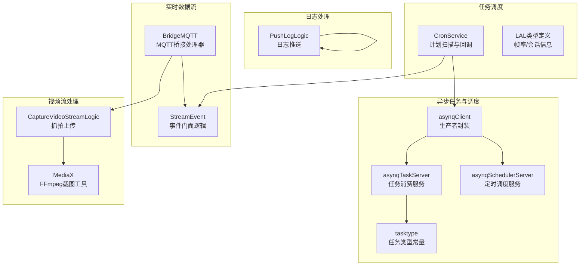
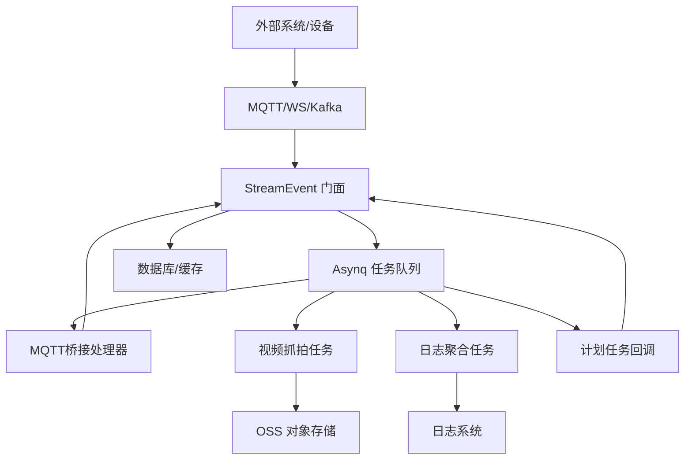
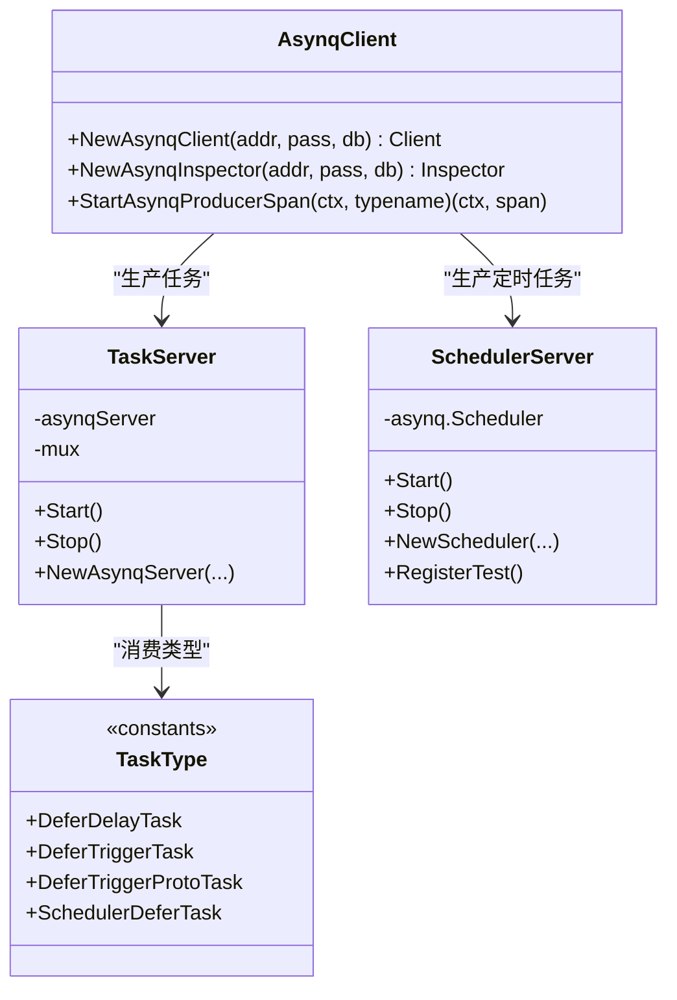
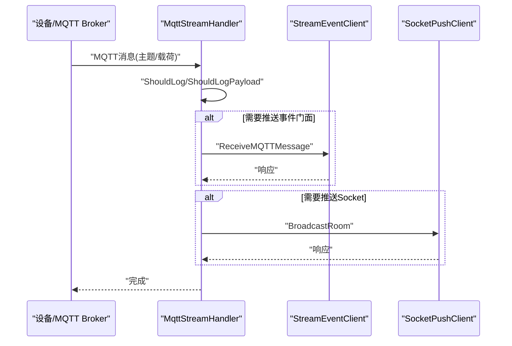
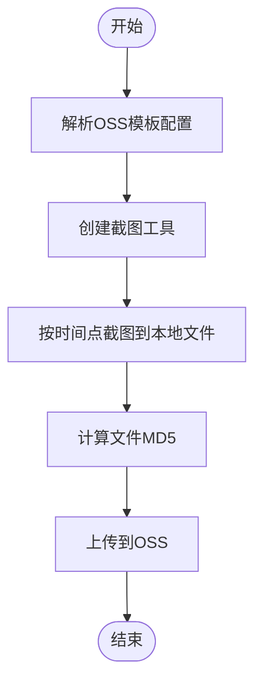
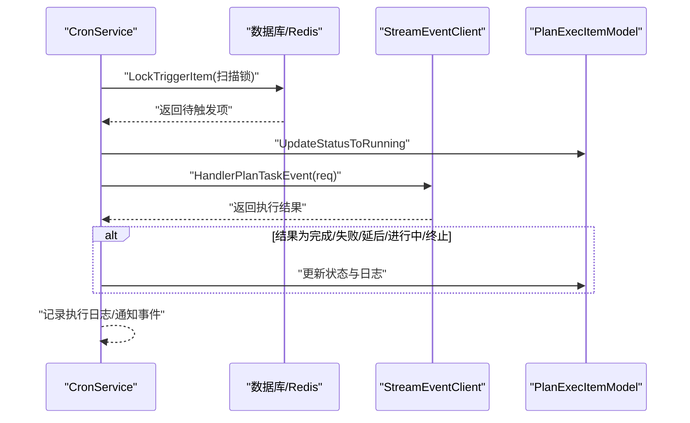
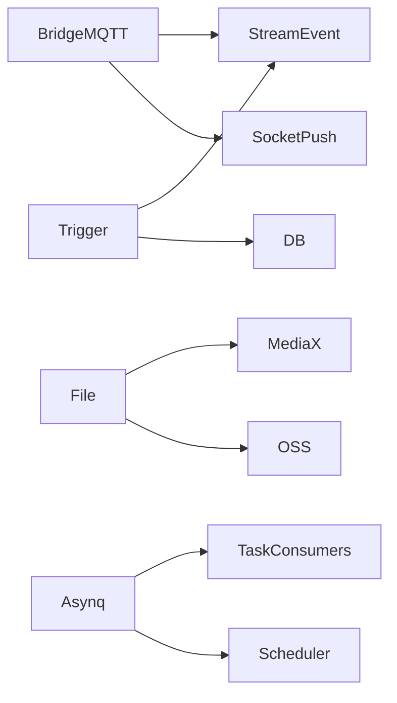

# 数据处理服务

<cite>
**本文引用的文件**
- [common/asynqx/asynqClient.go](file://common/asynqx/asynqClient.go)
- [common/asynqx/asynqTaskServer.go](file://common/asynqx/asynqTaskServer.go)
- [common/asynqx/asynqSchedulerServer.go](file://common/asynqx/asynqSchedulerServer.go)
- [common/asynqx/tasktype.go](file://common/asynqx/tasktype.go)
- [app/bridgemqtt/internal/handler/mqttstreamhandler.go](file://app/bridgemqtt/internal/handler/mqttstreamhandler.go)
- [facade/streamevent/internal/logic/receivemqttmessagelogic.go](file://facade/streamevent/internal/logic/receivemqttmessagelogic.go)
- [app/file/internal/logic/capturevideostreamlogic.go](file://app/file/internal/logic/capturevideostreamlogic.go)
- [common/mediax/mediax.go](file://common/mediax/mediax.go)
- [app/logdump/internal/logic/pushloglogic.go](file://app/logdump/internal/logic/pushloglogic.go)
- [app/trigger/cron/cronservice.go](file://app/trigger/cron/cronservice.go)
- [zerorpc/internal/task/deferdelaytask.go](file://zerorpc/internal/task/deferdelaytask.go)
- [common/lalx/laltype.go](file://common/lalx/laltype.go)
- [app/trigger/trigger/trigger.pb.go](file://app/trigger/trigger/trigger.pb.go)
- [app/trigger/trigger/trigger.pb.validate.go](file://app/trigger/trigger/trigger.pb.validate.go)
</cite>

## 目录
1. [简介](#简介)
2. [项目结构](#项目结构)
3. [核心组件](#核心组件)
4. [架构总览](#架构总览)
5. [组件详解](#组件详解)
6. [依赖关系分析](#依赖关系分析)
7. [性能考量](#性能考量)
8. [故障排查指南](#故障排查指南)
9. [结论](#结论)
10. [附录](#附录)

## 简介
本文件面向Zero-Service的数据处理服务，系统性阐述实时数据流处理、视频流处理、日志处理与任务调度等核心能力，给出数据管道设计（采集-传输-处理-存储）与异步任务处理机制（队列、调度、重试），并提供性能优化策略与监控方案，辅以典型使用场景与配置要点。

## 项目结构
围绕数据处理的关键模块分布如下：
- 异步任务与调度：common/asynqx（生产者/消费者/调度器封装）、zerorpc内部任务路由
- 实时数据流：app/bridgemqtt（MQTT桥接）、facade/streamevent（事件门面）
- 视频流处理：app/file（抓拍上传）、common/mediax（FFmpeg截图工具）
- 日志处理：app/logdump（日志推送）
- 任务调度：app/trigger（计划任务扫描与回调）、common/lalx（LAL相关数据模型）

**图表来源**
- [common/asynqx/asynqClient.go:1-31](file://common/asynqx/asynqClient.go#L1-L31)
- [common/asynqx/asynqTaskServer.go:1-87](file://common/asynqx/asynqTaskServer.go#L1-L87)
- [common/asynqx/asynqSchedulerServer.go:1-62](file://common/asynqx/asynqSchedulerServer.go#L1-L62)
- [common/asynqx/tasktype.go:1-9](file://common/asynqx/tasktype.go#L1-L9)
- [app/bridgemqtt/internal/handler/mqttstreamhandler.go:1-254](file://app/bridgemqtt/internal/handler/mqttstreamhandler.go#L1-L254)
- [facade/streamevent/internal/logic/receivemqttmessagelogic.go:1-32](file://facade/streamevent/internal/logic/receivemqttmessagelogic.go#L1-L32)
- [app/file/internal/logic/capturevideostreamlogic.go:1-93](file://app/file/internal/logic/capturevideostreamlogic.go#L1-L93)
- [common/mediax/mediax.go:1-194](file://common/mediax/mediax.go#L1-L194)
- [app/logdump/internal/logic/pushloglogic.go:1-68](file://app/logdump/internal/logic/pushloglogic.go#L1-L68)
- [app/trigger/cron/cronservice.go:1-469](file://app/trigger/cron/cronservice.go#L1-L469)
- [common/lalx/laltype.go:1-126](file://common/lalx/laltype.go#L1-L126)

**章节来源**
- [common/asynqx/asynqClient.go:1-31](file://common/asynqx/asynqClient.go#L1-L31)
- [common/asynqx/asynqTaskServer.go:1-87](file://common/asynqx/asynqTaskServer.go#L1-L87)
- [common/asynqx/asynqSchedulerServer.go:1-62](file://common/asynqx/asynqSchedulerServer.go#L1-L62)
- [common/asynqx/tasktype.go:1-9](file://common/asynqx/tasktype.go#L1-L9)
- [app/bridgemqtt/internal/handler/mqttstreamhandler.go:1-254](file://app/bridgemqtt/internal/handler/mqttstreamhandler.go#L1-L254)
- [facade/streamevent/internal/logic/receivemqttmessagelogic.go:1-32](file://facade/streamevent/internal/logic/receivemqttmessagelogic.go#L1-L32)
- [app/file/internal/logic/capturevideostreamlogic.go:1-93](file://app/file/internal/logic/capturevideostreamlogic.go#L1-L93)
- [common/mediax/mediax.go:1-194](file://common/mediax/mediax.go#L1-L194)
- [app/logdump/internal/logic/pushloglogic.go:1-68](file://app/logdump/internal/logic/pushloglogic.go#L1-L68)
- [app/trigger/cron/cronservice.go:1-469](file://app/trigger/cron/cronservice.go#L1-L469)
- [common/lalx/laltype.go:1-126](file://common/lalx/laltype.go#L1-L126)

## 核心组件
- 异步任务与调度
  - 生产者封装：基于Redis的Asynq客户端与链路追踪埋点
  - 任务消费服务：并发控制、队列优先级、中间件日志
  - 定时调度服务：Cron表达式注册、保留期、后置钩子
  - 任务类型常量：延迟任务、触发任务、调度器任务类型
- 实时数据流
  - MQTT桥接处理器：按主题模板匹配事件、限流日志、异步推送至事件门面与Socket
  - StreamEvent门面：统一接收MQTT/WS/Kafka等事件（扩展点）
- 视频流处理
  - 抓拍上传逻辑：根据租户/设备配置选择OSS模板，调用截图工具生成JPG并上传
  - FFmpeg截图工具：支持按时间点/帧索引截图、质量控制、本地校验与清理
- 日志处理
  - 日志推送逻辑：构建结构化字段、拼接extra、按级别输出
- 任务调度
  - 计划扫描与回调：锁表扫描待触发项、加分布式锁、调用事件门面、更新状态与日志
  - LAL类型定义：帧率、发布/订阅/中继会话信息等

**章节来源**
- [common/asynqx/asynqClient.go:1-31](file://common/asynqx/asynqClient.go#L1-L31)
- [common/asynqx/asynqTaskServer.go:1-87](file://common/asynqx/asynqTaskServer.go#L1-L87)
- [common/asynqx/asynqSchedulerServer.go:1-62](file://common/asynqx/asynqSchedulerServer.go#L1-L62)
- [common/asynqx/tasktype.go:1-9](file://common/asynqx/tasktype.go#L1-L9)
- [app/bridgemqtt/internal/handler/mqttstreamhandler.go:1-254](file://app/bridgemqtt/internal/handler/mqttstreamhandler.go#L1-L254)
- [facade/streamevent/internal/logic/receivemqttmessagelogic.go:1-32](file://facade/streamevent/internal/logic/receivemqttmessagelogic.go#L1-L32)
- [app/file/internal/logic/capturevideostreamlogic.go:1-93](file://app/file/internal/logic/capturevideostreamlogic.go#L1-L93)
- [common/mediax/mediax.go:1-194](file://common/mediax/mediax.go#L1-L194)
- [app/logdump/internal/logic/pushloglogic.go:1-68](file://app/logdump/internal/logic/pushloglogic.go#L1-L68)
- [app/trigger/cron/cronservice.go:1-469](file://app/trigger/cron/cronservice.go#L1-L469)
- [common/lalx/laltype.go:1-126](file://common/lalx/laltype.go#L1-L126)

## 架构总览
数据处理服务采用“事件驱动 + 异步队列”的分层架构：
- 采集层：MQTT/WS/Kafka/HTTP等接入
- 传输层：事件门面统一接收，必要时落盘或转发
- 处理层：异步任务消费、计划任务扫描、视频截图、日志聚合
- 存储层：OSS对象存储、数据库、Redis缓存/锁

**图表来源**
- [app/bridgemqtt/internal/handler/mqttstreamhandler.go:130-188](file://app/bridgemqtt/internal/handler/mqttstreamhandler.go#L130-L188)
- [facade/streamevent/internal/logic/receivemqttmessagelogic.go:27-31](file://facade/streamevent/internal/logic/receivemqttmessagelogic.go#L27-L31)
- [app/file/internal/logic/capturevideostreamlogic.go:35-92](file://app/file/internal/logic/capturevideostreamlogic.go#L35-L92)
- [app/logdump/internal/logic/pushloglogic.go:28-67](file://app/logdump/internal/logic/pushloglogic.go#L28-L67)
- [app/trigger/cron/cronservice.go:203-468](file://app/trigger/cron/cronservice.go#L203-L468)
- [common/asynqx/asynqTaskServer.go:39-63](file://common/asynqx/asynqTaskServer.go#L39-L63)

## 组件详解

### 异步任务与调度
- 生产者封装
  - 基于Redis的Asynq客户端初始化，支持追踪属性注入
  - 适用于延迟任务、触发任务、调度器任务的生产
- 任务消费服务
  - 并发度、队列优先级（critical/default/low）
  - 日志中间件记录任务类型与耗时，失败即判定
- 定时调度服务
  - 支持Cron表达式注册，带保留期与入队后置钩子
  - 地区时区设置为Asia/Shanghai
- 任务类型常量
  - 延迟任务、触发任务、调度器任务类型命名规范

**图表来源**
- [common/asynqx/asynqClient.go:17-30](file://common/asynqx/asynqClient.go#L17-L30)
- [common/asynqx/asynqTaskServer.go:21-63](file://common/asynqx/asynqTaskServer.go#L21-L63)
- [common/asynqx/asynqSchedulerServer.go:15-52](file://common/asynqx/asynqSchedulerServer.go#L15-L52)
- [common/asynqx/tasktype.go:3-9](file://common/asynqx/tasktype.go#L3-L9)

**章节来源**
- [common/asynqx/asynqClient.go:1-31](file://common/asynqx/asynqClient.go#L1-L31)
- [common/asynqx/asynqTaskServer.go:1-87](file://common/asynqx/asynqTaskServer.go#L1-L87)
- [common/asynqx/asynqSchedulerServer.go:1-62](file://common/asynqx/asynqSchedulerServer.go#L1-L62)
- [common/asynqx/tasktype.go:1-9](file://common/asynqx/tasktype.go#L1-L9)

### 实时数据流处理（MQTT桥接）
- 主题日志管理
  - 默认payload日志开关、最小日志间隔、按主题配置
- 消费处理
  - 匹配事件模板映射默认事件
  - 使用线程池并发调度，异步推送至事件门面与Socket
  - 记录耗时与调用结果（成功/失败）

**图表来源**
- [app/bridgemqtt/internal/handler/mqttstreamhandler.go:130-188](file://app/bridgemqtt/internal/handler/mqttstreamhandler.go#L130-L188)
- [facade/streamevent/internal/logic/receivemqttmessagelogic.go:27-31](file://facade/streamevent/internal/logic/receivemqttmessagelogic.go#L27-L31)

**章节来源**
- [app/bridgemqtt/internal/handler/mqttstreamhandler.go:1-254](file://app/bridgemqtt/internal/handler/mqttstreamhandler.go#L1-L254)
- [facade/streamevent/internal/logic/receivemqttmessagelogic.go:1-32](file://facade/streamevent/internal/logic/receivemqttmessagelogic.go#L1-L32)

### 视频流处理（抓拍与上传）
- 抓拍流程
  - 解析租户/设备OSS配置模板
  - 使用截图工具按时间点抓取JPG，计算MD5，上传OSS并返回文件元信息
- 截图工具
  - 支持按时间点/帧索引截图，质量参数控制，本地文件校验与清理

**图表来源**
- [app/file/internal/logic/capturevideostreamlogic.go:35-92](file://app/file/internal/logic/capturevideostreamlogic.go#L35-L92)
- [common/mediax/mediax.go:32-87](file://common/mediax/mediax.go#L32-L87)

**章节来源**
- [app/file/internal/logic/capturevideostreamlogic.go:1-93](file://app/file/internal/logic/capturevideostreamlogic.go#L1-L93)
- [common/mediax/mediax.go:1-194](file://common/mediax/mediax.go#L1-L194)

### 日志处理（结构化推送）
- 允许字段白名单过滤，拼接extra字符串，按级别输出
- 结构化字段仅包含白名单内的键值

**章节来源**
- [app/logdump/internal/logic/pushloglogic.go:28-67](file://app/logdump/internal/logic/pushloglogic.go#L28-L67)

### 任务调度（计划扫描与回调）
- 扫描循环
  - 周期性扫描待触发计划执行项，动态睡眠（10ms~2s）
- 回调执行
  - 加分布式锁，调用事件门面处理计划任务，依据返回结果更新状态（完成/失败/延后/进行中/终止）
  - 记录执行日志，批量/计划完成时通知事件门面

**图表来源**
- [app/trigger/cron/cronservice.go:81-468](file://app/trigger/cron/cronservice.go#L81-L468)

**章节来源**
- [app/trigger/cron/cronservice.go:1-469](file://app/trigger/cron/cronservice.go#L1-L469)

### LAL相关数据模型（视频流指标）
- 帧率数据：最近32秒每秒帧数
- 会话信息：发布者/订阅者/中继拉流/中继推流
- 服务器信息：版本、启动时间等

**章节来源**
- [common/lalx/laltype.go:1-126](file://common/lalx/laltype.go#L1-L126)

## 依赖关系分析
- 组件耦合
  - BridgeMQTT依赖StreamEvent与SocketPush，通过线程池解耦I/O与业务
  - File服务依赖MediaX与OSS模板，职责单一，便于替换
  - Trigger依赖数据库模型与StreamEvent门面，通过分布式锁保证幂等
  - Asynq作为统一异步基础设施，被多处任务使用
- 外部依赖
  - Redis（Asynq/锁）
  - FFmpeg（截图）
  - OSS（对象存储）

**图表来源**
- [app/bridgemqtt/internal/handler/mqttstreamhandler.go:99-118](file://app/bridgemqtt/internal/handler/mqttstreamhandler.go#L99-L118)
- [app/file/internal/logic/capturevideostreamlogic.go:36-87](file://app/file/internal/logic/capturevideostreamlogic.go#L36-L87)
- [app/trigger/cron/cronservice.go:262-280](file://app/trigger/cron/cronservice.go#L262-L280)
- [common/asynqx/asynqTaskServer.go:39-63](file://common/asynqx/asynqTaskServer.go#L39-L63)

**章节来源**
- [app/bridgemqtt/internal/handler/mqttstreamhandler.go:1-254](file://app/bridgemqtt/internal/handler/mqttstreamhandler.go#L1-L254)
- [app/file/internal/logic/capturevideostreamlogic.go:1-93](file://app/file/internal/logic/capturevideostreamlogic.go#L1-L93)
- [app/trigger/cron/cronservice.go:1-469](file://app/trigger/cron/cronservice.go#L1-L469)
- [common/asynqx/asynqTaskServer.go:1-87](file://common/asynqx/asynqTaskServer.go#L1-L87)

## 性能考量
- 并发与限流
  - Asynq并发度与队列优先级平衡CPU与延迟
  - MQTT桥接使用线程池限制瞬时并发，避免阻塞
- I/O与资源
  - 视频截图先写本地再上传，减少网络抖动影响
  - 截图工具自动清理无效文件，降低磁盘压力
- 缓存与锁
  - 计划扫描使用分布式锁，避免重复执行
- 监控与追踪
  - Asynq生产/消费Span埋点，结合日志中间件统计耗时
  - Cron扫描循环记录TraceID，便于问题定位

[本节为通用指导，无需列出具体文件来源]

## 故障排查指南
- 任务未执行/堆积
  - 检查Asynq消费者是否启动、队列优先级与并发配置
  - 查看日志中间件输出的任务类型与耗时
- 任务失败
  - 关注失败判定回调与日志输出
  - 核对任务类型常量与处理器注册一致
- MQTT消息未推送
  - 检查主题模板映射与事件匹配
  - 开启payload日志定位异常
- 视频抓拍失败
  - 检查FFmpeg可用性与输入URL
  - 确认OSS模板配置与权限
- 计划任务未触发
  - 检查扫描循环与锁状态
  - 核对事件门面回调返回结果与状态更新

**章节来源**
- [common/asynqx/asynqTaskServer.go:73-86](file://common/asynqx/asynqTaskServer.go#L73-L86)
- [app/bridgemqtt/internal/handler/mqttstreamhandler.go:130-188](file://app/bridgemqtt/internal/handler/mqttstreamhandler.go#L130-L188)
- [app/file/internal/logic/capturevideostreamlogic.go:46-53](file://app/file/internal/logic/capturevideostreamlogic.go#L46-L53)
- [app/trigger/cron/cronservice.go:262-280](file://app/trigger/cron/cronservice.go#L262-L280)

## 结论
该数据处理服务以Asynq为核心，结合事件门面与桥接组件，形成“采集-传输-处理-存储”的闭环。通过线程池、分布式锁、结构化日志与链路追踪，实现高吞吐、可观测、可扩展的数据处理能力。建议在生产环境进一步完善告警、熔断与重试策略，并持续优化队列与并发配置以适配峰值流量。

[本节为总结性内容，无需列出具体文件来源]

## 附录

### 数据管道设计（采集-传输-处理-存储）
- 采集：MQTT/WS/Kafka/HTTP接入
- 传输：事件门面统一接收，必要时转发
- 处理：异步任务消费、计划扫描、视频截图、日志聚合
- 存储：OSS对象存储、数据库、Redis缓存/锁

[本节为概念性描述，无需列出具体文件来源]

### 异步任务处理机制
- 任务队列
  - 队列优先级：critical/default/low
  - 并发度：20
- 调度策略
  - Cron表达式注册，保留期7天
- 重试机制
  - 失败即判定，结合上层业务幂等与补偿

**章节来源**
- [common/asynqx/asynqTaskServer.go:50-62](file://common/asynqx/asynqTaskServer.go#L50-L62)
- [common/asynqx/asynqSchedulerServer.go:32-51](file://common/asynqx/asynqSchedulerServer.go#L32-L51)
- [app/trigger/trigger/trigger.pb.go:373-397](file://app/trigger/trigger/trigger.pb.go#L373-L397)
- [app/trigger/trigger/trigger.pb.validate.go:4316-4390](file://app/trigger/trigger/trigger.pb.validate.go#L4316-L4390)

### 使用场景与配置要点
- 实时视频监控
  - 配置MQTT桥接与事件门面，启用Socket推送
  - 配置视频抓拍任务，设置OSS桶与路径前缀
- 日志集中化
  - 在logdump中配置允许的extra字段白名单
  - 按服务/级别输出，便于检索
- 计划任务编排
  - 使用CronService扫描待触发项，确保分布式锁生效
  - 事件门面回调返回状态决定下一步动作

**章节来源**
- [app/bridgemqtt/internal/handler/mqttstreamhandler.go:99-118](file://app/bridgemqtt/internal/handler/mqttstreamhandler.go#L99-L118)
- [app/file/internal/logic/capturevideostreamlogic.go:36-42](file://app/file/internal/logic/capturevideostreamlogic.go#L36-L42)
- [app/logdump/internal/logic/pushloglogic.go:29-33](file://app/logdump/internal/logic/pushloglogic.go#L29-L33)
- [app/trigger/cron/cronservice.go:262-277](file://app/trigger/cron/cronservice.go#L262-L277)