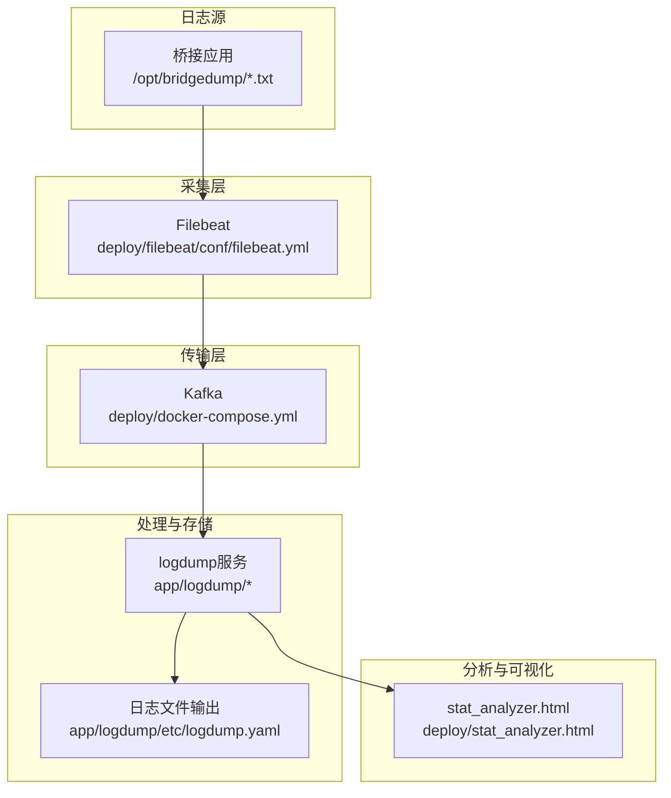
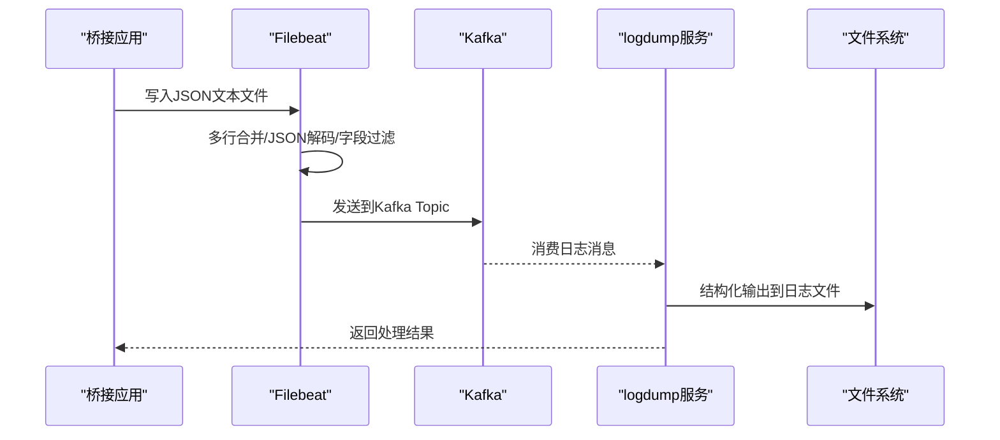
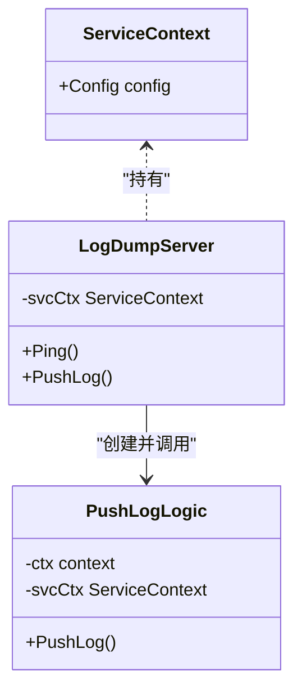
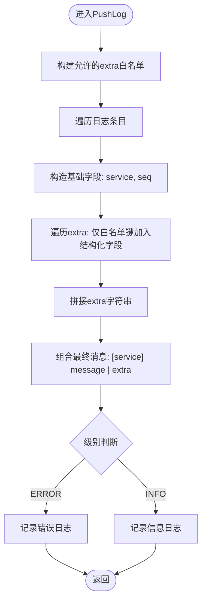
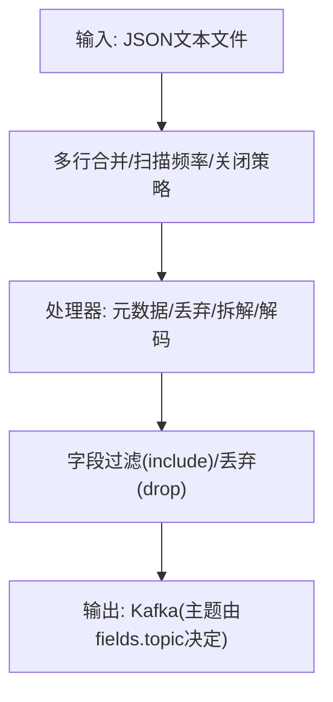
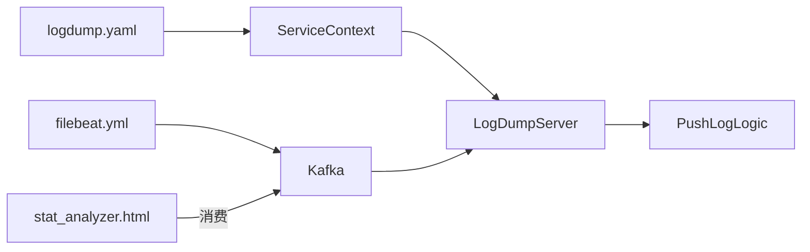

# 日志处理服务

<cite>
**本文引用的文件**
- [logdump.go](file://app/logdump/logdump.go)
- [logdump.proto](file://app/logdump/logdump.proto)
- [logdump.yaml](file://app/logdump/etc/logdump.yaml)
- [config.go](file://app/logdump/internal/config/config.go)
- [servicecontext.go](file://app/logdump/internal/svc/servicecontext.go)
- [logdumpserver.go](file://app/logdump/internal/server/logdumpserver.go)
- [pushloglogic.go](file://app/logdump/internal/logic/pushloglogic.go)
- [filebeat.yml](file://deploy/filebeat/conf/filebeat.yml)
- [docker-compose.yml](file://deploy/docker-compose.yml)
- [stat_analyzer.html](file://deploy/stat_analyzer.html)
- [pod-log-app.sh](file://util/dockeru/pod-log-app.sh)
- [pod-enter-app.sh](file://util/dockeru/pod-enter-app.sh)
</cite>

## 目录
1. [简介](#简介)
2. [项目结构](#项目结构)
3. [核心组件](#核心组件)
4. [架构总览](#架构总览)
5. [详细组件分析](#详细组件分析)
6. [依赖分析](#依赖分析)
7. [性能考虑](#性能考虑)
8. [故障排查指南](#故障排查指南)
9. [结论](#结论)
10. [附录](#附录)

## 简介
本文件面向Zero-Service项目的日志处理服务，围绕logdump服务的日志收集、传输与存储机制进行系统化说明。重点涵盖：
- 日志格式标准化与结构化输出
- 批量推送与错误重试策略
- Filebeat部署配置与采集策略
- 日志数据的结构化处理流程（字段提取、过滤、聚合）
- 性能优化建议与容量规划
- 日志查询、分析与可视化方法

## 项目结构
日志处理相关的关键位置如下：
- logdump服务：gRPC服务定义与实现，负责接收并落盘/输出结构化日志
- Filebeat配置：采集桥接应用产生的JSON日志并发送至Kafka
- Kafka：作为消息中间件承载日志流
- 可视化分析：本地HTML页面对Go-Zero统计类日志进行解析与可视化（可迁移至生产环境）

**图表来源**
- [filebeat.yml:1-122](file://deploy/filebeat/conf/filebeat.yml#L1-L122)
- [docker-compose.yml:1-110](file://deploy/docker-compose.yml#L1-L110)
- [logdump.go:1-71](file://app/logdump/logdump.go#L1-L71)
- [logdump.yaml:1-26](file://app/logdump/etc/logdump.yaml#L1-L26)
- [stat_analyzer.html:1-800](file://deploy/stat_analyzer.html#L1-L800)

**章节来源**
- [logdump.go:1-71](file://app/logdump/logdump.go#L1-L71)
- [logdump.proto:1-44](file://app/logdump/logdump.proto#L1-L44)
- [logdump.yaml:1-26](file://app/logdump/etc/logdump.yaml#L1-L26)
- [filebeat.yml:1-122](file://deploy/filebeat/conf/filebeat.yml#L1-L122)
- [docker-compose.yml:1-110](file://deploy/docker-compose.yml#L1-L110)
- [stat_analyzer.html:1-800](file://deploy/stat_analyzer.html#L1-L800)

## 核心组件
- logdump服务（gRPC）：提供Ping与PushLog接口，接收日志条目，按配置进行结构化输出与过滤。
- Filebeat：采集桥接应用输出的JSON文本，解析并发送到Kafka。
- Kafka：作为日志传输通道，支持多topic与压缩。
- 可视化分析：本地HTML工具解析Go-Zero统计日志并生成图表。

关键职责与行为：
- PushLog：对每个日志条目构建结构化字段，限制额外字段白名单，按级别输出。
- Filebeat：多输入、多topic、多行合并、JSON解码、字段过滤与丢弃。
- Kafka：高吞吐、低延迟、可扩展分区与副本。
- 可视化：支持拖拽上传、分页、排序、图表缩放与全屏。

**章节来源**
- [pushloglogic.go:1-68](file://app/logdump/internal/logic/pushloglogic.go#L1-L68)
- [logdumpserver.go:1-36](file://app/logdump/internal/server/logdumpserver.go#L1-L36)
- [filebeat.yml:1-122](file://deploy/filebeat/conf/filebeat.yml#L1-L122)
- [docker-compose.yml:1-110](file://deploy/docker-compose.yml#L1-L110)
- [stat_analyzer.html:1-800](file://deploy/stat_analyzer.html#L1-L800)

## 架构总览
下图展示了从桥接应用到Kafka，再到logdump服务与日志落盘的整体链路，以及可视化分析工具的接入点。

**图表来源**
- [filebeat.yml:1-122](file://deploy/filebeat/conf/filebeat.yml#L1-L122)
- [docker-compose.yml:1-110](file://deploy/docker-compose.yml#L1-L110)
- [logdumpserver.go:1-36](file://app/logdump/internal/server/logdumpserver.go#L1-L36)
- [pushloglogic.go:1-68](file://app/logdump/internal/logic/pushloglogic.go#L1-L68)

## 详细组件分析

### logdump服务（gRPC）
- 服务入口：解析配置、注册gRPC服务、可选Nacos注册与全局日志字段注入。
- 服务实现：LogDumpServer转发Ping与PushLog调用至对应Logic。
- PushLog逻辑：构建允许的extra字段白名单，拼装消息，按级别输出。

**图表来源**
- [servicecontext.go:1-14](file://app/logdump/internal/svc/servicecontext.go#L1-L14)
- [logdumpserver.go:1-36](file://app/logdump/internal/server/logdumpserver.go#L1-L36)
- [pushloglogic.go:1-68](file://app/logdump/internal/logic/pushloglogic.go#L1-L68)

**章节来源**
- [logdump.go:1-71](file://app/logdump/logdump.go#L1-L71)
- [logdumpserver.go:1-36](file://app/logdump/internal/server/logdumpserver.go#L1-L36)
- [pushloglogic.go:1-68](file://app/logdump/internal/logic/pushloglogic.go#L1-L68)
- [config.go:1-18](file://app/logdump/internal/config/config.go#L1-L18)
- [logdump.yaml:1-26](file://app/logdump/etc/logdump.yaml#L1-L26)

### 日志格式标准化与结构化处理
- 结构化字段：服务名、序列号、级别、消息体、额外字段白名单。
- 白名单控制：仅允许配置中列出的extra键进入结构化字段，其余拼接为字符串后追加到消息。
- 输出级别：INFO与ERROR分别输出到不同级别日志。

**图表来源**
- [pushloglogic.go:1-68](file://app/logdump/internal/logic/pushloglogic.go#L1-L68)
- [logdump.yaml:21-26](file://app/logdump/etc/logdump.yaml#L21-L26)

**章节来源**
- [pushloglogic.go:1-68](file://app/logdump/internal/logic/pushloglogic.go#L1-L68)
- [logdump.yaml:21-26](file://app/logdump/etc/logdump.yaml#L21-L26)

### Filebeat部署与采集策略
- 多输入：针对不同业务目录（工作单、故障、波形）分别监听，设置多行匹配规则与扫描频率。
- 字段映射：通过fields.topic动态选择Kafka主题。
- 处理器：添加主机/云/Docker元数据；丢弃解析失败或特定前缀的消息；使用dissect提取JSON片段并decode_json_fields解码；保留必要字段并丢弃中间字段。
- 输出：启用Kafka输出，设置压缩、分区策略与ack策略。

**图表来源**
- [filebeat.yml:1-122](file://deploy/filebeat/conf/filebeat.yml#L1-L122)

**章节来源**
- [filebeat.yml:1-122](file://deploy/filebeat/conf/filebeat.yml#L1-L122)
- [docker-compose.yml:31-53](file://deploy/docker-compose.yml#L31-L53)

### 日志数据的结构化处理流程
- 字段提取：dissect从原始消息中抽取JSON片段，decode_json_fields将其解码到message根。
- 过滤：drop_event丢弃解析失败或特定前缀的消息；include_fields仅保留关键字段。
- 聚合：可在下游消费者侧按topic/service进行聚合统计（如可视化工具中的服务分布）。

**章节来源**
- [filebeat.yml:85-106](file://deploy/filebeat/conf/filebeat.yml#L85-L106)

### 错误重试与可靠性
- Filebeat：内置重试与队列机制，结合Kafka的分区与副本保证高可用。
- logdump：当前实现为一次性落盘输出，未见内置重试逻辑；建议在上游或下游增加重试/死信队列策略。

**章节来源**
- [filebeat.yml:110-119](file://deploy/filebeat/conf/filebeat.yml#L110-L119)
- [docker-compose.yml:5-30](file://deploy/docker-compose.yml#L5-L30)

### 日志查询、分析与可视化
- 本地可视化：stat_analyzer.html支持拖拽上传Go-Zero统计日志，解析内存、CPU、QPS、丢弃数、限流状态等指标，并提供趋势图与服务分布图。
- 建议：将该工具部署到生产环境或集成到统一仪表板，便于持续监控。

**章节来源**
- [stat_analyzer.html:1-800](file://deploy/stat_analyzer.html#L1-L800)

## 依赖分析
- logdump服务依赖：
  - 配置：RpcServerConf、NacosConfig、ExtraFields
  - 服务上下文：封装配置
  - 逻辑层：PushLog逻辑
  - gRPC：logdump.proto定义
- Filebeat依赖：
  - docker-compose挂载配置与桥接数据目录
  - Kafka作为输出目标
- 可视化依赖：
  - HTML/JS/ECharts静态资源

**图表来源**
- [logdump.yaml:1-26](file://app/logdump/etc/logdump.yaml#L1-L26)
- [servicecontext.go:1-14](file://app/logdump/internal/svc/servicecontext.go#L1-L14)
- [logdumpserver.go:1-36](file://app/logdump/internal/server/logdumpserver.go#L1-L36)
- [pushloglogic.go:1-68](file://app/logdump/internal/logic/pushloglogic.go#L1-L68)
- [filebeat.yml:1-122](file://deploy/filebeat/conf/filebeat.yml#L1-L122)
- [docker-compose.yml:1-110](file://deploy/docker-compose.yml#L1-L110)
- [stat_analyzer.html:1-800](file://deploy/stat_analyzer.html#L1-L800)

**章节来源**
- [logdump.go:1-71](file://app/logdump/logdump.go#L1-L71)
- [logdump.proto:1-44](file://app/logdump/logdump.proto#L1-L44)
- [logdump.yaml:1-26](file://app/logdump/etc/logdump.yaml#L1-L26)
- [filebeat.yml:1-122](file://deploy/filebeat/conf/filebeat.yml#L1-L122)
- [docker-compose.yml:1-110](file://deploy/docker-compose.yml#L1-L110)
- [stat_analyzer.html:1-800](file://deploy/stat_analyzer.html#L1-L800)

## 性能考虑
- Filebeat
  - 多行合并与扫描频率：根据写入节奏调整scan_frequency与close_inactive，避免过早关闭文件导致丢失。
  - JSON解码：仅对必要字段解码，减少CPU开销。
  - 输出压缩：开启gzip降低带宽占用。
- Kafka
  - 分区数与副本：根据吞吐量与可用性需求设置KAFKA_NUM_PARTITIONS与副本因子。
  - ack策略：在一致性与性能间权衡required_acks。
- logdump
  - 结构化输出：白名单控制减少冗余字段，提升日志可读性与存储效率。
  - 日志轮转：合理设置KeepDays与日志路径，避免磁盘压力。
- 可视化
  - 大数据量渲染：前端分页与懒加载，避免一次性渲染过多数据。

[本节为通用性能建议，不直接分析具体文件]

## 故障排查指南
- Filebeat无法采集
  - 检查挂载路径与权限：确保/opt/bridgedump可读且路径正确。
  - 查看容器日志：使用pod-log-app.sh快速定位问题。
- Kafka连接异常
  - 校验KAFKA_ADVERTISED_LISTENERS与KAFKA_LISTENERS配置，确认端口映射与网络连通。
- logdump未输出预期日志
  - 检查logdump.yaml中的日志路径、编码与级别。
  - 确认ExtraFields白名单是否包含所需键。
- 可视化工具无法解析
  - 确认上传文件格式与内容符合预期；检查浏览器控制台错误。

**章节来源**
- [pod-log-app.sh:1-23](file://util/dockeru/pod-log-app.sh#L1-L23)
- [pod-enter-app.sh:1-17](file://util/dockeru/pod-enter-app.sh#L1-L17)
- [docker-compose.yml:1-110](file://deploy/docker-compose.yml#L1-L110)
- [logdump.yaml:1-26](file://app/logdump/etc/logdump.yaml#L1-L26)

## 结论
logdump服务提供了简洁高效的日志接收与结构化输出能力，配合Filebeat/Kafka形成稳定的日志采集与传输链路。通过白名单控制与多行解析策略，能够有效提升日志质量与下游处理效率。建议在生产环境中完善重试与监控告警，并将可视化工具纳入统一监控体系，以实现端到端的日志可观测性。

[本节为总结性内容，不直接分析具体文件]

## 附录
- 配置参考
  - logdump服务配置：名称、监听地址、超时、日志路径与级别、Nacos注册开关、额外字段白名单。
  - Filebeat配置：多输入、多行规则、处理器链、Kafka输出参数。
- 运维脚本
  - pod-log-app.sh：快速查看Pod日志。
  - pod-enter-app.sh：进入Pod容器。

**章节来源**
- [logdump.yaml:1-26](file://app/logdump/etc/logdump.yaml#L1-L26)
- [filebeat.yml:1-122](file://deploy/filebeat/conf/filebeat.yml#L1-L122)
- [pod-log-app.sh:1-23](file://util/dockeru/pod-log-app.sh#L1-L23)
- [pod-enter-app.sh:1-17](file://util/dockeru/pod-enter-app.sh#L1-L17)