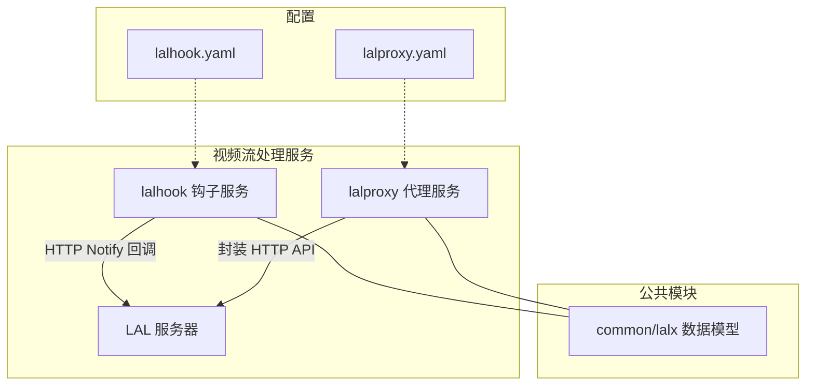
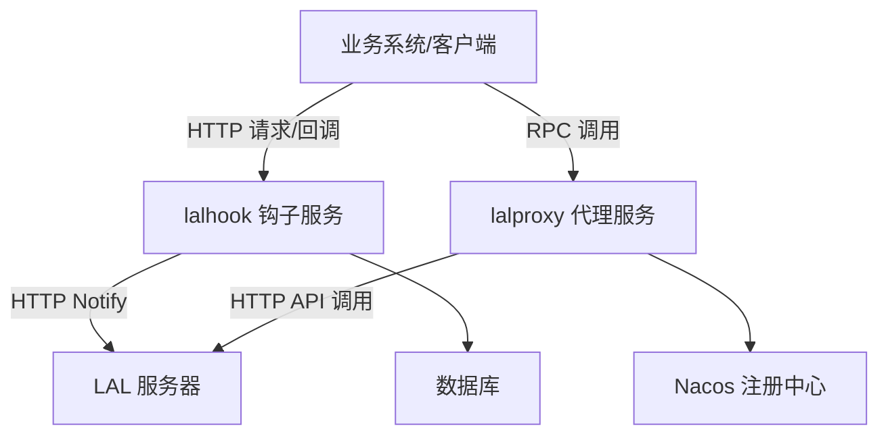
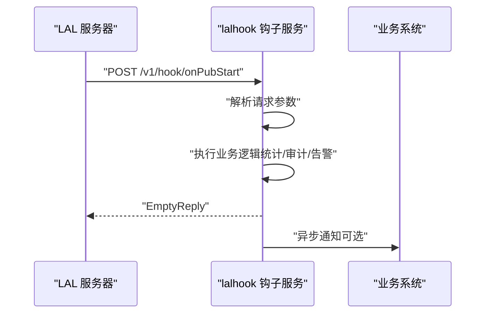
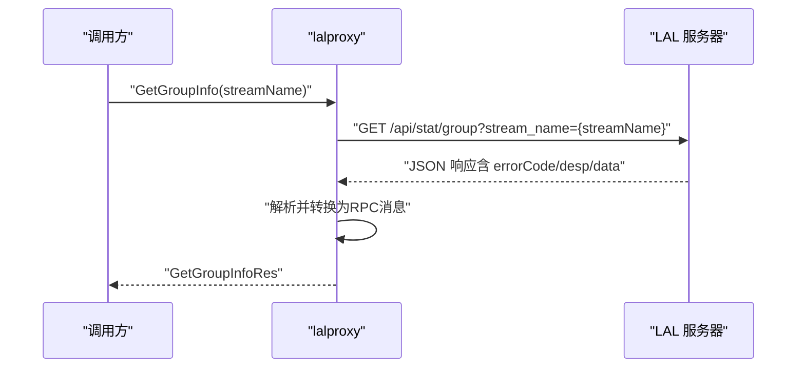
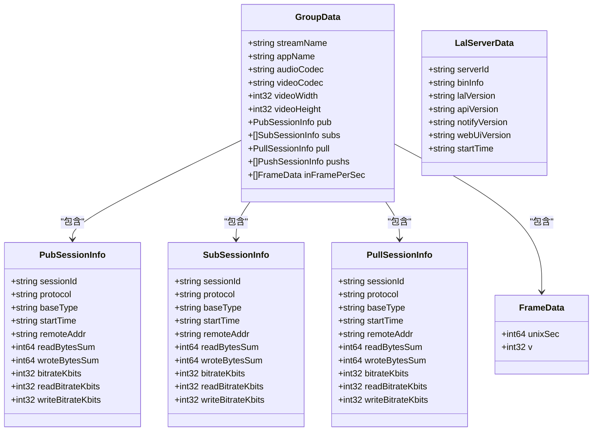
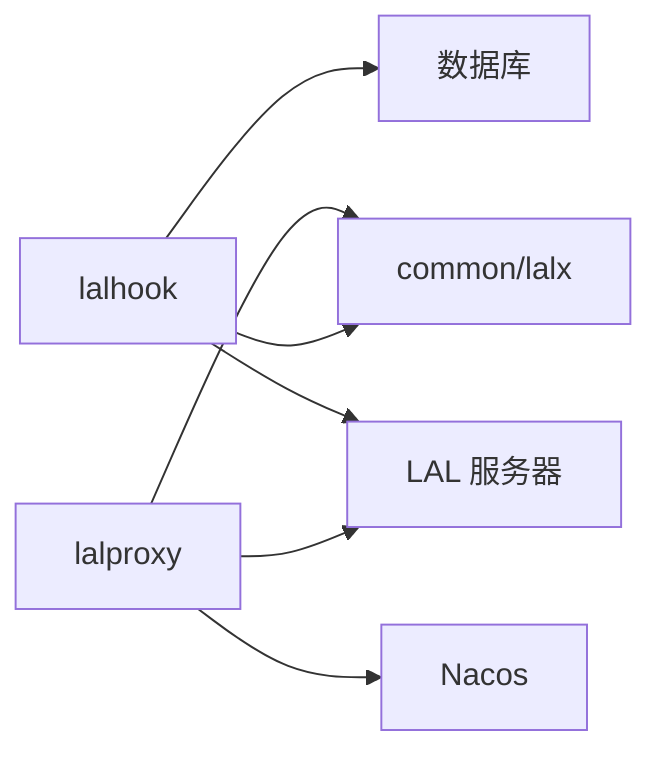

# 视频流处理服务

<cite>
**本文引用的文件**
- [lalhook.api](file://app/lalhook/lalhook.api)
- [lalhook.yaml](file://app/lalhook/etc/lalhook.yaml)
- [lalhook.go](file://app/lalhook/lalhook.go)
- [onpubstartlogic.go](file://app/lalhook/internal/logic/webhook/onpubstartlogic.go)
- [onsubstartlogic.go](file://app/lalhook/internal/logic/webhook/onsubstartlogic.go)
- [onrtmpconnectlogic.go](file://app/lalhook/internal/logic/webhook/onrtmpconnectlogic.go)
- [config.go](file://app/lalhook/internal/config/config.go)
- [laltype.go](file://common/lalx/laltype.go)
- [lalproxy.proto](file://app/lalproxy/lalproxy.proto)
- [lalproxy.yaml](file://app/lalproxy/etc/lalproxy.yaml)
- [getgroupinfologic.go](file://app/lalproxy/internal/logic/getgroupinfologic.go)
- [config.go](file://app/lalproxy/internal/config/config.go)
</cite>

## 目录
1. [简介](#简介)
2. [项目结构](#项目结构)
3. [核心组件](#核心组件)
4. [架构总览](#架构总览)
5. [详细组件分析](#详细组件分析)
6. [依赖分析](#依赖分析)
7. [性能考虑](#性能考虑)
8. [故障排查指南](#故障排查指南)
9. [结论](#结论)
10. [附录](#附录)

## 简介
本文件面向Zero-Service的视频流处理服务，围绕LAL（Live Access Library）视频服务器的架构与实现进行系统化说明，重点覆盖以下方面：
- LAL视频服务器的RTMP推流、HTTP-FLV拉流、HLS直播能力与事件回调
- lalhook钩子服务如何处理关键事件（on_pub_start、on_sub_start、on_rtmp_connect、on_server_start、on_hls_make_ts等）
- lalproxy代理服务如何封装并调用LAL HTTP API，实现查询与控制能力
- 视频流配置、性能调优、错误处理的最佳实践
- 实际部署配置与监控方案建议

## 项目结构
本项目采用多应用分层组织，视频流处理相关的核心模块如下：
- lalhook：接收LAL HTTP Notify回调，处理推流、拉流、回源、HLS分片等事件
- lalproxy：封装LAL HTTP API为RPC接口，提供查询与控制能力
- common/lalx：定义LAL数据模型与结构，统一前后端交互数据格式
- 配置文件：分别位于各应用的etc目录，包含网络、日志、数据库、Nacos注册等参数

图表来源
- [lalhook.api:200-245](file://app/lalhook/lalhook.api#L200-L245)
- [lalproxy.proto:288-308](file://app/lalproxy/lalproxy.proto#L288-L308)
- [laltype.go:1-126](file://common/lalx/laltype.go#L1-L126)
- [lalhook.yaml:1-10](file://app/lalhook/etc/lalhook.yaml#L1-L10)
- [lalproxy.yaml:1-19](file://app/lalproxy/etc/lalproxy.yaml#L1-L19)

章节来源
- [lalhook.api:1-280](file://app/lalhook/lalhook.api#L1-L280)
- [lalproxy.proto:1-308](file://app/lalproxy/lalproxy.proto#L1-L308)
- [laltype.go:1-126](file://common/lalx/laltype.go#L1-L126)
- [lalhook.yaml:1-10](file://app/lalhook/etc/lalhook.yaml#L1-L10)
- [lalproxy.yaml:1-19](file://app/lalproxy/etc/lalproxy.yaml#L1-L19)

## 核心组件
- lalhook钩子服务
  - 提供HTTP回调接口，接收LAL推送的各类事件通知，如推流开始/停止、拉流开始/停止、RTMP连接、服务器启动、HLS分片生成等
  - 通过API定义明确事件结构与路由，便于业务系统接入与扩展
- lalproxy代理服务
  - 将LAL HTTP API（/api/stat 与 /api/ctrl）映射为RPC接口，便于在微服务环境中统一调用
  - 提供查询单流信息、查询所有活跃流、查询服务器基础信息、启动/停止中继拉流、踢出会话、启动/停止GB28181 RTP端口、添加HLS黑名单等能力
- common/lalx数据模型
  - 统一定义GroupData、Pub/Sub/Pull会话信息、帧率统计等结构，确保lalhook与lalproxy之间的数据一致性

章节来源
- [lalhook.api:200-245](file://app/lalhook/lalhook.api#L200-L245)
- [lalproxy.proto:288-308](file://app/lalproxy/lalproxy.proto#L288-L308)
- [laltype.go:88-126](file://common/lalx/laltype.go#L88-L126)

## 架构总览
下图展示了Zero-Service中视频流处理服务的整体架构：lalhook负责事件回调，lalproxy负责API封装与控制，二者均依赖common/lalx的数据模型，并通过配置文件进行运行时参数管理。

图表来源
- [lalhook.api:200-245](file://app/lalhook/lalhook.api#L200-L245)
- [lalproxy.proto:288-308](file://app/lalproxy/lalproxy.proto#L288-L308)
- [lalhook.yaml:1-10](file://app/lalhook/etc/lalhook.yaml#L1-L10)
- [lalproxy.yaml:9-18](file://app/lalproxy/etc/lalproxy.yaml#L9-L18)

## 详细组件分析

### lalhook 钩子服务
- 事件接口与数据模型
  - 提供onUpdate、onPubStart、onPubStop、onSubStart、onSubStop、onRelayPullStart、onRelayPullStop、onRtmpConnect、onServerStart、onHlsMakeTs等回调接口
  - 请求参数结构在API文件中明确定义，便于业务侧按需扩展与持久化
- 处理流程（以典型事件为例）
  - 推流开始（onPubStart）：解析请求参数，校验必要字段，执行业务逻辑（如统计、告警、审计），返回空响应
  - 拉流开始（onSubStart）：解析请求参数，记录拉流会话信息，触发后续统计或鉴权
  - RTMP连接（onRtmpConnect）：记录连接对端地址、应用名、tcUrl等，用于风控或审计
  - 服务器启动（onServerStart）：记录LAL版本、编译信息、启动时间等，便于运维监控
  - HLS分片生成（onHlsMakeTs）：记录TS分片事件、文件路径、时长、时间戳等，支撑媒资归档与播放统计
- 数据模型
  - 使用common/lalx中的GroupData、PubSessionInfo、SubSessionInfo、PullSessionInfo、FrameData等结构，保证与LAL返回数据一致

图表来源
- [lalhook.api:210-216](file://app/lalhook/lalhook.api#L210-L216)
- [onpubstartlogic.go:27-31](file://app/lalhook/internal/logic/webhook/onpubstartlogic.go#L27-L31)

章节来源
- [lalhook.api:67-198](file://app/lalhook/lalhook.api#L67-L198)
- [onpubstartlogic.go:1-32](file://app/lalhook/internal/logic/webhook/onpubstartlogic.go#L1-L32)
- [onsubstartlogic.go:1-32](file://app/lalhook/internal/logic/webhook/onsubstartlogic.go#L1-L32)
- [onrtmpconnectlogic.go:1-32](file://app/lalhook/internal/logic/webhook/onrtmpconnectlogic.go#L1-L32)
- [laltype.go:88-126](file://common/lalx/laltype.go#L88-L126)

### lalproxy 代理服务
- RPC接口设计
  - GetGroupInfo：查询指定流的分组信息
  - GetAllGroups：查询所有活跃分组
  - GetLalInfo：查询LAL服务器基础信息
  - StartRelayPull/StopRelayPull：启动/停止中继拉流
  - KickSession：踢出会话（支持pub/sub/pull）
  - StartRtpPub/StopRtpPub：启动/停止GB28181 RTP端口（部分接口按文档说明暂未开放）
  - AddIpBlacklist：为HLS协议添加IP黑名单
- 调用链路
  - lalproxy内部逻辑通过HTTP客户端调用LAL HTTP API，解析响应并转换为RPC消息结构
  - 错误码与描述遵循LAL HTTP API规范，便于统一处理
- 配置要点
  - LalServer.Ip/Port/Timeout：LAL服务器地址与超时
  - NacosConfig：服务注册与发现配置

图表来源
- [lalproxy.proto:138-165](file://app/lalproxy/lalproxy.proto#L138-L165)
- [getgroupinfologic.go:33-86](file://app/lalproxy/internal/logic/getgroupinfologic.go#L33-L86)

章节来源
- [lalproxy.proto:288-308](file://app/lalproxy/lalproxy.proto#L288-L308)
- [getgroupinfologic.go:1-87](file://app/lalproxy/internal/logic/getgroupinfologic.go#L1-L87)
- [lalproxy.yaml:1-19](file://app/lalproxy/etc/lalproxy.yaml#L1-L19)

### 数据模型与结构
- GroupData：聚合流的编码信息、发布/订阅/回源/转推会话、帧率统计等
- Pub/Sub/Pull会话信息：包含会话ID、协议、起始时间、对端地址、累计收发字节数、最近5秒码率等
- FrameData：最近32秒每秒视频帧数统计
- LalServerData：LAL服务器基础信息（版本、启动时间等）

图表来源
- [laltype.go:88-126](file://common/lalx/laltype.go#L88-L126)

章节来源
- [laltype.go:1-126](file://common/lalx/laltype.go#L1-L126)

## 依赖分析
- lalhook与lalproxy均依赖common/lalx的数据模型，确保事件与查询结果的一致性
- lalhook通过HTTP回调与LAL交互，lalproxy通过HTTP API与LAL交互
- lalproxy可选集成Nacos进行服务注册与发现
- lalhook与lalproxy各自维护独立配置文件，分别控制网络、日志、数据库等参数

图表来源
- [lalhook.api:200-245](file://app/lalhook/lalhook.api#L200-L245)
- [lalproxy.proto:288-308](file://app/lalproxy/lalproxy.proto#L288-L308)
- [lalhook.yaml:1-10](file://app/lalhook/etc/lalhook.yaml#L1-L10)
- [lalproxy.yaml:9-18](file://app/lalproxy/etc/lalproxy.yaml#L9-L18)

章节来源
- [lalhook.yaml:1-10](file://app/lalhook/etc/lalhook.yaml#L1-L10)
- [lalproxy.yaml:1-19](file://app/lalproxy/etc/lalproxy.yaml#L1-L19)

## 性能考虑
- 事件回调处理
  - 在lalhook中，建议对高频事件（如onUpdate、onHlsMakeTs）采用异步处理与批量落库，避免阻塞HTTP回调线程
  - 对RTMP连接、推流/拉流开始等事件，优先进行轻量级校验与快速响应，复杂逻辑放入后台任务队列
- API调用优化
  - lalproxy在调用LAL HTTP API时，建议设置合理的超时与重试策略，避免单次失败影响整体可用性
  - 对查询类接口（如GetAllGroups）可结合缓存策略减少频繁调用
- 资源与并发
  - 控制并发请求数与连接池大小，防止LAL或下游数据库过载
  - 对HLS分片生成事件，建议采用流式写入与分批归档，降低IO压力

## 故障排查指南
- lalhook常见问题
  - 回调未到达：检查LAL配置的Notify URL是否正确指向lalhook，确认网络连通与防火墙放行
  - 参数解析失败：核对请求体结构与字段命名，确保与API定义一致
  - 数据落库异常：检查数据库连接串与权限，关注事务与幂等性设计
- lalproxy常见问题
  - HTTP API调用失败：确认LalServer.Ip/Port/Timeout配置正确，检查LAL服务状态
  - 错误码不一致：对照lalproxy.proto中的错误码定义，定位具体失败原因（如参数缺失、会话不存在等）
- 通用排查步骤
  - 查看服务日志（Hook与Proxy的日志级别与输出路径）
  - 使用curl或Postman验证HTTP API与回调接口
  - 关注数据库与Nacos状态，确保依赖组件正常运行

章节来源
- [getgroupinfologic.go:43-56](file://app/lalproxy/internal/logic/getgroupinfologic.go#L43-L56)
- [lalhook.yaml:1-10](file://app/lalhook/etc/lalhook.yaml#L1-L10)
- [lalproxy.yaml:1-19](file://app/lalproxy/etc/lalproxy.yaml#L1-L19)

## 结论
通过lalhook与lalproxy的协同，Zero-Service实现了对LAL视频服务器的事件感知与统一控制。lalhook专注于实时事件处理，lalproxy提供稳定的RPC封装，common/lalx确保数据一致性。配合合理的配置与监控，可在生产环境中稳定支撑RTMP推流、HTTP-FLV拉流与HLS直播等场景。

## 附录
- 部署配置建议
  - lalhook：监听端口、日志编码、超时、数据库连接串等参数在lalhook.yaml中配置
  - lalproxy：监听地址、日志级别、Nacos注册、LAL服务器地址与超时等在lalproxy.yaml中配置
- 监控方案建议
  - 指标：事件回调QPS、延迟、错误率；LAL API调用成功率与耗时；数据库写入延迟
  - 告警：回调失败、API异常、HLS分片生成异常、会话异常增长
  - 日志：按天切割、保留周期、敏感信息脱敏