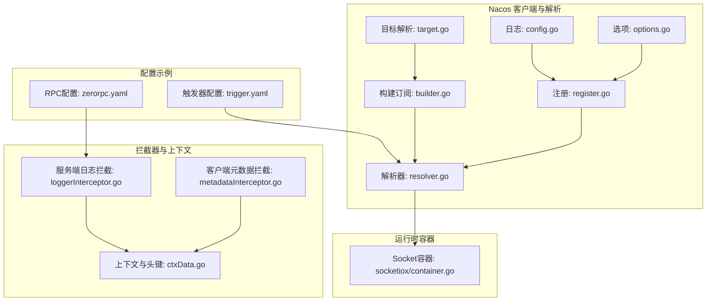
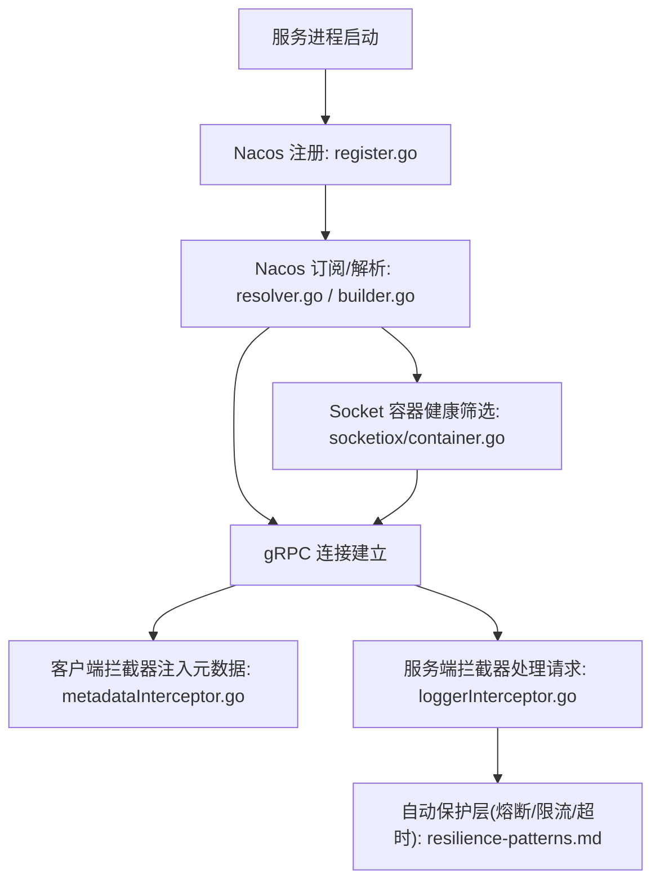
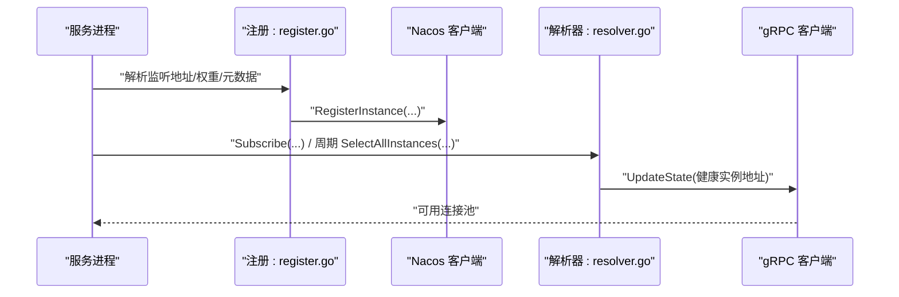
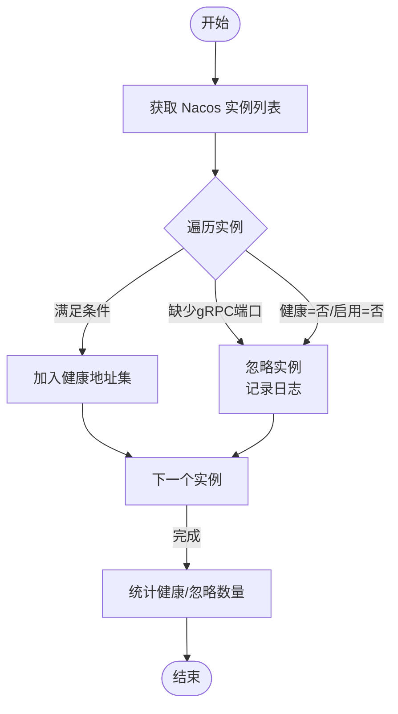
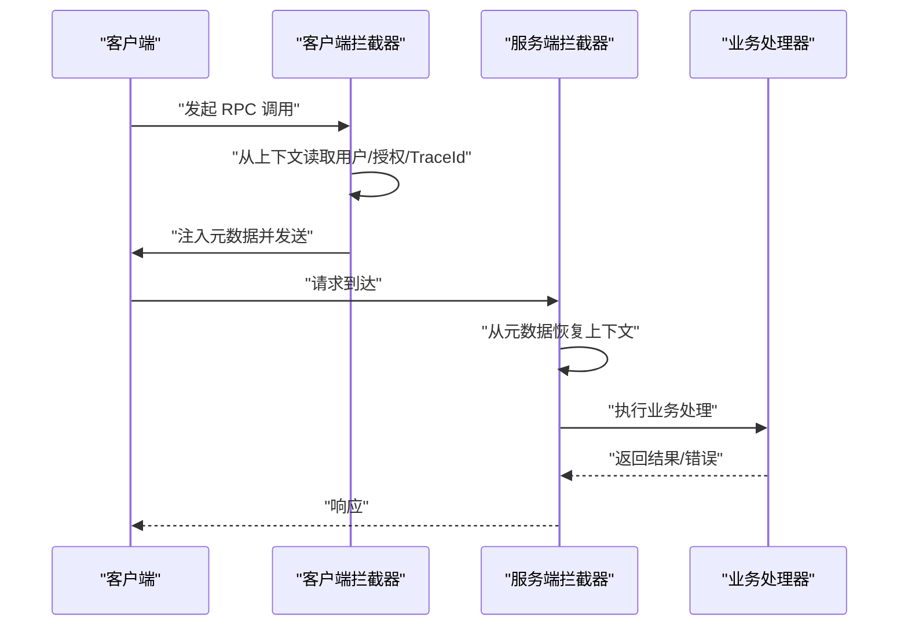
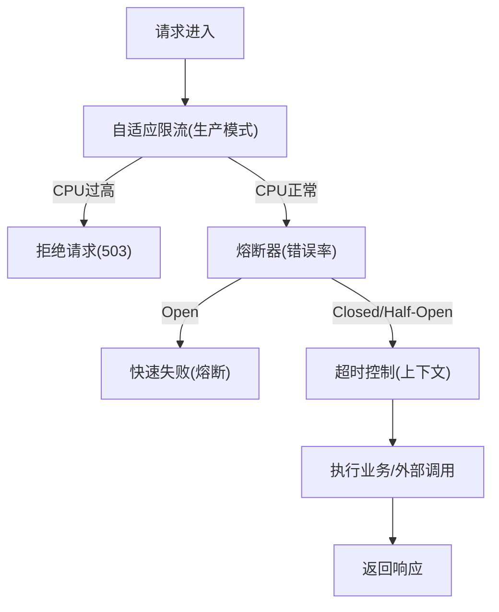

# 服务发现与治理模式

<cite>
**本文引用的文件**
- [common/nacosx/register.go](file://common/nacosx/register.go)
- [common/nacosx/resolver.go](file://common/nacosx/resolver.go)
- [common/nacosx/builder.go](file://common/nacosx/builder.go)
- [common/nacosx/options.go](file://common/nacosx/options.go)
- [common/nacosx/target.go](file://common/nacosx/target.go)
- [common/nacosx/config.go](file://common/nacosx/config.go)
- [common/socketiox/container.go](file://common/socketiox/container.go)
- [common/Interceptor/rpcclient/metadataInterceptor.go](file://common/Interceptor/rpcclient/metadataInterceptor.go)
- [common/Interceptor/rpcserver/loggerInterceptor.go](file://common/Interceptor/rpcserver/loggerInterceptor.go)
- [common/ctxdata/ctxData.go](file://common/ctxdata/ctxData.go)
- [app/trigger/etc/trigger.yaml](file://app/trigger/etc/trigger.yaml)
- [zerorpc/etc/zerorpc.yaml](file://zerorpc/etc/zerorpc.yaml)
- [.trae/skills/zero-skills/references/resilience-patterns.md](file://.trae/skills/zero-skills/references/resilience-patterns.md)
- [.trae/skills/zero-skills/references/rpc-patterns.md](file://.trae/skills/zero-skills/references/rpc-patterns.md)
- [.trae/skills/zero-skills/best-practices/overview.md](file://.trae/skills/zero-skills/best-practices/overview.md)
- [deploy/stat_analyzer.html](file://deploy/stat_analyzer.html)
</cite>

## 目录
1. [引言](#引言)
2. [项目结构](#项目结构)
3. [核心组件](#核心组件)
4. [架构总览](#架构总览)
5. [详细组件分析](#详细组件分析)
6. [依赖分析](#依赖分析)
7. [性能考量](#性能考量)
8. [故障排查指南](#故障排查指南)
9. [结论](#结论)
10. [附录](#附录)

## 引言
本文件系统性阐述 Zero-Service 的服务发现与治理模式，重点覆盖：
- 基于 Nacos 的服务注册与发现机制
- 负载均衡策略与健康实例筛选
- 熔断降级、超时与自适应限流（基于生产模式的自动保护层）
- 服务间通信的安全控制、权限验证与流量治理
- 健康检查、故障转移与自动扩缩容策略
- 最佳实践与监控方案
- 服务拆分的决策依据与演进策略

## 项目结构
围绕服务发现与治理的关键代码位于以下模块：
- Nacos 客户端封装与解析器：common/nacosx
- gRPC 客户端元数据拦截器与服务端日志拦截器：common/Interceptor
- 上下文与跨服务传递的元数据键：common/ctxdata
- Socket 容器对 Nacos 实例的健康筛选与地址提取：common/socketiox
- 典型服务配置示例：app/trigger/etc、zerorpc/etc
- 生态与最佳实践文档：.trae/skills/zero-skills



图表来源
- [common/nacosx/register.go:1-99](file://common/nacosx/register.go#L1-L99)
- [common/nacosx/resolver.go:1-74](file://common/nacosx/resolver.go#L1-L74)
- [common/nacosx/builder.go:41-85](file://common/nacosx/builder.go#L41-L85)
- [common/nacosx/options.go:1-72](file://common/nacosx/options.go#L1-L72)
- [common/nacosx/target.go:1-80](file://common/nacosx/target.go#L1-L80)
- [common/nacosx/config.go:1-38](file://common/nacosx/config.go#L1-L38)
- [common/socketiox/container.go:318-356](file://common/socketiox/container.go#L318-L356)
- [common/Interceptor/rpcclient/metadataInterceptor.go:1-56](file://common/Interceptor/rpcclient/metadataInterceptor.go#L1-L56)
- [common/Interceptor/rpcserver/loggerInterceptor.go:1-44](file://common/Interceptor/rpcserver/loggerInterceptor.go#L1-L44)
- [common/ctxdata/ctxData.go:1-76](file://common/ctxdata/ctxData.go#L1-L76)
- [app/trigger/etc/trigger.yaml:1-37](file://app/trigger/etc/trigger.yaml#L1-L37)
- [zerorpc/etc/zerorpc.yaml:1-39](file://zerorpc/etc/zerorpc.yaml#L1-L39)

章节来源
- [common/nacosx/register.go:1-99](file://common/nacosx/register.go#L1-L99)
- [common/nacosx/resolver.go:1-74](file://common/nacosx/resolver.go#L1-L74)
- [common/nacosx/builder.go:41-85](file://common/nacosx/builder.go#L41-L85)
- [common/nacosx/options.go:1-72](file://common/nacosx/options.go#L1-L72)
- [common/nacosx/target.go:1-80](file://common/nacosx/target.go#L1-L80)
- [common/nacosx/config.go:1-38](file://common/nacosx/config.go#L1-L38)
- [common/socketiox/container.go:318-356](file://common/socketiox/container.go#L318-L356)
- [common/Interceptor/rpcclient/metadataInterceptor.go:1-56](file://common/Interceptor/rpcclient/metadataInterceptor.go#L1-L56)
- [common/Interceptor/rpcserver/loggerInterceptor.go:1-44](file://common/Interceptor/rpcserver/loggerInterceptor.go#L1-L44)
- [common/ctxdata/ctxData.go:1-76](file://common/ctxdata/ctxData.go#L1-L76)
- [app/trigger/etc/trigger.yaml:1-37](file://app/trigger/etc/trigger.yaml#L1-L37)
- [zerorpc/etc/zerorpc.yaml:1-39](file://zerorpc/etc/zerorpc.yaml#L1-L39)

## 核心组件
- Nacos 注册与注销：负责服务实例在 Nacos 中的注册、权重、健康状态、元数据与集群/分组信息，并在进程退出时自动反注册。
- Nacos 解析器与订阅：通过 gRPC resolver 将 Nacos 返回的健康实例转换为连接地址列表，支持回调与周期拉取，保障地址变更实时生效。
- Nacos 构建与目标解析：从 nacos:// 协议 URL 解析主机、服务名、命名空间、鉴权、超时、日志与缓存目录等参数，统一初始化客户端配置。
- Socket 容器健康实例筛选：从 Nacos 实例中过滤出具备 gRPC 端口、健康且启用的实例，形成可直连的地址集合。
- gRPC 拦截器与上下文：客户端拦截器将用户标识、授权令牌、跟踪 ID 等注入到元数据；服务端拦截器从元数据恢复上下文并记录错误。
- 配置示例：触发器与 RPC 服务的配置展示了 Nacos 注册开关、服务名、端点、超时、日志与鉴权等关键项。

章节来源
- [common/nacosx/register.go:21-76](file://common/nacosx/register.go#L21-L76)
- [common/nacosx/resolver.go:13-74](file://common/nacosx/resolver.go#L13-L74)
- [common/nacosx/builder.go:41-85](file://common/nacosx/builder.go#L41-L85)
- [common/nacosx/target.go:30-80](file://common/nacosx/target.go#L30-L80)
- [common/socketiox/container.go:318-356](file://common/socketiox/container.go#L318-L356)
- [common/Interceptor/rpcclient/metadataInterceptor.go:11-32](file://common/Interceptor/rpcclient/metadataInterceptor.go#L11-L32)
- [common/Interceptor/rpcserver/loggerInterceptor.go:12-44](file://common/Interceptor/rpcserver/loggerInterceptor.go#L12-L44)
- [common/ctxdata/ctxData.go:9-24](file://common/ctxdata/ctxData.go#L9-L24)
- [app/trigger/etc/trigger.yaml:11-37](file://app/trigger/etc/trigger.yaml#L11-L37)
- [zerorpc/etc/zerorpc.yaml:13-39](file://zerorpc/etc/zerorpc.yaml#L13-L39)

## 架构总览
下图展示从服务启动到运行期治理的全链路：注册、发现、拦截、健康筛选与自动保护层协同工作。



图表来源
- [common/nacosx/register.go:21-76](file://common/nacosx/register.go#L21-L76)
- [common/nacosx/resolver.go:13-74](file://common/nacosx/resolver.go#L13-L74)
- [common/nacosx/builder.go:41-85](file://common/nacosx/builder.go#L41-L85)
- [common/socketiox/container.go:318-356](file://common/socketiox/container.go#L318-L356)
- [common/Interceptor/rpcclient/metadataInterceptor.go:11-32](file://common/Interceptor/rpcclient/metadataInterceptor.go#L11-L32)
- [common/Interceptor/rpcserver/loggerInterceptor.go:12-44](file://common/Interceptor/rpcserver/loggerInterceptor.go#L12-L44)
- [.trae/skills/zero-skills/references/resilience-patterns.md:1-696](file://.trae/skills/zero-skills/references/resilience-patterns.md#L1-L696)

## 详细组件分析

### Nacos 服务注册与发现
- 注册流程：根据监听地址解析 IP 与端口，使用客户端配置注册到指定命名空间、集群与分组，设置健康与权重，携带元数据。
- 反注册：通过进程关闭钩子在退出时自动反注册，确保 Nacos 中实例及时清理。
- 解析器：接收 Nacos 回调与周期拉取的实例列表，转换为 gRPC 地址并排序更新，避免重复地址列表导致负载均衡器不更新。
- 目标解析：从 nacos:// URL 解析主机、服务名、鉴权、命名空间、超时、日志与缓存目录等参数，支持环境变量覆盖。
- 日志：统一初始化 Nacos SDK 日志级别与输出位置。



图表来源
- [common/nacosx/register.go:21-76](file://common/nacosx/register.go#L21-L76)
- [common/nacosx/resolver.go:47-66](file://common/nacosx/resolver.go#L47-L66)
- [common/nacosx/builder.go:78-85](file://common/nacosx/builder.go#L78-L85)

章节来源
- [common/nacosx/register.go:21-76](file://common/nacosx/register.go#L21-L76)
- [common/nacosx/resolver.go:13-74](file://common/nacosx/resolver.go#L13-L74)
- [common/nacosx/builder.go:41-85](file://common/nacosx/builder.go#L41-L85)
- [common/nacosx/target.go:30-80](file://common/nacosx/target.go#L30-L80)
- [common/nacosx/config.go:15-37](file://common/nacosx/config.go#L15-L37)

### Socket 容器健康实例筛选
- 从 Nacos 返回的实例中过滤：
  - 必须存在 gRPC 端口元数据
  - 必须健康且启用
- 统计忽略与健康实例数量，便于观测与排障
- 支持随机打散与子集选取，便于后续负载均衡



图表来源
- [common/socketiox/container.go:318-356](file://common/socketiox/container.go#L318-L356)

章节来源
- [common/socketiox/container.go:318-356](file://common/socketiox/container.go#L318-L356)

### gRPC 拦截器与安全控制
- 客户端拦截器：从上下文提取用户标识、用户名、部门编码、授权令牌、跟踪 ID，注入到出站元数据，便于下游服务透传与审计。
- 服务端拦截器：从入站元数据恢复上下文键值，统一记录错误日志，便于定位与追踪。
- 权限验证：结合服务端拦截器与业务逻辑，可在服务端对授权令牌进行校验，拒绝未认证或无效令牌的请求。
- 流量治理：通过拦截器统一注入 TraceId、请求 ID 等，支撑分布式追踪与灰度路由。



图表来源
- [common/Interceptor/rpcclient/metadataInterceptor.go:11-32](file://common/Interceptor/rpcclient/metadataInterceptor.go#L11-L32)
- [common/Interceptor/rpcserver/loggerInterceptor.go:12-44](file://common/Interceptor/rpcserver/loggerInterceptor.go#L12-L44)
- [common/ctxdata/ctxData.go:9-24](file://common/ctxdata/ctxData.go#L9-L24)

章节来源
- [common/Interceptor/rpcclient/metadataInterceptor.go:11-32](file://common/Interceptor/rpcclient/metadataInterceptor.go#L11-L32)
- [common/Interceptor/rpcserver/loggerInterceptor.go:12-44](file://common/Interceptor/rpcserver/loggerInterceptor.go#L12-L44)
- [common/ctxdata/ctxData.go:9-24](file://common/ctxdata/ctxData.go#L9-L24)

### 负载均衡策略
- 健康实例优先：仅向健康且启用的实例发起请求，降低失败率与重试成本。
- 地址排序与去重：解析器对地址进行排序与去重，避免负载均衡器因相同地址列表不更新而失效。
- 随机打散与子集选取：Socket 容器支持随机打散与按子集选取，提升多副本场景下的均匀分布。
- 与自动保护层配合：在高负载或异常情况下，自动保护层会限制请求进入，避免雪崩。

章节来源
- [common/nacosx/resolver.go:47-66](file://common/nacosx/resolver.go#L47-L66)
- [common/socketiox/container.go:348-356](file://common/socketiox/container.go#L348-L356)

### 熔断降级与超时治理
- 自动熔断：针对 RPC、数据库、Redis、HTTP 客户端调用默认启用熔断器，基于错误率阈值自动打开/半开/关闭。
- 自适应限流：在生产模式下自动启用，基于 CPU 使用率动态拒绝请求，防止过载。
- 超时传播：通过上下文与客户端配置设置请求超时，避免长时间阻塞。
- 手动熔断：对特定外部调用显式使用熔断器，结合可接受错误类型进行细粒度控制。



图表来源
- [.trae/skills/zero-skills/references/resilience-patterns.md:1-696](file://.trae/skills/zero-skills/references/resilience-patterns.md#L1-L696)

章节来源
- [.trae/skills/zero-skills/references/resilience-patterns.md:1-696](file://.trae/skills/zero-skills/references/resilience-patterns.md#L1-L696)

### 健康检查、故障转移与自动扩缩容
- 健康检查：Nacos 实例健康字段与启用字段共同决定是否纳入连接池；Socket 容器进一步过滤 gRPC 端口。
- 故障转移：当实例不可用或熔断打开时，请求被快速失败或被限流拒绝，避免放大效应。
- 自动扩缩容：建议结合 Kubernetes Deployment 的副本数与探针配置，配合 Nacos 注册与解析器，实现弹性伸缩与流量切换。

章节来源
- [common/socketiox/container.go:318-356](file://common/socketiox/container.go#L318-L356)
- [.trae/skills/zero-skills/best-practices/overview.md:697-754](file://.trae/skills/zero-skills/best-practices/overview.md#L697-L754)

### 监控与可观测性
- 关键指标：熔断器请求总量与状态变化、限流拒绝总数、CPU 使用率、超时次数、请求耗时分位。
- 日志：熔断器事件、限流告警、超时错误、服务端错误统一记录，便于定位。
- 分析工具：部署侧提供日志统计分析页面，支持按分钟聚合 CPU、QPS、丢弃与限流次数等指标。

章节来源
- [.trae/skills/zero-skills/references/resilience-patterns.md:621-690](file://.trae/skills/zero-skills/references/resilience-patterns.md#L621-L690)
- [deploy/stat_analyzer.html:862-1307](file://deploy/stat_analyzer.html#L862-L1307)

## 依赖分析
- 组件内聚与耦合
  - nacosx 模块内部职责清晰：注册、解析、目标解析、日志与选项，彼此通过统一的客户端配置协作。
  - 拦截器与上下文解耦业务逻辑，通过元数据传递用户与追踪信息。
  - Socket 容器依赖 Nacos 解析器提供的健康实例列表，形成“发现—筛选—连接”的闭环。
- 外部依赖
  - Nacos SDK：用于注册、订阅与实例查询。
  - gRPC：用于服务间通信与 resolver 更新。
  - go-zero 生态：自动保护层（熔断/限流/超时）与日志框架。

```mermaid
graph LR
NacosSDK["Nacos SDK"] <- --> REG["register.go"]
NacosSDK <- --> RES["resolver.go"]
GRPC["gRPC"] <- --> RES
GRPC <- --> CLIINT["metadataInterceptor.go"]
GRPC <- --> SRVINT["loggerInterceptor.go"]
REG --> RES
RES --> SOCK["socketiox/container.go"]
```

图表来源
- [common/nacosx/register.go:21-76](file://common/nacosx/register.go#L21-L76)
- [common/nacosx/resolver.go:13-74](file://common/nacosx/resolver.go#L13-L74)
- [common/Interceptor/rpcclient/metadataInterceptor.go:11-32](file://common/Interceptor/rpcclient/metadataInterceptor.go#L11-L32)
- [common/Interceptor/rpcserver/loggerInterceptor.go:12-44](file://common/Interceptor/rpcserver/loggerInterceptor.go#L12-L44)
- [common/socketiox/container.go:318-356](file://common/socketiox/container.go#L318-L356)

## 性能考量
- 注册与反注册：避免频繁注册/反注册，合理设置权重与元数据，减少 Nacos 写压力。
- 解析器更新：排序与去重避免重复更新，降低负载均衡器抖动。
- 健康筛选：优先健康实例，减少失败重试与熔断触发。
- 自动保护层：在高负载时主动限流，避免级联故障；结合 CPU 探针与副本数弹性扩缩容。
- 日志与指标：合理设置日志级别与采样，避免 IO 抖动。

## 故障排查指南
- 无法连接到 Nacos
  - 检查 URL 参数与鉴权、命名空间、超时设置
  - 查看 Nacos 日志初始化与目录配置
- 实例未出现在连接池
  - 确认实例健康与启用状态
  - 确认实例元数据包含 gRPC 端口
- 请求被限流或熔断
  - 查看 CPU 使用率与限流日志
  - 检查熔断器状态与错误率
- 跨服务追踪缺失
  - 确认客户端拦截器正确注入 TraceId
  - 确认服务端拦截器正确恢复上下文

章节来源
- [common/nacosx/target.go:30-80](file://common/nacosx/target.go#L30-L80)
- [common/nacosx/config.go:15-37](file://common/nacosx/config.go#L15-L37)
- [common/socketiox/container.go:318-356](file://common/socketiox/container.go#L318-L356)
- [.trae/skills/zero-skills/references/resilience-patterns.md:621-690](file://.trae/skills/zero-skills/references/resilience-patterns.md#L621-L690)
- [common/Interceptor/rpcclient/metadataInterceptor.go:11-32](file://common/Interceptor/rpcclient/metadataInterceptor.go#L11-L32)
- [common/Interceptor/rpcserver/loggerInterceptor.go:12-44](file://common/Interceptor/rpcserver/loggerInterceptor.go#L12-L44)

## 结论
Zero-Service 通过 Nacos 实现稳定的服务注册与发现，结合 gRPC 解析器与健康筛选，形成可靠的连接池；借助拦截器与上下文，实现跨服务的安全与可观测；在生产模式下自动启用熔断、限流与超时保护，显著提升系统韧性。配合健康检查、故障转移与弹性扩缩容策略，可实现高可用与高性能的微服务体系。

## 附录
- 服务拆分决策依据
  - 业务边界清晰、独立演进与部署
  - 数据一致性与事务范围
  - 团队组织与交付节奏
  - 性能与隔离需求
- 演进策略
  - 从单体逐步拆分为领域驱动的微服务
  - 以 API 网关与服务网格为边界，逐步下沉治理能力
  - 以事件驱动与异步化降低耦合
  - 持续引入混沌工程与压测，完善自动保护层