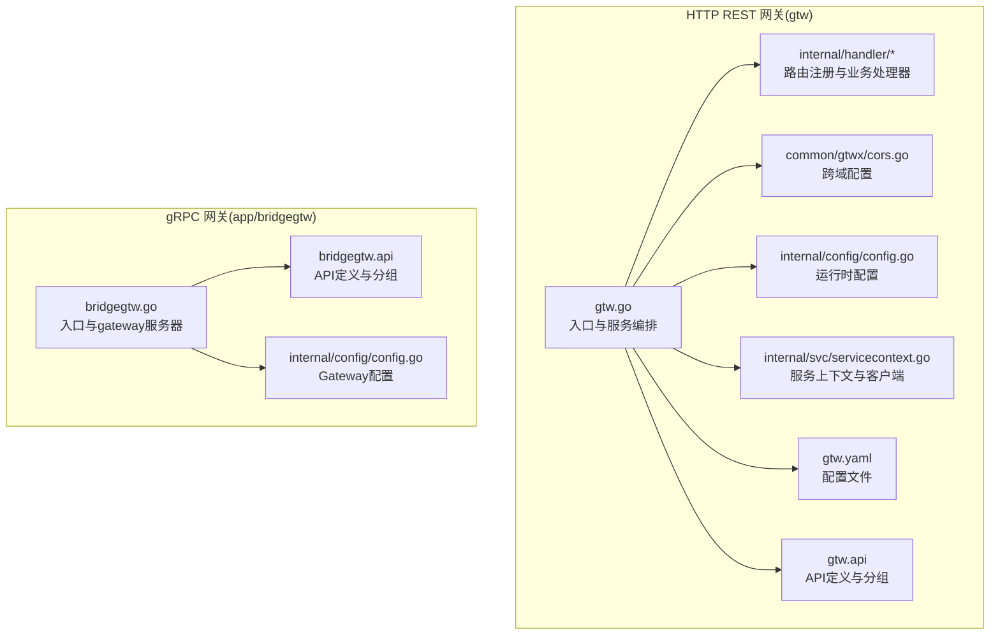
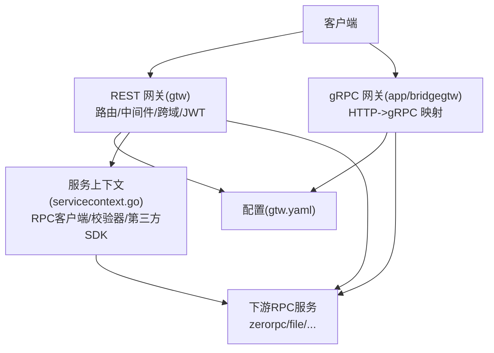
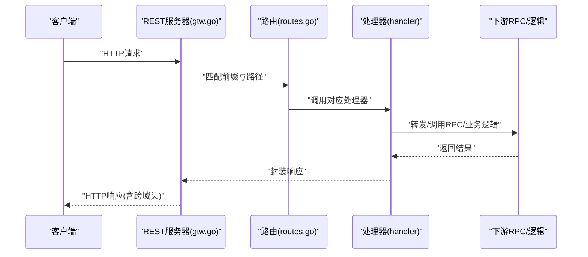
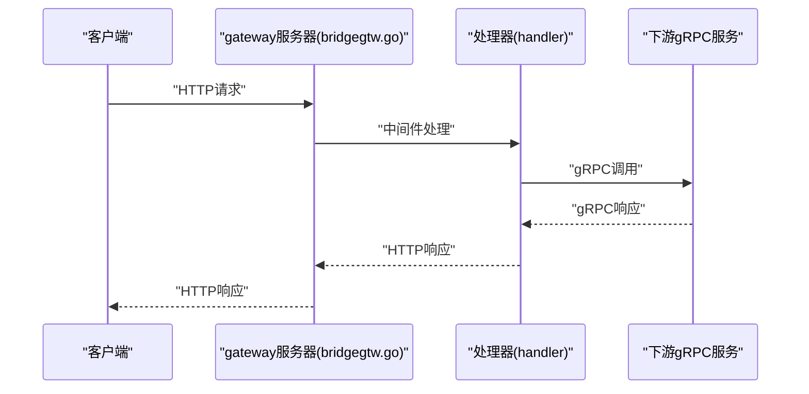
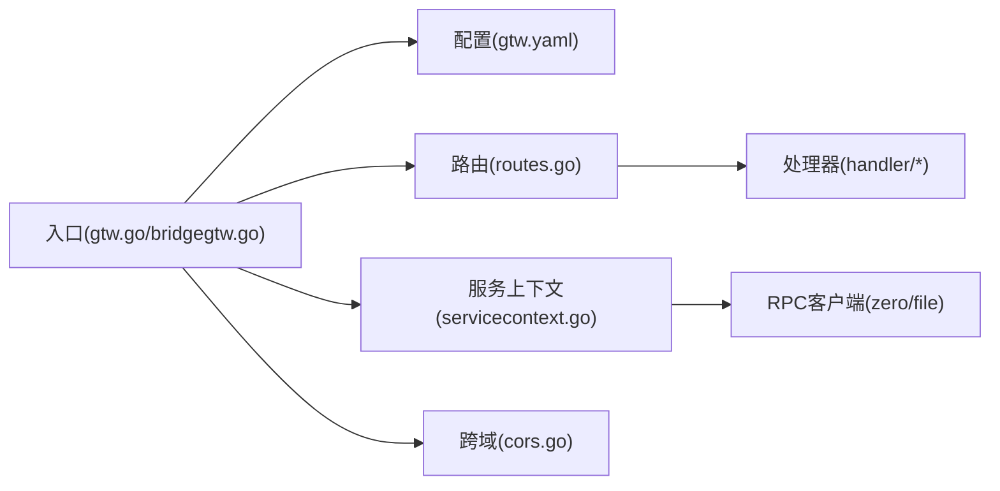

# BFF网关服务

<cite>
**本文引用的文件**
- [gtw.go](file://gtw/gtw.go)
- [gtw.api](file://gtw/gtw.api)
- [gtw.yaml](file://gtw/etc/gtw.yaml)
- [config.go](file://gtw/internal/config/config.go)
- [routes.go](file://gtw/internal/handler/routes.go)
- [cors.go](file://common/gtwx/cors.go)
- [servicecontext.go](file://gtw/internal/svc/servicecontext.go)
- [bridgegtw.go](file://app/bridgegtw/bridgegtw.go)
- [bridgegtw.api](file://app/bridgegtw/bridgegtw.api)
- [bridgegtw.config.go](file://app/bridgegtw/internal/config/config.go)
</cite>

## 目录
1. [简介](#简介)
2. [项目结构](#项目结构)
3. [核心组件](#核心组件)
4. [架构总览](#架构总览)
5. [详细组件分析](#详细组件分析)
6. [依赖分析](#依赖分析)
7. [性能考虑](#性能考虑)
8. [故障排查指南](#故障排查指南)
9. [结论](#结论)
10. [附录](#附录)

## 简介
本文件面向Zero-Service中的BFF（Backend For Frontend）网关服务，系统性阐述其设计理念、架构原理与实现细节。BFF网关在该体系中承担统一入口、协议适配、路由聚合、安全控制与治理能力的关键职责。本文覆盖以下主题：
- HTTP REST聚合与gRPC网关能力
- 请求路由、中间件与跨域处理
- 安全控制、认证授权与限流保护
- 性能优化策略与监控指标
- 扩展开发指南与自定义中间件实现

## 项目结构
BFF网关由两个主要模块构成：
- gtw：基于go-zero REST框架的HTTP网关，负责REST API聚合、路由注册、跨域与安全控制。
- app/bridgegtw：基于go-zero gateway的gRPC网关示例，展示如何通过配置实现HTTP到gRPC的映射。

图表来源
- [gtw.go:1-87](file://gtw/gtw.go#L1-L87)
- [gtw.api:1-123](file://gtw/gtw.api#L1-L123)
- [gtw.yaml:1-61](file://gtw/etc/gtw.yaml#L1-L61)
- [config.go:1-21](file://gtw/internal/config/config.go#L1-L21)
- [routes.go:1-161](file://gtw/internal/handler/routes.go#L1-L161)
- [cors.go:1-25](file://common/gtwx/cors.go#L1-L25)
- [servicecontext.go:1-66](file://gtw/internal/svc/servicecontext.go#L1-L66)
- [bridgegtw.go:1-42](file://app/bridgegtw/bridgegtw.go#L1-L42)
- [bridgegtw.api:1-21](file://app/bridgegtw/bridgegtw.api#L1-L21)
- [bridgegtw.config.go:1-8](file://app/bridgegtw/internal/config/config.go#L1-L8)

章节来源
- [gtw.go:1-87](file://gtw/gtw.go#L1-L87)
- [bridgegtw.go:1-42](file://app/bridgegtw/bridgegtw.go#L1-L42)

## 核心组件
- 入口与服务编排
  - gtw入口负责加载配置、构建REST服务器、注册路由与中间件，并可选择性添加静态资源（如Swagger）。
  - app/bridgegtw入口演示了基于gateway的gRPC网关模式，通过配置实现HTTP到gRPC方法的映射。
- 路由与API定义
  - gtw.api定义了多组REST API，按前缀分组（如用户、通用、文件、支付），并支持JWT鉴权组。
  - routes.go将API映射到具体处理器函数，并设置前缀、超时与JWT保护。
- 配置与上下文
  - gtw.yaml集中管理端口、日志、上游RPC、JWT密钥、下载地址与Swagger路径等。
  - servicecontext.go注入RPC客户端、校验器与第三方SDK（如微信支付）。
- 跨域与中间件
  - cors.go提供标准跨域响应头配置；gtw.go在启动时应用跨域选项。
  - app/bridgegtw展示了如何通过中间件包装HTTP请求。

章节来源
- [gtw.go:26-86](file://gtw/gtw.go#L26-L86)
- [gtw.api:16-123](file://gtw/gtw.api#L16-L123)
- [routes.go:20-160](file://gtw/internal/handler/routes.go#L20-L160)
- [gtw.yaml:17-61](file://gtw/etc/gtw.yaml#L17-L61)
- [servicecontext.go:23-65](file://gtw/internal/svc/servicecontext.go#L23-L65)
- [cors.go:9-24](file://common/gtwx/cors.go#L9-L24)
- [bridgegtw.go:28-38](file://app/bridgegtw/bridgegtw.go#L28-L38)

## 架构总览
下图展示了BFF网关的整体交互：客户端请求进入REST或gRPC网关，经路由与中间件处理后，转发至下游RPC服务或内部逻辑层，最终返回响应。

图表来源
- [gtw.go:26-86](file://gtw/gtw.go#L26-L86)
- [bridgegtw.go:28-42](file://app/bridgegtw/bridgegtw.go#L28-L42)
- [gtw.yaml:17-61](file://gtw/etc/gtw.yaml#L17-L61)
- [servicecontext.go:23-65](file://gtw/internal/svc/servicecontext.go#L23-L65)

## 详细组件分析

### REST 网关（gtw）
- 启动流程
  - 加载配置、打印Go版本、注册跨域、构建REST服务器、注册路由、加入服务组并启动。
- 路由与分组
  - 按前缀分组注册：/gtw/v1、/gtw/v1/pay、/app/user/v1、/app/common/v1、/file/v1。
  - 部分路由启用JWT鉴权（如获取用户信息、编辑用户）。
- 中间件与跨域
  - 使用cors.go提供的跨域选项，动态设置允许源、凭证、方法与头部。
- Swagger集成
  - 可选的静态文件路由用于暴露Swagger JSON文件。

图表来源
- [gtw.go:26-86](file://gtw/gtw.go#L26-L86)
- [routes.go:20-160](file://gtw/internal/handler/routes.go#L20-L160)

章节来源
- [gtw.go:26-86](file://gtw/gtw.go#L26-L86)
- [routes.go:20-160](file://gtw/internal/handler/routes.go#L20-L160)
- [cors.go:9-24](file://common/gtwx/cors.go#L9-L24)

### gRPC 网关（app/bridgegtw）
- 启动流程
  - 加载Gateway配置，注册中间件（示例中对HTTP响应头进行简单处理），构建gateway服务器，注册处理器并启动。
- API定义
  - bridgegtw.api定义了简单的ping接口，演示HTTP到gRPC的映射方式。

图表来源
- [bridgegtw.go:28-42](file://app/bridgegtw/bridgegtw.go#L28-L42)
- [bridgegtw.api:13-21](file://app/bridgegtw/bridgegtw.api#L13-L21)

章节来源
- [bridgegtw.go:19-42](file://app/bridgegtw/bridgegtw.go#L19-L42)
- [bridgegtw.api:13-21](file://app/bridgegtw/bridgegtw.api#L13-L21)

### 路由与API定义
- 多组REST API
  - 用户组：登录、小程序登录、发送短信验证码、获取用户信息、编辑用户信息（受JWT保护）。
  - 通用组：获取区域列表、上传文件。
  - 文件组：上传文件、上传块文件、上传流式文件、签名URL、文件状态查询。
  - 支付组：微信支付/退款通知回调。
  - 前缀与超时：不同前缀可设置独立超时，如文件组设置较长超时。
- 路由注册
  - routes.go集中注册各组路由，设置前缀、超时与JWT保护。

章节来源
- [gtw.api:16-123](file://gtw/gtw.api#L16-L123)
- [routes.go:20-160](file://gtw/internal/handler/routes.go#L20-L160)

### 配置与服务上下文
- 配置项
  - 端口、日志、上游RPC（zerorpc、file）、JWT密钥、NFS根目录、下载URL、Swagger路径等。
- 服务上下文
  - 注入RPC客户端、参数校验器、微信支付SDK等，供各处理器使用。

章节来源
- [gtw.yaml:17-61](file://gtw/etc/gtw.yaml#L17-L61)
- [config.go:8-21](file://gtw/internal/config/config.go#L8-L21)
- [servicecontext.go:23-65](file://gtw/internal/svc/servicecontext.go#L23-L65)

### 跨域处理机制
- 动态允许源：根据请求头中的Origin设置Access-Control-Allow-Origin。
- 标准头部：允许凭证、常用方法与头部、暴露必要头部。
- 统一配置：通过cors.go导出的RunOption在服务器启动时应用。

章节来源
- [cors.go:9-24](file://common/gtwx/cors.go#L9-L24)
- [gtw.go:54](file://gtw/gtw.go#L54)

### 安全控制与认证授权
- JWT鉴权
  - 在特定路由组启用JWT保护，处理器在执行业务逻辑前需完成令牌解析与校验。
- 认证授权
  - 结合业务处理器实现角色/权限校验，确保敏感操作仅对授权用户开放。
- gRPC元数据拦截
  - 通过rpcclient拦截器在gRPC调用前注入/透传元数据（如用户标识），便于下游服务进行鉴权。

章节来源
- [routes.go:157](file://gtw/internal/handler/routes.go#L157)
- [servicecontext.go:59-63](file://gtw/internal/svc/servicecontext.go#L59-L63)

### 限流保护与治理
- 超时治理
  - 不同前缀设置独立超时，避免长耗时操作阻塞其他请求。
- 并发与资源限制
  - 通过REST与Gateway服务器的并发模型与连接池配置实现资源约束。
- 日志与可观测性
  - 集成日志输出与可选链路追踪配置，便于问题定位与性能分析。

章节来源
- [routes.go:73](file://gtw/internal/handler/routes.go#L73)
- [gtw.yaml:4-6](file://gtw/etc/gtw.yaml#L4-L6)

## 依赖分析
- 组件耦合
  - 入口文件依赖配置、路由注册与服务上下文；路由注册依赖各业务处理器；服务上下文依赖RPC客户端与第三方SDK。
- 外部依赖
  - go-zero REST与Gateway框架、grpc客户端、微信支付SDK等。
- 潜在风险
  - 路由与API定义变更需同步更新路由注册；跨域配置应遵循最小暴露原则。

图表来源
- [gtw.go:26-86](file://gtw/gtw.go#L26-L86)
- [bridgegtw.go:28-42](file://app/bridgegtw/bridgegtw.go#L28-L42)
- [routes.go:20-160](file://gtw/internal/handler/routes.go#L20-L160)
- [servicecontext.go:23-65](file://gtw/internal/svc/servicecontext.go#L23-L65)
- [cors.go:9-24](file://common/gtwx/cors.go#L9-L24)

## 性能考虑
- 连接与并发
  - 合理设置上游RPC的连接数与超时，避免阻塞与资源枯竭。
- 路由与中间件
  - 减少中间件层级与开销，优先在必要处插入日志与限流。
- 缓存与异步
  - 对高频读取的数据采用缓存策略；对非关键路径采用异步处理。
- 监控指标
  - 关键指标建议包括：QPS、P95/P99延迟、错误率、上游RPC耗时、并发连接数、GC与内存占用。
- 优化建议
  - 启用压缩、合理分页与分片、避免大对象在网关层复制、使用连接复用与预热。

## 故障排查指南
- 跨域失败
  - 检查是否正确应用跨域选项，确认请求头Origin与响应头Access-Control-Allow-Origin一致。
- JWT鉴权失败
  - 核对JWT密钥配置与令牌格式，确认处理器已启用JWT保护且令牌有效。
- 路由不生效
  - 确认API定义与路由注册的前缀一致，检查路由注册顺序与路径匹配。
- 上游RPC超时或失败
  - 检查上游服务可用性、连接池配置与超时设置，查看日志定位异常。
- Swagger无法访问
  - 确认SwaggerPath配置正确且静态路由已注册。

章节来源
- [cors.go:9-24](file://common/gtwx/cors.go#L9-L24)
- [routes.go:20-160](file://gtw/internal/handler/routes.go#L20-L160)
- [gtw.yaml:61](file://gtw/etc/gtw.yaml#L61)

## 结论
本BFF网关通过REST与gRPC双栈能力，结合路由聚合、跨域与JWT鉴权、超时治理等机制，为前端提供了统一、安全、稳定的接入面。配合完善的配置与服务上下文，能够灵活扩展RPC客户端与第三方SDK，满足复杂业务场景需求。

## 附录

### API定义与路由对照表
- 用户组（/app/user/v1）
  - 登录、小程序登录、发送短信验证码、获取用户信息、编辑用户信息（受JWT保护）
- 通用组（/app/common/v1）
  - 获取区域列表、上传文件
- 文件组（/file/v1）
  - 上传文件、上传块文件、上传流式文件、签名URL、文件状态查询（较长超时）
- 支付组（/gtw/v1/pay）
  - 微信支付通知、微信退款通知
- 网关组（/gtw/v1）
  - ping、forward、下载文件

章节来源
- [gtw.api:16-123](file://gtw/gtw.api#L16-L123)
- [routes.go:20-160](file://gtw/internal/handler/routes.go#L20-L160)

### 扩展开发指南与自定义中间件
- 新增中间件
  - 在入口处通过服务器中间件机制插入自定义逻辑（如鉴权、限流、审计），注意保持中间件顺序与性能。
- 新增路由与处理器
  - 在API定义中新增服务与方法，生成或编写处理器，然后在路由注册中绑定前缀与处理器。
- 新增上游RPC
  - 在服务上下文中注入新的RPC客户端，按需配置拦截器与超时。
- 跨域与安全
  - 通过统一的跨域配置与JWT保护策略，确保新路由符合安全规范。

章节来源
- [gtw.go:26-86](file://gtw/gtw.go#L26-L86)
- [routes.go:20-160](file://gtw/internal/handler/routes.go#L20-L160)
- [servicecontext.go:23-65](file://gtw/internal/svc/servicecontext.go#L23-L65)