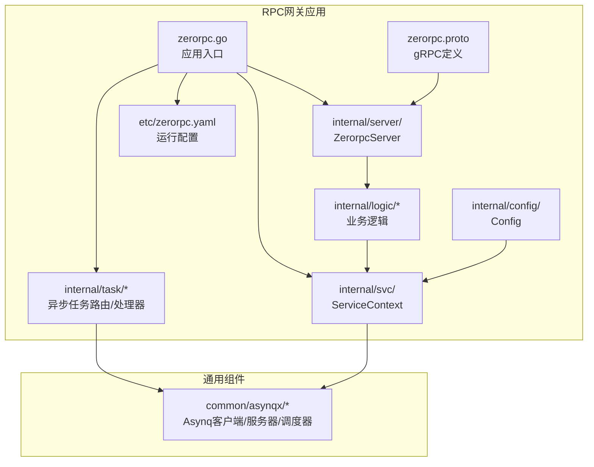
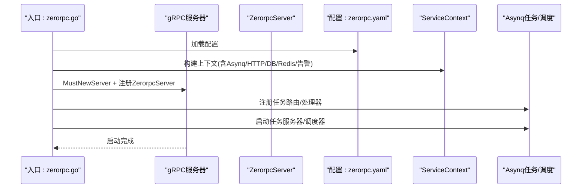
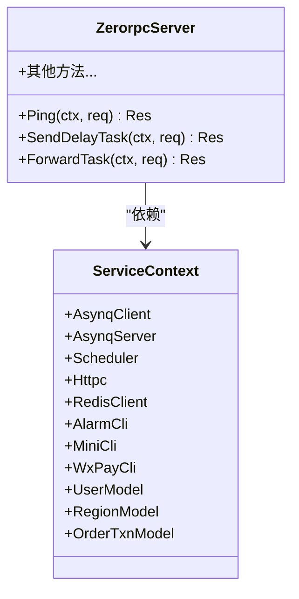
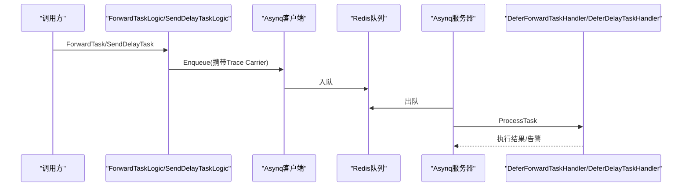
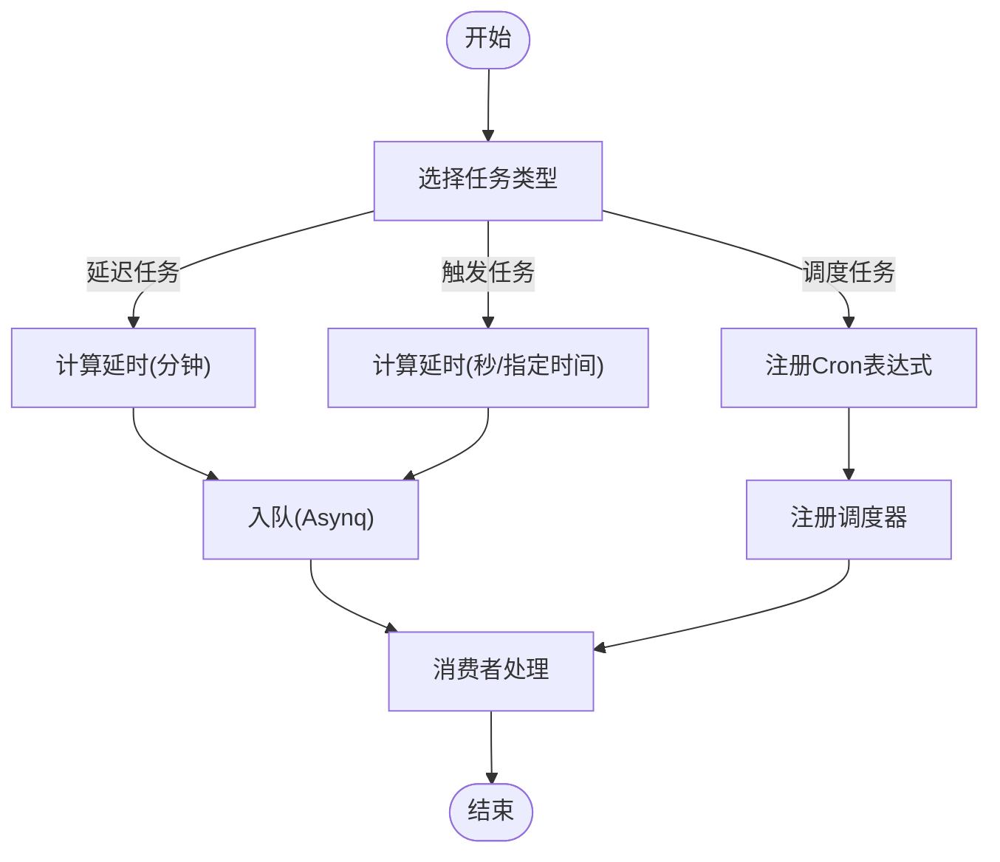
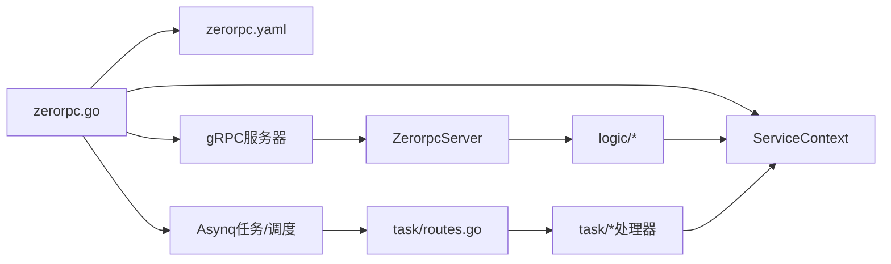

# RPC网关服务

<cite>
**本文引用的文件**
- [zerorpc.go](file://zerorpc/zerorpc.go)
- [zerorpc.proto](file://zerorpc/zerorpc.proto)
- [config.go](file://zerorpc/internal/config/config.go)
- [zerorpcserver.go](file://zerorpc/internal/server/zerorpcserver.go)
- [servicecontext.go](file://zerorpc/internal/svc/servicecontext.go)
- [routes.go](file://zerorpc/internal/task/routes.go)
- [deferdelaytask.go](file://zerorpc/internal/task/deferdelaytask.go)
- [deferforwardtask.go](file://zerorpc/internal/task/deferforwardtask.go)
- [senddelaytasklogic.go](file://zerorpc/internal/logic/senddelaytasklogic.go)
- [forwardtasklogic.go](file://zerorpc/internal/logic/forwardtasklogic.go)
- [asynqClient.go](file://common/asynqx/asynqClient.go)
- [asynqTaskServer.go](file://common/asynqx/asynqTaskServer.go)
- [asynqSchedulerServer.go](file://common/asynqx/asynqSchedulerServer.go)
- [zerorpc.yaml](file://zerorpc/etc/zerorpc.yaml)
</cite>

## 目录
1. [简介](#简介)
2. [项目结构](#项目结构)
3. [核心组件](#核心组件)
4. [架构总览](#架构总览)
5. [详细组件分析](#详细组件分析)
6. [依赖关系分析](#依赖关系分析)
7. [性能考虑](#性能考虑)
8. [故障排查指南](#故障排查指南)
9. [结论](#结论)
10. [附录](#附录)

## 简介
本文件面向Zero-Service的RPC网关服务（zerorpc），系统性阐述其gRPC服务聚合、协议转换、服务发现与注册、异步任务处理（定时/延迟/触发）、负载均衡与容错（熔断降级、超时重试）、性能调优与监控告警，以及扩展开发与自定义任务处理指南。该服务以go-zero为基础，结合Asynq实现高性能异步任务编排，并通过OpenTelemetry进行链路追踪。

## 项目结构
zerorpc模块采用标准的go-zero微服务分层组织：
- 应用入口与配置：zerorpc.go、etc/zerorpc.yaml
- 协议与服务端：zerorpc.proto、internal/server/zerorpcserver.go
- 业务逻辑：internal/logic/*
- 异步任务：internal/task/*
- 通用异步队列封装：common/asynqx/*
- 服务上下文：internal/svc/servicecontext.go
- 内部配置模型：internal/config/config.go

图表来源
- [zerorpc.go:26-58](file://zerorpc/zerorpc.go#L26-L58)
- [zerorpcserver.go:15-90](file://zerorpc/internal/server/zerorpcserver.go#L15-L90)
- [servicecontext.go:19-101](file://zerorpc/internal/svc/servicecontext.go#L19-L101)
- [routes.go:22-36](file://zerorpc/internal/task/routes.go#L22-L36)
- [asynqTaskServer.go:39-64](file://common/asynqx/asynqTaskServer.go#L39-L64)

章节来源
- [zerorpc.go:24-58](file://zerorpc/zerorpc.go#L24-L58)
- [zerorpc.yaml:1-39](file://zerorpc/etc/zerorpc.yaml#L1-L39)

## 核心组件
- gRPC服务端：基于zerorpc.proto生成的服务实现，负责接收请求并委派到对应逻辑层。
- 服务上下文：集中管理Asynq客户端/服务器、调度器、HTTP客户端、Redis、数据库连接、第三方SDK（微信小程序/支付）等。
- 异步任务框架：基于Asynq的任务生产者、消费者、调度器，支持队列优先级、并发控制、保留期等。
- 业务逻辑：如发送延迟任务、转发任务、用户相关、区域查询、支付等。
- 配置中心：通过yaml加载运行参数，支持日志、Redis、DB、告警、鉴权等配置。

章节来源
- [zerorpcserver.go:15-90](file://zerorpc/internal/server/zerorpcserver.go#L15-L90)
- [servicecontext.go:19-101](file://zerorpc/internal/svc/servicecontext.go#L19-L101)
- [config.go:8-24](file://zerorpc/internal/config/config.go#L8-L24)

## 架构总览
RPC网关在启动时：
- 初始化gRPC服务，注册ZerorpcServer
- 注册Asynq任务路由与处理器
- 启动Asynq任务服务器与调度器
- 绑定拦截器与全局日志字段

图表来源
- [zerorpc.go:35-57](file://zerorpc/zerorpc.go#L35-L57)
- [servicecontext.go:35-101](file://zerorpc/internal/svc/servicecontext.go#L35-L101)
- [routes.go:22-36](file://zerorpc/internal/task/routes.go#L22-L36)

## 详细组件分析

### gRPC服务聚合与协议转换
- 服务聚合：ZerorpcServer将每个RPC方法映射到对应的logic层，统一由ServiceContext注入依赖。
- 协议转换：请求/响应结构体在zerorpc.proto中定义，服务端通过生成代码实现具体方法。
- 拦截器：入口处添加Unary拦截器用于日志记录。

图表来源
- [zerorpcserver.go:15-90](file://zerorpc/internal/server/zerorpcserver.go#L15-L90)
- [servicecontext.go:19-101](file://zerorpc/internal/svc/servicecontext.go#L19-L101)

章节来源
- [zerorpcserver.go:26-89](file://zerorpc/internal/server/zerorpcserver.go#L26-L89)
- [zerorpc.proto:140-166](file://zerorpc/zerorpc.proto#L140-L166)

### 异步任务处理机制
- 任务类型
  - 延迟任务：按分钟延时执行
  - 触发任务：按秒延时或指定触发时间执行
  - 调度任务：周期性调度
- 生产与消费
  - 生产：logic层将请求封装为payload，注入Trace Carrier，通过Asynq客户端入队
  - 消费：Asynq服务器使用ServeMux注册处理器，中间件记录日志与耗时
- 调度器：Asynq调度器支持Cron表达式，可注册周期性任务

图表来源
- [forwardtasklogic.go:40-89](file://zerorpc/internal/logic/forwardtasklogic.go#L40-L89)
- [senddelaytasklogic.go:33-52](file://zerorpc/internal/logic/senddelaytasklogic.go#L33-L52)
- [asynqClient.go:17-19](file://common/asynqx/asynqClient.go#L17-L19)
- [asynqTaskServer.go:28-33](file://common/asynqx/asynqTaskServer.go#L28-L33)
- [routes.go:22-36](file://zerorpc/internal/task/routes.go#L22-L36)

章节来源
- [routes.go:22-36](file://zerorpc/internal/task/routes.go#L22-L36)
- [deferdelaytask.go:23-36](file://zerorpc/internal/task/deferdelaytask.go#L23-L36)
- [deferforwardtask.go:31-96](file://zerorpc/internal/task/deferforwardtask.go#L31-L96)
- [asynqTaskServer.go:73-86](file://common/asynqx/asynqTaskServer.go#L73-L86)

### 定时任务与延迟任务
- 延迟任务：按分钟延时，适合非实时但需保证最终一致的场景
- 触发任务：支持按秒延时或指定触发时间，适合精确到秒的调度
- 调度任务：通过Asynq调度器注册Cron任务，适合周期性批处理

图表来源
- [senddelaytasklogic.go:33-52](file://zerorpc/internal/logic/senddelaytasklogic.go#L33-L52)
- [forwardtasklogic.go:56-70](file://zerorpc/internal/logic/forwardtasklogic.go#L56-L70)
- [asynqSchedulerServer.go:32-52](file://common/asynqx/asynqSchedulerServer.go#L32-L52)

章节来源
- [senddelaytasklogic.go:33-52](file://zerorpc/internal/logic/senddelaytasklogic.go#L33-L52)
- [forwardtasklogic.go:56-70](file://zerorpc/internal/logic/forwardtasklogic.go#L56-L70)
- [asynqSchedulerServer.go:54-61](file://common/asynqx/asynqSchedulerServer.go#L54-L61)

### 负载均衡、熔断降级与超时重试
- 负载均衡：gRPC服务端未显式配置负载均衡策略，默认由客户端/服务发现组件处理；建议结合Nacos/etcd等实现服务发现与LB。
- 熔断降级：当前未见内置熔断器实现，可在逻辑层对下游依赖（如HTTP调用、第三方SDK）增加超时与快速失败策略。
- 超时重试：转发任务在消费者侧设置短超时（例如5秒），失败后通过告警服务上报；建议在上层引入指数退避重试策略。

章节来源
- [deferforwardtask.go:49-70](file://zerorpc/internal/task/deferforwardtask.go#L49-L70)
- [zerorpc.yaml:4-8](file://zerorpc/etc/zerorpc.yaml#L4-L8)

### 协议转换与服务发现
- 协议转换：gRPC作为统一入口，内部可对接REST/消息队列，通过Asynq桥接实现跨协议通信。
- 服务发现：配置中预留Etcd字段，可启用服务注册与发现；建议在生产环境启用并配置Key前缀。

章节来源
- [zerorpc.yaml:4-8](file://zerorpc/etc/zerorpc.yaml#L4-L8)

### 业务能力概览
- 健康检查：Ping接口
- 用户与区域：获取区域列表、用户信息、编辑用户
- 认证与授权：生成Token、登录、小程序登录
- 支付：微信JSAPI支付
- 任务：发送延迟任务、转发任务

章节来源
- [zerorpcserver.go:26-89](file://zerorpc/internal/server/zerorpcserver.go#L26-L89)
- [zerorpc.proto:140-166](file://zerorpc/zerorpc.proto#L140-L166)

## 依赖关系分析
- 应用入口依赖配置、服务上下文、gRPC服务器与Asynq组件
- 服务端依赖逻辑层，逻辑层依赖ServiceContext
- Asynq客户端/服务器/调度器由ServiceContext统一管理
- 任务路由注册于入口，处理器在internal/task中实现

图表来源
- [zerorpc.go:35-57](file://zerorpc/zerorpc.go#L35-L57)
- [servicecontext.go:35-101](file://zerorpc/internal/svc/servicecontext.go#L35-L101)
- [routes.go:22-36](file://zerorpc/internal/task/routes.go#L22-L36)

章节来源
- [zerorpc.go:35-57](file://zerorpc/zerorpc.go#L35-L57)
- [servicecontext.go:35-101](file://zerorpc/internal/svc/servicecontext.go#L35-L101)

## 性能考虑
- Asynq并发与队列
  - 并发数：20（可依据CPU核数与I/O特性调整）
  - 队列优先级：critical/default/low，关键任务进入高优先级队列
  - 连接池：Redis连接池大小为50，建议根据QPS评估
- 超时与重试
  - 消费者侧设置短超时（如5秒），避免阻塞队列
  - 对下游依赖增加指数退避重试，降低抖动
- 日志与追踪
  - 使用Asynq中间件记录处理耗时与错误
  - 通过OpenTelemetry传播Trace上下文，便于定位瓶颈
- 数据库与缓存
  - 合理设置连接池与超时，避免慢查询拖垮服务
  - 使用Redis缓存热点数据，减少DB压力

章节来源
- [asynqTaskServer.go:50-63](file://common/asynqx/asynqTaskServer.go#L50-L63)
- [asynqTaskServer.go:73-86](file://common/asynqx/asynqTaskServer.go#L73-L86)
- [asynqClient.go:25-30](file://common/asynqx/asynqClient.go#L25-L30)

## 故障排查指南
- 告警集成
  - 转发任务失败时，调用告警服务上报错误与TraceID
  - 建议在消费者侧统一捕获异常并上报
- 日志字段
  - 在Asynq中间件中记录任务类型与TaskID，便于检索
- 常见问题
  - 任务积压：检查消费者并发、队列优先级与下游依赖性能
  - 超时失败：缩短超时时间或优化下游接口
  - 配置错误：确认Redis、DB、告警服务端点正确

章节来源
- [deferforwardtask.go:53-90](file://zerorpc/internal/task/deferforwardtask.go#L53-L90)
- [asynqTaskServer.go:73-86](file://common/asynqx/asynqTaskServer.go#L73-L86)

## 结论
RPC网关服务以go-zero为骨架，结合Asynq实现了高可靠、可观测的异步任务编排能力。通过清晰的分层设计与统一的ServiceContext，服务具备良好的扩展性。建议在生产环境中完善服务发现、熔断降级与重试策略，并持续优化队列与并发配置以匹配实际流量。

## 附录

### 配置项说明
- 应用基础
  - Name：服务名
  - ListenOn：监听地址
  - Timeout：请求超时（毫秒）
  - Mode：运行模式（dev/test/prod）
- 日志
  - Log.Encoding：日志编码格式
- 缓存与数据库
  - Redis/Cache：Redis配置
  - DB.DataSource：MySQL连接串
- 告警
  - ZeroAlarmConf.Endpoints：告警服务端点
  - ZeroAlarmConf.NonBlock/Timeout：非阻塞与超时
- 鉴权与第三方
  - JwtAuth.AccessSecret/AccessExpire：JWT密钥与过期时间
  - MiniProgram.AppId/Secret：小程序配置

章节来源
- [zerorpc.yaml:1-39](file://zerorpc/etc/zerorpc.yaml#L1-L39)

### 扩展开发与自定义任务处理指南
- 新增任务类型
  - 在common/asynqx/tasktype.go中定义任务类型常量
  - 在internal/task/routes.go中注册处理器
  - 在internal/task下新增处理器实现
- 新增RPC接口
  - 在zerorpc.proto中定义消息与服务方法
  - 生成代码后在internal/server中实现
  - 在internal/logic中编写业务逻辑
- 自定义拦截器与中间件
  - 在入口处添加拦截器
  - 在Asynq中间件中扩展日志与指标

章节来源
- [routes.go:22-36](file://zerorpc/internal/task/routes.go#L22-L36)
- [asynqTaskServer.go:73-86](file://common/asynqx/asynqTaskServer.go#L73-L86)
- [zerorpc.proto:140-166](file://zerorpc/zerorpc.proto#L140-L166)