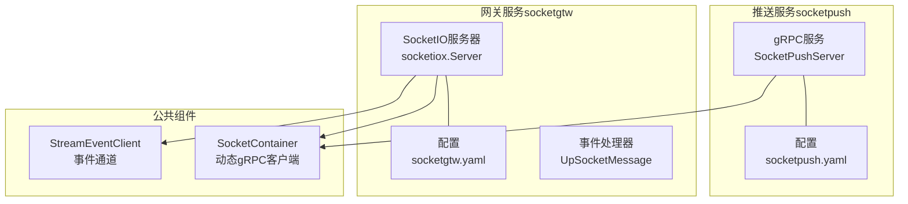
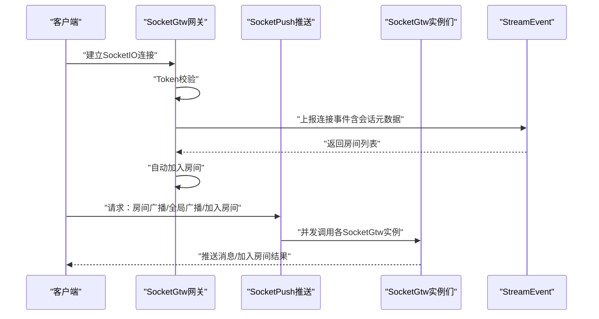
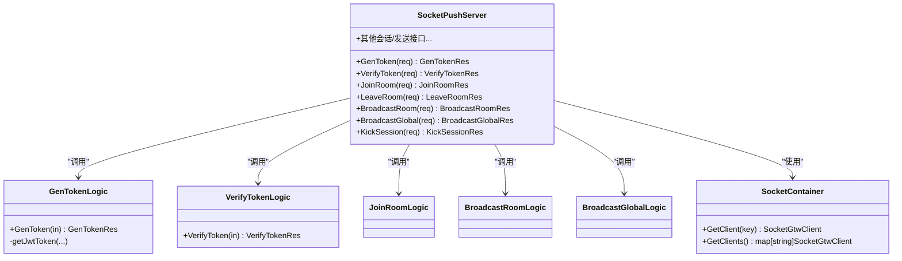
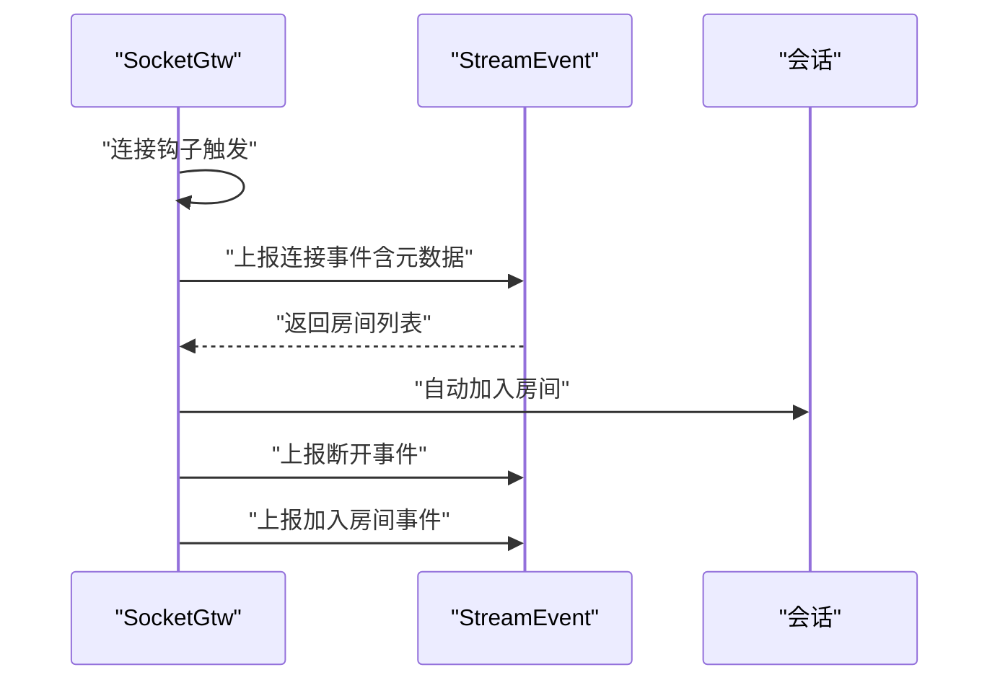
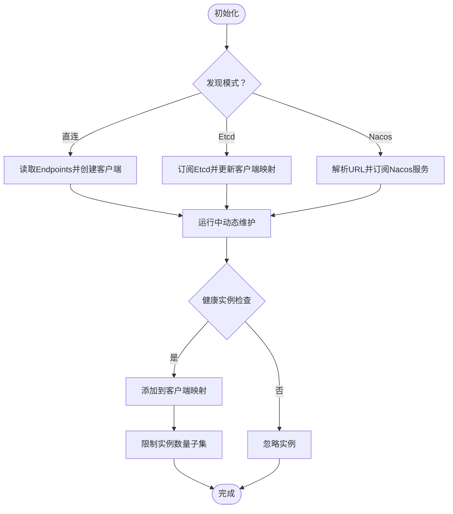
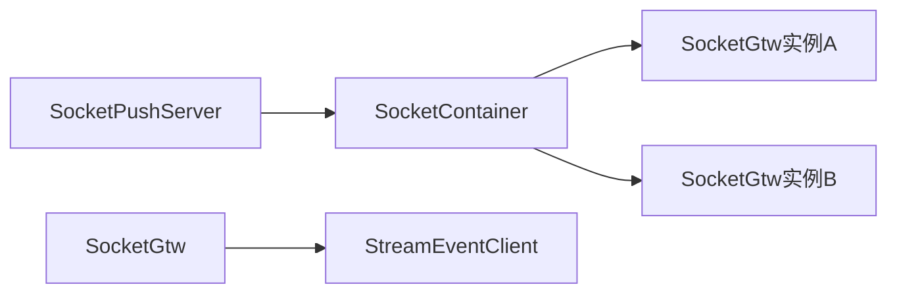

# SocketIO推送

<cite>
**本文引用的文件**
- [socketpush.go](file://socketapp/socketpush/socketpush.go)
- [socketgtw.go](file://socketapp/socketgtw/socketgtw.go)
- [socketpush.yaml](file://socketapp/socketpush/etc/socketpush.yaml)
- [socketgtw.yaml](file://socketapp/socketgtw/etc/socketgtw.yaml)
- [config.go（推送）](file://socketapp/socketpush/internal/config/config.go)
- [config.go（网关）](file://socketapp/socketgtw/internal/config/config.go)
- [container.go](file://common/socketiox/container.go)
- [servicecontext.go（网关）](file://socketapp/socketgtw/internal/svc/servicecontext.go)
- [gentokenlogic.go](file://socketapp/socketpush/internal/logic/gentokenlogic.go)
- [verifytokenlogic.go](file://socketapp/socketpush/internal/logic/verifytokenlogic.go)
- [joinroomlogic.go](file://socketapp/socketpush/internal/logic/joinroomlogic.go)
- [broadcastroomlogic.go](file://socketapp/socketpush/internal/logic/broadcastroomlogic.go)
- [broadcastgloballogic.go](file://socketapp/socketpush/internal/logic/broadcastgloballogic.go)
- [socketpush.proto](file://socketapp/socketpush/socketpush/socketpush.pb.go)
- [socketpush_grpc.pb.go](file://socketapp/socketpush/socketpush/socketpush_grpc.pb.go)
</cite>

## 目录
1. [简介](#简介)
2. [项目结构](#项目结构)
3. [核心组件](#核心组件)
4. [架构总览](#架构总览)
5. [详细组件分析](#详细组件分析)
6. [依赖分析](#依赖分析)
7. [性能考虑](#性能考虑)
8. [故障排查指南](#故障排查指南)
9. [结论](#结论)
10. [附录：API与集成示例](#附录api与集成示例)

## 简介
本文件面向Zero-Service中的SocketIO推送子系统，系统由“SocketIO推送服务”和“SocketIO网关服务”组成，二者通过gRPC进行协作，共同完成以下能力：
- Token生成与校验（基于JWT）
- 房间管理（加入/离开）
- 广播推送（按房间/全局）
- 会话生命周期事件上报（连接、断开、加入房间）
- 与流事件通道（StreamEvent）联动，实现业务侧的房间分配与事件处理

该文档从架构、组件、数据流、安全策略、性能优化到故障排查，提供完整的技术说明与最佳实践。

## 项目结构
- SocketIO推送服务（socketpush）：提供Token签发/校验、房间/广播等推送能力的gRPC服务端。
- SocketIO网关服务（socketgtw）：承载SocketIO协议接入、会话管理、事件钩子、与推送服务交互。
- 公共组件：socketiox容器负责动态发现与gRPC客户端管理；配置文件分别定义服务端口、日志、JWT密钥、Nacos注册、SocketGtw目标地址等。

图表来源
- [socketpush.go:27-68](file://socketapp/socketpush/socketpush.go#L27-L68)
- [socketgtw.go:30-90](file://socketapp/socketgtw/socketgtw.go#L30-L90)
- [container.go:35-61](file://common/socketiox/container.go#L35-L61)
- [servicecontext.go（网关）:24-133](file://socketapp/socketgtw/internal/svc/servicecontext.go#L24-L133)

章节来源
- [socketpush.go:27-68](file://socketapp/socketpush/socketpush.go#L27-L68)
- [socketgtw.go:30-90](file://socketapp/socketgtw/socketgtw.go#L30-L90)
- [socketpush.yaml:1-28](file://socketapp/socketpush/etc/socketpush.yaml#L1-L28)
- [socketgtw.yaml:1-37](file://socketapp/socketgtw/etc/socketgtw.yaml#L1-L37)

## 核心组件
- SocketPushServer（推送服务端）：提供生成Token、校验Token、加入房间、房间广播、全局广播、会话踢出等接口。
- SocketGtw（网关服务端）：承载SocketIO协议，内置Token校验、连接/断开/加入房间钩子，将事件上送到StreamEvent，并与推送服务交互。
- SocketContainer：动态管理与SocketGtw的gRPC客户端，支持直连、Etcd、Nacos三种发现方式。
- 配置模块：分别在推送与网关侧定义JWT密钥、过期时间、Nacos注册、SocketGtw目标地址、Socket元数据键等。

章节来源
- [socketpush_grpc.pb.go:240-359](file://socketapp/socketpush/socketpush/socketpush_grpc.pb.go#L240-L359)
- [container.go:30-77](file://common/socketiox/container.go#L30-L77)
- [config.go（推送）:5-22](file://socketapp/socketpush/internal/config/config.go#L5-L22)
- [config.go（网关）:8-27](file://socketapp/socketgtw/internal/config/config.go#L8-L27)

## 架构总览
推送与网关通过gRPC协作，形成如下流程：
- 客户端通过SocketIO网关建立连接，网关进行Token校验并触发连接钩子，向StreamEvent上报连接事件以获取房间列表并自动加入。
- 应用侧通过推送服务调用房间/全局广播或会话管理接口，推送服务并发调用所有已发现的SocketGtw实例，确保消息可达性。
- SocketGtw根据收到的请求执行相应动作（如JoinRoom、BroadcastRoom、BroadcastGlobal），并将消息推送给对应会话。

图表来源
- [servicecontext.go（网关）:75-130](file://socketapp/socketgtw/internal/svc/servicecontext.go#L75-L130)
- [joinroomlogic.go:28-43](file://socketapp/socketpush/internal/logic/joinroomlogic.go#L28-L43)
- [broadcastroomlogic.go:28-44](file://socketapp/socketpush/internal/logic/broadcastroomlogic.go#L28-L44)
- [broadcastgloballogic.go:28-64](file://socketapp/socketpush/internal/logic/broadcastgloballogic.go#L28-L64)

## 详细组件分析

### 组件A：SocketPushServer（推送服务）
- 能力清单
  - 生成Token：接收用户ID与可选负载，签发带过期时间的JWT。
  - 校验Token：支持当前密钥与历史密钥双密钥校验，兼容密钥轮换。
  - 房间管理：加入房间、离开房间（未在当前实现中暴露，但可通过内部逻辑使用）。
  - 广播推送：按房间广播、全局广播。
  - 会话管理：踢出会话、针对单会话/多会话/元信息会话的发送（预留接口）。
  - 状态查询：查询SocketGtw统计信息（用于运维观测）。

- 关键实现要点
  - Token生成：使用HS256签名，载荷包含iat/exp以及自定义负载（忽略标准JWT字段名）。
  - Token校验：支持AccessSecret与PrevAccessSecret双密钥，提升密钥轮换期间的兼容性。
  - 房间/广播：通过SocketContainer并发调用所有可用的SocketGtw实例，保证高可用与低延迟。
  - 会话管理：预留接口，便于后续扩展。

图表来源
- [socketpush_grpc.pb.go:240-359](file://socketapp/socketpush/socketpush/socketpush_grpc.pb.go#L240-L359)
- [gentokenlogic.go:29-78](file://socketapp/socketpush/internal/logic/gentokenlogic.go#L29-L78)
- [verifytokenlogic.go:28-49](file://socketapp/socketpush/internal/logic/verifytokenlogic.go#L28-L49)
- [joinroomlogic.go:28-43](file://socketapp/socketpush/internal/logic/joinroomlogic.go#L28-L43)
- [broadcastroomlogic.go:28-44](file://socketapp/socketpush/internal/logic/broadcastroomlogic.go#L28-L44)
- [broadcastgloballogic.go:28-64](file://socketapp/socketpush/internal/logic/broadcastgloballogic.go#L28-L64)
- [container.go:30-77](file://common/socketiox/container.go#L30-L77)

章节来源
- [socketpush_grpc.pb.go:240-359](file://socketapp/socketpush/socketpush/socketpush_grpc.pb.go#L240-L359)
- [gentokenlogic.go:29-78](file://socketapp/socketpush/internal/logic/gentokenlogic.go#L29-L78)
- [verifytokenlogic.go:28-49](file://socketapp/socketpush/internal/logic/verifytokenlogic.go#L28-L49)
- [joinroomlogic.go:28-43](file://socketapp/socketpush/internal/logic/joinroomlogic.go#L28-L43)
- [broadcastroomlogic.go:28-44](file://socketapp/socketpush/internal/logic/broadcastroomlogic.go#L28-L44)
- [broadcastgloballogic.go:28-64](file://socketapp/socketpush/internal/logic/broadcastgloballogic.go#L28-L64)

### 组件B：SocketGtw（网关服务）
- 能力清单
  - SocketIO协议接入与会话管理。
  - Token校验器与带Claims的校验器，支持双密钥。
  - 连接/断开/加入房间钩子：在关键事件时上报StreamEvent，实现业务化房间分配与日志记录。
  - 事件处理器：将上游事件转换为SocketIO消息，驱动客户端交互。

- 关键实现要点
  - 上报连接事件：携带会话元数据，StreamEvent返回房间列表，网关自动加入。
  - 上报断开事件：记录会话断开原因，便于审计与清理。
  - 上报加入房间事件：允许业务侧对房间权限与规则进行控制。

图表来源
- [servicecontext.go（网关）:75-130](file://socketapp/socketgtw/internal/svc/servicecontext.go#L75-L130)

章节来源
- [servicecontext.go（网关）:18-133](file://socketapp/socketgtw/internal/svc/servicecontext.go#L18-L133)

### 组件C：SocketContainer（动态gRPC客户端）
- 能力清单
  - 支持直连、Etcd、Nacos三种服务发现方式。
  - 动态增删gRPC客户端，维护健康实例集合。
  - 限制订阅实例数量，避免过度膨胀。

- 关键实现要点
  - Nacos解析URL参数，提取命名空间、分组、集群、超时等配置。
  - 健康实例过滤：要求存在gRPC端口且启用/健康状态。
  - 定时拉取实例列表，保持客户端映射最新。

图表来源
- [container.go:35-61](file://common/socketiox/container.go#L35-L61)
- [container.go:132-154](file://common/socketiox/container.go#L132-L154)
- [container.go:206-242](file://common/socketiox/container.go#L206-L242)
- [container.go:318-356](file://common/socketiox/container.go#L318-L356)

章节来源
- [container.go:30-425](file://common/socketiox/container.go#L30-L425)

### 组件D：配置与安全策略
- 推送服务配置
  - JwtAuth：AccessSecret、PrevAccessSecret、AccessExpire。
  - SocketGtwConf：目标SocketGtw地址或服务发现配置。
  - NacosConfig：是否注册、注册中心地址、命名空间、服务名等。
- 网关服务配置
  - JwtAuth：AccessSecret、PrevAccessSecret。
  - SocketMetaData：透传到会话的元数据键集合。
  - StreamEventConf：事件通道客户端配置。
  - Http：对外HTTP服务端口（用于SocketIO握手等）。

- 安全策略
  - JWT HS256签名，iat/exp控制有效期。
  - 双密钥校验，支持密钥轮换期间平滑过渡。
  - 仅在网关侧设置AccessSecret时才启用Token校验（空则放行）。

章节来源
- [socketpush.yaml:10-27](file://socketapp/socketpush/etc/socketpush.yaml#L10-L27)
- [socketgtw.yaml:18-36](file://socketapp/socketgtw/etc/socketgtw.yaml#L18-L36)
- [config.go（推送）:5-22](file://socketapp/socketpush/internal/config/config.go#L5-L22)
- [config.go（网关）:8-27](file://socketapp/socketgtw/internal/config/config.go#L8-L27)
- [servicecontext.go（网关）:41-74](file://socketapp/socketgtw/internal/svc/servicecontext.go#L41-L74)

## 依赖分析
- 推送服务依赖SocketContainer动态发现SocketGtw实例，并并发调用其接口。
- 网关服务依赖StreamEventClient上报连接/断开/加入房间事件，并在连接钩子中根据业务返回的房间列表自动加入。
- 两者均通过zrpc与拦截器进行统一的日志与元数据传递。

图表来源
- [joinroomlogic.go:28-43](file://socketapp/socketpush/internal/logic/joinroomlogic.go#L28-L43)
- [broadcastroomlogic.go:28-44](file://socketapp/socketpush/internal/logic/broadcastroomlogic.go#L28-L44)
- [broadcastgloballogic.go:28-64](file://socketapp/socketpush/internal/logic/broadcastgloballogic.go#L28-L64)
- [servicecontext.go（网关）:24-37](file://socketapp/socketgtw/internal/svc/servicecontext.go#L24-L37)

章节来源
- [joinroomlogic.go:28-43](file://socketapp/socketpush/internal/logic/joinroomlogic.go#L28-L43)
- [broadcastroomlogic.go:28-44](file://socketapp/socketpush/internal/logic/broadcastroomlogic.go#L28-L44)
- [broadcastgloballogic.go:28-64](file://socketapp/socketpush/internal/logic/broadcastgloballogic.go#L28-L64)
- [servicecontext.go（网关）:24-37](file://socketapp/socketgtw/internal/svc/servicecontext.go#L24-L37)

## 性能考虑
- 并发推送：推送服务对所有已发现的SocketGtw实例并发调用，提高广播吞吐与降低延迟。
- 消息大小：SocketContainer在gRPC拨号时设置了较大的MaxCallSendMsgSize，适合大消息场景。
- 实例子集：Nacos/Etcd订阅时对实例集合做随机打散与子集限制，避免过度扩增客户端数量。
- 日志与拦截器：统一的gRPC拦截器与日志字段，便于定位性能瓶颈与异常。

章节来源
- [broadcastgloballogic.go:28-64](file://socketapp/socketpush/internal/logic/broadcastgloballogic.go#L28-L64)
- [container.go:113-117](file://common/socketiox/container.go#L113-L117)
- [container.go:300-307](file://common/socketiox/container.go#L300-L307)
- [socketpush.go:63-63](file://socketapp/socketpush/socketpush.go#L63-L63)
- [socketgtw.go:81-81](file://socketapp/socketgtw/socketgtw.go#L81-L81)

## 故障排查指南
- Token校验失败
  - 检查推送/网关配置中的AccessSecret与PrevAccessSecret是否正确。
  - 确认客户端使用的Token是否在有效期内。
- 房间加入无效
  - 网关连接钩子会根据StreamEvent返回的房间列表自动加入，确认StreamEvent返回的房间列表是否为空或格式错误。
- 广播无响应
  - 检查SocketContainer是否成功发现SocketGtw实例，确认Nacos/Etcd配置与网络连通性。
  - 观察推送服务日志，确认是否对所有实例都并发调用成功。
- 密钥轮换后短暂失败
  - 确保PrevAccessSecret已配置，以便在切换期间仍可校验旧Token。

章节来源
- [verifytokenlogic.go:28-49](file://socketapp/socketpush/internal/logic/verifytokenlogic.go#L28-L49)
- [servicecontext.go（网关）:75-130](file://socketapp/socketgtw/internal/svc/servicecontext.go#L75-L130)
- [container.go:206-242](file://common/socketiox/container.go#L206-L242)

## 结论
SocketIO推送与网关通过清晰的职责划分与gRPC协作，实现了高可用、可扩展的实时推送能力。配合JWT双密钥校验与动态服务发现，系统在安全性与运维性方面具备良好表现。建议在生产环境中启用Nacos/Etcd服务发现、合理配置密钥轮换窗口，并结合日志与指标持续优化广播路径与消息大小。

## 附录：API与集成示例

### API定义（基于proto）
- 生成Token
  - 请求：包含用户ID与可选负载
  - 返回：访问令牌、过期时间、刷新时间
- 校验Token
  - 请求：访问令牌
  - 返回：Claims JSON字符串
- 房间管理
  - 加入房间：并发通知所有SocketGtw实例
  - 离开房间：预留接口
- 广播推送
  - 房间广播：并发通知所有SocketGtw实例
  - 全局广播：并发通知所有SocketGtw实例
- 会话管理
  - 踢出会话、单/多会话/元信息会话发送：预留接口
- 状态查询
  - SocketGtw统计：返回各实例统计信息

章节来源
- [socketpush.proto:143-302](file://socketapp/socketpush/socketpush/socketpush.pb.go#L143-L302)
- [socketpush.proto:1421-1703](file://socketapp/socketpush/socketpush/socketpush.pb.go#L1421-L1703)
- [socketpush_grpc.pb.go:240-431](file://socketapp/socketpush/socketpush/socketpush_grpc.pb.go#L240-L431)

### 集成步骤
- 在推送服务配置中设置JWT密钥与过期时间，并配置SocketGtw目标地址或服务发现。
- 在网关服务配置中设置Socket元数据键、StreamEvent目标地址与HTTP端口。
- 启动推送与网关服务，确保日志与拦截器已启用。
- 客户端通过SocketIO网关建立连接，网关自动完成房间分配与事件上报。
- 应用侧通过推送服务发起房间/全局广播或会话管理操作。

章节来源
- [socketpush.go:27-68](file://socketapp/socketpush/socketpush.go#L27-L68)
- [socketgtw.go:30-90](file://socketapp/socketgtw/socketgtw.go#L30-L90)
- [socketpush.yaml:1-28](file://socketapp/socketpush/etc/socketpush.yaml#L1-L28)
- [socketgtw.yaml:1-37](file://socketapp/socketgtw/etc/socketgtw.yaml#L1-L37)