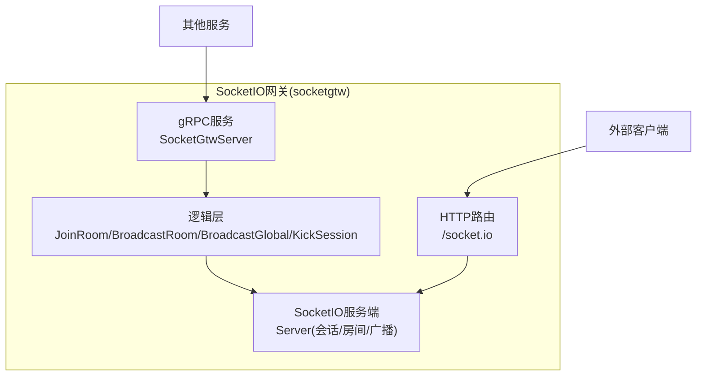
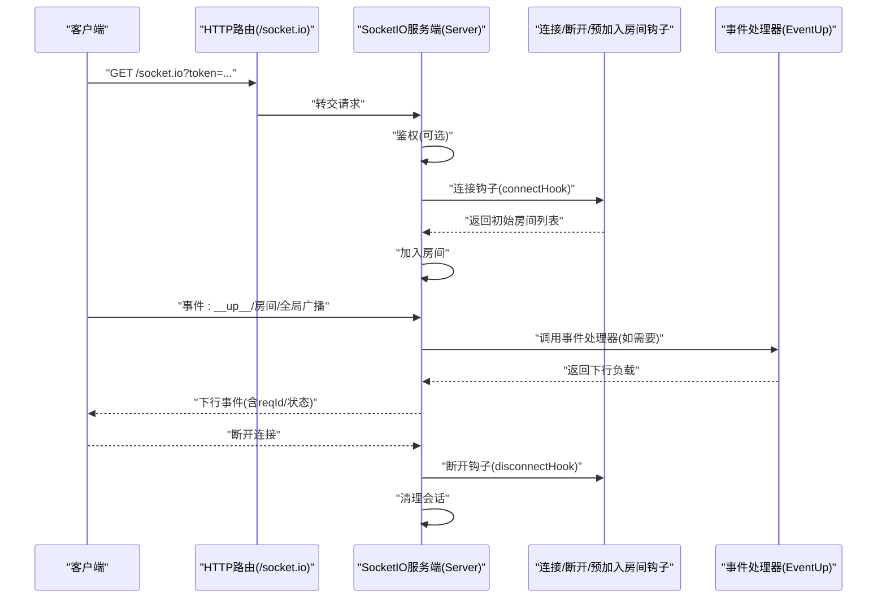
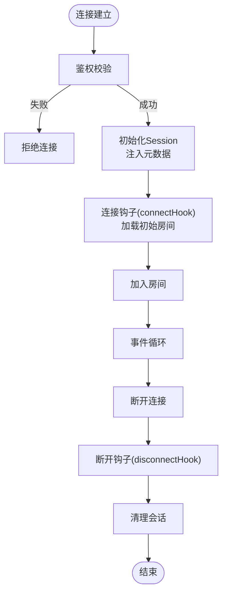
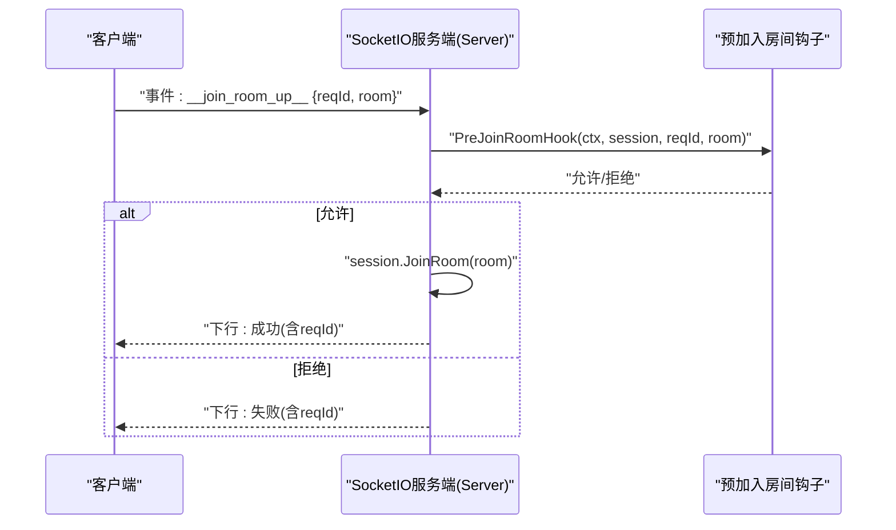
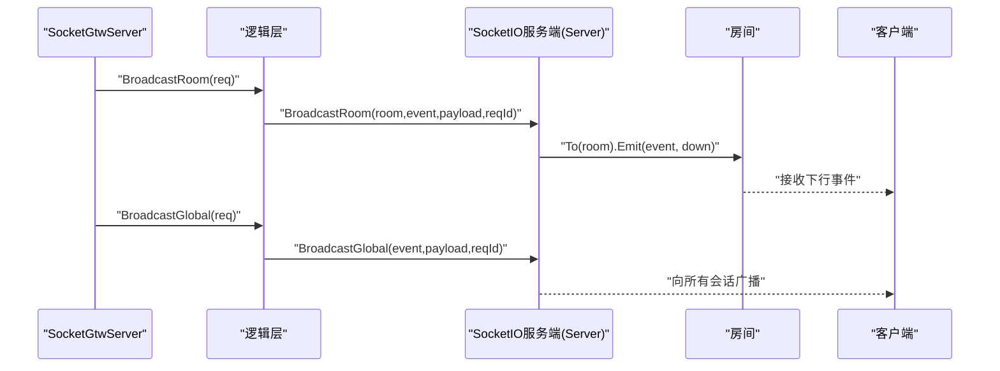
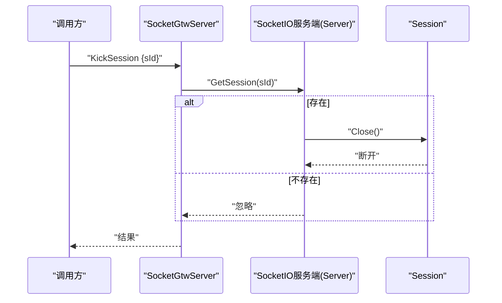
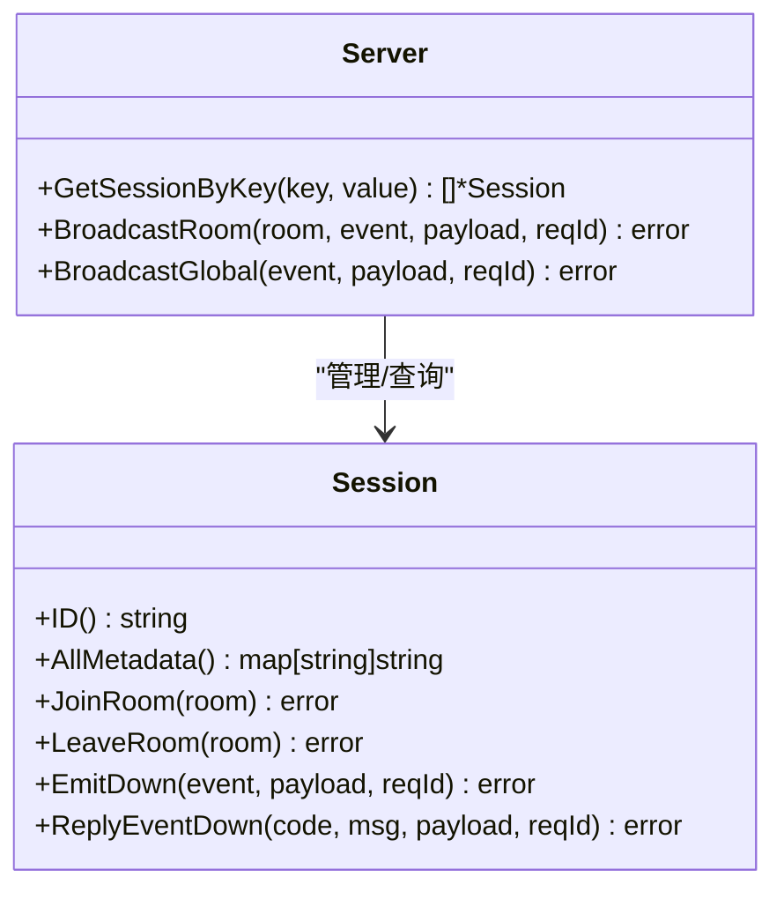
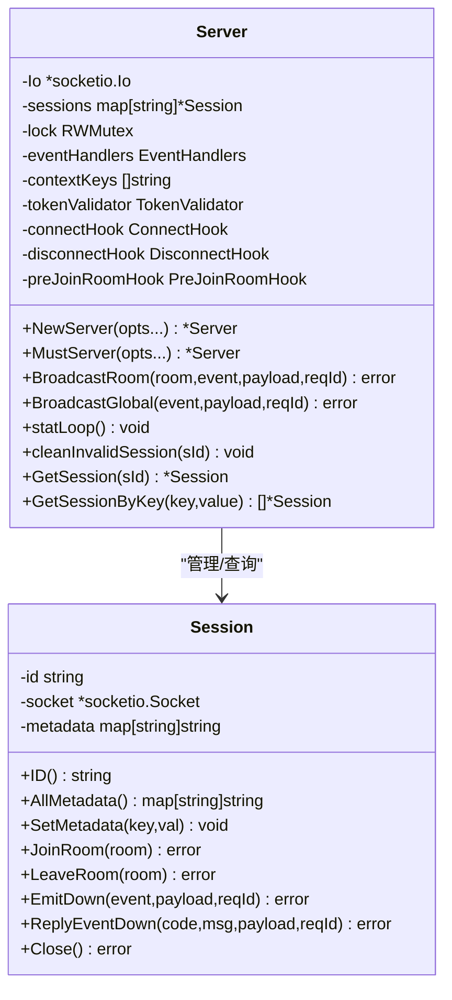
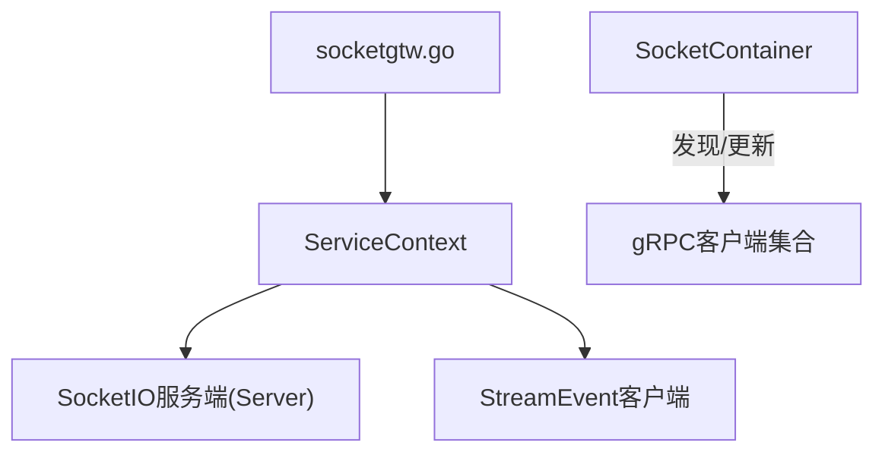

# SocketIO网关

<cite>
**本文引用的文件**
- [socketgtw.proto](file://socketapp/socketgtw/socketgtw.proto)
- [socketgtw.yaml](file://socketapp/socketgtw/etc/socketgtw.yaml)
- [socketgtwserver.go](file://socketapp/socketgtw/internal/server/socketgtwserver.go)
- [socketgtw.go](file://socketapp/socketgtw/socketgtw.go)
- [config.go](file://socketapp/socketgtw/internal/config/config.go)
- [servicecontext.go](file://socketapp/socketgtw/internal/svc/servicecontext.go)
- [routes.go](file://socketapp/socketgtw/internal/handler/routes.go)
- [joinroomlogic.go](file://socketapp/socketgtw/internal/logic/joinroomlogic.go)
- [broadcastgloballogic.go](file://socketapp/socketgtw/internal/logic/broadcastgloballogic.go)
- [broadcastroomlogic.go](file://socketapp/socketgtw/internal/logic/broadcastroomlogic.go)
- [kicksessionlogic.go](file://socketapp/socketgtw/internal/logic/kicksessionlogic.go)
- [server.go](file://common/socketiox/server.go)
- [container.go](file://common/socketiox/container.go)
- [handler.go](file://common/socketiox/handler.go)
</cite>

## 目录
1. [简介](#简介)
2. [项目结构](#项目结构)
3. [核心组件](#核心组件)
4. [架构总览](#架构总览)
5. [详细组件分析](#详细组件分析)
6. [依赖分析](#依赖分析)
7. [性能考虑](#性能考虑)
8. [故障排查指南](#故障排查指南)
9. [结论](#结论)
10. [附录](#附录)

## 简介
本文件面向Zero-Service中的SocketIO网关（socketgtw），系统性阐述其连接管理、房间管理、消息路由与广播、性能优化、并发处理与可靠性保障、配置项与扩展开发指南，并提供可操作的最佳实践与使用场景。

## 项目结构
SocketIO网关由两部分组成：
- SocketIO服务端：基于通用的socketiox库封装，负责WebSocket/Socket.IO协议接入、会话生命周期、房间管理、事件分发与统计上报。
- gRPC网关：对外暴露JoinRoom/LeaveRoom/BroadcastRoom/BroadcastGlobal/KickSession等接口，供上游服务或内部模块调用。

图表来源
- [socketgtwserver.go:26-90](file://socketapp/socketgtw/internal/server/socketgtwserver.go#L26-L90)
- [routes.go:11-24](file://socketapp/socketgtw/internal/handler/routes.go#L11-L24)
- [server.go:314-335](file://common/socketiox/server.go#L314-L335)

章节来源
- [socketgtwserver.go:26-90](file://socketapp/socketgtw/internal/server/socketgtwserver.go#L26-L90)
- [routes.go:11-24](file://socketapp/socketgtw/internal/handler/routes.go#L11-L24)
- [socketgtw.go:30-90](file://socketapp/socketgtw/socketgtw.go#L30-L90)

## 核心组件
- SocketIO服务端（Server）：负责连接鉴权、会话建立与维护、房间加入/离开、事件处理、全局/房间广播、统计上报、会话清理。
- 会话（Session）：封装单个连接的元数据、房间集合、发送能力与锁。
- 事件处理器（EventHandler）：可插拔的事件处理函数，用于处理自定义业务事件。
- 容器（SocketContainer）：对socketgtw服务的客户端封装，支持直连、Etcd订阅、Nacos订阅三种发现模式。
- 网关服务（SocketGtwServer）：将gRPC接口映射到SocketIO服务端能力。
- HTTP路由：将/socket.io路径交由SocketIO服务端处理。

章节来源
- [server.go:119-232](file://common/socketiox/server.go#L119-L232)
- [server.go:299-312](file://common/socketiox/server.go#L299-L312)
- [container.go:30-61](file://common/socketiox/container.go#L30-L61)
- [socketgtwserver.go:15-90](file://socketapp/socketgtw/internal/server/socketgtwserver.go#L15-L90)
- [routes.go:11-24](file://socketapp/socketgtw/internal/handler/routes.go#L11-L24)

## 架构总览
SocketIO网关通过HTTP路由接入Socket.IO协议，同时提供gRPC接口以供内部服务调用。鉴权与元数据注入在服务端完成，房间管理与广播由SocketIO服务端统一处理；统计周期性上报，便于运维观测。

图表来源
- [routes.go:11-24](file://socketapp/socketgtw/internal/handler/routes.go#L11-L24)
- [server.go:337-676](file://common/socketiox/server.go#L337-L676)
- [servicecontext.go:75-131](file://socketapp/socketgtw/internal/svc/servicecontext.go#L75-L131)

## 详细组件分析

### 连接管理与会话维护
- 连接建立：鉴权通过OnAuthentication回调执行，支持TokenValidator与TokenValidatorWithClaims两种校验；若启用，将把JWT中的声明映射到Session元数据。
- 元数据注入：当配置了SocketMetaData时，会从JWT中提取对应键值并写入Session。
- 会话生命周期：连接后注册多种事件回调，断开时触发disconnectHook并清理无效会话。
- 统计上报：每分钟向每个会话推送一次统计事件，包含房间列表、网络指标与元数据。

图表来源
- [server.go:337-391](file://common/socketiox/server.go#L337-L391)
- [server.go:620-641](file://common/socketiox/server.go#L620-L641)
- [servicecontext.go:75-113](file://socketapp/socketgtw/internal/svc/servicecontext.go#L75-L113)

章节来源
- [server.go:337-391](file://common/socketiox/server.go#L337-L391)
- [server.go:620-641](file://common/socketiox/server.go#L620-L641)
- [servicecontext.go:75-113](file://socketapp/socketgtw/internal/svc/servicecontext.go#L75-L113)

### 房间管理系统
- 房间加入/离开：客户端通过事件加入/离开房间；服务端在加入前可执行PreJoinRoomHook，允许业务侧进行权限校验或动态决策。
- 会话查询：按元数据键值（如userId/deviceId）批量查询会话，便于定向推送。
- 房间广播：服务端提供BroadcastRoom方法，将事件与负载推送到指定房间内的所有会话。

图表来源
- [server.go:392-435](file://common/socketiox/server.go#L392-L435)
- [server.go:678-688](file://common/socketiox/server.go#L678-L688)
- [servicecontext.go:114-130](file://socketapp/socketgtw/internal/svc/servicecontext.go#L114-L130)

章节来源
- [server.go:392-435](file://common/socketiox/server.go#L392-L435)
- [server.go:678-688](file://common/socketiox/server.go#L678-L688)
- [servicecontext.go:114-130](file://socketapp/socketgtw/internal/svc/servicecontext.go#L114-L130)

### 消息路由与广播机制
- 全局广播：BroadcastGlobal将事件与负载推送到所有在线会话。
- 房间广播：BroadcastRoom将事件与负载推送到指定房间内所有会话。
- 私信发送：通过gRPC接口SendToSession/SendToSessions/SendToMetaSession/SendToMetaSessions实现定向推送；SocketIO服务端提供Session.Emit系列方法用于下行消息。
- 事件命名规范：禁止使用保留事件名（如__down__），避免冲突。

图表来源
- [socketgtwserver.go:38-48](file://socketapp/socketgtw/internal/server/socketgtwserver.go#L38-L48)
- [broadcastroomlogic.go:29-46](file://socketapp/socketgtw/internal/logic/broadcastroomlogic.go#L29-L46)
- [broadcastgloballogic.go:29-46](file://socketapp/socketgtw/internal/logic/broadcastgloballogic.go#L29-L46)
- [server.go:678-700](file://common/socketiox/server.go#L678-L700)

章节来源
- [broadcastroomlogic.go:29-46](file://socketapp/socketgtw/internal/logic/broadcastroomlogic.go#L29-L46)
- [broadcastgloballogic.go:29-46](file://socketapp/socketgtw/internal/logic/broadcastgloballogic.go#L29-L46)
- [server.go:678-700](file://common/socketiox/server.go#L678-L700)

### gRPC网关与会话剔除
- gRPC接口：提供JoinRoom、LeaveRoom、BroadcastRoom、BroadcastGlobal、KickSession、KickMetaSession、SendToSession/SendToSessions、SendToMetaSession/SendToMetaSessions、SocketGtwStat等。
- 会话剔除：KickSession根据会话ID直接关闭连接；KickMetaSession根据元数据键值匹配后剔除。
- 统计查询：SocketGtwStat返回当前在线会话数量。

图表来源
- [socketgtwserver.go:50-54](file://socketapp/socketgtw/internal/server/socketgtwserver.go#L50-L54)
- [kicksessionlogic.go:27-36](file://socketapp/socketgtw/internal/logic/kicksessionlogic.go#L27-L36)
- [server.go:755-759](file://common/socketiox/server.go#L755-L759)

章节来源
- [socketgtwserver.go:50-54](file://socketapp/socketgtw/internal/server/socketgtwserver.go#L50-L54)
- [kicksessionlogic.go:27-36](file://socketapp/socketgtw/internal/logic/kicksessionlogic.go#L27-L36)
- [server.go:755-759](file://common/socketiox/server.go#L755-L759)

### 会话查询与定向推送
- 按元数据键值查询：GetSessionByKey支持按任意元数据键检索会话集合，便于定向推送。
- 下行消息：Session.Emit系列方法支持字符串与任意JSON负载，自动序列化为下行事件。

图表来源
- [server.go:769-782](file://common/socketiox/server.go#L769-L782)
- [server.go:119-232](file://common/socketiox/server.go#L119-L232)

章节来源
- [server.go:769-782](file://common/socketiox/server.go#L769-L782)
- [server.go:119-232](file://common/socketiox/server.go#L119-L232)

### SocketIO服务端类图

图表来源
- [server.go:299-312](file://common/socketiox/server.go#L299-L312)
- [server.go:119-125](file://common/socketiox/server.go#L119-L125)

## 依赖分析
- 服务启动：socketgtw.go负责加载配置、构建ServiceContext、注册gRPC与HTTP服务、可选注册到Nacos。
- 服务上下文：ServiceContext持有SocketIO服务端实例与StreamEvent客户端，注入鉴权、元数据、钩子等。
- 客户端容器：SocketContainer支持直连、Etcd、Nacos三种服务发现，动态维护gRPC客户端集合。

图表来源
- [socketgtw.go:30-90](file://socketapp/socketgtw/socketgtw.go#L30-L90)
- [servicecontext.go:24-133](file://socketapp/socketgtw/internal/svc/servicecontext.go#L24-L133)
- [container.go:35-61](file://common/socketiox/container.go#L35-L61)

章节来源
- [socketgtw.go:30-90](file://socketapp/socketgtw/socketgtw.go#L30-L90)
- [servicecontext.go:24-133](file://socketapp/socketgtw/internal/svc/servicecontext.go#L24-L133)
- [container.go:35-61](file://common/socketiox/container.go#L35-L61)

## 性能考虑
- 并发模型：事件处理与广播均在独立goroutine中执行，避免阻塞主事件循环。
- 负载均衡：SocketContainer支持Nacos/Etcd/直连三种发现，结合子集选择降低连接压力。
- 最大消息尺寸：gRPC客户端默认设置较大发送/接收上限，满足大包场景。
- 统计上报：每分钟一次统计事件，频率可控，避免高频抖动。
- 会话清理：断开连接后立即清理，防止内存泄漏。

章节来源
- [server.go:494-530](file://common/socketiox/server.go#L494-L530)
- [container.go:113-117](file://common/socketiox/container.go#L113-L117)
- [server.go:702-740](file://common/socketiox/server.go#L702-L740)

## 故障排查指南
- 连接被拒：检查JWT密钥配置与TokenValidator是否正确；确认SocketMetaData键是否存在且非空。
- 房间加入失败：检查PreJoinRoomHook返回值；确认房间名非空；查看下行响应中的reqId与错误信息。
- 广播无响应：确认事件名未使用保留字；检查目标房间是否存在在线会话；核对payload格式。
- 会话查询为空：确认元数据键值是否正确注入；检查会话是否已断开。
- 断开钩子异常：检查disconnectHook实现，确保幂等与快速返回。

章节来源
- [servicecontext.go:41-74](file://socketapp/socketgtw/internal/svc/servicecontext.go#L41-L74)
- [server.go:392-435](file://common/socketiox/server.go#L392-L435)
- [server.go:620-641](file://common/socketiox/server.go#L620-L641)

## 结论
SocketIO网关通过清晰的职责分离与可插拔钩子，实现了高可用的连接管理、灵活的房间管理与高效的消息广播能力。配合多样的服务发现与统计上报，能够满足生产环境的性能与可靠性要求。建议在生产中启用JWT鉴权、合理配置SocketMetaData、使用Nacos/Etcd进行服务发现，并结合统计事件持续优化。

## 附录

### 配置项说明（socketgtw.yaml）
- Name/ListenOn/Timeout：服务名称、监听地址与超时。
- Log：日志编码、输出路径、级别与保留天数。
- http：HTTP服务配置（Host/Port/Timeout）。
- JwtAuth：JWT密钥配置（AccessSecret/PrevAccessSecret）。
- NacosConfig：服务注册配置（是否注册、主机、端口、用户名、密码、命名空间、服务名）。
- SocketMetaData：从JWT中提取并注入到会话元数据的键列表。
- StreamEventConf：向上游流事件服务的gRPC客户端配置。

章节来源
- [socketgtw.yaml:1-37](file://socketapp/socketgtw/etc/socketgtw.yaml#L1-L37)

### 使用场景与最佳实践
- 场景一：实时推送（全局/房间/私信）
  - 全局广播：使用BroadcastGlobal；注意事件命名与payload格式。
  - 房间广播：使用BroadcastRoom；确保房间存在在线会话。
  - 私信发送：使用SendToSession/SendToMetaSession；结合元数据键值定位会话。
- 场景二：权限控制与动态房间
  - 在PreJoinRoomHook中校验用户权限与业务规则；根据上下文动态决定加入哪些房间。
- 场景三：运维可观测性
  - 订阅统计事件，观察会话数、房间分布与网络指标；结合日志级别与保留策略。
- 场景四：高并发与可靠性
  - 使用Nacos/Etcd进行服务发现；合理设置最大消息尺寸；确保断开钩子快速返回，避免阻塞。

### API参考（gRPC）
- JoinRoom：加入房间（reqId/sId/room）。
- LeaveRoom：离开房间（reqId/sId/room）。
- BroadcastRoom：房间广播（reqId/room/event/payload）。
- BroadcastGlobal：全局广播（reqId/event/payload）。
- KickSession：剔除指定会话（reqId/sId）。
- KickMetaSession：按元数据剔除会话（reqId/key/value）。
- SendToSession/SendToSessions：单/批量私信（reqId/sId(s)/event/payload）。
- SendToMetaSession/SendToMetaSessions：按元数据单/批量私信（reqId/metaSessions/event/payload）。
- SocketGtwStat：查询统计（sessions）。

章节来源
- [socketgtw.proto:9-32](file://socketapp/socketgtw/socketgtw.proto#L9-L32)
- [socketgtwserver.go:26-90](file://socketapp/socketgtw/internal/server/socketgtwserver.go#L26-L90)