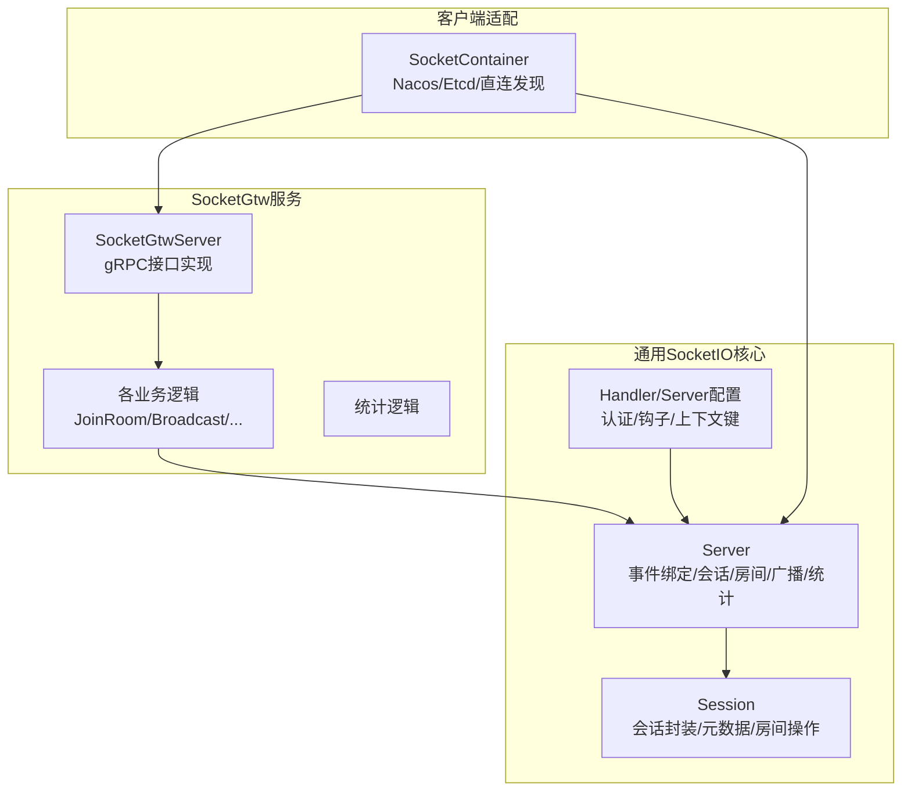
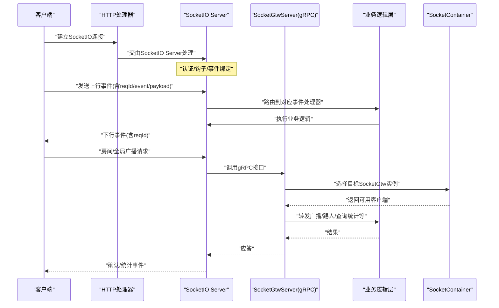
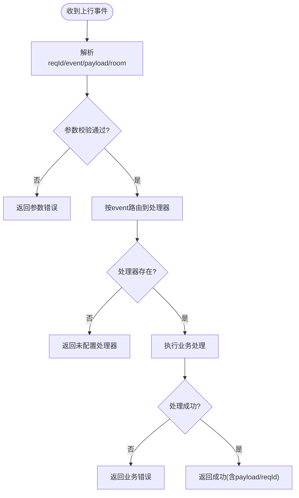
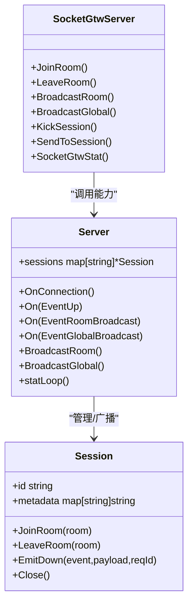
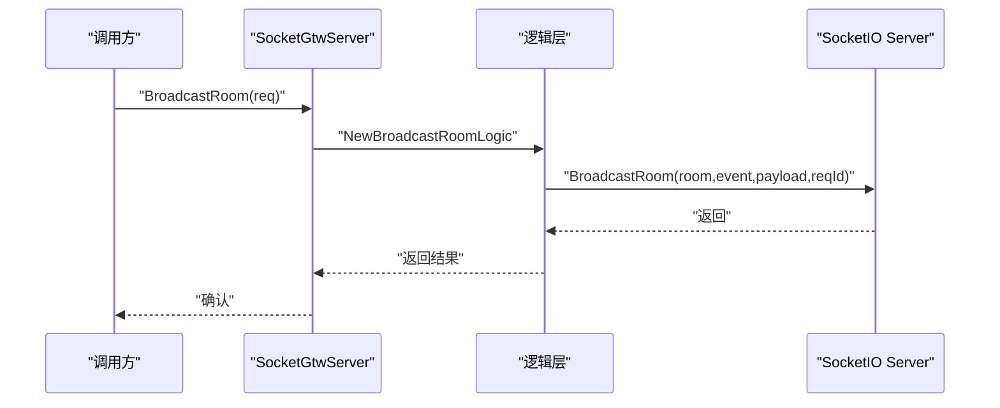
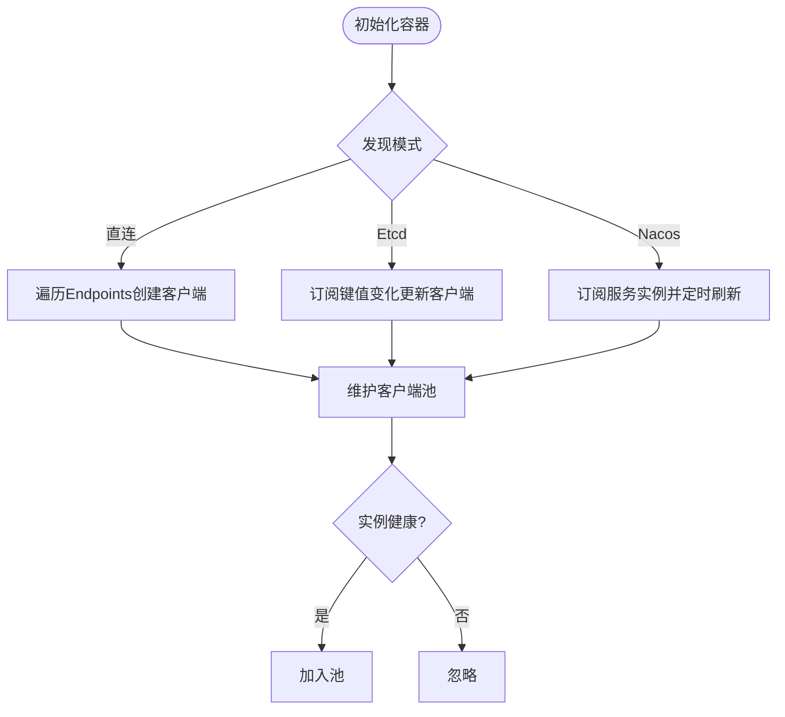
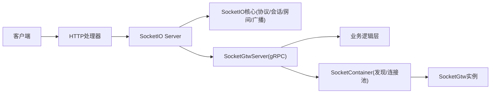

# 实时通信网关

<cite>
**本文引用的文件**
- [container.go](file://common/socketiox/container.go)
- [server.go](file://common/socketiox/server.go)
- [handler.go](file://common/socketiox/handler.go)
- [socketgtwserver.go](file://socketapp/socketgtw/internal/server/socketgtwserver.go)
- [broadcastgloballogic.go](file://socketapp/socketgtw/internal/logic/broadcastgloballogic.go)
- [broadcastroomlogic.go](file://socketapp/socketgtw/internal/logic/broadcastroomlogic.go)
- [joinroomlogic.go](file://socketapp/socketgtw/internal/logic/joinroomlogic.go)
- [kicksessionlogic.go](file://socketapp/socketgtw/internal/logic/kicksessionlogic.go)
- [sendtosessionlogic.go](file://socketapp/socketgtw/internal/logic/sendtosessionlogic.go)
- [socketgtwstatlogic.go](file://socketapp/socketgtw/internal/logic/socketgtwstatlogic.go)
</cite>

## 目录
1. [简介](#简介)
2. [项目结构](#项目结构)
3. [核心组件](#核心组件)
4. [架构总览](#架构总览)
5. [详细组件分析](#详细组件分析)
6. [依赖关系分析](#依赖关系分析)
7. [性能考量](#性能考量)
8. [故障排查指南](#故障排查指南)
9. [结论](#结论)
10. [附录](#附录)

## 简介
本文件面向 Zero-Service 的实时通信网关，系统性阐述统一事件协议的设计与实现，覆盖消息路由、事件分发、状态同步等能力；重点解析 SocketIO 网关在连接管理、房间管理、消息广播方面的机制；并给出可靠性保障（断线重连、消息去重）、性能优化与并发处理策略，以及扩展开发与自定义事件处理指南。

## 项目结构
实时通信网关由两部分组成：
- 通用 SocketIO 核心库：提供统一事件协议、会话管理、房间管理、广播、统计上报、认证与钩子扩展点。
- SocketGtw 服务：基于 gRPC 的网关服务，将外部请求转换为 SocketIO 事件或直接调用 SocketIO 能力，并通过容器化客户端适配多实例部署。

图示来源
- [server.go:299-335](file://common/socketiox/server.go#L299-L335)
- [socketgtwserver.go:15-91](file://socketapp/socketgtw/internal/server/socketgtwserver.go#L15-L91)
- [container.go:35-61](file://common/socketiox/container.go#L35-L61)

章节来源
- [server.go:1-120](file://common/socketiox/server.go#L1-L120)
- [socketgtwserver.go:1-91](file://socketapp/socketgtw/internal/server/socketgtwserver.go#L1-L91)
- [container.go:1-80](file://common/socketiox/container.go#L1-L80)

## 核心组件
- 统一事件协议
  - 上行事件：统一使用“上行”事件承载业务请求，携带 reqId、event、payload、可选 room 字段，便于响应与幂等。
  - 下行事件：统一使用“下行”事件承载推送消息，包含 event、payload、reqId；同时提供统计事件周期性下发。
- 会话与房间
  - Session 封装底层 SocketIO 连接，提供元数据存储、房间加入/离开、事件下发等能力。
  - Server 维护会话表，提供按设备/用户元数据检索会话集合。
- 广播与路由
  - 房间广播：向指定房间内所有成员广播。
  - 全局广播：向所有在线成员广播。
  - 会话级发送：向单个会话发送事件。
- 认证与钩子
  - 支持 Token 校验与带声明的校验；支持连接/断开/加入房间前的钩子扩展。
- 客户端发现与连接池
  - 支持直连、Etcd、Nacos 三种方式动态发现 SocketGtw 实例，自动维护客户端连接池。

章节来源
- [server.go:20-93](file://common/socketiox/server.go#L20-L93)
- [server.go:119-232](file://common/socketiox/server.go#L119-L232)
- [server.go:299-335](file://common/socketiox/server.go#L299-L335)
- [container.go:35-61](file://common/socketiox/container.go#L35-L61)

## 架构总览
下图展示从客户端到 SocketIO 核心再到 gRPC 网关的整体流程，以及客户端发现与负载均衡路径。

图示来源
- [handler.go:19-41](file://common/socketiox/handler.go#L19-L41)
- [server.go:337-676](file://common/socketiox/server.go#L337-L676)
- [socketgtwserver.go:26-90](file://socketapp/socketgtw/internal/server/socketgtwserver.go#L26-L90)
- [container.go:83-130](file://common/socketiox/container.go#L83-L130)

## 详细组件分析

### 统一事件协议与消息路由
- 协议字段
  - 上行请求：reqId、event、payload、可选 room。
  - 下行响应：event、payload、reqId；错误时以统一响应体返回。
  - 统计事件：周期性下发，包含会话ID、房间列表、网络指标、元数据等。
- 路由与处理
  - 上行事件统一进入 Server 的事件绑定链路，按事件名分派至注册的处理器；若未注册则返回“未配置处理器”。
  - 房间/全局广播事件由 Server 内置处理器完成广播并回写确认。
- 幂等与去重
  - 建议客户端以 reqId 作为幂等标识；服务端在业务层结合 reqId 去重（如需）。

图示来源
- [server.go:469-531](file://common/socketiox/server.go#L469-L531)
- [server.go:532-575](file://common/socketiox/server.go#L532-L575)
- [server.go:576-619](file://common/socketiox/server.go#L576-L619)

章节来源
- [server.go:41-93](file://common/socketiox/server.go#L41-L93)
- [server.go:469-619](file://common/socketiox/server.go#L469-L619)

### SocketIO 网关：连接管理、房间管理与消息广播
- 连接管理
  - 认证：支持 Token 校验与带声明的校验；连接后可将声明中的键注入会话元数据。
  - 钩子：连接/断开/加入房间前的钩子用于预加载房间列表或鉴权。
  - 会话表：Server 维护会话映射，提供按元数据检索会话集合的能力。
- 房间管理
  - 加入/离开房间：通过内置事件或直接调用 Session 方法完成。
  - 房间广播：Server 内置广播方法，自动校验事件名并进行广播。
- 全局广播
  - Server 提供全局广播方法，向所有在线会话广播。
- 会话级发送
  - 通过 gRPC 服务定位会话并下发事件。

图示来源
- [server.go:299-335](file://common/socketiox/server.go#L299-L335)
- [server.go:119-232](file://common/socketiox/server.go#L119-L232)
- [socketgtwserver.go:15-91](file://socketapp/socketgtw/internal/server/socketgtwserver.go#L15-L91)

章节来源
- [server.go:337-676](file://common/socketiox/server.go#L337-L676)
- [server.go:678-700](file://common/socketiox/server.go#L678-L700)
- [socketgtwserver.go:26-90](file://socketapp/socketgtw/internal/server/socketgtwserver.go#L26-L90)

### gRPC 网关：广播与会话控制
- 房间广播
  - 解析 payload 类型（优先原生 JSON），调用 Server 的房间广播方法。
- 全局广播
  - 解析 payload 类型，调用 Server 的全局广播方法。
- 会话控制
  - 加入/离开房间：通过 Session 对象直接操作。
  - 踢出会话：关闭指定会话连接。
  - 发送消息：向指定会话下发事件。
- 统计查询
  - 返回当前在线会话数量。

图示来源
- [broadcastroomlogic.go:28-46](file://socketapp/socketgtw/internal/logic/broadcastroomlogic.go#L28-L46)
- [broadcastgloballogic.go:28-46](file://socketapp/socketgtw/internal/logic/broadcastgloballogic.go#L28-L46)
- [joinroomlogic.go:25-37](file://socketapp/socketgtw/internal/logic/joinroomlogic.go#L25-L37)
- [kicksessionlogic.go:26-36](file://socketapp/socketgtw/internal/logic/kicksessionlogic.go#L26-L36)
- [sendtosessionlogic.go:28-48](file://socketapp/socketgtw/internal/logic/sendtosessionlogic.go#L28-L48)
- [socketgtwstatlogic.go:26-32](file://socketapp/socketgtw/internal/logic/socketgtwstatlogic.go#L26-L32)

章节来源
- [broadcastroomlogic.go:1-47](file://socketapp/socketgtw/internal/logic/broadcastroomlogic.go#L1-L47)
- [broadcastgloballogic.go:1-47](file://socketapp/socketgtw/internal/logic/broadcastgloballogic.go#L1-L47)
- [joinroomlogic.go:1-38](file://socketapp/socketgtw/internal/logic/joinroomlogic.go#L1-L38)
- [kicksessionlogic.go:1-37](file://socketapp/socketgtw/internal/logic/kicksessionlogic.go#L1-L37)
- [sendtosessionlogic.go:1-49](file://socketapp/socketgtw/internal/logic/sendtosessionlogic.go#L1-L49)
- [socketgtwstatlogic.go:1-33](file://socketapp/socketgtw/internal/logic/socketgtwstatlogic.go#L1-L33)

### 客户端发现与连接池
- 支持三种发现方式
  - 直连：固定 endpoints 列表。
  - Etcd：订阅键值变化，动态增删客户端。
  - Nacos：订阅服务实例，拉取健康实例列表，定期刷新。
- 连接池
  - 维护实例地址到 gRPC 客户端的映射，限制子集大小以控制并发与资源占用。
  - 自动过滤不健康实例，仅保留启用且具备 gRPC 端口的实例。

图示来源
- [container.go:35-61](file://common/socketiox/container.go#L35-L61)
- [container.go:83-130](file://common/socketiox/container.go#L83-L130)
- [container.go:156-242](file://common/socketiox/container.go#L156-L242)
- [container.go:318-346](file://common/socketiox/container.go#L318-L346)

章节来源
- [container.go:35-61](file://common/socketiox/container.go#L35-L61)
- [container.go:83-130](file://common/socketiox/container.go#L83-L130)
- [container.go:156-242](file://common/socketiox/container.go#L156-L242)
- [container.go:318-346](file://common/socketiox/container.go#L318-L346)

## 依赖关系分析
- SocketIO 核心依赖
  - 事件协议与会话模型独立于具体传输层，便于扩展。
  - 提供认证、钩子、上下文键注入等扩展点。
- 网关服务依赖
  - 通过 gRPC 与 SocketIO 核心解耦，逻辑层仅依赖 Server 能力。
  - 客户端发现通过 SocketContainer 抽象，屏蔽服务发现细节。
- 外部集成
  - Nacos/Etcd 用于服务发现；gRPC 用于跨进程通信。

图示来源
- [handler.go:19-41](file://common/socketiox/handler.go#L19-L41)
- [server.go:337-676](file://common/socketiox/server.go#L337-L676)
- [socketgtwserver.go:15-91](file://socketapp/socketgtw/internal/server/socketgtwserver.go#L15-L91)
- [container.go:35-61](file://common/socketiox/container.go#L35-L61)

章节来源
- [handler.go:1-41](file://common/socketiox/handler.go#L1-L41)
- [server.go:1-120](file://common/socketiox/server.go#L1-L120)
- [socketgtwserver.go:1-91](file://socketapp/socketgtw/internal/server/socketgtwserver.go#L1-L91)
- [container.go:1-80](file://common/socketiox/container.go#L1-L80)

## 性能考量
- 并发与异步
  - 事件处理采用安全 goroutine 执行，避免阻塞主循环。
  - 统计上报与事件处理分离，降低抖动。
- 资源控制
  - 客户端连接池按子集大小限制，避免过度并发。
  - gRPC 调整最大消息尺寸以平衡吞吐与内存占用。
- I/O 优化
  - 房间/全局广播使用底层广播 API，减少逐会话发送的开销。
  - payload 采用原生 JSON 透传，避免重复序列化。
- 可观测性
  - 统一统计事件周期下发，便于监控在线会话、房间分布与网络指标。

章节来源
- [server.go:494-531](file://common/socketiox/server.go#L494-L531)
- [server.go:702-740](file://common/socketiox/server.go#L702-L740)
- [container.go:113-118](file://common/socketiox/container.go#L113-L118)
- [container.go:303-307](file://common/socketiox/container.go#L303-L307)

## 故障排查指南
- 连接问题
  - 认证失败：检查 Token 校验器与带声明校验器配置。
  - 连接后无法加入房间：检查加入房间前钩子是否抛错，关注会话元数据注入情况。
- 广播问题
  - 房间/全局广播失败：确认事件名合法且非保留名；检查 Server 广播方法调用路径。
  - 会话级发送失败：确认会话存在且未被清理。
- 客户端发现问题
  - 实例未上线：检查 Nacos/Etcd 配置与健康检查；确认实例具备 gRPC 端口。
  - 连接池为空：确认订阅回调已触发且实例健康。
- 统计异常
  - 在线会话数不一致：关注统计循环与会话清理逻辑。

章节来源
- [server.go:337-435](file://common/socketiox/server.go#L337-L435)
- [server.go:436-468](file://common/socketiox/server.go#L436-L468)
- [server.go:678-700](file://common/socketiox/server.go#L678-L700)
- [server.go:742-760](file://common/socketiox/server.go#L742-L760)
- [container.go:258-265](file://common/socketiox/container.go#L258-L265)
- [container.go:318-346](file://common/socketiox/container.go#L318-L346)

## 结论
该实时通信网关以统一事件协议为核心，结合 SocketIO 会话与房间管理、gRPC 网关能力与客户端发现机制，实现了高可用、可扩展的实时通信基础设施。通过认证与钩子扩展点、统计事件与资源控制策略，满足生产环境对可靠性与性能的要求。建议在业务侧配合 reqId 实现消息去重与幂等，并根据场景选择合适的广播粒度与并发策略。

## 附录
- 扩展开发指引
  - 自定义事件处理：通过 Server 的事件处理器注册机制添加新事件处理函数。
  - 自定义认证与上下文：通过认证钩子与上下文键注入扩展会话元数据。
  - 自定义房间加载：通过连接钩子在连接时批量加入房间。
- 自定义事件处理步骤
  - 定义事件名与请求/响应结构。
  - 在 Server 中注册事件处理器。
  - 在业务逻辑层实现处理流程，必要时调用 Server 的广播/会话能力。
  - 通过 gRPC 网关暴露相应接口，供上游调用。

章节来源
- [server.go:258-297](file://common/socketiox/server.go#L258-L297)
- [server.go:643-675](file://common/socketiox/server.go#L643-L675)