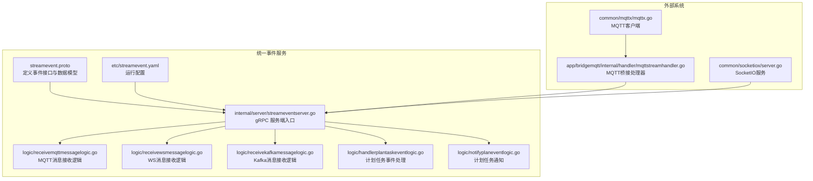
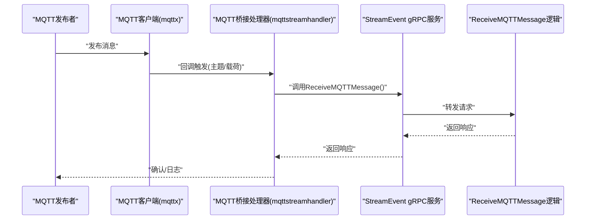
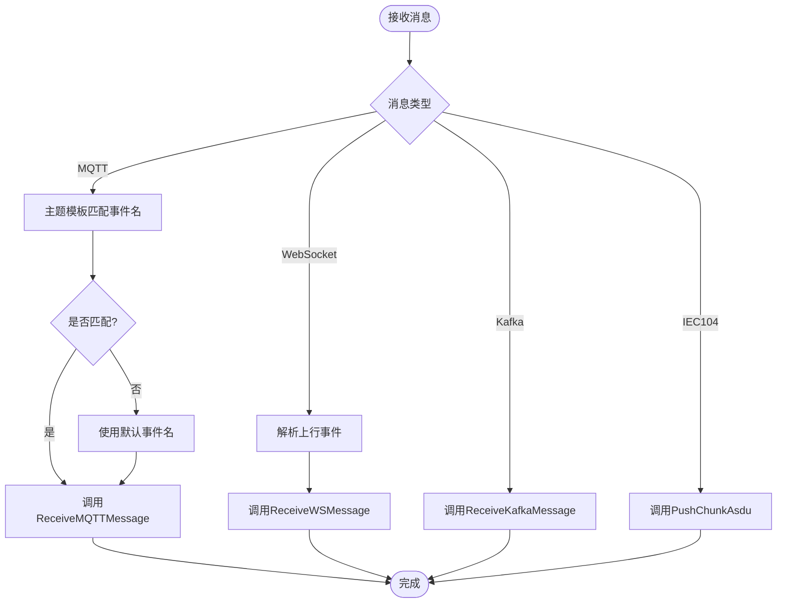
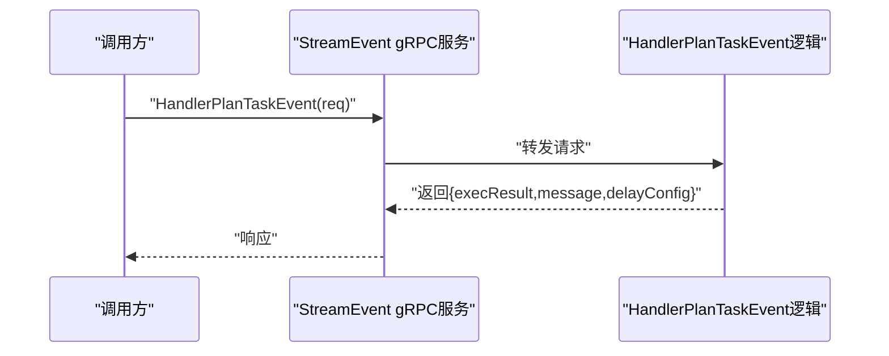
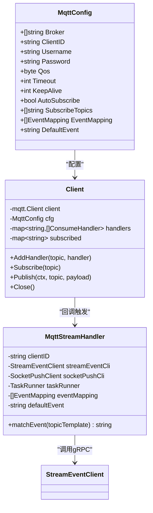
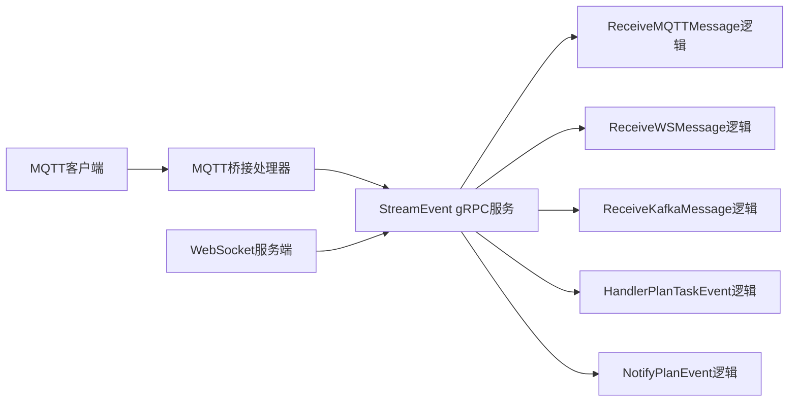

# 统一事件协议

<cite>
**本文引用的文件**
- [facade/streamevent/streamevent.proto](file://facade/streamevent/streamevent.proto)
- [facade/streamevent/etc/streamevent.yaml](file://facade/streamevent/etc/streamevent.yaml)
- [facade/streamevent/internal/config/config.go](file://facade/streamevent/internal/config/config.go)
- [facade/streamevent/internal/server/streameventserver.go](file://facade/streamevent/internal/server/streameventserver.go)
- [facade/streamevent/internal/logic/receivemqttmessagelogic.go](file://facade/streamevent/internal/logic/receivemqttmessagelogic.go)
- [facade/streamevent/internal/logic/receivewsmessagelogic.go](file://facade/streamevent/internal/logic/receivewsmessagelogic.go)
- [facade/streamevent/internal/logic/receivekafkamessagelogic.go](file://facade/streamevent/internal/logic/receivekafkamessagelogic.go)
- [facade/streamevent/internal/logic/handlerplantaskeventlogic.go](file://facade/streamevent/internal/logic/handlerplantaskeventlogic.go)
- [facade/streamevent/internal/logic/notifyplaneventlogic.go](file://facade/streamevent/internal/logic/notifyplaneventlogic.go)
- [common/mqttx/mqttx.go](file://common/mqttx/mqttx.go)
- [common/mqttx/message.go](file://common/mqttx/message.go)
- [app/bridgemqtt/internal/handler/mqttstreamhandler.go](file://app/bridgemqtt/internal/handler/mqttstreamhandler.go)
- [common/socketiox/server.go](file://common/socketiox/server.go)
- [swagger/streamevent.swagger.json](file://swagger/streamevent.swagger.json)
</cite>

## 目录
1. [简介](#简介)
2. [项目结构](#项目结构)
3. [核心组件](#核心组件)
4. [架构总览](#架构总览)
5. [详细组件分析](#详细组件分析)
6. [依赖分析](#依赖分析)
7. [性能考虑](#性能考虑)
8. [故障排查指南](#故障排查指南)
9. [结论](#结论)
10. [附录](#附录)

## 简介
本文件系统性阐述 Zero-Service 的统一事件协议（StreamEvent）的设计理念、架构原理与实现细节，覆盖事件分类、消息路由、协议转换、事件处理器（计划任务事件、通知事件、消息接收处理）以及与 Kafka、MQTT、WebSocket 等消息系统的集成方式。同时提供配置选项、性能优化策略与扩展开发指南，并通过图示与路径引用帮助读者快速定位实现与使用方法。

## 项目结构
统一事件协议位于 facade 层的 streamevent 服务中，采用 goctl 生成的 gRPC 服务框架，结合内部 logic 层进行具体业务处理；同时通过 common 层的 mqttx、socketiox 等模块实现对外部消息系统的接入与桥接。

**图表来源**
- [facade/streamevent/streamevent.proto:10-25](file://facade/streamevent/streamevent.proto#L10-L25)
- [facade/streamevent/etc/streamevent.yaml:1-28](file://facade/streamevent/etc/streamevent.yaml#L1-L28)
- [facade/streamevent/internal/server/streameventserver.go:15-67](file://facade/streamevent/internal/server/streameventserver.go#L15-L67)
- [facade/streamevent/internal/logic/receivemqttmessagelogic.go:12-31](file://facade/streamevent/internal/logic/receivemqttmessagelogic.go#L12-L31)
- [facade/streamevent/internal/logic/receivewsmessagelogic.go:12-31](file://facade/streamevent/internal/logic/receivewsmessagelogic.go#L12-L31)
- [facade/streamevent/internal/logic/receivekafkamessagelogic.go:12-31](file://facade/streamevent/internal/logic/receivekafkamessagelogic.go#L12-L31)
- [facade/streamevent/internal/logic/handlerplantaskeventlogic.go:14-38](file://facade/streamevent/internal/logic/handlerplantaskeventlogic.go#L14-L38)
- [facade/streamevent/internal/logic/notifyplaneventlogic.go:12-31](file://facade/streamevent/internal/logic/notifyplaneventlogic.go#L12-L31)
- [common/mqttx/mqttx.go:76-87](file://common/mqttx/mqttx.go#L76-L87)
- [app/bridgemqtt/internal/handler/mqttstreamhandler.go:109-128](file://app/bridgemqtt/internal/handler/mqttstreamhandler.go#L109-L128)
- [common/socketiox/server.go:392-468](file://common/socketiox/server.go#L392-L468)

**章节来源**
- [facade/streamevent/etc/streamevent.yaml:1-28](file://facade/streamevent/etc/streamevent.yaml#L1-L28)
- [facade/streamevent/internal/config/config.go:5-24](file://facade/streamevent/internal/config/config.go#L5-L24)

## 核心组件
- 事件接口与数据模型：通过 proto 定义统一的事件 RPC 接口与消息体结构，涵盖 MQTT、WS、Kafka、IEC104 报文、计划任务事件等。
- gRPC 服务端：将 RPC 方法映射到对应的 logic 层处理函数，负责请求转发与响应返回。
- 事件处理器：
  - 计划任务事件处理：接收计划任务触发请求并返回执行结果与延期配置。
  - 通知计划任务事件：接收计划生命周期事件（批次完成、计划完成）的通知。
  - 消息接收处理：分别处理来自 MQTT、WebSocket、Kafka 的消息，后续可扩展到 IEC104 报文推送。
- 外部系统桥接：
  - MQTT 客户端：提供订阅、发布、追踪、指标统计能力，并支持主题到事件的映射。
  - WebSocket 服务：支持 join/leave/上行事件等标准事件处理。
  - MQTT 桥接处理器：将 MQTT 消息转换为统一事件协议的消息结构并调用 gRPC。

**章节来源**
- [facade/streamevent/streamevent.proto:10-25](file://facade/streamevent/streamevent.proto#L10-L25)
- [facade/streamevent/internal/server/streameventserver.go:26-66](file://facade/streamevent/internal/server/streameventserver.go#L26-L66)
- [facade/streamevent/internal/logic/handlerplantaskeventlogic.go:28-38](file://facade/streamevent/internal/logic/handlerplantaskeventlogic.go#L28-L38)
- [facade/streamevent/internal/logic/notifyplaneventlogic.go:26-31](file://facade/streamevent/internal/logic/notifyplaneventlogic.go#L26-L31)
- [common/mqttx/mqttx.go:45-64](file://common/mqttx/mqttx.go#L45-L64)
- [common/socketiox/server.go:392-468](file://common/socketiox/server.go#L392-L468)
- [app/bridgemqtt/internal/handler/mqttstreamhandler.go:121-128](file://app/bridgemqtt/internal/handler/mqttstreamhandler.go#L121-L128)

## 架构总览
统一事件协议以 gRPC 为核心，向上承接各消息系统的输入，向下对接数据库与业务逻辑。MQTT 通过客户端与桥接处理器进行协议转换，WebSocket 提供实时上行事件通道，Kafka 作为流式消息入口，IEC104 报文通过专用 RPC 接口进入统一处理流程。

**图表来源**
- [common/mqttx/mqttx.go:258-307](file://common/mqttx/mqttx.go#L258-L307)
- [app/bridgemqtt/internal/handler/mqttstreamhandler.go:109-128](file://app/bridgemqtt/internal/handler/mqttstreamhandler.go#L109-L128)
- [facade/streamevent/internal/server/streameventserver.go:26-30](file://facade/streamevent/internal/server/streameventserver.go#L26-L30)
- [facade/streamevent/internal/logic/receivemqttmessagelogic.go:26-31](file://facade/streamevent/internal/logic/receivemqttmessagelogic.go#L26-L31)

## 详细组件分析

### 事件分类与消息路由
- 事件分类
  - 计划任务事件：包含计划任务触发、执行结果与延期配置。
  - 通知事件：用于计划生命周期事件通知（批次完成、计划完成）。
  - 消息接收事件：MQTT、WebSocket、Kafka 三类消息入口。
  - IEC104 报文事件：以 chunk 形式推送 ASDU 消息，携带设备与元数据。
- 消息路由
  - gRPC 服务端根据方法名将请求路由到对应逻辑层。
  - MQTT 桥接处理器根据主题模板匹配事件名，若未匹配则使用默认事件名。
  - WebSocket 事件通过标准事件名（如 join/leave/up）进行处理。

**图表来源**
- [facade/streamevent/internal/server/streameventserver.go:26-66](file://facade/streamevent/internal/server/streameventserver.go#L26-L66)
- [app/bridgemqtt/internal/handler/mqttstreamhandler.go:121-128](file://app/bridgemqtt/internal/handler/mqttstreamhandler.go#L121-L128)
- [common/mqttx/mqttx.go:45-64](file://common/mqttx/mqttx.go#L45-L64)

**章节来源**
- [facade/streamevent/streamevent.proto:10-25](file://facade/streamevent/streamevent.proto#L10-L25)
- [facade/streamevent/internal/server/streameventserver.go:26-66](file://facade/streamevent/internal/server/streameventserver.go#L26-L66)
- [app/bridgemqtt/internal/handler/mqttstreamhandler.go:121-128](file://app/bridgemqtt/internal/handler/mqttstreamhandler.go#L121-L128)

### 计划任务事件处理
- 输入：包含计划、批次、执行项、点位、业务负载、触发时间等。
- 输出：执行结果（完成/终止/失败/延期/进行中）、消息、原因及延期配置。
- 实现要点：逻辑层返回固定结果与示例延期配置，实际业务可在此基础上扩展持久化与调度。

**图表来源**
- [facade/streamevent/internal/server/streameventserver.go:56-60](file://facade/streamevent/internal/server/streameventserver.go#L56-L60)
- [facade/streamevent/internal/logic/handlerplantaskeventlogic.go:28-38](file://facade/streamevent/internal/logic/handlerplantaskeventlogic.go#L28-L38)

**章节来源**
- [facade/streamevent/internal/logic/handlerplantaskeventlogic.go:28-38](file://facade/streamevent/internal/logic/handlerplantaskeventlogic.go#L28-L38)

### 通知事件处理
- 输入：事件类型（批次完成/计划完成）、关联计划/批次 ID、扩展属性。
- 输出：空响应。
- 实现要点：逻辑层预留扩展点，可用于通知下游系统或更新状态机。

**章节来源**
- [facade/streamevent/internal/logic/notifyplaneventlogic.go:26-31](file://facade/streamevent/internal/logic/notifyplaneventlogic.go#L26-L31)

### 消息接收处理
- MQTT 消息接收
  - 输入：消息数组，包含会话 ID、消息 ID、主题模板、主题、载荷、发送时间。
  - 输出：空响应。
  - 实现要点：逻辑层预留处理链路，后续可接入规则引擎、存储或转发。
- WebSocket 消息接收
  - 输入：会话 ID、消息 ID、载荷、发送时间。
  - 输出：空响应。
  - 实现要点：与 WebSocket 服务端事件处理配合，支持房间管理与上行事件。
- Kafka 消息接收
  - 输入：消息数组，包含会话 ID、主题、消费者组、键、值、发送时间。
  - 输出：空响应。
  - 实现要点：适合批处理与流式处理场景，可与事件驱动架构结合。

**章节来源**
- [facade/streamevent/internal/logic/receivemqttmessagelogic.go:26-31](file://facade/streamevent/internal/logic/receivemqttmessagelogic.go#L26-L31)
- [facade/streamevent/internal/logic/receivewsmessagelogic.go:26-31](file://facade/streamevent/internal/logic/receivewsmessagelogic.go#L26-L31)
- [facade/streamevent/internal/logic/receivekafkamessagelogic.go:26-31](file://facade/streamevent/internal/logic/receivekafkamessagelogic.go#L26-L31)

### 协议转换与桥接
- MQTT 协议转换
  - 使用 mqttx 客户端订阅主题，消息到达后通过桥接处理器将消息封装为统一事件协议的 MQTT 请求并调用 gRPC。
  - 支持主题模板匹配与默认事件名回退。
- WebSocket 协议转换
  - WebSocket 服务端解析标准事件（如 join/leave/up），并将上行事件转换为统一事件协议的 WS 请求。
- IEC104 报文转换
  - 通过 PushChunkAsdu 接口接收 ASDU 消息块，包含设备地址、ASDU 类型、信息体、时间戳与元数据，便于后续入库与分析。

**图表来源**
- [common/mqttx/mqttx.go:51-64](file://common/mqttx/mqttx.go#L51-L64)
- [common/mqttx/mqttx.go:76-87](file://common/mqttx/mqttx.go#L76-L87)
- [app/bridgemqtt/internal/handler/mqttstreamhandler.go:109-128](file://app/bridgemqtt/internal/handler/mqttstreamhandler.go#L109-L128)

**章节来源**
- [common/mqttx/mqttx.go:45-64](file://common/mqttx/mqttx.go#L45-L64)
- [common/mqttx/mqttx.go:180-202](file://common/mqttx/mqttx.go#L180-L202)
- [app/bridgemqtt/internal/handler/mqttstreamhandler.go:109-128](file://app/bridgemqtt/internal/handler/mqttstreamhandler.go#L109-L128)

## 依赖分析
- 组件耦合
  - gRPC 服务端与逻辑层松耦合，通过接口隔离，便于替换与测试。
  - MQTT 桥接处理器依赖 StreamEvent 客户端与 SocketPush 客户端，形成对外部服务的依赖。
  - WebSocket 事件处理依赖 socketiox 服务端，提供房间与上行事件能力。
- 外部依赖
  - Kafka：通过逻辑层预留接口，可接入消费者与生产者。
  - IEC104：通过专用 RPC 接口接收报文，便于与 SCADA/EMS 系统集成。
- 循环依赖
  - 当前结构未发现循环依赖，模块边界清晰。

**图表来源**
- [facade/streamevent/internal/server/streameventserver.go:26-66](file://facade/streamevent/internal/server/streameventserver.go#L26-L66)
- [app/bridgemqtt/internal/handler/mqttstreamhandler.go:109-128](file://app/bridgemqtt/internal/handler/mqttstreamhandler.go#L109-L128)
- [common/socketiox/server.go:392-468](file://common/socketiox/server.go#L392-L468)

**章节来源**
- [facade/streamevent/internal/server/streameventserver.go:26-66](file://facade/streamevent/internal/server/streameventserver.go#L26-L66)

## 性能考虑
- 并发与限流
  - MQTT 桥接处理器使用并发任务运行器，建议根据 CPU 核心数与消息吞吐量调整并发度。
  - gRPC 服务端中间件支持忽略特定方法的统计记录，减少高吞吐方法的统计开销。
- 指标与追踪
  - MQTT 客户端内置指标收集与 OpenTelemetry 追踪，便于监控与性能分析。
- 存储与数据库
  - 配置支持 TaosDB 与 SQLite，建议根据场景选择合适的存储后端并合理设置连接参数。
- 日志与可观测性
  - 服务端配置支持日志级别与路径，建议在生产环境开启结构化日志与采样。

**章节来源**
- [facade/streamevent/etc/streamevent.yaml:11-13](file://facade/streamevent/etc/streamevent.yaml#L11-L13)
- [common/mqttx/mqttx.go:361-388](file://common/mqttx/mqttx.go#L361-L388)
- [facade/streamevent/etc/streamevent.yaml:22-27](file://facade/streamevent/etc/streamevent.yaml#L22-L27)

## 故障排查指南
- MQTT 连接问题
  - 检查 Broker 地址、认证信息与 KeepAlive/Timeout 配置。
  - 关注 OnConnectionLost 回调与订阅恢复逻辑。
- 主题未匹配
  - 确认 EventMapping 与 DefaultEvent 配置，确保主题模板正确。
- WebSocket 事件异常
  - 检查事件处理器注册与参数校验，关注 join/leave/up 的 ACK 返回。
- gRPC 调用失败
  - 查看服务端日志与中间件统计，确认请求体与超时设置。

**章节来源**
- [common/mqttx/mqttx.go:148-166](file://common/mqttx/mqttx.go#L148-L166)
- [app/bridgemqtt/internal/handler/mqttstreamhandler.go:121-128](file://app/bridgemqtt/internal/handler/mqttstreamhandler.go#L121-L128)
- [common/socketiox/server.go:392-468](file://common/socketiox/server.go#L392-L468)

## 结论
统一事件协议以 gRPC 为核心，结合 MQTT、WebSocket、Kafka 等多种消息系统，提供了统一的事件分类、路由与协议转换能力。通过清晰的逻辑层与桥接模块，既满足了实时性与扩展性需求，也为后续接入 IEC104 等工业协议奠定了基础。建议在生产环境中结合指标与追踪完善可观测性，并根据业务场景优化并发与存储配置。

## 附录

### 配置选项
- 服务配置（streamevent.yaml）
  - Name/ListenOn/Mode/Timeout/Log/Middlewares/NacosConfig/TaosDB/DB/DisableStmtLog
- 服务配置结构（config.go）
  - NacosConfig：注册开关、主机、端口、用户名、密码、命名空间、服务名
  - TaosDB：数据源、数据库名
  - DB：数据源
  - DisableStmtLog：禁用 SQL 语句日志

**章节来源**
- [facade/streamevent/etc/streamevent.yaml:1-28](file://facade/streamevent/etc/streamevent.yaml#L1-L28)
- [facade/streamevent/internal/config/config.go:5-24](file://facade/streamevent/internal/config/config.go#L5-L24)

### API 参考
- gRPC 接口定义与 Swagger 文档
  - StreamEvent 服务：ReceiveMQTTMessage、ReceiveWSMessage、ReceiveKafkaMessage、PushChunkAsdu、UpSocketMessage、HandlerPlanTaskEvent、NotifyPlanEvent
  - Swagger 文档：swagger/streamevent.swagger.json

**章节来源**
- [facade/streamevent/streamevent.proto:10-25](file://facade/streamevent/streamevent.proto#L10-L25)
- [swagger/streamevent.swagger.json](file://swagger/streamevent.swagger.json)

### 使用场景示例
- MQTT 消息接入
  - 在 app/bridgemqtt 中配置事件映射与默认事件名，通过桥接处理器将 MQTT 消息转换为统一事件协议并调用 gRPC。
- WebSocket 实时事件
  - 在 common/socketiox 中注册事件处理器，解析 join/leave/up 等事件并调用 gRPC。
- 计划任务编排
  - 通过 HandlerPlanTaskEvent 与 NotifyPlanEvent 实现计划任务的触发与生命周期通知。

**章节来源**
- [app/bridgemqtt/internal/handler/mqttstreamhandler.go:109-128](file://app/bridgemqtt/internal/handler/mqttstreamhandler.go#L109-L128)
- [common/socketiox/server.go:392-468](file://common/socketiox/server.go#L392-L468)
- [facade/streamevent/internal/logic/handlerplantaskeventlogic.go:28-38](file://facade/streamevent/internal/logic/handlerplantaskeventlogic.go#L28-L38)
- [facade/streamevent/internal/logic/notifyplaneventlogic.go:26-31](file://facade/streamevent/internal/logic/notifyplaneventlogic.go#L26-L31)