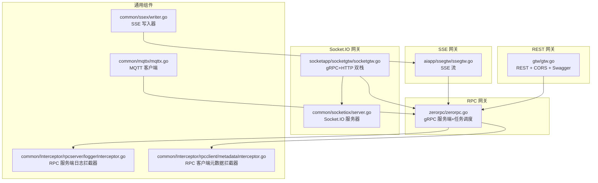
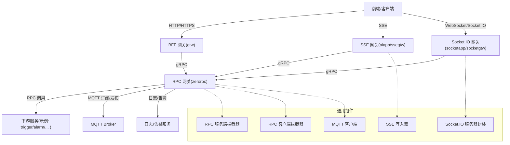
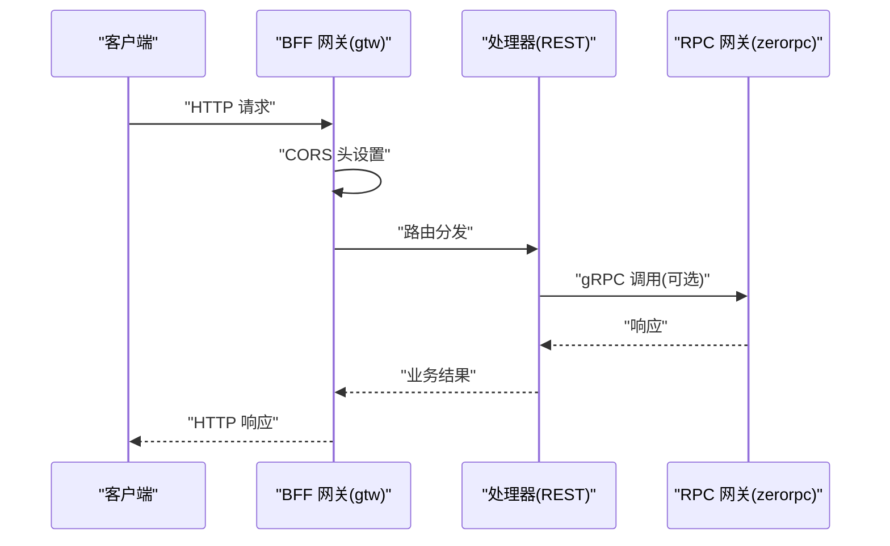
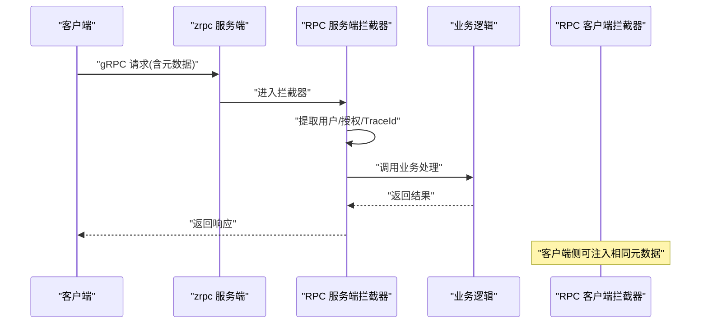
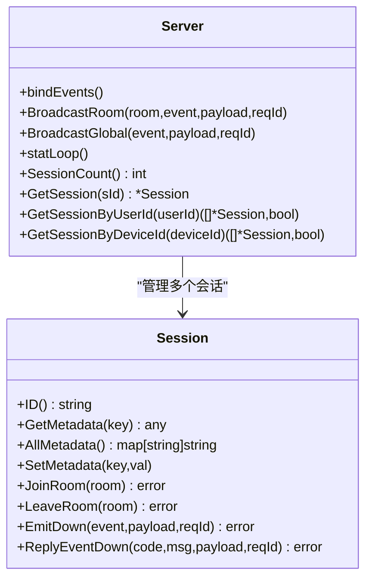
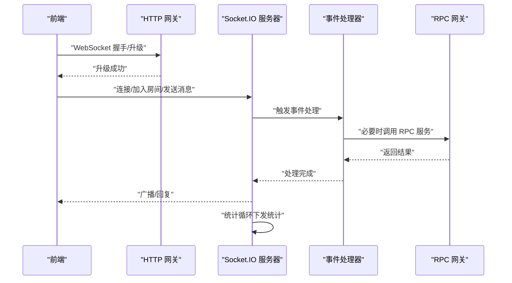
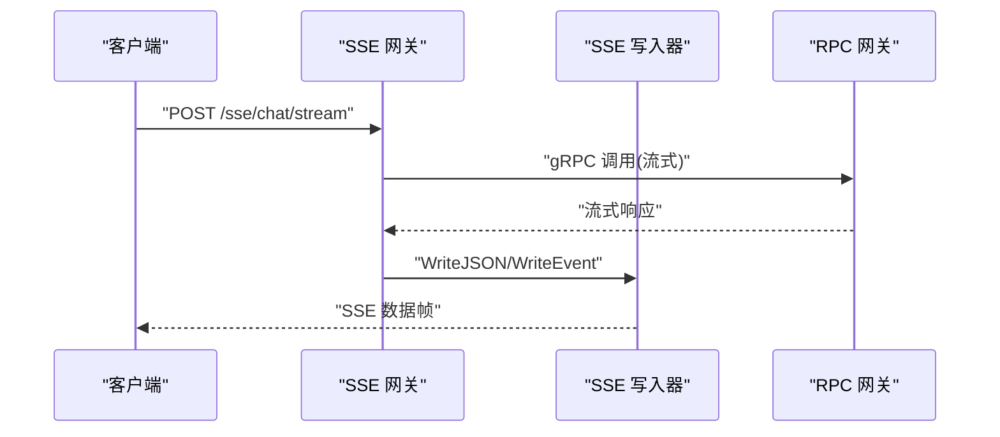
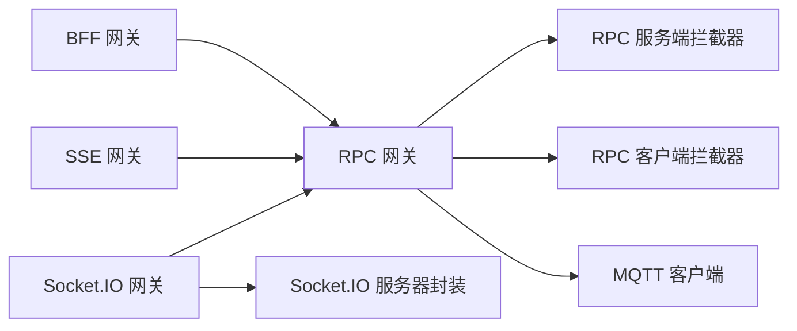

# 通信网关服务

<cite>
**本文引用的文件**   
- [gtw.go](file://gtw/gtw.go)
- [gtw.yaml](file://gtw/etc/gtw.yaml)
- [ssegtw.go](file://aiapp/ssegtw/ssegtw.go)
- [ssegtw.yaml](file://aiapp/ssegtw/etc/ssegtw.yaml)
- [ssegtw.api](file://aiapp/ssegtw/ssegtw.api)
- [socketgtw.go](file://socketapp/socketgtw/socketgtw.go)
- [socketgtw.yaml](file://socketapp/socketgtw/etc/socketgtw.yaml)
- [socketgtw.proto](file://socketapp/socketgtw/socketgtw/socketgtw.proto)
- [server.go](file://common/socketiox/server.go)
- [mqttx.go](file://common/mqttx/mqttx.go)
- [writer.go](file://common/ssex/writer.go)
- [loggerInterceptor.go](file://common/Interceptor/rpcserver/loggerInterceptor.go)
- [metadataInterceptor.go](file://common/Interceptor/rpcclient/metadataInterceptor.go)
- [resilience-patterns.md](file://.trae/skills/zero-skills/references/resilience-patterns.md)
- [zerorpc.go](file://zerorpc/zerorpc.go)
- [zerorpc.yaml](file://zerorpc/etc/zerorpc.yaml)
</cite>

## 目录
1. [简介](#简介)
2. [项目结构](#项目结构)
3. [核心组件](#核心组件)
4. [架构总览](#架构总览)
5. [组件详解](#组件详解)
6. [依赖关系分析](#依赖关系分析)
7. [性能与治理](#性能与治理)
8. [故障排查指南](#故障排查指南)
9. [结论](#结论)
10. [附录](#附录)

## 简介
本文件面向 Zero-Service 的通信网关服务，系统性梳理并解释以下三类网关的设计与实现：
- BFF 网关：REST API 聚合与路由，面向前端的统一入口。
- RPC 网关：gRPC 服务的统一接入与治理，支持鉴权、日志、熔断与负载均衡。
- 实时通信网关：基于 WebSocket/Socket.IO 的长连接网关，支持房间管理、全局广播、会话统计与安全控制。

同时，文档覆盖路由策略、协议转换、安全控制、负载均衡、熔断降级、限流保护、性能优化与监控指标，并提供扩展开发与自定义配置指南。

## 项目结构
围绕通信网关的关键模块如下：
- REST 网关：gtw（BFF 网关），提供 REST API、CORS、Swagger 静态路由与统一配置。
- SSE 网关：aiapp/ssegtw，提供 Server-Sent Events 流式输出能力。
- Socket.IO 网关：socketapp/socketgtw，提供 WebSocket/Socket.IO 会话管理、房间广播、全局广播与统计。
- RPC 网关：zerorpc，提供 gRPC 服务端、任务调度与通用中间件。
- 通用通信组件：mqttx（MQTT 客户端）、ssex（SSE 写入器）、socketiox（Socket.IO 服务器封装）。
- 通用拦截器：RPC 服务端日志拦截器、RPC 客户端元数据注入拦截器。

图表来源
- [gtw.go:1-96](file://gtw/gtw.go#L1-L96)
- [ssegtw.go:1-60](file://aiapp/ssegtw/ssegtw.go#L1-L60)
- [socketgtw.go:1-91](file://socketapp/socketgtw/socketgtw.go#L1-L91)
- [server.go:1-814](file://common/socketiox/server.go#L1-L814)
- [mqttx.go:1-389](file://common/mqttx/mqttx.go#L1-L389)
- [writer.go:1-79](file://common/ssex/writer.go#L1-L79)
- [loggerInterceptor.go:1-45](file://common/Interceptor/rpcserver/loggerInterceptor.go#L1-L45)
- [metadataInterceptor.go:1-56](file://common/Interceptor/rpcclient/metadataInterceptor.go#L1-L56)

章节来源
- [gtw.go:1-96](file://gtw/gtw.go#L1-L96)
- [ssegtw.go:1-60](file://aiapp/ssegtw/ssegtw.go#L1-L60)
- [socketgtw.go:1-91](file://socketapp/socketgtw/socketgtw.go#L1-L91)
- [server.go:1-814](file://common/socketiox/server.go#L1-L814)
- [mqttx.go:1-389](file://common/mqttx/mqttx.go#L1-L389)
- [writer.go:1-79](file://common/ssex/writer.go#L1-L79)
- [loggerInterceptor.go:1-45](file://common/Interceptor/rpcserver/loggerInterceptor.go#L1-L45)
- [metadataInterceptor.go:1-56](file://common/Interceptor/rpcclient/metadataInterceptor.go#L1-L56)

## 核心组件
- BFF 网关（REST）：基于 go-zero REST 服务，启用动态 CORS、Swagger 静态路由与统一日志字段。
- RPC 网关：基于 go-zero zrpc，注册 gRPC 服务，注入日志拦截器，支持任务调度与定时任务。
- 实时通信网关（Socket.IO）：基于 go-zero REST + 自研 socketiox，提供连接认证、房间管理、广播与统计。
- SSE 网关：基于 go-zero REST，提供 SSE 事件流与聊天流接口。
- 通用组件：MQTT 客户端用于订阅/发布；SSE 写入器封装标准 SSE 输出；RPC 拦截器负责上下文透传与日志记录。

章节来源
- [gtw.go:1-96](file://gtw/gtw.go#L1-L96)
- [zerorpc.go:1-59](file://zerorpc/zerorpc.go#L1-L59)
- [server.go:1-814](file://common/socketiox/server.go#L1-L814)
- [writer.go:1-79](file://common/ssex/writer.go#L1-L79)
- [mqttx.go:1-389](file://common/mqttx/mqttx.go#L1-L389)
- [loggerInterceptor.go:1-45](file://common/Interceptor/rpcserver/loggerInterceptor.go#L1-L45)
- [metadataInterceptor.go:1-56](file://common/Interceptor/rpcclient/metadataInterceptor.go#L1-L56)

## 架构总览
下图展示三类网关的整体交互与依赖关系：

图表来源
- [gtw.go:1-96](file://gtw/gtw.go#L1-L96)
- [ssegtw.go:1-60](file://aiapp/ssegtw/ssegtw.go#L1-L60)
- [socketgtw.go:1-91](file://socketapp/socketgtw/socketgtw.go#L1-L91)
- [zerorpc.go:1-59](file://zerorpc/zerorpc.go#L1-L59)
- [server.go:1-814](file://common/socketiox/server.go#L1-L814)
- [writer.go:1-79](file://common/ssex/writer.go#L1-L79)
- [mqttx.go:1-389](file://common/mqttx/mqttx.go#L1-L389)
- [loggerInterceptor.go:1-45](file://common/Interceptor/rpcserver/loggerInterceptor.go#L1-L45)
- [metadataInterceptor.go:1-56](file://common/Interceptor/rpcclient/metadataInterceptor.go#L1-L56)

## 组件详解

### BFF 网关（REST）
- 能力概述
  - REST 服务启动与路由注册。
  - 动态 CORS 配置，支持 Origin 白名单与敏感头透传。
  - Swagger 静态路由，按配置加载 swagger.json 文件。
  - 统一日志字段，便于链路追踪与审计。
- 关键点
  - CORS 使用自定义回调，设置 Vary、凭证、方法与头部白名单。
  - Swagger 路由通过路径参数读取文件名，拼接绝对路径返回 JSON。
  - 通过配置文件集中管理服务名、主机、端口、超时与日志路径。

图表来源
- [gtw.go:51-65](file://gtw/gtw.go#L51-L65)
- [gtw.go:70-90](file://gtw/gtw.go#L70-L90)
- [zerorpc.go:1-59](file://zerorpc/zerorpc.go#L1-L59)

章节来源
- [gtw.go:1-96](file://gtw/gtw.go#L1-L96)
- [gtw.yaml:1-61](file://gtw/etc/gtw.yaml#L1-L61)

### RPC 网关（gRPC）
- 能力概述
  - 基于 zrpc 注册 gRPC 服务，支持反射（开发/测试模式）。
  - 注入 RPC 服务端日志拦截器，自动从 gRPC 元数据注入用户上下文。
  - 提供任务调度与异步队列服务（Asynq），支持 Cron 作业。
  - 配置中可启用 JWT 鉴权、数据库与缓存、告警服务等。
- 关键点
  - 日志拦截器从元数据提取用户标识、用户名、部门、授权令牌与 TraceId，注入到上下文。
  - 客户端侧可通过元数据拦截器将上下文信息透传至下游服务。
  - 任务调度器与计划器在同组服务生命周期内启动。

图表来源
- [zerorpc.go:35-44](file://zerorpc/zerorpc.go#L35-L44)
- [loggerInterceptor.go:12-44](file://common/Interceptor/rpcserver/loggerInterceptor.go#L12-L44)
- [metadataInterceptor.go:11-32](file://common/Interceptor/rpcclient/metadataInterceptor.go#L11-L32)

章节来源
- [zerorpc.go:1-59](file://zerorpc/zerorpc.go#L1-L59)
- [zerorpc.yaml:1-39](file://zerorpc/etc/zerorpc.yaml#L1-L39)
- [loggerInterceptor.go:1-45](file://common/Interceptor/rpcserver/loggerInterceptor.go#L1-L45)
- [metadataInterceptor.go:1-56](file://common/Interceptor/rpcclient/metadataInterceptor.go#L1-L56)

### 实时通信网关（Socket.IO）
- 能力概述
  - 提供 Socket.IO 服务器封装，支持连接认证、事件处理、房间管理、全局广播与会话统计。
  - 支持通过 HTTP 网关与 gRPC 网关协同工作，HTTP 负责握手升级，gRPC 负责业务处理。
  - 支持 Nacos 服务注册（可选），并提供会话统计事件下发。
- 关键点
  - 事件模型：连接、断开、通用上行事件、房间广播、全局广播、统计下行。
  - 会话管理：基于连接 ID 维护会话集合，支持按元数据查询会话（如用户 ID、设备 ID）。
  - 房间管理：加入/离开房间，广播到房间或全局。
  - 统计循环：周期性向每个会话下发统计信息（会话数、房间列表、每秒消息数、元数据）。

图表来源
- [server.go:299-814](file://common/socketiox/server.go#L299-L814)

图表来源
- [socketgtw.go:40-61](file://socketapp/socketgtw/socketgtw.go#L40-L61)
- [server.go:337-676](file://common/socketiox/server.go#L337-L676)
- [server.go:702-740](file://common/socketiox/server.go#L702-L740)

章节来源
- [socketgtw.go:1-91](file://socketapp/socketgtw/socketgtw.go#L1-L91)
- [socketgtw.yaml:1-37](file://socketapp/socketgtw/etc/socketgtw.yaml#L1-L37)
- [socketgtw.proto](file://socketapp/socketgtw/socketgtw/socketgtw.proto)
- [server.go:1-814](file://common/socketiox/server.go#L1-L814)

### SSE 网关
- 能力概述
  - 提供健康检查与 SSE 事件流接口，支持聊天流输出。
  - 基于 go-zero REST，启用动态 CORS。
  - 通过 API 描述文件定义路由与超时策略。
- 关键点
  - SSE 写入器封装标准事件/数据/注释/心跳/JSON 输出，自动 Flush。
  - API 文件中定义了 SSE 与聊天流的路由前缀与超时。

图表来源
- [ssegtw.go:35-46](file://aiapp/ssegtw/ssegtw.go#L35-L46)
- [writer.go:24-79](file://common/ssex/writer.go#L24-L79)
- [ssegtw.api:18-38](file://aiapp/ssegtw/ssegtw.api#L18-L38)

章节来源
- [ssegtw.go:1-60](file://aiapp/ssegtw/ssegtw.go#L1-L60)
- [ssegtw.yaml:1-14](file://aiapp/ssegtw/etc/ssegtw.yaml#L1-L14)
- [ssegtw.api:1-38](file://aiapp/ssegtw/ssegtw.api#L1-L38)
- [writer.go:1-79](file://common/ssex/writer.go#L1-L79)

### MQTT 与任务调度（通用组件）
- MQTT 客户端
  - 支持自动重连、订阅恢复、默认事件映射、QoS 控制与链路追踪。
  - 提供消息处理包装器，自动提取传播上下文并记录指标与错误。
- 任务调度
  - 在 RPC 网关中集成 Asynq 任务服务器与调度器，支持 Cron 作业注册与运行。

章节来源
- [mqttx.go:1-389](file://common/mqttx/mqttx.go#L1-L389)
- [zerorpc.go:48-53](file://zerorpc/zerorpc.go#L48-L53)

## 依赖关系分析
- 组件耦合
  - BFF 网关与 SSE 网关均依赖 RPC 网关进行业务处理。
  - Socket.IO 网关通过 HTTP 升级与 gRPC 协同，内部使用 socketiox 封装。
  - RPC 网关依赖拦截器进行上下文透传与日志记录。
- 外部依赖
  - Nacos（可选）用于服务注册与发现。
  - MQTT Broker 用于消息订阅/发布。
  - 数据库、缓存、Redis、告警服务等在 RPC 网关配置中启用。

图表来源
- [gtw.go:1-96](file://gtw/gtw.go#L1-L96)
- [ssegtw.go:1-60](file://aiapp/ssegtw/ssegtw.go#L1-L60)
- [socketgtw.go:1-91](file://socketapp/socketgtw/socketgtw.go#L1-L91)
- [server.go:1-814](file://common/socketiox/server.go#L1-L814)
- [loggerInterceptor.go:1-45](file://common/Interceptor/rpcserver/loggerInterceptor.go#L1-L45)
- [metadataInterceptor.go:1-56](file://common/Interceptor/rpcclient/metadataInterceptor.go#L1-L56)
- [mqttx.go:1-389](file://common/mqttx/mqttx.go#L1-L389)

## 性能与治理
- 路由策略
  - REST：基于 go-zero 路由注册，支持静态与动态路由；BFF 网关通过配置集中管理上游 gRPC 映射。
  - Socket.IO：事件驱动模型，房间与全局广播采用广播 API，避免逐个会话推送。
  - SSE：单向流式输出，适合 AI 对话与事件推送。
- 协议转换
  - REST → gRPC：BFF 网关将 HTTP 请求转换为 gRPC 调用，自动注入鉴权与追踪上下文。
  - Socket.IO → gRPC：实时网关在必要时调用 RPC 服务，实现业务处理与状态同步。
- 安全控制
  - CORS：动态 Origin 白名单、凭证与敏感头透传。
  - JWT：RPC 网关配置中启用访问密钥与过期时间。
  - 元数据透传：拦截器自动注入用户标识、授权令牌与 TraceId。
- 负载均衡与熔断降级
  - go-zero 内置 gRPC 客户端负载均衡与熔断器，结合 Circuit Breaker 与自动负载抛出。
  - 生产模式下自动启用 CPU 驱动的负载抛出（Load Shedding）。
- 限流保护
  - 建议在 REST 层引入速率限制（如基于 Redis），在 RPC 层对下游服务设置合理超时与重试策略。
- 监控指标
  - RPC 客户端/服务端拦截器记录错误与耗时。
  - MQTT 客户端内置指标收集与链路追踪。
  - Socket.IO 统计循环输出会话数、房间数、每秒消息数等。

章节来源
- [resilience-patterns.md:64-123](file://.trae/skills/zero-skills/references/resilience-patterns.md#L64-L123)
- [loggerInterceptor.go:12-44](file://common/Interceptor/rpcserver/loggerInterceptor.go#L12-L44)
- [metadataInterceptor.go:11-32](file://common/Interceptor/rpcclient/metadataInterceptor.go#L11-L32)
- [mqttx.go:361-389](file://common/mqttx/mqttx.go#L361-L389)
- [server.go:702-740](file://common/socketiox/server.go#L702-L740)

## 故障排查指南
- CORS 相关问题
  - 检查动态 Origin 设置与 Vary 头是否正确，确认前端实际请求头是否包含 Origin。
- Socket.IO 会话异常
  - 查看连接/断开钩子日志，确认认证回调与房间加载错误。
  - 使用统计循环确认会话数量与房间列表一致性。
- gRPC 调用失败
  - 检查拦截器是否正确注入用户上下文与 TraceId。
  - 确认下游服务端是否开启反射（开发/测试模式）。
- MQTT 订阅/发布异常
  - 检查 Broker 地址、ClientID、QoS 与超时配置。
  - 观察连接丢失回调与订阅恢复逻辑。
- SSE 输出异常
  - 确认 ResponseWriter 支持 Flusher，检查事件/数据/心跳写入顺序。

章节来源
- [gtw.go:51-65](file://gtw/gtw.go#L51-L65)
- [server.go:337-676](file://common/socketiox/server.go#L337-L676)
- [loggerInterceptor.go:12-44](file://common/Interceptor/rpcserver/loggerInterceptor.go#L12-L44)
- [mqttx.go:137-178](file://common/mqttx/mqttx.go#L137-L178)
- [writer.go:15-22](file://common/ssex/writer.go#L15-L22)

## 结论
Zero-Service 的通信网关体系以 go-zero 为核心，实现了 REST、gRPC、Socket.IO 与 SSE 的统一接入与治理。通过拦截器、负载均衡、熔断与自动负载抛出等机制，保障高可用与可观测性。Socket.IO 与 MQTT 组件提供了丰富的实时通信能力，配合 RPC 网关实现端到端的业务闭环。建议在生产环境中启用负载抛出、速率限制与完善的监控告警体系，持续优化性能与稳定性。

## 附录
- 扩展开发建议
  - 新增 REST 接口：在对应 API 文件中定义路由，注册到 REST 服务。
  - 新增 gRPC 服务：定义 proto，生成代码，注册到 zrpc 服务端。
  - 新增 Socket.IO 事件：在 socketiox 事件映射中注册处理器。
  - 新增 MQTT 主题：使用 MQTT 客户端订阅/发布，或在 RPC 网关中集成。
- 自定义配置
  - BFF 网关：调整 CORS、Swagger 路径与上游 gRPC 映射。
  - RPC 网关：启用 JWT、数据库、缓存、告警与任务调度。
  - Socket.IO 网关：配置 Nacos 注册、Socket 元数据键与流事件上游。