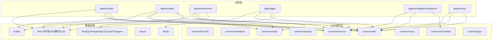
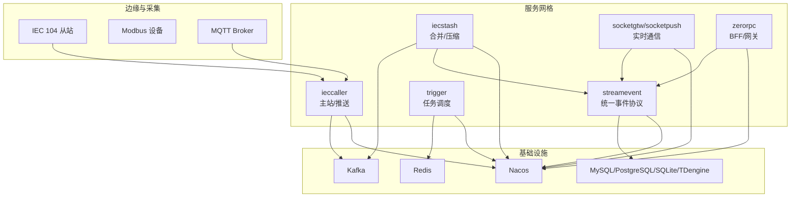
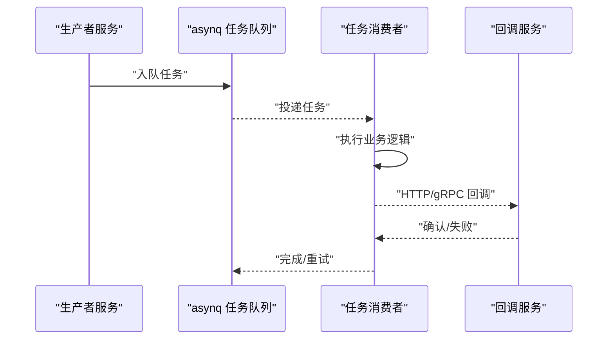
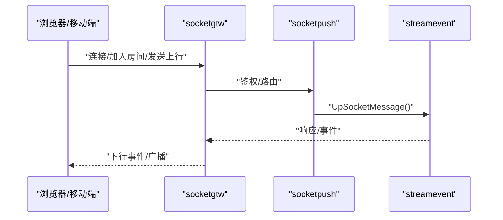
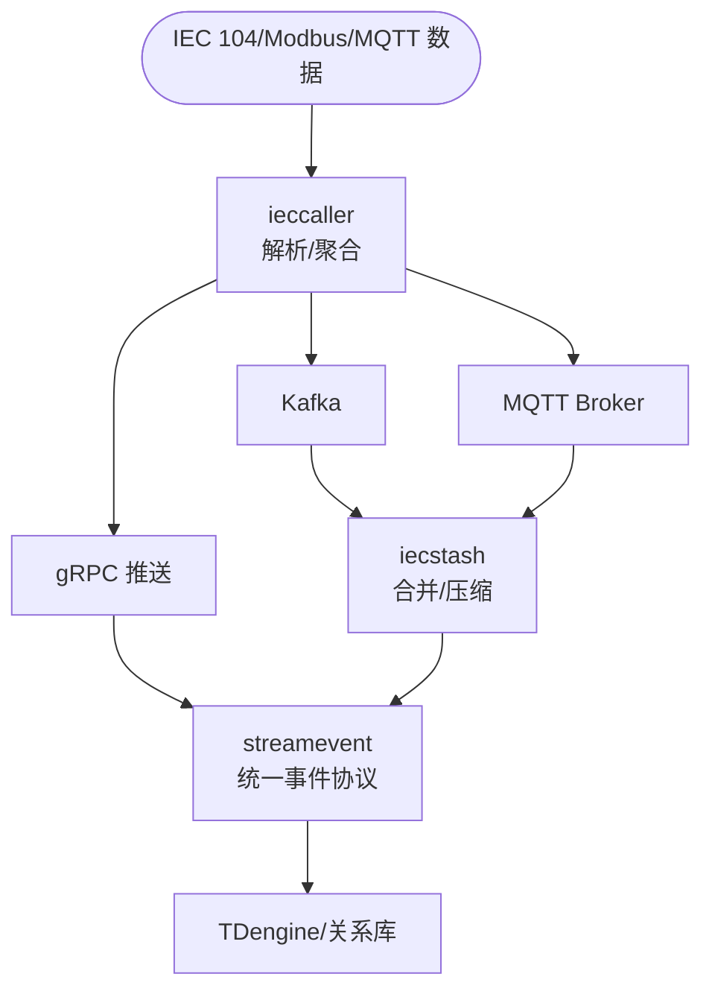
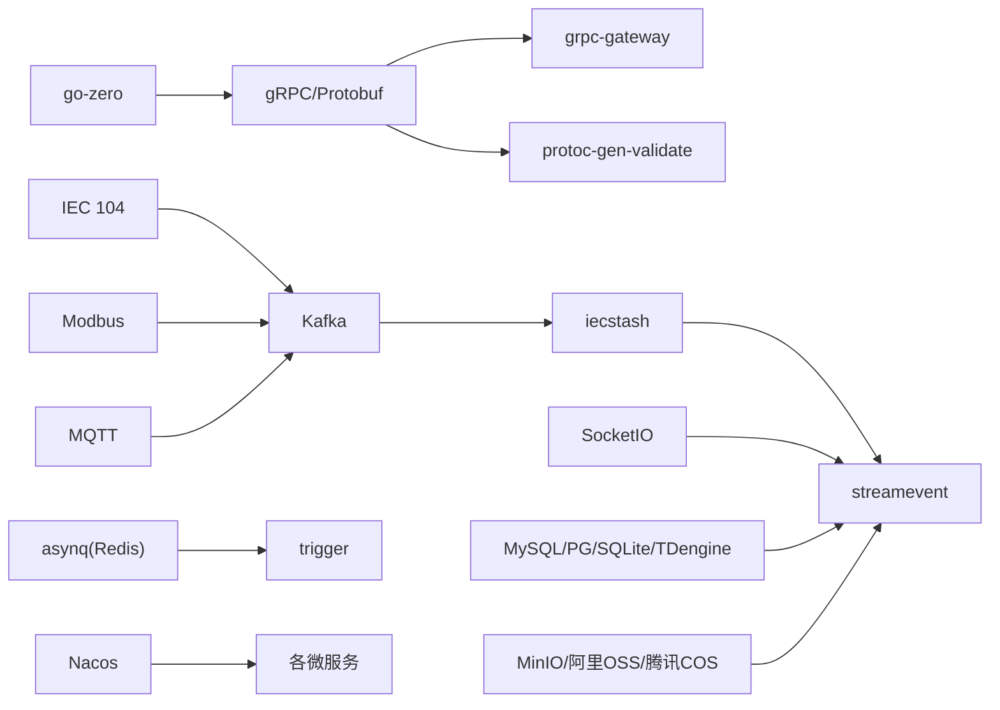

# 技术栈选型

<cite>
**本文引用的文件**
- [go.mod](file://go.mod)
- [README.md](file://README.md)
- [app/trigger/etc/trigger.yaml](file://app/trigger/etc/trigger.yaml)
- [app/ieccaller/etc/ieccaller.yaml](file://app/ieccaller/etc/ieccaller.yaml)
- [socketapp/socketgtw/etc/socketgtw.yaml](file://socketapp/socketgtw/etc/socketgtw.yaml)
- [zerorpc/etc/zerorpc.yaml](file://zerorpc/etc/zerorpc.yaml)
- [deploy/docker-compose.yml](file://deploy/docker-compose.yml)
- [common/asynqx/asynqSchedulerServer.go](file://common/asynqx/asynqSchedulerServer.go)
- [common/asynqx/asynqTaskServer.go](file://common/asynqx/asynqTaskServer.go)
- [common/asynqx/asynqClient.go](file://common/asynqx/asynqClient.go)
- [common/socketiox/server.go](file://common/socketiox/server.go)
- [socketapp/socketgtw/internal/sockethandler/sockertuphandler.go](file://socketapp/socketgtw/internal/sockethandler/sockertuphandler.go)
- [common/mqttx/mqttx.go](file://common/mqttx/mqttx.go)
- [common/dbx/dbx.go](file://common/dbx/dbx.go)
- [common/ossx/ossx.go](file://common/ossx/ossx.go)
- [common/nacosx/register.go](file://common/nacosx/register.go)
- [common/gisx/gisx.go](file://common/gisx/gisx.go)
- [common/iec104/types/types.go](file://common/iec104/types/types.go)
- [common/modbusx/client.go](file://common/modbusx/client.go)
- [facade/streamevent/streamevent/streamevent.pb.go](file://facade/streamevent/streamevent/streamevent.pb.go)
- [facade/streamevent/streamevent/streamevent.pb.validate.go](file://facade/streamevent/streamevent/streamevent.pb.validate.go)
</cite>

## 目录
1. [简介](#简介)
2. [项目结构](#项目结构)
3. [核心组件](#核心组件)
4. [架构总览](#架构总览)
5. [详细组件分析](#详细组件分析)
6. [依赖分析](#依赖分析)
7. [性能考量](#性能考量)
8. [故障排查指南](#故障排查指南)
9. [结论](#结论)
10. [附录](#附录)

## 简介
本技术栈选型文档围绕 Zero-Service 项目，系统阐述其核心技术与框架选择，包括：
- 微服务框架：go-zero
- RPC 通信：gRPC + grpc-gateway + Protocol Buffers
- 消息队列：Kafka（go-queue）
- 任务队列：asynq + Redis
- 实时通信：SocketIO（fork of socket.io-golang）
- 工业协议：IEC 60870-5-104（go-iecp5）、Modbus（grid-x/modbus）、MQTT（paho.mqtt）
- 数据库：MySQL / PostgreSQL / SQLite / TDengine
- 对象存储：MinIO / 阿里 OSS / 腾讯 COS
- 服务发现：Nacos
- 地理信息：H3（uber/h3-go）/ GeoHash / orb / go-geom
- 容器管理：Docker SDK
- 监控追踪：OpenTelemetry / Prometheus
- 容器编排：Docker Compose / Kubernetes（可选）

选型目标是在工业级物联网场景下，兼顾高性能、低延迟、可扩展与易维护。

## 项目结构
项目采用“微服务 + 公共组件 + 外部接口层”的分层组织：
- app/：核心微服务（trigger、ieccaller、iecstash、streamevent、socketapp、zerorpc 等）
- common/：公共组件库（协议、队列、存储、GIS、容器、工具等）
- facade/：对外统一接口层（streamevent）
- deploy/：编排与部署（docker-compose）
- docs/swagger/third_party：文档、API 文档与第三方 proto

图表来源
- [README.md:15-51](file://README.md#L15-L51)
- [deploy/docker-compose.yml:4-30](file://deploy/docker-compose.yml#L4-L30)

章节来源
- [README.md:59-108](file://README.md#L59-L108)

## 核心组件
- go-zero：统一微服务开发框架，提供 RPC、HTTP、中间件、配置、日志、监控等能力，支撑全栈服务。
- gRPC + grpc-gateway + Protocol Buffers：强类型接口定义与跨语言序列化，结合 HTTP/JSON 网关，满足多端接入。
- Kafka：高吞吐消息总线，承载 IEC 104 数据、MQTT 上行、WebSocket 等多源事件。
- asynq：轻量分布式任务队列，基于 Redis，支持定时/延时任务、回调、重试与可观测性。
- SocketIO：实时双向通信，支持房间、广播、鉴权与 MQTT 桥接。
- 工业协议：IEC 104 主站实现、Modbus TCP/RTU 客户端封装、MQTT 客户端与追踪。
- 数据库与对象存储：多数据库适配、SQL 构建器、对象存储抽象与模板化。
- 服务发现与编排：Nacos 注册与发现、Docker Compose 编排。

章节来源
- [README.md:207-225](file://README.md#L207-L225)
- [go.mod:5-62](file://go.mod#L5-L62)

## 架构总览
整体架构分为“数据采集-消息总线-任务调度-实时通信-存储与展示”闭环，支持 IEC 104、MQTT、WebSocket、Kafka 多协议并行。

图表来源
- [README.md:15-51](file://README.md#L15-L51)
- [app/ieccaller/etc/ieccaller.yaml:35-57](file://app/ieccaller/etc/ieccaller.yaml#L35-L57)
- [app/trigger/etc/trigger.yaml:19-24](file://app/trigger/etc/trigger.yaml#L19-L24)
- [socketapp/socketgtw/etc/socketgtw.yaml:21-36](file://socketapp/socketgtw/etc/socketgtw.yaml#L21-L36)

## 详细组件分析

### go-zero 微服务框架
- 作用：统一 RPC/HTTP 服务骨架、配置加载、日志、中间件、限流、链路追踪。
- 优势：高性能、零反射、热更新友好、生态完善（goctl、go-zero-admin、go-zero-examples）。
- 版本与兼容：Go 1.25+；与 go-zero v1.10.0 对应良好。
- 集成方式：各服务均以 go-zero 作为入口，配置文件位于 etc/，服务上下文 svc/ 初始化。

章节来源
- [README.md:209-211](file://README.md#L209-L211)
- [go.mod](file://go.mod#L3)

### gRPC + grpc-gateway + Protocol Buffers
- 作用：定义跨语言服务契约，提供 HTTP/JSON 网关，降低前端接入成本。
- 优势：强类型、序列化高效、Schema 可演进、Swagger 文档自动生成。
- 集成方式：proto 文件定义服务与消息，gen.sh 生成代码；grpc-gateway 注解将 gRPC 映射为 REST。
- 版本与兼容：google.golang.org/grpc v1.79.3、google.golang.org/protobuf v1.36.11。

章节来源
- [README.md:212-212](file://README.md#L212-L212)
- [go.mod:58-59](file://go.mod#L58-L59)
- [facade/streamevent/streamevent/streamevent.pb.go:392-470](file://facade/streamevent/streamevent/streamevent.pb.go#L392-L470)

### Kafka 消息队列（go-queue）
- 作用：IEC 104 数据汇聚、MQTT 上行、WebSocket 事件的统一通道。
- 优势：高吞吐、水平扩展、持久化、分区有序。
- 集成方式：ieccaller/iecstash 配置 Kafka brokers/topic；go-queue 提供队列封装。
- 配置示例：ieccaller.yaml 中 KafkaConfig.Brokers/Topic；docker-compose 提供本地 Kafka。

章节来源
- [README.md:213-213](file://README.md#L213-L213)
- [app/ieccaller/etc/ieccaller.yaml:35-41](file://app/ieccaller/etc/ieccaller.yaml#L35-L41)
- [deploy/docker-compose.yml:4-30](file://deploy/docker-compose.yml#L4-L30)

### asynq 任务队列（Redis）
- 作用：分布式任务调度、定时/延时任务、回调与重试。
- 优势：轻量、基于 Redis、支持并发与队列优先级、可观测性。
- 集成方式：asynqTaskServer/ asynqSchedulerServer 封装；asynqClient 用于生产任务；任务类型常量集中管理。
- 配置示例：trigger.yaml 中 Redis/DB/StreamEventConf。

图表来源
- [common/asynqx/asynqClient.go:17-19](file://common/asynqx/asynqClient.go#L17-L19)
- [common/asynqx/asynqTaskServer.go:39-63](file://common/asynqx/asynqTaskServer.go#L39-L63)
- [common/asynqx/asynqSchedulerServer.go:32-52](file://common/asynqx/asynqSchedulerServer.go#L32-L52)
- [app/trigger/etc/trigger.yaml:19-24](file://app/trigger/etc/trigger.yaml#L19-L24)

章节来源
- [README.md:214-214](file://README.md#L214-L214)
- [go.mod](file://go.mod#L26)
- [app/trigger/etc/trigger.yaml:19-24](file://app/trigger/etc/trigger.yaml#L19-L24)

### SocketIO 实时通信
- 作用：客户端连接管理、房间/广播、鉴权、MQTT 桥接、与 streamevent 协同。
- 优势：成熟的实时通信生态、事件模型清晰、易于扩展。
- 集成方式：socketiox 封装 SocketIO 服务器；socketgtw 作为网关；socketpush 提供推送与鉴权。
- 配置示例：socketgtw.yaml 中 SocketMetaData、StreamEventConf。

图表来源
- [socketapp/socketgtw/internal/sockethandler/sockertuphandler.go:23-44](file://socketapp/socketgtw/internal/sockethandler/sockertuphandler.go#L23-L44)
- [common/socketiox/server.go:60-238](file://common/socketiox/server.go#L60-L238)
- [socketapp/socketgtw/etc/socketgtw.yaml:21-36](file://socketapp/socketgtw/etc/socketgtw.yaml#L21-L36)

章节来源
- [README.md:215-215](file://README.md#L215-L215)
- [go.mod](file://go.mod#L13)

### 工业协议与网关
- IEC 104：完整主站实现，支持多从站并行、Kafka/MQTT/gRPC 三协议推送、弱校验模式。
- Modbus：TCP/RTU 客户端封装，连接池、TLS、超时与日志。
- MQTT：客户端封装，自动重连、QoS、OpenTelemetry 追踪、主题映射与事件桥接。

图表来源
- [README.md:112-127](file://README.md#L112-L127)
- [app/ieccaller/etc/ieccaller.yaml:22-57](file://app/ieccaller/etc/ieccaller.yaml#L22-L57)
- [common/iec104/types/types.go:17-54](file://common/iec104/types/types.go#L17-L54)
- [common/modbusx/client.go:106-143](file://common/modbusx/client.go#L106-L143)
- [common/mqttx/mqttx.go:98-178](file://common/mqttx/mqttx.go#L98-L178)

章节来源
- [README.md:7-13](file://README.md#L7-L13)
- [go.mod:48-50](file://go.mod#L48-L50)
- [common/iec104/types/types.go:1-323](file://common/iec104/types/types.go#L1-L323)
- [common/modbusx/client.go:1-218](file://common/modbusx/client.go#L1-L218)
- [common/mqttx/mqttx.go:1-389](file://common/mqttx/mqttx.go#L1-L389)

### 数据库与对象存储
- 数据库：dbx 自动识别 MySQL/PostgreSQL/SQLite/TAOS，支持 goqu 构造器与日志。
- 对象存储：ossx 抽象 MinIO/七牛/阿里/腾讯，支持桶/文件操作、签名与批量删除。
- 配置示例：zerorpc.yaml 中 DB/Redis；trigger.yaml 中 StreamEventConf。

章节来源
- [README.md:217-219](file://README.md#L217-L219)
- [go.mod:19-30](file://go.mod#L19-L30)
- [common/dbx/dbx.go:1-155](file://common/dbx/dbx.go#L1-L155)
- [common/ossx/ossx.go:1-152](file://common/ossx/ossx.go#L1-L152)
- [zerorpc/etc/zerorpc.yaml:20-21](file://zerorpc/etc/zerorpc.yaml#L20-L21)
- [app/trigger/etc/trigger.yaml:25-28](file://app/trigger/etc/trigger.yaml#L25-L28)

### 服务发现与编排
- 服务发现：Nacos 注册/发现，支持权重、健康检查、元数据。
- 编排：docker-compose 提供 Kafka、Filebeat、ieccaller、bridgegtw、bridgedump 等服务编排。

章节来源
- [README.md:220-225](file://README.md#L220-L225)
- [go.mod](file://go.mod#L32)
- [common/nacosx/register.go:21-76](file://common/nacosx/register.go#L21-L76)
- [deploy/docker-compose.yml:1-110](file://deploy/docker-compose.yml#L1-L110)

### 地理信息与容器管理
- 地理信息：H3/GeoHash/orb/go-geom，支持电子围栏、坐标转换、距离计算。
- 容器管理：Docker SDK 封装，提供 Pod 抽象与资源统计。

章节来源
- [README.md:221-223](file://README.md#L221-L223)
- [go.mod:42-47](file://go.mod#L42-L47)
- [common/gisx/gisx.go:1-60](file://common/gisx/gisx.go#L1-L60)

## 依赖分析
- 框架与运行时：go-zero、gRPC、Protocol Buffers、OpenTelemetry。
- 消息与任务：Kafka、asynq、Redis。
- 协议与硬件：IEC 104、Modbus、MQTT。
- 存储与对象：MySQL/PostgreSQL/SQLite、TDengine、MinIO/阿里OSS/腾讯COS。
- 服务治理：Nacos。
- 监控与可观测：Prometheus、Grafana（通过 OpenTelemetry 链路追踪）。

图表来源
- [go.mod:5-62](file://go.mod#L5-L62)
- [README.md:207-225](file://README.md#L207-L225)

章节来源
- [go.mod:5-62](file://go.mod#L5-L62)

## 性能考量
- 并发与连接：asynq 通过并发与队列优先级控制任务吞吐；Modbus 客户端连接池减少握手开销；SocketIO 会话与房间管理避免广播风暴。
- 序列化与网络：gRPC/Protobuf 减少序列化与传输体积；grpc-gateway 适配 HTTP/JSON。
- 存储与查询：dbx 自动识别数据库类型并选择合适驱动；goqu 构造器提升 SQL 可维护性。
- 消息吞吐：Kafka 分区与副本配置影响吞吐与可靠性；建议按主题/业务拆分分区。
- 监控与追踪：OpenTelemetry 集成链路追踪，Prometheus 指标采集，便于定位瓶颈。

## 故障排查指南
- 配置加载：确保 etc/*.yaml 正确加载，必要时使用环境变量覆盖；参考最佳实践中的配置模式。
- 中间件顺序：确保鉴权中间件在日志之前，避免上下文丢失。
- asynq 任务：检查 Redis 连接、队列优先级与并发设置；关注失败回调与重试策略。
- SocketIO：确认连接、房间加入/离开、事件命名规范；核对 streamevent 回调。
- MQTT：检查 broker 地址、QoS、自动重连与订阅恢复；关注空 payload 与无处理器的默认行为。
- Kafka：确认 brokers、topic、权限与分区；使用 Kafdrop 查看消费者组与 lag。
- 数据库：根据数据源自动识别类型，注意方言差异与驱动版本。

章节来源
- [.trae/skills/zero-skills/best-practices/overview.md:60-138](file://.trae/skills/zero-skills/best-practices/overview.md#L60-L138)
- [.trae/skills/zero-skills/troubleshooting/common-issues.md:545-621](file://.trae/skills/zero-skills/troubleshooting/common-issues.md#L545-L621)
- [common/asynqx/asynqTaskServer.go:39-63](file://common/asynqx/asynqTaskServer.go#L39-L63)
- [common/socketiox/server.go:60-238](file://common/socketiox/server.go#L60-L238)
- [common/mqttx/mqttx.go:98-178](file://common/mqttx/mqttx.go#L98-L178)
- [deploy/docker-compose.yml:101-110](file://deploy/docker-compose.yml#L101-L110)

## 结论
本技术栈以 go-zero 为核心，结合 gRPC/Protocol Buffers、Kafka、asynq、SocketIO、工业协议与多数据库/对象存储，形成一套面向工业物联网的高性能、可扩展、可观测的微服务体系。选型注重工程落地与生态成熟度，同时通过公共组件库提升复用与一致性。建议持续关注 go-zero、gRPC、Kafka、asynq、SocketIO 的版本演进，制定平滑升级策略，并强化监控与压测以保障生产稳定性。

## 附录

### 版本兼容性与升级策略
- Go：1.25+（与 go-zero v1.10.0 兼容）
- gRPC/Protobuf：v1.79.3 / v1.36.11
- Kafka：本地使用 Apache Kafka 3.9.0，生产建议与消费者版本匹配
- asynq：v0.26.0，建议与 Redis 版本兼容
- SocketIO：fork 版本，需关注上游兼容性
- OpenTelemetry：v1.42.0+，建议统一链路追踪版本

升级建议
- 采用语义化版本与锁定策略，先在测试环境验证
- 逐步替换依赖，避免一次性大范围升级
- 保留兼容性测试与回归测试

章节来源
- [go.mod:3-62](file://go.mod#L3-L62)
- [README.md:228-232](file://README.md#L228-L232)

### 学习路径与最佳实践
- 学习路径：Go 语言 → go-zero 微服务 → gRPC/Protobuf → Kafka/asynq → 工业协议（IEC 104/Modbus/MQTT）→ 数据库与对象存储 → 服务发现与编排
- 最佳实践：统一配置管理、中间件顺序、任务幂等与重试、实时事件命名规范、监控与日志分级、安全与鉴权

章节来源
- [README.md:262-350](file://README.md#L262-L350)
- [.trae/skills/zero-skills/best-practices/overview.md:60-138](file://.trae/skills/zero-skills/best-practices/overview.md#L60-L138)

### 技术风险与替代方案
- 风险
  - Kafka 集群规模与分区配置不当导致延迟与丢数据
  - asynq 任务堆积与 Redis 压力过大
  - SocketIO 广播风暴与房间管理不当
  - 工业协议设备异常导致主站阻塞
- 替代方案
  - 消息队列：RocketMQ/RabbitMQ（按团队熟悉度与生态选择）
  - 任务队列：Celery（Python 生态）、Temporal（复杂工作流）
  - 实时通信：WebSocket 原生实现或 Sockets.JS
  - 协议：自研透传网关或引入其他工业协议库

章节来源
- [README.md:207-225](file://README.md#L207-L225)