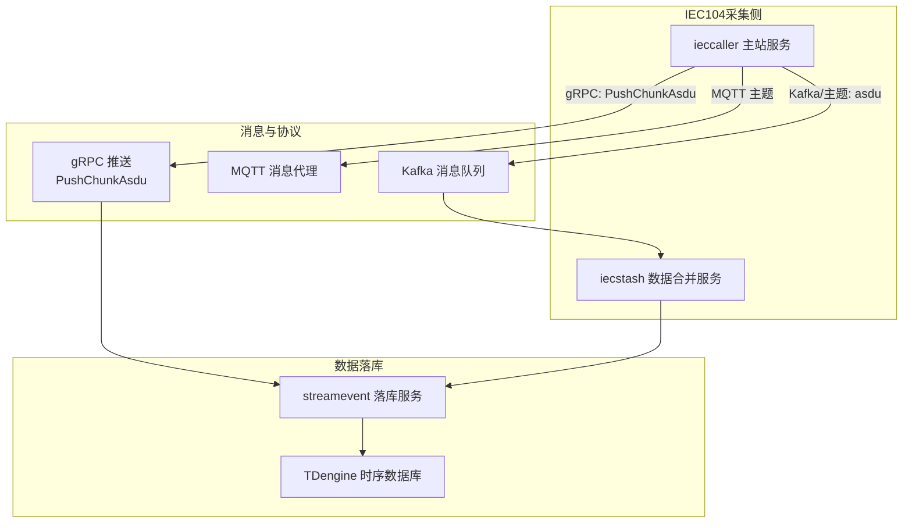
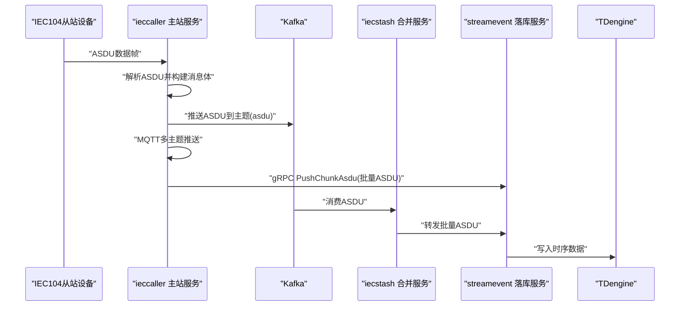
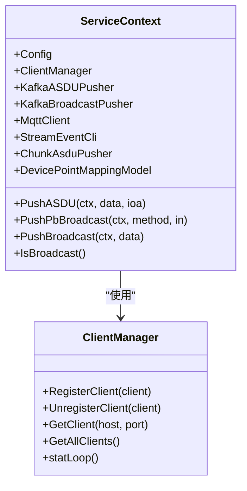
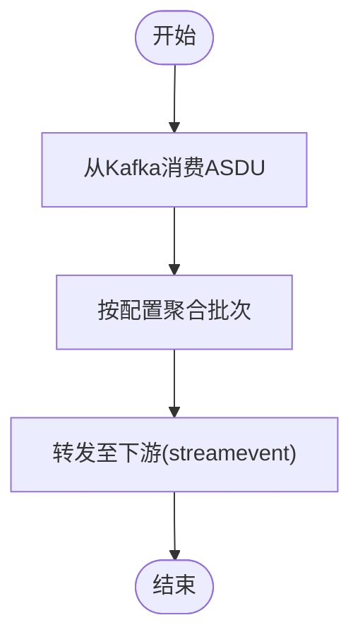
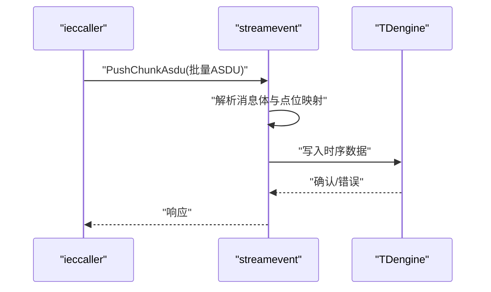
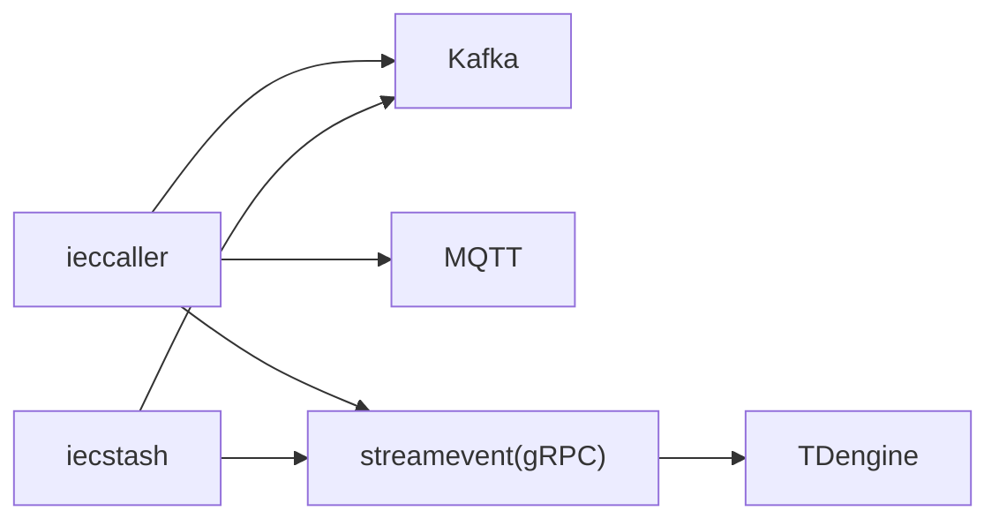

# IEC104数采数据流

<cite>
**本文引用的文件**
- [app/ieccaller/ieccaller.proto](file://app/ieccaller/ieccaller.proto)
- [app/iecstash/iecstash.proto](file://app/iecstash/iecstash.proto)
- [facade/streamevent/streamevent.proto](file://facade/streamevent/streamevent.proto)
- [common/iec104/types/types.go](file://common/iec104/types/types.go)
- [common/iec104/client/clientmanager.go](file://common/iec104/client/clientmanager.go)
- [app/ieccaller/internal/logic/sendreadcmdlogic.go](file://app/ieccaller/internal/logic/sendreadcmdlogic.go)
- [app/ieccaller/kafka/broadcast.go](file://app/ieccaller/kafka/broadcast.go)
- [app/ieccaller/etc/ieccaller.yaml](file://app/ieccaller/etc/ieccaller.yaml)
- [app/iecstash/etc/iecstash.yaml](file://app/iecstash/etc/iecstash.yaml)
- [facade/streamevent/etc/streamevent.yaml](file://facade/streamevent/etc/streamevent.yaml)
- [app/ieccaller/internal/config/config.go](file://app/ieccaller/internal/config/config.go)
- [app/iecstash/internal/config/config.go](file://app/iecstash/internal/config/config.go)
- [facade/streamevent/internal/config/config.go](file://facade/streamevent/internal/config/config.go)
- [app/ieccaller/internal/svc/servicecontext.go](file://app/ieccaller/internal/svc/servicecontext.go)
- [facade/streamevent/internal/logic/receivekafkamessagelogic.go](file://facade/streamevent/internal/logic/receivekafkamessagelogic.go)
- [facade/streamevent/internal/logic/receivemqttmessagelogic.go](file://facade/streamevent/internal/logic/receivemqttmessagelogic.go)
</cite>

## 目录
1. [引言](#引言)
2. [项目结构](#项目结构)
3. [核心组件](#核心组件)
4. [架构总览](#架构总览)
5. [详细组件分析](#详细组件分析)
6. [依赖分析](#依赖分析)
7. [性能考虑](#性能考虑)
8. [故障排查指南](#故障排查指南)
9. [结论](#结论)
10. [附录](#附录)

## 引言
本文件面向IEC104数采平台，系统性梳理从IEC104从站设备到TDengine时序数据库的完整数据链路。重点覆盖以下环节：
- ieccaller主站服务：负责向从站发起读命令、总召唤、累加器召唤、测试命令与控制命令，并将ASDU消息通过Kafka、MQTT与gRPC（PushChunkAsdu）并行推送。
- iecstash数据合并服务：消费Kafka中的ASDU消息，进行聚合与处理，准备进入下游落库。
- streamevent数据落库服务：接收ieccaller的批量ASDU消息，写入TDengine等时序数据库。

同时，文档详细说明12类ASDU信息体类型的数据格式与转换要点，阐述Kafka在数据传输中的作用，以及MQTT与gRPC并行推送机制，并提供监控指标、性能优化建议与故障排查方法。

## 项目结构
该仓库采用多服务微架构，IEC104相关的关键模块如下：
- app/ieccaller：IEC104主站客户端封装、命令下发、Kafka/MQTT推送、gRPC对外接口。
- app/iecstash：Kafka消费者，负责ASDU聚合与转发。
- facade/streamevent：接收批量ASDU并写入TDengine等数据库。
- common/iec104：IEC104客户端管理、消息类型定义与工具。
- etc配置：各服务的部署模式、Kafka/MQTT/TDengine等外部依赖配置。

图表来源
- [app/ieccaller/etc/ieccaller.yaml:35-79](file://app/ieccaller/etc/ieccaller.yaml#L35-L79)
- [app/iecstash/etc/iecstash.yaml:18-46](file://app/iecstash/etc/iecstash.yaml#L18-L46)
- [facade/streamevent/etc/streamevent.yaml:22-28](file://facade/streamevent/etc/streamevent.yaml#L22-L28)

章节来源
- [app/ieccaller/etc/ieccaller.yaml:1-79](file://app/ieccaller/etc/ieccaller.yaml#L1-L79)
- [app/iecstash/etc/iecstash.yaml:1-46](file://app/iecstash/etc/iecstash.yaml#L1-L46)
- [facade/streamevent/etc/streamevent.yaml:1-28](file://facade/streamevent/etc/streamevent.yaml#L1-L28)

## 核心组件
- ieccaller主站服务
  - 提供gRPC接口：发送测试命令、读命令、总召唤、累加器召唤、控制命令；查询/分页/清理点位映射缓存。
  - 内部通过IEC104客户端管理器维护多个从站连接，支持集群广播与本地直连两种模式。
  - 并行推送：Kafka（ASDU主题）、MQTT（多主题模板）、gRPC（PushChunkAsdu）。
- iecstash数据合并服务
  - 从Kafka订阅ASDU主题，按配置参数聚合处理，准备进入下游。
- streamevent数据落库服务
  - 接收批量ASDU消息，解析并写入TDengine等时序数据库。
- IEC104公共类型
  - 定义12类ASDU信息体结构（单点/双点遥信、标度化/规一化/短浮点遥测、步位置、比特串、累计量、保护事件等），统一消息体与点位映射结构。

章节来源
- [app/ieccaller/ieccaller.proto:9-30](file://app/ieccaller/ieccaller.proto#L9-L30)
- [app/iecstash/iecstash.proto:13-15](file://app/iecstash/iecstash.proto#L13-L15)
- [facade/streamevent/streamevent.proto:10-25](file://facade/streamevent/streamevent.proto#L10-L25)
- [common/iec104/types/types.go:17-40](file://common/iec104/types/types.go#L17-L40)

## 架构总览
下图展示IEC104从站到TDengine的完整数据链路，包括ieccaller的采集与推送、iecstash的聚合、streamevent的落库。

图表来源
- [app/ieccaller/internal/svc/servicecontext.go:144-244](file://app/ieccaller/internal/svc/servicecontext.go#L144-L244)
- [app/ieccaller/etc/ieccaller.yaml:35-79](file://app/ieccaller/etc/ieccaller.yaml#L35-L79)
- [app/iecstash/etc/iecstash.yaml:18-46](file://app/iecstash/etc/iecstash.yaml#L18-L46)
- [facade/streamevent/etc/streamevent.yaml:22-28](file://facade/streamevent/etc/streamevent.yaml#L22-L28)

## 详细组件分析

### ieccaller主站服务
- gRPC接口能力
  - 命令下发：发送测试命令、读命令、总召唤、累加器召唤、控制命令。
  - 点位映射：按ID/键值查询、分页查询、清理缓存。
- 客户端管理
  - ClientManager集中管理多个IEC104客户端，支持注册、注销、统计。
- 广播与集群
  - 在集群模式下，通过Kafka广播跨节点同步命令与缓存清理。
- 并行推送
  - Kafka：ASDU主题推送。
  - MQTT：基于模板动态生成主题并推送。
  - gRPC：PushChunkAsdu批量推送至streamevent。

图表来源
- [app/ieccaller/internal/svc/servicecontext.go:33-142](file://app/ieccaller/internal/svc/servicecontext.go#L33-L142)
- [common/iec104/client/clientmanager.go:11-145](file://common/iec104/client/clientmanager.go#L11-L145)

章节来源
- [app/ieccaller/ieccaller.proto:9-30](file://app/ieccaller/ieccaller.proto#L9-L30)
- [app/ieccaller/internal/logic/sendreadcmdlogic.go:25-43](file://app/ieccaller/internal/logic/sendreadcmdlogic.go#L25-L43)
- [app/ieccaller/kafka/broadcast.go:24-148](file://app/ieccaller/kafka/broadcast.go#L24-L148)
- [app/ieccaller/internal/svc/servicecontext.go:144-244](file://app/ieccaller/internal/svc/servicecontext.go#L144-L244)

### iecstash数据合并服务
- Kafka消费
  - 从asdu主题消费ASDU消息，按配置并发与批大小聚合处理。
- 转发策略
  - 将聚合后的批量ASDU转发至streamevent或其他下游。

图表来源
- [app/iecstash/etc/iecstash.yaml:18-46](file://app/iecstash/etc/iecstash.yaml#L18-L46)

章节来源
- [app/iecstash/etc/iecstash.yaml:1-46](file://app/iecstash/etc/iecstash.yaml#L1-L46)

### streamevent数据落库服务
- gRPC接收
  - 接收ieccaller的批量ASDU消息（PushChunkAsdu）。
- 落库逻辑
  - 解析消息体，按点位映射与表类型写入TDengine等时序数据库。

图表来源
- [facade/streamevent/streamevent.proto:83-133](file://facade/streamevent/streamevent.proto#L83-L133)
- [facade/streamevent/etc/streamevent.yaml:22-28](file://facade/streamevent/etc/streamevent.yaml#L22-L28)

章节来源
- [facade/streamevent/streamevent.proto:10-25](file://facade/streamevent/streamevent.proto#L10-L25)
- [facade/streamevent/etc/streamevent.yaml:1-28](file://facade/streamevent/etc/streamevent.yaml#L1-L28)

### 12类ASDU信息体类型与数据格式转换
- 单点遥信（M_SP_*）
  - 字段：IOA、布尔值、品质(qds)、溢出/闭锁/取代/非当前/无效标志、时标。
  - 转换：布尔值直接映射为遥信状态。
- 双点遥信（M_DP_*）
  - 字段：IOA、值域0/1/2/3（不确定/开/合/不确定），品质与标志同上。
  - 转换：按规范映射为开/合/中间态。
- 标度化遥测（M_ME_NB_*）
  - 字段：IOA、int16标度化值、品质、标志、时标。
  - 转换：工程值 = f(n)（满码值相关，需结合设备参数）。
- 规一化遥测（M_ME_NA_*）
  - 字段：IOA、int16规一化值、nva、品质、标志、时标。
  - 转换：工程值 = f(nva)（满码值相关）。
- 短浮点遥测（M_ME_NC_*）
  - 字段：IOA、float32短浮点值、品质、标志、时标。
  - 转换：直接为工程值（如电压/电流）。
- 步位置（M_ST_*）
  - 字段：IOA、步位置值与瞬变状态。
  - 转换：步位置值与瞬变标志分离处理。
- 32位比特串（M_BO_*）
  - 字段：IOA、uint32位串、品质、标志、时标。
  - 转换：逐位映射为32个独立状态。
- 累计量（M_IT_*）
  - 字段：IOA、计数器读数、顺序号、进位/调整/无效标志、时标。
  - 转换：计数器读数与质量标志组合。
- 继电保护事件（M_EP_*）
  - 字段：IOA、事件类型、保护事件品质、动作时间(ms)、标志、时标。
  - 转换：事件类型与动作时间映射。
- 成组启动事件/输出电路信息（M_EP_TB_/M_EP_TC_*)
  - 字段：IOA、OCI/GC/CL1/CL2/CL3、品质、标志、动作时间、时标。
  - 转换：成组事件与输出电路状态映射。
- 带变位检出的成组单点（M_PS_*）
  - 字段：IOA、scd/stn/cdn、品质、标志。
  - 转换：状态与变位检出组合。

章节来源
- [common/iec104/types/types.go:60-323](file://common/iec104/types/types.go#L60-L323)
- [facade/streamevent/streamevent.proto:135-447](file://facade/streamevent/streamevent.proto#L135-L447)

### Kafka消息队列的作用
- 传输通道
  - ieccaller将ASDU消息推送到asdu主题，iecstash从该主题消费并聚合。
- 广播机制
  - 在集群模式下，ieccaller通过广播主题将命令与缓存清理请求同步到其他节点。
- 配置要点
  - 生产者/消费者并发、批大小、偏移策略、连接数等由配置决定。

章节来源
- [app/ieccaller/etc/ieccaller.yaml:35-41](file://app/ieccaller/etc/ieccaller.yaml#L35-L41)
- [app/iecstash/etc/iecstash.yaml:18-35](file://app/iecstash/etc/iecstash.yaml#L18-L35)
- [app/ieccaller/kafka/broadcast.go:24-148](file://app/ieccaller/kafka/broadcast.go#L24-L148)

### MQTT与gRPC并行推送机制
- MQTT推送
  - 基于主题模板动态生成目标主题，支持多主题发布。
- gRPC推送
  - PushChunkAsdu以批量消息形式推送，降低网络与序列化开销。
- 并行策略
  - ieccaller内部使用并发执行器对Kafka/MQTT/gRPC三路推送进行并行化。

章节来源
- [app/ieccaller/internal/svc/servicecontext.go:186-242](file://app/ieccaller/internal/svc/servicecontext.go#L186-L242)
- [facade/streamevent/streamevent.proto:83-133](file://facade/streamevent/streamevent.proto#L83-L133)

## 依赖分析
- 服务间依赖
  - ieccaller依赖Kafka/MQTT/gRPC客户端与点位映射模型。
  - iecstash依赖Kafka消费者配置与下游转发。
  - streamevent依赖TDengine配置与gRPC客户端。
- 外部依赖
  - Kafka：消息队列与广播。
  - MQTT：轻量级实时推送。
  - TDengine：时序数据库。

图表来源
- [app/ieccaller/etc/ieccaller.yaml:35-79](file://app/ieccaller/etc/ieccaller.yaml#L35-L79)
- [app/iecstash/etc/iecstash.yaml:18-46](file://app/iecstash/etc/iecstash.yaml#L18-L46)
- [facade/streamevent/etc/streamevent.yaml:22-28](file://facade/streamevent/etc/streamevent.yaml#L22-L28)

章节来源
- [app/ieccaller/internal/config/config.go:18-58](file://app/ieccaller/internal/config/config.go#L18-L58)
- [app/iecstash/internal/config/config.go:10-28](file://app/iecstash/internal/config/config.go#L10-L28)
- [facade/streamevent/internal/config/config.go:5-24](file://facade/streamevent/internal/config/config.go#L5-L24)

## 性能考虑
- 批量推送
  - PushChunkAsdu按字节阈值聚合，减少gRPC调用次数与序列化开销。
- 并发与限流
  - Kafka消费者并发、处理器数量、MQTT发布超时应与CPU核数与网络带宽匹配。
- 缓冲与背压
  - 合理设置Kafka批大小与提交策略，避免堆积。
- 日志与统计
  - 利用服务统计日志定位瓶颈，关注推送耗时与失败率。

章节来源
- [app/ieccaller/etc/ieccaller.yaml:77-79](file://app/ieccaller/etc/ieccaller.yaml#L77-L79)
- [app/iecstash/etc/iecstash.yaml:26-35](file://app/iecstash/etc/iecstash.yaml#L26-L35)
- [facade/streamevent/etc/streamevent.yaml:11-13](file://facade/streamevent/etc/streamevent.yaml#L11-L13)

## 故障排查指南
- 常见问题定位
  - Kafka不可达：检查Brokers与Topic配置，确认生产/消费权限。
  - MQTT发布失败：检查Broker地址、认证信息与主题模板生成。
  - gRPC调用异常：检查目标服务端点、超时与消息大小限制。
  - 点位映射缺失：确认映射缓存是否启用、是否存在缓存未命中。
- 关键日志
  - ieccaller推送日志：Kafka/MQTT/gRPC推送耗时与错误。
  - streamevent落库日志：解析与写入确认/错误。
- 快速恢复
  - 临时关闭推送验证链路；逐步开启Kafka/MQTT/gRPC定位问题源。

章节来源
- [app/ieccaller/internal/svc/servicecontext.go:186-242](file://app/ieccaller/internal/svc/servicecontext.go#L186-L242)
- [facade/streamevent/internal/logic/receivekafkamessagelogic.go:27-31](file://facade/streamevent/internal/logic/receivekafkamessagelogic.go#L27-L31)
- [facade/streamevent/internal/logic/receivemqttmessagelogic.go:27-31](file://facade/streamevent/internal/logic/receivemqttmessagelogic.go#L27-L31)

## 结论
本数据流以ieccaller为核心，通过Kafka/MQTT/gRPC实现多通道并行推送，iecstash负责聚合，streamevent完成时序落库。12类ASDU信息体类型覆盖了IEC104典型遥信/遥测/保护事件场景。合理配置批大小、并发与超时，配合完善的日志与监控，可确保系统在高吞吐下的稳定性与可观测性。

## 附录
- 配置要点索引
  - ieccaller：Kafka/MQTT/gRPC推送、集群广播、批大小、GracePeriod。
  - iecstash：Kafka消费并发、批大小、偏移策略。
  - streamevent：TDengine连接、DB连接、gRPC客户端配置。

章节来源
- [app/ieccaller/etc/ieccaller.yaml:1-79](file://app/ieccaller/etc/ieccaller.yaml#L1-L79)
- [app/iecstash/etc/iecstash.yaml:1-46](file://app/iecstash/etc/iecstash.yaml#L1-L46)
- [facade/streamevent/etc/streamevent.yaml:1-28](file://facade/streamevent/etc/streamevent.yaml#L1-L28)