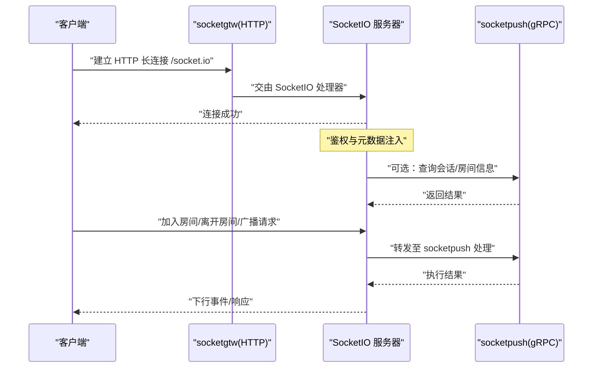
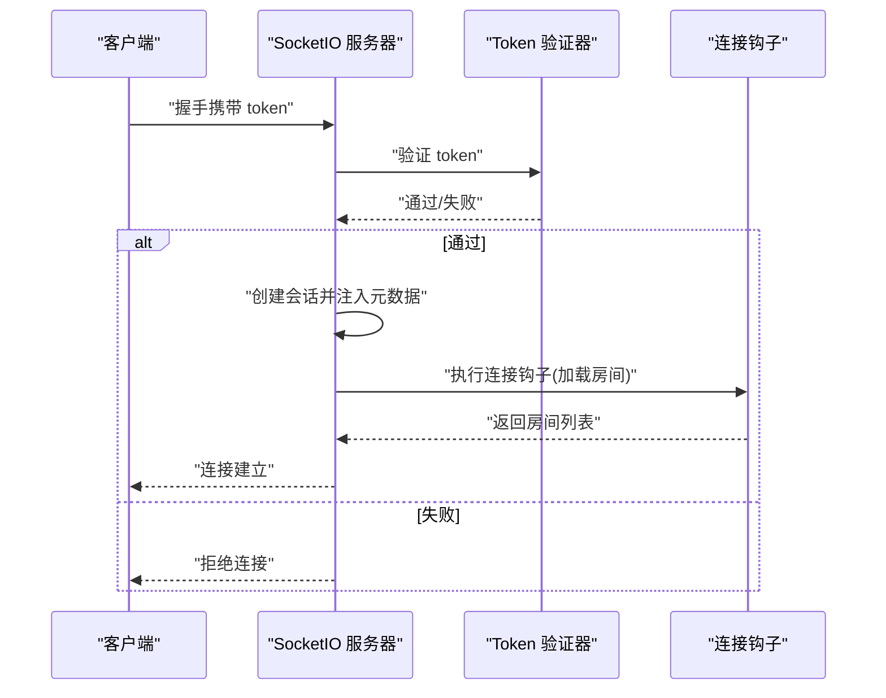
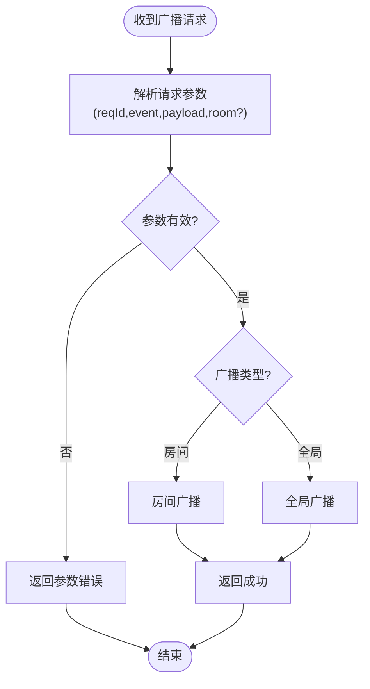
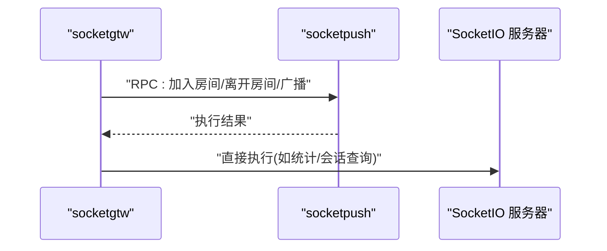
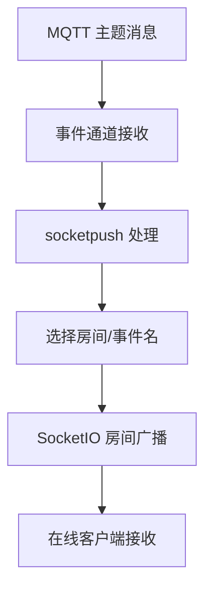
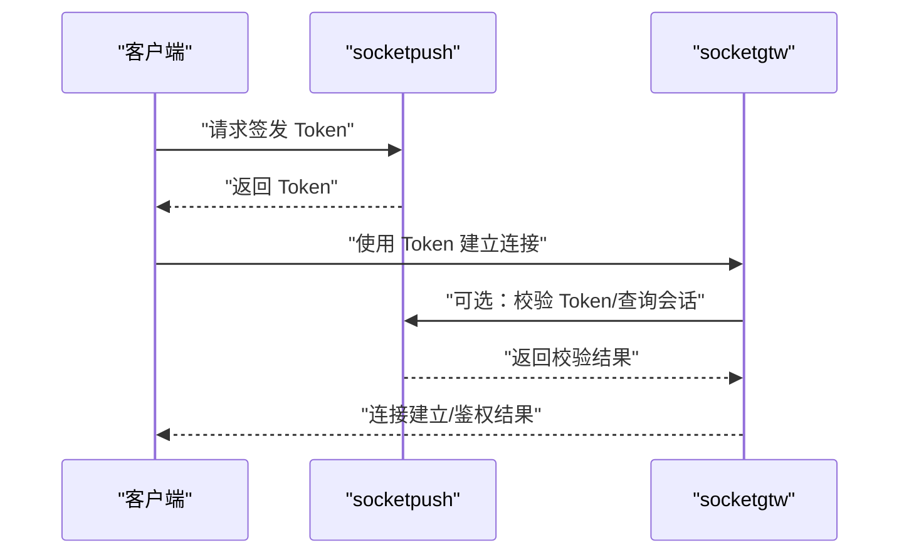
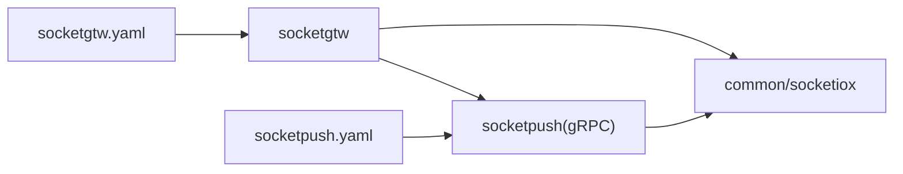

# 实时通信数据流

<cite>
**本文引用的文件**
- [socketgtw.go](file://socketapp/socketgtw/socketgtw.go)
- [socketpush.go](file://socketapp/socketpush/socketpush.go)
- [server.go](file://common/socketiox/server.go)
- [handler.go](file://common/socketiox/handler.go)
- [socketgtw.yaml](file://socketapp/socketgtw/etc/socketgtw.yaml)
- [socketpush.yaml](file://socketapp/socketpush/etc/socketpush.yaml)
- [socketgtwstatlogic.go](file://socketapp/socketgtw/internal/logic/socketgtwstatlogic.go)
- [broadcastgloballogic.go](file://socketapp/socketgtw/internal/logic/broadcastgloballogic.go)
- [broadcastroomlogic.go](file://socketapp/socketgtw/internal/logic/broadcastroomlogic.go)
- [joinroomlogic.go](file://socketapp/socketgtw/internal/logic/joinroomlogic.go)
- [leaveroomlogic.go](file://socketapp/socketgtw/internal/logic/leaveroomlogic.go)
- [sendtosessionlogic.go](file://socketapp/socketgtw/internal/logic/sendtosessionlogic.go)
- [sendtometasessionlogic.go](file://socketapp/socketgtw/internal/logic/sendtometasessionlogic.go)
- [sendtometasessionslogic.go](file://socketapp/socketgtw/internal/logic/sendtometasessionslogic.go)
- [sendtosessionslogic.go](file://socketapp/socketgtw/internal/logic/sendtosessionslogic.go)
- [kickmetasessionlogic.go](file://socketapp/socketgtw/internal/logic/kickmetasessionlogic.go)
- [kicksessionlogic.go](file://socketapp/socketgtw/internal/logic/kicksessionlogic.go)
- [broadcastgloballogic.go](file://socketapp/socketpush/internal/logic/broadcastgloballogic.go)
- [broadcastroomlogic.go](file://socketapp/socketpush/internal/logic/broadcastroomlogic.go)
- [joinroomlogic.go](file://socketapp/socketpush/internal/logic/joinroomlogic.go)
- [leaveroomlogic.go](file://socketapp/socketpush/internal/logic/leaveroomlogic.go)
- [sendtosessionlogic.go](file://socketapp/socketpush/internal/logic/sendtosessionlogic.go)
- [sendtometasessionlogic.go](file://socketapp/socketpush/internal/logic/sendtometasessionlogic.go)
- [sendtometasessionslogic.go](file://socketapp/socketpush/internal/logic/sendtometasessionslogic.go)
- [sendtosessionslogic.go](file://socketapp/socketpush/internal/logic/sendtosessionslogic.go)
- [kickmetasessionlogic.go](file://socketapp/socketpush/internal/logic/kickmetasessionlogic.go)
- [kicksessionlogic.go](file://socketapp/socketpush/internal/logic/kicksessionlogic.go)
- [socketgtwstatlogic.go](file://socketapp/socketpush/internal/logic/socketgtwstatlogic.go)
- [verifytokenlogic.go](file://socketapp/socketpush/internal/logic/verifytokenlogic.go)
- [gentokenlogic.go](file://socketapp/socketpush/internal/logic/gentokenlogic.go)
</cite>

## 目录
1. [简介](#简介)
2. [项目结构](#项目结构)
3. [核心组件](#核心组件)
4. [架构总览](#架构总览)
5. [详细组件分析](#详细组件分析)
6. [依赖关系分析](#依赖关系分析)
7. [性能考虑](#性能考虑)
8. [故障排查指南](#故障排查指南)
9. [结论](#结论)

## 简介
本文件面向实时通信模块的数据流与控制流，系统性描述以下内容：
- SocketIO 连接管理：握手、鉴权、元数据注入、断连清理
- 消息路由：事件上行/下行、房间广播、全局广播、单播/多播
- 房间管理：加入/离开房间、按元数据筛选会话
- 网关与推送服务协作：socketgtw（网关）与 socketpush（推送）通过 gRPC 协同工作
- MQTT 桥接：将 MQTT 主题消息映射到 SocketIO 房间广播
- 认证与会话：Token 验证、会话统计、消息追踪
- 性能优化与稳定性保障：并发安全、心跳统计、异步处理、错误隔离

## 项目结构
实时通信由两部分组成：
- socketgtw：SocketIO 网关服务，负责对外 HTTP 提供 SocketIO 接入，内部通过 gRPC 调用 socketpush 完成消息分发与会话管理
- socketpush：SocketIO 推送服务，负责会话生命周期管理、房间管理、消息广播、Token 签发与校验

```mermaid
graph TB
subgraph "SocketIO 网关服务 socketgtw"
G_HTTP["HTTP 服务器<br/>端口 11003"]
G_RPC["gRPC 服务器<br/>端口 25007"]
G_CFG["配置文件 socketgtw.yaml"]
end
subgraph "SocketIO 推送服务 socketpush"
P_RPC["gRPC 服务器<br/>端口 25008"]
P_CFG["配置文件 socketpush.yaml"]
end
subgraph "公共组件"
S_SRV["SocketIO 服务器<br/>server.go"]
S_HDL["SocketIO 处理器<br/>handler.go"]
end
Client["客户端"] --> G_HTTP
G_HTTP --> S_HDL
S_HDL --> S_SRV
G_RPC <- --> P_RPC
G_CFG -.-> G_HTTP
G_CFG -.-> G_RPC
P_CFG -.-> P_RPC
```

图表来源
- [socketgtw.go:30-91](file://socketapp/socketgtw/socketgtw.go#L30-L91)
- [socketpush.go:27-70](file://socketapp/socketpush/socketpush.go#L27-L70)
- [server.go:314-335](file://common/socketiox/server.go#L314-L335)
- [handler.go:19-41](file://common/socketiox/handler.go#L19-L41)
- [socketgtw.yaml:1-37](file://socketapp/socketgtw/etc/socketgtw.yaml#L1-L37)
- [socketpush.yaml:1-28](file://socketapp/socketpush/etc/socketpush.yaml#L1-L28)

章节来源
- [socketgtw.go:30-91](file://socketapp/socketgtw/socketgtw.go#L30-L91)
- [socketpush.go:27-70](file://socketapp/socketpush/socketpush.go#L27-L70)
- [server.go:314-335](file://common/socketiox/server.go#L314-L335)
- [handler.go:19-41](file://common/socketiox/handler.go#L19-L41)
- [socketgtw.yaml:1-37](file://socketapp/socketgtw/etc/socketgtw.yaml#L1-L37)
- [socketpush.yaml:1-28](file://socketapp/socketpush/etc/socketpush.yaml#L1-L28)

## 核心组件
- SocketIO 服务器与会话管理
  - 事件常量：连接、断开、上行、房间广播、全局广播、状态下行等
  - 会话对象：封装 socket 连接、元数据、房间集合、加锁保护
  - 广播方法：房间广播、全局广播
  - 统计循环：周期性向每个会话发送状态事件
- SocketIO 处理器
  - 将 SocketIO 的 HTTP 入口接入到 server 的 HttpHandler
- 网关与推送服务
  - socketgtw：对外提供 HTTP+SocketIO 接入，内部通过 gRPC 调用 socketpush
  - socketpush：提供会话、房间、广播、Token 等能力的 RPC 服务

章节来源
- [server.go:20-83](file://common/socketiox/server.go#L20-L83)
- [server.go:119-232](file://common/socketiox/server.go#L119-L232)
- [server.go:299-335](file://common/socketiox/server.go#L299-L335)
- [server.go:678-700](file://common/socketiox/server.go#L678-L700)
- [server.go:702-740](file://common/socketiox/server.go#L702-L740)
- [handler.go:19-41](file://common/socketiox/handler.go#L19-L41)

## 架构总览
socketgtw 作为前端接入层，承载 SocketIO 连接与事件处理；socketpush 作为后端推送与会话管理层，二者通过 gRPC 协议交互。MQTT 桥接通过外部事件通道将 MQTT 消息转换为 SocketIO 房间广播。



图表来源
- [socketgtw.go:48-61](file://socketapp/socketgtw/socketgtw.go#L48-L61)
- [handler.go:33-35](file://common/socketiox/handler.go#L33-L35)
- [server.go:337-676](file://common/socketiox/server.go#L337-L676)

## 详细组件分析

### SocketIO 连接管理与鉴权
- 握手与鉴权
  - OnAuthentication 在握手阶段读取 token 参数并调用自定义验证器
  - OnConnection 建立会话，支持带声明的 Token 验证，并将指定上下文键注入会话元数据
- 断开清理
  - disconnect 事件触发断连钩子与会话清理
- 会话元数据
  - 支持按 uid/deviceId/userId 等键检索会话，用于定向推送



图表来源
- [server.go:337-349](file://common/socketiox/server.go#L337-L349)
- [server.go:350-391](file://common/socketiox/server.go#L350-L391)
- [server.go:620-641](file://common/socketiox/server.go#L620-L641)

章节来源
- [server.go:337-391](file://common/socketiox/server.go#L337-L391)
- [server.go:620-641](file://common/socketiox/server.go#L620-L641)

### 房间管理与消息路由
- 房间加入/离开
  - 客户端发送加入/离开房间事件，服务端校验参数后执行 Join/Leave
- 广播
  - 房间广播：将下行事件与负载发送给房间内所有连接
  - 全局广播：向所有连接广播
- 单播/多播
  - 可通过会话元数据筛选目标会话，实现按用户或设备定向推送



图表来源
- [server.go:532-575](file://common/socketiox/server.go#L532-L575)
- [server.go:576-619](file://common/socketiox/server.go#L576-L619)
- [server.go:678-700](file://common/socketiox/server.go#L678-L700)

章节来源
- [server.go:532-619](file://common/socketiox/server.go#L532-L619)
- [server.go:678-700](file://common/socketiox/server.go#L678-L700)

### 网关与推送服务协作
- socketgtw 对外提供 HTTP 与 gRPC 服务，HTTP 负责 SocketIO 接入，gRPC 用于与 socketpush 通信
- socketpush 提供会话、房间、广播、Token 等 RPC 能力
- 配置文件分别定义监听地址、超时、日志、Nacos 注册与 JWT 密钥等



图表来源
- [socketgtw.go:40-61](file://socketapp/socketgtw/socketgtw.go#L40-L61)
- [socketpush.go:37-43](file://socketapp/socketpush/socketpush.go#L37-L43)
- [socketgtw.yaml:13-37](file://socketapp/socketgtw/etc/socketgtw.yaml#L13-L37)
- [socketpush.yaml:22-28](file://socketapp/socketpush/etc/socketpush.yaml#L22-L28)

章节来源
- [socketgtw.go:40-61](file://socketapp/socketgtw/socketgtw.go#L40-L61)
- [socketpush.go:37-43](file://socketapp/socketpush/socketpush.go#L37-L43)
- [socketgtw.yaml:13-37](file://socketapp/socketgtw/etc/socketgtw.yaml#L13-L37)
- [socketpush.yaml:22-28](file://socketapp/socketpush/etc/socketpush.yaml#L22-L28)

### MQTT 桥接与消息转换
- 配置中包含 StreamEventConf 与 SocketGtwConf，表明存在事件通道与网关端点
- 推送服务侧提供广播与房间管理逻辑，可将来自 MQTT 的消息映射到 SocketIO 房间广播
- 典型流程：MQTT 消息到达 -> 事件通道 -> socketpush 广播到对应房间 -> SocketIO 下行事件



图表来源
- [socketgtw.yaml:30-37](file://socketapp/socketgtw/etc/socketgtw.yaml#L30-L37)
- [socketpush.yaml:22-28](file://socketapp/socketpush/etc/socketpush.yaml#L22-L28)
- [broadcastroomlogic.go](file://socketapp/socketpush/internal/logic/broadcastroomlogic.go)
- [broadcastgloballogic.go](file://socketapp/socketpush/internal/logic/broadcastgloballogic.go)

章节来源
- [socketgtw.yaml:30-37](file://socketapp/socketgtw/etc/socketgtw.yaml#L30-L37)
- [socketpush.yaml:22-28](file://socketapp/socketpush/etc/socketpush.yaml#L22-L28)

### Token 认证与会话管理
- Token 验证
  - socketpush 提供签发与校验逻辑，支持 JWT 密钥配置
- 会话统计
  - socketgtw/statlogic 与 socketpush/statlogic 提供会话数量查询接口
- 消息追踪
  - 服务器在处理过程中记录上下文字段，便于追踪请求链路



图表来源
- [verifytokenlogic.go](file://socketapp/socketpush/internal/logic/verifytokenlogic.go)
- [gentokenlogic.go](file://socketapp/socketpush/internal/logic/gentokenlogic.go)
- [socketgtwstatlogic.go](file://socketapp/socketgtw/internal/logic/socketgtwstatlogic.go)
- [socketgtwstatlogic.go:27-32](file://socketapp/socketgtw/internal/logic/socketgtwstatlogic.go#L27-L32)
- [socketpushstatlogic.go](file://socketapp/socketpush/internal/logic/socketgtwstatlogic.go)

章节来源
- [verifytokenlogic.go](file://socketapp/socketpush/internal/logic/verifytokenlogic.go)
- [gentokenlogic.go](file://socketapp/socketpush/internal/logic/gentokenlogic.go)
- [socketgtwstatlogic.go:27-32](file://socketapp/socketgtw/internal/logic/socketgtwstatlogic.go#L27-L32)

### 关键 RPC 逻辑（示例）
- 房间管理：加入/离开房间
- 广播：房间广播/全局广播
- 单播/多播：按会话或元数据定向发送
- 会话操作：踢人、按元数据筛选会话

章节来源
- [joinroomlogic.go](file://socketapp/socketgtw/internal/logic/joinroomlogic.go)
- [leaveroomlogic.go](file://socketapp/socketgtw/internal/logic/leaveroomlogic.go)
- [broadcastroomlogic.go](file://socketapp/socketgtw/internal/logic/broadcastroomlogic.go)
- [broadcastgloballogic.go](file://socketapp/socketgtw/internal/logic/broadcastgloballogic.go)
- [sendtosessionlogic.go](file://socketapp/socketgtw/internal/logic/sendtosessionlogic.go)
- [sendtometasessionlogic.go](file://socketapp/socketgtw/internal/logic/sendtometasessionlogic.go)
- [sendtometasessionslogic.go](file://socketapp/socketgtw/internal/logic/sendtometasessionslogic.go)
- [sendtosessionslogic.go](file://socketapp/socketgtw/internal/logic/sendtosessionslogic.go)
- [kickmetasessionlogic.go](file://socketapp/socketgtw/internal/logic/kickmetasessionlogic.go)
- [kicksessionlogic.go](file://socketapp/socketgtw/internal/logic/kicksessionlogic.go)

## 依赖关系分析
- socketgtw 依赖 common/socketiox 提供的 SocketIO 服务器与处理器
- socketgtw 与 socketpush 通过 gRPC 协议交互
- 配置文件分别驱动两个服务的启动与注册



图表来源
- [socketgtw.go:10-14](file://socketapp/socketgtw/socketgtw.go#L10-L14)
- [socketpush.go:10-13](file://socketapp/socketpush/socketpush.go#L10-L13)
- [socketgtw.yaml:1-37](file://socketapp/socketgtw/etc/socketgtw.yaml#L1-L37)
- [socketpush.yaml:1-28](file://socketapp/socketpush/etc/socketpush.yaml#L1-L28)

章节来源
- [socketgtw.go:10-14](file://socketapp/socketgtw/socketgtw.go#L10-L14)
- [socketpush.go:10-13](file://socketapp/socketpush/socketpush.go#L10-L13)
- [socketgtw.yaml:1-37](file://socketapp/socketgtw/etc/socketgtw.yaml#L1-L37)
- [socketpush.yaml:1-28](file://socketapp/socketpush/etc/socketpush.yaml#L1-L28)

## 性能考虑
- 并发与异步
  - 事件处理采用 goroutine 安全包装，避免阻塞主循环
- 统计与可观测性
  - 周期性向每个会话发送状态事件，便于监控连接数、房间分布、元数据
- 锁粒度
  - 会话表与元数据访问使用互斥锁，降低竞争开销
- I/O 与序列化
  - 使用高效的 JSON 序列化与事件载荷处理，避免重复拷贝
- 超时与资源
  - 配置统一超时与日志级别，防止资源泄漏

章节来源
- [server.go:702-740](file://common/socketiox/server.go#L702-L740)
- [server.go:119-162](file://common/socketiox/server.go#L119-L162)
- [socketgtw.yaml:3-8](file://socketapp/socketgtw/etc/socketgtw.yaml#L3-L8)
- [socketpush.yaml:4-9](file://socketapp/socketpush/etc/socketpush.yaml#L4-L9)

## 故障排查指南
- 连接失败
  - 检查 Token 是否正确配置与传递
  - 查看鉴权回调日志与断连原因
- 房间加入/离开异常
  - 校验请求参数是否完整（reqId、room）
  - 确认预加入钩子是否抛错
- 广播无响应
  - 确认事件名不为空且非保留事件
  - 检查房间是否存在成员
- 会话统计不一致
  - 观察统计循环日志，确认会话数与 socket 数是否匹配
- 服务注册
  - 若启用 Nacos 注册，检查注册元数据与端口映射

章节来源
- [server.go:337-349](file://common/socketiox/server.go#L337-L349)
- [server.go:392-434](file://common/socketiox/server.go#L392-L434)
- [server.go:532-575](file://common/socketiox/server.go#L532-L575)
- [server.go:702-740](file://common/socketiox/server.go#L702-L740)
- [socketgtw.yaml:21-29](file://socketapp/socketgtw/etc/socketgtw.yaml#L21-L29)
- [socketpush.yaml:14-21](file://socketapp/socketpush/etc/socketpush.yaml#L14-L21)

## 结论
该实时通信架构以 SocketIO 为核心，通过 socketgtw 提供对外接入与 gRPC 协同，socketpush 提供会话与消息分发能力，结合 MQTT 桥接实现跨协议消息互通。整体设计强调事件驱动、异步处理与可观测性，具备良好的扩展性与稳定性。建议在生产环境中完善 Nacos 注册、日志分级与告警策略，并对高并发场景进行压测与容量规划。