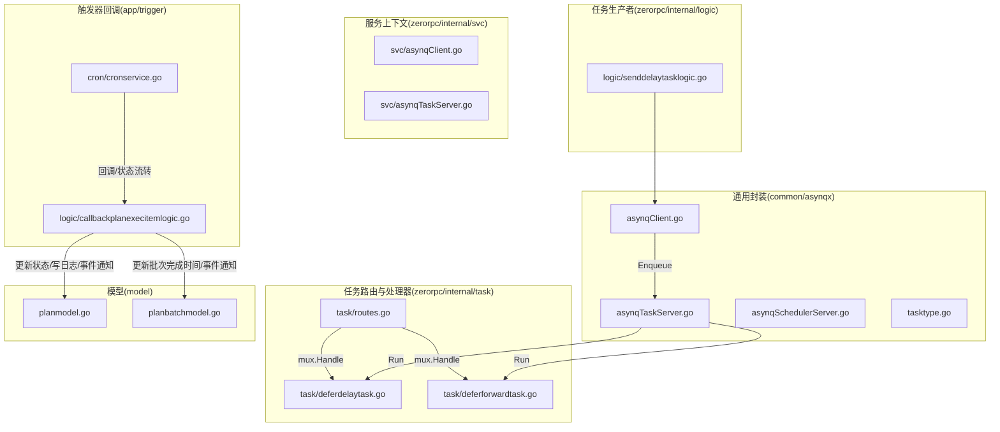
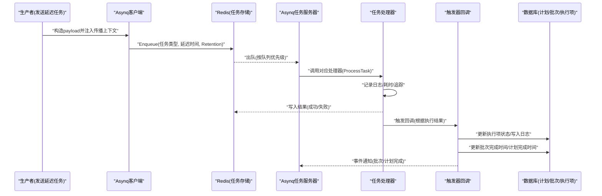
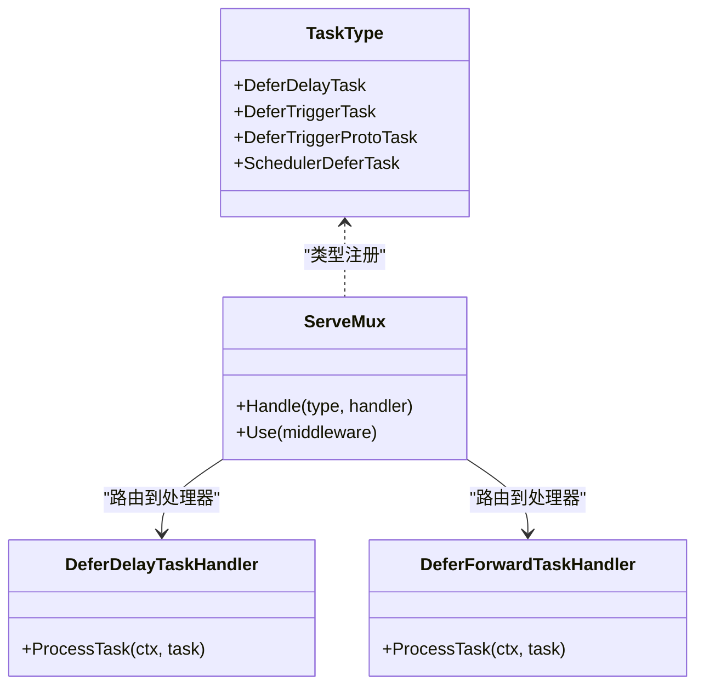
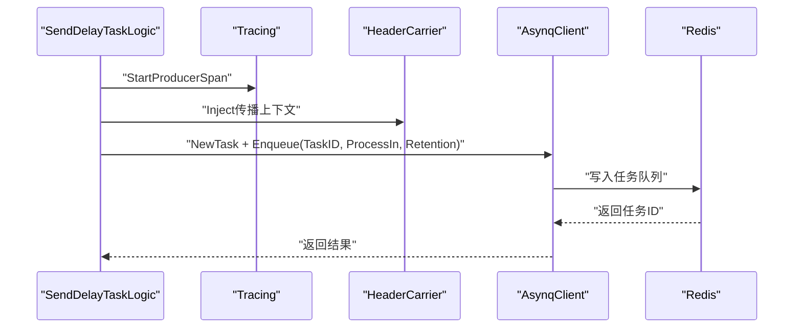
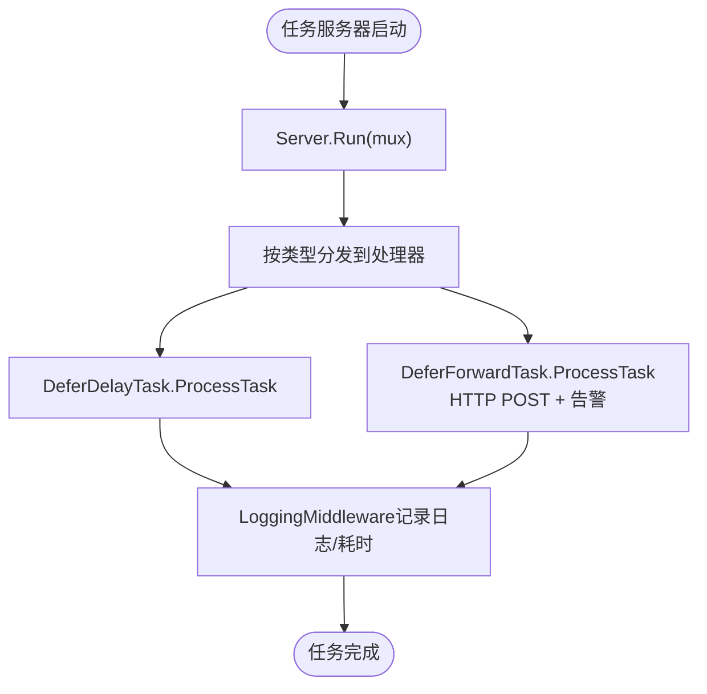
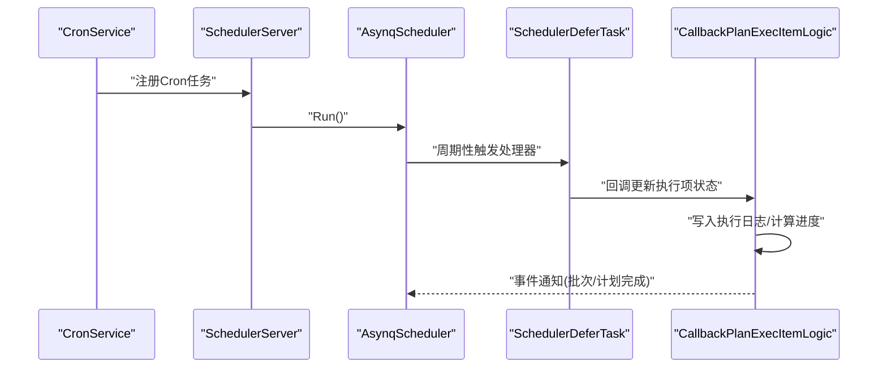
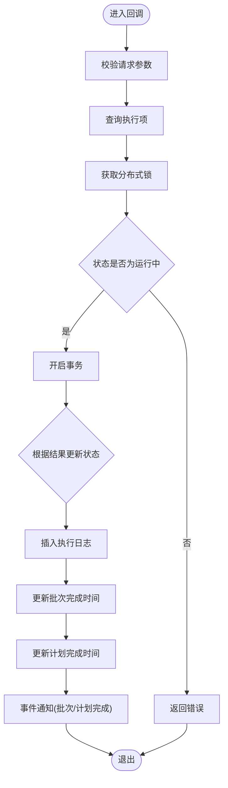
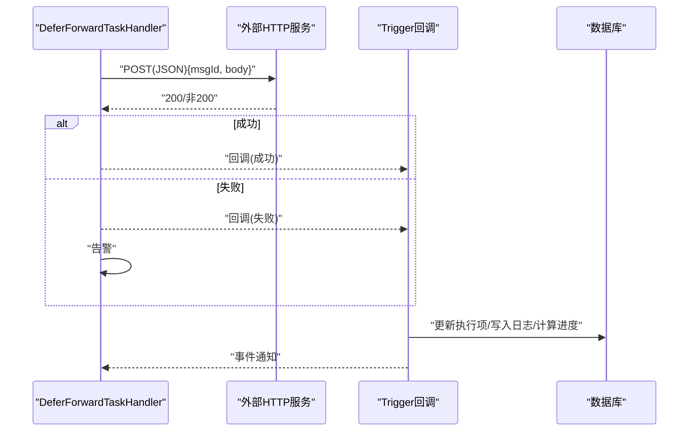
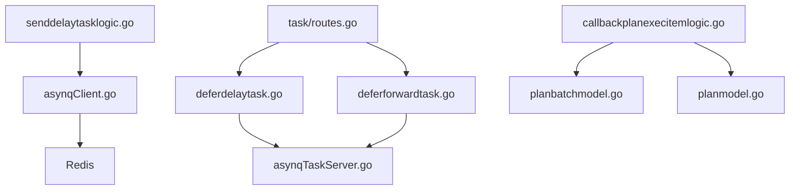

# 异步任务数据流

<cite>
**本文引用的文件**
- [common/asynqx/asynqClient.go](file://common/asynqx/asynqClient.go)
- [common/asynqx/asynqTaskServer.go](file://common/asynqx/asynqTaskServer.go)
- [common/asynqx/asynqSchedulerServer.go](file://common/asynqx/asynqSchedulerServer.go)
- [common/asynqx/tasktype.go](file://common/asynqx/tasktype.go)
- [zerorpc/internal/svc/asynqClient.go](file://zerorpc/internal/svc/asynqClient.go)
- [zerorpc/internal/svc/asynqTaskServer.go](file://zerorpc/internal/svc/asynqTaskServer.go)
- [zerorpc/internal/task/routes.go](file://zerorpc/internal/task/routes.go)
- [zerorpc/internal/task/deferdelaytask.go](file://zerorpc/internal/task/deferdelaytask.go)
- [zerorpc/internal/task/deferforwardtask.go](file://zerorpc/internal/task/deferforwardtask.go)
- [zerorpc/internal/logic/senddelaytasklogic.go](file://zerorpc/internal/logic/senddelaytasklogic.go)
- [app/trigger/internal/logic/callbackplanexecitemlogic.go](file://app/trigger/internal/logic/callbackplanexecitemlogic.go)
- [app/trigger/cron/cronservice.go](file://app/trigger/cron/cronservice.go)
- [model/planmodel.go](file://model/planmodel.go)
- [model/planbatchmodel.go](file://model/planbatchmodel.go)
</cite>

## 目录
1. [简介](#简介)
2. [项目结构](#项目结构)
3. [核心组件](#核心组件)
4. [架构总览](#架构总览)
5. [详细组件分析](#详细组件分析)
6. [依赖分析](#依赖分析)
7. [性能考虑](#性能考虑)
8. [故障排查指南](#故障排查指南)
9. [结论](#结论)
10. [附录](#附录)

## 简介
本文件围绕基于 asynq 的异步任务调度服务，系统化梳理任务从“创建、入队、调度、执行、回调”的全生命周期数据流与状态管理。重点覆盖：
- Redis 存储的任务状态管理与 Retention 策略
- 自动重试与失败处理机制
- 计划任务管理的三级模型（Plan-Batch-ExecItem）与状态机流转
- HTTP POST 与 gRPC 两种回调方式的处理流程
- 任务监控、统计分析与性能优化建议
- 故障排查方法与最佳实践

## 项目结构
围绕异步任务的关键模块分布如下：
- 通用 asynq 客户端、任务服务器与调度器封装：common/asynqx
- 业务侧服务上下文中的 asynq 客户端与任务服务器：zerorpc/internal/svc
- 任务路由与处理器注册：zerorpc/internal/task
- 任务生产者逻辑：zerorpc/internal/logic
- 触发器回调与计划任务状态机：app/trigger/internal/logic
- 计划任务统计与完成时间更新：model

图表来源
- [common/asynqx/asynqClient.go:1-31](file://common/asynqx/asynqClient.go#L1-L31)
- [common/asynqx/asynqTaskServer.go:1-87](file://common/asynqx/asynqTaskServer.go#L1-L87)
- [common/asynqx/asynqSchedulerServer.go:1-62](file://common/asynqx/asynqSchedulerServer.go#L1-L62)
- [common/asynqx/tasktype.go:1-10](file://common/asynqx/tasktype.go#L1-L10)
- [zerorpc/internal/svc/asynqClient.go:1-27](file://zerorpc/internal/svc/asynqClient.go#L1-L27)
- [zerorpc/internal/svc/asynqTaskServer.go:1-51](file://zerorpc/internal/svc/asynqTaskServer.go#L1-L51)
- [zerorpc/internal/task/routes.go:1-37](file://zerorpc/internal/task/routes.go#L1-L37)
- [zerorpc/internal/task/deferdelaytask.go:1-37](file://zerorpc/internal/task/deferdelaytask.go#L1-L37)
- [zerorpc/internal/task/deferforwardtask.go:1-97](file://zerorpc/internal/task/deferforwardtask.go#L1-L97)
- [zerorpc/internal/logic/senddelaytasklogic.go:1-53](file://zerorpc/internal/logic/senddelaytasklogic.go#L1-L53)
- [app/trigger/internal/logic/callbackplanexecitemlogic.go:1-246](file://app/trigger/internal/logic/callbackplanexecitemlogic.go#L1-L246)
- [app/trigger/cron/cronservice.go:213-468](file://app/trigger/cron/cronservice.go#L213-L468)
- [model/planmodel.go:1-65](file://model/planmodel.go#L1-L65)
- [model/planbatchmodel.go:1-94](file://model/planbatchmodel.go#L1-L94)

章节来源
- [common/asynqx/asynqClient.go:1-31](file://common/asynqx/asynqClient.go#L1-L31)
- [common/asynqx/asynqTaskServer.go:1-87](file://common/asynqx/asynqTaskServer.go#L1-L87)
- [common/asynqx/asynqSchedulerServer.go:1-62](file://common/asynqx/asynqSchedulerServer.go#L1-L62)
- [common/asynqx/tasktype.go:1-10](file://common/asynqx/tasktype.go#L1-L10)
- [zerorpc/internal/svc/asynqClient.go:1-27](file://zerorpc/internal/svc/asynqClient.go#L1-L27)
- [zerorpc/internal/svc/asynqTaskServer.go:1-51](file://zerorpc/internal/svc/asynqTaskServer.go#L1-L51)
- [zerorpc/internal/task/routes.go:1-37](file://zerorpc/internal/task/routes.go#L1-L37)
- [zerorpc/internal/task/deferdelaytask.go:1-37](file://zerorpc/internal/task/deferdelaytask.go#L1-L37)
- [zerorpc/internal/task/deferforwardtask.go:1-97](file://zerorpc/internal/task/deferforwardtask.go#L1-L97)
- [zerorpc/internal/logic/senddelaytasklogic.go:1-53](file://zerorpc/internal/logic/senddelaytasklogic.go#L1-L53)
- [app/trigger/internal/logic/callbackplanexecitemlogic.go:1-246](file://app/trigger/internal/logic/callbackplanexecitemlogic.go#L1-L246)
- [app/trigger/cron/cronservice.go:213-468](file://app/trigger/cron/cronservice.go#L213-L468)
- [model/planmodel.go:1-65](file://model/planmodel.go#L1-L65)
- [model/planbatchmodel.go:1-94](file://model/planbatchmodel.go#L1-L94)

## 核心组件
- 任务类型常量：定义延迟任务、触发任务与调度器任务类型，用于路由与处理。
- 生产者客户端：封装 asynq.Client，支持 OpenTelemetry 注入与追踪。
- 任务服务器：封装 asynq.Server，配置并发度、队列优先级与日志。
- 调度器：封装 asynq.Scheduler，支持定时注册任务与后入队钩子。
- 任务路由与处理器：注册延迟任务与转发任务处理器，并统一使用中间件记录日志与耗时。
- 任务生产者逻辑：构造 payload，注入传播上下文，按分钟级延迟入队。
- 回调逻辑：根据执行结果更新执行项状态、写入执行日志、计算进度并触发事件通知。

章节来源
- [common/asynqx/tasktype.go:1-10](file://common/asynqx/tasktype.go#L1-L10)
- [common/asynqx/asynqClient.go:1-31](file://common/asynqx/asynqClient.go#L1-L31)
- [common/asynqx/asynqTaskServer.go:1-87](file://common/asynqx/asynqTaskServer.go#L1-L87)
- [common/asynqx/asynqSchedulerServer.go:1-62](file://common/asynqx/asynqSchedulerServer.go#L1-L62)
- [zerorpc/internal/task/routes.go:1-37](file://zerorpc/internal/task/routes.go#L1-L37)
- [zerorpc/internal/logic/senddelaytasklogic.go:1-53](file://zerorpc/internal/logic/senddelaytasklogic.go#L1-L53)
- [app/trigger/internal/logic/callbackplanexecitemlogic.go:1-246](file://app/trigger/internal/logic/callbackplanexecitemlogic.go#L1-L246)

## 架构总览
下图展示从“生产者到消费者再到回调”的端到端数据流，包含 Redis 状态持久化、任务类型路由、处理器执行与回调更新。

图表来源
- [zerorpc/internal/logic/senddelaytasklogic.go:32-52](file://zerorpc/internal/logic/senddelaytasklogic.go#L32-L52)
- [common/asynqx/asynqClient.go:17-30](file://common/asynqx/asynqClient.go#L17-L30)
- [common/asynqx/asynqTaskServer.go:28-37](file://common/asynqx/asynqTaskServer.go#L28-L37)
- [zerorpc/internal/task/routes.go:22-36](file://zerorpc/internal/task/routes.go#L22-L36)
- [zerorpc/internal/task/deferdelaytask.go:23-36](file://zerorpc/internal/task/deferdelaytask.go#L23-L36)
- [app/trigger/internal/logic/callbackplanexecitemlogic.go:97-242](file://app/trigger/internal/logic/callbackplanexecitemlogic.go#L97-L242)
- [model/planbatchmodel.go:41-66](file://model/planbatchmodel.go#L41-L66)
- [model/planmodel.go:39-64](file://model/planmodel.go#L39-L64)

## 详细组件分析

### 组件A：任务类型与路由
- 任务类型：延迟任务、触发任务、调度器延迟任务，分别对应不同的处理器。
- 路由注册：在 ServeMux 中按类型注册处理器，并启用统一日志中间件。

图表来源
- [common/asynqx/tasktype.go:1-10](file://common/asynqx/tasktype.go#L1-L10)
- [zerorpc/internal/task/routes.go:22-36](file://zerorpc/internal/task/routes.go#L22-L36)
- [zerorpc/internal/task/deferdelaytask.go:13-36](file://zerorpc/internal/task/deferdelaytask.go#L13-L36)
- [zerorpc/internal/task/deferforwardtask.go:21-96](file://zerorpc/internal/task/deferforwardtask.go#L21-L96)

章节来源
- [common/asynqx/tasktype.go:1-10](file://common/asynqx/tasktype.go#L1-L10)
- [zerorpc/internal/task/routes.go:1-37](file://zerorpc/internal/task/routes.go#L1-L37)

### 组件B：生产者与入队
- 生产者逻辑：构造消息体，注入 OpenTelemetry 上下文，序列化为 payload，按分钟级延迟入队，设置 Retention。
- 客户端封装：提供 Redis 连接选项与 Inspector 工具。

图表来源
- [zerorpc/internal/logic/senddelaytasklogic.go:32-52](file://zerorpc/internal/logic/senddelaytasklogic.go#L32-L52)
- [common/asynqx/asynqClient.go:17-30](file://common/asynqx/asynqClient.go#L17-L30)

章节来源
- [zerorpc/internal/logic/senddelaytasklogic.go:1-53](file://zerorpc/internal/logic/senddelaytasklogic.go#L1-L53)
- [common/asynqx/asynqClient.go:1-31](file://common/asynqx/asynqClient.go#L1-L31)

### 组件C：任务服务器与处理器
- 任务服务器：配置并发度、队列优先级、失败回调与日志；提供 Start/Stop。
- 日志中间件：统一记录任务类型、任务ID、耗时与错误。
- 处理器示例：延迟任务处理器与转发任务处理器，前者简单处理，后者包含 HTTP POST 回调与告警。

图表来源
- [common/asynqx/asynqTaskServer.go:28-37](file://common/asynqx/asynqTaskServer.go#L28-L37)
- [common/asynqx/asynqTaskServer.go:73-87](file://common/asynqx/asynqTaskServer.go#L73-L87)
- [zerorpc/internal/task/deferdelaytask.go:23-36](file://zerorpc/internal/task/deferdelaytask.go#L23-L36)
- [zerorpc/internal/task/deferforwardtask.go:31-96](file://zerorpc/internal/task/deferforwardtask.go#L31-L96)

章节来源
- [common/asynqx/asynqTaskServer.go:1-87](file://common/asynqx/asynqTaskServer.go#L1-L87)
- [zerorpc/internal/task/deferdelaytask.go:1-37](file://zerorpc/internal/task/deferdelaytask.go#L1-L37)
- [zerorpc/internal/task/deferforwardtask.go:1-97](file://zerorpc/internal/task/deferforwardtask.go#L1-L97)

### 组件D：调度器与计划任务
- 调度器：配置时区、连接超时、连接池大小、后入队钩子与日志；提供 Start/Stop。
- 计划任务：通过 Cron 表达式注册周期性任务，回调中更新执行项状态并触发事件通知。

图表来源
- [common/asynqx/asynqSchedulerServer.go:21-30](file://common/asynqx/asynqSchedulerServer.go#L21-L30)
- [common/asynqx/asynqSchedulerServer.go:32-52](file://common/asynqx/asynqSchedulerServer.go#L32-L52)
- [app/trigger/cron/cronservice.go:213-468](file://app/trigger/cron/cronservice.go#L213-L468)
- [app/trigger/internal/logic/callbackplanexecitemlogic.go:97-242](file://app/trigger/internal/logic/callbackplanexecitemlogic.go#L97-L242)

章节来源
- [common/asynqx/asynqSchedulerServer.go:1-62](file://common/asynqx/asynqSchedulerServer.go#L1-L62)
- [app/trigger/cron/cronservice.go:213-468](file://app/trigger/cron/cronservice.go#L213-L468)

### 组件E：回调与状态机
- 回调逻辑：根据执行结果（完成/失败/延时/进行中/终止）原子更新执行项状态，写入执行日志，并计算批次与计划完成时间。
- 事件通知：当批次或计划全部完成时，向事件通道发送完成事件。
- 数据模型：提供批量完成时间更新与进度计算方法。

图表来源
- [app/trigger/internal/logic/callbackplanexecitemlogic.go:40-242](file://app/trigger/internal/logic/callbackplanexecitemlogic.go#L40-L242)
- [model/planbatchmodel.go:41-66](file://model/planbatchmodel.go#L41-L66)
- [model/planmodel.go:39-64](file://model/planmodel.go#L39-L64)

章节来源
- [app/trigger/internal/logic/callbackplanexecitemlogic.go:1-246](file://app/trigger/internal/logic/callbackplanexecitemlogic.go#L1-L246)
- [model/planbatchmodel.go:1-94](file://model/planbatchmodel.go#L1-L94)
- [model/planmodel.go:1-65](file://model/planmodel.go#L1-L65)

### 组件F：HTTP POST 与 gRPC 回调
- HTTP POST 回调：处理器在执行任务时，若配置了回调 URL，则以 JSON 形式 POST 到目标地址，记录响应码与告警。
- gRPC 回调：通过触发器服务的回调接口，接收执行结果并更新状态，同时计算进度与完成时间，触发事件通知。

图表来源
- [zerorpc/internal/task/deferforwardtask.go:40-96](file://zerorpc/internal/task/deferforwardtask.go#L40-L96)
- [app/trigger/internal/logic/callbackplanexecitemlogic.go:97-242](file://app/trigger/internal/logic/callbackplanexecitemlogic.go#L97-L242)

章节来源
- [zerorpc/internal/task/deferforwardtask.go:1-97](file://zerorpc/internal/task/deferforwardtask.go#L1-L97)
- [app/trigger/internal/logic/callbackplanexecitemlogic.go:1-246](file://app/trigger/internal/logic/callbackplanexecitemlogic.go#L1-L246)

## 依赖分析
- 组件耦合
  - 任务路由与处理器解耦于具体业务，通过任务类型常量与 ServeMux 解耦。
  - 生产者仅依赖客户端封装，不直接依赖业务逻辑。
  - 回调逻辑依赖数据库模型与事件通道，形成对数据层与事件层的依赖。
- 外部依赖
  - Redis：作为任务队列与 Retention 存储。
  - OpenTelemetry：贯穿生产者与消费者的追踪。
  - gRPC/HTTP：回调链路的一部分。

图表来源
- [zerorpc/internal/logic/senddelaytasklogic.go:32-52](file://zerorpc/internal/logic/senddelaytasklogic.go#L32-L52)
- [common/asynqx/asynqClient.go:17-30](file://common/asynqx/asynqClient.go#L17-L30)
- [zerorpc/internal/task/routes.go:22-36](file://zerorpc/internal/task/routes.go#L22-L36)
- [zerorpc/internal/task/deferdelaytask.go:23-36](file://zerorpc/internal/task/deferdelaytask.go#L23-L36)
- [zerorpc/internal/task/deferforwardtask.go:31-96](file://zerorpc/internal/task/deferforwardtask.go#L31-L96)
- [common/asynqx/asynqTaskServer.go:28-37](file://common/asynqx/asynqTaskServer.go#L28-L37)
- [app/trigger/internal/logic/callbackplanexecitemlogic.go:97-242](file://app/trigger/internal/logic/callbackplanexecitemlogic.go#L97-L242)
- [model/planbatchmodel.go:41-66](file://model/planbatchmodel.go#L41-L66)
- [model/planmodel.go:39-64](file://model/planmodel.go#L39-L64)

章节来源
- [zerorpc/internal/logic/senddelaytasklogic.go:1-53](file://zerorpc/internal/logic/senddelaytasklogic.go#L1-L53)
- [zerorpc/internal/task/routes.go:1-37](file://zerorpc/internal/task/routes.go#L1-L37)
- [app/trigger/internal/logic/callbackplanexecitemlogic.go:1-246](file://app/trigger/internal/logic/callbackplanexecitemlogic.go#L1-L246)

## 性能考虑
- 并发与队列
  - 任务服务器配置了多队列优先级与最大并发，建议根据任务类型与资源情况调整队列权重与并发数。
- 连接池与超时
  - Redis 连接池大小与读写超时需结合实例规模与网络状况调优。
- Retention 与清理
  - 通过 Retention 控制任务保留时间，避免过长导致 Redis 占用过高。
- 日志与追踪
  - 中间件记录耗时与错误，便于定位慢任务与失败原因。
- 回调超时
  - HTTP POST 回调设置了超时，建议根据下游服务能力调整超时阈值并增加重试策略。

## 故障排查指南
- 入队失败
  - 检查 Redis 连接参数与权限；确认任务类型是否正确注册。
- 任务未执行
  - 检查任务服务器是否正常运行；核对队列优先级与并发配置。
- 回调失败
  - 查看回调处理器日志与告警；检查下游服务可达性与响应码。
- 状态不一致
  - 使用 Inspector 检查任务状态；核对事务更新与事件通知是否成功。
- 进度异常
  - 校验批次与计划完成时间更新逻辑；确认执行日志是否正确写入。

章节来源
- [common/asynqx/asynqClient.go:21-23](file://common/asynqx/asynqClient.go#L21-L23)
- [common/asynqx/asynqTaskServer.go:28-37](file://common/asynqx/asynqTaskServer.go#L28-L37)
- [zerorpc/internal/task/deferforwardtask.go:49-96](file://zerorpc/internal/task/deferforwardtask.go#L49-L96)
- [app/trigger/internal/logic/callbackplanexecitemlogic.go:97-242](file://app/trigger/internal/logic/callbackplanexecitemlogic.go#L97-L242)

## 结论
该异步任务调度体系以 asynq 为核心，结合 Redis 实现高可靠的任务队列与 Retention 策略；通过统一的路由与处理器实现任务生命周期管理；借助回调与事件通知完成计划任务的三级状态机流转与进度统计。建议在生产环境中持续优化并发与队列配置、完善回调超时与重试策略，并加强监控与告警以提升稳定性与可观测性。

## 附录
- 最佳实践
  - 明确任务类型与路由，避免类型冲突。
  - 合理设置延迟与 Retention，控制 Redis 压力。
  - 使用中间件统一记录日志与追踪，便于问题定位。
  - 对关键回调增加超时与重试，确保幂等性。
  - 定期清理过期任务与日志，保持系统健康。