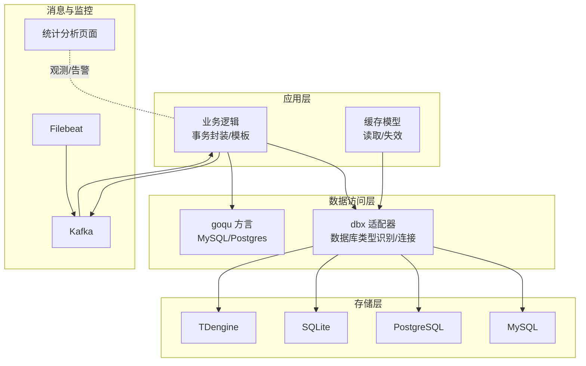
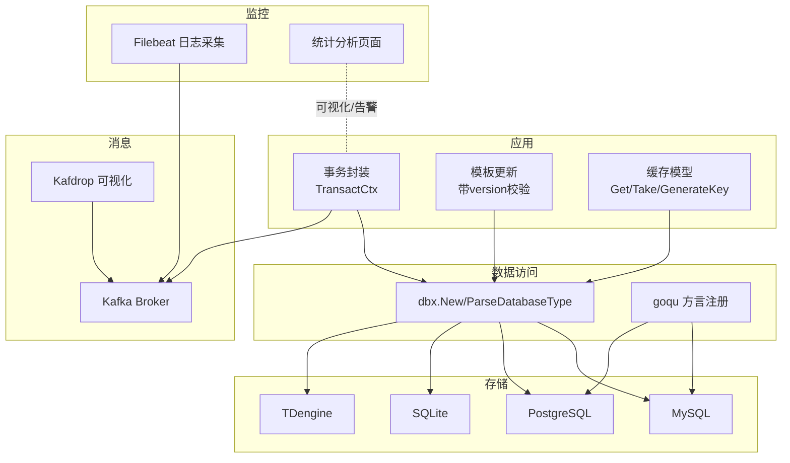
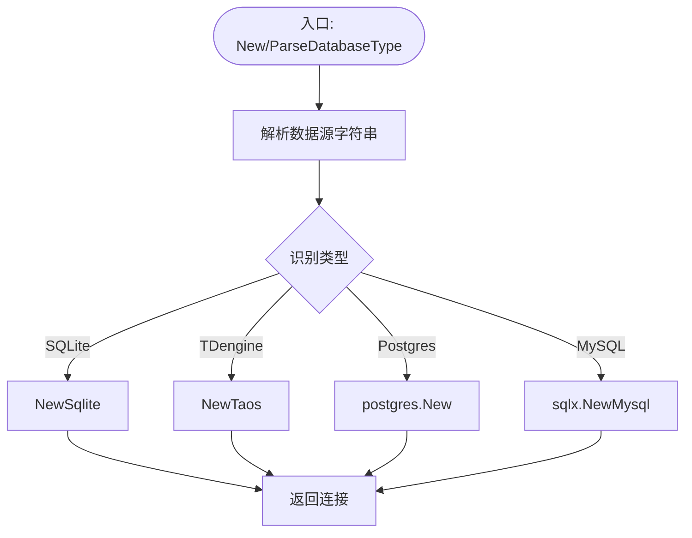
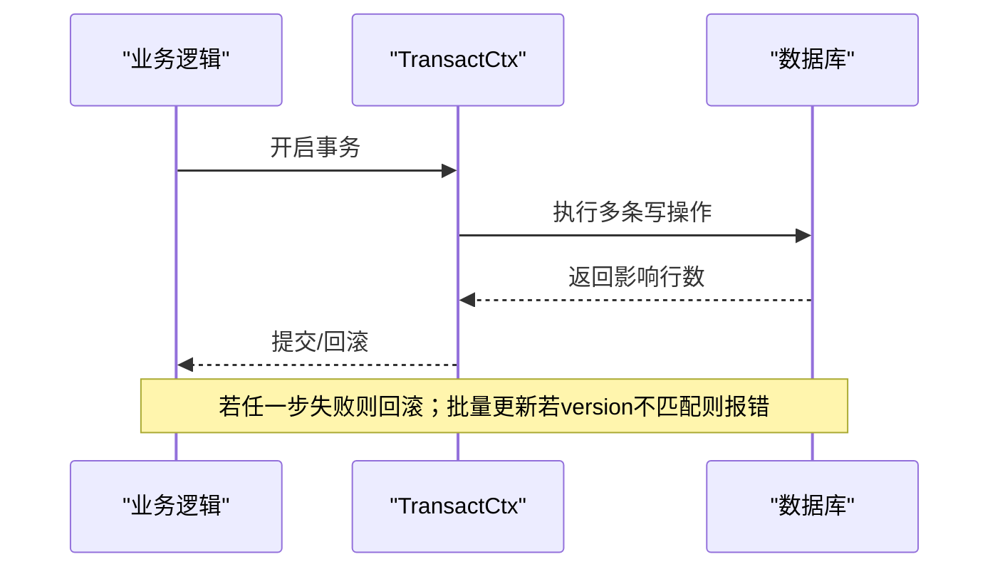
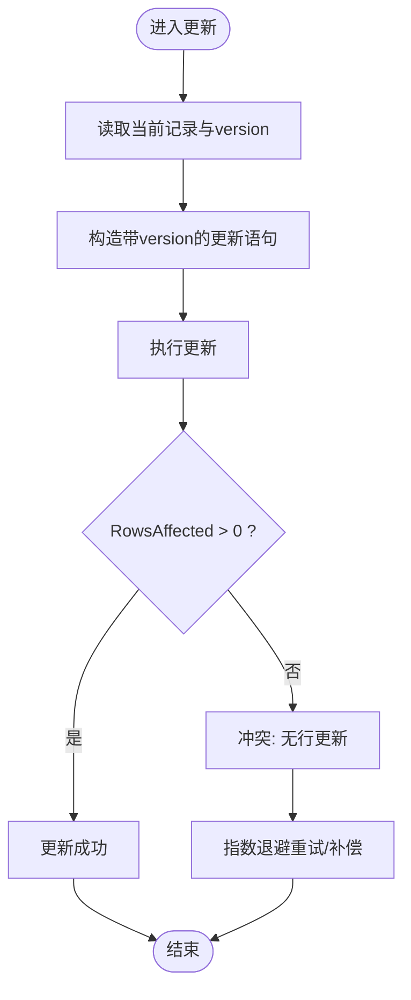
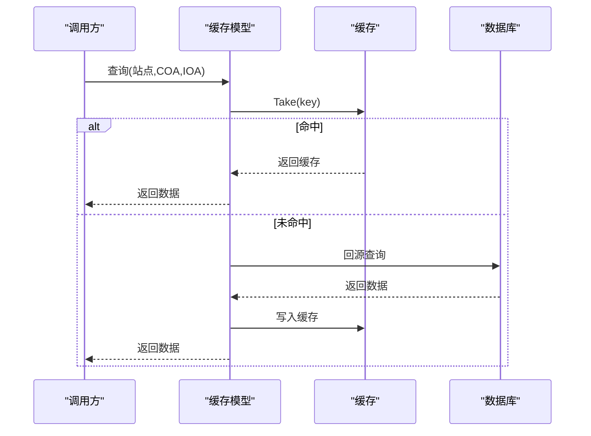
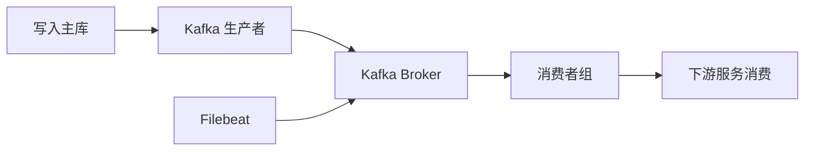
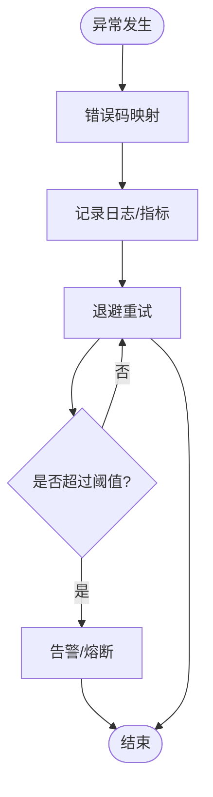
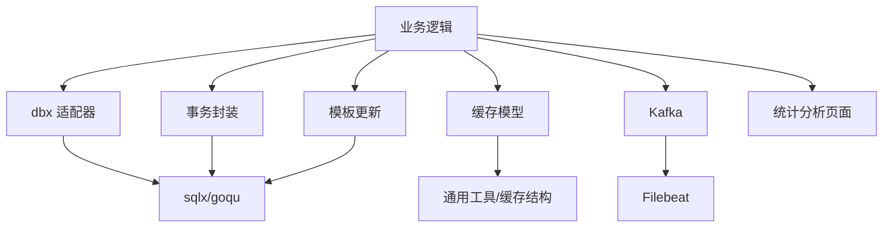

# 数据一致性保障

<cite>
**本文引用的文件**   
- [common/dbx/dbx.go](file://common/dbx/dbx.go)
- [common/dbx/sqlitesql.go](file://common/dbx/sqlitesql.go)
- [common/dbx/taossql.go](file://common/dbx/taossql.go)
- [.trae/skills/zero-skills/references/database-patterns.md](file://.trae/skills/zero-skills/references/database-patterns.md)
- [model/vars.go](file://model/vars.go)
- [1.7.1/model/update.tpl](file://1.7.1/model/update.tpl)
- [model/devicepointmappingmodel.go](file://model/devicepointmappingmodel.go)
- [deploy/docker-compose.yml](file://deploy/docker-compose.yml)
- [common/tool/errorutil.go](file://common/tool/errorutil.go)
- [common/tool/backoff.go](file://common/tool/backoff.go)
- [common/antsx/antsx_test.go](file://common/antsx/antsx_test.go)
- [deploy/stat_analyzer.html](file://deploy/stat_analyzer.html)
</cite>

## 目录
1. [简介](#简介)
2. [项目结构](#项目结构)
3. [核心组件](#核心组件)
4. [架构总览](#架构总览)
5. [详细组件分析](#详细组件分析)
6. [依赖分析](#依赖分析)
7. [性能考虑](#性能考虑)
8. [故障排查指南](#故障排查指南)
9. [结论](#结论)
10. [附录](#附录)

## 简介
本文件聚焦于Zero-Service项目中的数据一致性保障策略，系统梳理在多数据库（MySQL、PostgreSQL、TDengine、SQLite）环境下如何通过事务、版本控制、缓存一致性、最终一致性与监控恢复等手段，确保跨服务、跨存储的数据正确性与可靠性。文档同时给出架构图、流程图与实践建议，帮助读者快速理解与落地。

## 项目结构
围绕数据一致性，项目的关键路径与职责如下：
- 数据访问与适配层：统一数据库连接与方言适配，支持MySQL、PostgreSQL、SQLite、TDengine
- 事务模式与模板：提供标准事务封装与批量更新模板，保障原子性
- 版本控制与冲突检测：基于乐观锁版本号进行并发写入保护
- 缓存与模型：缓存键设计、读取与失效策略，结合模型层的查询与更新逻辑
- 分布式与最终一致：通过Kafka等消息中间件实现跨服务事件驱动与补偿
- 监控与恢复：统计分析页面与退避重试策略，辅助异常检测与恢复

**图表来源**
- [common/dbx/dbx.go:46-64](file://common/dbx/dbx.go#L46-L64)
- [.trae/skills/zero-skills/references/database-patterns.md:271-365](file://.trae/skills/zero-skills/references/database-patterns.md#L271-L365)
- [deploy/docker-compose.yml:1-110](file://deploy/docker-compose.yml#L1-L110)

**章节来源**
- [common/dbx/dbx.go:1-155](file://common/dbx/dbx.go#L1-L155)
- [deploy/docker-compose.yml:1-110](file://deploy/docker-compose.yml#L1-L110)

## 核心组件
- 数据库适配与方言
  - 自动识别数据库类型并创建连接，支持MySQL、PostgreSQL、SQLite、TDengine
  - 使用goqu注册方言，适配不同数据库的SQL语法差异
- 事务模式
  - 提供TransactCtx封装，确保多步骤操作的原子性
  - 模板化批量更新，统一处理版本号与冲突检测
- 版本控制与冲突检测
  - 更新模板在where条件中加入version字段，避免并发覆盖
  - 当RowsAffected为0时判定冲突，返回特定错误
- 缓存与模型
  - 缓存键生成策略与懒加载，减少热点查询对数据库的压力
  - 模型层提供分页、排序与事务接口
- 分布式与最终一致
  - Kafka作为事件通道，配合Filebeat采集日志，形成事件驱动的数据同步
- 监控与恢复
  - 统计分析页面聚合缓存命中率与失败指标
  - 退避重试策略控制重试节奏，防止雪崩

**章节来源**
- [.trae/skills/zero-skills/references/database-patterns.md:271-365](file://.trae/skills/zero-skills/references/database-patterns.md#L271-L365)
- [1.7.1/model/update.tpl:27-68](file://1.7.1/model/update.tpl#L27-L68)
- [model/devicepointmappingmodel.go:66-107](file://model/devicepointmappingmodel.go#L66-L107)
- [model/vars.go:1-318](file://model/vars.go#L1-L318)
- [deploy/stat_analyzer.html:1224-1253](file://deploy/stat_analyzer.html#L1224-L1253)
- [common/tool/backoff.go:1-41](file://common/tool/backoff.go#L1-L41)

## 架构总览
下图展示从应用到存储、消息与监控的整体一致性路径：

**图表来源**
- [common/dbx/dbx.go:31-64](file://common/dbx/dbx.go#L31-L64)
- [.trae/skills/zero-skills/references/database-patterns.md:271-365](file://.trae/skills/zero-skills/references/database-patterns.md#L271-L365)
- [1.7.1/model/update.tpl:27-68](file://1.7.1/model/update.tpl#L27-L68)
- [model/devicepointmappingmodel.go:66-107](file://model/devicepointmappingmodel.go#L66-L107)
- [deploy/docker-compose.yml:1-110](file://deploy/docker-compose.yml#L1-L110)
- [deploy/stat_analyzer.html:1224-1253](file://deploy/stat_analyzer.html#L1224-L1253)

## 详细组件分析

### 数据库适配与方言（dbx）
- 功能要点
  - 解析数据源字符串，自动识别数据库类型（SQLite、TDengine、MySQL、PostgreSQL）
  - 统一创建连接，支持goqu方言注册，适配不同数据库的占位符与标识符
  - 提供SqlConnAdapter适配原生sql.DB，便于日志与扩展
- 关键行为
  - ParseDatabaseType根据前缀/协议/关键字判断类型
  - New根据类型选择具体驱动与连接方式
  - NewQoqu注册方言并设置日志输出

**图表来源**
- [common/dbx/dbx.go:31-64](file://common/dbx/dbx.go#L31-L64)
- [common/dbx/sqlitesql.go:10-12](file://common/dbx/sqlitesql.go#L10-L12)
- [common/dbx/taossql.go:11-13](file://common/dbx/taossql.go#L11-L13)

**章节来源**
- [common/dbx/dbx.go:1-155](file://common/dbx/dbx.go#L1-L155)
- [common/dbx/sqlitesql.go:1-13](file://common/dbx/sqlitesql.go#L1-L13)
- [common/dbx/taossql.go:1-14](file://common/dbx/taossql.go#L1-L14)

### 事务模式与模板（事务封装与批量更新）
- 事务封装
  - 提供TransactCtx，将多个数据库操作包裹在单个事务中，保证原子性
  - 典型场景：转账、订单创建与库存扣减等多表联动
- 模板化批量更新
  - 在更新语句中加入version字段与主键过滤，避免并发覆盖
  - 若RowsAffected为0，判定为“无行被更新”，返回特定错误，触发上层重试或降级

**图表来源**
- [.trae/skills/zero-skills/references/database-patterns.md:271-365](file://.trae/skills/zero-skills/references/database-patterns.md#L271-L365)
- [1.7.1/model/update.tpl:27-68](file://1.7.1/model/update.tpl#L27-L68)

**章节来源**
- [.trae/skills/zero-skills/references/database-patterns.md:271-365](file://.trae/skills/zero-skills/references/database-patterns.md#L271-L365)
- [1.7.1/model/update.tpl:27-68](file://1.7.1/model/update.tpl#L27-L68)

### 版本控制与冲突检测（乐观锁）
- 实现思路
  - 更新模板在WHERE子句中增加version条件，写入时version自增
  - 若更新后RowsAffected为0，判定为并发冲突，返回“无行更新”错误
- 上层策略
  - 重试：结合退避策略进行指数退避
  - 降级：记录冲突并上报监控，必要时走补偿流程

**图表来源**
- [1.7.1/model/update.tpl:27-68](file://1.7.1/model/update.tpl#L27-L68)
- [model/vars.go:18-21](file://model/vars.go#L18-L21)
- [common/tool/backoff.go:1-41](file://common/tool/backoff.go#L1-L41)

**章节来源**
- [1.7.1/model/update.tpl:27-68](file://1.7.1/model/update.tpl#L27-L68)
- [model/vars.go:18-21](file://model/vars.go#L18-L21)
- [common/tool/backoff.go:1-41](file://common/tool/backoff.go#L1-L41)

### 缓存与数据库一致性（缓存模型）
- 缓存键设计
  - 依据业务维度（如站点、COA、IOA）生成唯一键
  - 读取时采用Take惰性加载，缺失则回源数据库并写入缓存
- 一致性策略
  - 写入/删除时清理对应缓存键，避免脏读
  - 对空值也做缓存兜底，降低重复查询成本

**图表来源**
- [model/devicepointmappingmodel.go:66-107](file://model/devicepointmappingmodel.go#L66-L107)

**章节来源**
- [model/devicepointmappingmodel.go:66-107](file://model/devicepointmappingmodel.go#L66-L107)

### 分布式与最终一致（Kafka与Filebeat）
- 事件驱动
  - 通过Kafka实现跨服务解耦与异步通知，确保写入主库后，下游消费方按序处理
  - Kafdrop提供可视化管理与监控
- 日志采集
  - Filebeat采集容器日志，统一接入Kafka，便于问题定位与审计
- 最终一致
  - 通过幂等消费、去重与补偿机制，达成跨系统的最终一致性

**图表来源**
- [deploy/docker-compose.yml:1-110](file://deploy/docker-compose.yml#L1-L110)

**章节来源**
- [deploy/docker-compose.yml:1-110](file://deploy/docker-compose.yml#L1-L110)

### 监控与异常检测（统计分析与错误工具）
- 缓存指标聚合
  - 统计分析页面对缓存命中率、QPM、缺失与数据库失败进行聚合与可视化
- 错误映射
  - 将业务错误码映射为HTTP语义，便于统一处理与告警
- 退避策略
  - 指数退避与上限控制，避免重试风暴

**图表来源**
- [common/tool/errorutil.go:12-59](file://common/tool/errorutil.go#L12-L59)
- [common/tool/backoff.go:1-41](file://common/tool/backoff.go#L1-L41)
- [deploy/stat_analyzer.html:1224-1253](file://deploy/stat_analyzer.html#L1224-L1253)

**章节来源**
- [common/tool/errorutil.go:12-59](file://common/tool/errorutil.go#L12-L59)
- [common/tool/backoff.go:1-41](file://common/tool/backoff.go#L1-L41)
- [deploy/stat_analyzer.html:1224-1253](file://deploy/stat_analyzer.html#L1224-L1253)

## 依赖分析
- 组件耦合
  - 业务逻辑依赖dbx进行数据库连接与方言适配
  - 事务封装与模板更新依赖sqlx与goqu方言
  - 缓存模型依赖通用缓存结构与反射元信息
- 外部依赖
  - Kafka/Filebeat用于事件与日志传输
  - 统计分析页面用于可观测性

**图表来源**
- [common/dbx/dbx.go:1-155](file://common/dbx/dbx.go#L1-L155)
- [.trae/skills/zero-skills/references/database-patterns.md:271-365](file://.trae/skills/zero-skills/references/database-patterns.md#L271-L365)
- [1.7.1/model/update.tpl:27-68](file://1.7.1/model/update.tpl#L27-L68)
- [model/devicepointmappingmodel.go:66-107](file://model/devicepointmappingmodel.go#L66-L107)
- [model/vars.go:1-318](file://model/vars.go#L1-L318)
- [deploy/docker-compose.yml:1-110](file://deploy/docker-compose.yml#L1-L110)
- [deploy/stat_analyzer.html:1224-1253](file://deploy/stat_analyzer.html#L1224-L1253)

**章节来源**
- [common/dbx/dbx.go:1-155](file://common/dbx/dbx.go#L1-L155)
- [model/vars.go:1-318](file://model/vars.go#L1-L318)

## 性能考虑
- 连接与方言
  - 合理复用连接池，避免频繁创建连接
  - 使用goqu方言减少手写SQL差异带来的性能波动
- 事务与批量
  - 将相关写操作放入同一事务，减少锁竞争与提交开销
  - 批量更新时尽量合并SQL，减少往返
- 缓存
  - 采用惰性加载与空值缓存，降低热点查询压力
  - 合理设置过期策略，避免缓存穿透
- 监控
  - 通过统计分析页面观察命中率与失败率，及时发现异常

## 故障排查指南
- 事务失败
  - 检查事务包裹范围与异常传播路径
  - 确认回滚是否正确释放资源
- 并发冲突
  - 观察“无行更新”错误频率，评估重试策略与退避参数
  - 必要时引入补偿任务或幂等设计
- 缓存不一致
  - 确认写入后是否清理了对应缓存键
  - 检查缓存键生成规则是否与查询一致
- 消息积压
  - 查看Kafka分区与消费者组状态
  - 结合Filebeat日志定位生产/消费瓶颈
- 错误映射
  - 使用错误工具将业务错误码映射为标准HTTP语义，便于统一告警

**章节来源**
- [common/tool/errorutil.go:12-59](file://common/tool/errorutil.go#L12-L59)
- [common/tool/backoff.go:1-41](file://common/tool/backoff.go#L1-L41)
- [common/antsx/antsx_test.go:1-459](file://common/antsx/antsx_test.go#L1-L459)

## 结论
Zero-Service通过“数据库适配+事务封装+版本控制+缓存一致性+消息中间件+监控恢复”的组合拳，在多数据库与分布式环境下实现了可靠的数据一致性保障。实践中应重点关注事务边界、冲突检测与重试策略、缓存键设计与失效时机，以及事件驱动的最终一致性与可观测性建设。

## 附录
- 关键实现路径参考
  - 数据库适配与方言：[common/dbx/dbx.go:31-64](file://common/dbx/dbx.go#L31-L64)
  - 事务封装示例：[database-patterns.md:271-365](file://.trae/skills/zero-skills/references/database-patterns.md#L271-L365)
  - 模板更新与版本控制：[1.7.1/model/update.tpl:27-68](file://1.7.1/model/update.tpl#L27-L68)
  - 缓存模型与键设计：[model/devicepointmappingmodel.go:66-107](file://model/devicepointmappingmodel.go#L66-L107)
  - 监控与统计：[deploy/stat_analyzer.html:1224-1253](file://deploy/stat_analyzer.html#L1224-L1253)
  - 退避策略：[common/tool/backoff.go:1-41](file://common/tool/backoff.go#L1-L41)
  - 错误映射：[common/tool/errorutil.go:12-59](file://common/tool/errorutil.go#L12-L59)
  - 消息与部署：[deploy/docker-compose.yml:1-110](file://deploy/docker-compose.yml#L1-L110)