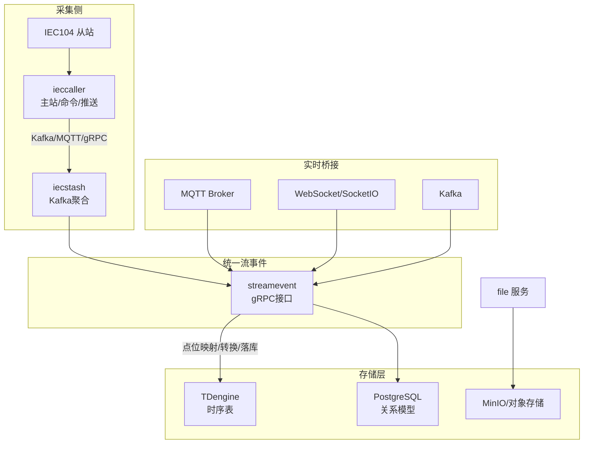
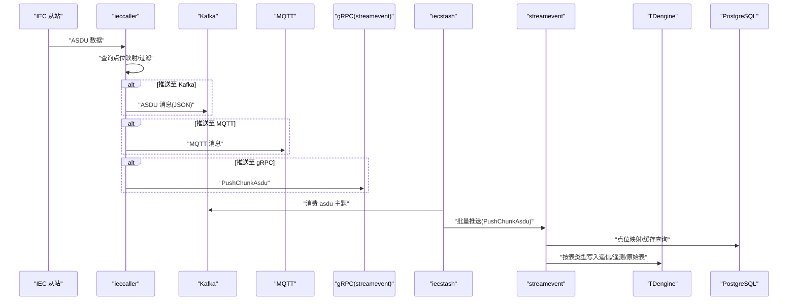
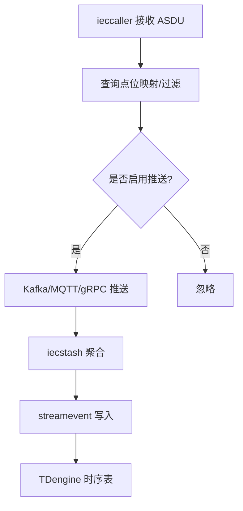
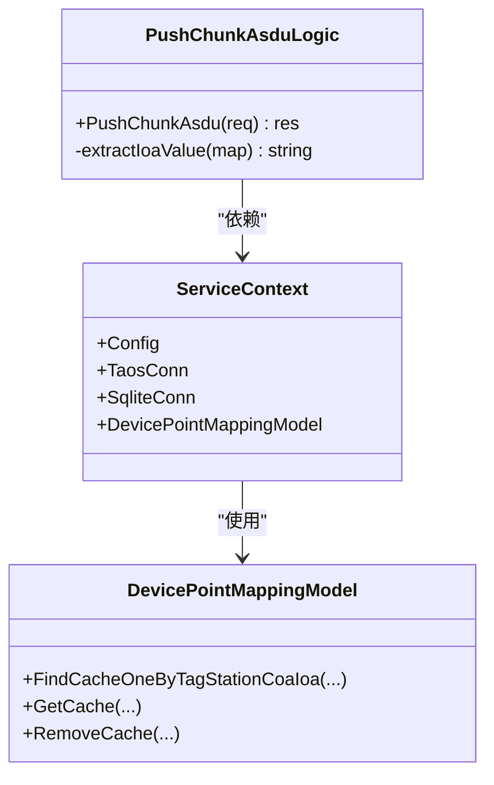
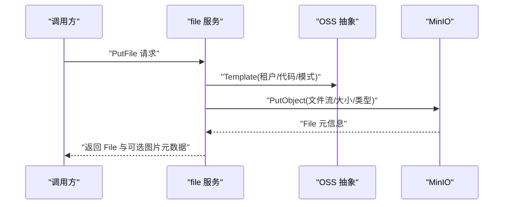
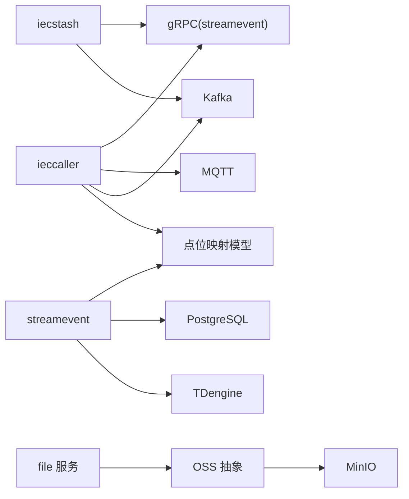

# 数据流设计

<cite>
**本文引用的文件**   
- [docs/iec104.md](file://docs/iec104.md)
- [docs/iec104-protocol.md](file://docs/iec104-protocol.md)
- [common/executorx/chunkmessagespusher.go](file://common/executorx/chunkmessagespusher.go)
- [common/iec104/client/clientmanager.go](file://common/iec104/client/clientmanager.go)
- [facade/streamevent/internal/logic/pushchunkasdulogic.go](file://facade/streamevent/internal/logic/pushchunkasdulogic.go)
- [facade/streamevent/internal/logic/receivekafkamessagelogic.go](file://facade/streamevent/internal/logic/receivekafkamessagelogic.go)
- [facade/streamevent/internal/svc/servicecontext.go](file://facade/streamevent/internal/svc/servicecontext.go)
- [facade/streamevent/streamevent/streamevent.pb.go](file://facade/streamevent/streamevent/streamevent.pb.go)
- [app/bridgemqtt/internal/handler/mqttstreamhandler.go](file://app/bridgemqtt/internal/handler/mqttstreamhandler.go)
- [app/file/internal/logic/putfilelogic.go](file://app/file/internal/logic/putfilelogic.go)
- [common/ossx/ossx.go](file://common/ossx/ossx.go)
- [common/ossx/minio_oss.go](file://common/ossx/minio_oss.go)
- [model/sql/tdengine.sql](file://model/sql/tdengine.sql)
- [model/sql/postgres.sql](file://model/sql/postgres.sql)
- [model/devicepointmappingmodel.go](file://model/devicepointmappingmodel.go)
- [common/dbx/dbx.go](file://common/dbx/dbx.go)
- [deploy/docker-compose.yml](file://deploy/docker-compose.yml)
- [swagger/iecstream.swagger.json](file://swagger/iecstream.swagger.json)
- [swagger/mqttstream.swagger.json](file://swagger/mqttstream.swagger.json)
</cite>

## 目录
1. [简介](#简介)
2. [项目结构](#项目结构)
3. [核心组件](#核心组件)
4. [架构总览](#架构总览)
5. [详细组件分析](#详细组件分析)
6. [依赖分析](#依赖分析)
7. [性能考量](#性能考量)
8. [故障排查指南](#故障排查指南)
9. [结论](#结论)
10. [附录](#附录)

## 简介
本设计文档面向 Zero-Service 的数据流体系，覆盖从工业设备数据采集（IEC 60870-5-104）、文件上传下载、实时通信（MQTT/WebSocket/Kafka）到最终存储的完整链路。重点说明：
- IEC104 数采平台的数据流、协议适配与聚合策略
- 文件上传下载的数据流与对象存储集成
- 实时通信（MQTT/WS/Kafka）的接入与统一流事件处理
- 数据格式转换、点位映射、聚合与落库策略
- 存储分层（关系型/时序数据库/对象存储）与一致性保障
- 监控、性能优化、备份与迁移策略

## 项目结构
围绕数据流的关键目录与文件：
- IEC104 数采平台：ieccaller、iecstash、streamevent、iecagent
- 实时通信桥接：bridgemqtt、socketpush、lalhook/lalproxy
- 文件服务：file 服务与 OSS 抽象
- 统一流事件：facade/streamevent
- 存储与模型：TDengine/PostgreSQL/SQLite 脚本与点位映射模型
- 部署与监控：docker-compose、Filebeat、Kafdrop

图表来源
- [docs/iec104.md:14-29](file://docs/iec104.md#L14-L29)
- [deploy/docker-compose.yml:4-30](file://deploy/docker-compose.yml#L4-L30)

章节来源
- [docs/iec104.md:1-177](file://docs/iec104.md#L1-L177)
- [deploy/docker-compose.yml:1-110](file://deploy/docker-compose.yml#L1-L110)

## 核心组件
- ieccaller：IEC 60870-5-104 主站，负责与多个从站通信、按配置推送至 Kafka/MQTT/gRPC，并支持集群广播命令与点位映射缓存。
- iecstash：Kafka 消费者，按字节数阈值聚合 ASDU 消息，批量推送到 streamevent。
- streamevent：统一流事件服务，接收来自 Kafka/MQTT/WS 的消息，执行点位映射与数据转换，写入 TDengine 时序表与 PostgreSQL 关系表。
- bridgemqtt：MQTT 桥接服务，提供发布/带追踪发布等 RPC 接口，配合 streamevent 的 MQTT 接收逻辑。
- file：文件上传服务，封装 OSS 抽象，支持多种上传方式与图片元数据提取。
- 存储与模型：TDengine 时序稳定表与子表、PostgreSQL 点位映射表、SQLite 内嵌数据库；dbx 抽象数据库类型与连接。

章节来源
- [docs/iec104.md:38-177](file://docs/iec104.md#L38-L177)
- [facade/streamevent/internal/svc/servicecontext.go:14-32](file://facade/streamevent/internal/svc/servicecontext.go#L14-L32)
- [common/dbx/dbx.go:22-64](file://common/dbx/dbx.go#L22-L64)

## 架构总览
IEC104 数采平台采用“主站采集 + 多协议推送 + 统一汇聚 + 时序/关系落库”的分层架构。下图展示从 IEC 从站到落库的端到端数据流：

图表来源
- [docs/iec104.md:14-29](file://docs/iec104.md#L14-L29)
- [docs/iec104-protocol.md:9-51](file://docs/iec104-protocol.md#L9-L51)
- [facade/streamevent/internal/logic/pushchunkasdulogic.go:118-222](file://facade/streamevent/internal/logic/pushchunkasdulogic.go#L118-L222)

## 详细组件分析

### IEC104 数采平台数据流
- ieccaller 与多个 IEC 从站并行通信，接收 ASDU 数据，按点位映射配置决定是否推送，并支持 Kafka/MQTT/gRPC 三通道。
- iecstash 消费 Kafka 的 ASDU 主题，使用按字节数阈值的聚合器批量转发至 streamevent。
- streamevent 接收后，依据点位映射与表类型，将数据转换并写入 TDengine 时序表（遥信/遥测/原始表）。

图表来源
- [docs/iec104.md:24-28](file://docs/iec104.md#L24-L28)
- [common/executorx/chunkmessagespusher.go:17-30](file://common/executorx/chunkmessagespusher.go#L17-L30)
- [facade/streamevent/internal/logic/pushchunkasdulogic.go:160-192](file://facade/streamevent/internal/logic/pushchunkasdulogic.go#L160-L192)

章节来源
- [docs/iec104.md:14-29](file://docs/iec104.md#L14-L29)
- [docs/iec104-protocol.md:9-51](file://docs/iec104-protocol.md#L9-L51)
- [common/executorx/chunkmessagespusher.go:1-45](file://common/executorx/chunkmessagespusher.go#L1-L45)
- [facade/streamevent/internal/logic/pushchunkasdulogic.go:118-222](file://facade/streamevent/internal/logic/pushchunkasdulogic.go#L118-L222)

### IEC104 协议与消息格式
- 基础协议：IEC 60870-5-104，传输载体为 Kafka/MQTT Topic，数据格式为 JSON，编码 UTF-8。
- 消息结构包含基础字段（如 msgId、host、port、asdu、typeId、dataType、coa、body、time）与扩展字段（metaData、pm）。
- pm 字段包含设备标识、表类型、扩展字段等，用于指导落库与业务处理。

章节来源
- [docs/iec104-protocol.md:9-51](file://docs/iec104-protocol.md#L9-L51)

### 点位映射与聚合
- 点位映射模型提供缓存与查询能力，支持按 tag_station/coa/ioa 快速定位设备与表类型。
- iecstash 使用按字节数阈值的聚合器，减少网络与数据库压力，提升吞吐。

章节来源
- [model/devicepointmappingmodel.go:36-68](file://model/devicepointmappingmodel.go#L36-L68)
- [common/executorx/chunkmessagespusher.go:17-30](file://common/executorx/chunkmessagespusher.go#L17-L30)

### 统一流事件处理（streamevent）
- 提供 gRPC 接口：PushChunkAsdu、ReceiveMQTTMessage、ReceiveWSMessage、ReceiveKafkaMessage 等。
- 处理流程：解析 JSON、提取 ioa 值、生成站点标识、查询点位映射、构造插入语句、并发写入 TDengine。
- 服务上下文初始化时加载 TDengine 连接与点位映射模型。

图表来源
- [facade/streamevent/internal/svc/servicecontext.go:14-32](file://facade/streamevent/internal/svc/servicecontext.go#L14-L32)
- [facade/streamevent/internal/logic/pushchunkasdulogic.go:20-32](file://facade/streamevent/internal/logic/pushchunkasdulogic.go#L20-L32)
- [model/devicepointmappingmodel.go:36-68](file://model/devicepointmappingmodel.go#L36-L68)

章节来源
- [facade/streamevent/streamevent/streamevent.pb.go:59-87](file://facade/streamevent/streamevent/streamevent.pb.go#L59-L87)
- [facade/streamevent/internal/logic/pushchunkasdulogic.go:118-222](file://facade/streamevent/internal/logic/pushchunkasdulogic.go#L118-L222)
- [facade/streamevent/internal/svc/servicecontext.go:14-32](file://facade/streamevent/internal/svc/servicecontext.go#L14-L32)

### MQTT 桥接与事件匹配
- bridgemqtt 提供 Publish/PublishWithTrace 等 RPC 接口。
- streamevent 的 MQTT 接收逻辑通过事件映射将 Topic 模板匹配到事件名，便于统一处理。

章节来源
- [app/bridgemqtt/internal/handler/mqttstreamhandler.go:109-128](file://app/bridgemqtt/internal/handler/mqttstreamhandler.go#L109-L128)
- [facade/streamevent/streamevent/streamevent.pb.go:59-87](file://facade/streamevent/streamevent/streamevent.pb.go#L59-L87)

### 文件上传下载数据流
- file 服务封装 OSS 抽象，支持本地文件路径上传、流式上传、带缩略图标记等。
- MinIO 实现提供 PutFile/PutObject、签名 URL、桶与文件操作等能力。
- 图片上传时提取 EXIF 元数据并回传给调用方。

图表来源
- [app/file/internal/logic/putfilelogic.go:33-77](file://app/file/internal/logic/putfilelogic.go#L33-L77)
- [common/ossx/ossx.go:28-39](file://common/ossx/ossx.go#L28-L39)
- [common/ossx/minio_oss.go:65-94](file://common/ossx/minio_oss.go#L65-L94)

章节来源
- [app/file/internal/logic/putfilelogic.go:1-78](file://app/file/internal/logic/putfilelogic.go#L1-L78)
- [common/ossx/ossx.go:28-39](file://common/ossx/ossx.go#L28-L39)
- [common/ossx/minio_oss.go:124-162](file://common/ossx/minio_oss.go#L124-L162)

### 存储策略与数据分层
- TDengine：时序数据落库，包含原始表、遥信表、遥测表，按站点与点位生成子表，支持高吞吐写入与高效查询。
- PostgreSQL：关系型数据，存储点位映射、业务元数据等，提供强一致与复杂查询能力。
- 对象存储：MinIO/兼容 S3，用于文件与媒体资源的长期保存与签名访问。

章节来源
- [model/sql/tdengine.sql:1-33](file://model/sql/tdengine.sql#L1-L33)
- [model/sql/postgres.sql:24-48](file://model/sql/postgres.sql#L24-L48)
- [common/ossx/minio_oss.go:124-162](file://common/ossx/minio_oss.go#L124-L162)

### 数据一致性与同步
- 点位映射缓存：设备点位映射模型内置缓存，支持按 key 删除与批量删除，降低查询开销并避免热点冲突。
- Kafka 广播：集群模式下，ieccaller 通过 Kafka 广播命令（总召唤、读定值、通用命令等），确保多实例一致性。
- 最终一致性：Kafka/MQTT/gRPC 作为异步通道，结合 streamevent 的幂等处理与 TDengine 的时间序列特性，实现最终一致性。

章节来源
- [model/devicepointmappingmodel.go:54-68](file://model/devicepointmappingmodel.go#L54-L68)
- [docs/iec104.md:122-129](file://docs/iec104.md#L122-L129)

## 依赖分析
- 数据库抽象：dbx 根据数据源自动识别数据库类型（SQLite/TAOS/Postgres/MySQL），并提供统一连接与查询接口。
- 组件耦合：streamevent 依赖 dbx 与点位映射模型；ieccaller 依赖点位映射与 Kafka/MQTT/gRPC；file 服务依赖 OSS 抽象与 MinIO 实现。

图表来源
- [common/dbx/dbx.go:31-64](file://common/dbx/dbx.go#L31-L64)
- [facade/streamevent/internal/svc/servicecontext.go:14-32](file://facade/streamevent/internal/svc/servicecontext.go#L14-L32)
- [app/file/internal/logic/putfilelogic.go:33-39](file://app/file/internal/logic/putfilelogic.go#L33-L39)

章节来源
- [common/dbx/dbx.go:1-155](file://common/dbx/dbx.go#L1-L155)
- [facade/streamevent/internal/svc/servicecontext.go:14-32](file://facade/streamevent/internal/svc/servicecontext.go#L14-L32)

## 性能考量
- 聚合与批处理：iecstash 使用按字节数阈值的聚合器，减少网络与数据库往返，提高吞吐。
- 并发写入：streamevent 在 MapReduce 模式下并发执行插入，缩短写入延迟。
- 缓存命中：点位映射模型内置缓存，降低重复查询成本。
- 监控与可观测性：docker-compose 中包含 Kafdrop 可视化界面；Swagger 文档提供 API 规范与示例。

章节来源
- [common/executorx/chunkmessagespusher.go:17-30](file://common/executorx/chunkmessagespusher.go#L17-L30)
- [facade/streamevent/internal/logic/pushchunkasdulogic.go:127-212](file://facade/streamevent/internal/logic/pushchunkasdulogic.go#L127-L212)
- [model/devicepointmappingmodel.go:36-68](file://model/devicepointmappingmodel.go#L36-L68)
- [swagger/iecstream.swagger.json:19-50](file://swagger/iecstream.swagger.json#L19-L50)
- [swagger/mqttstream.swagger.json:18-78](file://swagger/mqttstream.swagger.json#L18-L78)

## 故障排查指南
- IEC104 客户端统计：ClientManager 定期打印连接状态统计，便于发现断连与异常。
- Kafka 消息接收：streamevent 的 Kafka 接收逻辑预留扩展点，可按需实现消费与处理。
- 文件上传错误：file 服务在读取文件头、检测内容类型、上传对象时记录错误日志，便于定位问题。
- Swagger 接口：通过 iecstream 与 mqttstream 的 Swagger 文档快速验证接口行为与请求格式。

章节来源
- [common/iec104/client/clientmanager.go:117-144](file://common/iec104/client/clientmanager.go#L117-L144)
- [facade/streamevent/internal/logic/receivekafkamessagelogic.go:26-31](file://facade/streamevent/internal/logic/receivekafkamessagelogic.go#L26-L31)
- [app/file/internal/logic/putfilelogic.go:40-63](file://app/file/internal/logic/putfilelogic.go#L40-L63)
- [swagger/iecstream.swagger.json:19-50](file://swagger/iecstream.swagger.json#L19-L50)
- [swagger/mqttstream.swagger.json:18-78](file://swagger/mqttstream.swagger.json#L18-L78)

## 结论
本数据流设计以 ieccaller/iecstash/streamevent 为核心，结合 Kafka/MQTT/gRPC 实现多协议并行推送与统一流事件处理，通过点位映射与聚合策略实现高吞吐、低延迟的数据采集与落库。存储层采用 TDengine 时序表与 PostgreSQL 关系表互补，辅以对象存储满足文件与媒体资源需求。整体方案具备良好的扩展性与运维可观测性。

## 附录
- 协议与消息格式参考：IEC104 协议对接文档
- 部署与可视化：docker-compose 包含 Kafka、Kafdrop、Filebeat 等组件
- API 文档：Swagger 提供 iecstream 与 mqttstream 的接口规范

章节来源
- [docs/iec104-protocol.md:1-884](file://docs/iec104-protocol.md#L1-L884)
- [deploy/docker-compose.yml:1-110](file://deploy/docker-compose.yml#L1-L110)
- [swagger/iecstream.swagger.json:19-50](file://swagger/iecstream.swagger.json#L19-L50)
- [swagger/mqttstream.swagger.json:18-78](file://swagger/mqttstream.swagger.json#L18-L78)