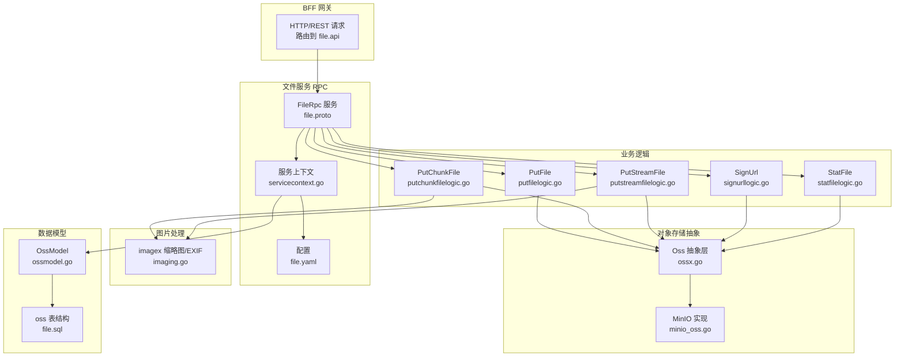
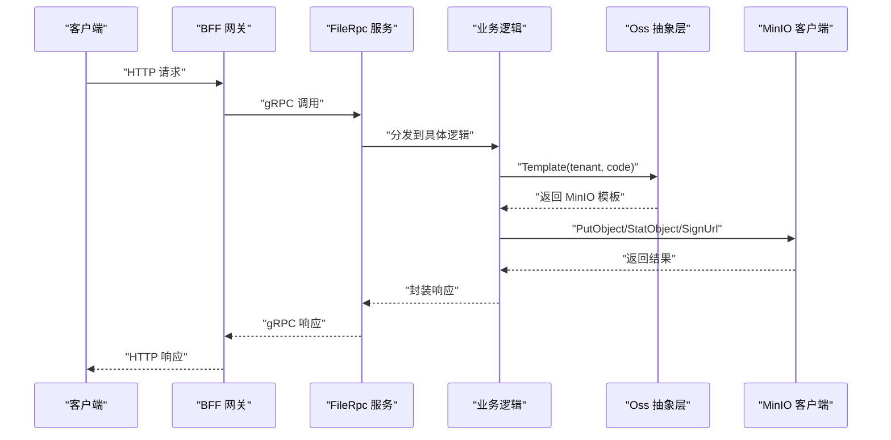
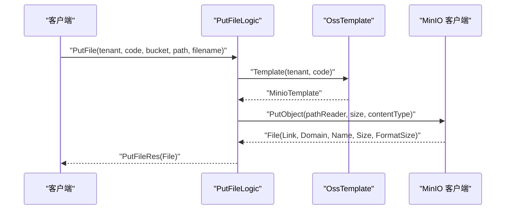
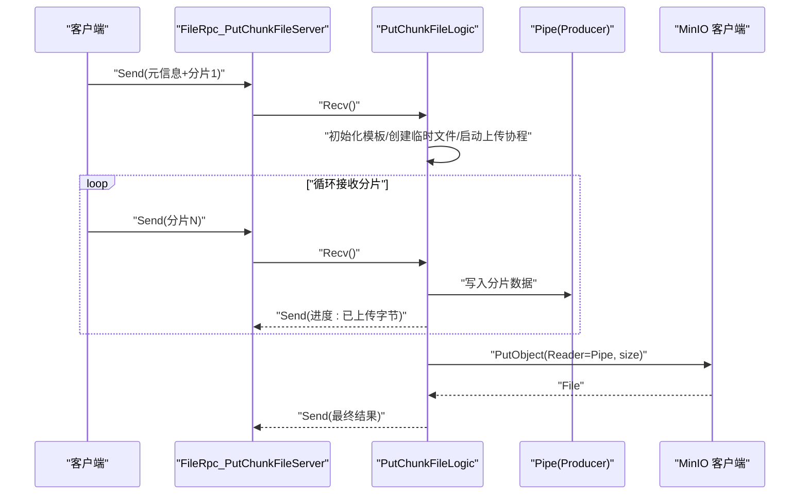
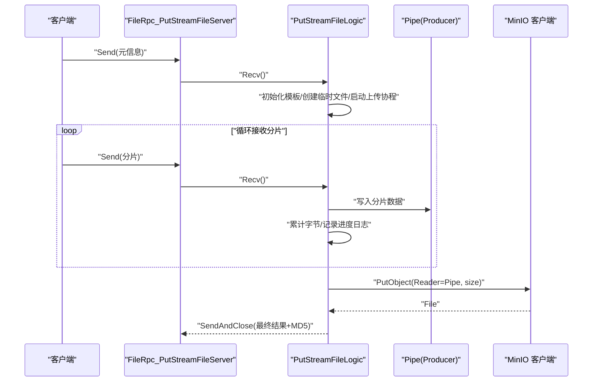
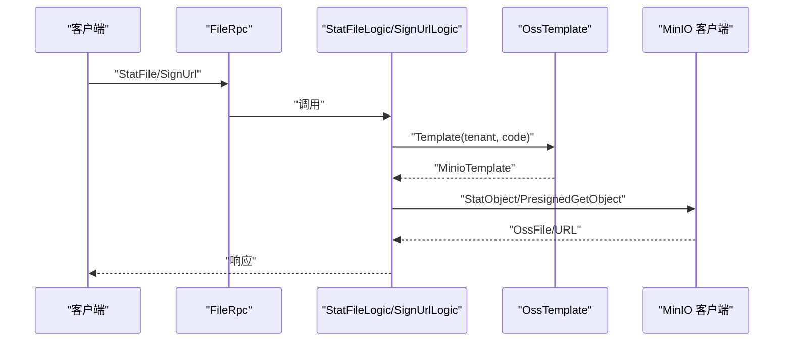
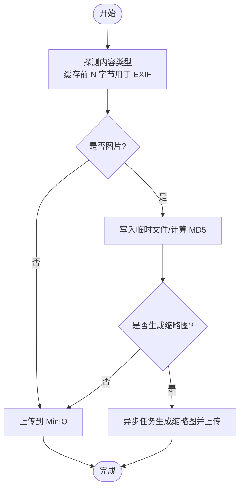
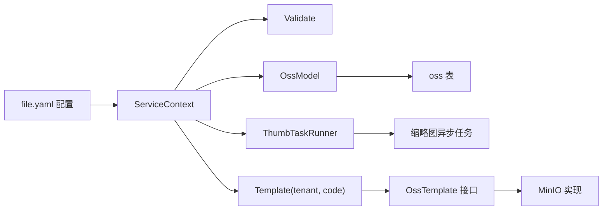

# 文件数据流

<cite>
**本文引用的文件**
- [file.proto](file://app/file/file.proto)
- [file.yaml](file://app/file/etc/file.yaml)
- [ossx.go](file://common/ossx/ossx.go)
- [minio_oss.go](file://common/ossx/minio_oss.go)
- [putfilelogic.go](file://app/file/internal/logic/putfilelogic.go)
- [putchunkfilelogic.go](file://app/file/internal/logic/putchunkfilelogic.go)
- [putstreamfilelogic.go](file://app/file/internal/logic/putstreamfilelogic.go)
- [signurllogic.go](file://app/file/internal/logic/signurllogic.go)
- [statfilelogic.go](file://app/file/internal/logic/statfilelogic.go)
- [servicecontext.go](file://app/file/internal/svc/servicecontext.go)
- [config.go](file://app/file/internal/config/config.go)
- [imaging.go](file://common/imagex/imaging.go)
- [ossmodel.go](file://model/ossmodel.go)
- [file.sql](file://model/sql/file.sql)
</cite>

## 目录
1. [简介](#简介)
2. [项目结构](#项目结构)
3. [核心组件](#核心组件)
4. [架构总览](#架构总览)
5. [详细组件分析](#详细组件分析)
6. [依赖分析](#依赖分析)
7. [性能考量](#性能考量)
8. [故障排查指南](#故障排查指南)
9. [结论](#结论)
10. [附录](#附录)

## 简介
本文件数据流文档围绕文件服务从上传到存储的完整流程展开，覆盖单文件上传、分片上传（双向流）、流式上传（服务端单向流）三种模式；阐述文件在系统内的流转路径，从 BFF 网关接收请求，到文件服务处理，再到对象存储（当前实现为 MinIO）的存储过程；解释文件分片上传的断点续传机制、文件完整性校验（MD5）、并发上传控制与缩略图异步生成等关键技术；介绍文件下载流程、URL 签名机制、文件元数据管理；最后给出文件存储策略、性能优化与安全建议。

## 项目结构
文件服务位于 app/file 模块，采用 go-zero RPC 架构，通过 gRPC 暴露接口；对象存储抽象位于 common/ossx，当前实现支持 MinIO；图片处理位于 common/imagex；数据库模型位于 model，包含 OSS 配置表。

**图表来源**
- [file.proto:270-287](file://app/file/file.proto#L270-L287)
- [file.yaml:1-23](file://app/file/etc/file.yaml#L1-L23)
- [ossx.go:28-39](file://common/ossx/ossx.go#L28-L39)
- [minio_oss.go:20-24](file://common/ossx/minio_oss.go#L20-L24)
- [putfilelogic.go:33-77](file://app/file/internal/logic/putfilelogic.go#L33-L77)
- [putchunkfilelogic.go:38-269](file://app/file/internal/logic/putchunkfilelogic.go#L38-L269)
- [putstreamfilelogic.go:43-286](file://app/file/internal/logic/putstreamfilelogic.go#L43-L286)
- [signurllogic.go:29-60](file://app/file/internal/logic/signurllogic.go#L29-L60)
- [statfilelogic.go:29-58](file://app/file/internal/logic/statfilelogic.go#L29-L58)
- [servicecontext.go:12-26](file://app/file/internal/svc/servicecontext.go#L12-L26)
- [ossmodel.go:10-31](file://model/ossmodel.go#L10-L31)
- [file.sql:1-22](file://model/sql/file.sql#L1-L22)

**章节来源**
- [file.proto:1-287](file://app/file/file.proto#L1-L287)
- [file.yaml:1-23](file://app/file/etc/file.yaml#L1-L23)

## 核心组件
- 文件服务 RPC 接口：通过 file.proto 定义，包含上传、分片上传、流式上传、签名 URL、文件统计等接口。
- 对象存储抽象层：OssTemplate 接口统一 MinIO 等存储能力，OssRule 负责桶名与文件名规则，模板池缓存避免重复初始化。
- 业务逻辑层：各上传/下载逻辑封装具体流程，含内容类型探测、MD5 校验、EXIF 元数据提取、缩略图异步生成、并发控制。
- 图片处理：基于 imaging 库进行缩略图生成与 EXIF 元数据提取。
- 数据模型：OssModel 提供 OSS 配置查询，oss 表存储租户、分类、凭证、桶名等。

**章节来源**
- [ossx.go:28-151](file://common/ossx/ossx.go#L28-L151)
- [minio_oss.go:20-243](file://common/ossx/minio_oss.go#L20-L243)
- [imaging.go:12-68](file://common/imagex/imaging.go#L12-L68)
- [ossmodel.go:10-31](file://model/ossmodel.go#L10-L31)
- [file.sql:1-22](file://model/sql/file.sql#L1-L22)

## 架构总览
文件服务以 gRPC 为核心，BFF 网关将请求路由至 FileRpc 服务。服务根据租户与资源编号动态选择 OSS 模板，调用 MinIO 客户端完成对象上传；同时支持对图片进行 EXIF 元数据提取与缩略图异步生成；下载时可生成带过期时间的签名 URL。

**图表来源**
- [file.proto:270-287](file://app/file/file.proto#L270-L287)
- [ossx.go:109-151](file://common/ossx/ossx.go#L109-L151)
- [minio_oss.go:65-162](file://common/ossx/minio_oss.go#L65-L162)

## 详细组件分析

### 单文件上传 PutFile
- 流程要点
  - 从本地路径读取文件，探测内容类型（使用前 512 字节），随后以 Reader 方式上传。
  - 通过 OssTemplate.PutObject 写入 MinIO，生成文件链接、域名、格式化大小等。
  - 若为图片，提取 EXIF 元数据并填充到响应。
- 关键路径
  - [putfilelogic.go:33-77](file://app/file/internal/logic/putfilelogic.go#L33-L77)
  - [ossx.go:33-35](file://common/ossx/ossx.go#L33-L35)
  - [minio_oss.go:124-148](file://common/ossx/minio_oss.go#L124-L148)
  - [imaging.go:18-32](file://common/imagex/imaging.go#L18-L32)

**图表来源**
- [putfilelogic.go:33-77](file://app/file/internal/logic/putfilelogic.go#L33-L77)
- [minio_oss.go:124-148](file://common/ossx/minio_oss.go#L124-L148)

**章节来源**
- [putfilelogic.go:33-77](file://app/file/internal/logic/putfilelogic.go#L33-L77)

### 分片上传 PutChunkFile（双向流）
- 流程要点
  - 使用 io.Pipe 建立生产者/消费者通道，一边从 gRPC 双向流接收数据，一边将数据写入 MinIO。
  - 首包内解析元信息（租户、资源编号、桶名、文件名、总大小、内容类型、是否缩略图、路径前缀）。
  - 在接收首块数据时探测内容类型，并缓存前若干字节用于 EXIF 提取。
  - 写入过程中计算 MD5，实时发送进度（已上传字节数）。
  - 支持缩略图异步生成：复制临时文件副本，异步任务生成缩略图并上传。
  - 断点续传：当前实现未保存中间状态，需由客户端维护分片序号与偏移；服务端按总大小校验完成条件。
- 关键路径
  - [putchunkfilelogic.go:38-269](file://app/file/internal/logic/putchunkfilelogic.go#L38-L269)
  - [ossx.go:33-35](file://common/ossx/ossx.go#L33-L35)
  - [minio_oss.go:124-148](file://common/ossx/minio_oss.go#L124-L148)
  - [imaging.go:18-32](file://common/imagex/imaging.go#L18-L32)

**图表来源**
- [putchunkfilelogic.go:38-191](file://app/file/internal/logic/putchunkfilelogic.go#L38-L191)
- [minio_oss.go:124-148](file://common/ossx/minio_oss.go#L124-L148)

**章节来源**
- [putchunkfilelogic.go:38-269](file://app/file/internal/logic/putchunkfilelogic.go#L38-L269)

### 流式上传 PutStreamFile（服务端单向流）
- 流程要点
  - 与分片上传类似，但使用单向流（服务端接收），同样通过 Pipe 与 MinIO 交互。
  - 支持进度日志阈值控制（如每 100MB 记录一次），便于大文件监控。
  - 完成后计算 MD5 并回传。
- 关键路径
  - [putstreamfilelogic.go:43-286](file://app/file/internal/logic/putstreamfilelogic.go#L43-L286)
  - [ossx.go:33-35](file://common/ossx/ossx.go#L33-L35)
  - [minio_oss.go:124-148](file://common/ossx/minio_oss.go#L124-L148)

**图表来源**
- [putstreamfilelogic.go:43-286](file://app/file/internal/logic/putstreamfilelogic.go#L43-L286)
- [minio_oss.go:124-148](file://common/ossx/minio_oss.go#L124-L148)

**章节来源**
- [putstreamfilelogic.go:43-286](file://app/file/internal/logic/putstreamfilelogic.go#L43-L286)

### 下载与签名 URL
- 文件统计 StatFile：查询对象元信息，可选生成签名 URL。
- 签名 URL SignUrl：生成带过期时间的预签名 URL，默认 1 小时。
- 关键路径
  - [statfilelogic.go:29-58](file://app/file/internal/logic/statfilelogic.go#L29-L58)
  - [signurllogic.go:29-60](file://app/file/internal/logic/signurllogic.go#L29-L60)
  - [minio_oss.go:150-162](file://common/ossx/minio_oss.go#L150-L162)

**图表来源**
- [statfilelogic.go:29-58](file://app/file/internal/logic/statfilelogic.go#L29-L58)
- [signurllogic.go:29-60](file://app/file/internal/logic/signurllogic.go#L29-L60)
- [minio_oss.go:40-56](file://common/ossx/minio_oss.go#L40-L56)

**章节来源**
- [statfilelogic.go:29-58](file://app/file/internal/logic/statfilelogic.go#L29-L58)
- [signurllogic.go:29-60](file://app/file/internal/logic/signurllogic.go#L29-L60)

### 文件元数据与缩略图
- 元数据：图片文件通过 EXIF 提取经纬度、拍摄时间、分辨率、海拔、相机型号等。
- 缩略图：当 isThumb 为真时，异步生成 300x300 的 JPEG 缩略图并上传，返回缩略图链接与文件名。
- 关键路径
  - [imaging.go:18-32](file://common/imagex/imaging.go#L18-L32)
  - [putchunkfilelogic.go:219-256](file://app/file/internal/logic/putchunkfilelogic.go#L219-L256)
  - [putstreamfilelogic.go:229-266](file://app/file/internal/logic/putstreamfilelogic.go#L229-L266)

**图表来源**
- [putchunkfilelogic.go:160-256](file://app/file/internal/logic/putchunkfilelogic.go#L160-L256)
- [putstreamfilelogic.go:160-266](file://app/file/internal/logic/putstreamfilelogic.go#L160-L266)

**章节来源**
- [imaging.go:18-32](file://common/imagex/imaging.go#L18-L32)
- [putchunkfilelogic.go:219-256](file://app/file/internal/logic/putchunkfilelogic.go#L219-L256)
- [putstreamfilelogic.go:229-266](file://app/file/internal/logic/putstreamfilelogic.go#L229-L266)

## 依赖分析
- 服务配置与上下文
  - 配置项包含监听端口、日志、Nacos 注册、租户模式开关、缩略图并发数、数据库连接串等。
  - 服务上下文注入验证器、OssModel、缩略图任务运行器。
- 对象存储模板
  - Template 根据租户与资源编号动态获取 OSS 配置并创建模板实例，模板池缓存以减少重复初始化。
  - 当前仅支持 MinIO 类型（Category_Minio）。
- 数据模型
  - OssModel 提供按租户与资源编号查询 OSS 配置的能力，oss 表定义了字段与索引。

**图表来源**
- [file.yaml:1-23](file://app/file/etc/file.yaml#L1-L23)
- [servicecontext.go:12-26](file://app/file/internal/svc/servicecontext.go#L12-L26)
- [config.go:10-30](file://app/file/internal/config/config.go#L10-L30)
- [ossx.go:109-151](file://common/ossx/ossx.go#L109-L151)
- [ossmodel.go:10-31](file://model/ossmodel.go#L10-L31)
- [file.sql:1-22](file://model/sql/file.sql#L1-L22)

**章节来源**
- [file.yaml:1-23](file://app/file/etc/file.yaml#L1-L23)
- [servicecontext.go:12-26](file://app/file/internal/svc/servicecontext.go#L12-L26)
- [config.go:10-30](file://app/file/internal/config/config.go#L10-L30)
- [ossx.go:109-151](file://common/ossx/ossx.go#L109-L151)
- [ossmodel.go:10-31](file://model/ossmodel.go#L10-L31)
- [file.sql:1-22](file://model/sql/file.sql#L1-L22)

## 性能考量
- 并发上传控制
  - 通过服务上下文的 ThumbTaskRunner 控制缩略图异步任务并发度，避免 CPU/IO 抢占影响主上传链路。
- 流式传输
  - 使用 io.Pipe 将 gRPC 流与 MinIO PutObject 解耦，降低内存峰值；对大文件建议使用流式接口。
- 进度与日志
  - 流式上传支持按阈值记录进度日志，便于监控与定位问题。
- 内容类型探测
  - 仅读取必要字节（如 512 字节）进行探测，避免全量读取带来的开销。
- 缓存与模板复用
  - OssTemplate 按租户缓存，减少 MinIO 客户端初始化成本。

**章节来源**
- [servicecontext.go:12-26](file://app/file/internal/svc/servicecontext.go#L12-L26)
- [putstreamfilelogic.go:28-207](file://app/file/internal/logic/putstreamfilelogic.go#L28-L207)
- [ossx.go:109-151](file://common/ossx/ossx.go#L109-L151)

## 故障排查指南
- 上传失败
  - 检查租户与资源编号是否正确，确认 OssModel 能查询到对应配置。
  - 确认 MinIO 客户端初始化参数（Endpoint、AccessKey、SecretKey）正确。
  - 查看服务日志中“Failed to write to OSS”、“Failed to read from stream”等错误。
- 缩略图未生成
  - 确认 isThumb 为真且图片内容类型被识别。
  - 检查缩略图任务并发数与磁盘空间。
- 签名 URL 无效
  - 校验过期时间参数与桶权限；确认对象存在。
- 断点续传
  - 当前服务端未持久化中间状态，需由客户端维护分片序号与偏移；服务端以总大小作为完成条件。

**章节来源**
- [putchunkfilelogic.go:130-146](file://app/file/internal/logic/putchunkfilelogic.go#L130-L146)
- [putstreamfilelogic.go:139-155](file://app/file/internal/logic/putstreamfilelogic.go#L139-L155)
- [signurllogic.go:49-56](file://app/file/internal/logic/signurllogic.go#L49-L56)

## 结论
该文件服务以清晰的抽象层与流式处理实现了多样化的上传模式，结合内容类型探测、EXIF 元数据与缩略图异步生成，满足常见的文件管理需求。当前实现聚焦于 MinIO，具备良好的扩展性；后续可在服务端引入分片状态持久化以完善断点续传能力，并进一步增强多存储后端的适配与治理。

## 附录

### 接口与数据模型概览
- 上传接口
  - 单文件上传：PutFile
  - 分片上传（双向流）：PutChunkFile
  - 流式上传（服务端单向流）：PutStreamFile
- 下载与统计
  - 文件统计：StatFile
  - 签名 URL：SignUrl
- 数据模型
  - Oss：租户、分类、凭证、桶名等配置
  - File/OssFile：文件元信息与链接

**章节来源**
- [file.proto:176-287](file://app/file/file.proto#L176-L287)
- [ossmodel.go:10-31](file://model/ossmodel.go#L10-L31)
- [file.sql:1-22](file://model/sql/file.sql#L1-L22)