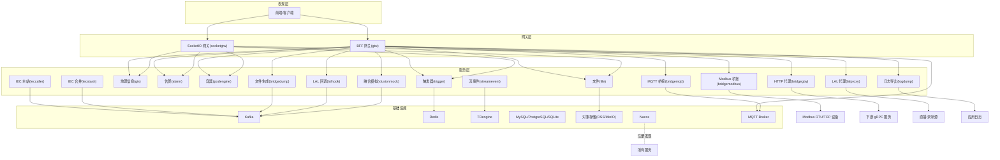
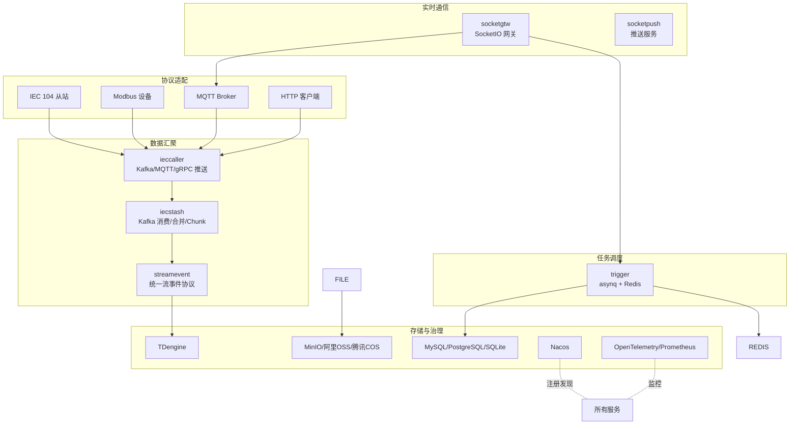
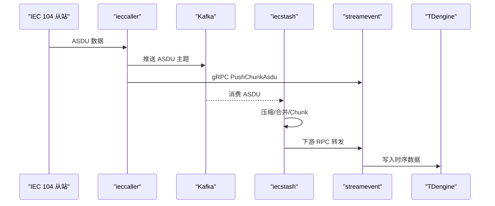
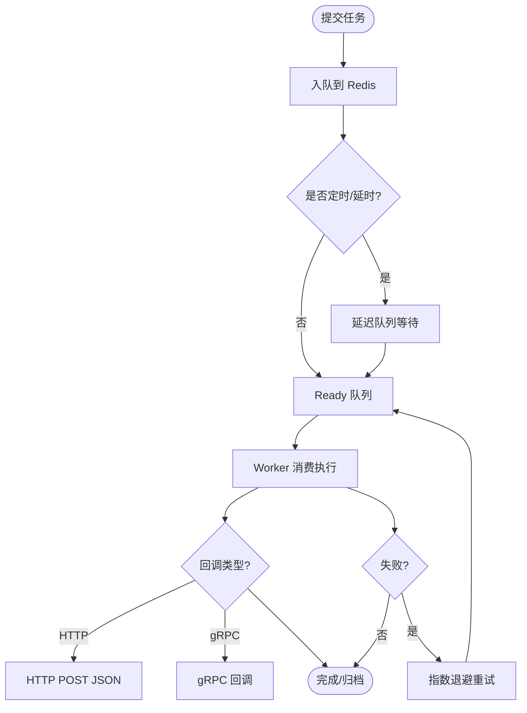
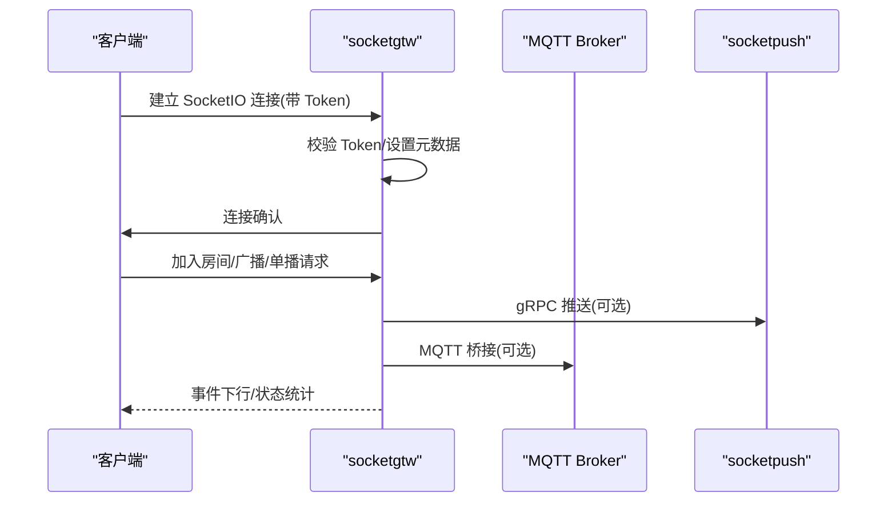
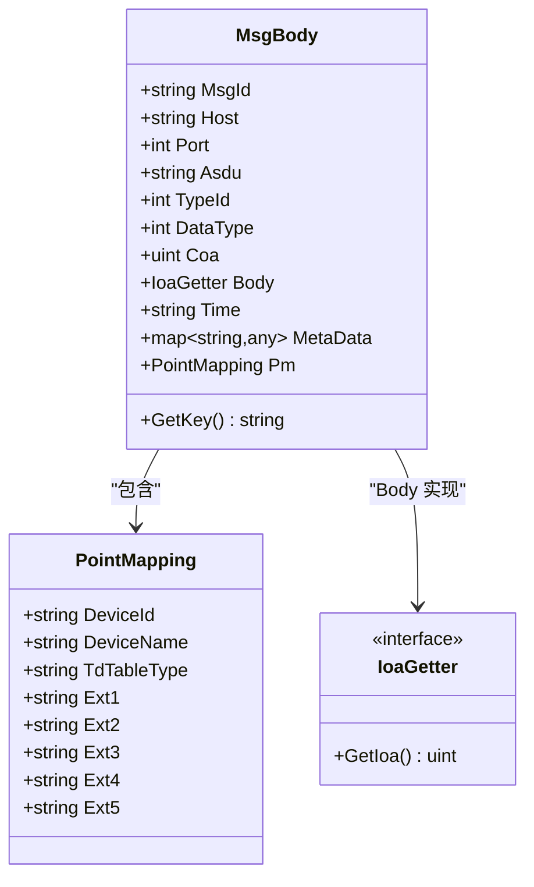
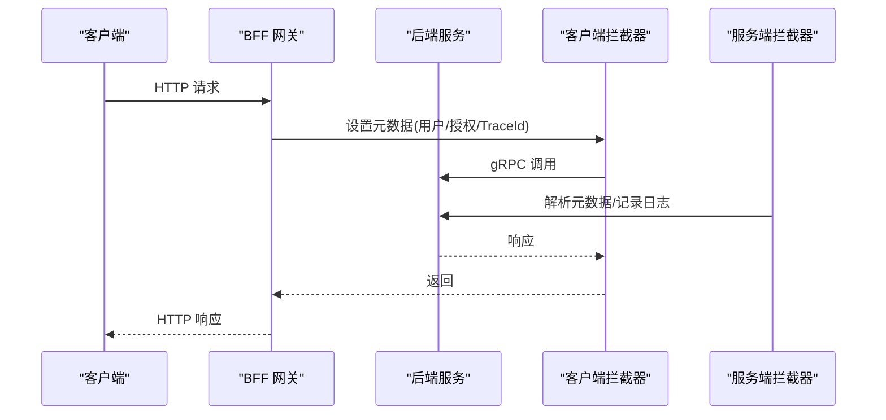
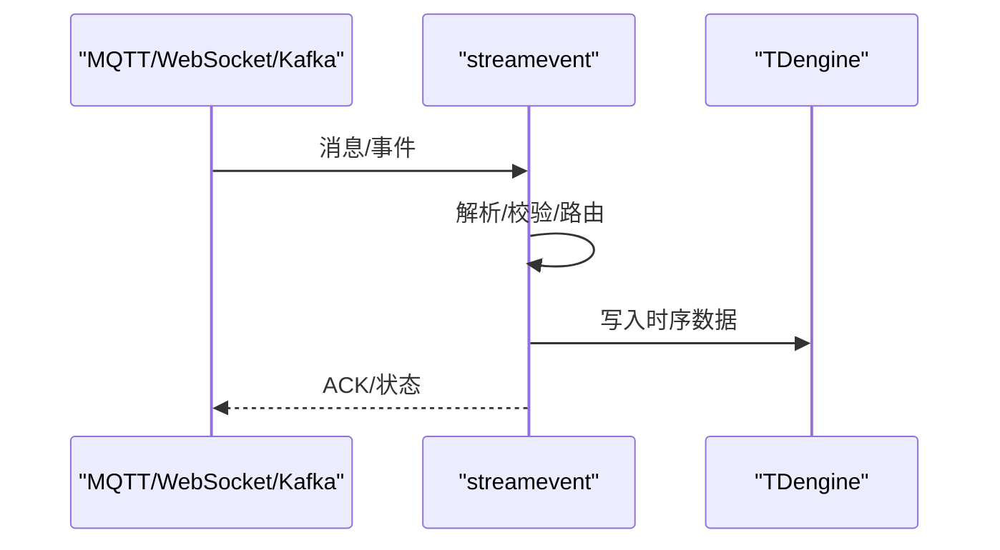
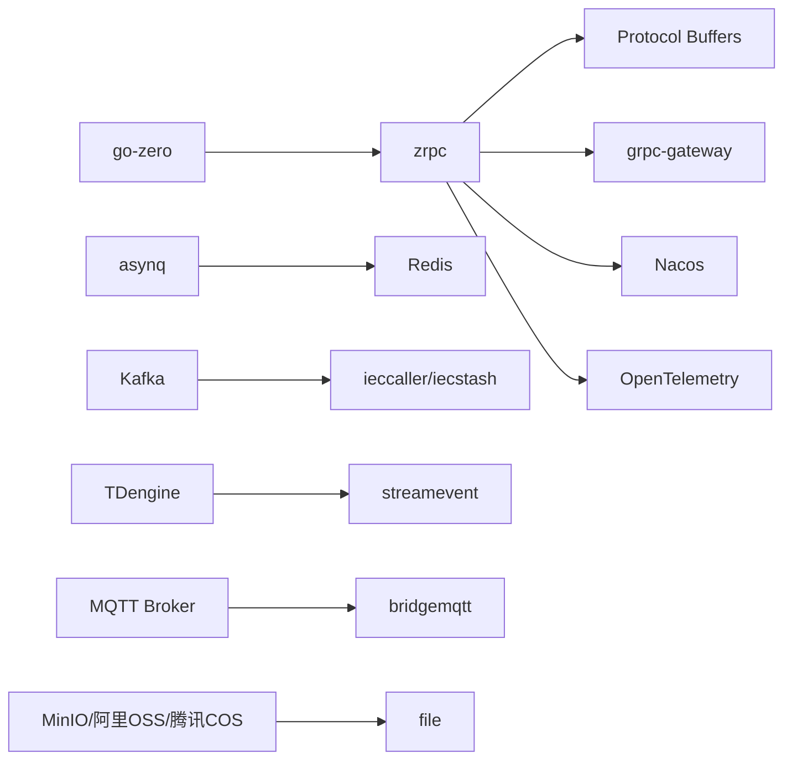

# 整体架构概览

<cite>
**本文引用的文件**
- [README.md](file://README.md)
- [go.mod](file://go.mod)
- [app/trigger/etc/trigger.yaml](file://app/trigger/etc/trigger.yaml)
- [app/ieccaller/etc/ieccaller.yaml](file://app/ieccaller/etc/ieccaller.yaml)
- [deploy/docker-compose.yml](file://deploy/docker-compose.yml)
- [common/Interceptor/rpcserver/loggerInterceptor.go](file://common/Interceptor/rpcserver/loggerInterceptor.go)
- [common/Interceptor/rpcclient/metadataInterceptor.go](file://common/Interceptor/rpcclient/metadataInterceptor.go)
- [common/iec104/types/types.go](file://common/iec104/types/types.go)
- [common/socketiox/server.go](file://common/socketiox/server.go)
- [common/asynqx/asynqClient.go](file://common/asynqx/asynqClient.go)
- [zerorpc/zerorpc.go](file://zerorpc/zerorpc.go)
- [facade/streamevent/streamevent.go](file://facade/streamevent/streamevent.go)
</cite>

## 目录
1. [引言](#引言)
2. [项目结构](#项目结构)
3. [核心组件](#核心组件)
4. [架构总览](#架构总览)
5. [详细组件分析](#详细组件分析)
6. [依赖分析](#依赖分析)
7. [性能考量](#性能考量)
8. [故障排查指南](#故障排查指南)
9. [结论](#结论)
10. [附录](#附录)

## 引言
本文件为 Zero-Service 的整体架构概览文档，面向工业物联网场景，聚焦多协议接入、数采平台、异步任务调度、实时通信与容器管理等能力。系统采用 go-zero 微服务脚手架，围绕 gRPC + grpc-gateway 的统一 API 入口，结合 Kafka、Redis、TDengine、MQTT 等基础设施，形成“协议适配—数据汇聚—实时通信—任务调度—容器编排”的完整链路。

## 项目结构
项目采用按功能域划分的微服务组织方式，核心目录如下：
- app/*：核心微服务集合，涵盖 IEC 104 数采、Modbus/MQTT 桥接、文件服务、GIS、告警、容器管理、触发器、LAL 流媒体等
- socketapp/*：SocketIO 实时通信网关与推送服务
- gtw：统一 BFF 网关，聚合 gRPC 并提供 grpc-gateway HTTP 访问
- facade/*：对外接口层（如 streamevent），定义跨语言流数据事件协议
- common/*：公共组件库，含协议实现、任务队列、服务注册、数据库扩展、SocketIO 封装等
- model/*：数据库模型与 SQL 脚本
- deploy/*：Docker Compose 编排与部署样例
- docs/swagger/third_party/util/*：文档、Swagger 与第三方 proto

图表来源
- [README.md:15-51](file://README.md#L15-L51)
- [README.md:59-108](file://README.md#L59-L108)

章节来源
- [README.md:15-51](file://README.md#L15-L51)
- [README.md:59-108](file://README.md#L59-L108)

## 核心组件
- IEC 104 数采平台：ieccaller（主站）、iecstash（Kafka 消费与合并）、streamevent（统一流事件协议与落库）
- 异步任务调度：trigger（基于 asynq 的 Redis 任务队列 + 计划任务引擎）
- 实时通信：socketgtw（SocketIO 网关）+ socketpush（推送）
- 协议桥接：bridgemodbus（Modbus）、bridgemqtt（MQTT）、bridgegtw（HTTP 代理）
- 文件与媒体：file（分片流上传/OSS）、lalhook/lalproxy（流媒体）
- 地理信息：gis（H3/GeoHash/围栏/坐标转换）
- 容器管理：podengine（Docker 生命周期）
- 对外接口：facade/streamevent（跨语言 gRPC 协议）
- 网关：gtw（统一 API 入口，HTTP + grpc-gateway）

章节来源
- [README.md:112-188](file://README.md#L112-L188)
- [README.md:189-206](file://README.md#L189-L206)

## 架构总览
系统采用“协议适配—数据汇聚—实时通信—任务调度—容器编排”的分层设计：
- 协议适配层：IEC 104、Modbus、MQTT、HTTP/gRPC
- 数据汇聚层：Kafka/MQTT/gRPC 三通道并行推送，iecstash 聚合与压缩
- 实时通信层：SocketIO 网关 + MQTT 桥接，支持房间管理、广播、追踪
- 任务调度层：asynq + Redis，支持定时/延时/回调；计划任务引擎（Plan/Batch/ExecItem）
- 数据存储层：TDengine（时序）、MySQL/PostgreSQL/SQLite（关系）、MinIO（对象存储）
- 网关与治理：gtw + Nacos + OpenTelemetry/Prometheus

图表来源
- [README.md:15-51](file://README.md#L15-L51)
- [README.md:112-188](file://README.md#L112-L188)

章节来源
- [README.md:15-51](file://README.md#L15-L51)
- [README.md:207-225](file://README.md#L207-L225)

## 详细组件分析

### IEC 104 数采平台
- ieccaller：多从站并行通信、Kafka/MQTT/gRPC 三协议推送、弱校验模式、动态配置
- iecstash：Kafka 消费、ASDU 压缩合并、Chunk 批量处理、下游 RPC 转发
- streamevent：统一跨语言流事件协议，接收多源消息并写入 TDengine

图表来源
- [README.md:112-131](file://README.md#L112-L131)
- [app/ieccaller/etc/ieccaller.yaml:35-79](file://app/ieccaller/etc/ieccaller.yaml#L35-L79)

章节来源
- [README.md:112-131](file://README.md#L112-L131)
- [app/ieccaller/etc/ieccaller.yaml:1-79](file://app/ieccaller/etc/ieccaller.yaml#L1-L79)

### 异步任务调度（trigger）
- 基于 asynq + Redis，支持定时/延时任务、HTTP/gRPC 回调、自动重试与生命周期管理
- 计划任务引擎：Plan -> Batch -> ExecItem 三层模型，状态机完备，分布式锁防重

图表来源
- [README.md:133-154](file://README.md#L133-L154)
- [common/asynqx/asynqClient.go:17-31](file://common/asynqx/asynqClient.go#L17-L31)
- [app/trigger/etc/trigger.yaml:19-37](file://app/trigger/etc/trigger.yaml#L19-L37)

章节来源
- [README.md:133-154](file://README.md#L133-L154)
- [common/asynqx/asynqClient.go:1-31](file://common/asynqx/asynqClient.go#L1-L31)
- [app/trigger/etc/trigger.yaml:1-37](file://app/trigger/etc/trigger.yaml#L1-L37)

### SocketIO 实时通信
- socketgtw：连接管理、房间管理、消息路由、Token 认证、MQTT 桥接
- socketpush：Token 生成/验证、gRPC 推送接口、后端服务调用入口

图表来源
- [README.md:156-173](file://README.md#L156-L173)
- [common/socketiox/server.go:392-619](file://common/socketiox/server.go#L392-L619)

章节来源
- [README.md:156-173](file://README.md#L156-L173)
- [common/socketiox/server.go:1-814](file://common/socketiox/server.go#L1-L814)

### 协议与数据模型
- IEC 104 类型：MsgBody、PointMapping、多种 ASDU 信息体（单点/双点/遥测/累计量等）
- SocketIO 事件：连接、加入/离开房间、房间/全局广播、状态统计等

图表来源
- [common/iec104/types/types.go:17-58](file://common/iec104/types/types.go#L17-L58)

章节来源
- [common/iec104/types/types.go:1-323](file://common/iec104/types/types.go#L1-L323)

### 网关与拦截器
- gtw：统一 API 入口，支持 HTTP + grpc-gateway，用户认证、文件上传/下载、CORS
- 服务端拦截器：从 gRPC 元数据注入用户/授权/TraceID 等上下文
- 客户端拦截器：透传上下文到下游服务

图表来源
- [common/Interceptor/rpcclient/metadataInterceptor.go:11-32](file://common/Interceptor/rpcclient/metadataInterceptor.go#L11-L32)
- [common/Interceptor/rpcserver/loggerInterceptor.go:12-44](file://common/Interceptor/rpcserver/loggerInterceptor.go#L12-L44)

章节来源
- [common/Interceptor/rpcclient/metadataInterceptor.go:1-56](file://common/Interceptor/rpcclient/metadataInterceptor.go#L1-L56)
- [common/Interceptor/rpcserver/loggerInterceptor.go:1-45](file://common/Interceptor/rpcserver/loggerInterceptor.go#L1-L45)

### 外部接口层（facade/streamevent）
- 定义跨语言流事件协议，支持 MQTT/WebSocket/Kafka 消息接收与 IEC 104 推送
- 作为统一入口，简化第三方系统对接

图表来源
- [README.md:197-206](file://README.md#L197-L206)
- [facade/streamevent/streamevent.go:28-71](file://facade/streamevent/streamevent.go#L28-L71)

章节来源
- [README.md:197-206](file://README.md#L197-L206)
- [facade/streamevent/streamevent.go:1-72](file://facade/streamevent/streamevent.go#L1-L72)

## 依赖分析
- 技术栈：go-zero、gRPC + grpc-gateway、Protocol Buffers、Kafka、asynq + Redis、SocketIO、IEC 104/Modbus/MQTT、TDengine、Nacos、OpenTelemetry/Prometheus、Docker
- 服务发现与注册：Nacos
- 监控链路：OpenTelemetry -> Prometheus -> Grafana
- 容器编排：Docker Compose（示例）

图表来源
- [go.mod:5-62](file://go.mod#L5-L62)
- [README.md:207-225](file://README.md#L207-L225)

章节来源
- [go.mod:1-245](file://go.mod#L1-L245)
- [README.md:207-225](file://README.md#L207-L225)

## 性能考量
- 高并发处理：gRPC 二进制序列化、连接池复用、并发控制；SocketIO 使用 goroutine 安全处理与统计循环
- 协议适配：IEC 104 多从站并行通信、Modbus 批量读写、MQTT QoS 与主题路由
- 实时数据：Kafka 分区并行、iecstash Chunk 合并与压缩、SocketIO 房间广播
- 任务调度：asynq 延迟队列与指数退避、计划任务状态机与分布式锁
- 存储优化：TDengine 时序压缩、索引与分区策略；对象存储分片上传与断点续传

## 故障排查指南
- 日志与追踪：服务端拦截器统一记录错误与上下文；OpenTelemetry 采集指标与链路
- 配置检查：各服务配置文件（如 trigger.yaml、ieccaller.yaml）中的端口、超时、Redis/Kafka/DB/Nacos 参数
- 常见问题定位：
  - gRPC 调用失败：检查元数据透传（用户/授权/TraceId）与服务注册（Nacos）
  - IEC 104 无数据：确认从站地址/端口、总召唤/累计量周期、Kafka 主题与消费者组
  - SocketIO 连接异常：Token 校验、房间加入/离开、广播事件
  - 任务未执行：Redis 连通性、队列状态、回调地址可达性

章节来源
- [common/Interceptor/rpcserver/loggerInterceptor.go:12-44](file://common/Interceptor/rpcserver/loggerInterceptor.go#L12-L44)
- [app/trigger/etc/trigger.yaml:19-37](file://app/trigger/etc/trigger.yaml#L19-L37)
- [app/ieccaller/etc/ieccaller.yaml:22-79](file://app/ieccaller/etc/ieccaller.yaml#L22-L79)

## 结论
Zero-Service 以 go-zero 为基础，构建了面向工业物联网的高并发、强适配、可扩展的微服务体系。通过 IEC 104 数采平台、异步任务调度、实时通信与容器管理等核心能力，满足多协议接入与实时数据处理需求。依托 Kafka/Redis/TDengine 等基础设施与 Nacos/OpenTelemetry 的治理能力，系统具备良好的可观测性与可运维性。

## 附录
- 快速启动与部署：参考 README 中的环境要求、安装步骤与 Docker Compose 示例
- 服务编排：默认包含 Kafka、Filebeat、ieccaller、bridgegtw、bridgedump 等核心服务

章节来源
- [README.md:226-325](file://README.md#L226-L325)
- [deploy/docker-compose.yml:1-110](file://deploy/docker-compose.yml#L1-L110)