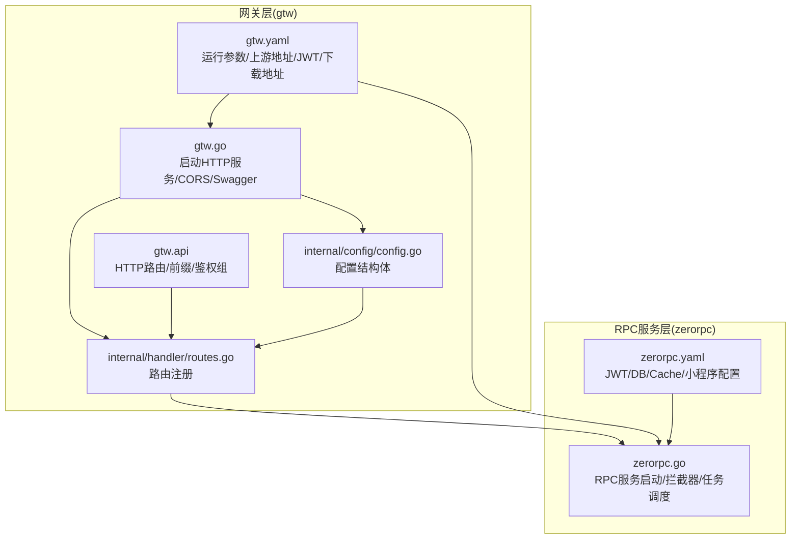
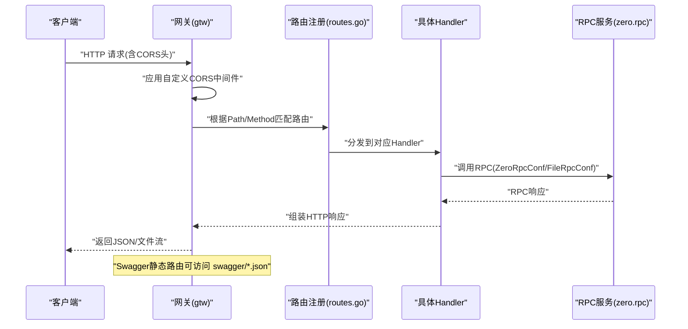
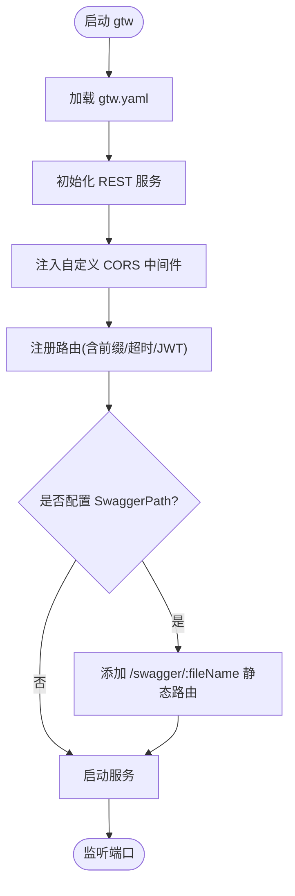
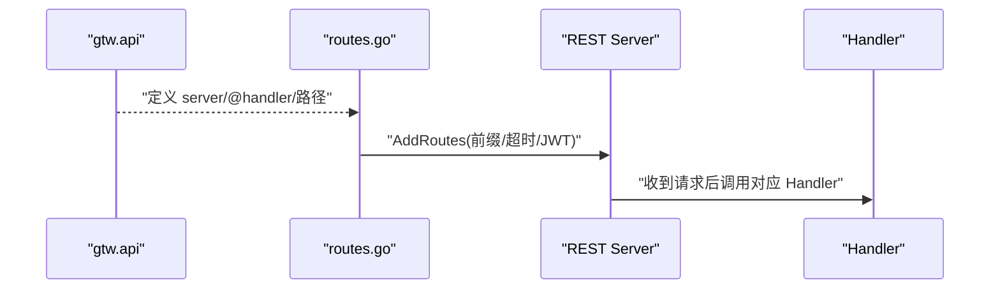
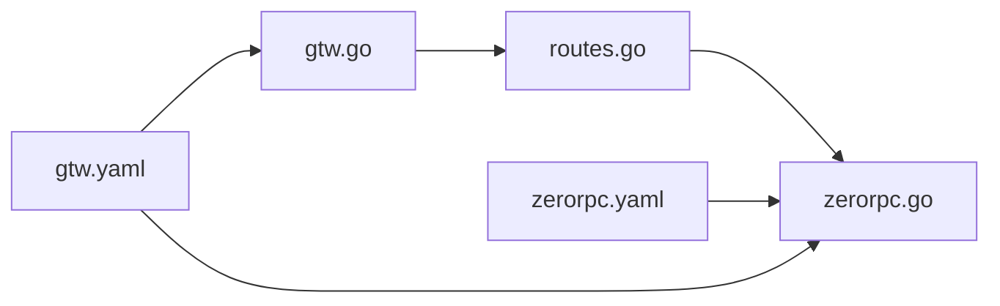

# HTTP RESTful API

<cite>
**本文引用的文件**
- [gtw.api](file://gtw/gtw.api)
- [gtw.go](file://gtw/gtw.go)
- [routes.go](file://gtw/internal/handler/routes.go)
- [config.go（网关配置）](file://gtw/internal/config/config.go)
- [gtw.yaml](file://gtw/etc/gtw.yaml)
- [base.api](file://gtw/doc/base.api)
- [common.api](file://gtw/doc/common.api)
- [user.api](file://gtw/doc/user.api)
- [file.api](file://gtw/doc/file.api)
- [zerorpc.go](file://zerorpc/zerorpc.go)
- [config.go（RPC服务配置）](file://zerorpc/internal/config/config.go)
- [zerorpc.yaml](file://zerorpc/etc/zerorpc.yaml)
- [kqConfig.go](file://common/configx/kqConfig.go)
</cite>

## 目录
1. [简介](#简介)
2. [项目结构](#项目结构)
3. [核心组件](#核心组件)
4. [架构总览](#架构总览)
5. [详细组件分析](#详细组件分析)
6. [依赖分析](#依赖分析)
7. [性能考虑](#性能考虑)
8. [故障排查指南](#故障排查指南)
9. [结论](#结论)
10. [附录](#附录)

## 简介
本文件面向Zero-Service中的HTTP RESTful API子系统，系统性阐述基于 go-zero 的 BFF 网关（gtw）如何通过 grpc-gateway 机制对外暴露 HTTP 接口，并结合 Swagger 文档生成、CORS 跨域、JWT 认证、文件上传下载、微信支付回调等能力，形成完整的 API 设计与实现参考。同时给出 RESTful 设计规范、错误码标准化、版本控制策略、测试与调试方法以及性能优化与安全防护建议。

## 项目结构
围绕 HTTP API 的关键目录与文件如下：
- 网关入口与配置
  - gtw/gtw.go：HTTP 服务启动、CORS 注入、Swagger 静态路由、服务注册
  - gtw/etc/gtw.yaml：网关运行参数、ZeroRpc/FileRpc 上游地址、JWT 密钥、Swagger 路径等
  - gtw/internal/config/config.go：网关配置结构体（继承 rest.RestConf 并扩展）
- API 定义与路由
  - gtw/gtw.api：统一定义各模块的 HTTP 路由、前缀、鉴权组、方法与请求/响应模型
  - gtw/internal/handler/routes.go：将 gtw.api 中的路由映射到具体 Handler
- 数据模型与文档
  - gtw/doc/*.api：定义请求/响应数据结构，供 OpenAPI/Swagger 生成使用
- RPC 服务与上游集成
  - zerorpc/zerorpc.go：用户/登录/短信/微信支付等 RPC 服务入口
  - zerorpc/etc/zerorpc.yaml：RPC 服务配置（JWT、数据库、缓存、小程序配置等）
  - gtw/etc/gtw.yaml 中的 ZeroRpcConf/FileRpcConf 指向上述 RPC 服务
- 其他支撑
  - common/configx/kqConfig.go：Kafka 配置结构（用于任务/事件集成）

图表来源
- [gtw.go:1-96](file://gtw/gtw.go#L1-L96)
- [routes.go:1-161](file://gtw/internal/handler/routes.go#L1-L161)
- [gtw.api:1-123](file://gtw/gtw.api#L1-L123)
- [config.go（网关配置）:1-21](file://gtw/internal/config/config.go#L1-L21)
- [gtw.yaml:1-61](file://gtw/etc/gtw.yaml#L1-L61)
- [zerorpc.go:1-59](file://zerorpc/zerorpc.go#L1-L59)
- [zerorpc.yaml:1-39](file://zerorpc/etc/zerorpc.yaml#L1-L39)

章节来源
- [gtw.go:1-96](file://gtw/gtw.go#L1-L96)
- [routes.go:1-161](file://gtw/internal/handler/routes.go#L1-L161)
- [gtw.api:1-123](file://gtw/gtw.api#L1-L123)
- [config.go（网关配置）:1-21](file://gtw/internal/config/config.go#L1-L21)
- [gtw.yaml:1-61](file://gtw/etc/gtw.yaml#L1-L61)
- [zerorpc.go:1-59](file://zerorpc/zerorpc.go#L1-L59)
- [zerorpc.yaml:1-39](file://zerorpc/etc/zerorpc.yaml#L1-L39)

## 核心组件
- 网关 HTTP 服务器
  - 启动 REST 服务，注入自定义 CORS 头，支持动态 Origin、Credentials、ExposeHeaders 等
  - 可选暴露 Swagger JSON 静态路由，按文件名返回对应 swagger/*.json
- 路由注册
  - 依据 gtw.api 的 server 块与 @handler 注解，将 HTTP 路由映射到具体 Handler
  - 支持不同前缀（如 /gtw/v1、/app/user/v1、/file/v1）与超时设置
- JWT 鉴权
  - 在指定 group 上启用 rest.WithJwt，对受保护接口进行令牌校验
  - 使用 gtw.yaml 中的 JwtAuth.AccessSecret
- 数据模型与 OpenAPI
  - gtw/doc/*.api 定义请求/响应结构，配合工具链生成 OpenAPI/Swagger 文档
- 上游 RPC 集成
  - 通过 gtw.yaml 中的 ZeroRpcConf/FileRpcConf 指向上游 RPC 服务
  - zerorpc 提供用户、登录、短信、微信支付等 RPC 能力

章节来源
- [gtw.go:51-90](file://gtw/gtw.go#L51-L90)
- [routes.go:20-160](file://gtw/internal/handler/routes.go#L20-L160)
- [gtw.api:16-123](file://gtw/gtw.api#L16-L123)
- [config.go（网关配置）:8-20](file://gtw/internal/config/config.go#L8-L20)
- [gtw.yaml:47-61](file://gtw/etc/gtw.yaml#L47-L61)
- [zerorpc.go:35-53](file://zerorpc/zerorpc.go#L35-L53)

## 架构总览
下图展示从客户端到网关再到 RPC 服务的整体调用链，以及 Swagger 文档生成与暴露的流程。

图表来源
- [gtw.go:51-90](file://gtw/gtw.go#L51-L90)
- [routes.go:20-160](file://gtw/internal/handler/routes.go#L20-L160)
- [zerorpc.go:35-53](file://zerorpc/zerorpc.go#L35-L53)

## 详细组件分析

### 网关启动与 CORS
- CORS 实现要点
  - 动态 Origin 设置，避免缓存污染（Vary: Origin）
  - 支持 Credentials、多方法、多请求头、Exposed-Headers
- Swagger 静态路由
  - 通过 /swagger/:fileName 返回 swagger 目录下的 JSON 文档
- 日志与全局字段
  - 添加 app 字段便于日志聚合

图表来源
- [gtw.go:25-95](file://gtw/gtw.go#L25-L95)
- [gtw.yaml:1-61](file://gtw/etc/gtw.yaml#L1-L61)

章节来源
- [gtw.go:25-95](file://gtw/gtw.go#L25-L95)
- [gtw.yaml:1-61](file://gtw/etc/gtw.yaml#L1-L61)

### 路由注册与 HTTP 映射
- 路由来源
  - gtw.api 中的 @server、@handler、HTTP 方法与路径定义
  - routes.go 将这些定义映射到具体 Handler
- 前缀与超时
  - 不同模块使用不同前缀（如 /gtw/v1、/app/user/v1、/file/v1）
  - file/v1 模块设置较长超时以适配大文件上传
- JWT 鉴权
  - 对 app/user/v1 下受保护接口启用 rest.WithJwt

图表来源
- [gtw.api:16-123](file://gtw/gtw.api#L16-L123)
- [routes.go:20-160](file://gtw/internal/handler/routes.go#L20-L160)

章节来源
- [gtw.api:16-123](file://gtw/gtw.api#L16-L123)
- [routes.go:20-160](file://gtw/internal/handler/routes.go#L20-L160)

### 数据模型与 OpenAPI/Swagger
- 模型定义
  - base.api：通用结构（PingReply、ForwardRequest/Reply、UploadFileRequest/Reply、ImageMeta 等）
  - common.api：行政区划查询（GetRegionListRequest/Reply、Region）
  - user.api：登录/小程序登录/验证码/用户信息（LoginRequest/Reply、MiniProgramLogin、SendSMSVerifyCode、GetCurrentUser/EditCurrentUser）
  - file.api：文件上传/签名/状态（PutFileRequest、GetFileReply、SignUrlRequest/Reply、StatFileRequest/Reply、File/OssFile）
- 文档生成
  - 通过工具链将 *.api 转换为 swagger/*.json
  - gtw 通过 /swagger/:fileName 暴露文档

图表来源
- [base.api:1-51](file://gtw/doc/base.api#L1-L51)
- [user.api:1-47](file://gtw/doc/user.api#L1-L47)
- [common.api:1-24](file://gtw/doc/common.api#L1-L24)
- [file.api:1-60](file://gtw/doc/file.api#L1-L60)

章节来源
- [base.api:1-51](file://gtw/doc/base.api#L1-L51)
- [user.api:1-47](file://gtw/doc/user.api#L1-L47)
- [common.api:1-24](file://gtw/doc/common.api#L1-L24)
- [file.api:1-60](file://gtw/doc/file.api#L1-L60)

### JWT 认证与安全
- 配置位置
  - gtw.yaml 中 JwtAuth.AccessSecret 用于签发与校验
  - zerorpc.yaml 中 JwtAuth.AccessSecret/AccessExpire 用于 RPC 侧
- 应用范围
  - gtw.api 中对 app/user/v1 的受保护接口启用 rest.WithJwt
- 最佳实践
  - 使用强密钥、合理过期时间、刷新策略
  - 仅在必要接口启用 JWT，避免过度使用

章节来源
- [gtw.yaml:57-59](file://gtw/etc/gtw.yaml#L57-L59)
- [zerorpc.yaml:33-35](file://zerorpc/etc/zerorpc.yaml#L33-L35)
- [gtw.api:66-79](file://gtw/gtw.api#L66-L79)

### 文件上传/下载与 OSS 集成
- 上传方式
  - 普通上传：/file/v1/oss/endpoint/putFile
  - 双向流上传：/file/v1/oss/endpoint/putChunkFile
  - 单向流上传：/file/v1/oss/endpoint/putStreamFile
- 查询与签名
  - /file/v1/oss/endpoint/signUrl 生成签名 URL
  - /file/v1/oss/endpoint/statFile 获取文件元信息
- 下载
  - /gtw/v1/mfs/downloadFile 通过网关下载（结合 gtw.yaml 中 DownloadUrl）
- 大文件与超时
  - file/v1 模块设置较长超时，适配大文件传输

章节来源
- [gtw.api:96-121](file://gtw/gtw.api#L96-L121)
- [routes.go:39-74](file://gtw/internal/handler/routes.go#L39-L74)
- [gtw.yaml:60](file://gtw/etc/gtw.yaml#L60)

### 微信支付回调
- 回调接口
  - /gtw/v1/pay/wechat/paidNotify（支付成功）
  - /gtw/v1/pay/wechat/refundedNotify（退款成功）
- 处理流程
  - Handler 解析微信回调参数，调用 RPC 侧订单/支付相关逻辑
  - 响应微信要求的固定格式

章节来源
- [gtw.api:34-46](file://gtw/gtw.api#L34-L46)
- [routes.go:100-116](file://gtw/internal/handler/routes.go#L100-L116)

### 用户与登录相关
- 登录
  - /app/user/v1/login（账号密码）
  - /app/user/v1/miniProgramLogin（小程序一键登录）
  - /app/user/v1/sendSMSVerifyCode（发送短信验证码）
- 用户信息
  - /app/user/v1/getCurrentUser（需 JWT）
  - /app/user/v1/editCurrentUser（需 JWT）

章节来源
- [gtw.api:48-79](file://gtw/gtw.api#L48-L79)
- [routes.go:118-159](file://gtw/internal/handler/routes.go#L118-L159)

### Swagger 文档生成与访问
- 生成
  - 基于 gtw/doc/*.api 生成 swagger/*.json
- 访问
  - /swagger/:fileName 返回对应 JSON
- 集成
  - 可与 Swagger UI 或 Redoc 集成，提供交互式 API 文档

章节来源
- [gtw.go:70-90](file://gtw/gtw.go#L70-L90)
- [gtw.yaml:61](file://gtw/etc/gtw.yaml#L61)

## 依赖分析
- 网关到 RPC 的依赖
  - gtw.yaml 中 ZeroRpcConf/FileRpcConf 指向上游 RPC 服务地址
  - zerorpc.go 启动 RPC 服务并注册拦截器与任务调度
- 配置耦合点
  - gtw.yaml 的 JwtAuth.AccessSecret 与 zerorpc.yaml 的 JwtAuth.* 需保持一致或按场景拆分
  - SwaggerPath 与实际 swagger/* 文件需匹配

图表来源
- [gtw.yaml:1-61](file://gtw/etc/gtw.yaml#L1-L61)
- [zerorpc.yaml:1-39](file://zerorpc/etc/zerorpc.yaml#L1-L39)
- [gtw.go:25-95](file://gtw/gtw.go#L25-L95)
- [zerorpc.go:26-58](file://zerorpc/zerorpc.go#L26-L58)

章节来源
- [gtw.yaml:1-61](file://gtw/etc/gtw.yaml#L1-L61)
- [zerorpc.yaml:1-39](file://zerorpc/etc/zerorpc.yaml#L1-L39)
- [zerorpc.go:26-58](file://zerorpc/zerorpc.go#L26-L58)

## 性能考虑
- 超时与并发
  - 大文件上传模块设置较长超时，避免误判
  - 合理设置 REST 服务的并发与队列长度
- CORS 开销
  - 动态 Origin 与 Vary 头会增加少量开销，建议生产环境固定允许域并关闭动态 Origin
- 文件传输
  - 优先使用流式上传（双向/单向），减少内存占用
  - 对大文件采用断点续传或分片策略（如已有）
- 缓存与限流
  - 对高频查询接口（如区域列表）引入缓存
  - 结合限流策略防止突发流量

## 故障排查指南
- CORS 问题
  - 确认浏览器请求头与服务端响应头一致；检查 Allow-Credentials 与 Allow-Origin 的组合
  - 生产环境建议固定允许域，避免动态 Origin 带来的复杂性
- Swagger 文档无法访问
  - 确认 SwaggerPath 配置正确且 swagger 目录存在对应 JSON 文件
  - 访问 /swagger/:fileName 时确保文件名与实际文件一致
- JWT 认证失败
  - 核对 gtw.yaml 与 zerorpc.yaml 中 JwtAuth.AccessSecret 是否一致
  - 检查令牌格式与过期时间
- 文件上传失败
  - 检查 file/v1 超时配置是否足够
  - 确认 OSS/Bucket 参数与权限
- 微信回调异常
  - 检查回调 URL 与签名验证逻辑
  - 确保响应格式符合微信要求

## 结论
本方案以 go-zero 为基础，通过 gtw.api 统一定义 HTTP 接口，结合 routes.go 的路由注册、CORS 中间件、JWT 鉴权与 Swagger 文档，实现了清晰、可维护的 BFF 网关。配合 zerorpc 的 RPC 能力，覆盖了用户登录、文件管理、微信支付回调等典型场景。建议在生产环境中进一步完善 CORS 固定域、令牌策略与限流缓存，持续优化大文件传输体验。

## 附录

### RESTful 设计规范与最佳实践
- 路径与动词
  - 使用名词复数与层级路径表达资源关系
  - GET/POST/PUT/DELETE/PATCH 语义明确
- 版本控制
  - 通过前缀区分版本（如 /gtw/v1、/app/user/v1、/file/v1）
- 错误码标准化
  - 统一错误码与消息结构，便于前端与监控系统解析
- 安全
  - 对敏感接口启用 JWT；限制 CORS；输入参数严格校验
- 文档
  - 基于 *.api 自动生成 OpenAPI/Swagger 文档，保持接口与文档同步

### 测试与调试方法
- curl 示例思路
  - 登录：POST /app/user/v1/login，携带 LoginRequest 参数
  - 获取用户信息：GET /app/user/v1/getCurrentUser，携带 Authorization: Bearer <token>
  - 上传文件：POST /file/v1/oss/endpoint/putFile，multipart/form-data
  - 下载文件：GET /gtw/v1/mfs/downloadFile?path=...
  - Swagger：GET /swagger/xxx.json
- Postman 使用
  - 导入生成的 OpenAPI/Swagger JSON
  - 配置全局变量（如 JWT Token、租户ID）
- Swagger UI
  - 访问 /swagger/:fileName，或集成 Swagger UI 页面

### 性能优化与安全防护
- 性能
  - 大文件上传采用流式与分片；合理设置超时与并发
  - 对热点接口引入缓存与本地存储
- 安全
  - 固定 CORS 允许域；避免通配符；严格校验请求头
  - JWT 密钥轮换与过期策略；最小权限原则
  - 输入参数白名单与长度/格式校验；SQL 注入与 XSS 防护