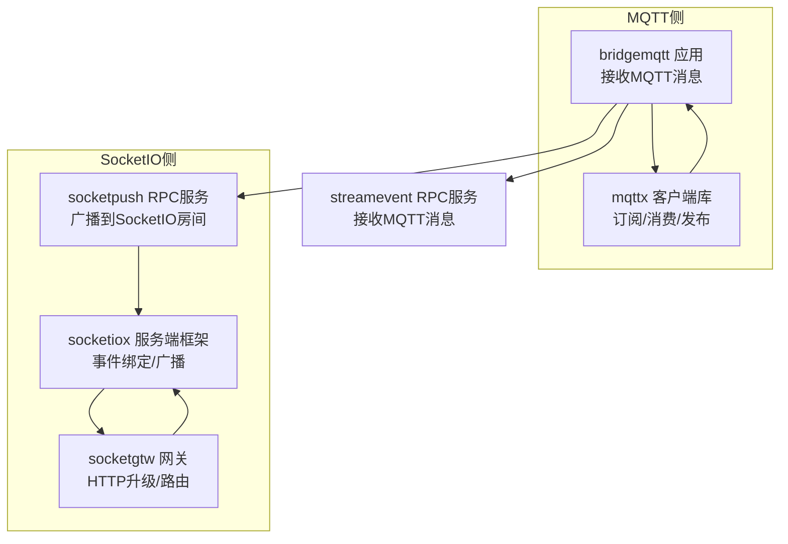
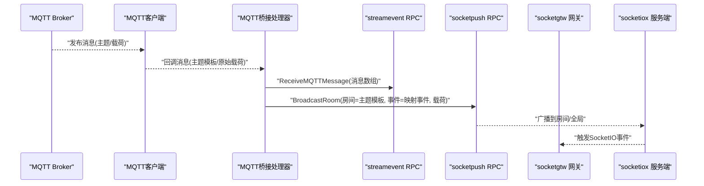
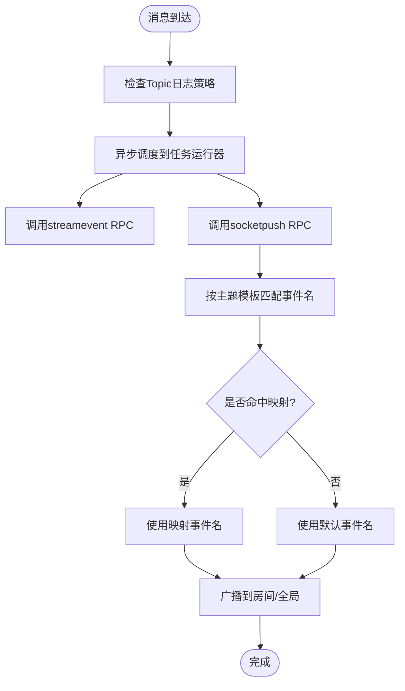
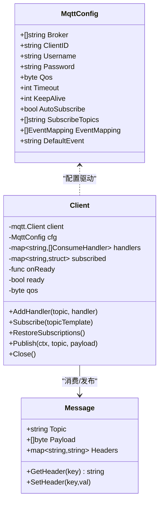
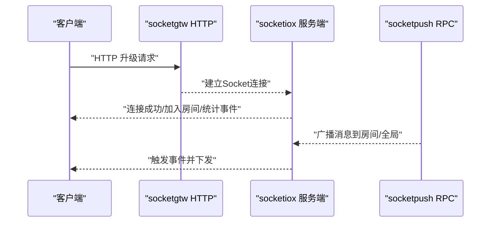
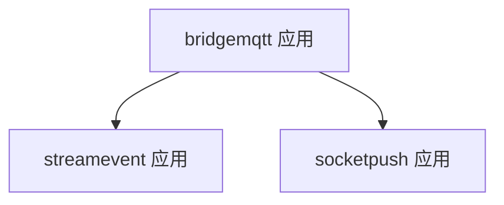
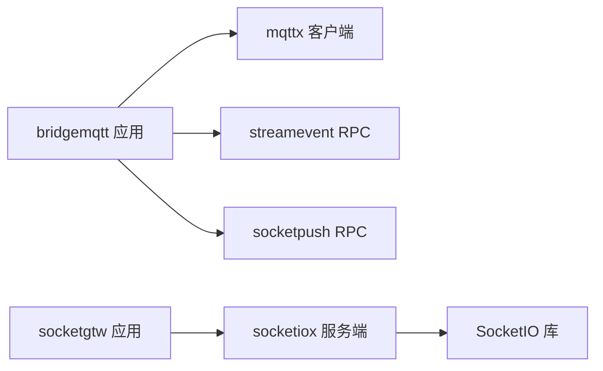

# SocketIO与MQTT桥接

<cite>
**本文引用的文件**
- [bridgemqtt.go](file://app/bridgemqtt/bridgemqtt.go)
- [bridgemqtt.yaml](file://app/bridgemqtt/etc/bridgemqtt.yaml)
- [config.go](file://app/bridgemqtt/internal/config/config.go)
- [publishlogic.go](file://app/bridgemqtt/internal/logic/publishlogic.go)
- [mqttstreamhandler.go](file://app/bridgemqtt/internal/handler/mqttstreamhandler.go)
- [mqttx.go](file://common/mqttx/mqttx.go)
- [message.go](file://common/mqttx/message.go)
- [socketpush.go](file://socketapp/socketpush/socketpush.go)
- [socketgtw.go](file://socketapp/socketgtw/socketgtw.go)
- [server.go](file://common/socketiox/server.go)
- [streamevent.go](file://facade/streamevent/streamevent.go)
</cite>

## 目录
1. [简介](#简介)
2. [项目结构](#项目结构)
3. [核心组件](#核心组件)
4. [架构总览](#架构总览)
5. [详细组件分析](#详细组件分析)
6. [依赖关系分析](#依赖关系分析)
7. [性能考量](#性能考量)
8. [故障排查指南](#故障排查指南)
9. [结论](#结论)
10. [附录：配置与使用示例](#附录配置与使用示例)

## 简介
本文件面向Zero-Service中的SocketIO与MQTT桥接能力，系统性阐述桥接机制、协议转换、消息映射与事件映射的实现方式，并给出Topic映射、消息转换与事件映射的配置模式与实践建议。同时提供桥接服务的配置示例与典型使用场景（设备数据转发、告警消息推送、状态同步），并总结性能优化与故障排查方法。

## 项目结构
围绕SocketIO与MQTT桥接的关键模块分布如下：
- MQTT侧：app/bridgemqtt 提供MQTT客户端封装、消息消费与桥接逻辑；common/mqttx 提供通用MQTT客户端与消息模型。
- SocketIO侧：socketapp/socketgtw 提供SocketIO网关与HTTP升级中间件；common/socketiox 提供SocketIO服务端框架与事件模型；socketapp/socketpush 提供Socket推送RPC服务。
- 事件桥接：facade/streamevent 提供流式事件RPC服务，用于MQTT消息上送至流式事件通道。

**图表来源**
- [bridgemqtt.go:28-71](file://app/bridgemqtt/bridgemqtt.go#L28-L71)
- [mqttx.go:99-178](file://common/mqttx/mqttx.go#L99-L178)
- [mqttstreamhandler.go:99-119](file://app/bridgemqtt/internal/handler/mqttstreamhandler.go#L99-L119)
- [socketgtw.go:30-91](file://socketapp/socketgtw/socketgtw.go#L30-L91)
- [server.go:314-335](file://common/socketiox/server.go#L314-L335)
- [socketpush.go:27-70](file://socketapp/socketpush/socketpush.go#L27-L70)
- [streamevent.go:28-71](file://facade/streamevent/streamevent.go#L28-L71)

**章节来源**
- [bridgemqtt.go:28-71](file://app/bridgemqtt/bridgemqtt.go#L28-L71)
- [socketgtw.go:30-91](file://socketapp/socketgtw/socketgtw.go#L30-L91)
- [socketpush.go:27-70](file://socketapp/socketpush/socketpush.go#L27-L70)
- [streamevent.go:28-71](file://facade/streamevent/streamevent.go#L28-L71)

## 核心组件
- MQTT客户端与消息模型
  - 通过通用MQTT客户端封装订阅、消费与发布，支持自动重连、订阅恢复、QoS控制与链路追踪。
  - 支持事件映射配置，将主题模板映射为事件名，便于下游按事件分发。
- MQTT桥接处理器
  - 接收MQTT消息后，异步推送到流式事件RPC与Socket推送RPC，实现MQTT到SocketIO的桥接。
  - 提供Topic日志管理，支持按Topic开关日志与最小日志间隔控制。
- SocketIO网关与服务端
  - 提供HTTP升级中间件以兼容Socket.IO握手；内置事件绑定、房间管理、全局广播与统计事件。
  - 通过Socket推送RPC服务将消息广播到指定房间或全局。
- 配置与启动
  - bridgemqtt应用加载配置并启动gRPC服务；socketgtw应用同时启动gRPC与HTTP服务；socketpush与streamevent分别提供RPC服务。

**章节来源**
- [mqttx.go:51-64](file://common/mqttx/mqttx.go#L51-L64)
- [mqttx.go:180-202](file://common/mqttx/mqttx.go#L180-L202)
- [mqttx.go:258-307](file://common/mqttx/mqttx.go#L258-L307)
- [mqttstreamhandler.go:99-119](file://app/bridgemqtt/internal/handler/mqttstreamhandler.go#L99-L119)
- [mqttstreamhandler.go:130-188](file://app/bridgemqtt/internal/handler/mqttstreamhandler.go#L130-L188)
- [server.go:314-335](file://common/socketiox/server.go#L314-L335)
- [server.go:469-531](file://common/socketiox/server.go#L469-L531)
- [socketgtw.go:48-61](file://socketapp/socketgtw/socketgtw.go#L48-L61)
- [bridgemqtt.go:28-71](file://app/bridgemqtt/bridgemqtt.go#L28-L71)

## 架构总览
桥接流程概览：
- MQTT客户端订阅配置的主题集合，收到消息后进入桥接处理器。
- 桥接处理器根据事件映射将主题模板转换为事件名，并异步推送至：
  - 流式事件RPC服务（用于上送与持久化）。
  - Socket推送RPC服务（用于广播到SocketIO房间）。
- SocketIO网关与服务端负责建立连接、房间管理与事件广播。

**图表来源**
- [mqttx.go:258-307](file://common/mqttx/mqttx.go#L258-L307)
- [mqttstreamhandler.go:130-188](file://app/bridgemqtt/internal/handler/mqttstreamhandler.go#L130-L188)
- [server.go:678-700](file://common/socketiox/server.go#L678-L700)

**章节来源**
- [mqttx.go:258-307](file://common/mqttx/mqttx.go#L258-L307)
- [mqttstreamhandler.go:130-188](file://app/bridgemqtt/internal/handler/mqttstreamhandler.go#L130-L188)
- [server.go:678-700](file://common/socketiox/server.go#L678-L700)

## 详细组件分析

### 组件A：MQTT桥接处理器（事件映射与消息分发）
- 功能要点
  - 将主题模板与事件进行精确匹配，若未命中则回退到默认事件。
  - 异步调度至任务运行器，分别调用流式事件RPC与Socket推送RPC。
  - 基于Topic日志管理器控制日志频率与是否打印载荷，避免高频日志冲击。
- 事件映射
  - 通过配置中的事件映射表，将特定主题模板映射为事件名；默认事件由配置提供。
- 并发与可靠性
  - 使用固定并发的任务运行器，保证高吞吐下的有序与可控。
  - 对RPC调用记录耗时与结果，便于可观测性与排障。

**图表来源**
- [mqttstreamhandler.go:121-128](file://app/bridgemqtt/internal/handler/mqttstreamhandler.go#L121-L128)
- [mqttstreamhandler.go:166-186](file://app/bridgemqtt/internal/handler/mqttstreamhandler.go#L166-L186)

**章节来源**
- [mqttstreamhandler.go:99-119](file://app/bridgemqtt/internal/handler/mqttstreamhandler.go#L99-L119)
- [mqttstreamhandler.go:121-128](file://app/bridgemqtt/internal/handler/mqttstreamhandler.go#L121-L128)
- [mqttstreamhandler.go:130-188](file://app/bridgemqtt/internal/handler/mqttstreamhandler.go#L130-L188)

### 组件B：MQTT客户端与消息模型
- 配置与初始化
  - 支持多Broker地址、用户名密码认证、QoS、心跳、超时等；自动分配ClientID与默认QoS校正。
  - 连接成功后恢复订阅，断线自动重连并清空已订阅状态以便重建。
- 订阅与消费
  - 支持手动订阅与自动订阅；消息到达后统一通过包装器提取载荷与链路上下文，调用所有绑定处理器。
  - 若无处理器，触发默认处理器记录错误并打点。
- 发布与追踪
  - 发布消息带超时与链路追踪，记录发布Span属性，便于端到端观测。

**图表来源**
- [mqttx.go:51-64](file://common/mqttx/mqttx.go#L51-L64)
- [mqttx.go:76-87](file://common/mqttx/mqttx.go#L76-L87)
- [mqttx.go:258-307](file://common/mqttx/mqttx.go#L258-L307)
- [message.go:3-7](file://common/mqttx/message.go#L3-L7)

**章节来源**
- [mqttx.go:99-178](file://common/mqttx/mqttx.go#L99-L178)
- [mqttx.go:204-255](file://common/mqttx/mqttx.go#L204-L255)
- [mqttx.go:258-307](file://common/mqttx/mqttx.go#L258-L307)
- [mqttx.go:310-333](file://common/mqttx/mqttx.go#L310-L333)
- [message.go:3-7](file://common/mqttx/message.go#L3-L7)

### 组件C：SocketIO网关与服务端
- 网关
  - 同时启动gRPC与HTTP服务；对Socket.IO升级路径设置必要的头部兼容。
- 服务端
  - 内置认证钩子、连接/断开钩子、房间加入/离开钩子与统计事件循环。
  - 支持自定义事件处理函数，统一将上行事件转为下行响应或广播。

**图表来源**
- [socketgtw.go:48-61](file://socketapp/socketgtw/socketgtw.go#L48-L61)
- [server.go:337-335](file://common/socketiox/server.go#L337-L335)
- [server.go:469-531](file://common/socketiox/server.go#L469-L531)

**章节来源**
- [socketgtw.go:30-91](file://socketapp/socketgtw/socketgtw.go#L30-L91)
- [server.go:337-335](file://common/socketiox/server.go#L337-L335)
- [server.go:469-531](file://common/socketiox/server.go#L469-L531)

### 组件D：RPC服务与桥接入口
- bridgemqtt应用
  - 加载配置、启动gRPC服务、注册服务、可选Nacos注册与拦截器。
- streamevent与socketpush应用
  - 分别提供流式事件与Socket推送的RPC服务，被桥接处理器调用。

**图表来源**
- [bridgemqtt.go:28-71](file://app/bridgemqtt/bridgemqtt.go#L28-L71)
- [streamevent.go:28-71](file://facade/streamevent/streamevent.go#L28-L71)
- [socketpush.go:27-70](file://socketapp/socketpush/socketpush.go#L27-L70)

**章节来源**
- [bridgemqtt.go:28-71](file://app/bridgemqtt/bridgemqtt.go#L28-L71)
- [streamevent.go:28-71](file://facade/streamevent/streamevent.go#L28-L71)
- [socketpush.go:27-70](file://socketapp/socketpush/socketpush.go#L27-L70)

## 依赖关系分析
- 组件耦合
  - bridgemqtt桥接处理器依赖mqttx客户端与RPC客户端（streamevent、socketpush）。
  - socketgtw依赖socketiox服务端框架；socketiox服务端依赖SocketIO库。
- 外部依赖
  - MQTT客户端基于第三方库；RPC基于go-zero；SocketIO基于第三方库。
- 配置耦合
  - bridgemqtt.yaml中包含MQTT Broker、认证、订阅主题、事件映射、RPC目标等关键配置。

**图表来源**
- [bridgemqtt.go:37-45](file://app/bridgemqtt/bridgemqtt.go#L37-L45)
- [mqttx.go:99-178](file://common/mqttx/mqttx.go#L99-L178)
- [socketgtw.go:30-46](file://socketapp/socketgtw/socketgtw.go#L30-L46)
- [server.go:314-335](file://common/socketiox/server.go#L314-L335)

**章节来源**
- [bridgemqtt.go:37-45](file://app/bridgemqtt/bridgemqtt.go#L37-L45)
- [socketgtw.go:30-46](file://socketapp/socketgtw/socketgtw.go#L30-L46)

## 性能考量
- 日志节流
  - Topic日志管理器通过原子标志与最小日志间隔控制，避免高频日志导致性能抖动。
- 异步分发
  - 桥接处理器使用固定并发的任务运行器，将RPC调用异步化，提升吞吐。
- 订阅与重连
  - 连接成功后恢复订阅，断线自动重连并清理订阅状态，减少重复订阅与丢失消息风险。
- QoS与超时
  - 合理设置QoS与操作超时，平衡可靠性与延迟；默认QoS校正避免非法值影响稳定性。

**章节来源**
- [mqttstreamhandler.go:19-97](file://app/bridgemqtt/internal/handler/mqttstreamhandler.go#L19-L97)
- [mqttx.go:148-168](file://common/mqttx/mqttx.go#L148-L168)
- [mqttx.go:236-255](file://common/mqttx/mqttx.go#L236-L255)

## 故障排查指南
- MQTT连接问题
  - 检查Broker地址、认证信息与网络连通性；关注连接超时与自动重连日志。
  - 查看订阅恢复失败与订阅超时错误，确认主题权限与Broker状态。
- 消费无处理
  - 若出现“无处理器”错误，确认是否正确添加处理器或启用自动订阅；检查主题模板是否与订阅一致。
- RPC调用异常
  - 关注streamevent与socketpush RPC调用耗时与返回状态，定位下游服务可用性与负载情况。
- SocketIO广播问题
  - 检查房间加入/离开流程与事件名称合法性；确认事件名未被禁止（如下行保留事件名）。
- 日志与可观测性
  - 启用Topic日志并合理设置最小日志间隔；结合链路追踪Span属性定位MQTT动作与QoS。

**章节来源**
- [mqttx.go:148-168](file://common/mqttx/mqttx.go#L148-L168)
- [mqttx.go:293-299](file://common/mqttx/mqttx.go#L293-L299)
- [mqttstreamhandler.go:157-164](file://app/bridgemqtt/internal/handler/mqttstreamhandler.go#L157-L164)
- [server.go:680-687](file://common/socketiox/server.go#L680-L687)

## 结论
该桥接方案通过MQTT客户端与SocketIO服务端的协同，实现了从MQTT到SocketIO的可靠桥接。借助事件映射、异步分发与日志节流等机制，在保证性能的同时提供了良好的可观测性与扩展性。实际部署中应重点关注MQTT订阅一致性、RPC下游健康度与SocketIO房间/事件命名规范。

## 附录：配置与使用示例

### 配置项说明（bridgemqtt.yaml）
- 基础RPC服务配置
  - Name、ListenOn、Timeout、Mode、Log等。
- Nacos注册配置
  - IsRegister、Host、Port、Username、PassWord、NamespaceId、ServiceName。
- MQTT配置
  - Broker、ClientId、Username、Password、Qos、Timeout、KeepAlive、AutoSubscribe、SubscribeTopics、EventMapping、DefaultEvent。
- 流式事件RPC客户端配置
  - Endpoints、NonBlock、Timeout。
- Socket推送RPC客户端配置
  - Endpoints、NonBlock、Timeout。

**章节来源**
- [bridgemqtt.yaml:1-48](file://app/bridgemqtt/etc/bridgemqtt.yaml#L1-L48)
- [config.go:9-23](file://app/bridgemqtt/internal/config/config.go#L9-L23)

### Topic映射与事件映射配置
- 单向映射
  - 在MQTT配置中为特定主题模板设置事件映射，使该主题的消息以指定事件名广播。
- 双向映射
  - 通过SocketIO事件上行与MQTT发布配合，实现双向通信；注意事件名与房间命名规范。
- 条件映射
  - 基于主题模板与消息内容进行条件判断，动态选择事件名或房间；可在桥接处理器中扩展。

**章节来源**
- [mqttx.go:45-49](file://common/mqttx/mqttx.go#L45-L49)
- [mqttstreamhandler.go:121-128](file://app/bridgemqtt/internal/handler/mqttstreamhandler.go#L121-L128)

### 消息转换与过滤
- 数据格式转换
  - MQTT消息可封装为统一消息体，提取内部载荷后再分发；支持透传原始载荷或结构化载荷。
- 字段映射
  - 在桥接处理器中可增加字段抽取与重写逻辑，实现跨协议字段映射。
- 消息过滤
  - 基于主题模板或内容进行过滤，避免无关消息进入下游。

**章节来源**
- [mqttx.go:258-269](file://common/mqttx/mqttx.go#L258-L269)
- [message.go:3-7](file://common/mqttx/message.go#L3-L7)

### 事件映射配置
- 事件名称映射
  - 通过EventMapping将主题模板映射为事件名，默认事件由配置提供。
- 事件参数转换
  - 在SocketIO侧可对事件参数进行序列化/反序列化处理，确保兼容性。
- 触发条件
  - 基于主题模板与业务规则决定事件触发时机与目标房间。

**章节来源**
- [mqttx.go:45-49](file://common/mqttx/mqttx.go#L45-L49)
- [mqttstreamhandler.go:121-128](file://app/bridgemqtt/internal/handler/mqttstreamhandler.go#L121-L128)
- [server.go:678-700](file://common/socketiox/server.go#L678-L700)

### 典型使用场景
- 设备数据转发
  - MQTT订阅设备上报主题，桥接后广播到SocketIO房间，前端实时展示。
- 告警消息推送
  - 将MQTT告警主题映射为特定事件名，通过socketpush广播到告警房间。
- 状态同步
  - 将设备状态变更消息映射为状态事件，推送到SocketIO全局或房间，保持多端一致。

**章节来源**
- [mqttstreamhandler.go:166-186](file://app/bridgemqtt/internal/handler/mqttstreamhandler.go#L166-L186)
- [server.go:678-700](file://common/socketiox/server.go#L678-L700)

### 配置示例与启动
- bridgemqtt应用
  - 加载etc/bridgemqtt.yaml，启动gRPC服务，可选注册到Nacos。
- streamevent与socketpush应用
  - 分别启动RPC服务，供bridgemqtt调用。
- socketgtw应用
  - 启动gRPC与HTTP服务，提供Socket.IO升级与事件处理。

**章节来源**
- [bridgemqtt.go:28-71](file://app/bridgemqtt/bridgemqtt.go#L28-L71)
- [streamevent.go:28-71](file://facade/streamevent/streamevent.go#L28-L71)
- [socketpush.go:27-70](file://socketapp/socketpush/socketpush.go#L27-L70)
- [socketgtw.go:30-91](file://socketapp/socketgtw/socketgtw.go#L30-L91)