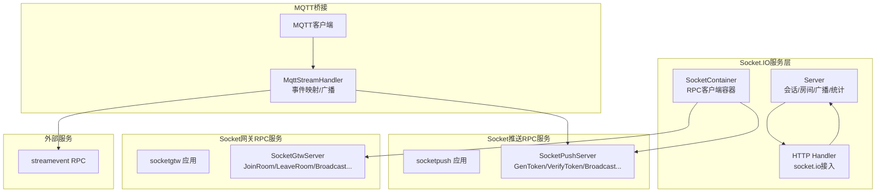
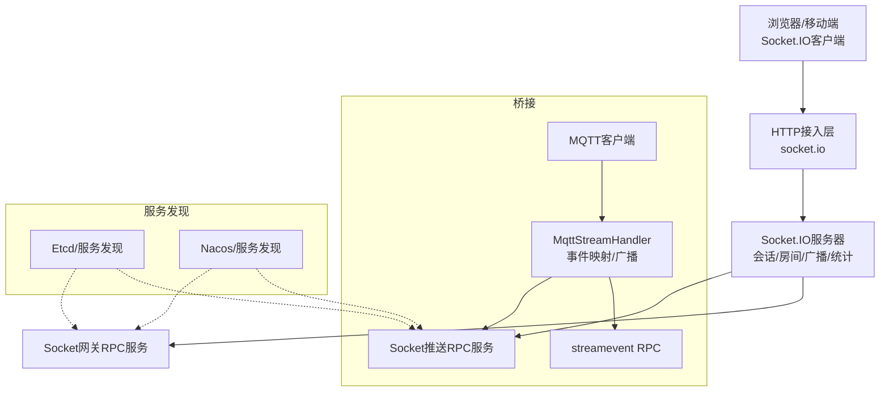
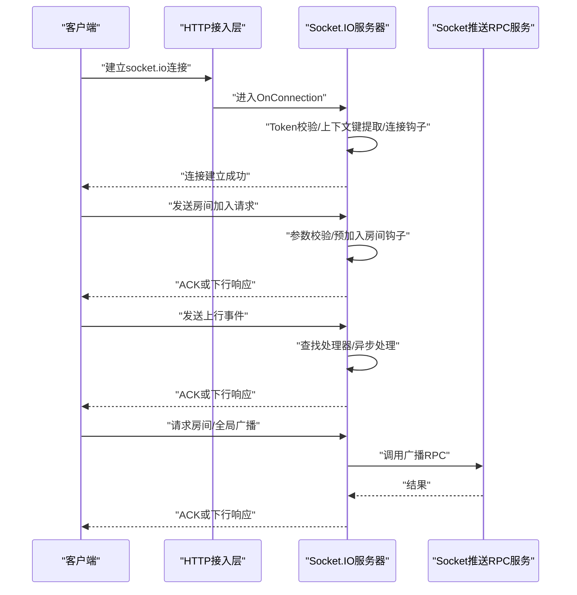
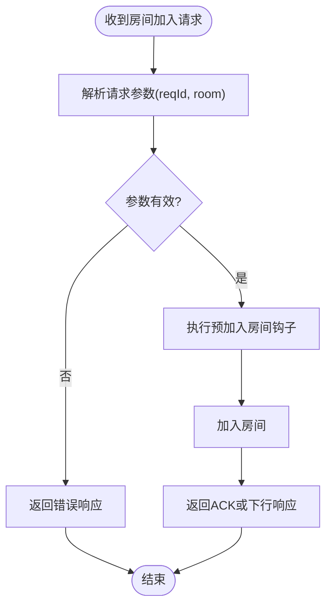
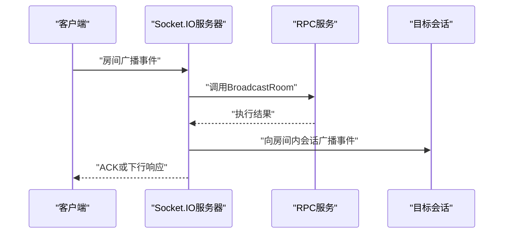
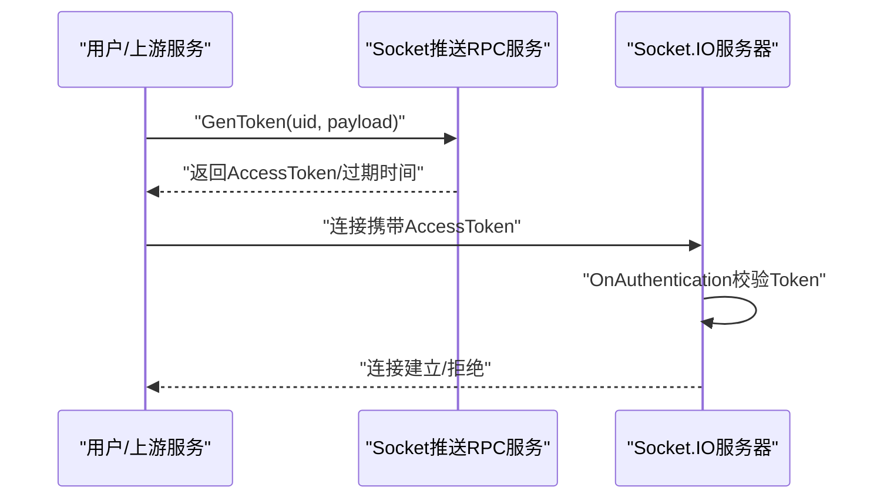
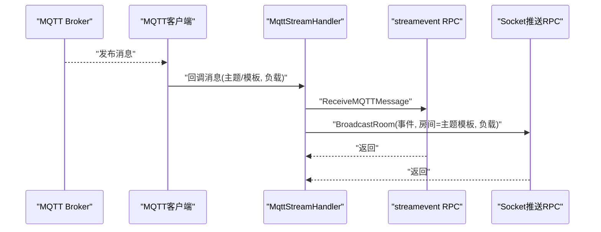
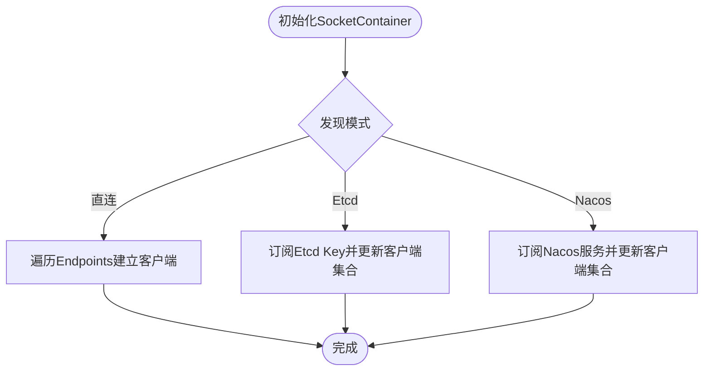
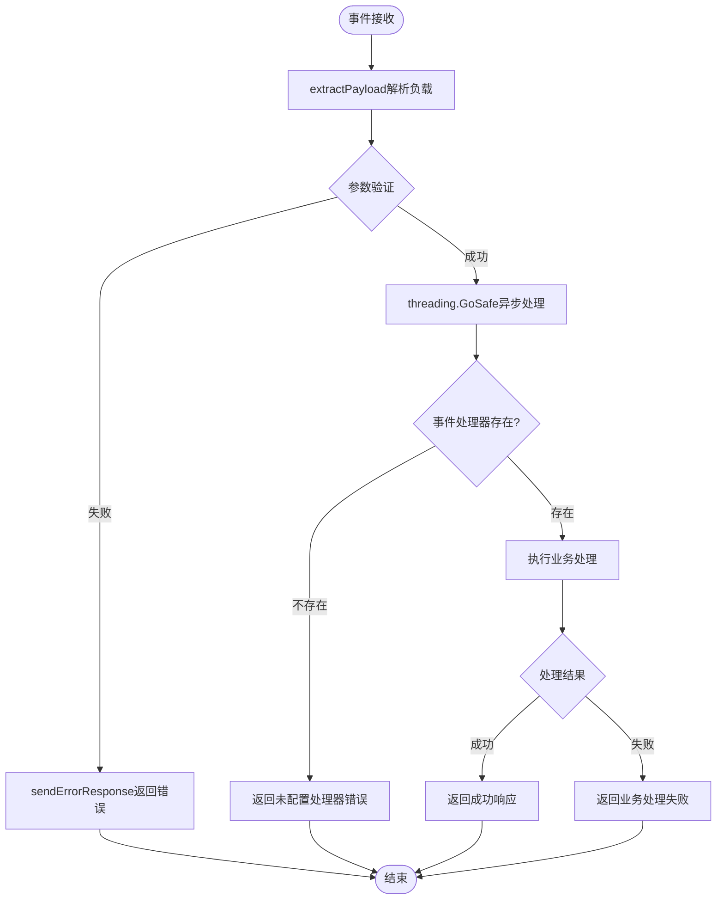
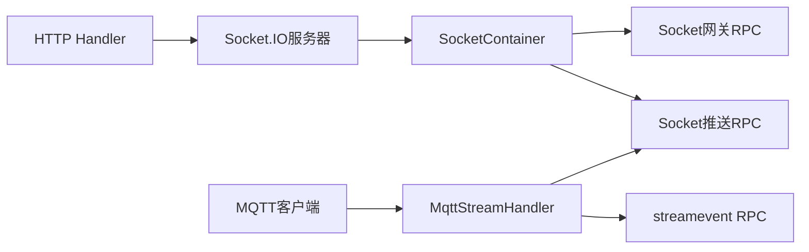

# SocketIO实时通信

<cite>
**本文档引用的文件**
- [common/socketiox/server.go](file://common/socketiox/server.go)
- [common/socketiox/handler.go](file://common/socketiox/handler.go)
- [common/socketiox/container.go](file://common/socketiox/container.go)
- [socketapp/socketgtw/socketgtw.go](file://socketapp/socketgtw/socketgtw.go)
- [socketapp/socketgtw/etc/socketgtw.yaml](file://socketapp/socketgtw/etc/socketgtw.yaml)
- [socketapp/socketgtw/internal/server/socketgtwserver.go](file://socketapp/socketgtw/internal/server/socketgtwserver.go)
- [socketapp/socketpush/socketpush.go](file://socketapp/socketpush/socketpush.go)
- [socketapp/socketpush/etc/socketpush.yaml](file://socketapp/socketpush/etc/socketpush.yaml)
- [socketapp/socketpush/internal/server/socketpushserver.go](file://socketapp/socketpush/internal/server/socketpushserver.go)
- [socketapp/socketpush/internal/logic/gentokenlogic.go](file://socketapp/socketpush/internal/logic/gentokenlogic.go)
- [socketapp/socketpush/internal/logic/verifytokenlogic.go](file://socketapp/socketpush/internal/logic/verifytokenlogic.go)
- [app/bridgemqtt/etc/bridgemqtt.yaml](file://app/bridgemqtt/etc/bridgemqtt.yaml)
- [app/bridgemqtt/internal/handler/mqttstreamhandler.go](file://app/bridgemqtt/internal/handler/mqttstreamhandler.go)
- [common/mqttx/mqttx.go](file://common/mqttx/mqttx.go)
- [facade/streamevent/etc/streamevent.yaml](file://facade/streamevent/etc/streamevent.yaml)
- [common/socketiox/test-socketio.html](file://common/socketiox/test-socketio.html)
- [socketapp/socketgtw/internal/sockethandler/sockertuphandler.go](file://socketapp/socketgtw/internal/sockethandler/sockertuphandler.go)
</cite>

## 更新摘要
**所做更改**
- 增强了SocketIO中间件处理机制的错误处理和状态管理
- 完善了事件处理的参数验证和错误响应机制
- 加强了连接钩子和房间管理的状态跟踪
- 优化了异步处理的安全性和错误恢复机制

## 目录
1. [简介](#简介)
2. [项目结构](#项目结构)
3. [核心组件](#核心组件)
4. [架构总览](#架构总览)
5. [详细组件分析](#详细组件分析)
6. [中间件处理机制增强](#中间件处理机制增强)
7. [依赖分析](#依赖分析)
8. [性能考虑](#性能考虑)
9. [故障排查指南](#故障排查指南)
10. [结论](#结论)
11. [附录](#附录)

## 简介
本文件面向Zero-Service项目中基于Socket.IO的实时通信能力，系统性阐述Socket.IO在实时消息推送中的应用，覆盖连接管理、房间机制、消息路由、广播策略、鉴权机制、与MQTT桥接、监控指标与故障排查等内容，并提供客户端集成与最佳实践建议。文档以代码为依据，结合架构图与流程图，帮助读者快速理解并高效落地。

**更新** 本次更新重点增强了SocketIO中间件处理机制，提供了更完善的错误处理和状态管理能力。

## 项目结构
围绕Socket.IO的实现，项目由以下层次构成：
- 通用Socket.IO服务层：提供Socket.IO服务器、会话管理、房间管理、广播、统计上报、鉴权钩子等能力。
- Socket网关RPC服务：对外暴露房间加入/离开、全局/房间广播、踢人、按元数据广播等RPC接口。
- Socket推送RPC服务：提供Token生成/校验、房间/全局广播、按会话/元数据广播等能力。
- MQTT桥接模块：将MQTT消息转换为Socket.IO事件并进行广播或转发至流事件服务。
- 测试与示例：提供Socket.IO测试页面，便于本地联调。

**图表来源**
- [common/socketiox/server.go:299-335](file://common/socketiox/server.go#L299-L335)
- [common/socketiox/handler.go:19-41](file://common/socketiox/handler.go#L19-L41)
- [common/socketiox/container.go:30-61](file://common/socketiox/container.go#L30-L61)
- [socketapp/socketgtw/socketgtw.go:40-62](file://socketapp/socketgtw/socketgtw.go#L40-L62)
- [socketapp/socketgtw/internal/server/socketgtwserver.go:15-91](file://socketapp/socketgtw/internal/server/socketgtwserver.go#L15-L91)
- [socketapp/socketpush/socketpush.go:37-43](file://socketapp/socketpush/socketpush.go#L37-L43)
- [socketapp/socketpush/internal/server/socketpushserver.go:15-103](file://socketapp/socketpush/internal/server/socketpushserver.go#L15-L103)
- [app/bridgemqtt/internal/handler/mqttstreamhandler.go:99-129](file://app/bridgemqtt/internal/handler/mqttstreamhandler.go#L99-L129)
- [common/mqttx/mqttx.go:98-178](file://common/mqttx/mqttx.go#L98-L178)

**章节来源**
- [common/socketiox/server.go:1-814](file://common/socketiox/server.go#L1-L814)
- [common/socketiox/handler.go:1-41](file://common/socketiox/handler.go#L1-L41)
- [common/socketiox/container.go:1-426](file://common/socketiox/container.go#L1-L426)
- [socketapp/socketgtw/socketgtw.go:1-91](file://socketapp/socketgtw/socketgtw.go#L1-L91)
- [socketapp/socketgtw/etc/socketgtw.yaml:1-37](file://socketapp/socketgtw/etc/socketgtw.yaml#L1-L37)
- [socketapp/socketgtw/internal/server/socketgtwserver.go:1-91](file://socketapp/socketgtw/internal/server/socketgtwserver.go#L1-L91)
- [socketapp/socketpush/socketpush.go:1-70](file://socketapp/socketpush/socketpush.go#L1-L70)
- [socketapp/socketpush/etc/socketpush.yaml:1-28](file://socketapp/socketpush/etc/socketpush.yaml#L1-L28)
- [socketapp/socketpush/internal/server/socketpushserver.go:1-103](file://socketapp/socketpush/internal/server/socketpushserver.go#L1-L103)
- [app/bridgemqtt/etc/bridgemqtt.yaml:1-48](file://app/bridgemqtt/etc/bridgemqtt.yaml#L1-L48)
- [app/bridgemqtt/internal/handler/mqttstreamhandler.go:1-254](file://app/bridgemqtt/internal/handler/mqttstreamhandler.go#L1-L254)
- [common/mqttx/mqttx.go:1-389](file://common/mqttx/mqttx.go#L1-L389)
- [facade/streamevent/etc/streamevent.yaml:1-28](file://facade/streamevent/etc/streamevent.yaml#L1-L28)

## 核心组件
- Socket.IO服务器与会话管理
  - 提供连接认证、事件绑定、房间加入/离开、全局/房间广播、会话统计、断开钩子等能力。
  - 支持通过选项注入Token校验器、上下文键提取、连接/断开/预加入房间钩子等扩展点。
- Socket网关RPC服务
  - 对外提供JoinRoom、LeaveRoom、BroadcastRoom、BroadcastGlobal、按会话/元数据广播、踢人等RPC接口。
- Socket推送RPC服务
  - 提供GenToken、VerifyToken、房间/全局广播、按会话/元数据广播、统计查询等能力。
- MQTT桥接
  - 将MQTT消息转换为Socket.IO事件并广播；同时可转发至流事件服务；支持Topic到事件映射与默认事件。
- SocketContainer
  - 统一管理RPC客户端连接，支持直连、Etcd订阅、Nacos订阅三种发现方式，具备动态增删与健康实例筛选能力。

**章节来源**
- [common/socketiox/server.go:119-232](file://common/socketiox/server.go#L119-L232)
- [socketapp/socketgtw/internal/server/socketgtwserver.go:26-90](file://socketapp/socketgtw/internal/server/socketgtwserver.go#L26-L90)
- [socketapp/socketpush/internal/server/socketpushserver.go:26-102](file://socketapp/socketpush/internal/server/socketpushserver.go#L26-L102)
- [app/bridgemqtt/internal/handler/mqttstreamhandler.go:99-188](file://app/bridgemqtt/internal/handler/mqttstreamhandler.go#L99-L188)
- [common/socketiox/container.go:30-61](file://common/socketiox/container.go#L30-L61)

## 架构总览
下图展示Socket.IO在Zero-Service中的整体架构：HTTP层接入socket.io，Socket.IO服务器负责会话与房间管理；RPC层提供广播与会话管理能力；MQTT桥接模块将MQTT消息转换为Socket事件并广播。

**图表来源**
- [common/socketiox/handler.go:19-41](file://common/socketiox/handler.go#L19-L41)
- [common/socketiox/server.go:337-676](file://common/socketiox/server.go#L337-L676)
- [socketapp/socketgtw/socketgtw.go:48-62](file://socketapp/socketgtw/socketgtw.go#L48-L62)
- [socketapp/socketpush/socketpush.go:37-43](file://socketapp/socketpush/socketpush.go#L37-L43)
- [app/bridgemqtt/internal/handler/mqttstreamhandler.go:99-188](file://app/bridgemqtt/internal/handler/mqttstreamhandler.go#L99-L188)
- [common/socketiox/container.go:83-130](file://common/socketiox/container.go#L83-L130)

## 详细组件分析

### Socket.IO服务器与事件处理
- 事件常量与响应结构
  - 定义了连接、断开、上行、房间加入/离开、房间/全局广播、下行、状态下行等事件名与响应结构。
- 会话管理
  - Session封装底层socket，提供元数据设置/读取、加入/离开房间、事件下行、应答下行等能力。
- 事件绑定与处理
  - OnConnection中完成会话建立、Token校验、上下文键提取、连接钩子、房间加载。
  - 订阅房间加入/离开、上行、房间广播、全局广播等事件，分别进行参数校验、异步处理与ACK或下行响应。
- 广播与统计
  - BroadcastRoom/BroadcastGlobal对事件名与不允许事件进行约束，周期性向每个会话下发统计信息。

**图表来源**
- [common/socketiox/server.go:337-676](file://common/socketiox/server.go#L337-L676)
- [socketapp/socketpush/internal/server/socketpushserver.go:26-60](file://socketapp/socketpush/internal/server/socketpushserver.go#L26-L60)

**章节来源**
- [common/socketiox/server.go:20-83](file://common/socketiox/server.go#L20-L83)
- [common/socketiox/server.go:119-232](file://common/socketiox/server.go#L119-L232)
- [common/socketiox/server.go:337-676](file://common/socketiox/server.go#L337-L676)
- [common/socketiox/server.go:678-700](file://common/socketiox/server.go#L678-L700)
- [common/socketiox/server.go:702-740](file://common/socketiox/server.go#L702-L740)

### 房间机制与消息路由
- 房间加入/离开
  - 客户端通过房间加入/离开事件提交请求，服务器进行参数校验、预加入钩子、实际加入/离开操作，并返回ACK或下行响应。
- 消息路由
  - 上行事件由服务器根据事件名查找处理器，异步执行并返回结果；房间/全局广播事件由服务器直接调用广播方法。
- 元数据与按元数据广播
  - 服务器支持在会话中设置元数据键值，便于按用户ID、设备ID等维度进行广播与踢人。

**图表来源**
- [common/socketiox/server.go:392-435](file://common/socketiox/server.go#L392-L435)

**章节来源**
- [common/socketiox/server.go:204-232](file://common/socketiox/server.go#L204-L232)
- [common/socketiox/server.go:392-468](file://common/socketiox/server.go#L392-L468)

### 广播策略
- 房间广播
  - 客户端发送房间广播事件，服务器校验参数后调用BroadcastRoom，向指定房间内所有会话广播事件。
- 全局广播
  - 客户端发送全局广播事件，服务器校验参数后调用BroadcastGlobal，向所有在线会话广播事件。
- RPC侧广播
  - Socket网关与Socket推送RPC服务均提供BroadcastRoom/BroadcastGlobal接口，便于上游服务触发广播。

**图表来源**
- [common/socketiox/server.go:678-688](file://common/socketiox/server.go#L678-L688)
- [socketapp/socketgtw/internal/server/socketgtwserver.go:38-48](file://socketapp/socketgtw/internal/server/socketgtwserver.go#L38-L48)
- [socketapp/socketpush/internal/server/socketpushserver.go:50-58](file://socketapp/socketpush/internal/server/socketpushserver.go#L50-L58)

**章节来源**
- [common/socketiox/server.go:678-700](file://common/socketiox/server.go#L678-L700)
- [socketapp/socketgtw/internal/server/socketgtwserver.go:38-48](file://socketapp/socketgtw/internal/server/socketgtwserver.go#L38-L48)
- [socketapp/socketpush/internal/server/socketpushserver.go:50-58](file://socketapp/socketpush/internal/server/socketpushserver.go#L50-L58)

### 鉴权机制
- Token生成
  - Socket推送RPC服务提供GenToken接口，支持自定义负载，生成包含过期时间与刷新时间的JWT。
- Token验证
  - Socket推送RPC服务提供VerifyToken接口，支持多密钥校验（当前密钥与历史密钥），返回解码后的声明。
- 连接鉴权
  - Socket.IO服务器在握手阶段通过OnAuthentication进行Token校验；若提供带声明的校验器，可将声明中的指定键写入会话元数据，用于后续房间加载与权限控制。

**图表来源**
- [socketapp/socketpush/internal/logic/gentokenlogic.go:29-45](file://socketapp/socketpush/internal/logic/gentokenlogic.go#L29-L45)
- [socketapp/socketpush/internal/logic/verifytokenlogic.go:28-49](file://socketapp/socketpush/internal/logic/verifytokenlogic.go#L28-L49)
- [common/socketiox/server.go:337-349](file://common/socketiox/server.go#L337-L349)

**章节来源**
- [socketapp/socketpush/etc/socketpush.yaml:10-13](file://socketapp/socketpush/etc/socketpush.yaml#L10-L13)
- [socketapp/socketpush/internal/logic/gentokenlogic.go:29-79](file://socketapp/socketpush/internal/logic/gentokenlogic.go#L29-L79)
- [socketapp/socketpush/internal/logic/verifytokenlogic.go:28-49](file://socketapp/socketpush/internal/logic/verifytokenlogic.go#L28-L49)
- [common/socketiox/server.go:337-379](file://common/socketiox/server.go#L337-L379)

### MQTT桥接机制
- 事件映射
  - MqttStreamHandler根据配置的EventMapping将MQTT主题模板匹配到事件名，未匹配则使用默认事件。
- 消息转换与广播
  - 收到MQTT消息后，先异步推送到streamevent RPC（用于流式事件记录），再异步调用Socket推送RPC的BroadcastRoom进行房间广播。
- MQTT客户端
  - 使用paho.mqtt.golang客户端，支持自动重连、心跳、订阅恢复、QoS、超时控制与OpenTelemetry追踪。

**图表来源**
- [app/bridgemqtt/internal/handler/mqttstreamhandler.go:130-188](file://app/bridgemqtt/internal/handler/mqttstreamhandler.go#L130-L188)
- [common/mqttx/mqttx.go:98-178](file://common/mqttx/mqttx.go#L98-L178)

**章节来源**
- [app/bridgemqtt/etc/bridgemqtt.yaml:30-48](file://app/bridgemqtt/etc/bridgemqtt.yaml#L30-L48)
- [app/bridgemqtt/internal/handler/mqttstreamhandler.go:99-188](file://app/bridgemqtt/internal/handler/mqttstreamhandler.go#L99-L188)
- [common/mqttx/mqttx.go:45-64](file://common/mqttx/mqttx.go#L45-L64)

### SocketContainer服务发现与连接池
- 支持三种发现方式
  - 直连：固定Endpoints列表。
  - Etcd：订阅Etcd Key，动态维护客户端集合。
  - Nacos：订阅Nacos服务，过滤健康且启用的gRPC实例，提取gRPC端口。
- 连接特性
  - 每个实例建立独立zrpc客户端，设置最大消息大小限制，统一注入元数据拦截器。
- 子集选择
  - 为避免实例过多导致内存压力，采用随机打散并限制子集大小。

**图表来源**
- [common/socketiox/container.go:35-61](file://common/socketiox/container.go#L35-L61)
- [common/socketiox/container.go:83-130](file://common/socketiox/container.go#L83-L130)
- [common/socketiox/container.go:156-242](file://common/socketiox/container.go#L156-L242)

**章节来源**
- [common/socketiox/container.go:30-61](file://common/socketiox/container.go#L30-L61)
- [common/socketiox/container.go:83-356](file://common/socketiox/container.go#L83-L356)

### 客户端集成与最佳实践
- 连接优化
  - 使用socket.io客户端时，确保正确传递Token；在HTTP层通过中间件将Connection头升级为Upgrade，保证WebSocket握手成功。
- 错误处理
  - 客户端监听下行事件，解析响应结构中的code/msg/reqId，区分ACK与下行事件；对网络异常与断线进行重连与退避。
- 性能调优
  - 合理设置心跳与超时；避免一次性发送过大消息；批量广播时优先使用房间广播减少冗余传输。
- 测试页面
  - 提供测试HTML页面，便于本地调试Socket.IO连接与事件交互。

**章节来源**
- [socketapp/socketgtw/socketgtw.go:48-62](file://socketapp/socketgtw/socketgtw.go#L48-L62)
- [common/socketiox/test-socketio.html:1-44](file://common/socketiox/test-socketio.html#L1-L44)

## 中间件处理机制增强

### 错误处理机制完善
**更新** SocketIO中间件处理机制已显著增强，提供了更完善的错误处理和状态管理能力：

- **参数验证增强**
  - 所有事件处理都增加了严格的参数验证，包括reqId、room、event、payload等字段的必填性检查
  - 使用extractPayload函数统一处理不同类型的负载数据，支持字符串和JSON对象的自动转换
  - 参数解析失败时立即返回标准化的错误响应

- **异步安全处理**
  - 所有事件处理都通过threading.GoSafe包装，确保异步任务的异常不会影响主线程
  - 异步处理中增加了完整的错误捕获和日志记录机制
  - 支持ACK回调和下行响应两种错误反馈方式

- **状态管理优化**
  - 连接钩子执行失败时，会将错误信息存储在session.roomLoadError中
  - 断开连接时自动清理会话状态，防止内存泄漏
  - 统一的会话状态跟踪和清理机制

**图表来源**
- [common/socketiox/server.go:392-435](file://common/socketiox/server.go#L392-L435)
- [common/socketiox/server.go:469-530](file://common/socketiox/server.go#L469-L530)
- [common/socketiox/server.go:532-618](file://common/socketiox/server.go#L532-L618)

### 钩子机制增强
**更新** 中间件处理机制增强了钩子执行的可靠性和状态跟踪：

- **连接钩子**
  - 在连接建立后执行，支持房间加载和权限初始化
  - 执行失败时记录错误状态，不影响连接建立
  - 支持批量房间加入操作

- **预加入房间钩子**
  - 在房间加入前执行，提供权限验证和业务规则检查
  - 钩子失败时直接返回错误，阻止房间加入操作
  - 支持异步钩子执行

- **断开连接钩子**
  - 在连接断开时执行，清理资源和状态
  - 区分正常断开和异常断开，记录断开原因
  - 支持异步清理操作

### 事件处理器增强
**更新** 事件处理器机制得到了全面增强：

- **统一的事件处理框架**
  - 支持自定义事件处理器注册
  - 提供标准化的事件处理接口
  - 支持事件负载的智能解析和序列化

- **SocketUpHandler实现**
  - 专门处理上行事件的处理器
  - 集成流事件服务，支持事件持久化
  - 提供统一的响应格式化

**章节来源**
- [common/socketiox/server.go:350-400](file://common/socketiox/server.go#L350-L400)
- [common/socketiox/server.go:415-434](file://common/socketiox/server.go#L415-L434)
- [common/socketiox/server.go:494-530](file://common/socketiox/server.go#L494-L530)
- [common/socketiox/server.go:643-674](file://common/socketiox/server.go#L643-L674)
- [socketapp/socketgtw/internal/sockethandler/sockertuphandler.go:23-44](file://socketapp/socketgtw/internal/sockethandler/sockertuphandler.go#L23-L44)

## 依赖分析
- 组件耦合
  - Socket.IO服务器与HTTP接入层松耦合，通过HandlerConfig注入Server。
  - SocketContainer统一管理RPC客户端，屏蔽服务发现差异。
- 外部依赖
  - MQTT桥接依赖paho.mqtt.golang与OpenTelemetry追踪。
  - 服务注册与发现依赖Etcd/Nacos。
- 可能的循环依赖
  - 当前文件组织避免了循环导入；如需扩展，建议通过接口抽象与工厂模式隔离。

**图表来源**
- [common/socketiox/handler.go:19-41](file://common/socketiox/handler.go#L19-L41)
- [common/socketiox/server.go:337-676](file://common/socketiox/server.go#L337-L676)
- [common/socketiox/container.go:30-61](file://common/socketiox/container.go#L30-L61)
- [app/bridgemqtt/internal/handler/mqttstreamhandler.go:99-188](file://app/bridgemqtt/internal/handler/mqttstreamhandler.go#L99-L188)

**章节来源**
- [common/socketiox/handler.go:19-41](file://common/socketiox/handler.go#L19-L41)
- [common/socketiox/container.go:30-61](file://common/socketiox/container.go#L30-L61)

## 性能考虑
- 并发与异步
  - 事件处理广泛使用异步任务执行，避免阻塞主事件循环。
- 广播优化
  - 房间广播优先于全局广播；尽量按房间分桶，减少全量广播。
- 连接池与发现
  - SocketContainer对实例数量做子集限制，降低内存与连接压力。
- 日志与指标
  - 统计定时上报会话数、房间数、元数据与房间加载错误，便于容量规划与问题定位。

**章节来源**
- [common/socketiox/server.go:702-740](file://common/socketiox/server.go#L702-L740)
- [common/socketiox/container.go:348-356](file://common/socketiox/container.go#L348-L356)

## 故障排查指南
- 连接失败
  - 检查HTTP中间件是否正确将Connection头升级为Upgrade；确认Socket.IO服务器是否正确注入Handler。
- 认证失败
  - 核对OnAuthentication中的Token校验逻辑；确认GenToken/VerifyToken服务可用且密钥配置一致。
- 房间加入失败
  - 查看预加入钩子返回；检查房间名合法性；确认会话元数据是否正确写入。
- 广播无效
  - 确认事件名不为保留事件；检查RPC广播接口调用链路；核对目标房间是否存在在线会话。
- MQTT桥接异常
  - 检查EventMapping配置与默认事件；确认streamevent与Socket推送RPC可达；查看日志中的耗时与错误标记。
- 中间件处理异常
  - **新增** 检查事件参数验证是否通过；确认异步处理是否出现panic；查看钩子执行状态和错误信息。

**章节来源**
- [socketapp/socketgtw/socketgtw.go:48-62](file://socketapp/socketgtw/socketgtw.go#L48-L62)
- [socketapp/socketpush/internal/logic/verifytokenlogic.go:28-49](file://socketapp/socketpush/internal/logic/verifytokenlogic.go#L28-L49)
- [common/socketiox/server.go:392-468](file://common/socketiox/server.go#L392-L468)
- [app/bridgemqtt/internal/handler/mqttstreamhandler.go:130-188](file://app/bridgemqtt/internal/handler/mqttstreamhandler.go#L130-L188)

## 结论
Zero-Service的Socket.IO实时通信方案以通用服务器为核心，配合RPC网关与推送服务，实现了从连接管理、房间机制、消息路由到广播策略的完整闭环；通过MQTT桥接与服务发现，进一步扩展了跨协议与分布式场景下的实时能力。**更新** 中间件处理机制的增强使得系统在错误处理、状态管理和异步安全性方面有了显著提升，为生产环境的稳定运行提供了更强保障。建议在生产环境中结合监控指标与日志，持续优化广播策略与连接池规模，确保高并发下的稳定性与低延迟。

## 附录
- 配置参考
  - Socket网关RPC服务配置：包含服务名、监听地址、日志、Nacos注册、Socket元数据键列表、streamevent RPC客户端配置等。
  - Socket推送RPC服务配置：包含服务名、监听地址、日志、JWT密钥与过期时间、Nacos注册、Socket网关RPC客户端配置等。
  - MQTT桥接配置：包含MQTT Broker、用户名密码、QoS、订阅主题、事件映射、Socket推送RPC客户端配置等。
  - 流事件服务配置：包含服务名、监听地址、日志、Nacos注册、数据库配置等。

**章节来源**
- [socketapp/socketgtw/etc/socketgtw.yaml:1-37](file://socketapp/socketgtw/etc/socketgtw.yaml#L1-L37)
- [socketapp/socketpush/etc/socketpush.yaml:1-28](file://socketapp/socketpush/etc/socketpush.yaml#L1-L28)
- [app/bridgemqtt/etc/bridgemqtt.yaml:1-48](file://app/bridgemqtt/etc/bridgemqtt.yaml#L1-L48)
- [facade/streamevent/etc/streamevent.yaml:1-28](file://facade/streamevent/etc/streamevent.yaml#L1-L28)