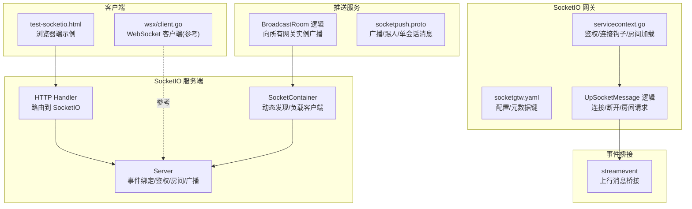
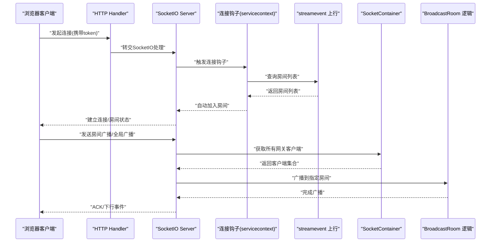
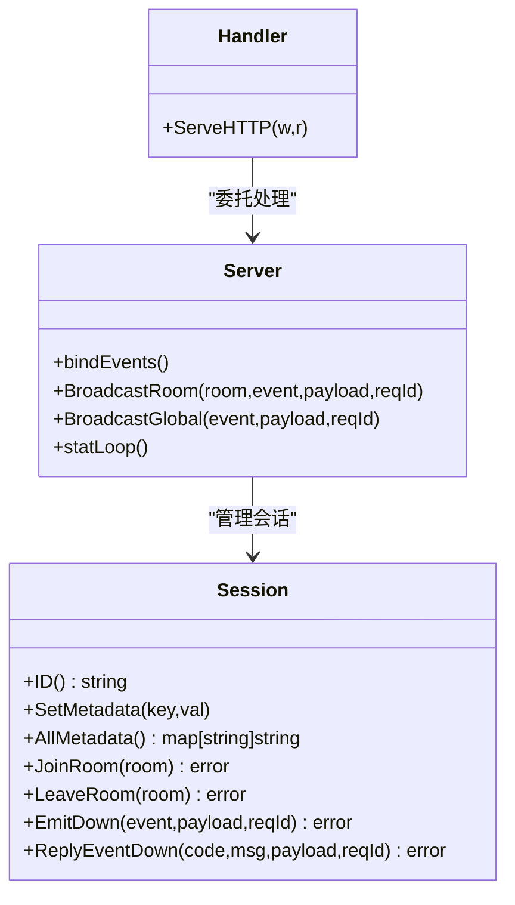
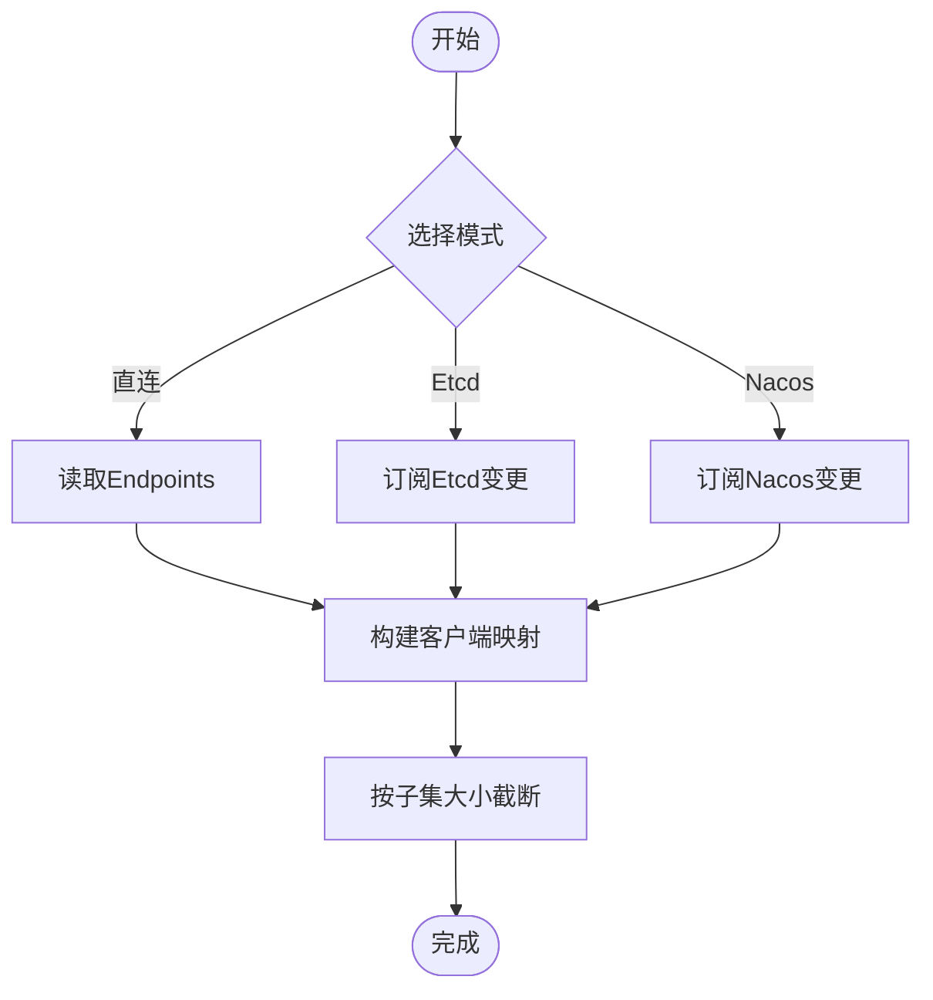
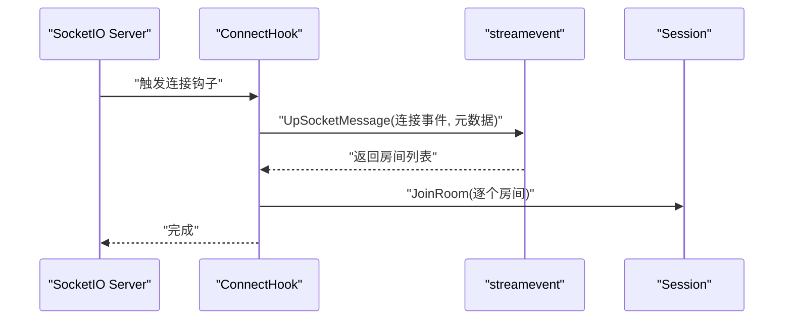
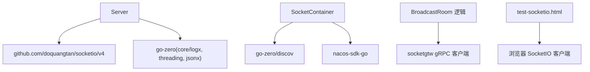

# SocketIO客户端集成

<cite>
**本文引用的文件**
- [common/socketiox/server.go](file://common/socketiox/server.go)
- [common/socketiox/handler.go](file://common/socketiox/handler.go)
- [common/socketiox/container.go](file://common/socketiox/container.go)
- [common/socketiox/test-socketio.html](file://common/socketiox/test-socketio.html)
- [socketapp/socketgtw/etc/socketgtw.yaml](file://socketapp/socketgtw/etc/socketgtw.yaml)
- [socketapp/socketgtw/internal/svc/servicecontext.go](file://socketapp/socketgtw/internal/svc/servicecontext.go)
- [facade/streamevent/internal/logic/upsocketmessagelogic.go](file://facade/streamevent/internal/logic/upsocketmessagelogic.go)
- [socketapp/socketpush/internal/logic/broadcastroomlogic.go](file://socketapp/socketpush/internal/logic/broadcastroomlogic.go)
- [socketapp/socketpush/socketpush/socketpush.pb.go](file://socketapp/socketpush/socketpush/socketpush.pb.go)
- [common/wsx/client.go](file://common/wsx/client.go)
</cite>

## 目录
1. [简介](#简介)
2. [项目结构](#项目结构)
3. [核心组件](#核心组件)
4. [架构总览](#架构总览)
5. [详细组件分析](#详细组件分析)
6. [依赖分析](#依赖分析)
7. [性能考虑](#性能考虑)
8. [故障排查指南](#故障排查指南)
9. [结论](#结论)
10. [附录](#附录)

## 简介
本指南面向在 Zero-Service 中集成 SocketIO 客户端的开发者，系统讲解从连接建立、鉴权、消息收发、房间管理到广播推送的完整流程，并提供最佳实践、常见问题与调试技巧。文档基于仓库中的 SocketIO 服务端实现、网关与推送模块进行说明，帮助读者快速落地生产可用的 SocketIO 客户端集成方案。

## 项目结构
围绕 SocketIO 的关键目录与文件如下：
- 通用 SocketIO 服务端与容器：common/socketiox
- SocketIO 网关与推送：socketapp/socketgtw、socketapp/socketpush
- 事件桥接：facade/streamevent
- 示例与测试：common/socketiox/test-socketio.html
- 客户端参考实现：common/wsx/client.go（WebSocket 客户端，便于理解重连与心跳）

**图表来源**
- [common/socketiox/server.go:314-335](file://common/socketiox/server.go#L314-L335)
- [common/socketiox/handler.go:19-41](file://common/socketiox/handler.go#L19-L41)
- [common/socketiox/container.go:30-61](file://common/socketiox/container.go#L30-L61)
- [socketapp/socketgtw/etc/socketgtw.yaml:1-37](file://socketapp/socketgtw/etc/socketgtw.yaml#L1-L37)
- [socketapp/socketgtw/internal/svc/servicecontext.go:59-102](file://socketapp/socketgtw/internal/svc/servicecontext.go#L59-L102)
- [facade/streamevent/internal/logic/upsocketmessagelogic.go:28-55](file://facade/streamevent/internal/logic/upsocketmessagelogic.go#L28-L55)
- [socketapp/socketpush/internal/logic/broadcastroomlogic.go:28-44](file://socketapp/socketpush/internal/logic/broadcastroomlogic.go#L28-L44)
- [socketapp/socketpush/socketpush/socketpush.pb.go:664-1144](file://socketapp/socketpush/socketpush/socketpush.pb.go#L664-L1144)
- [common/wsx/client.go:448-644](file://common/wsx/client.go#L448-L644)

**章节来源**
- [common/socketiox/server.go:314-335](file://common/socketiox/server.go#L314-L335)
- [common/socketiox/handler.go:19-41](file://common/socketiox/handler.go#L19-L41)
- [common/socketiox/container.go:30-61](file://common/socketiox/container.go#L30-L61)
- [socketapp/socketgtw/etc/socketgtw.yaml:1-37](file://socketapp/socketgtw/etc/socketgtw.yaml#L1-L37)
- [socketapp/socketgtw/internal/svc/servicecontext.go:59-102](file://socketapp/socketgtw/internal/svc/servicecontext.go#L59-L102)
- [facade/streamevent/internal/logic/upsocketmessagelogic.go:28-55](file://facade/streamevent/internal/logic/upsocketmessagelogic.go#L28-L55)
- [socketapp/socketpush/internal/logic/broadcastroomlogic.go:28-44](file://socketapp/socketpush/internal/logic/broadcastroomlogic.go#L28-L44)
- [socketapp/socketpush/socketpush/socketpush.pb.go:664-1144](file://socketapp/socketpush/socketpush/socketpush.pb.go#L664-L1144)
- [common/wsx/client.go:448-644](file://common/wsx/client.go#L448-L644)

## 核心组件
- SocketIO 服务端 Server：负责握手、鉴权、事件绑定、房间管理、广播、统计上报等。
- HTTP Handler：将 HTTP 请求转交给 SocketIO 处理器。
- SocketContainer：基于 etcd/nacos/direct 的动态客户端容器，用于向所有网关实例广播。
- 网关 servicecontext：连接钩子中通过上游服务查询房间列表并自动加入。
- 事件桥接 streamevent：统一处理上行 Socket 消息，返回房间列表或应答。
- 推送逻辑 broadcastroomlogic：遍历容器中的所有网关客户端，广播到指定房间。
- 浏览器测试页面 test-socketio.html：演示连接、房间管理、广播等交互。
- WebSocket 客户端 wsx/client.go：作为 SocketIO 客户端行为的参考实现（重连、心跳、错误处理）。

**章节来源**
- [common/socketiox/server.go:119-232](file://common/socketiox/server.go#L119-L232)
- [common/socketiox/handler.go:19-41](file://common/socketiox/handler.go#L19-L41)
- [common/socketiox/container.go:30-61](file://common/socketiox/container.go#L30-L61)
- [socketapp/socketgtw/internal/svc/servicecontext.go:59-102](file://socketapp/socketgtw/internal/svc/servicecontext.go#L59-L102)
- [facade/streamevent/internal/logic/upsocketmessagelogic.go:28-55](file://facade/streamevent/internal/logic/upsocketmessagelogic.go#L28-L55)
- [socketapp/socketpush/internal/logic/broadcastroomlogic.go:28-44](file://socketapp/socketpush/internal/logic/broadcastroomlogic.go#L28-L44)
- [common/socketiox/test-socketio.html:866-1393](file://common/socketiox/test-socketio.html#L866-L1393)
- [common/wsx/client.go:448-644](file://common/wsx/client.go#L448-L644)

## 架构总览
下图展示从浏览器 SocketIO 客户端到服务端、再到网关与推送链路的整体交互。

**图表来源**
- [common/socketiox/handler.go:33-35](file://common/socketiox/handler.go#L33-L35)
- [common/socketiox/server.go:350-391](file://common/socketiox/server.go#L350-L391)
- [socketapp/socketgtw/internal/svc/servicecontext.go:75-96](file://socketapp/socketgtw/internal/svc/servicecontext.go#L75-L96)
- [facade/streamevent/internal/logic/upsocketmessagelogic.go:28-55](file://facade/streamevent/internal/logic/upsocketmessagelogic.go#L28-L55)
- [common/socketiox/container.go:63-77](file://common/socketiox/container.go#L63-L77)
- [socketapp/socketpush/internal/logic/broadcastroomlogic.go:28-44](file://socketapp/socketpush/internal/logic/broadcastroomlogic.go#L28-L44)

## 详细组件分析

### SocketIO 服务端 Server
- 事件常量与协议：定义了连接、断开、上行、房间、全局广播等事件名；统一的上行/下行载荷结构与应答格式。
- 会话 Session：封装 socket、元数据、房间、发射方法、加入/离开房间等。
- 事件绑定：在 OnConnection 中完成鉴权、上下文注入、连接钩子、房间加入、以及对 Join/Leave/Up/RoomBroadcast/GlobalBroadcast 等事件的处理。
- 广播能力：支持房间广播与全局广播，内部构造下行载荷并调用底层 emit。
- 统计上报：周期性向每个会话发送统计事件，包含会话ID、房间列表、网络指标与元数据。

**图表来源**
- [common/socketiox/server.go:119-232](file://common/socketiox/server.go#L119-L232)
- [common/socketiox/server.go:314-335](file://common/socketiox/server.go#L314-L335)
- [common/socketiox/server.go:678-700](file://common/socketiox/server.go#L678-L700)
- [common/socketiox/handler.go:19-41](file://common/socketiox/handler.go#L19-L41)

**章节来源**
- [common/socketiox/server.go:20-35](file://common/socketiox/server.go#L20-L35)
- [common/socketiox/server.go:119-232](file://common/socketiox/server.go#L119-L232)
- [common/socketiox/server.go:337-676](file://common/socketiox/server.go#L337-L676)
- [common/socketiox/server.go:678-700](file://common/socketiox/server.go#L678-L700)
- [common/socketiox/server.go:702-759](file://common/socketiox/server.go#L702-L759)

### HTTP Handler 与 SocketIO 绑定
- 将 HTTP 请求转交给 SocketIO 的 HttpHandler，实现标准的 SocketIO 协议处理。
- 通过 WithServer/SocketioHandler 提供便捷入口。

**章节来源**
- [common/socketiox/handler.go:19-41](file://common/socketiox/handler.go#L19-L41)

### SocketContainer 动态客户端容器
- 支持直连、etcd、nacos 三种方式获取网关客户端集合。
- 基于订阅/轮询维护健康实例列表，按子集大小截断，保证负载均衡与稳定性。
- 为广播逻辑提供“所有网关实例”的客户端集合。

**图表来源**
- [common/socketiox/container.go:35-61](file://common/socketiox/container.go#L35-L61)
- [common/socketiox/container.go:83-130](file://common/socketiox/container.go#L83-L130)
- [common/socketiox/container.go:156-242](file://common/socketiox/container.go#L156-L242)
- [common/socketiox/container.go:267-316](file://common/socketiox/container.go#L267-L316)

**章节来源**
- [common/socketiox/container.go:30-61](file://common/socketiox/container.go#L30-L61)
- [common/socketiox/container.go:83-130](file://common/socketiox/container.go#L83-L130)
- [common/socketiox/container.go:156-242](file://common/socketiox/container.go#L156-L242)
- [common/socketiox/container.go:267-316](file://common/socketiox/container.go#L267-L316)

### 网关 servicecontext：连接钩子与房间加载
- 在连接钩子中，将会话元数据打包，调用上游 streamevent 的上行消息接口，获取房间列表并自动加入。
- 断开钩子中同样可上报断开事件与元数据。

**图表来源**
- [socketapp/socketgtw/internal/svc/servicecontext.go:75-96](file://socketapp/socketgtw/internal/svc/servicecontext.go#L75-L96)
- [facade/streamevent/internal/logic/upsocketmessagelogic.go:28-55](file://facade/streamevent/internal/logic/upsocketmessagelogic.go#L28-L55)

**章节来源**
- [socketapp/socketgtw/internal/svc/servicecontext.go:59-102](file://socketapp/socketgtw/internal/svc/servicecontext.go#L59-L102)
- [facade/streamevent/internal/logic/upsocketmessagelogic.go:28-55](file://facade/streamevent/internal/logic/upsocketmessagelogic.go#L28-L55)

### 推送逻辑：房间广播
- 广播逻辑遍历 SocketContainer 中的所有网关客户端，异步调用其 BroadcastRoom 接口，确保高吞吐与不阻塞主流程。
- 使用 GoSafe 包装 goroutine，避免异常导致进程崩溃。

**章节来源**
- [socketapp/socketpush/internal/logic/broadcastroomlogic.go:28-44](file://socketapp/socketpush/internal/logic/broadcastroomlogic.go#L28-L44)

### 浏览器端测试页面：连接与房间管理
- 提供连接状态、SocketID 展示，以及房间加入/离开、房间广播、全局广播等交互控件。
- 事件名称可自定义，发送时附带 reqId、payload、room/event 等字段。

**章节来源**
- [common/socketiox/test-socketio.html:866-1393](file://common/socketiox/test-socketio.html#L866-L1393)

### WebSocket 客户端参考：重连与心跳
- dial 建立连接并记录响应体内容，便于定位握手失败原因。
- waitBeforeReconnect 支持指数退避与最大间隔限制。
- heartbeatLoop 支持自定义心跳周期，保障长连接存活。
- handleConnectError 统一处理连接错误并回调状态变更。

**章节来源**
- [common/wsx/client.go:448-644](file://common/wsx/client.go#L448-L644)

## 依赖分析
- 服务端依赖 go-zero 的日志、并发与 JSON 工具，以及第三方 socketio 库。
- 网关通过 SocketContainer 动态发现下游网关实例，支持 etcd/nacos/direct 三种模式。
- 推送模块通过 gRPC 调用各网关实例的广播接口，实现跨实例广播。
- 浏览器端通过标准 SocketIO 客户端与服务端交互。

**图表来源**
- [common/socketiox/server.go:3-18](file://common/socketiox/server.go#L3-L18)
- [common/socketiox/container.go:17-27](file://common/socketiox/container.go#L17-L27)
- [socketapp/socketpush/internal/logic/broadcastroomlogic.go:5-11](file://socketapp/socketpush/internal/logic/broadcastroomlogic.go#L5-L11)

**章节来源**
- [common/socketiox/server.go:3-18](file://common/socketiox/server.go#L3-L18)
- [common/socketiox/container.go:17-27](file://common/socketiox/container.go#L17-L27)
- [socketapp/socketpush/internal/logic/broadcastroomlogic.go:5-11](file://socketapp/socketpush/internal/logic/broadcastroomlogic.go#L5-L11)

## 性能考虑
- 广播路径：服务端在事件处理中直接广播，若需跨实例广播，应通过 SocketContainer 获取所有网关客户端并异步调用，避免阻塞主事件处理。
- 广播大小：gRPC 调用已设置最大消息大小，建议控制 payload 体积，必要时采用分片或压缩策略。
- 统计上报：statLoop 周期性向每个会话发送统计事件，注意频率与会话数量匹配，避免过多 IO 压力。
- 重连策略：客户端采用指数退避与最大等待时间，避免雪崩式重连。

**章节来源**
- [common/socketiox/server.go:702-759](file://common/socketiox/server.go#L702-L759)
- [common/socketiox/container.go:113-118](file://common/socketiox/container.go#L113-L118)
- [common/wsx/client.go:598-633](file://common/wsx/client.go#L598-L633)

## 故障排查指南
- 握手失败
  - 检查 HTTP Handler 是否正确转交请求。
  - 查看服务端日志中握手参数与 token。
  - 参考 WebSocket 客户端的 dial 错误记录，定位响应体内容。
- 鉴权失败
  - 确认网关 servicecontext 中的 Token 校验逻辑与密钥配置。
  - 若使用 JWT，确认 prevAccessSecret 切换期间的兼容处理。
- 房间加入/离开异常
  - 检查连接钩子是否正确返回房间列表。
  - 确认房间名非空且事件载荷字段完整。
- 广播无响应
  - 确认 SocketContainer 是否正确发现并维护客户端集合。
  - 检查广播逻辑是否遍历所有客户端并异步调用。
- 连接抖动
  - 调整重连间隔与退避参数，避免频繁重连。
  - 关注心跳周期与网络波动影响。

**章节来源**
- [common/socketiox/handler.go:33-35](file://common/socketiox/handler.go#L33-L35)
- [socketapp/socketgtw/internal/svc/servicecontext.go:59-102](file://socketapp/socketgtw/internal/svc/servicecontext.go#L59-L102)
- [common/socketiox/server.go:392-468](file://common/socketiox/server.go#L392-L468)
- [common/socketiox/container.go:267-316](file://common/socketiox/container.go#L267-L316)
- [socketapp/socketpush/internal/logic/broadcastroomlogic.go:28-44](file://socketapp/socketpush/internal/logic/broadcastroomlogic.go#L28-L44)
- [common/wsx/client.go:448-644](file://common/wsx/client.go#L448-L644)

## 结论
通过统一的 SocketIO 服务端、动态客户端容器与事件桥接，Zero-Service 提供了可扩展、可观测、可运维的 SocketIO 客户端集成方案。结合浏览器测试页面与 WebSocket 客户端参考实现，开发者可以快速完成连接、鉴权、房间管理与广播推送的端到端集成，并在生产环境中通过合理的重连与性能调优保障稳定性。

## 附录

### 连接建立与握手参数
- 通过 HTTP Handler 将请求转交给 SocketIO 处理。
- 握手参数 token 由服务端 OnAuthentication 校验，支持普通校验与带声明的校验。
- 连接钩子中可读取元数据并自动加入房间。

**章节来源**
- [common/socketiox/handler.go:33-35](file://common/socketiox/handler.go#L33-L35)
- [common/socketiox/server.go:337-391](file://common/socketiox/server.go#L337-L391)
- [socketapp/socketgtw/etc/socketgtw.yaml](file://socketapp/socketgtw/etc/socketgtw.yaml#L29)

### 消息收发与 ACK
- 服务端对上行事件进行参数校验与解析，调用对应处理器，最终通过 ACK 或下行事件返回结果。
- 下行事件采用统一结构，包含事件名、payload、reqId。

**章节来源**
- [common/socketiox/server.go:469-531](file://common/socketiox/server.go#L469-L531)
- [common/socketiox/server.go:74-93](file://common/socketiox/server.go#L74-L93)

### 房间管理
- 房间加入/离开事件由服务端处理，支持预加入钩子与错误回传。
- 房间广播与全局广播分别针对房间集合与全部会话。

**章节来源**
- [common/socketiox/server.go:392-468](file://common/socketiox/server.go#L392-L468)
- [common/socketiox/server.go:678-700](file://common/socketiox/server.go#L678-L700)

### 鉴权机制
- 支持两种 Token 校验：简单校验与带声明校验。
- 连接钩子中可将声明中的特定键写入会话元数据，供后续业务使用。

**章节来源**
- [common/socketiox/server.go:279-297](file://common/socketiox/server.go#L279-L297)
- [socketapp/socketgtw/internal/svc/servicecontext.go:59-102](file://socketapp/socketgtw/internal/svc/servicecontext.go#L59-L102)

### 最佳实践
- 连接优化：合理设置重连间隔与最大等待时间，避免雪崩。
- 错误处理：统一记录握手与事件处理错误，区分参数错误与业务错误。
- 性能调优：控制 payload 体积，使用异步广播与子集截断，降低广播风暴风险。
- 可观测性：开启统计上报，定期检查会话数量与房间状态。

**章节来源**
- [common/wsx/client.go:598-633](file://common/wsx/client.go#L598-L633)
- [common/socketiox/server.go:702-759](file://common/socketiox/server.go#L702-L759)
- [common/socketiox/container.go:348-356](file://common/socketiox/container.go#L348-L356)