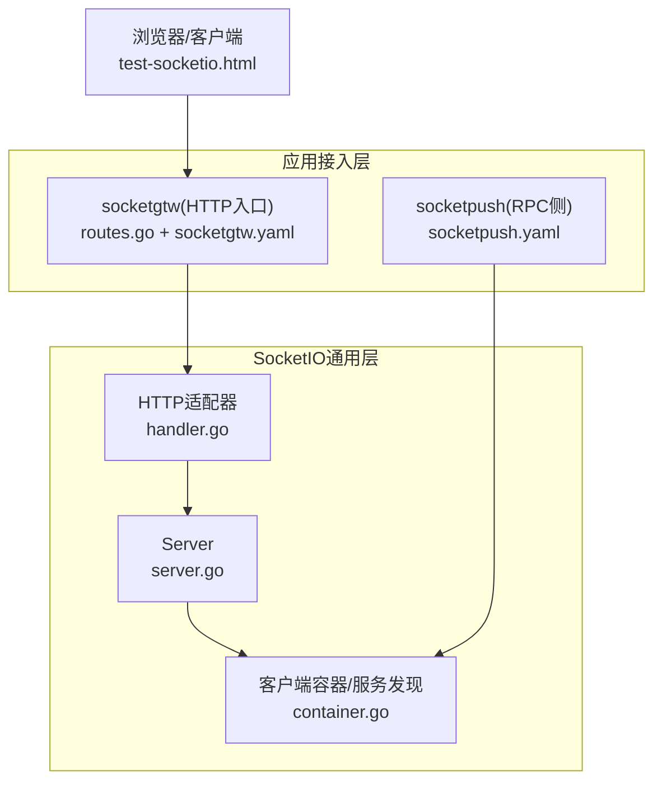
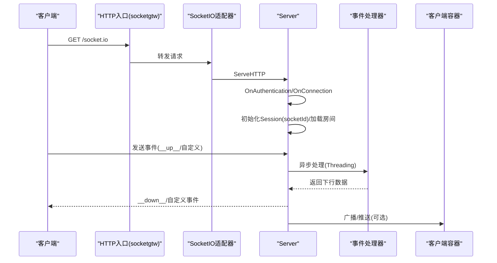
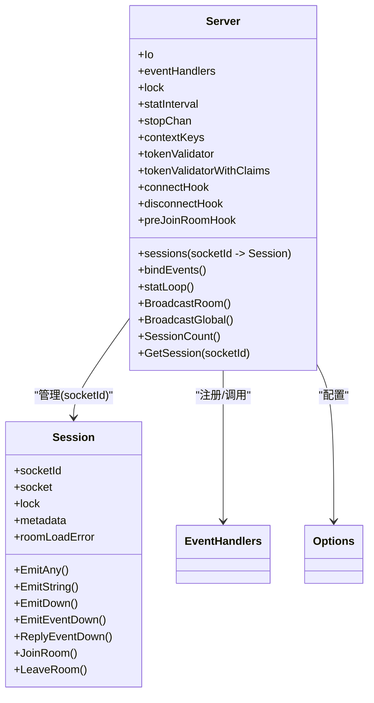
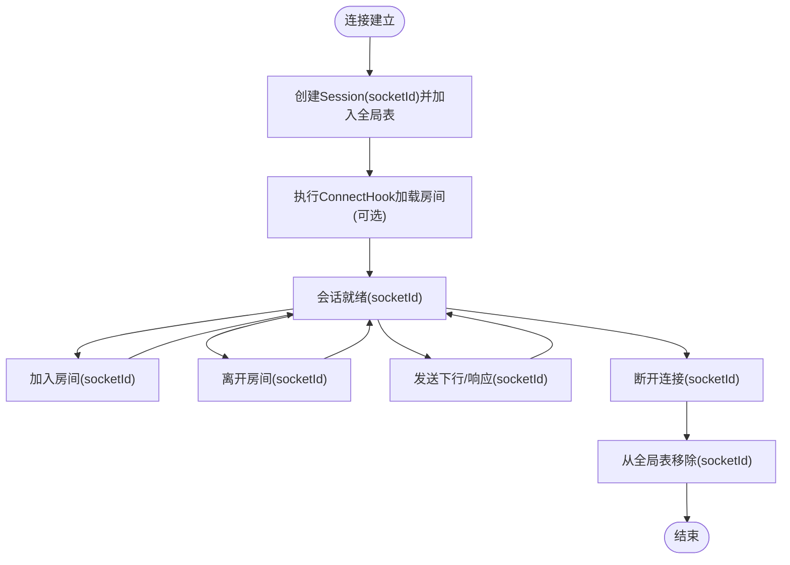
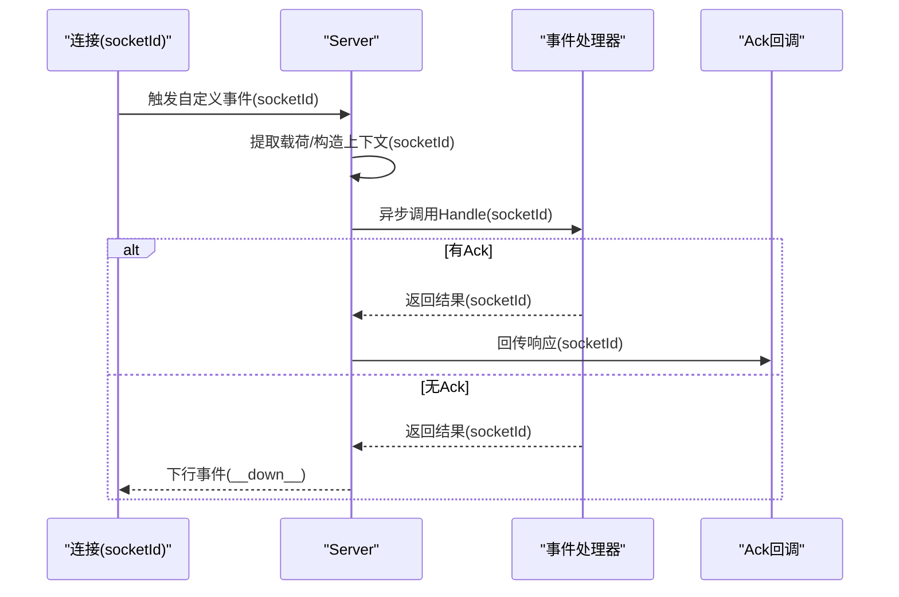
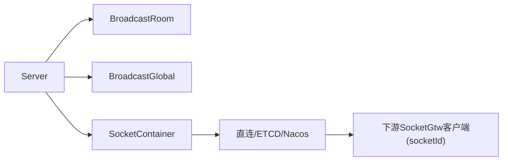
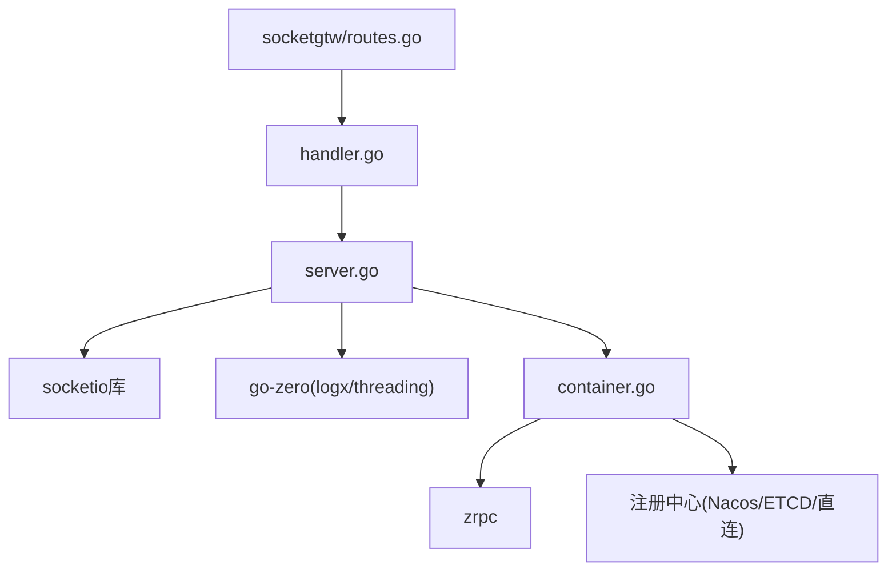

# SocketIO服务器架构

<cite>
**本文引用的文件**
- [common/socketiox/server.go](file://common/socketiox/server.go)
- [common/socketiox/handler.go](file://common/socketiox/handler.go)
- [common/socketiox/container.go](file://common/socketiox/container.go)
- [socketapp/socketgtw/etc/socketgtw.yaml](file://socketapp/socketgtw/etc/socketgtw.yaml)
- [socketapp/socketpush/etc/socketpush.yaml](file://socketapp/socketpush/etc/socketpush.yaml)
- [socketapp/socketgtw/internal/handler/routes.go](file://socketapp/socketgtw/internal/handler/routes.go)
- [common/socketiox/test-socketio.html](file://common/socketiox/test-socketio.html)
</cite>

## 更新摘要
**所做更改**
- 更新了会话标识符标准化的描述，从`sId`改为`socketId`
- 更新了房间管理操作的API描述，包括JoinRoom、LeaveRoom等方法
- 更新了统计收集机制的实现细节
- 更新了相关配置和事件处理的示例

## 目录
1. [简介](#简介)
2. [项目结构](#项目结构)
3. [核心组件](#核心组件)
4. [架构总览](#架构总览)
5. [详细组件分析](#详细组件分析)
6. [依赖分析](#依赖分析)
7. [性能考虑](#性能考虑)
8. [故障排查指南](#故障排查指南)
9. [结论](#结论)
10. [附录](#附录)

## 简介
本文件面向Zero-Service项目中的SocketIO服务器架构，系统性阐述其设计理念、关键模块、并发模型与生命周期管理，并提供配置说明、监控指标与性能优化建议。目标读者既包括需要快速上手的开发者，也包括希望深入理解实现细节的技术人员。

**更新** 本版本反映了Socket.IO服务器会话标识符标准化的重要变更，从`sId`统一改为`socketId`，提升了API的一致性和可读性。

## 项目结构
围绕SocketIO服务的关键目录与文件如下：
- 通用SocketIO能力：server.go（服务器、会话、事件处理）、handler.go（HTTP适配器）、container.go（客户端容器与服务发现）
- 应用接入示例：socketgtw（对外HTTP入口）、socketpush（RPC推送侧）
- 配置样例：socketgtw.yaml、socketpush.yaml
- 路由注册：socketgtw内部路由将HTTP请求交由SocketIO处理器
- 测试工具：test-socketio.html（浏览器端测试页面）

**图表来源**
- [common/socketiox/server.go](file://common/socketiox/server.go)
- [common/socketiox/handler.go](file://common/socketiox/handler.go)
- [common/socketiox/container.go](file://common/socketiox/container.go)
- [socketapp/socketgtw/internal/handler/routes.go](file://socketapp/socketgtw/internal/handler/routes.go)
- [socketapp/socketgtw/etc/socketgtw.yaml](file://socketapp/socketgtw/etc/socketgtw.yaml)
- [socketapp/socketpush/etc/socketpush.yaml](file://socketapp/socketpush/etc/socketpush.yaml)
- [common/socketiox/test-socketio.html](file://common/socketiox/test-socketio.html)

**章节来源**
- [common/socketiox/server.go](file://common/socketiox/server.go)
- [common/socketiox/handler.go](file://common/socketiox/handler.go)
- [common/socketiox/container.go](file://common/socketiox/container.go)
- [socketapp/socketgtw/etc/socketgtw.yaml](file://socketapp/socketgtw/etc/socketgtw.yaml)
- [socketapp/socketpush/etc/socketpush.yaml](file://socketapp/socketpush/etc/socketpush.yaml)
- [socketapp/socketgtw/internal/handler/routes.go](file://socketapp/socketgtw/internal/handler/routes.go)
- [common/socketiox/test-socketio.html](file://common/socketiox/test-socketio.html)

## 核心组件
- Server：SocketIO服务器主体，负责握手、鉴权、事件绑定、广播、统计上报、会话管理与生命周期控制
- Session：单个连接的会话抽象，封装底层socket、元数据、房间管理与发送能力。**更新** 现在使用`socketId`作为会话标识符
- 事件处理器：通过EventHandlers注册任意自定义事件，统一在回调中异步处理
- HTTP适配器：将HTTP请求转交给SocketIO内部处理器，暴露到REST路由
- 客户端容器：基于zrpc与多种注册中心（直连/ETCD/Nacos）动态维护下游Socket网关客户端

**章节来源**
- [common/socketiox/server.go](file://common/socketiox/server.go)
- [common/socketiox/handler.go](file://common/socketiox/handler.go)
- [common/socketiox/container.go](file://common/socketiox/container.go)

## 架构总览
SocketIO服务器采用"HTTP入口 + SocketIO内核 + 广播/推送扩展"的分层架构。HTTP入口通过REST路由将socket.io请求交由SocketIO处理器；Server在连接建立后完成鉴权、会话初始化、房间加载与事件绑定；业务侧通过事件处理器或广播接口进行下行推送；客户端容器负责与下游服务的动态连接与负载均衡。

**更新** 会话标识符现在统一使用`socketId`，确保了跨组件间的一致性。

**图表来源**
- [socketapp/socketgtw/internal/handler/routes.go](file://socketapp/socketgtw/internal/handler/routes.go)
- [common/socketiox/handler.go](file://common/socketiox/handler.go)
- [common/socketiox/server.go](file://common/socketiox/server.go)
- [common/socketiox/container.go](file://common/socketiox/container.go)

## 详细组件分析

### Server结构体与初始化
- 结构体字段
  - 继承底层Io实例
  - eventHandlers：事件名到处理器映射
  - sessions：连接ID到Session的全局表（使用`socketId`作为键）
  - lock：读写锁保护sessions
  - statInterval：统计上报周期
  - stopChan：统计协程退出信号
  - 上下文键列表、令牌校验器、钩子函数等
- 初始化流程
  - NewServer创建Io实例，初始化集合与默认统计周期
  - 应用Option配置（事件处理器、上下文键、统计间隔、令牌校验、钩子等）
  - bindEvents绑定认证、连接、事件监听与断开清理
  - 启动statLoop统计协程

**更新** 会话管理现在使用`socketId`作为会话标识符，确保了与客户端API的一致性。

**图表来源**
- [common/socketiox/server.go](file://common/socketiox/server.go)

**章节来源**
- [common/socketiox/server.go](file://common/socketiox/server.go)

### 会话管理机制(Session)
- 元数据存储：以字符串键值对保存，仅接受非空字符串，防止污染
- 房间管理：幂等加入/离开，内部加锁保证一致性。**更新** 使用`socketId`标识会话
- 发送能力：支持任意载荷、字符串、下行事件、响应事件
- 生命周期：连接建立创建，断开清理，异常时主动断开

**更新** 会话标识符现在统一使用`socketId`，提供了更清晰的语义表达。

**图表来源**
- [common/socketiox/server.go](file://common/socketiox/server.go)

**章节来源**
- [common/socketiox/server.go](file://common/socketiox/server.go)

### 事件处理器注册系统
- 内置事件
  - 连接/断开：用于统计与钩子
  - 通用上行：__up__，承载业务请求
  - 房间广播/全局广播：__room_broadcast_up__/__global_broadcast_up__
  - 房间/离开房间：__join_room_up__/__leave_room_up__
- 自定义事件：通过WithHandler/WithEventHandlers注册，Server在OnConnection中为每个连接绑定
- 处理策略：收到事件后提取载荷，异步执行处理器，支持Ack或下行事件回包

**更新** 房间管理事件现在使用`socketId`进行标识，确保了事件处理的一致性。

**图表来源**
- [common/socketiox/server.go](file://common/socketiox/server.go)

**章节来源**
- [common/socketiox/server.go](file://common/socketiox/server.go)

### 握手与鉴权机制
- 认证阶段：OnAuthentication根据令牌校验器决定是否允许连接
- 连接阶段：OnConnection创建Session，支持带声明的令牌解析并将指定键注入Session元数据
- 钩子：ConnectHook/DisconnectHook/PreJoinRoomHook提供扩展点

**章节来源**
- [common/socketiox/server.go](file://common/socketiox/server.go)

### 广播与推送
- 房间广播：BroadcastRoom
- 全局广播：BroadcastGlobal
- 客户端容器：基于zrpc与注册中心动态维护下游客户端，支持直连、ETCD、Nacos三种模式，自动增删与健康实例筛选

**图表来源**
- [common/socketiox/server.go](file://common/socketiox/server.go)
- [common/socketiox/container.go](file://common/socketiox/container.go)

**章节来源**
- [common/socketiox/server.go](file://common/socketiox/server.go)
- [common/socketiox/container.go](file://common/socketiox/container.go)

### 并发处理模型
- goroutine管理：所有事件处理均通过GoSafe包装，避免panic导致进程崩溃
- 锁机制：sessions全局表使用读写锁；Session内部元数据访问使用互斥锁
- 内存管理：Session元数据仅保存字符串键值；统计协程按配置周期触发，避免高频轮询

**章节来源**
- [common/socketiox/server.go](file://common/socketiox/server.go)

### 生命周期管理
- 启动：NewServer -> 绑定事件 -> 启动统计协程
- 运行：事件循环持续处理连接、断开、房间、广播与自定义事件
- 停止：通过stopChan驱动statLoop退出；Session断开时清理无效会话

**章节来源**
- [common/socketiox/server.go](file://common/socketiox/server.go)

### 配置选项详解
- 事件处理器配置
  - WithEventHandlers：批量注册事件处理器
  - WithHandler：单事件注册
- 钩子函数设置
  - WithConnectHook：连接后加载房间
  - WithPreJoinRoomHook：加入房间前校验
  - WithDisconnectHook：断开钩子
- 统计间隔配置
  - WithStatInterval：统计上报周期，默认1分钟
- 令牌校验
  - WithTokenValidator：基础校验
  - WithTokenValidatorWithClaims：带声明的令牌解析，可将声明中的键注入Session元数据
- 上下文键
  - WithContextKeys：指定从令牌声明中抽取的键列表

**章节来源**
- [common/socketiox/server.go](file://common/socketiox/server.go)

### 监控指标与性能优化
- 监控指标
  - 统计事件：__stat_down__，包含会话ID(socketId)、房间列表、网络性能指标、元数据与房间加载错误
  - 统计周期：可通过WithStatInterval调整
  - 日志：连接、断开、鉴权、处理错误均有日志输出
- 性能优化建议
  - 控制事件载荷大小，避免大对象频繁序列化
  - 使用房间广播替代逐连接发送
  - 合理设置统计周期，避免过高的日志压力
  - 对高并发场景，确保事件处理器内部I/O操作非阻塞

**更新** 统计信息现在使用`socketId`标识，提供了更精确的会话跟踪能力。

**章节来源**
- [common/socketiox/server.go](file://common/socketiox/server.go)

## 依赖分析
- HTTP入口依赖：socketgtw通过REST路由将GET /socket.io交由SocketIO适配器处理
- 服务器依赖：Server依赖底层socketio库与go-zero的日志、并发工具
- 客户端依赖：SocketContainer依赖zrpc与注册中心SDK，动态维护下游客户端

**图表来源**
- [socketapp/socketgtw/internal/handler/routes.go](file://socketapp/socketgtw/internal/handler/routes.go)
- [common/socketiox/handler.go](file://common/socketiox/handler.go)
- [common/socketiox/server.go](file://common/socketiox/server.go)
- [common/socketiox/container.go](file://common/socketiox/container.go)

**章节来源**
- [socketapp/socketgtw/internal/handler/routes.go](file://socketapp/socketgtw/internal/handler/routes.go)
- [common/socketiox/handler.go](file://common/socketiox/handler.go)
- [common/socketiox/server.go](file://common/socketiox/server.go)
- [common/socketiox/container.go](file://common/socketiox/container.go)

## 性能考虑
- 并发模型：事件处理全部异步化，降低主线程阻塞风险
- 内存占用：Session元数据仅字符串键值；统计周期可控
- I/O优化：广播接口直接使用底层库的广播能力
- 网络健壮性：客户端容器支持健康实例筛选与动态扩缩容

## 故障排查指南
- 连接失败
  - 检查OnAuthentication与令牌校验器配置
  - 查看日志中"token validation failed"等信息
- 事件处理异常
  - 确认事件处理器已注册且签名正确
  - 关注"failed to process request"日志
- 房间加入失败
  - 检查PreJoinRoomHook返回值
  - 确认房间名非空
- 统计不更新
  - 检查WithStatInterval配置
  - 关注"session count mismatch"告警

**章节来源**
- [common/socketiox/server.go](file://common/socketiox/server.go)

## 结论
该SocketIO服务器架构以清晰的分层设计、完善的并发模型与灵活的扩展点，满足了实时通信与事件驱动场景的需求。通过HTTP适配器、事件处理器与客户端容器的协同，既能快速接入业务，也能在高并发下保持稳定与可观测性。

**更新** 最新的会话标识符标准化进一步提升了系统的可维护性和API一致性，为后续的功能扩展奠定了坚实的基础。

## 附录
- 配置样例
  - socketgtw.yaml：HTTP端口、日志、Nacos配置、Socket元数据键列表、流事件目标
  - socketpush.yaml：RPC端口、JWT配置、Nacos配置、Socket网关目标
- 浏览器测试
  - test-socketio.html：提供连接、事件发送与日志展示的前端工具

**章节来源**
- [socketapp/socketgtw/etc/socketgtw.yaml](file://socketapp/socketgtw/etc/socketgtw.yaml)
- [socketapp/socketpush/etc/socketpush.yaml](file://socketapp/socketpush/etc/socketpush.yaml)
- [common/socketiox/test-socketio.html](file://common/socketiox/test-socketio.html)