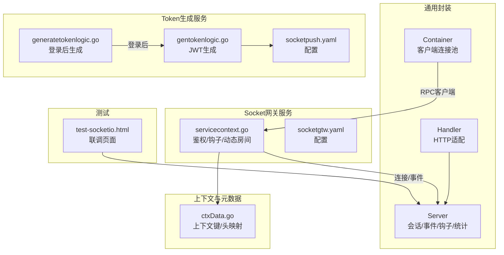
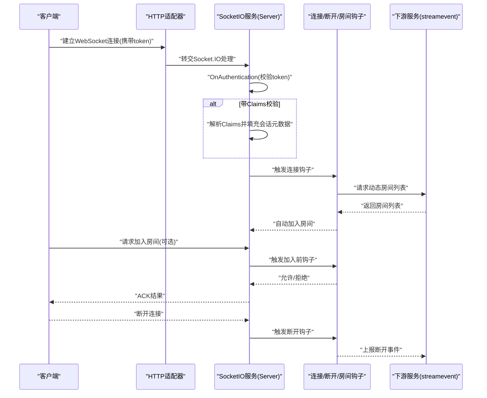
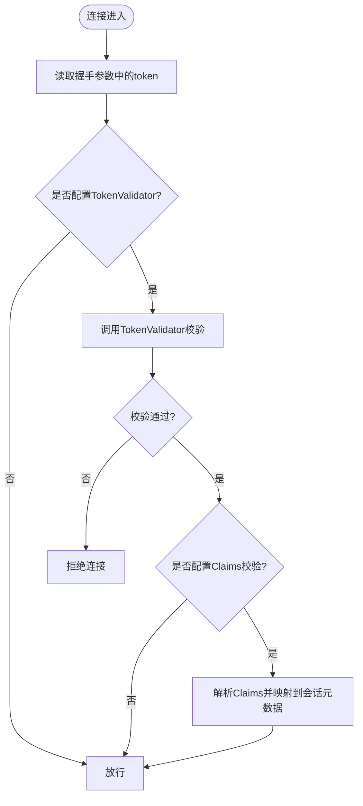
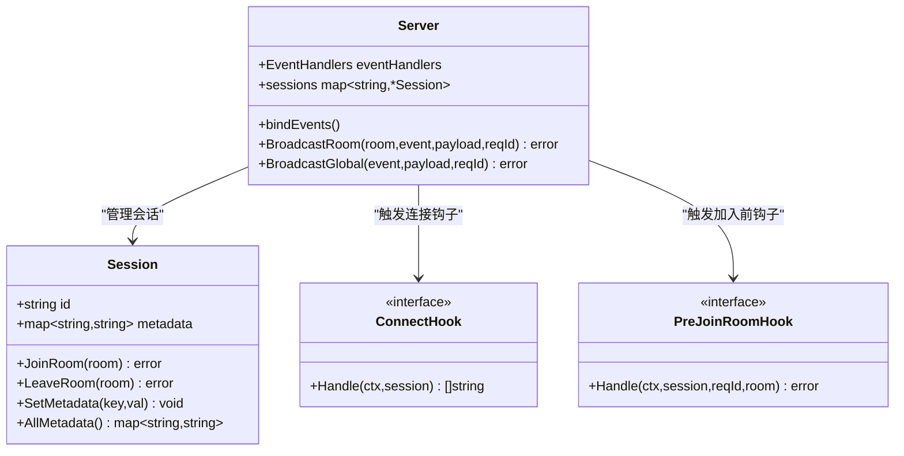
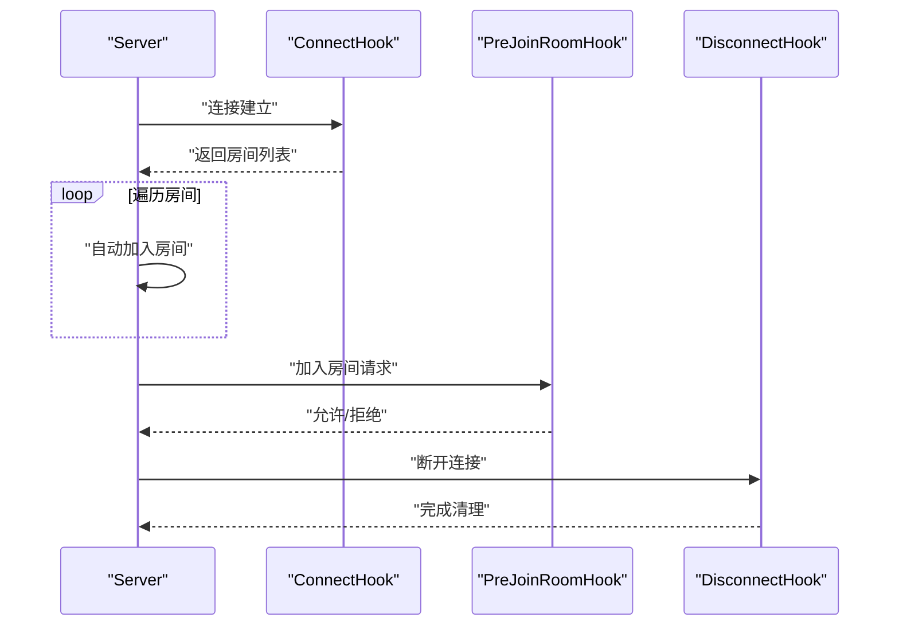
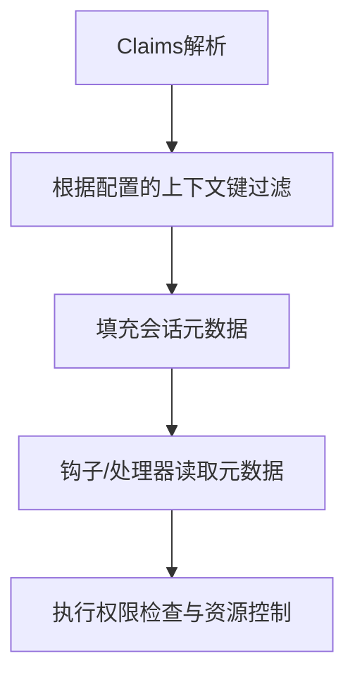
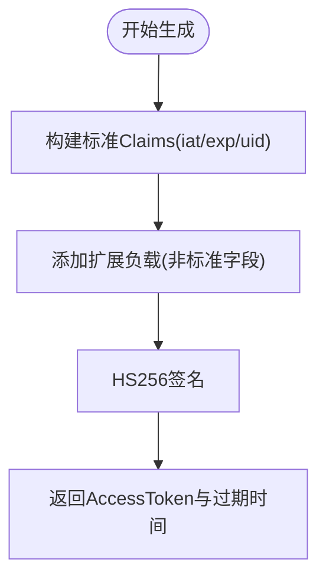
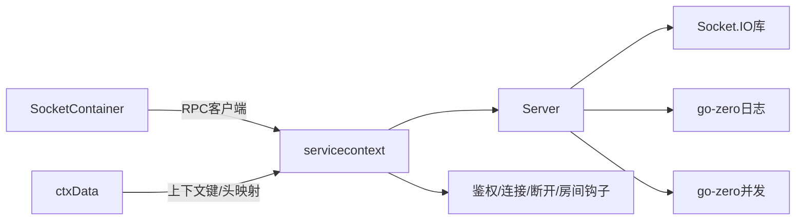

# SocketIO鉴权机制

<cite>
**本文引用的文件**   
- [common/socketiox/server.go](file://common/socketiox/server.go)
- [common/socketiox/handler.go](file://common/socketiox/handler.go)
- [common/socketiox/container.go](file://common/socketiox/container.go)
- [socketapp/socketgtw/internal/svc/servicecontext.go](file://socketapp/socketgtw/internal/svc/servicecontext.go)
- [socketapp/socketgtw/etc/socketgtw.yaml](file://socketapp/socketgtw/etc/socketgtw.yaml)
- [socketapp/socketpush/etc/socketpush.yaml](file://socketapp/socketpush/etc/socketpush.yaml)
- [socketapp/socketpush/internal/logic/gentokenlogic.go](file://socketapp/socketpush/internal/logic/gentokenlogic.go)
- [zerorpc/internal/logic/generatetokenlogic.go](file://zerorpc/internal/logic/generatetokenlogic.go)
- [zerorpc/internal/logic/loginlogic.go](file://zerorpc/internal/logic/loginlogic.go)
- [common/ctxdata/ctxData.go](file://common/ctxdata/ctxData.go)
- [common/socketiox/test-socketio.html](file://common/socketiox/test-socketio.html)
</cite>

## 目录
1. [简介](#简介)
2. [项目结构](#项目结构)
3. [核心组件](#核心组件)
4. [架构总览](#架构总览)
5. [详细组件分析](#详细组件分析)
6. [依赖分析](#依赖分析)
7. [性能考量](#性能考量)
8. [故障排查指南](#故障排查指南)
9. [结论](#结论)
10. [附录](#附录)

## 简介
本文件系统性阐述 Zero-Service 中基于 Socket.IO 的鉴权机制，覆盖连接时 Token 验证、会话权限管理、动态权限控制、Token 生成与刷新策略、鉴权钩子函数（连接、断开、房间加入）、基于 Claims 的权限控制、最佳实践与安全审计等内容。目标是帮助开发者在不直接阅读源码的情况下，也能高效理解并正确实施 SocketIO 鉴权方案。

## 项目结构
围绕 SocketIO 鉴权的关键模块分布如下：
- 通用 Socket.IO 封装：提供服务端、会话、事件处理、钩子、统计上报等能力
- Socket 网关服务：负责接入层鉴权、会话生命周期管理、房间动态授权
- Token 生成服务：提供 JWT 生成与刷新策略
- 上下文与元数据：统一的上下文键与 gRPC 元数据头映射
- 测试页面：用于本地联调与验证鉴权流程

**图表来源**
- [common/socketiox/server.go:299-335](file://common/socketiox/server.go#L299-L335)
- [common/socketiox/handler.go:19-40](file://common/socketiox/handler.go#L19-L40)
- [common/socketiox/container.go:30-61](file://common/socketiox/container.go#L30-L61)
- [socketapp/socketgtw/internal/svc/servicecontext.go:38-131](file://socketapp/socketgtw/internal/svc/servicecontext.go#L38-L131)
- [socketapp/socketgtw/etc/socketgtw.yaml:18-29](file://socketapp/socketgtw/etc/socketgtw.yaml#L18-L29)
- [socketapp/socketpush/etc/socketpush.yaml:10-13](file://socketapp/socketpush/etc/socketpush.yaml#L10-L13)
- [socketapp/socketpush/internal/logic/gentokenlogic.go:30-45](file://socketapp/socketpush/internal/logic/gentokenlogic.go#L30-L45)
- [zerorpc/internal/logic/generatetokenlogic.go:30-42](file://zerorpc/internal/logic/generatetokenlogic.go#L30-L42)
- [zerorpc/internal/logic/loginlogic.go:97-108](file://zerorpc/internal/logic/loginlogic.go#L97-L108)
- [common/ctxdata/ctxData.go:9-24](file://common/ctxdata/ctxData.go#L9-L24)
- [common/socketiox/test-socketio.html:1294-1357](file://common/socketiox/test-socketio.html#L1294-L1357)

**章节来源**
- [common/socketiox/server.go:1-120](file://common/socketiox/server.go#L1-L120)
- [common/socketiox/handler.go:1-41](file://common/socketiox/handler.go#L1-L41)
- [common/socketiox/container.go:1-100](file://common/socketiox/container.go#L1-L100)
- [socketapp/socketgtw/internal/svc/servicecontext.go:1-134](file://socketapp/socketgtw/internal/svc/servicecontext.go#L1-L134)
- [socketapp/socketgtw/etc/socketgtw.yaml:1-37](file://socketapp/socketgtw/etc/socketgtw.yaml#L1-L37)
- [socketapp/socketpush/etc/socketpush.yaml:1-28](file://socketapp/socketpush/etc/socketpush.yaml#L1-L28)
- [socketapp/socketpush/internal/logic/gentokenlogic.go:1-79](file://socketapp/socketpush/internal/logic/gentokenlogic.go#L1-L79)
- [zerorpc/internal/logic/generatetokenlogic.go:1-53](file://zerorpc/internal/logic/generatetokenlogic.go#L1-L53)
- [zerorpc/internal/logic/loginlogic.go:1-110](file://zerorpc/internal/logic/loginlogic.go#L1-L110)
- [common/ctxdata/ctxData.go:1-76](file://common/ctxdata/ctxData.go#L1-L76)
- [common/socketiox/test-socketio.html:1294-1357](file://common/socketiox/test-socketio.html#L1294-L1357)

## 核心组件
- 服务端 Server：封装 Socket.IO 事件绑定、鉴权钩子、房间管理、广播、统计上报、会话管理等
- 会话 Session：持有 socket 连接、元数据、房间状态，并支持加入/离开房间、回复消息
- 鉴权钩子：连接钩子、断开钩子、加入房间前钩子；支持动态房间授权
- 事件处理：内置通用上行事件与广播事件，支持注册自定义事件处理器
- HTTP 适配：将 Socket.IO 服务暴露为 HTTP 处理器
- 客户端容器：支持直连、Etcd、Nacos 三种方式发现与维护 RPC 客户端连接

**章节来源**
- [common/socketiox/server.go:119-236](file://common/socketiox/server.go#L119-L236)
- [common/socketiox/server.go:299-335](file://common/socketiox/server.go#L299-L335)
- [common/socketiox/handler.go:19-40](file://common/socketiox/handler.go#L19-L40)
- [common/socketiox/container.go:30-61](file://common/socketiox/container.go#L30-L61)

## 架构总览
SocketIO 鉴权的整体流程如下：
- 客户端通过 HTTP 接入 Socket.IO 服务
- 服务端在 OnAuthentication 阶段执行 Token 校验
- 若启用带 Claims 的校验，则将 Claims 中的指定键映射到会话元数据
- 触发连接钩子，可向下游服务请求动态房间列表并自动加入
- 客户端可请求加入房间，触发加入前钩子进行二次校验
- 断开连接时触发断开钩子，清理会话并上报状态

**图表来源**
- [common/socketiox/server.go:337-391](file://common/socketiox/server.go#L337-L391)
- [socketapp/socketgtw/internal/svc/servicecontext.go:75-130](file://socketapp/socketgtw/internal/svc/servicecontext.go#L75-L130)

## 详细组件分析

### 1) 连接鉴权与 Token 校验
- OnAuthentication 钩子中读取握手参数中的 token 并调用外部 TokenValidator 执行校验
- 支持两种校验模式：
  - 简单校验：仅判断 token 是否有效
  - Claims 校验：解析出 claims，并将配置的上下文键映射到会话元数据
- 当启用 Claims 校验时，会话元数据可用于后续钩子与业务逻辑

**图表来源**
- [common/socketiox/server.go:337-373](file://common/socketiox/server.go#L337-L373)
- [socketapp/socketgtw/internal/svc/servicecontext.go:41-74](file://socketapp/socketgtw/internal/svc/servicecontext.go#L41-L74)

**章节来源**
- [common/socketiox/server.go:337-373](file://common/socketiox/server.go#L337-L373)
- [socketapp/socketgtw/internal/svc/servicecontext.go:41-74](file://socketapp/socketgtw/internal/svc/servicecontext.go#L41-L74)

### 2) 会话权限管理与动态房间控制
- 会话元数据：支持多键存储，如用户ID、设备ID、部门编码等
- 动态房间授权：连接钩子可向下游服务请求房间列表，服务端自动加入
- 房间加入前校验：PreJoinRoomHook 可在加入前进行二次校验，失败则拒绝
- 房间广播与全局广播：内置事件，支持按房间或全服推送

**图表来源**
- [common/socketiox/server.go:119-236](file://common/socketiox/server.go#L119-L236)
- [common/socketiox/server.go:299-335](file://common/socketiox/server.go#L299-L335)
- [socketapp/socketgtw/internal/svc/servicecontext.go:75-130](file://socketapp/socketgtw/internal/svc/servicecontext.go#L75-L130)

**章节来源**
- [common/socketiox/server.go:119-236](file://common/socketiox/server.go#L119-L236)
- [socketapp/socketgtw/internal/svc/servicecontext.go:75-130](file://socketapp/socketgtw/internal/svc/servicecontext.go#L75-L130)

### 3) 鉴权钩子函数详解
- 连接钩子 ConnectHook：建立连接后触发，常用于加载动态房间列表并自动加入
- 断开钩子 DisconnectHook：连接断开时触发，常用于上报断开事件
- 房间加入前钩子 PreJoinRoomHook：加入房间前触发，常用于二次鉴权与权限校验

**图表来源**
- [socketapp/socketgtw/internal/svc/servicecontext.go:75-130](file://socketapp/socketgtw/internal/svc/servicecontext.go#L75-L130)
- [common/socketiox/server.go:392-468](file://common/socketiox/server.go#L392-L468)
- [common/socketiox/server.go:620-641](file://common/socketiox/server.go#L620-L641)

**章节来源**
- [socketapp/socketgtw/internal/svc/servicecontext.go:75-130](file://socketapp/socketgtw/internal/svc/servicecontext.go#L75-L130)
- [common/socketiox/server.go:392-468](file://common/socketiox/server.go#L392-L468)
- [common/socketiox/server.go:620-641](file://common/socketiox/server.go#L620-L641)

### 4) 基于 Claims 的权限控制
- Claims 提供用户身份与扩展属性（如用户ID、部门编码等），可通过上下文键映射到会话元数据
- 业务侧可在钩子与事件处理器中读取会话元数据，实现角色权限检查与资源访问控制
- 上下文键与 gRPC 头映射保持一致，便于跨服务传递

**图表来源**
- [socketapp/socketgtw/etc/socketgtw.yaml](file://socketapp/socketgtw/etc/socketgtw.yaml#L29)
- [socketapp/socketgtw/internal/svc/servicecontext.go:38-74](file://socketapp/socketgtw/internal/svc/servicecontext.go#L38-L74)
- [common/ctxdata/ctxData.go:9-24](file://common/ctxdata/ctxData.go#L9-L24)

**章节来源**
- [socketapp/socketgtw/etc/socketgtw.yaml](file://socketapp/socketgtw/etc/socketgtw.yaml#L29)
- [socketapp/socketgtw/internal/svc/servicecontext.go:38-74](file://socketapp/socketgtw/internal/svc/servicecontext.go#L38-L74)
- [common/ctxdata/ctxData.go:9-24](file://common/ctxdata/ctxData.go#L9-L24)

### 5) Token 生成机制
- 生成策略：基于 HS256 签名，包含签发时间、过期时间与用户标识等标准字段
- 有效期与刷新：配置 AccessExpire 控制有效期；RefreshAfter 控制建议刷新时机
- 生成来源：登录后由登录逻辑调用生成逻辑；独立服务也可通过 socketpush 生成

**图表来源**
- [socketapp/socketpush/internal/logic/gentokenlogic.go:57-78](file://socketapp/socketpush/internal/logic/gentokenlogic.go#L57-L78)
- [zerorpc/internal/logic/generatetokenlogic.go:44-52](file://zerorpc/internal/logic/generatetokenlogic.go#L44-L52)
- [zerorpc/internal/logic/loginlogic.go:97-108](file://zerorpc/internal/logic/loginlogic.go#L97-L108)

**章节来源**
- [socketapp/socketpush/etc/socketpush.yaml:10-13](file://socketapp/socketpush/etc/socketpush.yaml#L10-L13)
- [socketapp/socketpush/internal/logic/gentokenlogic.go:30-45](file://socketapp/socketpush/internal/logic/gentokenlogic.go#L30-L45)
- [zerorpc/internal/logic/generatetokenlogic.go:30-42](file://zerorpc/internal/logic/generatetokenlogic.go#L30-L42)
- [zerorpc/internal/logic/loginlogic.go:97-108](file://zerorpc/internal/logic/loginlogic.go#L97-L108)

### 6) 事件与广播
- 内置事件：连接、断开、通用上行、房间广播、全局广播
- 自定义事件：可注册任意事件处理器，统一走事件分发与 ACK 回复
- 广播接口：支持按房间与全服广播，避免重复事件名

**章节来源**
- [common/socketiox/server.go:20-35](file://common/socketiox/server.go#L20-L35)
- [common/socketiox/server.go:469-619](file://common/socketiox/server.go#L469-L619)

### 7) HTTP 适配与客户端容器
- HTTP 适配：将 Socket.IO 服务包装为 HTTP 处理器，便于反向代理与部署
- 客户端容器：支持直连、Etcd、Nacos 三种方式发现与维护 RPC 客户端连接，自动增删

**章节来源**
- [common/socketiox/handler.go:19-40](file://common/socketiox/handler.go#L19-L40)
- [common/socketiox/container.go:83-154](file://common/socketiox/container.go#L83-L154)
- [common/socketiox/container.go:156-316](file://common/socketiox/container.go#L156-L316)

## 依赖分析
- 服务端 Server 依赖 Socket.IO 库与 go-zero 日志/并发工具
- 服务上下文注入鉴权器、钩子与事件处理器
- 客户端容器通过多种注册中心动态维护下游服务连接
- 上下文键与 gRPC 头映射统一，便于跨服务传递

**图表来源**
- [common/socketiox/server.go:3-18](file://common/socketiox/server.go#L3-L18)
- [socketapp/socketgtw/internal/svc/servicecontext.go:1-37](file://socketapp/socketgtw/internal/svc/servicecontext.go#L1-L37)
- [common/socketiox/container.go:30-61](file://common/socketiox/container.go#L30-L61)
- [common/ctxdata/ctxData.go:9-24](file://common/ctxdata/ctxData.go#L9-L24)

**章节来源**
- [common/socketiox/server.go:3-18](file://common/socketiox/server.go#L3-L18)
- [socketapp/socketgtw/internal/svc/servicecontext.go:1-37](file://socketapp/socketgtw/internal/svc/servicecontext.go#L1-L37)
- [common/socketiox/container.go:30-61](file://common/socketiox/container.go#L30-L61)
- [common/ctxdata/ctxData.go:9-24](file://common/ctxdata/ctxData.go#L9-L24)

## 性能考量
- 统计上报：周期性统计会话数量、房间集合、每会话消息速率与元数据，便于容量评估
- 广播优化：按房间广播避免全量遍历，减少无效消息投递
- 并发安全：会话与房间操作采用互斥锁保护，避免竞态
- 消息大小：客户端容器默认设置较大的发送/接收消息上限，满足大包场景

**章节来源**
- [common/socketiox/server.go:702-740](file://common/socketiox/server.go#L702-L740)
- [common/socketiox/server.go:678-700](file://common/socketiox/server.go#L678-L700)
- [common/socketiox/container.go:107-117](file://common/socketiox/container.go#L107-L117)
- [common/socketiox/container.go:144-148](file://common/socketiox/container.go#L144-L148)

## 故障排查指南
- 连接被拒：检查 OnAuthentication 中的 TokenValidator 返回值与日志
- Claims 映射为空：确认配置的上下文键与实际 Claims 键一致
- 房间加入失败：检查 PreJoinRoomHook 的返回错误与下游服务响应
- 断开钩子未触发：确认连接是否正常断开，以及断开原因
- 统计异常：关注会话数量与 Socket 数量不一致的日志提示

**章节来源**
- [common/socketiox/server.go:337-373](file://common/socketiox/server.go#L337-L373)
- [socketapp/socketgtw/etc/socketgtw.yaml](file://socketapp/socketgtw/etc/socketgtw.yaml#L29)
- [socketapp/socketgtw/internal/svc/servicecontext.go:114-130](file://socketapp/socketgtw/internal/svc/servicecontext.go#L114-L130)
- [common/socketiox/server.go:718-722](file://common/socketiox/server.go#L718-L722)

## 结论
该 SocketIO 鉴权机制以“简单校验 + Claims 映射 + 钩子扩展”为核心，结合动态房间授权与广播能力，形成一套可扩展、可观测、可运维的实时通信安全体系。通过统一的上下文键与 gRPC 头映射，实现跨服务一致的身份与权限语义，适合在微服务体系中稳定落地。

## 附录

### A. 配置要点与最佳实践
- 鉴权开关：在服务上下文中注入 TokenValidator 与 TokenValidatorWithClaims
- 上下文键：在配置中声明需要映射的键，确保会话元数据可用
- 房间动态化：利用连接钩子与加入前钩子实现细粒度权限控制
- 安全策略：启用 PrevAccessSecret 支持密钥轮换；严格限制事件名，避免冲突
- 性能优化：合理设置统计间隔与消息大小；按需开启广播与事件处理

**章节来源**
- [socketapp/socketgtw/etc/socketgtw.yaml:18-29](file://socketapp/socketgtw/etc/socketgtw.yaml#L18-L29)
- [socketapp/socketgtw/internal/svc/servicecontext.go:38-74](file://socketapp/socketgtw/internal/svc/servicecontext.go#L38-L74)
- [socketapp/socketpush/etc/socketpush.yaml:10-13](file://socketapp/socketpush/etc/socketpush.yaml#L10-L13)

### B. 监控指标与安全审计
- 监控指标：会话总数、房间集合、每会话消息速率、元数据快照、房间加载错误
- 安全审计：记录连接/断开/房间加入/广播等关键事件的上下文与请求ID，便于追踪

**章节来源**
- [common/socketiox/server.go:66-72](file://common/socketiox/server.go#L66-L72)
- [common/socketiox/server.go:722-734](file://common/socketiox/server.go#L722-L734)

### C. 调试与联调
- 使用测试页面进行本地联调，验证连接、房间加入与广播功能
- 关注浏览器控制台日志与服务端日志，定位鉴权与事件处理问题

**章节来源**
- [common/socketiox/test-socketio.html:1294-1357](file://common/socketiox/test-socketio.html#L1294-L1357)