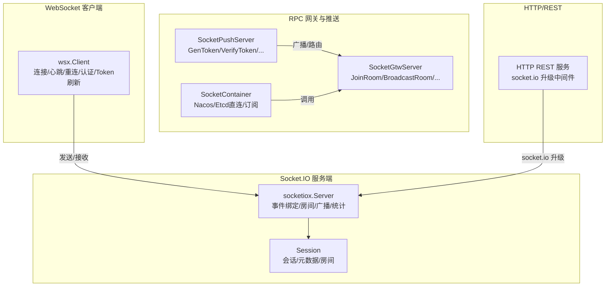
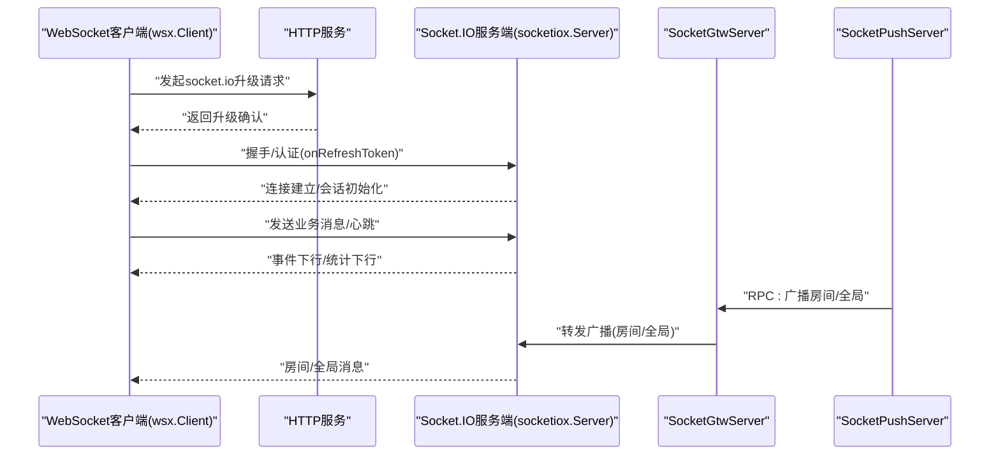
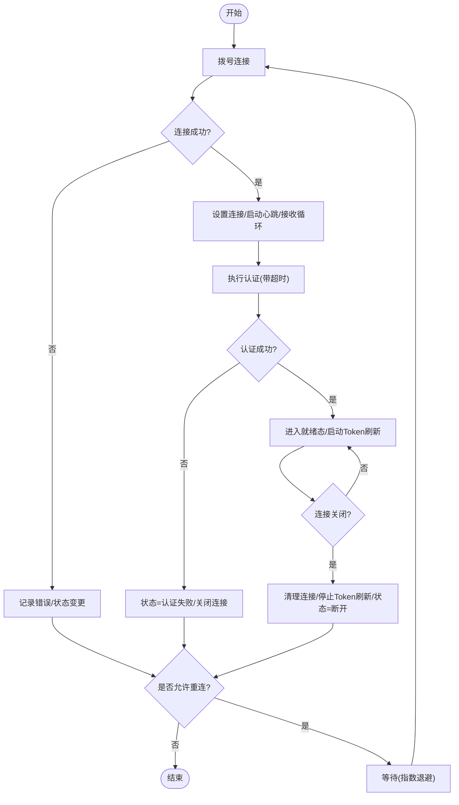
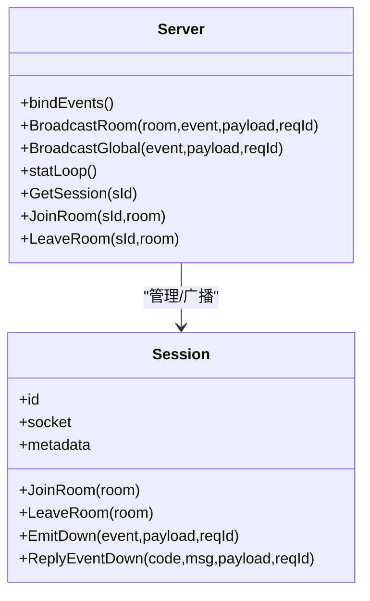
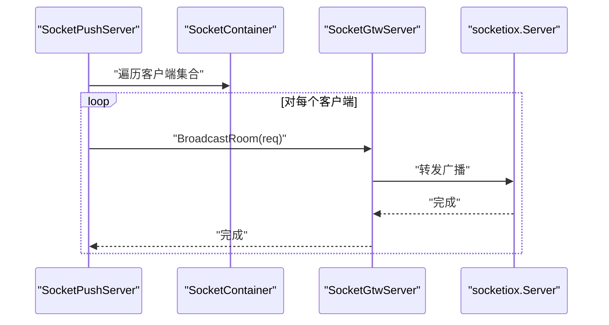
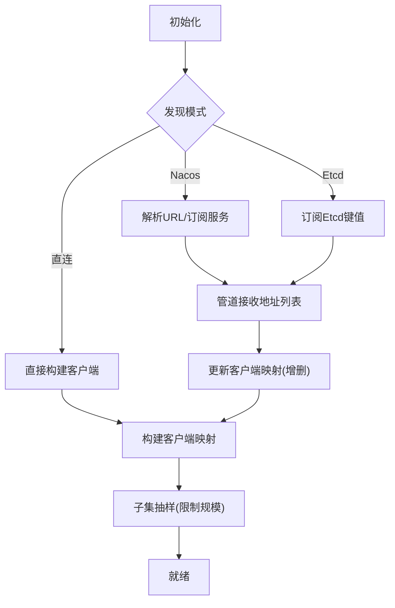
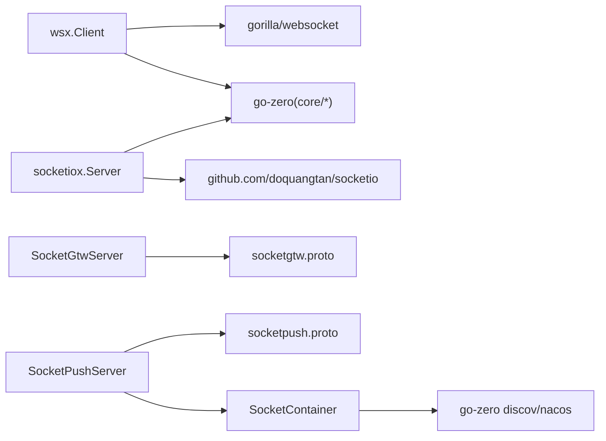

# WebSocket实时通信

<cite>
**本文引用的文件**
- [common/wsx/client.go](file://common/wsx/client.go)
- [common/socketiox/server.go](file://common/socketiox/server.go)
- [common/socketiox/container.go](file://common/socketiox/container.go)
- [socketapp/socketgtw/internal/server/socketgtwserver.go](file://socketapp/socketgtw/internal/server/socketgtwserver.go)
- [socketapp/socketgtw/internal/logic/broadcastroomlogic.go](file://socketapp/socketgtw/internal/logic/broadcastroomlogic.go)
- [socketapp/socketpush/internal/server/socketpushserver.go](file://socketapp/socketpush/internal/server/socketpushserver.go)
- [socketapp/socketpush/internal/logic/broadcastroomlogic.go](file://socketapp/socketpush/internal/logic/broadcastroomlogic.go)
- [socketapp/socketgtw/etc/socketgtw.yaml](file://socketapp/socketgtw/etc/socketgtw.yaml)
- [socketapp/socketpush/etc/socketpush.yaml](file://socketapp/socketpush/etc/socketpush.yaml)
- [socketapp/socketgtw/socketgtw.go](file://socketapp/socketgtw/socketgtw.go)
- [socketapp/socketpush/socketpush.go](file://socketapp/socketpush/socketpush.go)
- [facade/streamevent/internal/logic/receivewsmessagelogic.go](file://facade/streamevent/internal/logic/receivewsmessagelogic.go)
- [common/socketiox/test-socketio.html](file://common/socketiox/test-socketio.html)
</cite>

## 目录
1. [引言](#引言)
2. [项目结构](#项目结构)
3. [核心组件](#核心组件)
4. [架构总览](#架构总览)
5. [详细组件分析](#详细组件分析)
6. [依赖关系分析](#依赖关系分析)
7. [性能考量](#性能考量)
8. [故障排查指南](#故障排查指南)
9. [结论](#结论)
10. [附录](#附录)

## 引言
本文件系统性梳理 Zero-Service 中的 WebSocket 实时通信机制，涵盖客户端与服务端实现、连接管理、消息路由、房间广播、断线重连、心跳保活、Token 刷新、以及与 Socket.IO 的对比分析。文档同时提供调试工具使用方法与性能监控指标建议，帮助开发者快速理解与高效运维。

## 项目结构
本项目围绕两类 WebSocket 能力展开：
- WebSocket 客户端库：提供高可用、可配置的连接管理、心跳、重连、Token 刷新与消息处理能力。
- Socket.IO 服务端与网关：提供事件驱动的房间管理、广播、会话元数据、统计下行等能力；并通过 RPC 网关与推送服务协同工作。

图表来源
- [common/wsx/client.go:113-142](file://common/wsx/client.go#L113-L142)
- [common/socketiox/server.go:299-312](file://common/socketiox/server.go#L299-L312)
- [socketapp/socketgtw/internal/server/socketgtwserver.go:15-91](file://socketapp/socketgtw/internal/server/socketgtwserver.go#L15-L91)
- [socketapp/socketpush/internal/server/socketpushserver.go:15-103](file://socketapp/socketpush/internal/server/socketpushserver.go#L15-L103)
- [common/socketiox/container.go:30-33](file://common/socketiox/container.go#L30-L33)
- [socketapp/socketgtw/socketgtw.go:48-61](file://socketapp/socketgtw/socketgtw.go#L48-L61)

章节来源
- [socketapp/socketgtw/etc/socketgtw.yaml:1-37](file://socketapp/socketgtw/etc/socketgtw.yaml#L1-L37)
- [socketapp/socketpush/etc/socketpush.yaml:1-28](file://socketapp/socketpush/etc/socketpush.yaml#L1-L28)

## 核心组件
- WebSocket 客户端（wsx.Client）
  - 支持连接生命周期管理、认证超时、心跳保活、指数退避重连、Token 定时刷新、消息并发处理与指标采集。
- Socket.IO 服务端（socketiox.Server）
  - 提供连接鉴权、事件绑定、房间管理、全局/房间广播、会话统计下行、元数据注入与钩子扩展。
- RPC 网关与推送（SocketGtwServer / SocketPushServer）
  - 提供房间加入/离开、房间/全局广播、会话剔除、按元数据路由等 RPC 接口。
- 连接容器（SocketContainer）
  - 基于 Nacos/Etcd 的动态发现与 gRPC 客户端管理，支持健康实例筛选与子集抽样。
- HTTP 服务
  - 提供 socket.io 升级路径与中间件，承载 Socket.IO 服务。

章节来源
- [common/wsx/client.go:65-81](file://common/wsx/client.go#L65-L81)
- [common/socketiox/server.go:299-312](file://common/socketiox/server.go#L299-L312)
- [socketapp/socketgtw/internal/server/socketgtwserver.go:15-91](file://socketapp/socketgtw/internal/server/socketgtwserver.go#L15-L91)
- [socketapp/socketpush/internal/server/socketpushserver.go:15-103](file://socketapp/socketpush/internal/server/socketpushserver.go#L15-L103)
- [common/socketiox/container.go:30-33](file://common/socketiox/container.go#L30-L33)
- [socketapp/socketgtw/socketgtw.go:48-61](file://socketapp/socketgtw/socketgtw.go#L48-L61)

## 架构总览
WebSocket 在 Zero-Service 中的定位清晰：客户端负责与 Socket.IO 服务端建立长连接并维持心跳；服务端负责事件处理、房间管理与广播；RPC 层提供跨进程/跨节点的广播与路由能力；连接容器负责服务发现与 gRPC 客户端管理。

图表来源
- [socketapp/socketgtw/socketgtw.go:48-61](file://socketapp/socketgtw/socketgtw.go#L48-L61)
- [common/socketiox/server.go:337-391](file://common/socketiox/server.go#L337-L391)
- [socketapp/socketgtw/internal/server/socketgtwserver.go:38-48](file://socketapp/socketgtw/internal/server/socketgtwserver.go#L38-L48)
- [socketapp/socketpush/internal/server/socketpushserver.go:50-58](file://socketapp/socketpush/internal/server/socketpushserver.go#L50-L58)

## 详细组件分析

### WebSocket 客户端（wsx.Client）
- 连接管理
  - 连接生命周期由连接管理器驱动，包含拨号、认证、心跳、重连、关闭等阶段。
  - 支持认证超时控制与认证失败后的重连策略。
- 心跳保活
  - 默认使用 Ping/Pong 控制帧保活，PongHandler 刷新读超时，避免静默断开。
  - 支持自定义心跳内容回调，满足业务侧心跳协议。
- 断线重连
  - 支持指数退避与最大重连间隔，可限制最大重连次数。
  - 支持认证失败与 Token 过期时的重连开关。
- Token 刷新
  - 定时触发自定义 Token 刷新回调，失败时可选择关闭连接以触发重连。
- 消息处理
  - 接收循环设置读超时，区分控制帧与业务帧；业务帧通过 goroutine 安全处理并上报指标。

图表来源
- [common/wsx/client.go:386-445](file://common/wsx/client.go#L386-L445)
- [common/wsx/client.go:538-571](file://common/wsx/client.go#L538-L571)
- [common/wsx/client.go:579-633](file://common/wsx/client.go#L579-L633)
- [common/wsx/client.go:640-697](file://common/wsx/client.go#L640-L697)
- [common/wsx/client.go:699-774](file://common/wsx/client.go#L699-L774)
- [common/wsx/client.go:776-823](file://common/wsx/client.go#L776-L823)

章节来源
- [common/wsx/client.go:23-63](file://common/wsx/client.go#L23-L63)
- [common/wsx/client.go:83-107](file://common/wsx/client.go#L83-L107)
- [common/wsx/client.go:302-351](file://common/wsx/client.go#L302-L351)
- [common/wsx/client.go:353-384](file://common/wsx/client.go#L353-L384)
- [common/wsx/client.go:489-535](file://common/wsx/client.go#L489-L535)
- [common/wsx/client.go:776-823](file://common/wsx/client.go#L776-L823)

### Socket.IO 服务端（socketiox.Server）
- 事件绑定与处理
  - 绑定连接、断开、上行事件、房间加入/离开、房间/全局广播等事件。
  - 上行事件支持 Ack 或下行事件回包两种应答方式。
- 房间管理
  - 会话加入/离开房间；广播接口支持房间与全局两种模式。
- 会话与元数据
  - 会话对象维护元数据字典，支持从 Token Claims 注入元数据键。
- 统计下行
  - 定时向每个会话发送统计事件，包含房间列表、网络性能指标与元数据。
- 钩子扩展
  - 连接钩子、断开钩子、加入房间前钩子等，便于业务侧扩展。

图表来源
- [common/socketiox/server.go:299-312](file://common/socketiox/server.go#L299-L312)
- [common/socketiox/server.go:119-125](file://common/socketiox/server.go#L119-L125)
- [common/socketiox/server.go:678-700](file://common/socketiox/server.go#L678-L700)
- [common/socketiox/server.go:702-740](file://common/socketiox/server.go#L702-L740)

章节来源
- [common/socketiox/server.go:20-35](file://common/socketiox/server.go#L20-L35)
- [common/socketiox/server.go:337-676](file://common/socketiox/server.go#L337-L676)
- [common/socketiox/server.go:742-800](file://common/socketiox/server.go#L742-L800)

### RPC 网关与推送（SocketGtwServer / SocketPushServer）
- SocketGtwServer
  - 提供 JoinRoom、LeaveRoom、BroadcastRoom、BroadcastGlobal、KickSession 等 RPC 接口。
  - 广播逻辑将请求转交至 Socket.IO 服务端的广播实现。
- SocketPushServer
  - 提供 GenToken、VerifyToken、JoinRoom、LeaveRoom、BroadcastRoom、BroadcastGlobal 等 RPC 接口。
  - 广播逻辑遍历连接容器中的 gRPC 客户端，逐一调用 SocketGtw 广播接口，实现跨实例广播。

图表来源
- [socketapp/socketpush/internal/logic/broadcastroomlogic.go:28-44](file://socketapp/socketpush/internal/logic/broadcastroomlogic.go#L28-L44)
- [socketapp/socketgtw/internal/logic/broadcastroomlogic.go:28-46](file://socketapp/socketgtw/internal/logic/broadcastroomlogic.go#L28-L46)
- [socketapp/socketgtw/internal/server/socketgtwserver.go:38-48](file://socketapp/socketgtw/internal/server/socketgtwserver.go#L38-L48)
- [common/socketiox/server.go:678-700](file://common/socketiox/server.go#L678-L700)

章节来源
- [socketapp/socketgtw/internal/server/socketgtwserver.go:15-91](file://socketapp/socketgtw/internal/server/socketgtwserver.go#L15-L91)
- [socketapp/socketpush/internal/server/socketpushserver.go:15-103](file://socketapp/socketpush/internal/server/socketpushserver.go#L15-L103)
- [socketapp/socketpush/internal/logic/broadcastroomlogic.go:28-44](file://socketapp/socketpush/internal/logic/broadcastroomlogic.go#L28-L44)
- [socketapp/socketgtw/internal/logic/broadcastroomlogic.go:28-46](file://socketapp/socketgtw/internal/logic/broadcastroomlogic.go#L28-L46)

### 连接容器（SocketContainer）
- 动态发现
  - 支持 Nacos 与 Etcd 两种服务发现方式，自动拉取健康实例并构建 gRPC 客户端映射。
- 子集抽样
  - 对实例集合进行随机打散并限制规模，降低广播压力。
- 健康过滤
  - 仅保留带有 gRPC 端口且健康启用的实例。

图表来源
- [common/socketiox/container.go:35-61](file://common/socketiox/container.go#L35-L61)
- [common/socketiox/container.go:156-242](file://common/socketiox/container.go#L156-L242)
- [common/socketiox/container.go:267-316](file://common/socketiox/container.go#L267-L316)
- [common/socketiox/container.go:348-356](file://common/socketiox/container.go#L348-L356)

章节来源
- [common/socketiox/container.go:30-33](file://common/socketiox/container.go#L30-L33)
- [common/socketiox/container.go:318-346](file://common/socketiox/container.go#L318-L346)

### HTTP 服务与 socket.io 升级
- HTTP 服务在启动时注册 REST 服务，并通过中间件将特定路径的升级请求标记为 Upgrade，以便 socket.io 服务端正确处理。
- 配置文件中定义了 HTTP 端口与日志级别，便于调试与生产部署。

章节来源
- [socketapp/socketgtw/socketgtw.go:48-61](file://socketapp/socketgtw/socketgtw.go#L48-L61)
- [socketapp/socketgtw/etc/socketgtw.yaml:13-17](file://socketapp/socketgtw/etc/socketgtw.yaml#L13-L17)

## 依赖关系分析
- 客户端依赖
  - gorilla/websocket：底层 WebSocket 协议栈。
  - go-zero 核心库：日志、指标、并发、定时器、上下文等。
- 服务端依赖
  - socketio：Socket.IO 协议实现。
  - go-zero：日志、并发、服务治理。
- 网关与推送
  - 依赖 socketgtw/socketpush 的 protobuf 定义与生成代码。
  - 通过 SocketContainer 管理 gRPC 客户端，实现跨实例广播。

图表来源
- [common/wsx/client.go:3-21](file://common/wsx/client.go#L3-L21)
- [common/socketiox/server.go:3-18](file://common/socketiox/server.go#L3-L18)
- [socketapp/socketgtw/internal/server/socketgtwserver.go:7-13](file://socketapp/socketgtw/internal/server/socketgtwserver.go#L7-L13)
- [socketapp/socketpush/internal/server/socketpushserver.go:7-13](file://socketapp/socketpush/internal/server/socketpushserver.go#L7-L13)
- [common/socketiox/container.go:17-27](file://common/socketiox/container.go#L17-L27)

## 性能考量
- 心跳与保活
  - 使用 Ping/Pong 控制帧刷新读超时，避免静默断开；自定义心跳可用于业务侧协议。
- 并发与背压
  - 接收循环对每条消息使用 goroutine 安全处理，结合指标统计评估处理耗时。
- 重连策略
  - 指数退避与最大重连间隔可有效缓解瞬时故障；认证失败与 Token 过期的重连开关可避免无效重试。
- 广播与路由
  - SocketContainer 对实例集合进行子集抽样，减少大规模广播带来的网络与 CPU 压力。
- gRPC 消息大小
  - 客户端默认设置最大发送消息大小，避免超大消息导致内存与网络拥塞。

章节来源
- [common/wsx/client.go:640-697](file://common/wsx/client.go#L640-L697)
- [common/wsx/client.go:776-823](file://common/wsx/client.go#L776-L823)
- [common/wsx/client.go:579-633](file://common/wsx/client.go#L579-L633)
- [common/socketiox/container.go:348-356](file://common/socketiox/container.go#L348-L356)
- [common/socketiox/container.go:113-118](file://common/socketiox/container.go#L113-L118)

## 故障排查指南
- 连接失败
  - 检查拨号超时、目标地址可达性与证书/代理配置；关注连接管理器的状态回调与错误日志。
- 认证失败
  - 确认认证回调返回成功；检查认证超时与重连策略；必要时开启认证失败重连。
- 心跳异常
  - 检查自定义心跳回调是否返回有效数据；确认 PongHandler 是否正确刷新读超时。
- 广播不生效
  - 确认房间名与事件名合法；检查 SocketGtw/SocketPush 的广播逻辑与 SocketContainer 的客户端映射。
- 会话统计异常
  - 检查统计定时器与会话数量一致性；核对元数据注入与钩子执行情况。

章节来源
- [common/wsx/client.go:538-571](file://common/wsx/client.go#L538-L571)
- [common/wsx/client.go:640-697](file://common/wsx/client.go#L640-L697)
- [common/socketiox/server.go:702-740](file://common/socketiox/server.go#L702-L740)
- [socketapp/socketpush/internal/logic/broadcastroomlogic.go:28-44](file://socketapp/socketpush/internal/logic/broadcastroomlogic.go#L28-L44)

## 结论
Zero-Service 的 WebSocket 体系以 wsx.Client 为核心，提供稳健的连接与保活能力；以 socketiox.Server 为中心，提供事件驱动的房间与广播能力；通过 SocketGtw/SocketPush 与 SocketContainer 实现跨实例广播与动态发现。整体架构清晰、扩展性强，适合构建高并发、低延迟的实时通信系统。

## 附录

### WebSocket 与 Socket.IO 对比分析
- 协议与生态
  - WebSocket：标准协议，轻量、灵活，需自行实现房间、广播、鉴权等语义。
  - Socket.IO：在 WebSocket 基础上提供房间、广播、重连、降级策略等高级特性，生态丰富。
- 性能差异
  - WebSocket：协议开销小，适合高吞吐、低延迟场景；需自行优化心跳与重连。
  - Socket.IO：内置广播与房间管理，开发效率高；在高并发下需关注其事件循环与内存占用。
- 适用场景
  - WebSocket：对协议可控、性能敏感、已有成熟鉴权与房间管理的系统。
  - Socket.IO：快速搭建聊天室、实时协作、游戏、监控看板等场景。
- 迁移方案
  - 若从 Socket.IO 迁移到原生 WebSocket：保留房间与广播的业务逻辑，替换为自研或第三方库；复用现有鉴权与元数据体系。
  - 若从 WebSocket 迁移到 Socket.IO：引入事件绑定、房间与广播模块，逐步替换业务消息协议。

### 调试工具与使用
- Socket.IO 测试页面
  - 提供连接、上行消息、房间广播、全局广播、房间管理等交互界面，便于本地联调。
- HTTP 升级中间件
  - 在特定路径将 Connection 头标记为 Upgrade，确保 socket.io 升级成功。
- 日志与指标
  - 客户端与服务端均输出详细日志；客户端通过指标系统记录丢弃与处理耗时，辅助性能分析。

章节来源
- [common/socketiox/test-socketio.html:866-999](file://common/socketiox/test-socketio.html#L866-L999)
- [socketapp/socketgtw/socketgtw.go:48-61](file://socketapp/socketgtw/socketgtw.go#L48-L61)
- [common/wsx/client.go:807-818](file://common/wsx/client.go#L807-L818)