# Protocol Buffers序列化机制

<cite>
**本文档引用的文件**
- [alarm.proto](file://app/alarm/alarm.proto)
- [bridgemodbus.proto](file://app/bridgemodbus/bridgemodbus.proto)
- [lalproxy.proto](file://app/lalproxy/lalproxy.proto)
- [trigger.proto](file://app/trigger/trigger.proto)
- [zerorpc.proto](file://zerorpc/zerorpc.proto)
- [xfusionmock.proto](file://app/xfusionmock/xfusionmock.proto)
- [streamevent.proto](file://facade/streamevent/streamevent.proto)
- [aichat.proto](file://aiapp/aichat/aichat.proto)
- [podengine.proto](file://app/podengine/podengine.proto)
- [ieccaller.proto](file://app/ieccaller/ieccaller.proto)
- [validate.proto](file://third_party/buf/validate/validate.proto)
- [descriptor.proto](file://third_party/google/protobuf/descriptor.proto)
- [openapiv2.proto](file://third_party/protoc-gen-openapiv2/options/openapiv2.proto)
- [go.mod](file://go.mod)
</cite>

## 更新摘要
**变更内容**
- 更新字段命名规范章节，反映所有protobuf字段统一采用camelCase命名约定
- 新增字段命名规范最佳实践章节
- 更新相关示例以体现新的命名约定
- 增强API一致性说明
- 新增消息类型命名规范章节，介绍Pb后缀的枚举和消息类型
- 更新AI聊天服务字段命名示例，展示reasoningContent和topP字段

## 目录
1. [引言](#引言)
2. [项目结构](#项目结构)
3. [核心组件](#核心组件)
4. [架构概览](#架构概览)
5. [详细组件分析](#详细组件分析)
6. [字段命名规范](#字段命名规范)
7. [消息类型命名规范](#消息类型命名规范)
8. [依赖关系分析](#依赖关系分析)
9. [性能考虑](#性能考虑)
10. [故障排除指南](#故障排除指南)
11. [结论](#结论)

## 引言

Zero-Service项目采用了Protocol Buffers作为gRPC通信的核心序列化机制。Protocol Buffers（简称protobuf）是Google开发的一种语言无关、平台无关的序列化数据结构的方法，它将结构化数据序列化为紧凑的二进制格式。

在Zero-Service中，protobuf不仅用于服务间通信，还承担着数据持久化、配置管理、错误码定义等多重职责。项目中包含了30多个完整的protobuf定义文件，涵盖了从基础的gRPC服务定义到复杂的企业级业务逻辑建模。

**更新** 项目现已实施统一的字段命名规范，所有protobuf字段采用camelCase命名约定，显著提升了开发者体验和API一致性。同时，消息类型命名规范得到加强，新增了Pb后缀的枚举和消息类型，提高了代码的可读性和维护性。

## 项目结构

Zero-Service项目中的Protocol Buffers相关文件分布如下：

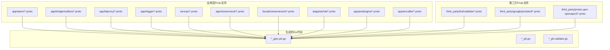

**图表来源**
- [alarm.proto:1-34](file://app/alarm/alarm.proto#L1-L34)
- [bridgemodbus.proto:1-355](file://app/bridgemodbus/bridgemodbus.proto#L1-L355)
- [lalproxy.proto:1-308](file://app/lalproxy/lalproxy.proto#L1-L308)
- [aichat.proto:1-419](file://aiapp/aichat/aichat.proto#L1-L419)

**章节来源**
- [go.mod:1-245](file://go.mod#L1-L245)

## 核心组件

### 基础消息类型系统

Zero-Service中的protobuf定义涵盖了所有标准的Protocol Buffers数据类型：

| 数据类型 | 用途示例 | 字节序 |
|---------|---------|--------|
| int32/uint32 | 短整型数值 | 小端序 |
| int64/uint64 | 长整型数值 | 小端序 |
| float/double | 浮点数值 | IEEE 754 |
| bool | 布尔值 | 单字节 |
| string | 文本数据 | UTF-8编码 |
| bytes | 二进制数据 | 原始字节 |

### 服务定义模式

所有gRPC服务都遵循统一的模式：

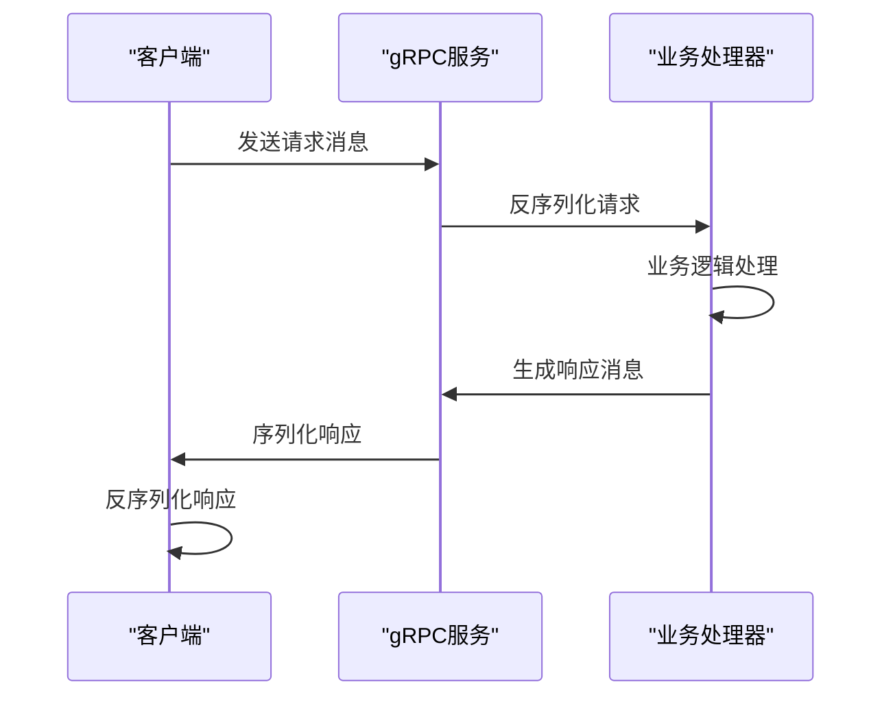

**图表来源**
- [alarm.proto:30-33](file://app/alarm/alarm.proto#L30-L33)
- [zerorpc.proto:140-166](file://zerorpc/zerorpc.proto#L140-L166)

### 验证机制集成

项目集成了buf.validate验证框架，提供了强大的数据验证能力：

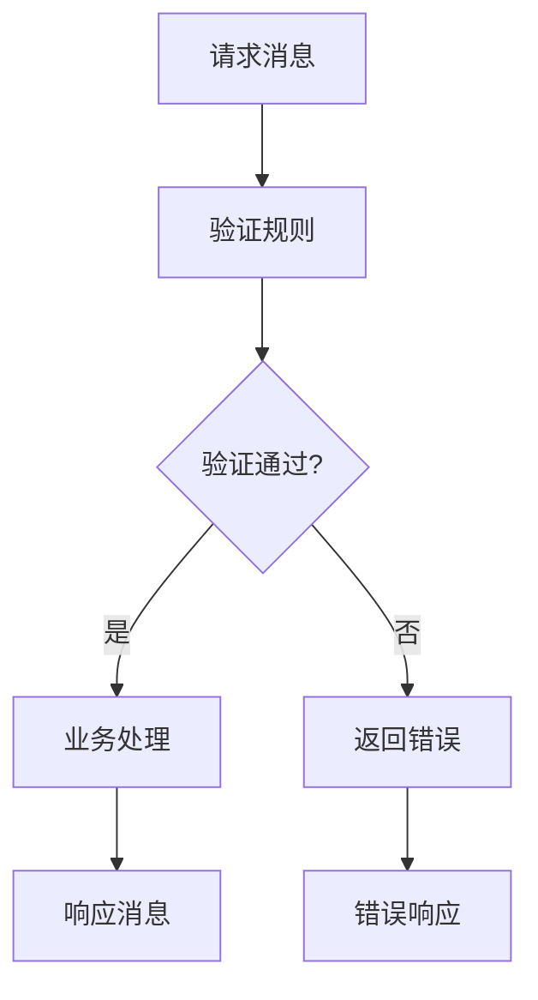

**图表来源**
- [trigger.proto:5-7](file://app/trigger/trigger.proto#L5-L7)
- [validate.proto:1-800](file://third_party/buf/validate/validate.proto#L1-L800)

**章节来源**
- [descriptor.proto:133-716](file://third_party/google/protobuf/descriptor.proto#L133-L716)

## 架构概览

Zero-Service的protobuf架构采用分层设计，从底层的序列化机制到上层的业务逻辑：

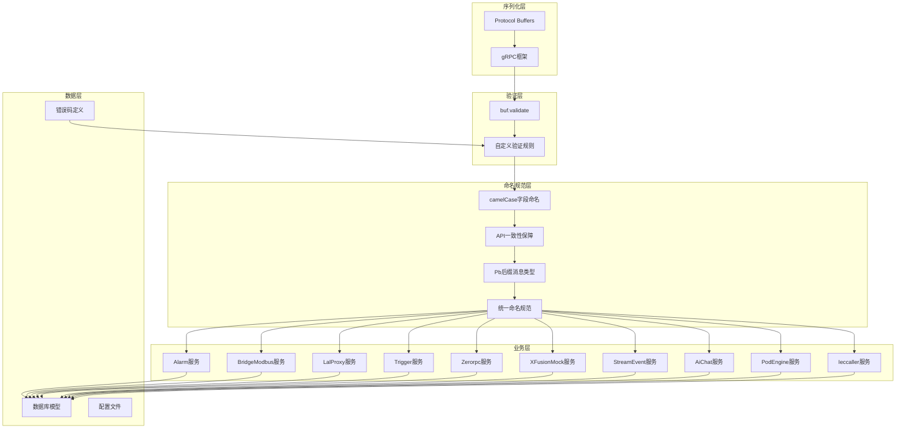

**图表来源**
- [trigger.proto:1-12](file://app/trigger/trigger.proto#L1-L12)
- [xfusionmock.proto:1-303](file://app/xfusionmock/xfusionmock.proto#L1-L303)
- [aichat.proto:388-419](file://aiapp/aichat/aichat.proto#L388-L419)

## 详细组件分析

### Alarm服务组件

Alarm服务是最简单的protobuf定义示例：

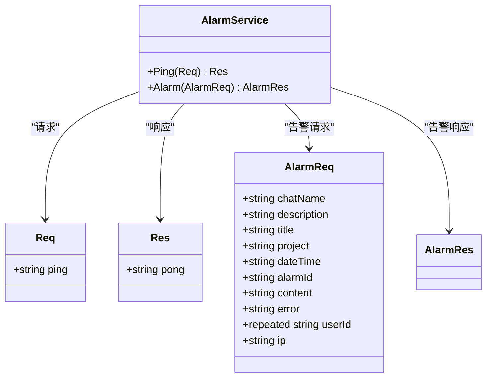

**图表来源**
- [alarm.proto:6-28](file://app/alarm/alarm.proto#L6-L28)

**章节来源**
- [alarm.proto:1-34](file://app/alarm/alarm.proto#L1-L34)

### BridgeModbus服务组件

BridgeModbus服务展示了复杂的消息定义模式：

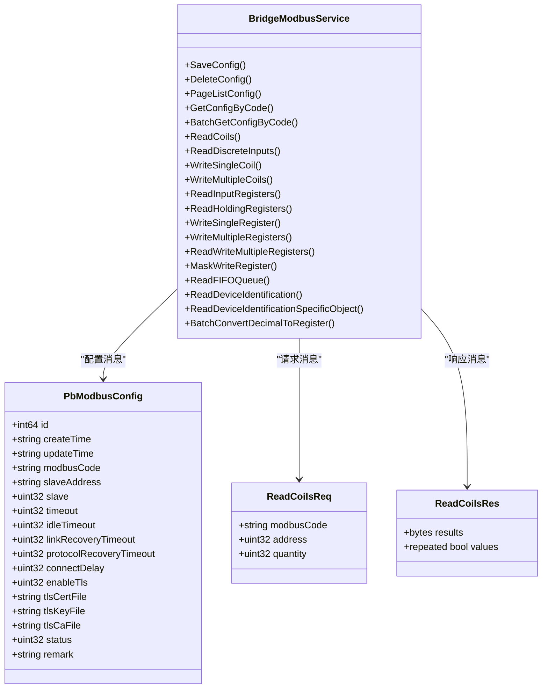

**图表来源**
- [bridgemodbus.proto:85-161](file://app/bridgemodbus/bridgemodbus.proto#L85-L161)

**章节来源**
- [bridgemodbus.proto:1-355](file://app/bridgemodbus/bridgemodbus.proto#L1-L355)

### LalProxy服务组件

LalProxy服务定义了复杂的嵌套消息结构：

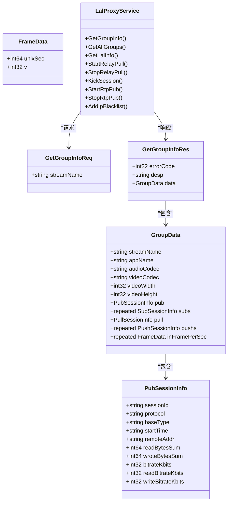

**图表来源**
- [lalproxy.proto:11-118](file://app/lalproxy/lalproxy.proto#L11-L118)

**章节来源**
- [lalproxy.proto:1-308](file://app/lalproxy/lalproxy.proto#L1-L308)

### Trigger服务组件

Trigger服务展示了高级验证特性的使用：

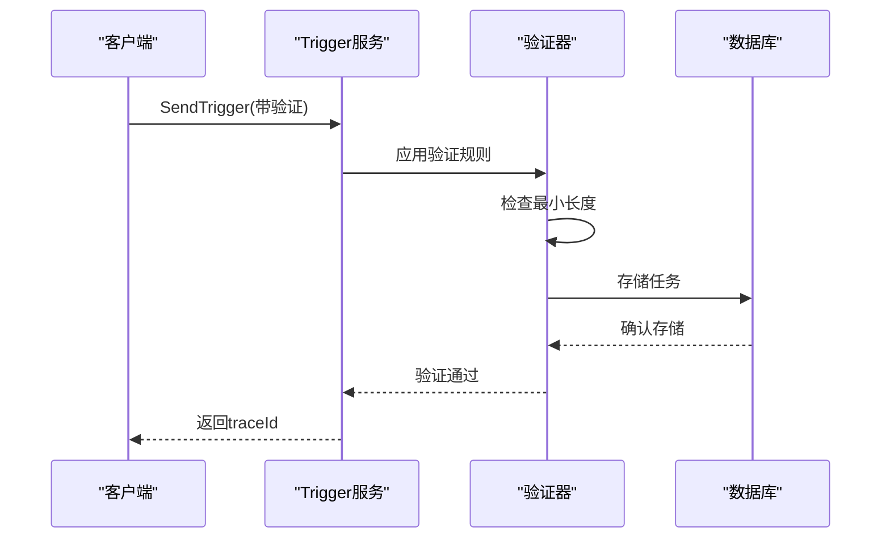

**图表来源**
- [trigger.proto:300-305](file://app/trigger/trigger.proto#L300-L305)

**章节来源**
- [trigger.proto:1-800](file://app/trigger/trigger.proto#L1-L800)

### Zerorpc服务组件

Zerorpc服务定义了用户管理和认证相关的消息：

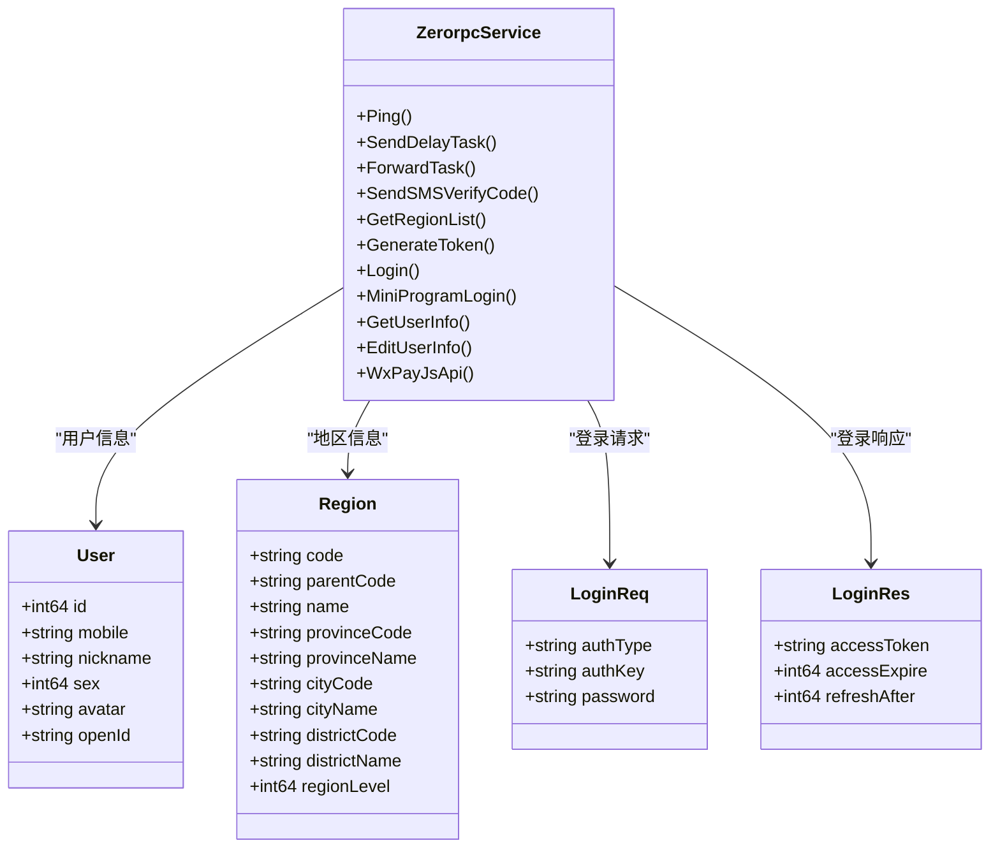

**图表来源**
- [zerorpc.proto:115-122](file://zerorpc/zerorpc.proto#L115-L122)

**章节来源**
- [zerorpc.proto:1-167](file://zerorpc/zerorpc.proto#L1-L167)

### XFusionMock服务组件

XFusionMock服务展示了复杂的嵌套消息结构和JSON映射：

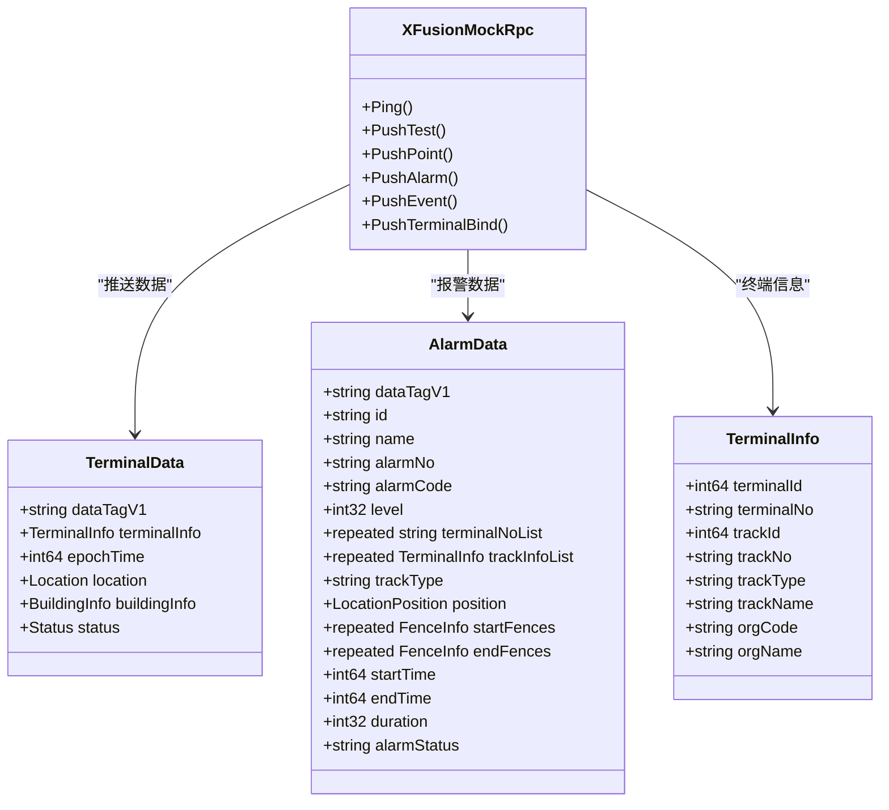

**图表来源**
- [xfusionmock.proto:137-187](file://app/xfusionmock/xfusionmock.proto#L137-L187)

**章节来源**
- [xfusionmock.proto:1-303](file://app/xfusionmock/xfusionmock.proto#L1-L303)

### StreamEvent服务组件

StreamEvent服务展示了IEC104协议相关的复杂消息结构：

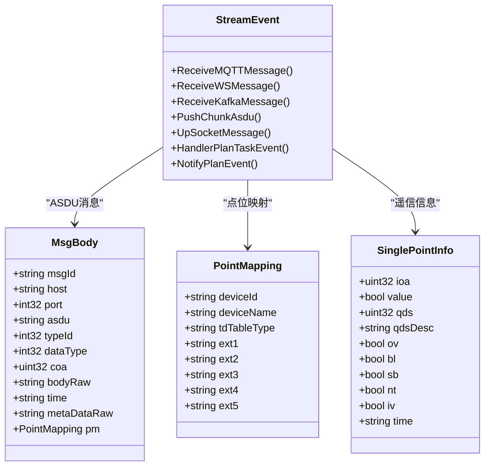

**图表来源**
- [streamevent.proto:91-133](file://facade/streamevent/streamevent.proto#L91-L133)

**章节来源**
- [streamevent.proto:1-581](file://facade/streamevent/streamevent.proto#L1-L581)

### AiChat服务组件

AiChat服务展示了AI聊天相关的复杂消息结构，体现了新的字段命名规范：

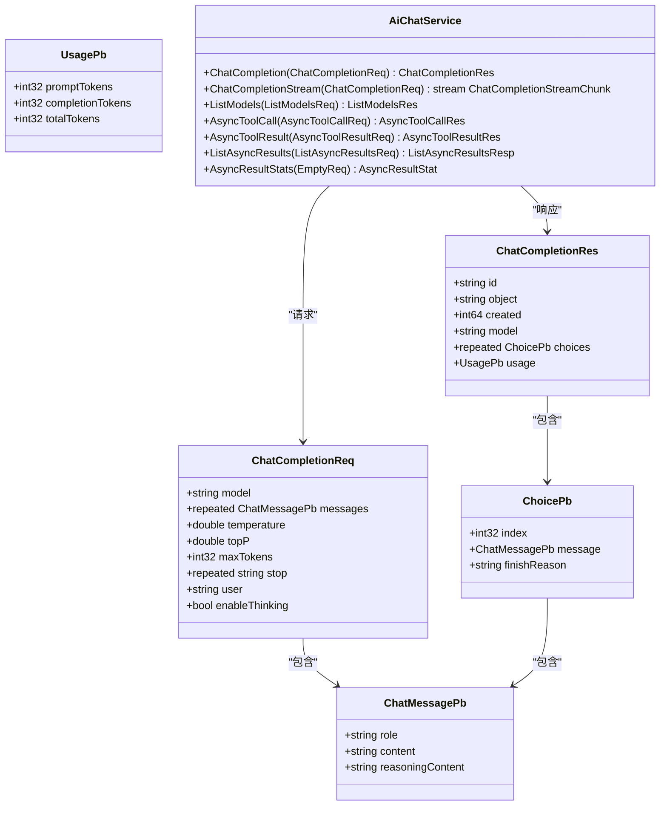

**图表来源**
- [aichat.proto:17-76](file://aiapp/aichat/aichat.proto#L17-L76)
- [aichat.proto:78-125](file://aiapp/aichat/aichat.proto#L78-L125)

**章节来源**
- [aichat.proto:1-419](file://aiapp/aichat/aichat.proto#L1-L419)

## 字段命名规范

### camelCase命名约定

Zero-Service项目现已实施统一的字段命名规范，所有protobuf字段采用camelCase命名约定：

#### 命名规则

1. **字段命名**：使用小驼峰命名法（camelCase）
   - 示例：`unixSec`、`streamName`、`modbusCode`、`reasoningContent`、`topP`
   - 避免使用下划线或连字符

2. **JSON映射**：通过`json_name`选项保持JSON API一致性
   - 示例：`unixSec` → `"unixSec"`、`sessionId` → `"sessionId"`
   - 确保跨语言API的一致性

3. **字段选择**：优先使用语义明确的英文单词组合
   - 避免缩写和不清晰的简写
   - 保持字段名称的可读性和一致性

#### 命名规范示例

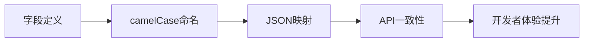

**图表来源**
- [lalproxy.proto:12-16](file://app/lalproxy/lalproxy.proto#L12-L16)
- [streamevent.proto:94-113](file://facade/streamevent/streamevent.proto#L94-L113)

#### 字段命名最佳实践

1. **一致性原则**
   - 所有新字段必须遵循camelCase命名
   - 现有字段逐步迁移至新规范
   - 保持跨服务的一致性

2. **可读性原则**
   - 字段名称应清晰表达其含义
   - 避免使用过于简短或模糊的名称
   - 保持字段名称的语义完整性

3. **兼容性原则**
   - 通过`json_name`选项保持向后兼容
   - 确保现有客户端不受影响
   - 渐进式迁移策略

**章节来源**
- [descriptor.proto:209-213](file://third_party/google/protobuf/descriptor.proto#L209-L213)
- [lalproxy.proto:12-118](file://app/lalproxy/lalproxy.proto#L12-L118)

## 消息类型命名规范

### Pb后缀命名约定

Zero-Service项目在消息类型命名方面引入了统一的Pb后缀规范，以提高代码的可读性和维护性：

#### 命名规则

1. **消息类型命名**：在消息类型名称后添加Pb后缀
   - 示例：`PbPlan`、`PbDevicePointMapping`、`PbModbusConfig`
   - 枚举类型同样采用Pb后缀：`PodPhasePb`、`ExecItemStatusPb`

2. **命名目的**
   - 区分protobuf消息类型与其他Go类型
   - 提高代码可读性，明确标识为Protocol Buffers生成的类型
   - 避免命名冲突，特别是在复杂的业务逻辑中

3. **应用场景**
   - 复杂的业务实体消息：`PbPlan`、`PbDevicePointMapping`
   - 状态枚举：`PodPhasePb`、`ExecItemStatusPb`
   - 容器和Pod相关消息：`ContainerPb`、`PodPb`

#### Pb后缀命名示例

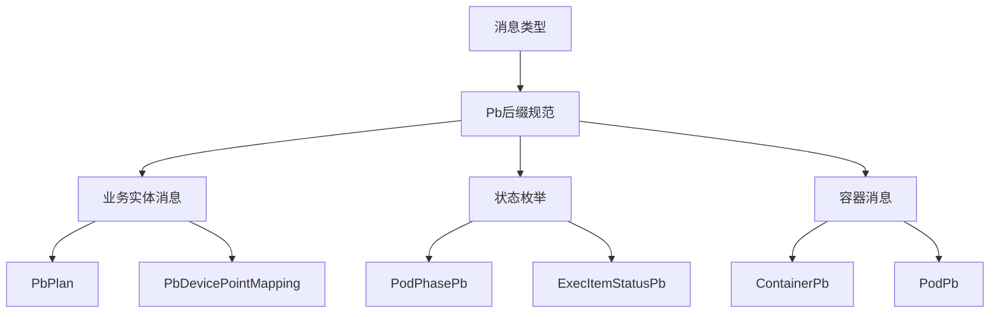

**图表来源**
- [podengine.proto:461-499](file://app/podengine/podengine.proto#L461-L499)
- [trigger.proto:108-122](file://app/trigger/trigger.proto#L108-L122)

#### Pb后缀命名最佳实践

1. **一致性原则**
   - 所有新的消息类型必须遵循Pb后缀规范
   - 现有类型逐步迁移至新规范
   - 保持命名风格的一致性

2. **可读性原则**
   - Pb后缀应清晰表明这是protobuf生成的消息类型
   - 避免与业务逻辑中的其他类型混淆
   - 保持命名的简洁性和语义性

3. **维护性原则**
   - Pb后缀有助于代码审查和调试
   - 提高团队协作效率
   - 便于工具链的识别和处理

**章节来源**
- [podengine.proto:33-178](file://app/podengine/podengine.proto#L33-L178)
- [trigger.proto:108-214](file://app/trigger/trigger.proto#L108-L214)

## 依赖关系分析

### 第三方库依赖

项目中的protobuf相关依赖关系：

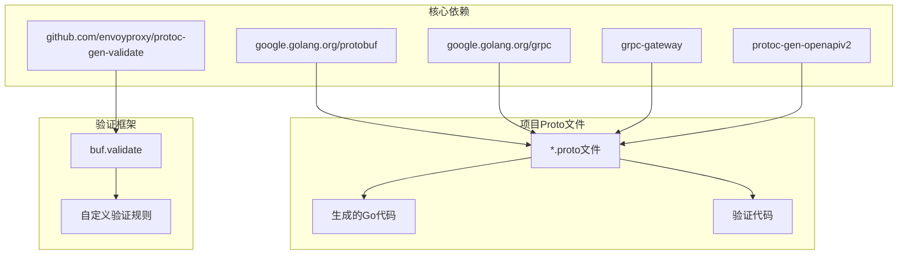

**图表来源**
- [go.mod:57-59](file://go.mod#L57-L59)
- [go.mod:18-18](file://go.mod#L18-L18)

**章节来源**
- [go.mod:1-245](file://go.mod#L1-L245)

### 错误码管理系统

项目实现了完整的错误码定义系统：

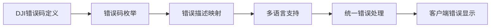

**图表来源**
- [dji_error_code.proto:13-513](file://third_party/dji_error_code.proto#L13-L513)

**章节来源**
- [dji_error_code.proto:1-513](file://third_party/dji_error_code.proto#L1-L513)

## 性能考虑

### 序列化性能优化

Protocol Buffers在Zero-Service中的性能优势体现在：

1. **二进制序列化**：相比JSON/XML，protobuf序列化更紧凑，传输效率更高
2. **零拷贝支持**：某些场景下可以避免不必要的内存复制
3. **类型安全**：编译时检查确保消息格式正确性
4. **向后兼容**：支持字段的添加、删除而不破坏现有客户端
5. **命名优化**：camelCase命名减少字段查找和映射开销
6. **Pb后缀优化**：通过Pb后缀快速识别protobuf生成类型，提升开发效率

### 内存使用优化

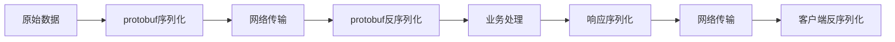

**图表来源**
- [descriptor.proto:378-385](file://third_party/google/protobuf/descriptor.proto#L378-L385)

## 故障排除指南

### 常见问题诊断

1. **序列化错误**
   - 检查字段标签分配是否冲突
   - 验证消息结构是否符合定义
   - 确认字段类型匹配

2. **验证失败**
   - 检查buf.validate规则配置
   - 验证数据格式和范围
   - 确认必填字段完整性

3. **gRPC连接问题**
   - 检查服务端口监听
   - 验证TLS证书配置
   - 确认防火墙设置

4. **命名规范问题**
   - 检查字段是否符合camelCase规范
   - 验证JSON映射是否正确
   - 确认API一致性
   - 检查Pb后缀消息类型命名

5. **字段命名迁移问题**
   - 确认reasoningContent字段是否正确使用
   - 验证topP字段的命名一致性
   - 检查JSON API映射是否正确

**章节来源**
- [validate.proto:28-74](file://third_party/buf/validate/validate.proto#L28-L74)

## 结论

Zero-Service项目中的Protocol Buffers序列化机制展现了现代微服务架构的最佳实践。通过精心设计的消息定义、严格的验证机制、完善的错误处理、统一的字段命名规范和新增的消息类型命名规范，项目实现了高效、可靠的服务间通信。

关键优势包括：
- **高性能**：二进制序列化提供优秀的传输效率
- **强类型**：编译时检查确保数据完整性
- **向后兼容**：支持服务演进而无需破坏客户端
- **验证集成**：内置数据验证机制提升系统可靠性
- **命名规范**：统一的camelCase命名提升开发者体验
- **API一致性**：通过JSON映射确保跨语言API一致性
- **消息类型规范**：Pb后缀命名提高代码可读性和维护性
- **多语言支持**：统一的接口定义支持多种编程语言

这种基于Protocol Buffers的设计为Zero-Service奠定了坚实的技术基础，使其能够支撑复杂的分布式系统需求。统一的字段命名规范和消息类型命名规范进一步增强了系统的可维护性和开发效率，为未来的功能扩展提供了良好的基础。

**更新** 最新的字段命名标准化（reasoningContent、topP等）和消息类型命名规范（Pb后缀）显著提升了代码质量和API一致性，为开发者提供了更好的开发体验。