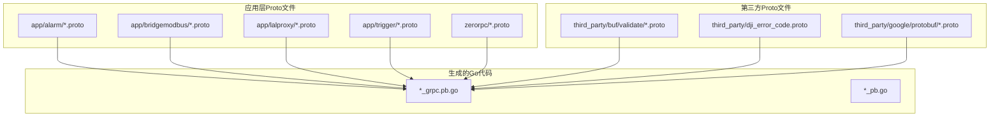
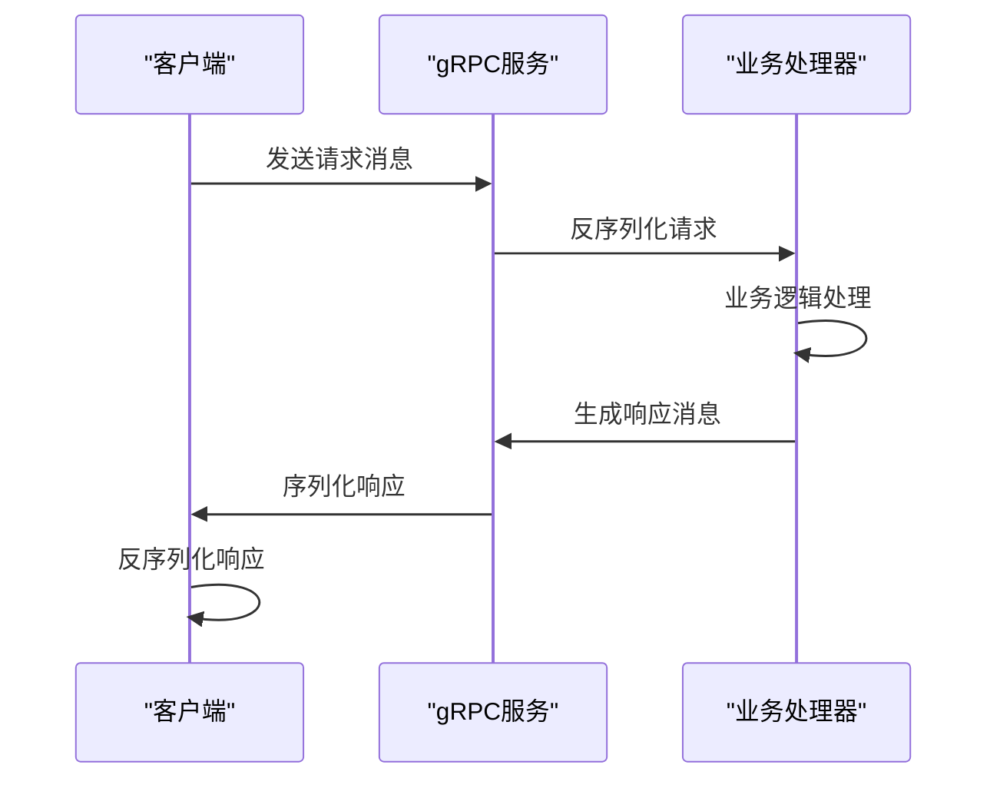
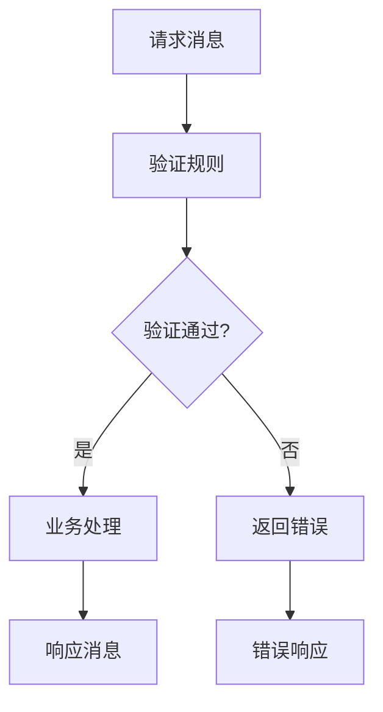
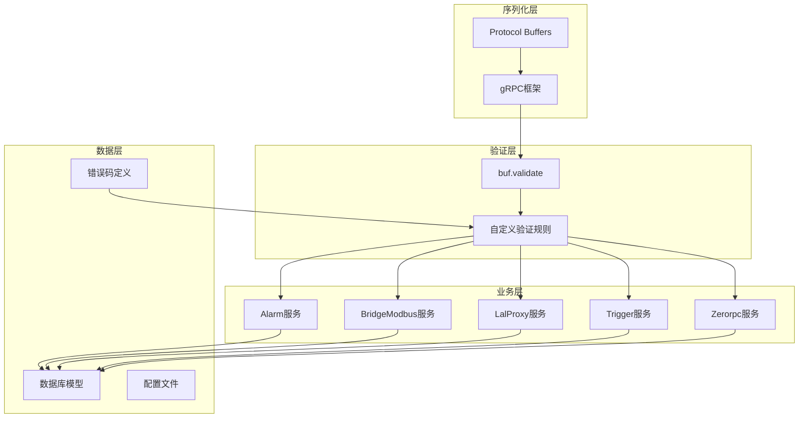
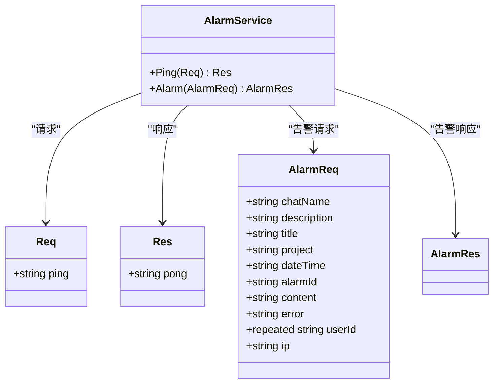
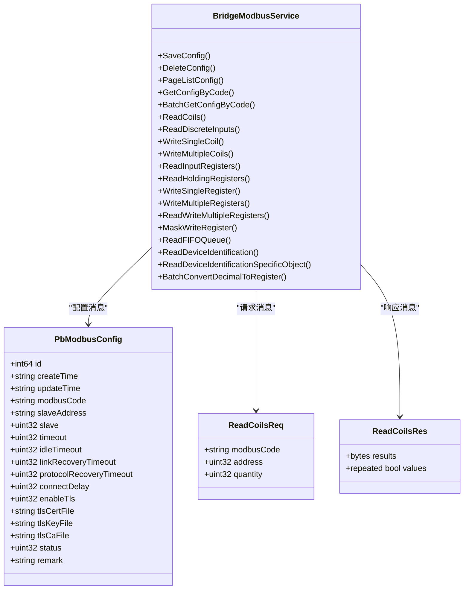
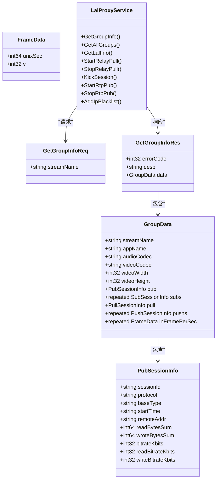
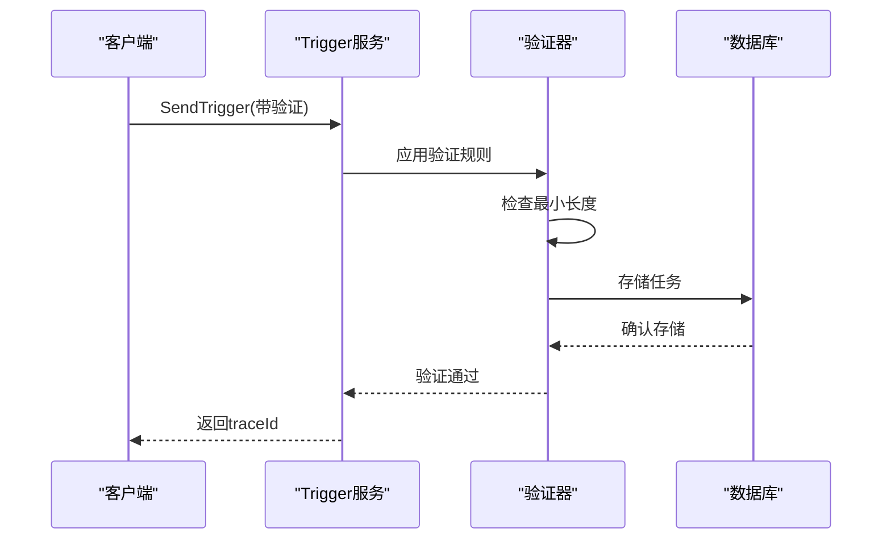
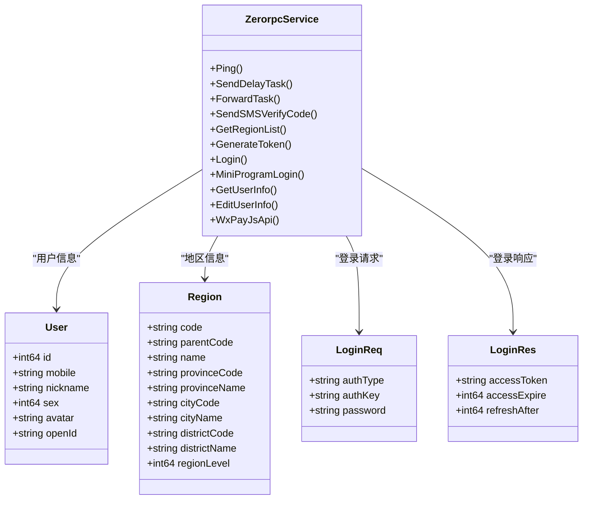
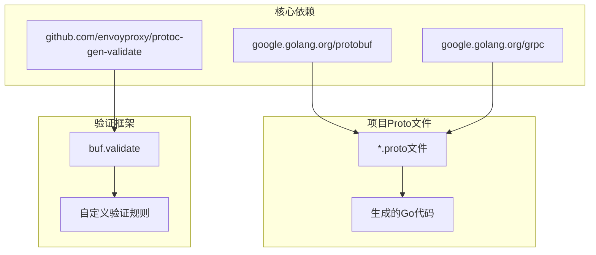

# Protocol Buffers序列化机制

<cite>
**本文档引用的文件**
- [alarm.proto](file://app/alarm/alarm.proto)
- [bridgemodbus.proto](file://app/bridgemodbus/bridgemodbus.proto)
- [lalproxy.proto](file://app/lalproxy/lalproxy.proto)
- [trigger.proto](file://app/trigger/trigger.proto)
- [zerorpc.proto](file://zerorpc/zerorpc.proto)
- [validate.proto](file://third_party/buf/validate/validate.proto)
- [dji_error_code.proto](file://third_party/dji_error_code.proto)
- [descriptor.proto](file://third_party/google/protobuf/descriptor.proto)
- [go.mod](file://go.mod)
</cite>

## 目录
1. [引言](#引言)
2. [项目结构](#项目结构)
3. [核心组件](#核心组件)
4. [架构概览](#架构概览)
5. [详细组件分析](#详细组件分析)
6. [依赖关系分析](#依赖关系分析)
7. [性能考虑](#性能考虑)
8. [故障排除指南](#故障排除指南)
9. [结论](#结论)

## 引言

Zero-Service项目采用了Protocol Buffers作为gRPC通信的核心序列化机制。Protocol Buffers（简称protobuf）是Google开发的一种语言无关、平台无关的序列化数据结构的方法，它将结构化数据序列化为紧凑的二进制格式。

在Zero-Service中，protobuf不仅用于服务间通信，还承担着数据持久化、配置管理、错误码定义等多重职责。项目中包含了30多个完整的protobuf定义文件，涵盖了从基础的gRPC服务定义到复杂的企业级业务逻辑建模。

## 项目结构

Zero-Service项目中的Protocol Buffers相关文件分布如下：

**图表来源**
- [alarm.proto:1-34](file://app/alarm/alarm.proto#L1-L34)
- [bridgemodbus.proto:1-355](file://app/bridgemodbus/bridgemodbus.proto#L1-L355)
- [lalproxy.proto:1-308](file://app/lalproxy/lalproxy.proto#L1-L308)

**章节来源**
- [go.mod:1-245](file://go.mod#L1-L245)

## 核心组件

### 基础消息类型系统

Zero-Service中的protobuf定义涵盖了所有标准的Protocol Buffers数据类型：

| 数据类型 | 用途示例 | 字节序 |
|---------|---------|--------|
| int32/uint32 | 短整型数值 | 小端序 |
| int64/uint64 | 长整型数值 | 小端序 |
| float/double | 浮点数值 | IEEE 754 |
| bool | 布尔值 | 单字节 |
| string | 文本数据 | UTF-8编码 |
| bytes | 二进制数据 | 原始字节 |

### 服务定义模式

所有gRPC服务都遵循统一的模式：

**图表来源**
- [alarm.proto:30-33](file://app/alarm/alarm.proto#L30-L33)
- [zerorpc.proto:140-166](file://zerorpc/zerorpc.proto#L140-L166)

### 验证机制集成

项目集成了buf.validate验证框架，提供了强大的数据验证能力：

**图表来源**
- [trigger.proto:5-7](file://app/trigger/trigger.proto#L5-L7)
- [validate.proto:1-800](file://third_party/buf/validate/validate.proto#L1-L800)

**章节来源**
- [descriptor.proto:133-716](file://third_party/google/protobuf/descriptor.proto#L133-L716)

## 架构概览

Zero-Service的protobuf架构采用分层设计，从底层的序列化机制到上层的业务逻辑：

**图表来源**
- [trigger.proto:1-12](file://app/trigger/trigger.proto#L1-L12)
- [dji_error_code.proto:1-513](file://third_party/dji_error_code.proto#L1-L513)

## 详细组件分析

### Alarm服务组件

Alarm服务是最简单的protobuf定义示例：

**图表来源**
- [alarm.proto:6-28](file://app/alarm/alarm.proto#L6-L28)

**章节来源**
- [alarm.proto:1-34](file://app/alarm/alarm.proto#L1-L34)

### BridgeModbus服务组件

BridgeModbus服务展示了复杂的消息定义模式：

**图表来源**
- [bridgemodbus.proto:85-161](file://app/bridgemodbus/bridgemodbus.proto#L85-L161)

**章节来源**
- [bridgemodbus.proto:1-355](file://app/bridgemodbus/bridgemodbus.proto#L1-L355)

### LalProxy服务组件

LalProxy服务定义了复杂的嵌套消息结构：

**图表来源**
- [lalproxy.proto:11-118](file://app/lalproxy/lalproxy.proto#L11-L118)

**章节来源**
- [lalproxy.proto:1-308](file://app/lalproxy/lalproxy.proto#L1-L308)

### Trigger服务组件

Trigger服务展示了高级验证特性的使用：

**图表来源**
- [trigger.proto:300-305](file://app/trigger/trigger.proto#L300-L305)

**章节来源**
- [trigger.proto:1-800](file://app/trigger/trigger.proto#L1-L800)

### Zerorpc服务组件

Zerorpc服务定义了用户管理和认证相关的消息：

**图表来源**
- [zerorpc.proto:115-122](file://zerorpc/zerorpc.proto#L115-L122)

**章节来源**
- [zerorpc.proto:1-167](file://zerorpc/zerorpc.proto#L1-L167)

## 依赖关系分析

### 第三方库依赖

项目中的protobuf相关依赖关系：

**图表来源**
- [go.mod:57-59](file://go.mod#L57-L59)
- [go.mod:18-18](file://go.mod#L18-L18)

**章节来源**
- [go.mod:1-245](file://go.mod#L1-L245)

### 错误码管理系统

项目实现了完整的错误码定义系统：

**图表来源**
- [dji_error_code.proto:13-513](file://third_party/dji_error_code.proto#L13-L513)

**章节来源**
- [dji_error_code.proto:1-513](file://third_party/dji_error_code.proto#L1-L513)

## 性能考虑

### 序列化性能优化

Protocol Buffers在Zero-Service中的性能优势体现在：

1. **二进制序列化**：相比JSON/XML，protobuf序列化更紧凑，传输效率更高
2. **零拷贝支持**：某些场景下可以避免不必要的内存复制
3. **类型安全**：编译时检查确保消息格式正确性
4. **向后兼容**：支持字段的添加、删除而不破坏现有客户端

### 内存使用优化

**图表来源**
- [descriptor.proto:378-385](file://third_party/google/protobuf/descriptor.proto#L378-L385)

## 故障排除指南

### 常见问题诊断

1. **序列化错误**
   - 检查字段标签分配是否冲突
   - 验证消息结构是否符合定义
   - 确认字段类型匹配

2. **验证失败**
   - 检查buf.validate规则配置
   - 验证数据格式和范围
   - 确认必填字段完整性

3. **gRPC连接问题**
   - 检查服务端口监听
   - 验证TLS证书配置
   - 确认防火墙设置

**章节来源**
- [validate.proto:28-74](file://third_party/buf/validate/validate.proto#L28-L74)

## 结论

Zero-Service项目中的Protocol Buffers序列化机制展现了现代微服务架构的最佳实践。通过精心设计的消息定义、严格的验证机制和完善的错误处理，项目实现了高效、可靠的服务间通信。

关键优势包括：
- **高性能**：二进制序列化提供优秀的传输效率
- **强类型**：编译时检查确保数据完整性
- **向后兼容**：支持服务演进而无需破坏客户端
- **验证集成**：内置数据验证机制提升系统可靠性
- **多语言支持**：统一的接口定义支持多种编程语言

这种基于Protocol Buffers的设计为Zero-Service奠定了坚实的技术基础，使其能够支撑复杂的分布式系统需求。