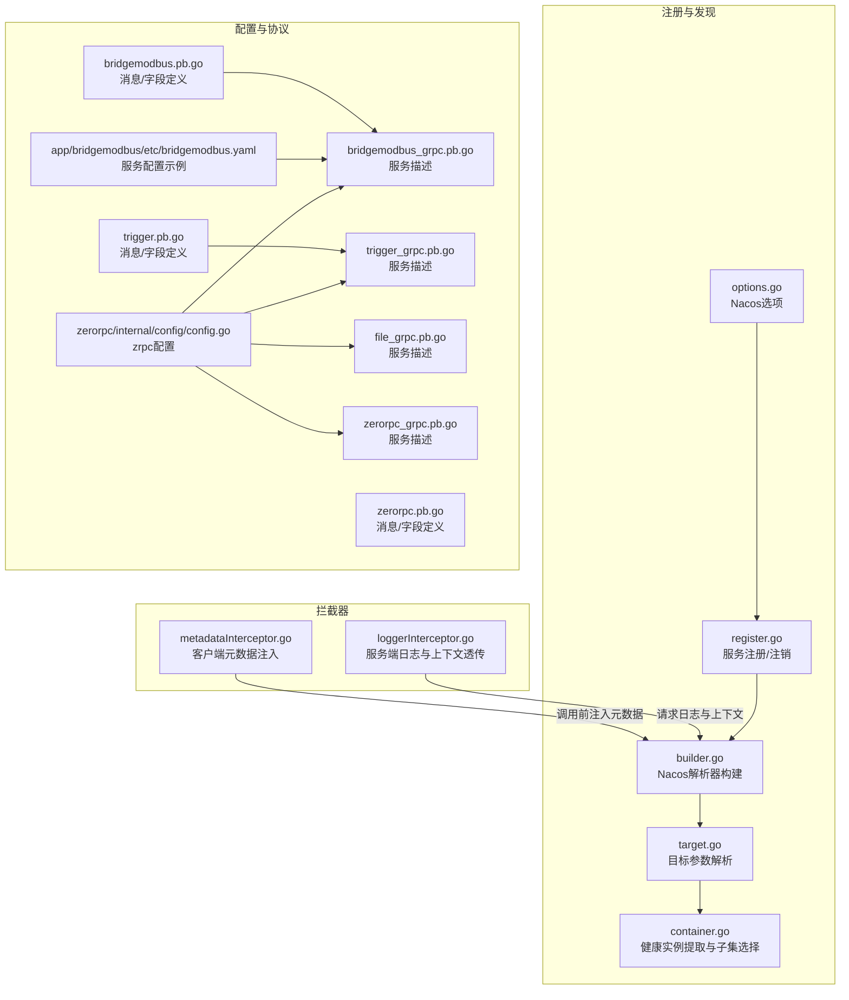
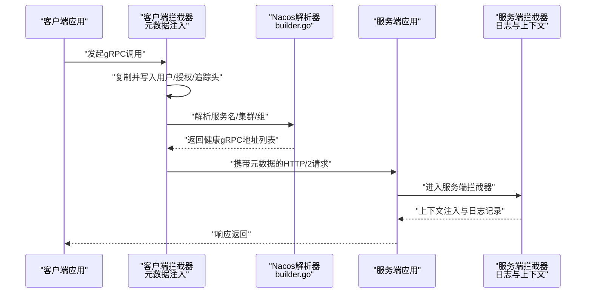
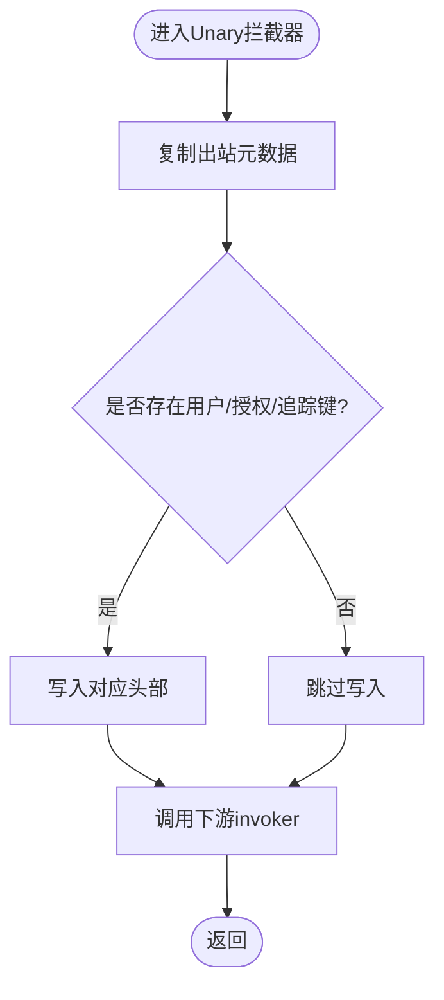
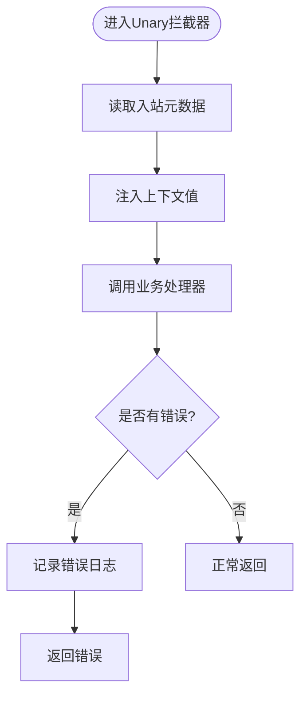
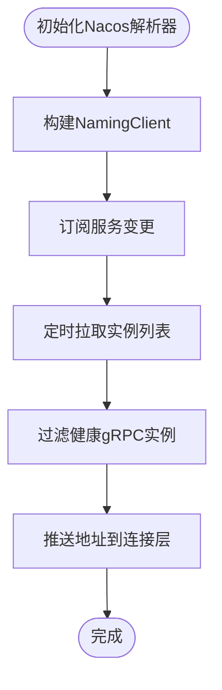
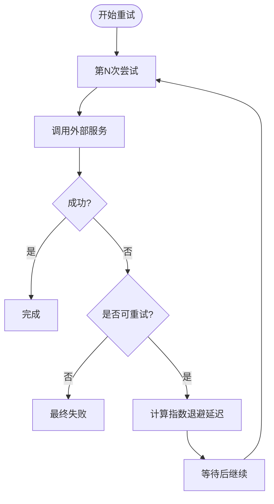
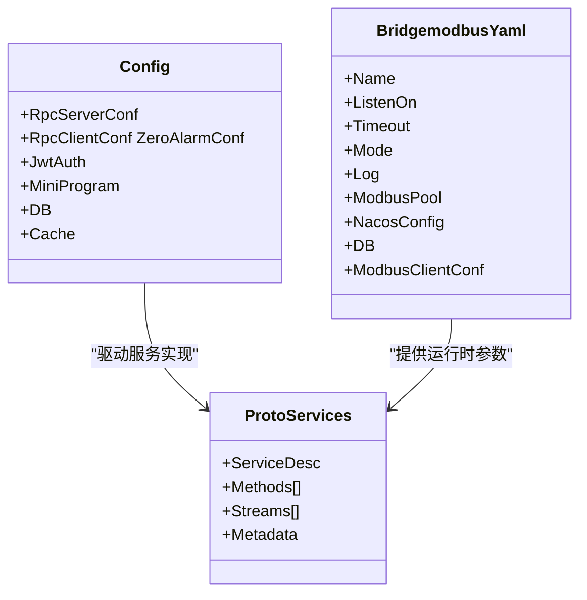
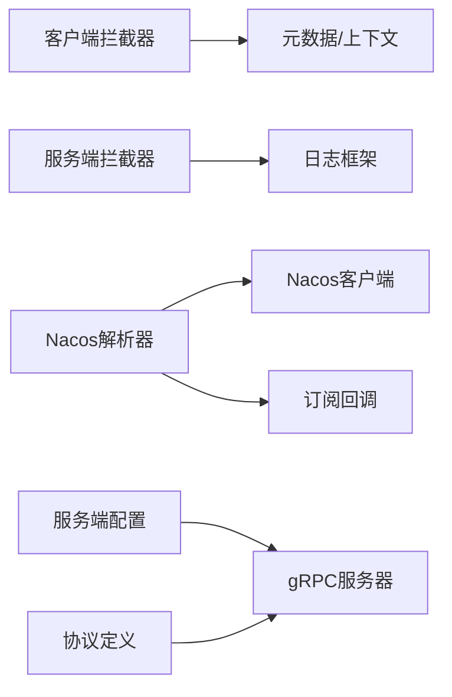

# gRPC性能优化与调试

<cite>
**本文引用的文件**
- [metadataInterceptor.go](file://common/Interceptor/rpcclient/metadataInterceptor.go)
- [loggerInterceptor.go](file://common/Interceptor/rpcserver/loggerInterceptor.go)
- [errorhandler.go](file://common/gtwx/errorhandler.go)
- [backoff.go](file://common/tool/backoff.go)
- [options.go](file://common/nacosx/options.go)
- [register.go](file://common/nacosx/register.go)
- [builder.go](file://common/nacosx/builder.go)
- [target.go](file://common/nacosx/target.go)
- [container.go](file://common/socketiox/container.go)
- [config.go](file://zerorpc/internal/config/config.go)
- [bridgemodbus.yaml](file://app/bridgemodbus/etc/bridgemodbus.yaml)
- [bridgemodbus_grpc.pb.go](file://app/bridgemodbus/bridgemodbus/bridgemodbus_grpc.pb.go)
- [bridgemodbus.pb.go](file://app/bridgemodbus/bridgemodbus/bridgemodbus.pb.go)
- [trigger_grpc.pb.go](file://app/trigger/trigger/trigger_grpc.pb.go)
- [trigger.pb.go](file://app/trigger/trigger/trigger.pb.go)
- [file_grpc.pb.go](file://app/file/file/file_grpc.pb.go)
- [zerorpc_grpc.pb.go](file://zerorpc/zerorpc/zerorpc_grpc.pb.go)
- [zerorpc.pb.go](file://zerorpc/zerorpc/zerorpc.pb.go)
- [rpc-patterns.md](file://.trae/skills/zero-skills/references/rpc-patterns.md)
- [resilience-patterns.md](file://.trae/skills/zero-skills/references/resilience-patterns.md)
</cite>

## 目录
1. [简介](#简介)
2. [项目结构](#项目结构)
3. [核心组件](#核心组件)
4. [架构总览](#架构总览)
5. [详细组件分析](#详细组件分析)
6. [依赖分析](#依赖分析)
7. [性能考虑](#性能考虑)
8. [故障排查指南](#故障排查指南)
9. [结论](#结论)
10. [附录](#附录)

## 简介
本文件面向Zero-Service中的gRPC子系统，提供一套完整的性能优化与调试实践指南。内容覆盖HTTP/2连接复用、压缩与流控、连接池与超时重试策略、调试工具链（grpcurl、可视化工具、Wireshark）、以及可观测性与指标采集建议。文档以仓库中实际代码为依据，结合项目中的拦截器、注册与发现、配置样例与协议定义，帮助读者在生产环境中稳定、高效地运行gRPC服务。

## 项目结构
与gRPC相关的关键位置：
- 拦截器层：客户端元数据注入、服务端日志与上下文透传
- 注册与发现：基于Nacos的服务注册、订阅与健康实例筛选
- 配置样例：服务端监听、超时、连接池大小、Nacos参数
- 协议定义：各模块的pb.go与grpc描述，用于理解方法、消息与服务边界
- 可靠性模式：超时与指数退避重试的通用实现

图表来源
- [metadataInterceptor.go:11-32](file://common/Interceptor/rpcclient/metadataInterceptor.go#L11-L32)
- [loggerInterceptor.go:12-44](file://common/Interceptor/rpcserver/loggerInterceptor.go#L12-L44)
- [options.go:11-41](file://common/nacosx/options.go#L11-L41)
- [register.go:21-76](file://common/nacosx/register.go#L21-L76)
- [builder.go:41-112](file://common/nacosx/builder.go#L41-L112)
- [target.go:38-79](file://common/nacosx/target.go#L38-L79)
- [container.go:318-346](file://common/socketiox/container.go#L318-L346)
- [config.go:8-24](file://zerorpc/internal/config/config.go#L8-L24)
- [bridgemodbus.yaml:1-26](file://app/bridgemodbus/etc/bridgemodbus.yaml#L1-L26)
- [bridgemodbus_grpc.pb.go:186-205](file://app/bridgemodbus/bridgemodbus/bridgemodbus_grpc.pb.go#L186-L205)
- [bridgemodbus.pb.go:33-40](file://app/bridgemodbus/bridgemodbus/bridgemodbus.pb.go#L33-L40)
- [trigger_grpc.pb.go:793-827](file://app/trigger/trigger/trigger_grpc.pb.go#L793-L827)
- [trigger.pb.go:7114-7135](file://app/trigger/trigger/trigger.pb.go#L7114-L7135)
- [file_grpc.pb.go:317-351](file://app/file/file/file_grpc.pb.go#L317-L351)
- [zerorpc_grpc.pb.go:251-285](file://zerorpc/zerorpc/zerorpc_grpc.pb.go#L251-L285)
- [zerorpc.pb.go:1569-1591](file://zerorpc/zerorpc/zerorpc.pb.go#L1569-L1591)

章节来源
- [metadataInterceptor.go:11-32](file://common/Interceptor/rpcclient/metadataInterceptor.go#L11-L32)
- [loggerInterceptor.go:12-44](file://common/Interceptor/rpcserver/loggerInterceptor.go#L12-L44)
- [options.go:11-41](file://common/nacosx/options.go#L11-L41)
- [register.go:21-76](file://common/nacosx/register.go#L21-L76)
- [builder.go:41-112](file://common/nacosx/builder.go#L41-L112)
- [target.go:38-79](file://common/nacosx/target.go#L38-L79)
- [container.go:318-346](file://common/socketiox/container.go#L318-L346)
- [config.go:8-24](file://zerorpc/internal/config/config.go#L8-L24)
- [bridgemodbus.yaml:1-26](file://app/bridgemodbus/etc/bridgemodbus.yaml#L1-L26)
- [bridgemodbus_grpc.pb.go:186-205](file://app/bridgemodbus/bridgemodbus/bridgemodbus_grpc.pb.go#L186-L205)
- [bridgemodbus.pb.go:33-40](file://app/bridgemodbus/bridgemodbus/bridgemodbus.pb.go#L33-L40)
- [trigger_grpc.pb.go:793-827](file://app/trigger/trigger/trigger_grpc.pb.go#L793-L827)
- [trigger.pb.go:7114-7135](file://app/trigger/trigger/trigger.pb.go#L7114-L7135)
- [file_grpc.pb.go:317-351](file://app/file/file/file_grpc.pb.go#L317-L351)
- [zerorpc_grpc.pb.go:251-285](file://zerorpc/zerorpc/zerorpc_grpc.pb.go#L251-L285)
- [zerorpc.pb.go:1569-1591](file://zerorpc/zerorpc/zerorpc.pb.go#L1569-L1591)

## 核心组件
- 客户端元数据拦截器：在每次gRPC调用前向出站上下文注入用户、授权、追踪等头信息，便于服务端统一处理与日志记录。
- 服务端日志拦截器：从入站元数据读取关键头并注入到请求上下文，统一记录错误日志，辅助定位问题。
- Nacos注册与发现：通过Nacos客户端订阅服务列表，按健康状态与gRPC端口过滤实例，动态更新连接目标。
- 超时与重试：结合Go-Zero的retry与指数退避工具，实现客户端侧的自动重试与抖动控制。
- 配置与协议：服务端监听、超时、连接池大小、TLS参数等在配置文件中集中管理；pb定义明确方法与消息结构。

章节来源
- [metadataInterceptor.go:11-32](file://common/Interceptor/rpcclient/metadataInterceptor.go#L11-L32)
- [loggerInterceptor.go:12-44](file://common/Interceptor/rpcserver/loggerInterceptor.go#L12-L44)
- [builder.go:41-112](file://common/nacosx/builder.go#L41-L112)
- [backoff.go:9-40](file://common/tool/backoff.go#L9-L40)
- [bridgemodbus.yaml:1-26](file://app/bridgemodbus/etc/bridgemodbus.yaml#L1-L26)

## 架构总览
下图展示了gRPC在Zero-Service中的典型交互路径：客户端经由拦截器注入元数据，通过Nacos解析器获取健康实例地址，建立HTTP/2长连接；服务端拦截器记录请求上下文与错误；超时与重试策略贯穿两端。

图表来源
- [metadataInterceptor.go:11-32](file://common/Interceptor/rpcclient/metadataInterceptor.go#L11-L32)
- [builder.go:78-112](file://common/nacosx/builder.go#L78-L112)
- [loggerInterceptor.go:12-44](file://common/Interceptor/rpcserver/loggerInterceptor.go#L12-L44)

## 详细组件分析

### 组件A：客户端元数据拦截器
- 功能要点
  - 在每次Unary调用前复制出站元数据，并写入用户ID、用户名、部门编码、授权令牌、追踪ID等头。
  - 流式调用同样支持，确保双向流也能携带上下文。
- 性能影响
  - 元数据体积小，开销可忽略；但应避免频繁写入大对象，保持轻量透传。
- 使用建议
  - 与服务端日志拦截器配合，统一追踪与审计。

图表来源
- [metadataInterceptor.go:11-32](file://common/Interceptor/rpcclient/metadataInterceptor.go#L11-L32)

章节来源
- [metadataInterceptor.go:11-32](file://common/Interceptor/rpcclient/metadataInterceptor.go#L11-L32)

### 组件B：服务端日志拦截器
- 功能要点
  - 从入站元数据读取用户、授权、追踪等键，注入到请求上下文，便于后续日志与业务逻辑使用。
  - 捕获错误并统一输出错误日志，便于快速定位。
- 性能影响
  - 日志记录有I/O成本，建议在高并发场景下调低日志级别或采用异步日志。

图表来源
- [loggerInterceptor.go:12-44](file://common/Interceptor/rpcserver/loggerInterceptor.go#L12-L44)

章节来源
- [loggerInterceptor.go:12-44](file://common/Interceptor/rpcserver/loggerInterceptor.go#L12-L44)

### 组件C：Nacos注册与发现
- 功能要点
  - 通过Nacos客户端注册服务实例，支持权重、集群、分组与元数据。
  - 订阅服务变更，周期性拉取健康实例，过滤仅含gRPC端口且健康启用的实例。
  - 提供目标参数解析，支持环境变量覆盖日志、缓存目录等。
- 性能影响
  - 周期性拉取与订阅会带来网络与CPU开销，需合理设置周期与缓存策略。
  - 健康实例筛选减少无效连接，提升可用性。

图表来源
- [register.go:21-76](file://common/nacosx/register.go#L21-L76)
- [builder.go:78-112](file://common/nacosx/builder.go#L78-L112)
- [container.go:318-346](file://common/socketiox/container.go#L318-L346)
- [target.go:38-79](file://common/nacosx/target.go#L38-L79)

章节来源
- [register.go:21-76](file://common/nacosx/register.go#L21-L76)
- [builder.go:41-112](file://common/nacosx/builder.go#L41-L112)
- [container.go:318-346](file://common/socketiox/container.go#L318-L346)
- [target.go:38-79](file://common/nacosx/target.go#L38-L79)

### 组件D：超时与重试策略
- 指数退避工具
  - 根据失败次数计算下次触发时间，支持指数增长与上限保护，超过阈值固定上限。
- Go-Zero重试模式
  - 支持指定尝试次数、初始延迟、指数退避等，适用于客户端侧对上游服务的重试。
- gRPC状态码映射
  - 将gRPC状态码映射到HTTP状态码，便于网关或反向代理层理解错误语义。

图表来源
- [backoff.go:9-40](file://common/tool/backoff.go#L9-L40)
- [resilience-patterns.md:425-489](file://.trae/skills/zero-skills/references/resilience-patterns.md#L425-L489)
- [rpc-patterns.md:313-368](file://.trae/skills/zero-skills/references/rpc-patterns.md#L313-L368)

章节来源
- [backoff.go:9-40](file://common/tool/backoff.go#L9-L40)
- [resilience-patterns.md:425-489](file://.trae/skills/zero-skills/references/resilience-patterns.md#L425-L489)
- [rpc-patterns.md:313-368](file://.trae/skills/zero-skills/references/rpc-patterns.md#L313-L368)

### 组件E：配置与协议
- 服务端配置
  - 监听地址、超时、日志、数据库、缓存、Nacos注册开关等集中于配置文件。
  - 连接池大小可通过相应字段配置（如ModbusPool），间接影响并发能力。
- 协议定义
  - 各模块的pb.go定义了服务、方法与消息字段，便于客户端生成强类型调用代码。
  - 部分模块在proto中包含TLS与超时相关字段，便于客户端按需启用安全传输与超时控制。

图表来源
- [config.go:8-24](file://zerorpc/internal/config/config.go#L8-L24)
- [bridgemodbus.yaml:1-26](file://app/bridgemodbus/etc/bridgemodbus.yaml#L1-L26)
- [bridgemodbus_grpc.pb.go:186-205](file://app/bridgemodbus/bridgemodbus/bridgemodbus_grpc.pb.go#L186-L205)
- [trigger_grpc.pb.go:793-827](file://app/trigger/trigger/trigger_grpc.pb.go#L793-L827)
- [file_grpc.pb.go:317-351](file://app/file/file/file_grpc.pb.go#L317-L351)
- [zerorpc_grpc.pb.go:251-285](file://zerorpc/zerorpc/zerorpc_grpc.pb.go#L251-L285)

章节来源
- [config.go:8-24](file://zerorpc/internal/config/config.go#L8-L24)
- [bridgemodbus.yaml:1-26](file://app/bridgemodbus/etc/bridgemodbus.yaml#L1-L26)
- [bridgemodbus_grpc.pb.go:186-205](file://app/bridgemodbus/bridgemodbus/bridgemodbus_grpc.pb.go#L186-L205)
- [trigger_grpc.pb.go:793-827](file://app/trigger/trigger/trigger_grpc.pb.go#L793-L827)
- [file_grpc.pb.go:317-351](file://app/file/file/file_grpc.pb.go#L317-L351)
- [zerorpc_grpc.pb.go:251-285](file://zerorpc/zerorpc/zerorpc_grpc.pb.go#L251-L285)

## 依赖分析
- 拦截器依赖
  - 客户端拦截器依赖元数据与上下文数据模块，确保头信息正确注入。
  - 服务端拦截器依赖日志框架与元数据读取，保证上下文与日志一致性。
- 注册与发现依赖
  - Nacos客户端、命名服务、订阅回调与管道通信，形成“拉取+订阅”的双通道实例更新。
- 配置与协议依赖
  - 服务端配置驱动gRPC服务器与客户端配置；协议定义决定方法与消息结构，影响性能与兼容性。

图表来源
- [metadataInterceptor.go:11-32](file://common/Interceptor/rpcclient/metadataInterceptor.go#L11-L32)
- [loggerInterceptor.go:12-44](file://common/Interceptor/rpcserver/loggerInterceptor.go#L12-L44)
- [builder.go:67-83](file://common/nacosx/builder.go#L67-L83)
- [config.go:8-24](file://zerorpc/internal/config/config.go#L8-L24)
- [zerorpc_grpc.pb.go:251-285](file://zerorpc/zerorpc/zerorpc_grpc.pb.go#L251-L285)

章节来源
- [metadataInterceptor.go:11-32](file://common/Interceptor/rpcclient/metadataInterceptor.go#L11-L32)
- [loggerInterceptor.go:12-44](file://common/Interceptor/rpcserver/loggerInterceptor.go#L12-L44)
- [builder.go:67-83](file://common/nacosx/builder.go#L67-L83)
- [config.go:8-24](file://zerorpc/internal/config/config.go#L8-L24)
- [zerorpc_grpc.pb.go:251-285](file://zerorpc/zerorpc/zerorpc_grpc.pb.go#L251-L285)

## 性能考虑
- HTTP/2连接复用
  - gRPC默认基于HTTP/2，建议在客户端与服务端均启用HTTP/2长连接，减少握手开销。
  - 通过Nacos解析器维护健康实例列表，避免频繁DNS解析与连接重建。
- 压缩算法选择
  - 建议在跨地域或带宽受限场景启用压缩（如gzip），但需权衡CPU与延迟。
  - 对于高频小消息，压缩收益有限，优先考虑批量与合并请求。
- 流控机制
  - 合理设置服务端接收缓冲与背压阈值，避免内存压力导致丢弃。
  - 客户端侧控制并发与队列长度，防止瞬时洪峰。
- 连接池配置
  - 服务端：根据CPU核数与I/O特性设置并发处理能力，避免过度并发导致上下文切换开销。
  - 客户端：结合上游服务的并发能力与SLA，设置合理的连接池大小与超时。
- 超时与重试
  - 客户端超时应小于上游服务端处理超时，避免资源占用。
  - 指数退避与抖动结合，避免雪崩效应；对不可重试错误（如超时）避免盲目重试。
- TLS与安全
  - 在跨网络传输中启用TLS，注意证书管理与握手成本。
  - 通过协议定义中的TLS字段按需开启，避免不必要的安全开销。

## 故障排查指南
- gRPC状态码映射
  - 将gRPC状态码映射为HTTP状态码，便于网关层快速判断错误类型（如401、403、429、503等）。
- 错误处理与日志
  - 服务端拦截器统一记录错误日志，结合追踪ID快速定位问题。
  - 客户端侧区分超时、取消与业务错误，采取不同处理策略。
- 调试工具
  - grpcurl：用于命令行调用与验证服务接口，检查方法、消息与元数据。
  - 可视化工具：结合Swagger或OpenAPI导出，辅助接口测试与联调。
  - Wireshark：抓取HTTP/2帧，分析连接复用、流控窗口与错误帧。
- Nacos实例健康
  - 检查gRPC端口元数据、健康状态与启用标志，确保只连接可用实例。
  - 关注订阅回调与定时拉取的异常，避免实例列表陈旧。

章节来源
- [errorhandler.go:37-86](file://common/gtwx/errorhandler.go#L37-L86)
- [loggerInterceptor.go:12-44](file://common/Interceptor/rpcserver/loggerInterceptor.go#L12-L44)
- [rpc-patterns.md:313-368](file://.trae/skills/zero-skills/references/rpc-patterns.md#L313-L368)
- [builder.go:78-112](file://common/nacosx/builder.go#L78-L112)
- [container.go:318-346](file://common/socketiox/container.go#L318-L346)

## 结论
通过对拦截器、注册与发现、配置与协议的系统化梳理，Zero-Service在gRPC层面具备了良好的可扩展性与可观测性基础。结合HTTP/2连接复用、压缩与流控、连接池与超时重试策略，以及完善的调试与监控手段，可在生产环境中实现稳定、高效的RPC通信。

## 附录
- 常用配置项参考
  - 服务端监听与超时：见服务配置文件中的监听地址与超时字段。
  - 连接池大小：见连接池相关字段（如ModbusPool），按实际负载调整。
  - TLS参数：见协议定义中的TLS字段，按需启用。
- 协议与服务描述
  - 各模块的pb.go与grpc描述文件提供了服务方法、消息字段与元数据，便于客户端生成代码与进行接口验证。

章节来源
- [bridgemodbus.yaml:1-26](file://app/bridgemodbus/etc/bridgemodbus.yaml#L1-L26)
- [bridgemodbus.pb.go:33-40](file://app/bridgemodbus/bridgemodbus/bridgemodbus.pb.go#L33-L40)
- [trigger.pb.go:7114-7135](file://app/trigger/trigger/trigger.pb.go#L7114-L7135)
- [zerorpc.pb.go:1569-1591](file://zerorpc/zerorpc/zerorpc.pb.go#L1569-L1591)