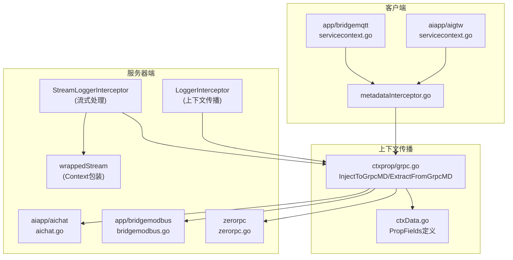
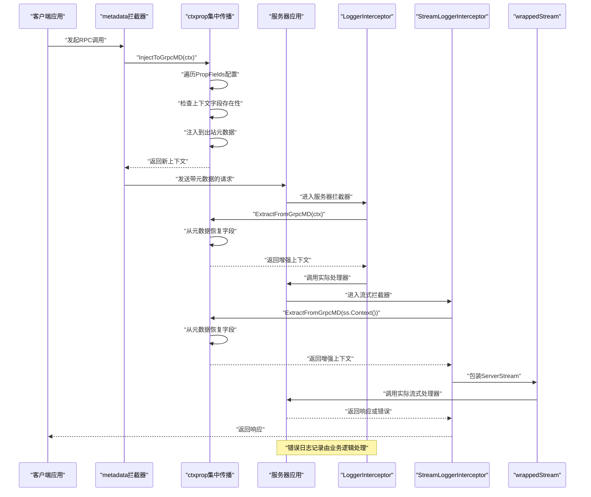
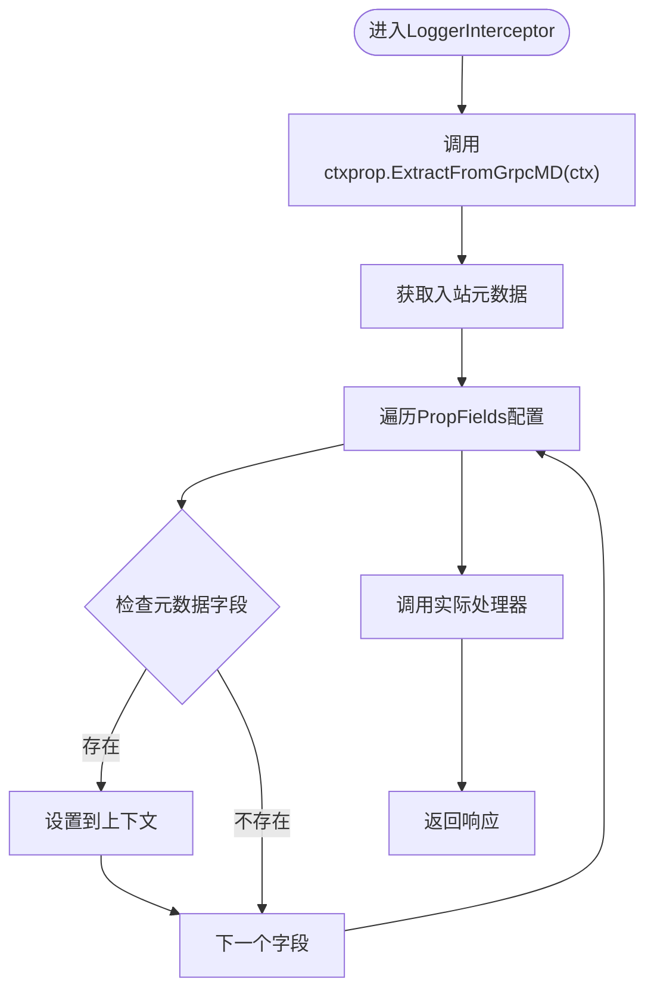
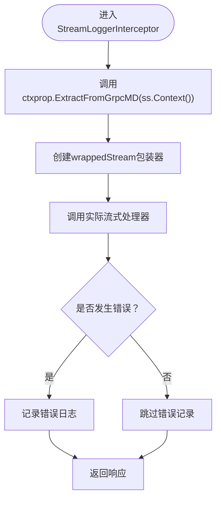
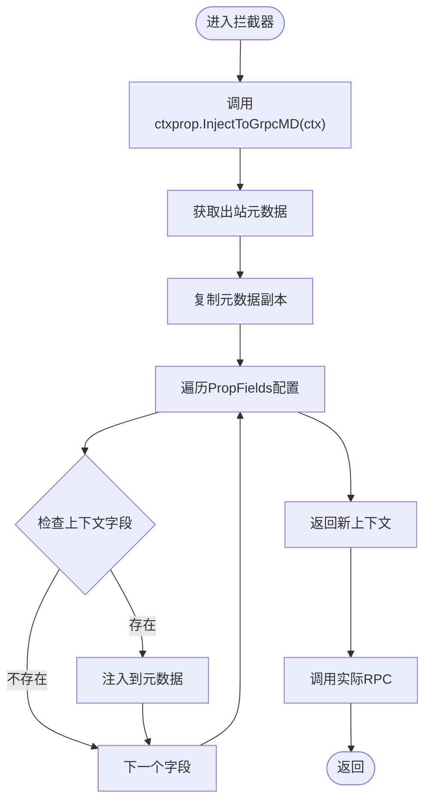
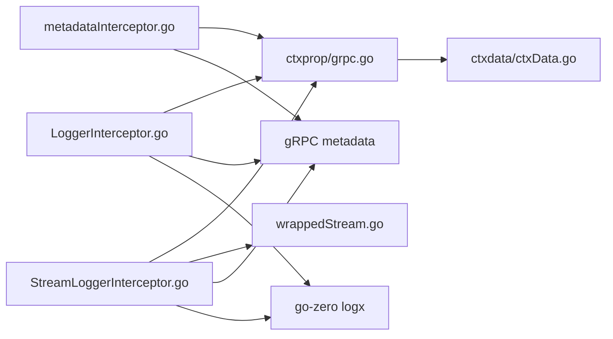

# gRPC拦截器实现

<cite>
**本文引用的文件**
- [metadataInterceptor.go](file://common/Interceptor/rpcclient/metadataInterceptor.go)
- [loggerInterceptor.go](file://common/Interceptor/rpcserver/loggerInterceptor.go)
- [grpc.go](file://common/ctxprop/grpc.go)
- [ctxData.go](file://common/ctxdata/ctxData.go)
- [aichat.go](file://aiapp/aichat/aichat.go)
- [chatcompletionstreamlogic.go](file://aiapp/aichat/internal/logic/chatcompletionstreamlogic.go)
- [bridgemodbus.go](file://app/bridgemodbus/bridgemodbus.go)
- [zerorpc.go](file://zerorpc/zerorpc.go)
- [servicecontext.go（aiapp/aigtw）](file://aiapp/aigtw/internal/svc/servicecontext.go)
- [servicecontext.go（app/bridgemqtt）](file://app/bridgemqtt/internal/svc/servicecontext.go)
- [rpc-patterns.md](file://.trae/skills/zero-skills/references/rpc-patterns.md)
</cite>

## 更新摘要
**变更内容**
- **LoggerInterceptor完全重构**：从日志记录功能转变为专门的上下文传播拦截器
- **新增StreamLoggerInterceptor**：专门处理流式RPC调用，解决流式RPC中context丢失的问题
- **wrappedStream实现**：通过包装ServerStream确保流式调用中上下文的完整性
- **拦截器职责分离**：LoggerInterceptor专注于上下文传播，错误日志记录由业务逻辑处理

## 目录
1. [简介](#简介)
2. [项目结构](#项目结构)
3. [核心组件](#核心组件)
4. [架构总览](#架构总览)
5. [详细组件分析](#详细组件分析)
6. [依赖分析](#依赖分析)
7. [性能考虑](#性能考虑)
8. [故障排查指南](#故障排查指南)
9. [结论](#结论)
10. [附录：开发指南与示例](#附录开发指南与示例)

## 简介
本文件系统性梳理 Zero-Service 中 gRPC 拦截器的实现与应用，重点覆盖以下内容：
- 客户端拦截器与服务器端拦截器的区别与典型场景
- **更新**：LoggerInterceptor完全重构为上下文传播拦截器
- **新增**：StreamLoggerInterceptor专门处理流式RPC调用
- **更新**：metadata拦截器的重构实现：请求头处理、元数据传递、认证信息注入
- **更新**：日志拦截器的链路追踪实现：请求日志记录、错误日志处理
- 拦截器的注册与链式调用方式
- 自定义拦截器的开发指南与实践示例路径

## 项目结构
围绕 gRPC 拦截器的关键目录与文件如下：
- 客户端拦截器：common/Interceptor/rpcclient/metadataInterceptor.go
- 服务器端拦截器：common/Interceptor/rpcserver/loggerInterceptor.go
- **更新**：上下文传播机制：common/ctxprop/grpc.go
- **更新**：上下文与元数据键常量：common/ctxdata/ctxData.go
- **新增**：流式RPC处理：wrappedStream包装器
- 服务端注册拦截器示例：aiapp/aichat/aichat.go、app/bridgemodbus/bridgemodbus.go、zerorpc/zerorpc.go
- 客户端注册拦截器示例：aiapp/aigtw/internal/svc/servicecontext.go、app/bridgemqtt/internal/svc/servicecontext.go
- 参考模式与示例：.trae/skills/zero-skills/references/rpc-patterns.md



**图表来源**
- [metadataInterceptor.go:1-19](file://common/Interceptor/rpcclient/metadataInterceptor.go#L1-L19)
- [loggerInterceptor.go:1-44](file://common/Interceptor/rpcserver/loggerInterceptor.go#L1-L44)
- [grpc.go:1-35](file://common/ctxprop/grpc.go#L1-L35)
- [ctxData.go:1-74](file://common/ctxdata/ctxData.go#L1-L74)
- [aichat.go:41-42](file://aiapp/aichat/aichat.go#L41-L42)
- [servicecontext.go（aiapp/aigtw）:15-24](file://aiapp/aigtw/internal/svc/servicecontext.go#L15-L24)
- [servicecontext.go（app/bridgemqtt）:20-61](file://app/bridgemqtt/internal/svc/servicecontext.go#L20-L61)
- [bridgemodbus.go:60-71](file://app/bridgemodbus/bridgemodbus.go#L60-L71)
- [zerorpc.go:40-59](file://zerorpc/zerorpc.go#L40-L59)

## 核心组件
- **重构后的LoggerInterceptor**：专门负责上下文字段的提取和传播，不再承担日志记录功能。
- **新增StreamLoggerInterceptor**：专门处理流式RPC调用，通过wrappedStream包装器解决流式RPC中context丢失的问题。
- **重构后的metadata客户端拦截器**：通过ctxprop.InjectToGrpcMD()集中注入上下文字段到出站元数据，支持一元调用与流式调用。
- **新增wrappedStream**：包装grpc.ServerStream，覆盖Context()方法返回增强后的上下文。
- **新增ctxprop集中传播机制**：统一管理上下文字段的注入和提取，基于PropFields配置实现标准化传播。

**章节来源**
- [loggerInterceptor.go:12-21](file://common/Interceptor/rpcserver/loggerInterceptor.go#L12-L21)
- [loggerInterceptor.go:23-33](file://common/Interceptor/rpcserver/loggerInterceptor.go#L23-L33)
- [loggerInterceptor.go:35-43](file://common/Interceptor/rpcserver/loggerInterceptor.go#L35-L43)
- [metadataInterceptor.go:11-19](file://common/Interceptor/rpcclient/metadataInterceptor.go#L11-L19)
- [grpc.go:11-34](file://common/ctxprop/grpc.go#L11-L34)

## 架构总览
拦截器在客户端与服务器端形成"横切关注点"，通过ctxprop集中传播机制确保：
- 客户端侧：统一从上下文提取字段并注入到元数据
- 服务器侧：统一从元数据恢复字段到上下文
- **新增**：流式RPC专用拦截器，确保流式调用中上下文的完整性
- **新增**：字段定义集中化，便于维护和扩展



**图表来源**
- [metadataInterceptor.go:11-19](file://common/Interceptor/rpcclient/metadataInterceptor.go#L11-L19)
- [loggerInterceptor.go:14-33](file://common/Interceptor/rpcserver/loggerInterceptor.go#L14-L33)
- [grpc.go:11-34](file://common/ctxprop/grpc.go#L11-L34)

## 详细组件分析

### 重构后的LoggerInterceptor
- **功能要点**
  - 专门负责从入站元数据提取上下文字段并注入到处理器的上下文中
  - 不再承担日志记录功能，简化了职责范围
  - 支持一元调用与流式调用两种模式
- **关键行为**
  - 调用ctxprop.ExtractFromGrpcMD()从元数据中提取字段
  - 将增强后的上下文传递给实际处理器
  - 错误日志记录由业务逻辑自行处理



**图表来源**
- [loggerInterceptor.go:14-21](file://common/Interceptor/rpcserver/loggerInterceptor.go#L14-L21)
- [grpc.go:26-34](file://common/ctxprop/grpc.go#L26-L34)

**章节来源**
- [loggerInterceptor.go:12-21](file://common/Interceptor/rpcserver/loggerInterceptor.go#L12-L21)
- [grpc.go:24-34](file://common/ctxprop/grpc.go#L24-L34)

### 新增StreamLoggerInterceptor
- **功能要点**
  - 专门处理流式RPC调用，解决流式RPC中context丢失的问题
  - 通过wrappedStream包装器确保流式调用中上下文的完整性
  - 支持流式RPC的错误日志记录
- **关键行为**
  - 从ss.Context()中提取上下文字段
  - 创建wrappedStream包装原始ServerStream
  - 将增强后的上下文传递给流式处理器
  - 捕获流式调用中的错误并记录



**图表来源**
- [loggerInterceptor.go:26-33](file://common/Interceptor/rpcserver/loggerInterceptor.go#L26-L33)
- [loggerInterceptor.go:35-43](file://common/Interceptor/rpcserver/loggerInterceptor.go#L35-L43)

**章节来源**
- [loggerInterceptor.go:23-33](file://common/Interceptor/rpcserver/loggerInterceptor.go#L23-L33)
- [loggerInterceptor.go:35-43](file://common/Interceptor/rpcserver/loggerInterceptor.go#L35-L43)

### 新增wrappedStream包装器
- **功能概述**
  - 包装grpc.ServerStream，覆盖Context()方法
  - 返回增强后的上下文，确保流式调用中上下文的完整性
- **实现原理**
  - 组合原始grpc.ServerStream
  - 存储增强后的context.Context
  - 重写Context()方法返回存储的上下文

**章节来源**
- [loggerInterceptor.go:35-43](file://common/Interceptor/rpcserver/loggerInterceptor.go#L35-L43)

### 重构后的metadata客户端拦截器
- **功能要点**
  - 通过ctxprop.InjectToGrpcMD()统一注入上下文字段到出站元数据
  - 支持一元调用与流式调用两种模式
  - 自动处理PropFields配置中的所有字段
- **关键行为**
  - 调用ctxprop.InjectToGrpcMD()完成元数据注入
  - 保持原有拦截器接口不变，简化实现逻辑
  - 通过ctxprop集中管理字段传播



**图表来源**
- [metadataInterceptor.go:11-19](file://common/Interceptor/rpcclient/metadataInterceptor.go#L11-L19)
- [grpc.go:13-22](file://common/ctxprop/grpc.go#L13-L22)

**章节来源**
- [metadataInterceptor.go:11-19](file://common/Interceptor/rpcclient/metadataInterceptor.go#L11-L19)
- [grpc.go:11-22](file://common/ctxprop/grpc.go#L11-L22)

### ctxprop集中传播机制
- **功能概述**
  - InjectToGrpcMD：从上下文字段提取并注入到出站元数据
  - ExtractFromGrpcMD：从入站元数据提取并恢复到上下文
  - 基于PropFields配置实现标准化传播
- **实现原理**
  - 遍历PropFields配置数组
  - 检查上下文字段是否存在且非空
  - 将字段值注入到对应的gRPC元数据头部
  - 支持敏感字段的脱敏处理

**章节来源**
- [grpc.go:11-34](file://common/ctxprop/grpc.go#L11-L34)
- [ctxData.go:30-38](file://common/ctxdata/ctxData.go#L30-L38)

### 元数据字段定义与传播
- **PropFields集中定义**
  - 用户标识：CtxUserIdKey → HeaderUserId → "x-user-id"
  - 用户名：CtxUserNameKey → HeaderUserName → "x-user-name"
  - 部门编码：CtxDeptCodeKey → HeaderDeptCode → "x-dept-code"
  - 授权令牌：CtxAuthorizationKey → HeaderAuthorization → "authorization"
  - 追踪ID：CtxTraceIdKey → HeaderTraceId → "x-trace-id"
- **传播特性**
  - 授权令牌标记为敏感字段，在日志中脱敏显示
  - 所有字段通过ctxprop机制统一处理
  - 支持HTTP和gRPC两种传输层的字段映射

**章节来源**
- [ctxData.go:5-38](file://common/ctxdata/ctxData.go#L5-L38)
- [ctxData.go:40-74](file://common/ctxdata/ctxData.go#L40-L74)

## 依赖分析
- **组件耦合**
  - metadata客户端拦截器依赖ctxprop.InjectToGrpcMD()函数
  - LoggerInterceptor依赖ctxprop.ExtractFromGrpcMD()函数
  - StreamLoggerInterceptor依赖ctxprop.ExtractFromGrpcMD()函数和wrappedStream包装器
  - ctxprop依赖ctxdata.PropFields进行字段定义
- **外部依赖**
  - gRPC官方metadata包用于读写元数据
  - go-zero logx用于日志记录
- **架构优势**
  - 拦截器与传播机制解耦，便于维护
  - 字段定义集中化，避免重复配置
  - 支持扩展新字段而无需修改拦截器逻辑
  - 流式RPC专用拦截器确保上下文完整性



**图表来源**
- [metadataInterceptor.go:3-9](file://common/Interceptor/rpcclient/metadataInterceptor.go#L3-L9)
- [loggerInterceptor.go:3-10](file://common/Interceptor/rpcserver/loggerInterceptor.go#L3-L10)
- [grpc.go:3-9](file://common/ctxprop/grpc.go#L3-L9)
- [ctxData.go:1-7](file://common/ctxdata/ctxData.go#L1-L7)

**章节来源**
- [metadataInterceptor.go:3-9](file://common/Interceptor/rpcclient/metadataInterceptor.go#L3-L9)
- [loggerInterceptor.go:3-10](file://common/Interceptor/rpcserver/loggerInterceptor.go#L3-L10)
- [grpc.go:3-9](file://common/ctxprop/grpc.go#L3-L9)
- [ctxData.go:1-7](file://common/ctxdata/ctxData.go#L1-L7)

## 性能考虑
- **重构后的性能优势**
  - LoggerInterceptor职责简化，减少了不必要的日志处理开销
  - StreamLoggerInterceptor专门处理流式RPC，避免了一元RPC的额外开销
  - ctxprop集中处理减少重复代码，提升维护效率
  - 字段遍历在拦截器中进行，避免运行时反射开销
  - 元数据复制采用浅拷贝，降低内存分配
- **性能优化建议**
  - 避免在拦截器中进行重IO或阻塞操作
  - 控制日志级别与字段数量，减少序列化开销
  - 对高频RPC，优先使用ctxprop的高效传播机制
  - 新增字段时注意PropFields的遍历开销
  - 流式RPC中合理使用wrappedStream，避免过度包装

## 故障排查指南
- **常见问题**
  - 字段未传播：检查PropFields配置是否正确
  - 上下文缺失：确认ctxprop.ExtractFromGrpcMD()是否被调用
  - 元数据格式错误：验证gRPC头部名称大小写
  - 敏感字段泄露：确认敏感字段在日志中的脱敏设置
  - 流式RPC上下文丢失：检查StreamLoggerInterceptor是否正确注册
  - wrappedStream失效：验证StreamLoggerInterceptor的包装逻辑
- **定位步骤**
  - 在ctxprop.InjectToGrpcMD()和ctxprop.ExtractFromGrpcMD()中添加调试日志
  - 检查PropFields配置中的字段映射关系
  - 验证拦截器注册顺序与链式调用是否正确
  - 使用统一错误日志前缀进行检索
  - 检查流式RPC的wrappedStream包装是否生效

**章节来源**
- [grpc.go:16-20](file://common/ctxprop/grpc.go#L16-L20)
- [grpc.go:28-32](file://common/ctxprop/grpc.go#L28-L32)
- [loggerInterceptor.go:26-33](file://common/Interceptor/rpcserver/loggerInterceptor.go#L26-L33)

## 结论
Zero-Service 的 gRPC 拦截器通过重构后的ctxprop集中传播机制，实现了更优雅的上下文字段管理。LoggerInterceptor、StreamLoggerInterceptor和metadata客户端拦截器现在通过ctxprop统一处理字段的注入和提取，具备以下优势：
- **职责分离**：LoggerInterceptor专注于上下文传播，错误日志记录由业务逻辑处理
- **流式支持**：新增StreamLoggerInterceptor专门处理流式RPC调用
- **统一化**：通过PropFields集中管理所有传播字段
- **模块化**：拦截器与传播机制解耦，便于维护
- **可扩展**：新增字段只需修改PropFields配置
- **标准化**：统一的字段映射和传播规则

该方案相比之前的直接metadata操作具有更好的可维护性和扩展性，适合在微服务架构中作为通用基础设施使用。

## 附录：开发指南与示例

### 客户端拦截器注册
- **简化注册流程**
  - 一元调用与流式调用同时注册
  - 直接使用ctxprop.InjectToGrpcMD()完成字段注入
- **示例路径**
  - [servicecontext.go（aiapp/aigtw）:19-21](file://aiapp/aigtw/internal/svc/servicecontext.go#L19-L21)
  - [servicecontext.go（app/bridgemqtt）:26-46](file://app/bridgemqtt/internal/svc/servicecontext.go#L26-L46)

**章节来源**
- [servicecontext.go（aiapp/aigtw）:19-21](file://aiapp/aigtw/internal/svc/servicecontext.go#L19-L21)
- [servicecontext.go（app/bridgemqtt）:26-46](file://app/bridgemqtt/internal/svc/servicecontext.go#L26-L46)

### 服务器端拦截器注册
- **标准注册流程**
  - 在服务启动时添加拦截器
  - 通过ctxprop.ExtractFromGrpcMD()恢复上下文
  - 流式RPC需要同时注册StreamLoggerInterceptor
- **示例路径**
  - [aichat.go:41-42](file://aiapp/aichat/aichat.go#L41-L42)
  - [bridgemodbus.go:64](file://app/bridgemodbus/bridgemodbus.go#L64)
  - [zerorpc.go:44](file://zerorpc/zerorpc.go#L44)

**章节来源**
- [aichat.go:41-42](file://aiapp/aichat/aichat.go#L41-L42)
- [bridgemodbus.go:64](file://app/bridgemodbus/bridgemodbus.go#L64)
- [zerorpc.go:44](file://zerorpc/zerorpc.go#L44)

### 自定义拦截器开发指南
- **设计原则**
  - 利用ctxprop集中传播机制，避免重复实现
  - 明确拦截器链的顺序，避免相互覆盖
  - 基于PropFields配置扩展新字段
  - 流式RPC需要考虑Context的完整性
- **开发步骤**
  - 在ctxdata/ctxData.go中定义新字段的PropField配置
  - 在业务代码中设置上下文字段值
  - 在拦截器中使用ctxprop.InjectToGrpcMD()和ctxprop.ExtractFromGrpcMD()
  - 在服务启动时注册拦截器
  - 流式RPC需要注册StreamLoggerInterceptor
- **参考示例**
  - 通用拦截器模式与示例代码路径
    - [rpc-patterns.md:370-466](file://.trae/skills/zero-skills/references/rpc-patterns.md#L370-L466)

**章节来源**
- [rpc-patterns.md:370-466](file://.trae/skills/zero-skills/references/rpc-patterns.md#L370-L466)
- [ctxData.go:22-38](file://common/ctxdata/ctxData.go#L22-L38)

### 新字段添加流程
- **步骤1：定义字段配置**
  ```go
  // 在ctxData.go中添加PropField配置
  {CtxNewFieldKey, HeaderNewField, "X-New-Field", false},
  ```
- **步骤2：设置上下文字段**
  ```go
  // 在业务代码中设置字段值
  ctx = context.WithValue(ctx, CtxNewFieldKey, "field-value")
  ```
- **步骤3：自动传播**
  - 客户端拦截器：通过ctxprop.InjectToGrpcMD()自动注入
  - 服务器端拦截器：通过ctxprop.ExtractFromGrpcMD()自动恢复
  - 流式RPC：通过StreamLoggerInterceptor确保上下文完整性

**章节来源**
- [ctxData.go:30-38](file://common/ctxdata/ctxData.go#L30-L38)
- [grpc.go:16-21](file://common/ctxprop/grpc.go#L16-L21)
- [grpc.go:27-33](file://common/ctxprop/grpc.go#L27-L33)
- [loggerInterceptor.go:26-33](file://common/Interceptor/rpcserver/loggerInterceptor.go#L26-L33)

### 流式RPC拦截器使用示例
- **注册流式拦截器**
  ```go
  // 在服务启动时注册
  s.AddStreamInterceptors(interceptor.StreamLoggerInterceptor)
  ```
- **在流式处理器中使用上下文**
  ```go
  // 在流式处理器中可以直接访问上下文字段
  userId := ctxdata.GetUserId(streamCtx)
  userName := ctxdata.GetUserName(streamCtx)
  ```
- **流式RPC上下文传播**
  - StreamLoggerInterceptor自动处理上下文传播
  - wrappedStream确保Context方法返回增强后的上下文
  - 业务逻辑无需额外处理流式RPC的上下文问题

**章节来源**
- [aichat.go:41-42](file://aiapp/aichat/aichat.go#L41-L42)
- [loggerInterceptor.go:26-43](file://common/Interceptor/rpcserver/loggerInterceptor.go#L26-L43)
- [chatcompletionstreamlogic.go:77-80](file://aiapp/aichat/internal/logic/chatcompletionstreamlogic.go#L77-L80)