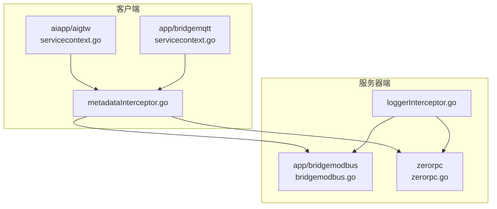
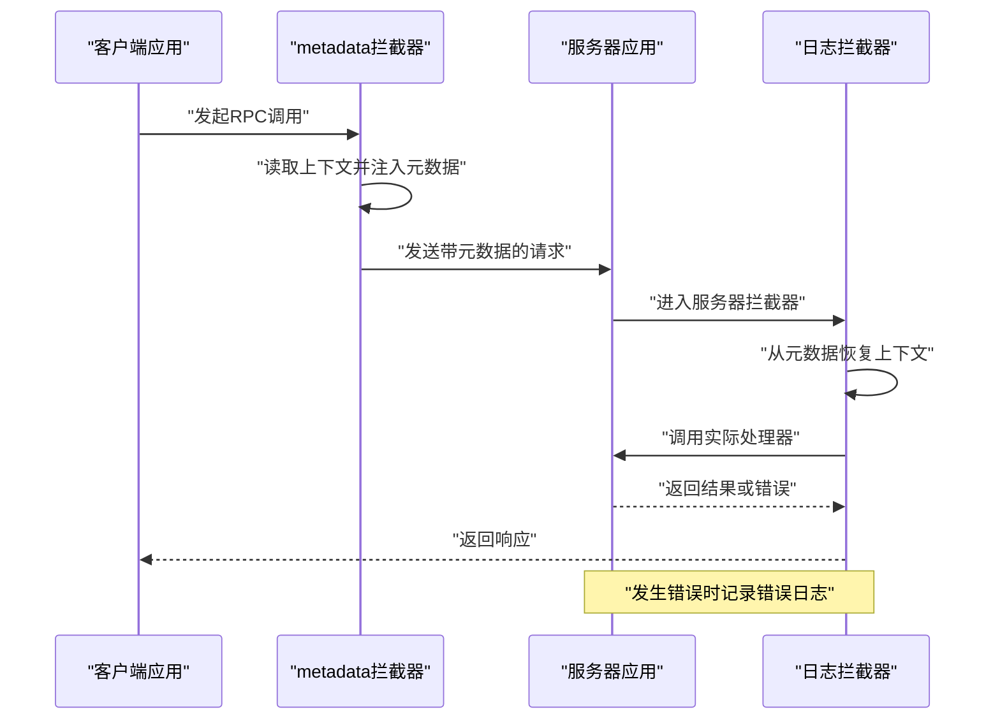
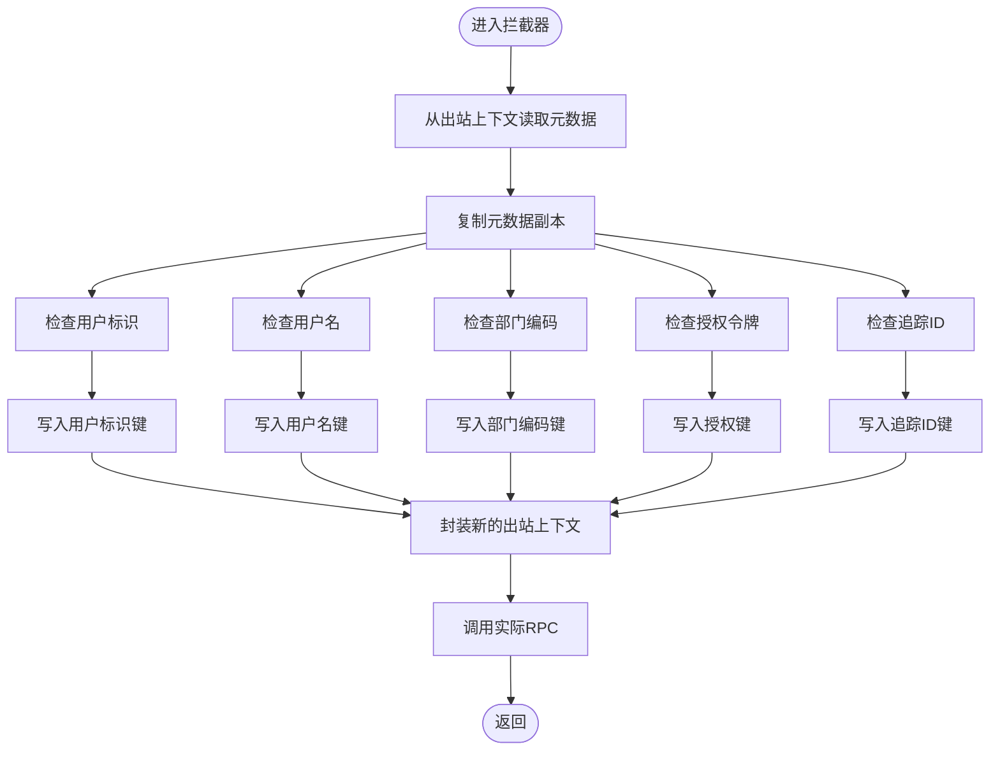
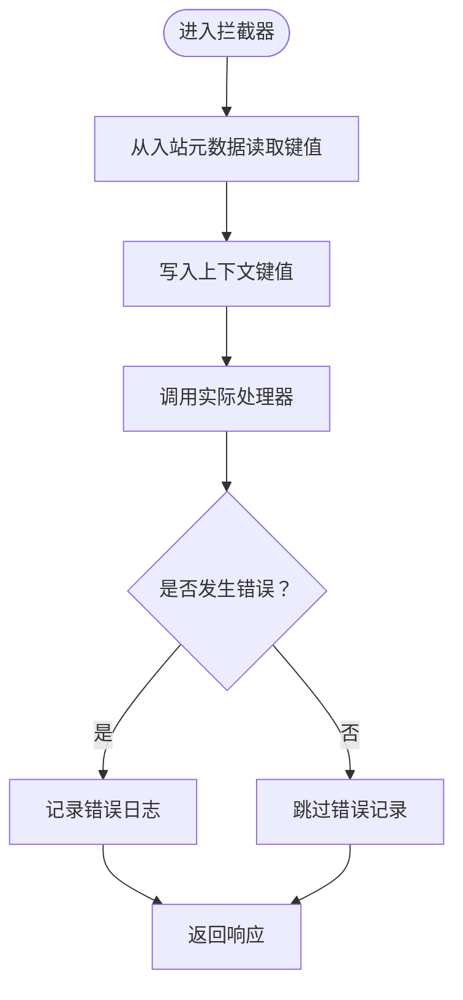
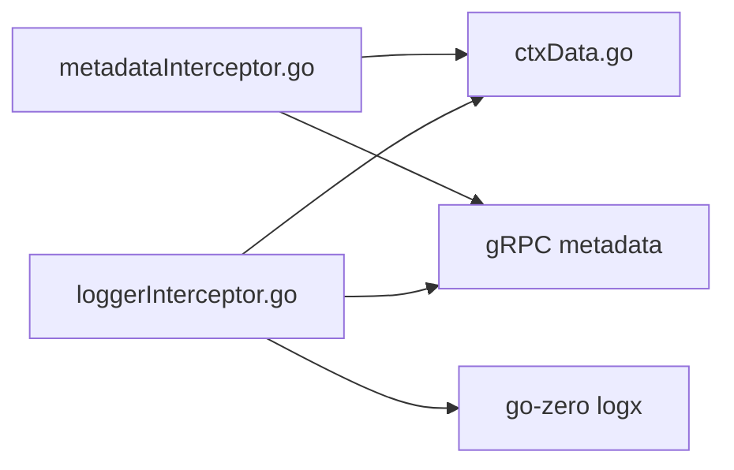

# gRPC拦截器实现

<cite>
**本文引用的文件**
- [metadataInterceptor.go](file://common/Interceptor/rpcclient/metadataInterceptor.go)
- [loggerInterceptor.go](file://common/Interceptor/rpcserver/loggerInterceptor.go)
- [ctxData.go](file://common/ctxdata/ctxData.go)
- [bridgemodbus.go](file://app/bridgemodbus/bridgemodbus.go)
- [zerorpc.go](file://zerorpc/zerorpc.go)
- [servicecontext.go（aiapp/aigtw）](file://aiapp/aigtw/internal/svc/servicecontext.go)
- [servicecontext.go（app/bridgemqtt）](file://app/bridgemqtt/internal/svc/servicecontext.go)
- [rpc-patterns.md](file://.trae/skills/zero-skills/references/rpc-patterns.md)
</cite>

## 目录
1. [简介](#简介)
2. [项目结构](#项目结构)
3. [核心组件](#核心组件)
4. [架构总览](#架构总览)
5. [详细组件分析](#详细组件分析)
6. [依赖分析](#依赖分析)
7. [性能考虑](#性能考虑)
8. [故障排查指南](#故障排查指南)
9. [结论](#结论)
10. [附录：开发指南与示例](#附录开发指南与示例)

## 简介
本文件系统性梳理 Zero-Service 中 gRPC 拦截器的实现与应用，重点覆盖以下内容：
- 客户端拦截器与服务器端拦截器的区别与典型场景
- metadata 拦截器的实现机制：请求头处理、元数据传递、认证信息注入
- 日志拦截器的链路追踪实现：请求日志记录、错误日志处理
- 拦截器的注册与链式调用方式
- 自定义拦截器的开发指南与实践示例路径

## 项目结构
围绕 gRPC 拦截器的关键目录与文件如下：
- 客户端拦截器：common/Interceptor/rpcclient/metadataInterceptor.go
- 服务器端拦截器：common/Interceptor/rpcserver/loggerInterceptor.go
- 上下文与元数据键常量：common/ctxdata/ctxData.go
- 服务端注册拦截器示例：app/bridgemodbus/bridgemodbus.go、zerorpc/zerorpc.go
- 客户端注册拦截器示例：aiapp/aigtw/internal/svc/servicecontext.go、app/bridgemqtt/internal/svc/servicecontext.go
- 参考模式与示例：.trae/skills/zero-skills/references/rpc-patterns.md

**图表来源**
- [metadataInterceptor.go:1-56](file://common/Interceptor/rpcclient/metadataInterceptor.go#L1-L56)
- [loggerInterceptor.go:1-45](file://common/Interceptor/rpcserver/loggerInterceptor.go#L1-L45)
- [servicecontext.go（aiapp/aigtw）:15-24](file://aiapp/aigtw/internal/svc/servicecontext.go#L15-L24)
- [servicecontext.go（app/bridgemqtt）:20-61](file://app/bridgemqtt/internal/svc/servicecontext.go#L20-L61)
- [bridgemodbus.go:60-71](file://app/bridgemodbus/bridgemodbus.go#L60-L71)
- [zerorpc.go:40-59](file://zerorpc/zerorpc.go#L40-L59)

**章节来源**
- [metadataInterceptor.go:1-56](file://common/Interceptor/rpcclient/metadataInterceptor.go#L1-L56)
- [loggerInterceptor.go:1-45](file://common/Interceptor/rpcserver/loggerInterceptor.go#L1-L45)
- [ctxData.go:1-76](file://common/ctxdata/ctxData.go#L1-L76)
- [servicecontext.go（aiapp/aigtw）:15-24](file://aiapp/aigtw/internal/svc/servicecontext.go#L15-L24)
- [servicecontext.go（app/bridgemqtt）:20-61](file://app/bridgemqtt/internal/svc/servicecontext.go#L20-L61)
- [bridgemodbus.go:60-71](file://app/bridgemodbus/bridgemodbus.go#L60-L71)
- [zerorpc.go:40-59](file://zerorpc/zerorpc.go#L40-L59)

## 核心组件
- metadata 客户端拦截器：在每次 gRPC 调用前从上下文提取用户标识、部门编码、授权令牌、链路追踪 ID 等信息，注入到出站元数据中，支持一元调用与流式调用。
- 日志服务器端拦截器：在请求进入处理器前，从入站元数据恢复到上下文中，并在处理完成后记录错误日志，便于统一链路追踪与问题定位。

**章节来源**
- [metadataInterceptor.go:11-32](file://common/Interceptor/rpcclient/metadataInterceptor.go#L11-L32)
- [metadataInterceptor.go:34-55](file://common/Interceptor/rpcclient/metadataInterceptor.go#L34-L55)
- [loggerInterceptor.go:12-44](file://common/Interceptor/rpcserver/loggerInterceptor.go#L12-L44)

## 架构总览
拦截器在客户端与服务器端形成“横切关注点”，贯穿所有 RPC 调用，确保：
- 客户端侧：自动携带认证与追踪信息
- 服务器侧：统一注入上下文并记录错误

**图表来源**
- [metadataInterceptor.go:11-32](file://common/Interceptor/rpcclient/metadataInterceptor.go#L11-L32)
- [loggerInterceptor.go:12-44](file://common/Interceptor/rpcserver/loggerInterceptor.go#L12-L44)

## 详细组件分析

### metadata 客户端拦截器
- 功能要点
  - 从上下文读取用户标识、用户名、部门编码、授权令牌、链路追踪 ID
  - 将上述信息写入出站元数据，保证下游服务可感知
  - 同时支持一元调用与流式调用两种模式
- 关键行为
  - 复制现有出站元数据，避免污染原始上下文
  - 使用预定义的元数据键名进行设置
  - 将更新后的上下文重新封装后继续调用

**图表来源**
- [metadataInterceptor.go:11-32](file://common/Interceptor/rpcclient/metadataInterceptor.go#L11-L32)
- [metadataInterceptor.go:34-55](file://common/Interceptor/rpcclient/metadataInterceptor.go#L34-L55)

**章节来源**
- [metadataInterceptor.go:11-32](file://common/Interceptor/rpcclient/metadataInterceptor.go#L11-L32)
- [metadataInterceptor.go:34-55](file://common/Interceptor/rpcclient/metadataInterceptor.go#L34-L55)
- [ctxData.go:17-24](file://common/ctxdata/ctxData.go#L17-L24)

### 日志服务器端拦截器
- 功能要点
  - 从入站元数据读取用户标识、用户名、部门编码、授权令牌、追踪 ID
  - 将这些值写回上下文，供后续处理器使用
  - 在处理器执行后捕获错误并记录统一格式的错误日志
- 关键行为
  - 元数据到上下文的映射，便于业务逻辑直接读取
  - 错误日志统一前缀，便于检索与聚合

**图表来源**
- [loggerInterceptor.go:12-44](file://common/Interceptor/rpcserver/loggerInterceptor.go#L12-L44)

**章节来源**
- [loggerInterceptor.go:12-44](file://common/Interceptor/rpcserver/loggerInterceptor.go#L12-L44)
- [ctxData.go:9-24](file://common/ctxdata/ctxData.go#L9-L24)

### 元数据键与上下文映射
- 预定义键名（客户端侧元数据键均为小写）
  - 用户标识：x-user-id
  - 用户名：x-user-name
  - 部门编码：x-dept-code
  - 授权令牌：authorization
  - 追踪 ID：x-trace-id
- 对应上下文键名
  - user-id、user-name、dept-code、authorization、trace-id
- 作用
  - 客户端拦截器通过上述键名注入元数据
  - 服务器端拦截器通过对应上下文键名恢复到上下文

**章节来源**
- [ctxData.go:9-24](file://common/ctxdata/ctxData.go#L9-L24)
- [ctxData.go:42-75](file://common/ctxdata/ctxData.go#L42-L75)

## 依赖分析
- 组件耦合
  - metadata 客户端拦截器依赖 ctxdata 的上下文读取函数与元数据键常量
  - 日志服务器端拦截器依赖 ctxdata 的上下文键常量与日志库
- 外部依赖
  - gRPC 官方 metadata 包用于读写元数据
  - go-zero logx 用于日志记录
- 潜在循环依赖
  - 拦截器之间无直接循环依赖，通过上下文与元数据解耦

**图表来源**
- [metadataInterceptor.go:3-9](file://common/Interceptor/rpcclient/metadataInterceptor.go#L3-L9)
- [loggerInterceptor.go:3-10](file://common/Interceptor/rpcserver/loggerInterceptor.go#L3-L10)
- [ctxData.go:1-7](file://common/ctxdata/ctxData.go#L1-L7)

**章节来源**
- [metadataInterceptor.go:3-9](file://common/Interceptor/rpcclient/metadataInterceptor.go#L3-L9)
- [loggerInterceptor.go:3-10](file://common/Interceptor/rpcserver/loggerInterceptor.go#L3-L10)
- [ctxData.go:1-7](file://common/ctxdata/ctxData.go#L1-L7)

## 性能考虑
- 元数据注入成本低：仅在出站上下文复制与键值写入，开销极小
- 日志拦截器仅在错误发生时记录日志，正常路径不产生额外 IO
- 建议
  - 避免在拦截器中进行重 IO 或阻塞操作
  - 控制日志级别与字段数量，减少序列化开销
  - 对高频 RPC，优先使用轻量级拦截器策略

## 故障排查指南
- 常见问题
  - 元数据未生效：检查客户端是否正确注册拦截器；确认键名大小写一致
  - 上下文缺失：确认服务器端拦截器已将元数据写入上下文
  - 错误日志未出现：确认服务器端拦截器已启用且错误确实发生
- 定位步骤
  - 在客户端拦截器入口与服务器端拦截器入口分别打印关键元数据键值
  - 检查拦截器注册顺序与链式调用是否正确
  - 使用统一错误日志前缀进行检索

**章节来源**
- [loggerInterceptor.go:40-42](file://common/Interceptor/rpcserver/loggerInterceptor.go#L40-L42)

## 结论
Zero-Service 的 gRPC 拦截器通过 metadata 客户端拦截器与日志服务器端拦截器，实现了跨服务的认证与追踪信息传递、统一上下文注入以及错误日志记录。该方案具备低侵入、易扩展的特点，适合在微服务架构中作为通用基础设施使用。

## 附录：开发指南与示例

### 客户端拦截器注册
- 一元调用与流式调用同时注册
- 示例路径
  - [servicecontext.go（aiapp/aigtw）:19-21](file://aiapp/aigtw/internal/svc/servicecontext.go#L19-L21)
  - [servicecontext.go（app/bridgemqtt）:26-46](file://app/bridgemqtt/internal/svc/servicecontext.go#L26-L46)

**章节来源**
- [servicecontext.go（aiapp/aigtw）:19-21](file://aiapp/aigtw/internal/svc/servicecontext.go#L19-L21)
- [servicecontext.go（app/bridgemqtt）:26-46](file://app/bridgemqtt/internal/svc/servicecontext.go#L26-L46)

### 服务器端拦截器注册
- 在服务启动时添加拦截器
- 示例路径
  - [bridgemodbus.go:64](file://app/bridgemodbus/bridgemodbus.go#L64)
  - [zerorpc.go:44](file://zerorpc/zerorpc.go#L44)

**章节来源**
- [bridgemodbus.go:64](file://app/bridgemodbus/bridgemodbus.go#L64)
- [zerorpc.go:44](file://zerorpc/zerorpc.go#L44)

### 自定义拦截器开发指南
- 设计原则
  - 保持拦截器职责单一，避免过度耦合
  - 明确拦截器链的顺序，避免相互覆盖
- 开发步骤
  - 定义拦截器函数签名，遵循 gRPC 拦截器规范
  - 在客户端侧从上下文读取必要信息并注入元数据
  - 在服务器端从元数据恢复到上下文，并在错误时记录日志
  - 在服务启动时注册拦截器
- 参考示例
  - 通用拦截器模式与示例代码路径
    - [rpc-patterns.md:370-466](file://.trae/skills/zero-skills/references/rpc-patterns.md#L370-L466)

**章节来源**
- [rpc-patterns.md:370-466](file://.trae/skills/zero-skills/references/rpc-patterns.md#L370-L466)