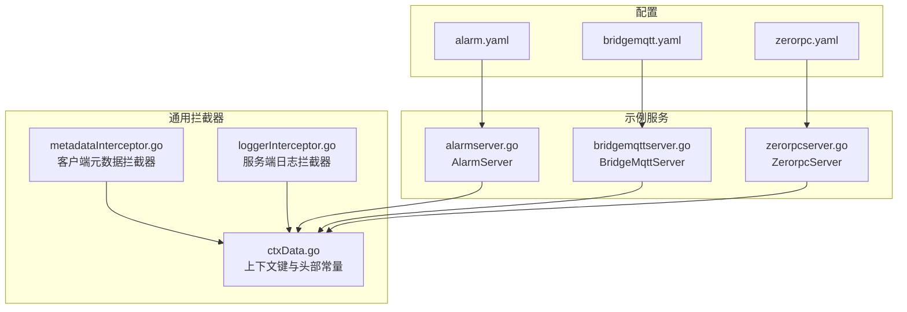
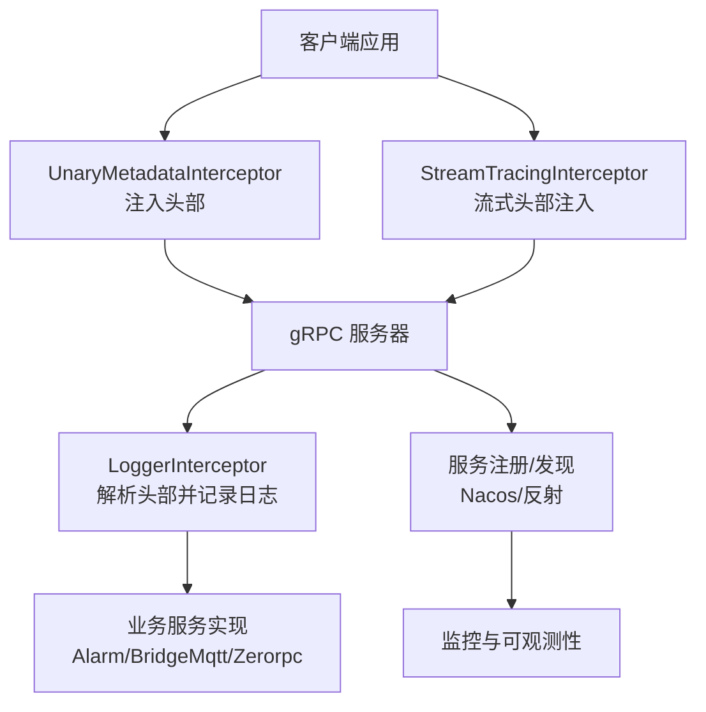
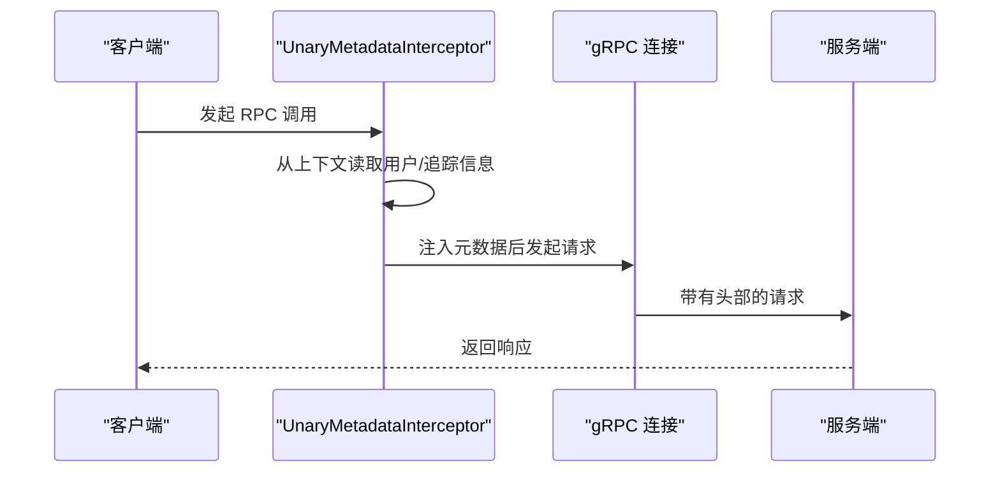
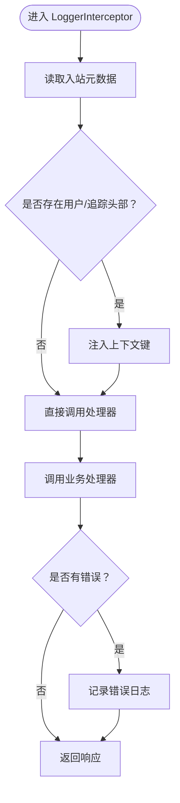
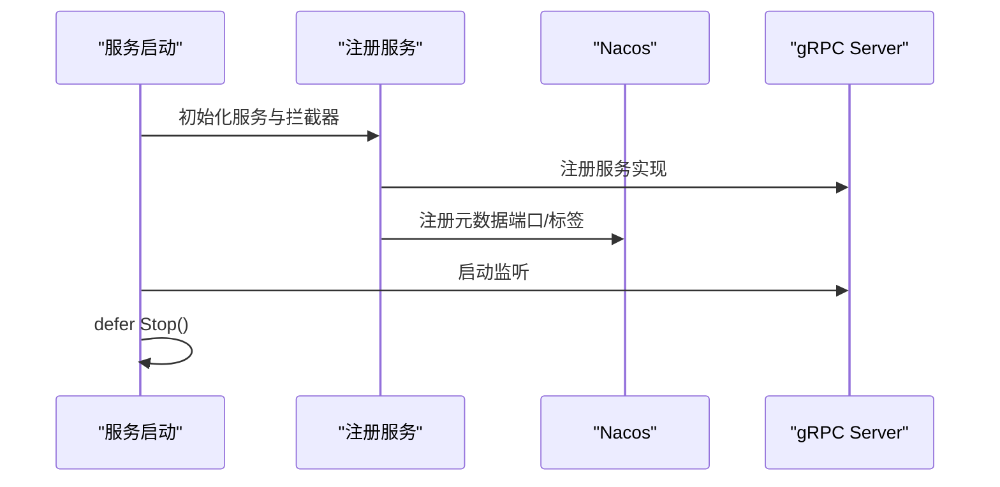
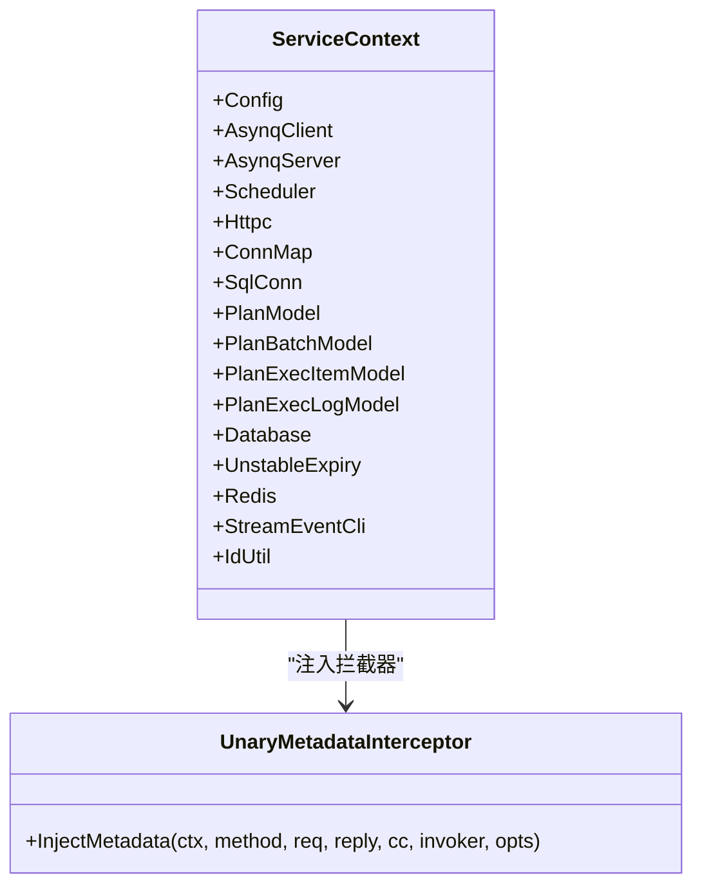
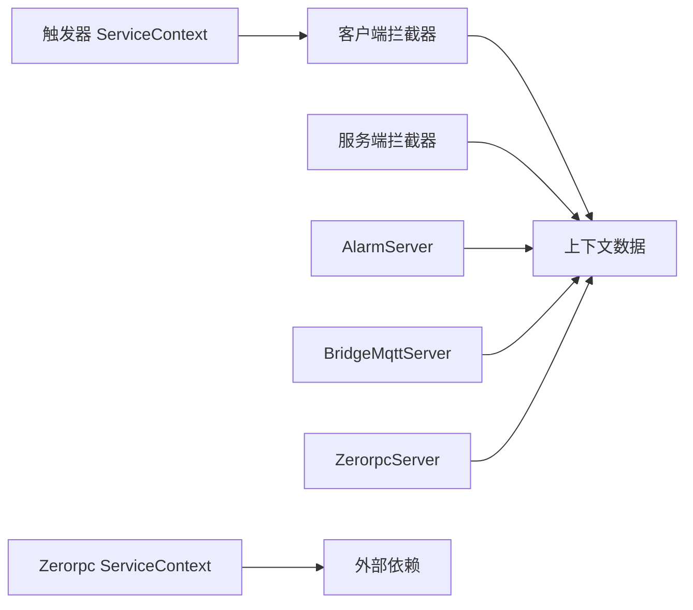

# gRPC高性能RPC通信

<cite>
**本文引用的文件**
- [metadataInterceptor.go](file://common/Interceptor/rpcclient/metadataInterceptor.go)
- [loggerInterceptor.go](file://common/Interceptor/rpcserver/loggerInterceptor.go)
- [ctxData.go](file://common/ctxdata/ctxData.go)
- [alarmserver.go](file://app/alarm/internal/server/alarmserver.go)
- [bridgemqttserver.go](file://app/bridgemqtt/internal/server/bridgemqttserver.go)
- [zerorpcserver.go](file://zerorpc/internal/server/zerorpcserver.go)
- [alarm.yaml](file://app/alarm/etc/alarm.yaml)
- [bridgemqtt.yaml](file://app/bridgemqtt/etc/bridgemqtt.yaml)
- [zerorpc.yaml](file://zerorpc/etc/zerorpc.yaml)
- [servicecontext.go](file://app/trigger/internal/svc/servicecontext.go)
- [servicecontext.go](file://zerorpc/internal/svc/servicecontext.go)
- [deferTriggerProtoTask.go](file://app/trigger/internal/task/deferTriggerProtoTask.go)
- [logdump_grpc.pb.go](file://app/logdump/logdump/logdump_grpc.pb.go)
- [rpc-patterns.md](file://.trae/skills/zero-skills/references/rpc-patterns.md)
- [resilience-patterns.md](file://.trae/skills/zero-skills/references/resilience-patterns.md)
- [descriptor.proto](file://third_party/google/protobuf/descriptor.proto)
- [httpbody.proto](file://third_party/google/api/httpbody.proto)
</cite>

## 目录
1. [引言](#引言)
2. [项目结构](#项目结构)
3. [核心组件](#核心组件)
4. [架构总览](#架构总览)
5. [详细组件分析](#详细组件分析)
6. [依赖分析](#依赖分析)
7. [性能考量](#性能考量)
8. [故障排查指南](#故障排查指南)
9. [结论](#结论)
10. [附录](#附录)

## 引言
本文件系统性梳理 Zero-Service 中基于 gRPC 的高性能 RPC 通信机制，围绕以下主题展开：
- 协议与传输：Protocol Buffers 序列化、HTTP/2 传输、双向流式通信
- 拦截器体系：元数据注入、日志与链路追踪、认证授权
- 生命周期管理：服务注册、健康检查、优雅关闭
- 客户端与服务端最佳实践：连接池、超时、重试、熔断降级
- 调试与性能优化：工具使用与优化技巧

## 项目结构
本项目采用多模块微服务架构，每个业务模块均通过 Protocol Buffers 定义服务契约，并由 goctl 生成对应的 gRPC 代码。通用拦截器与上下文数据在公共包中统一管理。

图表来源
- [metadataInterceptor.go:1-56](file://common/Interceptor/rpcclient/metadataInterceptor.go#L1-L56)
- [loggerInterceptor.go:1-45](file://common/Interceptor/rpcserver/loggerInterceptor.go#L1-L45)
- [ctxData.go:1-76](file://common/ctxdata/ctxData.go#L1-L76)
- [alarmserver.go:1-35](file://app/alarm/internal/server/alarmserver.go#L1-L35)
- [bridgemqttserver.go:1-42](file://app/bridgemqtt/internal/server/bridgemqttserver.go#L1-L42)
- [zerorpcserver.go:1-90](file://zerorpc/internal/server/zerorpcserver.go#L1-L90)
- [alarm.yaml:1-26](file://app/alarm/etc/alarm.yaml#L1-L26)
- [bridgemqtt.yaml:1-48](file://app/bridgemqtt/etc/bridgemqtt.yaml#L1-L48)
- [zerorpc.yaml:1-39](file://zerorpc/etc/zerorpc.yaml#L1-L39)

章节来源
- [metadataInterceptor.go:1-56](file://common/Interceptor/rpcclient/metadataInterceptor.go#L1-L56)
- [loggerInterceptor.go:1-45](file://common/Interceptor/rpcserver/loggerInterceptor.go#L1-L45)
- [ctxData.go:1-76](file://common/ctxdata/ctxData.go#L1-L76)
- [alarmserver.go:1-35](file://app/alarm/internal/server/alarmserver.go#L1-L35)
- [bridgemqttserver.go:1-42](file://app/bridgemqtt/internal/server/bridgemqttserver.go#L1-L42)
- [zerorpcserver.go:1-90](file://zerorpc/internal/server/zerorpcserver.go#L1-L90)
- [alarm.yaml:1-26](file://app/alarm/etc/alarm.yaml#L1-L26)
- [bridgemqtt.yaml:1-48](file://app/bridgemqtt/etc/bridgemqtt.yaml#L1-L48)
- [zerorpc.yaml:1-39](file://zerorpc/etc/zerorpc.yaml#L1-L39)

## 核心组件
- 元数据拦截器（客户端）：在出站请求中自动注入用户标识、授权令牌、链路追踪 ID 等头部信息，确保跨服务调用的上下文一致。
- 日志拦截器（服务端）：从入站元数据提取关键字段并注入到请求上下文，统一记录错误日志，便于问题定位。
- 上下文数据（ctxdata）：集中定义 gRPC 头部键名与上下文键名，保证客户端与服务端约定一致。
- 服务实现：各模块的 gRPC 服务端通过 goctl 生成骨架，结合业务逻辑层完成具体功能。
- 配置与注册：服务启动时加载 YAML 配置，按需注册到服务发现（如 Nacos），并添加拦截器。

章节来源
- [metadataInterceptor.go:1-56](file://common/Interceptor/rpcclient/metadataInterceptor.go#L1-L56)
- [loggerInterceptor.go:1-45](file://common/Interceptor/rpcserver/loggerInterceptor.go#L1-L45)
- [ctxData.go:1-76](file://common/ctxdata/ctxData.go#L1-L76)
- [alarmserver.go:1-35](file://app/alarm/internal/server/alarmserver.go#L1-L35)
- [bridgemqttserver.go:1-42](file://app/bridgemqtt/internal/server/bridgemqttserver.go#L1-L42)
- [zerorpcserver.go:1-90](file://zerorpc/internal/server/zerorpcserver.go#L1-L90)

## 架构总览
下图展示 gRPC 在 Zero-Service 中的整体交互：客户端通过拦截器注入元数据，服务端通过拦截器解析并记录日志，服务注册与发现贯穿整个生命周期。

图表来源
- [metadataInterceptor.go:11-32](file://common/Interceptor/rpcclient/metadataInterceptor.go#L11-L32)
- [metadataInterceptor.go:34-55](file://common/Interceptor/rpcclient/metadataInterceptor.go#L34-L55)
- [loggerInterceptor.go:12-44](file://common/Interceptor/rpcserver/loggerInterceptor.go#L12-L44)
- [alarmserver.go:26-29](file://app/alarm/internal/server/alarmserver.go#L26-L29)
- [bridgemqttserver.go:26-41](file://app/bridgemqtt/internal/server/bridgemqttserver.go#L26-L41)
- [zerorpcserver.go:26-90](file://zerorpc/internal/server/zerorpcserver.go#L26-L90)

## 详细组件分析

### 元数据拦截器（客户端）
- 功能要点
  - 在出站调用前复制并更新 outgoing metadata，注入用户 ID、用户名、部门编码、授权令牌、链路追踪 ID。
  - 同时支持一元调用与流式调用，确保双向场景一致。
- 关键行为
  - 仅当上下文中的值非空时才写入对应头部，避免冗余。
  - 使用统一的头部键常量，与服务端解析保持一致。

图表来源
- [metadataInterceptor.go:11-32](file://common/Interceptor/rpcclient/metadataInterceptor.go#L11-L32)

章节来源
- [metadataInterceptor.go:1-56](file://common/Interceptor/rpcclient/metadataInterceptor.go#L1-L56)
- [ctxData.go:17-24](file://common/ctxdata/ctxData.go#L17-L24)

### 日志拦截器（服务端）
- 功能要点
  - 从入站 metadata 提取用户/追踪信息，注入到请求上下文，便于后续日志与业务逻辑使用。
  - 统一捕获并记录错误，形成可追溯的日志格式。
- 关键行为
  - 仅在存在对应头部时注入上下文键，避免覆盖默认值。
  - 错误日志包含“RPC-SRV-ERR”标记，便于检索。

图表来源
- [loggerInterceptor.go:12-44](file://common/Interceptor/rpcserver/loggerInterceptor.go#L12-L44)

章节来源
- [loggerInterceptor.go:1-45](file://common/Interceptor/rpcserver/loggerInterceptor.go#L1-L45)
- [ctxData.go:9-24](file://common/ctxdata/ctxData.go#L9-L24)

### 服务实现与生命周期
- 服务注册
  - 通过 goctl 生成的服务骨架实现具体方法，如 Ping、Alarm、Publish、SendDelayTask 等。
  - 启动时注册服务到 gRPC Server，并在开发/测试模式下启用反射以支持调试。
- 服务注册与发现
  - 部分服务在启动时将 gRPC 端口与元数据注册到 Nacos，便于服务发现与治理。
- 优雅关闭
  - 服务启动后通过 defer Stop 确保优雅关闭，释放资源。

图表来源
- [alarmserver.go:26-29](file://app/alarm/internal/server/alarmserver.go#L26-L29)
- [bridgemqttserver.go:26-41](file://app/bridgemqtt/internal/server/bridgemqttserver.go#L26-L41)
- [zerorpcserver.go:26-90](file://zerorpc/internal/server/zerorpcserver.go#L26-L90)
- [alarm.yaml:1-26](file://app/alarm/etc/alarm.yaml#L1-L26)
- [bridgemqtt.yaml:11-18](file://app/bridgemqtt/etc/bridgemqtt.yaml#L11-L18)
- [zerorpc.yaml:1-39](file://zerorpc/etc/zerorpc.yaml#L1-L39)

章节来源
- [alarmserver.go:1-35](file://app/alarm/internal/server/alarmserver.go#L1-L35)
- [bridgemqttserver.go:1-42](file://app/bridgemqtt/internal/server/bridgemqttserver.go#L1-L42)
- [zerorpcserver.go:1-90](file://zerorpc/internal/server/zerorpcserver.go#L1-L90)
- [alarm.yaml:1-26](file://app/alarm/etc/alarm.yaml#L1-L26)
- [bridgemqtt.yaml:1-48](file://app/bridgemqtt/etc/bridgemqtt.yaml#L1-L48)
- [zerorpc.yaml:1-39](file://zerorpc/etc/zerorpc.yaml#L1-L39)

### 客户端配置与连接池
- 通用客户端
  - 在服务上下文中创建 gRPC 客户端，注入元数据拦截器，设置默认调用选项（如最大消息大小）。
- 触发器客户端
  - 对特定 RPC 方法禁用日志内容输出，避免敏感信息泄露；支持按消息配置超时。
- 连接池与拨号选项
  - 通过 WithDialOption 设置默认调用参数，如 MaxCallSendMsgSize、MaxCallRecvMsgSize，提升大对象传输能力。

图表来源
- [servicecontext.go:79-87](file://app/trigger/internal/svc/servicecontext.go#L79-L87)
- [metadataInterceptor.go:11-32](file://common/Interceptor/rpcclient/metadataInterceptor.go#L11-L32)

章节来源
- [servicecontext.go:1-91](file://app/trigger/internal/svc/servicecontext.go#L1-L91)
- [servicecontext.go:1-102](file://zerorpc/internal/svc/servicecontext.go#L1-L102)
- [deferTriggerProtoTask.go:72-111](file://app/trigger/internal/task/deferTriggerProtoTask.go#L72-L111)
- [metadataInterceptor.go:1-56](file://common/Interceptor/rpcclient/metadataInterceptor.go#L1-L56)

### 流式通信与双向流
- Protocol Buffers 描述
  - descriptor.proto 明确定义了方法的 client_streaming 与 server_streaming 字段，用于区分双向流式场景。
- 实践建议
  - 对于大流量数据传输，合理设置最大消息大小与背压策略，避免内存压力。
  - 使用流式拦截器统一注入追踪信息，确保端到端链路可见。

章节来源
- [descriptor.proto:292-307](file://third_party/google/protobuf/descriptor.proto#L292-L307)

### HTTP/2 与二进制序列化
- HTTP/2 传输
  - gRPC 默认基于 HTTP/2，具备多路复用、头部压缩、服务端推送等优势，适合高并发微服务通信。
- Protocol Buffers 序列化
  - 通过 .proto 文件定义消息结构，生成 Go 代码，实现高效二进制序列化与反序列化。
- 扩展类型
  - google.api.HttpBody 支持任意二进制内容与扩展元数据，适用于非 JSON 场景。

章节来源
- [httpbody.proto:67-77](file://third_party/google/api/httpbody.proto#L67-L77)

## 依赖分析
- 模块内聚与耦合
  - 拦截器与上下文数据位于公共包，被多个服务共享，降低重复与耦合。
  - 服务实现依赖业务逻辑层与上下文，保持清晰的职责边界。
- 外部依赖
  - go-zero 提供 RPC 服务器/客户端封装、拦截器注册、服务发现集成。
  - OpenTelemetry HeaderCarrier 用于跨语言/跨进程传播上下文（在 ctxData 中定义承载结构）。

图表来源
- [metadataInterceptor.go:1-56](file://common/Interceptor/rpcclient/metadataInterceptor.go#L1-L56)
- [loggerInterceptor.go:1-45](file://common/Interceptor/rpcserver/loggerInterceptor.go#L1-L45)
- [ctxData.go:1-76](file://common/ctxdata/ctxData.go#L1-L76)
- [alarmserver.go:1-35](file://app/alarm/internal/server/alarmserver.go#L1-L35)
- [bridgemqttserver.go:1-42](file://app/bridgemqtt/internal/server/bridgemqttserver.go#L1-L42)
- [zerorpcserver.go:1-90](file://zerorpc/internal/server/zerorpcserver.go#L1-L90)
- [servicecontext.go:79-87](file://app/trigger/internal/svc/servicecontext.go#L79-L87)
- [servicecontext.go:1-102](file://zerorpc/internal/svc/servicecontext.go#L1-L102)

## 性能考量
- 连接与拨号
  - 使用 WithDialOption 设置合理的 MaxCallSendMsgSize/MaxCallRecvMsgSize，避免频繁分配与拷贝。
  - 非阻塞连接（NonBlock）可缩短启动时间，但需配合重试与熔断策略。
- 超时与重试
  - 客户端按消息配置 RequestTimeout，避免长时间阻塞；对幂等操作可引入指数退避重试。
- 熔断与降级
  - 结合断路器与负载均衡，异常比例过高时快速失败并切换备用路径。
- 监控指标
  - 关注请求超时、断路器状态变化、CPU 使用率、限流命中等关键指标，及时预警。

章节来源
- [rpc-patterns.md:313-368](file://.trae/skills/zero-skills/references/rpc-patterns.md#L313-L368)
- [resilience-patterns.md:621-690](file://.trae/skills/zero-skills/references/resilience-patterns.md#L621-L690)

## 故障排查指南
- 常见错误映射
  - 将 gRPC 状态码映射为语义化的错误类型，便于客户端统一处理。
- 客户端错误处理
  - 解析 status.Code 并根据类型分支处理，如 NotFound、InvalidArgument、Unavailable 等。
- 日志与追踪
  - 服务端拦截器统一记录错误日志，结合链路追踪 ID 快速定位问题。
- 健康检查与优雅关闭
  - 启动时注册健康检查与反射（开发/测试），优雅关闭确保资源释放。

章节来源
- [rpc-patterns.md:313-368](file://.trae/skills/zero-skills/references/rpc-patterns.md#L313-L368)
- [loggerInterceptor.go:40-43](file://common/Interceptor/rpcserver/loggerInterceptor.go#L40-L43)
- [alarmserver.go:38-44](file://app/alarm/internal/server/alarmserver.go#L38-L44)
- [bridgemqttserver.go:26-29](file://app/bridgemqtt/internal/server/bridgemqttserver.go#L26-L29)

## 结论
Zero-Service 的 gRPC 通信体系以拦截器为核心，实现了元数据注入、日志与链路追踪的一致性；通过 go-zero 的 RPC 封装与服务发现集成，简化了服务注册与治理；结合合理的超时、重试、熔断与监控策略，能够满足生产环境对高可用与高性能的要求。建议在实际部署中持续优化消息大小、连接池与断路器参数，并完善可观测性与告警体系。

## 附录
- Protocol Buffers 与 HTTP/2
  - 使用 .proto 定义服务与消息，借助生成代码实现高效二进制序列化与 HTTP/2 传输。
- 调试工具
  - 开发/测试模式下启用 gRPC 反射，便于使用 grpcurl 或其他工具进行接口调试。
- 最佳实践清单
  - 客户端：统一注入元数据、设置超时、限制日志内容、合理配置消息大小。
  - 服务端：统一日志拦截、健康检查、优雅关闭、服务注册与发现。
  - 运维：断路器、限流、熔断、负载均衡、监控与告警。