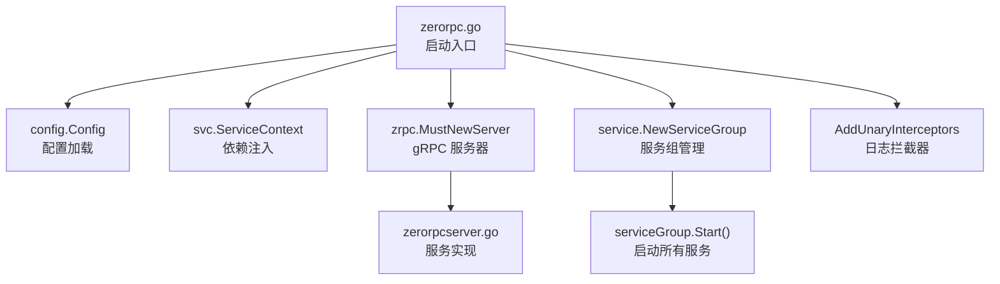
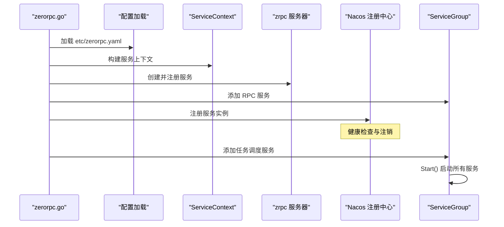
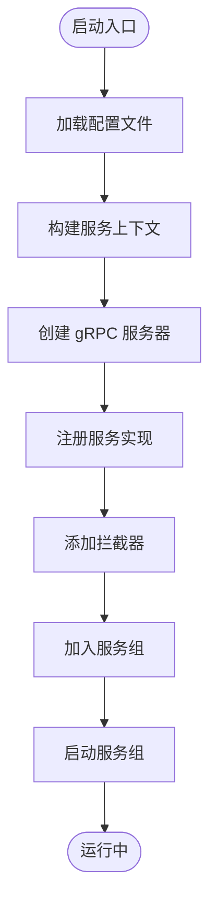
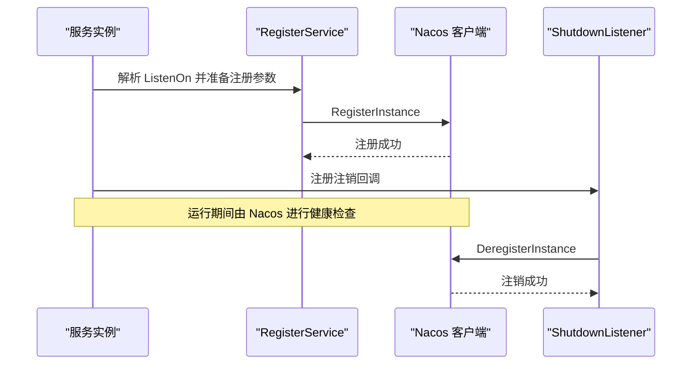
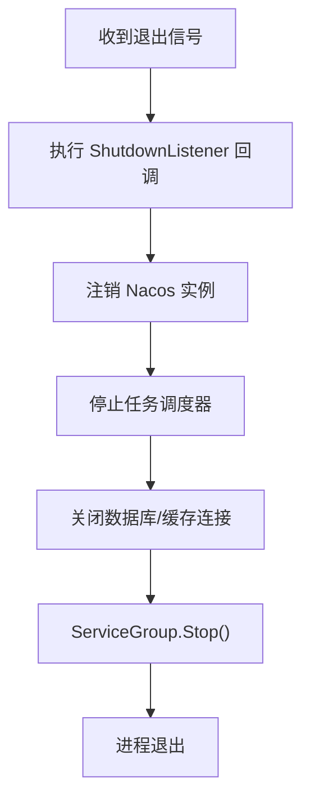
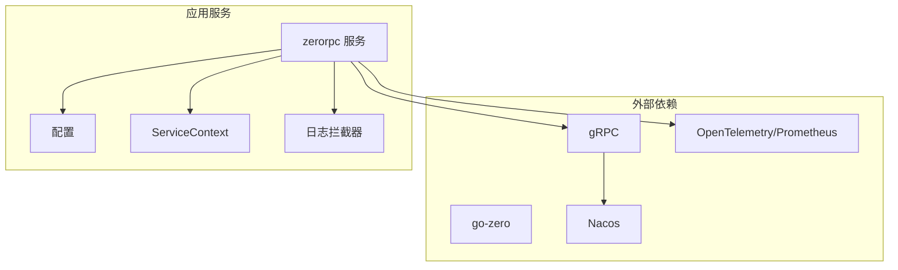

# 服务生命周期管理

<cite>
**本文引用的文件**
- [go.mod](file://go.mod)
- [README.md](file://README.md)
- [register.go](file://common/nacosx/register.go)
- [config.go](file://common/nacosx/config.go)
- [loggerInterceptor.go](file://common/Interceptor/rpcserver/loggerInterceptor.go)
- [zerorpc.go](file://zerorpc/zerorpc.go)
- [zerorpc.yaml](file://zerorpc/etc/zerorpc.yaml)
- [config.go](file://zerorpc/internal/config/config.go)
- [servicecontext.go](file://zerorpc/internal/svc/servicecontext.go)
- [zerorpcserver.go](file://zerorpc/internal/server/zerorpcserver.go)
</cite>

## 目录
1. [引言](#引言)
2. [项目结构](#项目结构)
3. [核心组件](#核心组件)
4. [架构总览](#架构总览)
5. [详细组件分析](#详细组件分析)
6. [依赖分析](#依赖分析)
7. [性能考虑](#性能考虑)
8. [故障排查指南](#故障排查指南)
9. [结论](#结论)
10. [附录](#附录)

## 引言
本文件围绕 Zero-Service 的服务生命周期管理进行系统化梳理，重点覆盖以下方面：
- gRPC 服务启动流程：服务初始化、配置加载、依赖注入、拦截器与服务组管理
- 服务注册与发现：基于 Nacos 的服务注册、健康检查、优雅下线与注销
- 优雅关闭：信号处理、资源清理、连接断开与任务停止
- 配置管理最佳实践：配置热更新、环境变量处理、默认值设置
- 监控与指标：服务状态、性能指标、错误统计与可观测性

## 项目结构
本项目采用多服务架构，每个服务在独立目录中提供 proto 接口、配置文件、服务上下文与启动入口。以 zerorpc 服务为例，其启动入口负责加载配置、构建服务上下文、注册 gRPC 服务、添加拦截器，并将 RPC 服务与任务调度服务纳入统一的服务组进行生命周期管理。

图表来源
- [zerorpc.go:26-58](file://zerorpc/zerorpc.go#L26-L58)
- [config.go:8-24](file://zerorpc/internal/config/config.go#L8-L24)
- [servicecontext.go:35-101](file://zerorpc/internal/svc/servicecontext.go#L35-L101)
- [zerorpcserver.go:15-90](file://zerorpc/internal/server/zerorpcserver.go#L15-L90)

章节来源
- [README.md:110-188](file://README.md#L110-L188)
- [zerorpc.go:26-58](file://zerorpc/zerorpc.go#L26-L58)

## 核心组件
- 配置加载与解析：通过 go-zero 的 conf.MustLoad 加载 YAML 配置，结合内部 config.Config 结构体完成字段绑定。
- 服务上下文注入：ServiceContext 聚合 Redis、数据库、第三方 SDK、RPC 客户端等依赖，作为服务实现的共享容器。
- gRPC 服务器：使用 zrpc.MustNewServer 创建，注册服务实现，并根据运行模式选择是否启用反射。
- 拦截器：统一的日志拦截器从 gRPC 元数据提取用户标识与追踪 ID，便于日志关联与问题定位。
- 服务组管理：service.NewServiceGroup 将多个服务（如 RPC 与任务调度）统一纳入生命周期管理，确保优雅启动与关闭。

章节来源
- [zerorpc.go:29-57](file://zerorpc/zerorpc.go#L29-L57)
- [config.go:8-24](file://zerorpc/internal/config/config.go#L8-L24)
- [servicecontext.go:35-101](file://zerorpc/internal/svc/servicecontext.go#L35-L101)
- [loggerInterceptor.go:12-44](file://common/Interceptor/rpcserver/loggerInterceptor.go#L12-L44)

## 架构总览
下图展示了 zerorpc 服务的启动与注册流程，以及与 Nacos 的协作关系（注册与注销）。

图表来源
- [zerorpc.go:29-57](file://zerorpc/zerorpc.go#L29-L57)
- [register.go:21-76](file://common/nacosx/register.go#L21-L76)

## 详细组件分析

### gRPC 服务启动流程
- 配置加载：命令行参数指定配置文件路径，使用 conf.MustLoad 完成结构化解析。
- 依赖注入：ServiceContext 负责初始化 Redis、数据库、微信小程序与支付 SDK、告警 RPC 客户端等。
- 服务器创建：zrpc.MustNewServer 构造 gRPC 服务器，注册服务实现；开发/测试模式下启用反射。
- 拦截器：添加日志拦截器，从元数据提取用户与追踪信息，记录错误日志。
- 服务组：将 RPC 服务器与任务调度服务加入 ServiceGroup，统一启动与停止。

图表来源
- [zerorpc.go:29-57](file://zerorpc/zerorpc.go#L29-L57)
- [servicecontext.go:35-101](file://zerorpc/internal/svc/servicecontext.go#L35-L101)

章节来源
- [zerorpc.go:29-57](file://zerorpc/zerorpc.go#L29-L57)
- [loggerInterceptor.go:12-44](file://common/Interceptor/rpcserver/loggerInterceptor.go#L12-L44)

### 服务注册机制（Nacos）
- 注册流程：解析 ListenOn 地址，确定对外 IP 与端口；调用 Nacos Naming 客户端注册实例，设置权重、健康状态、集群与分组等元数据。
- 健康检查：注册时标记 healthy=true；实际健康策略由 Nacos 控制台或探针决定。
- 优雅注销：通过 go-zero 的 proc.AddShutdownListener 注册关闭回调，在进程退出时主动注销实例，避免残留。

图表来源
- [register.go:21-76](file://common/nacosx/register.go#L21-L76)

章节来源
- [register.go:21-76](file://common/nacosx/register.go#L21-L76)
- [config.go:15-37](file://common/nacosx/config.go#L15-L37)

### 优雅关闭实现
- 信号处理：通过 go-zero 的 proc.AddShutdownListener 注册回调，确保在收到系统信号时触发清理流程。
- 资源清理：注销 Nacos 实例、停止任务调度器、关闭数据库与缓存连接等。
- 连接断开：等待正在处理的请求完成，避免强制中断导致的数据不一致。
- 服务组停止：ServiceGroup.Stop() 保证所有加入的服务有序停止。

图表来源
- [register.go:58-73](file://common/nacosx/register.go#L58-L73)

章节来源
- [register.go:58-73](file://common/nacosx/register.go#L58-L73)

### 服务配置管理最佳实践
- 配置文件：各服务在 etc/ 目录下提供 YAML 配置，包含服务监听地址、超时、日志、Redis、数据库、第三方服务等。
- 默认值与环境变量：建议在配置结构体中设置合理默认值；对于敏感信息与运行时差异，优先使用环境变量覆盖。
- 热更新：当前示例未直接展示热更新实现，推荐结合配置中心或文件变更监听机制，配合服务重启或局部刷新策略。
- 字段组织：将不同类型的依赖（如 DB、Cache、Redis、第三方 SDK）分层组织，便于维护与替换。

章节来源
- [zerorpc.yaml:1-39](file://zerorpc/etc/zerorpc.yaml#L1-L39)
- [config.go:8-24](file://zerorpc/internal/config/config.go#L8-L24)

### 监控与指标收集
- 日志拦截器：从 gRPC 元数据提取用户与追踪信息，统一记录错误日志，便于问题定位与审计。
- 链路追踪：配置中预留 Telemetry 字段，可接入 Jaeger/Zipkin 等链路追踪系统。
- 指标导出：结合 Prometheus 与 Grafana，对服务 QPS、延迟、错误率、任务积压等关键指标进行可视化监控。

章节来源
- [loggerInterceptor.go:12-44](file://common/Interceptor/rpcserver/loggerInterceptor.go#L12-L44)
- [zerorpc.yaml:22-27](file://zerorpc/etc/zerorpc.yaml#L22-L27)

## 依赖分析
- 外部依赖：项目使用 go-zero 作为微服务框架，gRPC 作为 RPC 传输层，Nacos 作为服务注册与发现，Prometheus/OpenTelemetry 作为监控与追踪。
- 组件耦合：服务启动入口仅负责装配与启动，具体业务逻辑通过 ServiceContext 注入，降低耦合度，提升可测试性。
- 循环依赖：未发现明显循环导入；服务上下文聚合了多种依赖，但均为单向依赖。

图表来源
- [go.mod:5-62](file://go.mod#L5-L62)
- [zerorpc.go:29-57](file://zerorpc/zerorpc.go#L29-L57)

章节来源
- [go.mod:5-62](file://go.mod#L5-L62)
- [zerorpc.go:29-57](file://zerorpc/zerorpc.go#L29-L57)

## 性能考虑
- 连接池与超时：合理设置数据库与缓存连接池大小与超时时间，避免阻塞与资源耗尽。
- 中间件开销：拦截器应尽量轻量，避免在关键路径上引入额外 IO 或 CPU 开销。
- 并发与限流：在网关或服务入口处实施限流与熔断，防止雪崩效应。
- 监控与告警：建立关键指标阈值与告警，及时发现性能瓶颈与异常波动。

## 故障排查指南
- 启动失败：检查配置文件路径与字段合法性；确认依赖服务（数据库、Redis、Nacos）可达。
- 注册失败：核对 Nacos 地址、鉴权与分组信息；查看注册日志与健康检查结果。
- 请求异常：通过日志拦截器输出的用户与追踪信息定位问题；结合链路追踪系统回溯调用链。
- 优雅关闭：确认 ShutdownListener 是否正确注册；检查注销流程是否成功执行。

章节来源
- [register.go:58-73](file://common/nacosx/register.go#L58-L73)
- [loggerInterceptor.go:12-44](file://common/Interceptor/rpcserver/loggerInterceptor.go#L12-L44)

## 结论
本项目通过 go-zero 的标准化组件实现了清晰的服务生命周期管理：从配置加载、依赖注入、gRPC 服务器创建，到拦截器与服务组统一管理；同时借助 Nacos 实现服务注册与注销，保障了服务的高可用与可观测性。建议在现有基础上进一步完善配置热更新与链路追踪落地，持续优化性能与稳定性。

## 附录
- 服务启动命令示例与配置位置参考项目根目录说明文档。
- 各服务的配置文件均位于 app/{service}/etc/ 目录下，遵循统一命名规范。